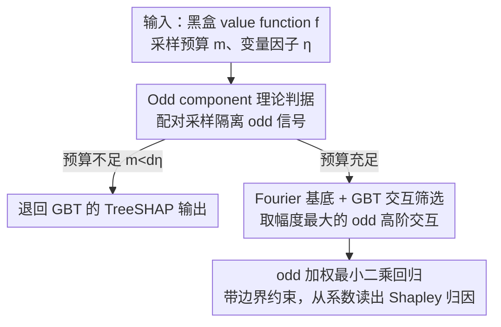

# An Odd Estimator for Shapley Values

**会议**: ICML2026  
**arXiv**: [2602.01399](https://arxiv.org/abs/2602.01399)  
**代码**: https://github.com/FFmgll/oddshap  
**领域**: 可解释性  
**关键词**: Shapley值、特征归因、OddSHAP、配对采样、Fourier回归  

## 一句话总结
这篇论文证明 Shapley value 只依赖集合函数的 odd component，并据此提出 OddSHAP：用配对采样隔离 odd 信号、用 GBT 筛选高阶 odd Fourier 交互、再做稀疏 odd 回归，在中高维解释任务上显著优于灵活预算 Shapley 估计器。

## 研究背景与动机
**领域现状**：Shapley value 是机器学习解释中最常用的特征归因框架之一，它把模型预测视为集合函数 $f:2^{[d]}\to\mathbb{R}$，为每个特征分配平均边际贡献。由于精确计算需要遍历指数级 coalitions，实际方法通常用采样或 surrogate regression 近似，例如 KernelSHAP、LeverageSHAP、Permutation Sampling、SVARM、MSR、PolySHAP 和各类 proxy-based estimator。

**现有痛点**：很多先进估计器都使用 paired sampling，即每采样一个 coalition $S$，同时采样补集 $S^c$。这个技巧经验上有效，但为什么有效并不完全清楚。同时，高阶 polynomial/surrogate estimator 表达力更强，却面临组合爆炸：候选交互项随阶数迅速增长，预算有限时很难同时保持准确和稳定。

**核心矛盾**：Shapley value 只关心能影响边际贡献的函数成分，但传统回归 estimator 往往同时拟合与 Shapley 无关的部分。若估计器把采样预算浪费在 irrelevant even component 或大量低影响交互上，就会增加方差和计算成本。

**本文目标**：作者希望给 paired sampling 一个严格理论解释，并基于这个解释设计一个预算灵活的 Shapley estimator：既能利用高阶交互提升精度，又不必拟合所有高阶项。

**切入角度**：论文从集合函数的 odd/even 分解出发。若定义 $f_{odd}(S)=\frac12(f(S)-f(S^c))$，则 Shapley value 满足 $\phi_i(f)=\phi_i(f_{odd})$。因此估计器可以只拟合 odd component，而把 even component 完全丢弃。

**核心 idea**：把 Shapley 估计从“拟合整个 value function”改成“只拟合 odd Fourier 子空间中对 Shapley 有贡献的稀疏交互”。

## 方法详解

### 整体框架
OddSHAP 要解决的是怎样在有限采样预算下把高维 Shapley value 估得又准又稳。它的关键转换是：不再去拟合整个 value function，而是先用理论证明 Shapley value 只依赖集合函数的 odd 部分，再换到 Fourier 基底里只挑出那些真正对 Shapley 有贡献的稀疏 odd 交互来回归。整个流程是先 paired sampling 采 coalition，再用一个 gradient boosted tree (GBT) 代理模型筛出幅度最大的 odd 高阶交互，最后在精简后的支持集上解带边界约束的加权最小二乘，从 Fourier 系数直接读出归因。

输入是黑盒 value function $f$、采样预算 $m$ 和 regression variable factor $\eta$。如果预算太低连线性项都没法稳定回归（即 $m<d\eta$），算法直接退回 GBT 的 TreeSHAP 输出；否则把候选高阶 odd 交互数量设成 $|T_{odd}|=\lceil m/\eta\rceil-d$，让回归变量数随预算线性增长，而不是随特征数和阶数组合爆炸。论文把整条算法明确写成三步：配对采样、交互筛选、odd 回归，下面的关键设计按这条流向依次展开。

### 关键设计

**1. Odd component 理论判据：解释 paired sampling 为何有效**

传统回归 estimator 会连带拟合与 Shapley 无关的部分，把预算浪费在无效信号上。作者把任意集合函数分解为 $f=f_{odd}+f_{even}$，其中 odd 部分满足 $f_{odd}(S)=-f_{odd}(S^c)$，even 部分满足 $f_{even}(S)=f_{even}(S^c)$，并证明 $\phi_i(f)=\phi_i(f_{odd})$——也就是 even component 对所有特征的 Shapley value 贡献恒为 0。这个判据顺带把工程界常用的 paired sampling（每采一个 coalition $S$ 同时采补集 $S^c$）从"经验降方差技巧"提升成严格结论：paired sampling 本质是在 weighted least squares 目标里把 odd 与 even 两部分正交分解开，让估计器可以干净地丢掉无关的 even 成分。

**2. Fourier 基底 + GBT 交互筛选：在 odd Fourier 子空间挑稀疏高阶交互**

光有理论判据还不够，还得有一个能精确隔离 odd 信号的基底。KernelSHAP/LeverageSHAP 常用的 unanimity basis 做不到干净的奇偶分离，作者改用 Fourier basis：基函数 $\chi_T(S)=(-1)^{|S\cap T|}$ 是否 odd 完全由 $|T|$ 的奇偶决定，$|T|$ 为奇数即 odd term、偶数即 even term，于是"丢弃 even 子空间"在基底层面变得干净利落。但高阶 odd 项依然组合爆炸，而机器学习的 value function 往往只有少数重要交互，枚举所有项既不现实也浪费预算。为此 OddSHAP 用配对采样得到的同一批样本先拟合一个 GBT proxy，再用 ProxySPEX 风格方法提取绝对幅度最大的 odd Fourier 系数，构成回归支持集 $T_{odd}$。支持集大小由变量因子 $\eta$ 控制——令 $|T_{odd}|=\lceil m/\eta\rceil-d$，使回归变量数随采样预算 $m$ 线性增长，而不是随特征数与阶数组合爆炸；预算低到连线性项都拟合不稳（$m<d\eta$）时则直接退回 GBT 的 TreeSHAP 输出避免欠定回归。这样在表达力（能建模高阶交互）和统计稳定性（不被海量低影响项拖累方差）之间取得折中。

**3. odd 加权最小二乘回归：从 Fourier 系数直接读出归因**

拿到支持集后，OddSHAP 在 $T_{\le 1}\cup T_{odd}$（线性项 + 筛出的 odd 高阶交互）上解一个带 Shapley kernel 权重的加权最小二乘，并用严格边界约束保证估计满足 efficiency（所有归因之和等于 $f([d])-f(\emptyset)$）。最终从系数算归因的公式是 $\phi_i(\hat f_{odd})=-2\sum_{T\ni i,\,|T|\ \text{odd}}\beta_T/|T|$，直接在 odd Fourier 子空间里读出每个特征的 Shapley value。这一步是整条管线落地为 Shapley 估计的出口：odd 判据决定了"只拟合 odd"，Fourier 基底 + GBT 筛选决定了"拟合哪些 odd 交互"，受约束回归再把它们变成满足一致性的最终归因。

### 损失函数 / 训练策略
核心优化是带 Shapley kernel 权重的加权最小二乘回归，但只在 odd Fourier 支持上求解。借助 paired samples 预计算 $f_{odd}(S)=\frac12(f(S)-f(S^c))$ 后，可以丢掉补集行，只用 $m/2$ 个代表样本拟合 odd target，把 $m$ 次查询的信息压进一半的回归行。边界约束在回归里显式处理，而不是像部分 KernelSHAP 实现那样用伪无穷权重近似。

## 实验关键数据

### 主实验
实验在 8 个 value functions 上评估 30 个随机预测实例的 Shapley 近似，覆盖语言、图像、表格和合成函数。评价指标是相对 ground-truth Shapley values 的 MSE 中位数和 IQR。

| 数据集 / 函数 | 维度 | 领域 | 本文 | 之前SOTA / 基线 | 提升 |
|---------------|------|------|------|-----------------|------|
| DistilBERT | 14 | language | 与 RegressionMSR 等最佳灵活预算方法相当 | RegressionMSR / LeverageSHAP | 低维下无明显劣势 |
| ViT16 | 16 | image | 与最佳灵活预算方法相当，并优于 FFD corrected 多数设置 | RegressionMSR / FFD variants | 深度模型中高阶交互更活跃 |
| Cancer | 30 | tabular | 中高预算下优于所有 flexible-budget baselines | LeverageSHAP / MSR / SVARM / FourierSHAP | 交互建模带来最高可达 62x MSE 降低 |
| CG60 / IL60 | 60 | synthetic | 预算足够时明显领先灵活预算 baseline | MSR / FourierSHAP / RegressionMSR | 在高维交互函数上优势更明显 |
| NHANES | 79 | tabular | 中高预算下优于灵活预算 baseline | TreeSHAP ground truth 对比 | 随维度升高保持可用 |
| Crime | 101 | tabular | 在运行时-MSE 曲线上保持竞争力 | LeverageSHAP / FFD-RD / Proxy | 灵活预算比固定 $O(d^2)$ 设计更可扩展 |

### 消融实验
论文的消融直接验证了 OddSHAP 的三个核心选择：交互数量、paired sampling 和只保留 odd interactions。

| 配置 | 关键指标 | 说明 |
|------|---------|------|
| $\eta=10$，约 1000 个交互，10000 samples | 所有 value functions 至少 6x MSE 降低，Cancer 最高 62x | 适量 odd 高阶交互显著优于 interaction-free LeverageSHAP |
| $\eta\in\{2,5,10,50\}$ | 交互过多后 MSE 反弹 | 表达力增加会带来过拟合，支持集不应随预算无限扩张 |
| Paired + Odd interactions | 作为归一化最佳配置 | 直接隔离 odd component，预算集中在对 Shapley 有贡献的项上 |
| Paired + All interactions | MSE 略差且更慢 | even terms 会数学上抵消，却占用交互预算和计算时间 |
| Non-paired sampling | 整体弱于 paired sampling | 没有 paired structure 时 odd/even 分离不干净，估计更不稳定 |
| FFD-RD fixed-budget | 树模型上强，深度模型上退化 | 依赖高阶交互截断假设，且 $O(d^2)$ 严格样本需求在高维不灵活 |

### 关键发现
- paired sampling 的价值被严格解释为 even-odd separation，而不是单纯经验降方差。
- OddSHAP 在低维任务中不牺牲性能，在中高维任务中凭借稀疏 odd interaction 建模明显优于灵活预算 baseline。
- even interactions 对 Shapley value 没有贡献；在 paired sampling 下继续拟合 even terms 只会分走预算并增加运行时间。

## 亮点与洞察
- 论文把一个常用工程技巧提升为清晰理论：paired sampling 正是在估计 odd component。这个解释非常简洁，也能指导新 estimator 设计。
- Fourier basis 的选择很漂亮。它不是为了数学形式好看，而是因为 odd/even 可以直接由 interaction order 判断，使算法能精确丢掉无关子空间。
- GBT proxy 的角色定位合理：它不直接作为最终解释器，而是帮助找到稀疏高影响交互，再由受约束回归保证 Shapley consistency。
- 这篇论文对解释方法有一个重要提醒：估计 value function 本身不等于估计归因所需的全部信息。只拟合归因相关子空间，可能比拟合完整函数更高效。

## 局限与展望
- OddSHAP 的回归阶段随选中交互数二次增长；若交互数继续绑定采样预算，整体开销可随 $m$ 近似三次增长。作者建议在大预算下给交互数设上限并与 $m$ 解耦。
- paired sampling 会把 $m$ 次查询压成 $m/2$ 个独立行，减少独立 subset coverage，可能增加方差和 mutual coherence；因此它不保证在所有函数上都优于 non-paired sampling。
- 交互筛选依赖 GBT proxy。若 proxy 无法捕捉真实 value function 的重要 Fourier interactions，OddSHAP 可能漏掉关键高阶项。
- 固定 $\eta=10$ 在实验中稳健，但不同领域、维度和 value function 评估成本下，如何自适应选择 $\eta$ 仍值得进一步研究。

## 相关工作与启发
- **vs KernelSHAP / LeverageSHAP**: 它们本质上做低阶/线性 surrogate regression；OddSHAP 保留一致性的同时加入筛选出的 odd 高阶交互，因此能在复杂 value functions 上降低偏差。
- **vs PolySHAP**: PolySHAP 扩展到多项式回归，但候选项存在组合爆炸；OddSHAP 用 Fourier odd 子空间和 GBT screening 控制支持大小。
- **vs RegressionMSR / ProxySPEX**: Proxy 方法利用学习器逼近 value function，OddSHAP 则把 proxy 用作交互筛选器，最终仍通过严格回归和边界约束计算 Shapley。
- **vs FFD-RD**: FFD 利用固定组合设计和高阶截断假设，在树模型上很强；OddSHAP 更灵活，尤其适合深度模型或高阶交互活跃的函数。

## 评分
- 新颖性: ⭐⭐⭐⭐⭐ odd component 判据和 OddSHAP 设计都很有洞察力，理论与算法结合紧密。
- 实验充分度: ⭐⭐⭐⭐⭐ 覆盖 8 个 value functions、多类 baseline、runtime、交互稀疏和 paired sampling 消融，支撑充分。
- 写作质量: ⭐⭐⭐⭐☆ 结构清楚，但 Fourier/Shapley 理论密度较高，部分读者需要背景知识。
- 价值: ⭐⭐⭐⭐⭐ 对可解释性中的 Shapley 估计、采样设计和高阶交互归因都有直接价值。

<!-- RELATED:START -->

## 相关论文

- [\[NeurIPS 2025\] Practical do-Shapley Explanations with Estimand-Agnostic Causal Inference](../../NeurIPS2025/causal_inference/practical_do-shapley_explanations_with_estimand-agnostic_causal_inference.md)
- [\[ICML 2026\] Causal-JEPA: Learning World Models through Object-Level Latent Masking](causal-jepa_learning_world_models_through_object-level_latent_masking.md)
- [\[ICML 2026\] Evaluating Bivariate Causal Statements Based on Mutual Compatibility](evaluating_bivariate_causal_statements_based_on_mutual_compatibility.md)
- [\[ICML 2026\] The (Marginal) Value of a Search Ad: An Online Causal Framework for Repeated Second-price Auctions](the_marginal_value_of_a_search_ad_an_online_causal_framework_for_repeated_second.md)
- [\[ICML 2026\] Density-Guided Robust Counterfactual Explanations on Tabular Data under Model Multiplicity](density-guided_robust_counterfactual_explanations_on_tabular_data_under_model_mu.md)

<!-- RELATED:END -->
