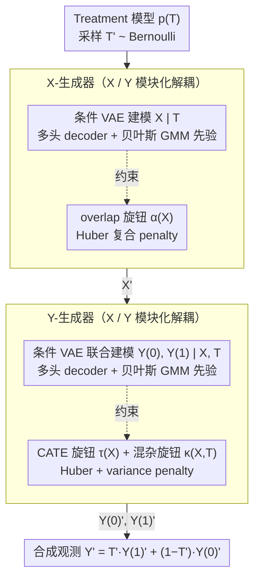

# Controllable Generative Sandbox for Causal Inference

**会议**: ICML 2026  
**arXiv**: [2603.03587](https://arxiv.org/abs/2603.03587)  
**代码**: https://github.com/zhangqiecho/causalmix  
**领域**: 因果推断 / 医学统计；生成模型用于方法学验证；synthetic data benchmark  
**关键词**: CausalMix、conditional VAE、Bayesian GMM prior、overlap regularizer、CATE benchmarking

## 一句话总结
本文提出 CausalMix：一个变分生成框架，把数据类型特定的 multi-head decoder + Bayesian Gaussian 混合潜在 prior 与三类可独立调控的因果"旋钮"（overlap $\alpha(X)$、CATE 函数 $\tau(X)$、未观测混杂 $\kappa(X,T)$）联合优化，从而在保持真实数据分布 fidelity 的前提下让用户自由设计 counterfactual benchmark，在 mCRPC（前列腺癌）真实病例上验证 CausalMix 既能高保真复现 mixed-type 表格，又能稳定地按需注入 overlap / confounding / 异质效应，用作 CATE 估计器的可控 stress test。

## 研究背景与动机

**领域现状**：因果推断方法（meta-learners、DR-learners、DML、causal forest、BCF）的评估高度依赖**有 ground-truth counterfactual 的合成数据**——真实数据上没人能同时观察到 $Y(1)$ 和 $Y(0)$。三类常见 simulator：纯参数化（可控但不真实）、半合成（用真实 X 模拟 T/Y，控制有限）、数据拟合型生成器（RealCause、WGAN、Credence 等用神经模型拟合 DGP，真实但因果可控性弱）。

**现有痛点**：(i) 现有 data-fit 生成器在 **mixed-type 表格**（连续 + 二元 + 类别 + 整数混合）上保真度差，要么强行 one-hot 引入伪相关，要么用单一 likelihood 损失多元结构；(ii) **因果旋钮缺失或耦合**——RealCause 只能在已拟合的极值之间插值，WGAN 完全没有效应控制接口，Credence 支持指定但缺乏对 mixed-type 多模态数据的支持；(iii) 即使能指定 $\tau(X)$，没有机制**验证生成器是否真的实现了**它，尤其当因果函数是低维/弱非线性时容易被 reconstruction loss 淹没。

**核心矛盾**：分布真实性（fit observed data）和因果可控性（faithfully realize user-specified $\tau, \kappa, \alpha$）是天然 trade-off——拟合得越紧，自由度越小；自由度越大，与真实数据偏离越远。现有方法要么牺牲后者（神经生成器）要么牺牲前者（参数化 simulator）。

**本文目标**：(i) 在一个统一目标下联合优化分布 fidelity 与因果约束，避免二选一；(ii) mixed-type tabular data 上做到高保真；(iii) 提供 overlap / confounding / heterogeneity 三个**正交、可独立调控**的因果旋钮，并附带量化验证 pipeline；(iv) 在真实临床场景（mCRPC 安全性比较）中证明其实用价值。

**切入角度**：用 conditional VAE 作为生成 backbone（已被证明在 tabular 上 stable + 解析 ELBO），把因果约束写成关于 decoder 输出的可微分 penalty，让 mean alignment + variance regularization 保证低维因果函数也能被忠实实现；再用 Bayesian GMM 替换 isotropic Gaussian prior 来恢复 mixed-type 数据的多模态结构。

**核心 idea**：把"分布拟合"和"因果调控"做成同一个 unified loss 的两组项，由 rigidness 超参 $\lambda_\alpha, \lambda_\tau, \lambda_\kappa$ 显式控制；mixture prior 处理多模态，multi-head decoder 处理 mixed types，三层 penalty 处理三个因果维度——一个工具同时解决 fidelity + control + mixed-type。

## 方法详解

### 整体框架
观测 $\mathcal{O} = (X, T, Y)$，$X$ 为 mixed-type 协变量、$T\in\{0,1\}$、$Y$ 为结局。学习一个生成器 $G_\theta$ 模块化为三部分：

- **Treatment 模型** $p(T)$：Bernoulli；
- **Pre-treatment 模型** $G_{X,\theta}$：条件 VAE 建模 $X\mid T$；
- **Post-treatment 模型** $G_{Y,\theta}$：条件 VAE 联合建模 $(Y(0), Y(1))\mid X, T$，**同时给出两个 potential outcomes**。

生成时按 $T'\to X'\mid T'\to (Y'(0), Y'(1))\mid X', T'\to Y' = T'Y'(1)+(1-T')Y'(0)$ 顺序采样。Decoder 使用 multi-head：连续→Gaussian、二元→Bernoulli、类别→softmax。训练后用 Bayesian GMM (Dirichlet-process prior) 替代标准 Gaussian latent prior。

**统一目标**：
$$\mathcal{L}(\theta) = \mathcal{L}_{\text{VAE}} + \lambda_\alpha \mathcal{L}_\alpha + \lambda_\tau \mathcal{L}_\tau^{\text{mean}} + \lambda_\tau^{\text{var}}\mathcal{L}_\tau^{\text{var}} + \lambda_\kappa \mathcal{L}_\kappa^{\text{mean}} + \lambda_\kappa^{\text{var}}\mathcal{L}_\kappa^{\text{var}}$$

### 关键设计

**1. 三个独立的因果"旋钮" + Huber 复合 penalty：让用户能调、且保证真调进去了**

现有生成器要么没有效应控制接口，要么即便能指定 $\tau(X)$ 也无法验证生成器是否真的实现了它。CausalMix 把三个因果量显式定义出来——overlap $\alpha(x) = P(X=x\mid T=0)/P(X=x\mid T=1)$、CATE $\tau(x) = \mathbb{E}[Y(1)-Y(0)\mid X=x]$、未观测混杂 $\kappa(x,t) = \mathbb{E}[Y(t)\mid X=x,T=1] - \mathbb{E}[Y(t)\mid X=x,T=0]$——再把"用户指定值"与"生成器诱导值"之差写成可微 penalty 压进 loss。Overlap 用 $\mathcal{L}_\alpha = \mathbb{E}_X[(\log\alpha_\theta(X) - \log\alpha(X))^2]$，直接对 decoder 给出的 log-density ratio 做 MSE 对齐。CATE 与 confounding 则不止用 MSE：

$$\mathcal{L}_\tau^{\text{mean}} = \mathbb{E}_X[\lambda_\tau^{\text{mse}}(\Delta\tau_\theta)^2 + \lambda_\tau^{\text{sl1}}\text{SmoothL1}(\Delta\tau_\theta)]$$

这是个 **Huber 复合 loss**——quadratic 项锚定 mean，SmoothL1 项提升对异常值和弱识别区域的鲁棒性——再外加 variance penalty $\mathcal{L}_\tau^{\text{var}} = \text{Var}[\Delta\tau_\theta]$ 抑制虚假的 unit-level 离散；$\kappa$ 用同样的 Huber + variance 结构。之所以不能只用纯 MSE，是因为当 $\tau, \kappa$ 低维/弱非线性时，因果信号会被 reconstruction loss 淹没——模型学到 "$\tau_\theta$ 平均对就行"但 unit-level 飘忽不定；Huber 锚定 mean、variance regularizer 压缩 dispersion，两者合力让因果约束在低信号场景也能稳定实现。三个 $\lambda$ 可独立调，用户因此能做 factorial study：同时变 overlap 和 confounding，看各类 CATE 估计器的稳健性。

**2. Mixed-type multi-head decoder + Bayesian GMM prior：忠实重现真实表格的混合类型与多峰结构**

真实临床表格是连续 + 二元 + 类别 + 整数混在一起，强行 one-hot 或用单一 likelihood 会引入伪相关。CausalMix 给每个变量按数据类型配一个独立的 likelihood head——连续变量用 Gaussian NLL（而非 Credence 用的 MSE），让 decoder 同时学到 location 与 dispersion；二元用 Bernoulli logits；类别用 softmax；整数当连续处理后 round。这里 Gaussian NLL 取代 MSE 是个被低估的细节：MSE 不学方差，对 heteroscedastic 或受限支撑的变量会梯度尺度失衡。另一处关键是潜在 prior——标准 isotropic Gaussian 假设潜在空间单峰，而真实病人天然 cluster 成多个亚群。CausalMix 在 VAE 训练完后用 BGMM（Dirichlet-process prior + 截断 stick-breaking 变分推断）重新拟合 latent means 作为生成 prior：

$$p_{\text{BGMM}}(z) = \sum_k \pi_k \mathcal{N}(z\mid\mu_k, \Sigma_k)$$

其中混合数 $K$ 由 Dirichlet-process 自动学到。这是**事后拟合**——不改 VAE 训练目标、不动 decoder，只在 latent space 后处理就恢复了多模态表达力，是个"巧而非繁"的工程选择。

**3. 联合优化 + X/Y 模块化解耦：分布拟合与因果控制同台 co-train，但两个生成器各管各的**

distributional fit 与 causal control 是天然 trade-off，CausalMix 把它们放进同一个 mini-batch 一起优化，但把 X-generator 与 Y-generator 拆开各自独立训练。Pre-treatment $G_{X,\theta}$ 只优化 $\mathcal{L}_{\text{VAE}}^X + \lambda_\alpha\mathcal{L}_\alpha$（X 重建 + overlap 控制）；Post-treatment $G_{Y,\theta}$ 优化 $\mathcal{L}_{\text{VAE}}^Y + \lambda_\tau\mathcal{L}_\tau^{\text{mean}} + \cdots + \lambda_\kappa\mathcal{L}_\kappa^{\text{mean}} + \cdots$，并基于 validation loss 早停。拆开是因为 X 与 Y 的因果机制不同——X 上的 overlap 是边缘分布问题，Y 上的 $\tau,\kappa$ 是 conditional expectation 问题——分开训练让每个模块的 rigidness 超参单独可调，避免一个模块的 penalty 干扰另一个。这里最关键的一步是 $G_{Y,\theta}$ 训练时让 decoder 同时评估 $Y(0)$ 和 $Y(1)$ 两个 potential outcome（即便每个样本只观察到一个），$\tau_\theta, \kappa_\theta$ 才得以直接计算并被 penalty 监督——这正是因果控制能"真实生效"而非"看起来对"的根源，也是与 Credence 等只建模 $Y\mid X,T$ 方法的本质区别。

### 损失函数 / 训练策略
- 优化器：Adam (lr = $10^{-3}$)，80/20 train/val 划分，PyTorch Lightning；
- 关键超参：$\lambda_\tau, \lambda_\kappa$ 固定在 $10^3$；$\lambda_\alpha$ 在 $10^1\text{–}10^2$（overlap 对 misspecification 更敏感）；
- 当 control function 低维/弱非线性时：减小 MSE 权重 (0.2–0.4)、放大 SmoothL1 + variance reg；
- 训练完后 fit BGMM (DP prior, max K = latent dim) 作为生成 prior。

## 实验关键数据

### 主实验（mCRPC 病例：abiraterone vs enzalutamide，4,098 名患者，18 个 baseline 协变量）

| 场景 | 设置 | 关键现象 |
|------|------|---------|
| Scenario 1 | $\tau\equiv 0.1, \kappa\equiv 0, \log\alpha\equiv 0$（恒定效应、无混杂、完美 overlap） | sanity check：BGMM 与 Gaussian prior 均成功恢复 |
| Scenario 2 | 线性 $\tau$（CVD、age、Charlson），$\kappa\equiv 0.02$，$\log\alpha\equiv 1$ | 两 prior 都还行，BGMM 略优 |
| **Scenario 3** | 非线性 tanh $\tau$（CVD、age、Charlson、dementia），$\kappa$ 与 $X,T$ 联合依赖，$\log\alpha = 2(2\cdot\text{Abi\_prev}-1)$ | **BGMM 大幅胜出**：CATE correlation、decoder-level overlap reconstruction 显著优于 Gaussian |

### 消融实验

| 配置 | 关键效果 | 说明 |
|------|---------|------|
| Gaussian prior vs BGMM | Scenario 3 下 BGMM 全面胜出 | 多模态 prior 对复杂场景必要 |
| Gaussian NLL vs MSE（continuous） | NLL 显著更好（尤其异质方差变量） | 学方差才能正确建模 |
| 复合 Huber (MSE+SmoothL1+var) vs 纯 MSE | 低维 $\tau$ 下 Huber 稳定，纯 MSE 飘 | variance regularizer 是关键稳定器 |
| 隐私 trade-off | Gaussian prior 隐私更强，BGMM 略弱但 protection > 0.5 | 现实主义换隐私的可控 trade-off |

### 关键发现
- **BGMM 价值随因果复杂度放大**：Scenario 1/2 下两种 prior 都还可以，到 Scenario 3 BGMM 在 normalized Wasserstein、C2ST、CATE correlation、overlap reconstruction 上全面碾压 Gaussian——多模态 prior 是处理多峰临床数据的必备。
- **隐私-真实性 trade-off 是受控的**：BGMM 因更逼真而隐私保护稍弱，但 DCR protection fraction 仍 $>0.5$、median distance ratio $>1$，没有系统性记忆；下降集中在低分位（局部 proximity 而非广泛泄露）。
- **因果旋钮被忠实实现**：在 Scenario 3 复杂场景下，CATE MAE / Pearson、$\kappa$ MAE、overlap MSE 都达到可接受精度，证明 unified loss 与 Huber + variance reg 的设计有效。
- **CATE estimator benchmarking**：在 Scenario 3 calibrated DGP 上把 X-learner、DR-learner、DML、Causal Forest、BCF 同台比较（Fig. 4），可以观察哪类估计器在哪种 overlap/confounding 区域更稳——这正是 CausalMix 的应用价值。
- **Causal Forest 超参敏感性可视化**（Fig. 5）：PEHE 对 min leaf size 在 Scenario 3 DGP 下呈非平凡形状，给出"在你的临床场景下该怎么调"的直接答案——这是参数化 simulator 永远给不出的洞察。

## 亮点与洞察
- **"真实性 + 可控性"不再是 trade-off**：unified loss 把两者放在一个目标里，rigidness 超参给用户显式调节权重，让 benchmark 设计者第一次可以"两全其美"。
- **多 head decoder + Gaussian NLL 是被低估的细节**：很多 tabular 生成模型用 MSE 当 reconstruction，会让 heteroscedastic 变量梯度失衡；本文换成 NLL 看似小改动，实际是 mixed-type 表格保真的核心。
- **BGMM 事后拟合的工程哲学**：不动 VAE 训练目标，只在 latent space 后处理——既增加表达力又不打破训练稳定性，是个"巧而非繁"的设计。
- **联合建模两个 potential outcomes**：相比 Credence 只建模 $Y\mid X,T$，本文让 decoder 同时输出 $Y(0), Y(1)$，使 $\tau_\theta$ 可直接计算并被 penalty 监督——这是 causal control 能"真实生效"而非"看起来对"的关键。
- **完整的 evaluation pipeline**：分布 fidelity（marginal/pairwise/conditional/joint）+ 因果 fidelity（MAE/correlation/Wasserstein）+ 隐私（DCR）三层评估，为后续 causal sandbox 论文设定了 evaluation 范式。
- **真实临床落地**：不只是 toy benchmark，而是在前列腺癌真实病例上做了 CATE estimator benchmarking、超参 tuning、power analysis 三个具体应用，对临床统计学家有直接价值。

## 局限与展望
- **依赖正确指定的因果函数**：用户必须先写出 $\tau(X), \kappa(X,T), \alpha(X)$ 的解析式；对真实临床中"未知形状"的因果函数无能为力——本质上是 benchmarking 工具而非 discovery 工具。
- **未观测混杂的建模仍是黑箱**：$\kappa(X,T)$ 通过 decoder 输出的两组 potential outcome 之差实现，但没有显式 latent confounder 变量；难以模拟"strong unobserved confounder 通过特定机制影响 T 与 Y"这种结构化场景。
- **高维 X 下的 multi-head decoder 复杂度**：每个变量一个 head，扩展到几百维表格时网络规模膨胀，论文实验只用 18 维。
- **超参敏感性未充分研究**：rigidness $\lambda_\tau, \lambda_\kappa, \lambda_\alpha$ 的设置依赖经验（$10^3, 10^3, 10^{1\text{-}2}$），缺乏自动选择方案；不同 $\lambda$ 组合下 fidelity vs control 的 Pareto front 没有量化。
- **Variance regularizer 可能过度抑制真实异质性**：在合法的高异质场景下，variance penalty 会把真实 unit-level dispersion 也压平；缺乏识别"真异质 vs 噪声"的机制。
- **未覆盖 longitudinal / survival outcome**：当前只支持单时间点二元 treatment + 标量 outcome；纵向数据、time-varying confounding、生存分析是临床常见但本文未支持的场景。

## 相关工作与启发
- **vs RealCause (Neal 2020)**：RealCause 用 normalizing flow，因果控制只能在已拟合极值间插值；CausalMix 允许设计任意 $\tau, \kappa, \alpha$ 且有显式 penalty 保证实现。
- **vs WGAN-based generators (Athey 2024)**：WGAN 强在分布拟合但完全没有效应控制接口；CausalMix 把因果约束写进 loss。
- **vs Credence (Parikh 2024)**：Credence 也允许 prespecify $\tau, \kappa$，但用 MSE + 不支持 multi-modal / multi-type；本文用 Huber + BGMM + multi-head 三管齐下，对 mixed-type 多模态真实数据更稳。
- **vs Frengression (Zhang 2026)**：Frengression 控制边际因果量，不支持 conditional CATE / overlap / 未观测混杂的细粒度指定。
- **vs Plasmode simulations**：传统 plasmode 用真实 X + 已知 Y 模型注入 truth，CausalMix 把这个范式扩展到完全合成的 $X', T', Y'$，并且让 $X$ 也是生成的。
- **启发**：unified objective + 解耦的 penalty 这一设计可迁移到其他"既要拟合数据又要满足结构约束"的场景，如 fair generation（fit + group fairness）、constrained simulation（fit + physical laws）等。

## 评分
- 新颖性: ⭐⭐⭐⭐ 把 mixed-type VAE + 多模态 prior + 三层因果 penalty 拼成统一 framework 是有意义的整合，Huber + variance reg 处理弱信号是细致的工程贡献；但单个组件均非首创。
- 实验充分度: ⭐⭐⭐⭐ 3 个递进复杂度场景 + BGMM 消融 + 完整的 fidelity / causal / privacy 三层评估 + 真实临床案例 + CATE estimator benchmarking + 超参 sensitivity + power analysis；评估 pipeline 设立了行业标杆。
- 写作质量: ⭐⭐⭐⭐ Method 部分组织清晰、loss 与设计动机讲得透；少数符号（如 $\kappa$ 与 $\alpha$ 的方向约定）需要反复对照；统计学读者友好但 ML 读者需适应 causal notation。
- 价值: ⭐⭐⭐⭐ 对临床统计学家、causal ML 方法学研究者、医药公司的 RWE 团队都有直接价值；公开代码 + 真实临床案例增强了可复现性与 traction。

<!-- RELATED:START -->

## 相关论文

- [\[ICML 2026\] Tailoring Strictly Proper Scoring Rules for Downstream Tasks: An Application to Causal Inference](tailoring_strictly_proper_scoring_rules_for_downstream_tasks_an_application_to_c.md)
- [\[ICML 2025\] Causal Abstraction Inference under Lossy Representations](../../ICML2025/causal_inference/causal_abstraction_inference_under_lossy_representations.md)
- [\[CVPR 2026\] CGU-Bayes: Causal Graph Uncertainty-Guided Bayesian Inference for Domain Generalization](../../CVPR2026/causal_inference/cgu-bayes_causal_graph_uncertainty-guided_bayesian_inference_for_domain_generali.md)
- [\[ACL 2026\] Learning Invariant Modality Representation for Robust Multimodal Learning from a Causal Inference Perspective](../../ACL2026/causal_inference/learning_invariant_modality_representation_for_robust_multimodal_learning_from_a.md)
- [\[AAAI 2026\] Causal Inference Under Threshold Manipulation: Bayesian Mixture Modeling and Heterogeneous Treatment Effects](../../AAAI2026/causal_inference/causal_inference_under_threshold_manipulation_bayesian_mixtu.md)

<!-- RELATED:END -->
