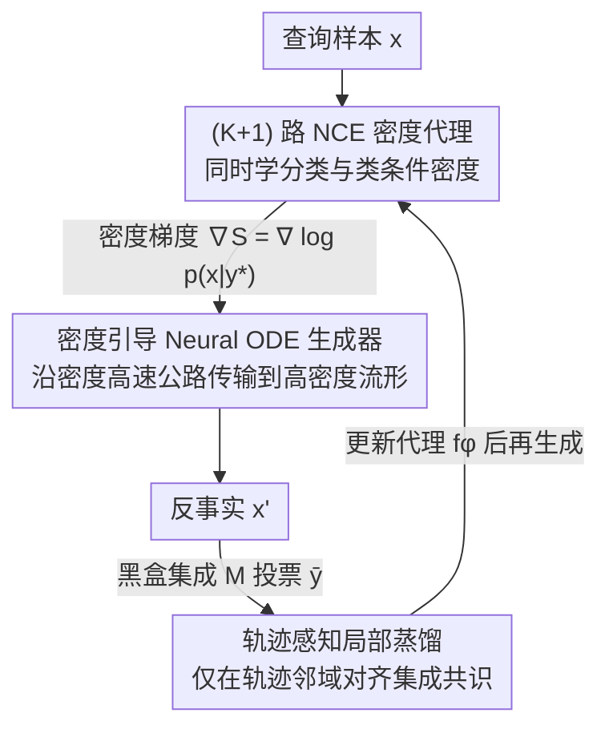

# Density-Guided Robust Counterfactual Explanations on Tabular Data under Model Multiplicity

**会议**: ICML 2026  
**arXiv**: [2605.30901](https://arxiv.org/abs/2605.30901)  
**代码**: https://github.com/G-AILab/DensityFlow (有)  
**领域**: 可解释性 / XAI / 反事实解释 / 表格数据  
**关键词**: 反事实解释、模型多重性、Neural ODE、噪声对比估计、密度引导  

## 一句话总结
DensityFlow 把"在模型多重性下生成鲁棒反事实解释 (RCE)"重新表述为带密度约束的最优传输问题，用 NCE 训练一个 (K+1) 类判别器同时学分类与类条件密度，再用 Neural ODE 把查询样本沿密度梯度运到目标类高密度流形上，并在黑盒场景下只对生成轨迹做局部蒸馏对齐，从而以远低于集成基线的查询量取得更高的跨模型 validity。

## 研究背景与动机

**领域现状**：反事实解释 (CE) 给定一个查询样本和目标类别 $y^*$，找到代价最小的扰动 $x'$ 使 $h(x')=y^*$，是算法 recourse 与高风险决策可解释性的核心工具。近期主流从逐样本优化转向生成式范式：VAE、扩散、normalizing flow 学一个数据流形先验，再在隐空间里搜或生成 CE，以保证可行性与真实性。

**现有痛点**：在模型多重性 (Model Multiplicity, MM) 设定下，多个性能相当但决策边界不同的"合理"分类器 $\{h_j\}$ 会让"对某个模型有效的 CE"在换模型后失效——这就是经典的 Rashomon effect。生成式方法没显式区分类内"核心高密度区"与"长尾低密度区"，距离最小化天然把 $x'$ 往两类边界附近的稀疏区拉，正好落在不同模型分歧最大的位置；而显式做 ensemble consensus 的方法 (MILP、规则法、随机重训) 查询量极大、扩展性差。

**核心矛盾**：鲁棒性要求 $x'$ 落在目标类高密度区（模型一致性强），代价最小化又把 $x'$ 拉向决策边界附近（必然进入低密度长尾），两者直接对立；同时黑盒场景下没有梯度，全空间对齐 surrogate 又不现实。

**本文目标**：(i) 在生成式框架内显式建模并使用类条件密度 $p(x|y^*)$ 来"挡住"低密度区；(ii) 在黑盒异构集成下用尽量少的查询完成 surrogate 与目标模型的边界对齐。

**切入角度**：把"validity + density"耦合进同一个 surrogate——用 (K+1) 路 NCE 让一个网络同时做分类与密度比估计，避免单独训练密度估计器对稀疏离群点过拟合；再把生成过程写成 Neural ODE，密度信号作为势函数自然进入流场动力学，且因为 ODE 轨迹本身光滑，只在端点施加密度约束就能拉住整条轨迹。

**核心 idea**：把鲁棒反事实重写为密度约束最优传输 $\min c(x,x')\ \text{s.t.}\ \mathbb{E}_{\mathcal{M}}[h(x')]=y^*,\ p(x'|y^*)\ge\tau\cdot p_{\text{ref}}$，再用 NCE 密度梯度引导 Neural ODE 走"高密度高速公路"，黑盒只在轨迹邻域局部蒸馏。

## 方法详解

### 整体框架
DensityFlow 要为查询样本 $x$ 生成一个对整个黑盒集成 $\mathcal{M}=\{h_j\}_{j=1}^m$ 都成立的反事实 $x'$，核心洞察是"模型分歧最大的地方恰好是数据低密度区"，于是把鲁棒性问题转化成"把样本运到目标类高密度流形上"。整套系统由两个交替优化的网络构成：一个代理网络 $f_\phi$ 同时学分类与类条件密度，给出可微的密度引导信号；一个 Neural ODE 生成器 $v_\theta$ 按这个信号把 $x$ 连续传输到终点 $x'$，并在黑盒场景下额外用一步局部蒸馏把代理网络的边界拉回集成共识。

### 关键设计

**1. (K+1) 路 NCE 密度代理：让一个网络同时给出分类与密度**

传统做法是先用 VAE/KDE/LOF 单独训一个密度估计器再"挂"到 CE 优化外面，但稀疏离群点会严重扭曲密度，而且密度信号和分类信号互相脱钩——密度觉得 OK 的地方分类器未必有把握。DensityFlow 把两者塞进同一个代理网络 $f_\phi:\mathcal{X}\to\mathbb{R}^{K+1}$ 联合训练：把原 $K$ 类分类扩成 $K+1$ 路判别，前 $K$ 类喂真实数据 $\mathcal{D}_{\text{src}}$，第 $K+1$ 类喂从均匀分布 $p_{\text{noise}}$ 采的"噪声样本"（标准化后落在 $[-C,C]^d$ 立方体内），用交叉熵联合训 $\mathcal{L}_{\text{surrogate}}=-\mathbb{E}_{\mathcal{D}_{\text{src}}}\log\frac{e^{z_y}}{\sum e^{z_j}}-\mathbb{E}_{p_{\text{noise}}}\log\frac{e^{z_{K+1}}}{\sum e^{z_j}}$。

这样设计的好处由命题 4.1 给出理论保证：当 $p_{\text{noise}}$ 为均匀分布时，最优解满足 $z_k^*(x)-z_{K+1}^*(x)=\log p(x|k)+\text{Const}$，所以相邻两个 logit 之差 $S(x|y^*)=z_{y^*}(x)-z_{K+1}(x)$ 直接就是类条件对数密度的无偏估计，其梯度 $\nabla_x S(x|y^*)=\nabla_x\log p(x|y^*)$ 可以原封不动作为生成器的密度引导信号；信任域阈值 $\tau$ 则通过 noise/data 采样比 $N_{\text{noise}}/N_{\text{data}}$ 显式控制。因为密度天然带上了"分类置信度"维度，surrogate 对长尾不敏感，给生成器一个平滑、与决策一致的引导面。

**2. 密度引导 Neural ODE 生成器：把约束写成势函数让轨迹自然绕开低密度区**

有了密度信号，怎么让"从查询点出发、代价最小、终点落在高密度目标类流形"这三个目标可端到端优化？DensityFlow 把生成过程写成一个连续流动力系统，而不是对静态约束做 KKT/拉格朗日硬优化——后者要显式处理约束，前者只要把密度梯度 $\nabla S$ 当漂移项塞进流场，轨迹就会"自然绕开"低密度区。具体把状态增广成 $\tilde z(t)=[z(t),e(t)]^\top$，动力学 $d\tilde z/dt=[v_\theta(z,t);\ \|v_\theta(z,t)\|^2]$，初值 $\tilde z(0)=[x;0]$，用 dopri5 adaptive solver 在 $t\in[0,1]$ 上积分 100 个时间点。增广的第二维妙在端点 $e(T)=\int_0^T\|v_\theta\|^2dt$ 恰好等于传输动能，可直接当代价 $\mathcal{L}_{\text{cost}}$，省去单独算 $\|x-x'\|$。

密度约束本可写成沿整条路径的积分 $\mathcal{L}_{\text{den}}=\int_0^T\text{ReLU}(\log\tau-S(z(t)|y^*))dt$，但论文发现 ODE 轨迹本身足够光滑，只在端点惩罚就足以把整条轨迹拉进信任域，于是实现里用端点版省算力——这是对 Neural ODE 光滑性的巧用。最终总目标 $\mathcal{L}(\theta)=\mathcal{L}_{\text{CE}}(f_\phi(x'),y^*)+\lambda_{\text{cost}}c_{\text{cost}}(T)+\lambda_{\text{den}}\mathbb{E}[\mathcal{L}_{\text{den}}(x')]$ 三项分别对应 validity、proximity、robustness。

**3. 轨迹感知局部蒸馏：在黑盒下用最少查询对齐集成共识**

前两步在白盒下成立，但目标是异构黑盒集成 $\mathcal{M}$ 时拿不到梯度，密度引导给出的方向未必真对集成 validity 有效，需要把 $f_\phi$ 的边界和 $\mathcal{M}$ 的共识对齐。全局对齐在高维空间查询量是 $O(\text{vol}(\mathcal{X}))$，根本查不起；DensityFlow 利用一个事实——既然轨迹只会经过高密度可信区，那只需要在这些区域对齐就够了。于是它动态采样当前生成器的端点状态 $\mathcal{D}_\theta=\{(x,\bar y)\mid x\sim z(T)\}$（$\bar y$ 为集成投票），最小化局部蒸馏损失 $\mathcal{L}_{\text{dis}}(\phi)=\mathbb{E}_{\mathcal{D}_\theta}[\|\sigma(z_{y^*}(x))-\bar y\|^2]$，蒸馏完再回去更新生成器，形成"生成—蒸馏—再生成"的交替闭环。这把查询量从全空间压到 $O(|\text{trajectory}|)$，让密度信号与查询效率互相成就：没有密度约束就要在整个空间瞎查，没有局部蒸馏黑盒就拿不到有效梯度。

### 损失函数 / 训练策略
两层交替优化：内层用 Eq. (3) 更新 $f_\phi$（NCE 分类+密度联合），外层用 Eq. (7) 更新 $v_\theta$（validity+cost+density）；黑盒时插入 Eq. (8) 的局部蒸馏。AdamW，$\eta_g=10^{-3}$、$\eta_\phi=10^{-4}$，800 epochs，batch 64；目标权重 $\lambda_{\text{cost}}\in\{0.2,0.4,0.6\}$、$\lambda_{\text{den}}\in\{0.0,0.1,0.3\}$ 网格搜；噪声-数据比 $\tau=0.2$，噪声立方体边长 $C=1.2\cdot\max_{\mathcal{D}_{\text{train}}}\|x\|_\infty$；ODE 训练用 $(10^{-3},10^{-3})$ 容差，测试 $(10^{-4},10^{-4})$。

## 实验关键数据

### 主实验
8 个数据集 (4 合成 Moons/Circles/Spirals/Chessboard + 4 真实表格 Adult/Compas/HELOC/Blood)，目标集成 $\mathcal{M}$ 含 KNN、SVM、RF、MLP、XGBoost、CatBoost、TabNet 7 个异构分类器，5 个 seed 平均。

| 数据集 | 指标 | DensityFlow | 最强基线 | 提升 |
|--------|------|------|----------|------|
| Adult | Validity↑ | 0.901 | 0.752 (BetaRCE) | +0.149 |
| Adult | Cost↓ | 1.597 | 1.916 (Argument) | −0.319 |
| Compas | Validity↑ | 0.729 | 0.610 (Argument) | +0.119 |
| Blood | Validity↑ | 0.662 | 0.509 (Argument) | +0.153 |
| Moons | Validity↑ | 0.997 | 0.991 (CeFlow) | +0.006 |
| Circles | Validity↑ | 0.994 | 0.991 (Argument) | +0.003 |
| Spirals | Validity↑ | 0.972 | 0.943 (Argument) | +0.029 |

真实数据集上 validity 大幅领先且 cost 同时下降；合成数据集已接近饱和，DensityFlow 仍稳定居首。

### 消融实验
| 配置 | Adult Validity | Blood Validity | Compas Validity | HELOC Validity |
|------|---------------|---------------|----------------|---------------|
| Full DensityFlow | 0.901 | 0.662 | 0.729 | 0.757 |
| w/o Density (去 NCE 密度) | 0.815 | 0.495 | 0.642 | 0.718 |
| w/o Distill (去局部蒸馏) | 0.767 | 0.531 | 0.698 | 0.734 |

### 关键发现
- 去掉密度项后 4 个真实数据集 validity 普遍掉 4–17 个百分点，证明 NCE 密度梯度是 robustness 的核心；Blood 这种小数据集 (748 行) 掉得最狠 (0.662→0.495)，说明稀疏数据下密度信号尤为关键。
- 去掉局部蒸馏后 Adult 掉到 0.767，但 Blood/Compas/HELOC 仍领先所有基线——说明即使只用 NCE 引导、不对齐黑盒，本方法依然能打。
- 查询效率：在 Spirals/Adult 上 DensityFlow 比 Argument、BetaRCE 少一个数量级以上 (log scale)，且 validity 随蒸馏 query 预算迅速饱和，少量查询就能逼近上限。
- 噪声比 $\tau$ 灵敏度：低 $\tau$ 时 noise 太稀疏定义不出数据边界，生成器从低密度抄近路得到 adversarial-like CE (Compas cost 跌到 ≈0.75)；提高 $\tau$ 收紧信任域后 validity 涨、cost 升，超过一定点后稳定。
- 密度分数 $S(x|y^*)$ 与集成不确定性 (Mutual Information) 在 Adult/HELOC 上呈清晰负相关，empirically 验证了 Prop. 4.1 中 logit 差 $\approx \log p(x|y^*)$ 的理论结论。

## 亮点与洞察
- **"用一个网络同时学分类和密度"很巧**：用 (K+1) 路 NCE 把密度估计与分类共享 backbone，logit 差直接就是 $\log p(x|y^*)$ 的可微估计，避开了"先训 VAE/KDE 再嫁接到 CE 优化"的脆弱组合，且两个信号天然耦合不会自相矛盾。
- **"密度引导 + 局部蒸馏"互相成就**：密度告诉你哪些区域是高密度可信区，蒸馏只需要在这些区域查询黑盒；反过来局部蒸馏让密度梯度在黑盒下也指向对的方向。这种"先用便宜的信号缩小搜索空间，再在小空间里花贵的预算"的思路可迁移到任何黑盒优化场景。
- **"端点惩罚就够了"是 Neural ODE 光滑性的巧用**：路径积分约束 (Eq. 6) 算起来贵，但因为 ODE 轨迹本身光滑，只罚端点就能把整条轨迹拉进信任域——这种"用 ODE 性质换计算"的 trick 对所有基于 flow 的约束生成都有启发。
- **把 Rashomon effect 重写为密度问题**：以前都用 ensemble consensus 直接刻画 MM 鲁棒性 (贵)，本文洞察"低密度=分歧大"，把多模型一致性问题归约成单模型密度问题，根本上换了一个更便宜的代理。

## 局限与展望
- 作者承认：(1) 密度估计扩展到非常高维数据不易，需要先做特征选择 (如 LassoNet)，但被丢掉的"非预测性"特征可能与扰动特征物理/因果耦合，导致 OOD CE；(2) 极端类不平衡或标签噪声会削弱类条件密度学习；(3) 框架专注于"鲁棒解释"，与 CFKD 那种"挖罕见有趣 edge case"目标天然冲突。
- 自己看到的：(1) 实验全部是中低维 (最大 23 维) 表格，没看到图像/文本等高维实测，密度估计在表征空间能否扩展是开放问题；(2) noise 用均匀分布对维度灾难敏感，$C=1.2\cdot\max\|x\|_\infty$ 这种启发式 bound 在 $d>50$ 时立方体体积爆炸，NCE 难以采到足够覆盖性的负样本；(3) 局部蒸馏假设黑盒集成在轨迹邻域内部是平滑的，若 $\mathcal{M}$ 含 tree-based 模型 (分段常数) 在局部不连续区域会失效——文中 RF/XGBoost/CatBoost 都是 tree，但没专门分析这类边界附近的失败案例。
- 改进思路：(a) 把 NCE 密度搬到预训练表征空间 (作者也提到)，结合 score matching 等更稳的密度估计；(b) 用 adaptive noise (如学一个 generator 出噪声) 缓解高维 uniform 采样低效；(c) 把"密度引导"思想反过来——刻意往低密度区跑用于挖掘 edge case，与 CFKD 形成互补。

## 相关工作与启发
- **vs CeFlow (Duong 2023)**：同是 flow-based CE，CeFlow 用 normalizing flow 整体学流形先验、隐空间搜 CE，没显式区分高/低密度；DensityFlow 用 Neural ODE 在原空间做密度引导传输，且把密度作为优化目标的一项显式压低长尾区，因此真实数据 Adult 上 validity 从 0.691 涨到 0.901，cost 从 3.959 降到 1.597。
- **vs Argument (Jiang 2024a)**：Argument 是 post-hoc 选择型方法，先让每个模型各生成一个 CE 再用论证框架挑一致的，本质是"事后裁决"；DensityFlow 是生成型，把 multi-model validity 直接编进 ODE 训练目标，且利用密度先验避免了无意义的低密度候选，因此查询量少一个数量级。
- **vs BetaRCE (Stępka 2025)**：BetaRCE 处理黑盒模型轻微变化，靠随机重训定义 admissible space；DensityFlow 用 NCE+局部蒸馏代替重训，把"模型多重性"信号从昂贵的多次训练换成廉价的密度梯度。
- **vs Product_mip (Leofante 2023)**：基于 MILP 的硬约束方法，要求白盒参数访问，黑盒/异构集成下不适用；DensityFlow 全程可微，无需模型内部结构。
- **启发**：把"分布支撑度"作为 RCE 的核心约束，而非附加正则，启发了一类思路——许多看似"鲁棒性"的问题 (adversarial robustness、OOD detection、selective classification) 其实都可以归约到"是否落在 $p(x|y)$ 高密度区"，NCE 提供的可微密度比估计是一个被低估的工具。

## 评分
- 新颖性: ⭐⭐⭐⭐ NCE 密度+Neural ODE+局部蒸馏的组合在 RCE 领域是新的，但各个组件 (NCE、Neural ODE、轨迹蒸馏) 都不是首次提出。
- 实验充分度: ⭐⭐⭐ 8 个数据集+7 个异构分类器+5 seeds，对比了 4 类代表性基线，消融清晰；但只测了中低维表格 (最大 23 维)，没图像/文本等高维场景。
- 写作质量: ⭐⭐⭐⭐ 动机推导从 Rashomon→低密度→密度引导一气呵成，理论 (Prop 4.1) 与实验 (Fig 4 MI 相关性) 紧密呼应，公式编号和符号一致。
- 价值: ⭐⭐⭐⭐ 给 MM 下的 RCE 提供了一个查询量低、可微、易实现的新基线，且把"密度引导生成"思想推广到任何需要避开低支撑区的生成任务都有启发；代码开源。

<!-- RELATED:START -->

## 相关论文

- [\[ICLR 2026\] Counterfactual Explanations on Robust Perceptual Geodesics](../../ICLR2026/causal_inference/counterfactual_explanations_on_robust_perceptual_geodesics.md)
- [\[CVPR 2026\] Back to the Feature: Explaining Video Classifiers with Video Counterfactual Explanations](../../CVPR2026/causal_inference/back_to_the_feature_explaining_video_classifiers_with_video_counterfactual_expla.md)
- [\[ACL 2025\] Counterfactual Explanations for Aspect-Based Sentiment Analysis](../../ACL2025/causal_inference/counterfactual_explanations_for_aspect-based_sentiment_analysis.md)
- [\[ICLR 2026\] Synthesising Counterfactual Explanations via Label-Conditional Gaussian Mixture Variational Autoencoders](../../ICLR2026/causal_inference/synthesising_counterfactual_explanations_via_label-conditional_gaussian_mixture_.md)
- [\[ICLR 2026\] RFEval: Benchmarking Reasoning Faithfulness under Counterfactual Perturbations](../../ICLR2026/causal_inference/rfeval_benchmarking_reasoning_faithfulness_under_counterfactual_perturbations.md)

<!-- RELATED:END -->
