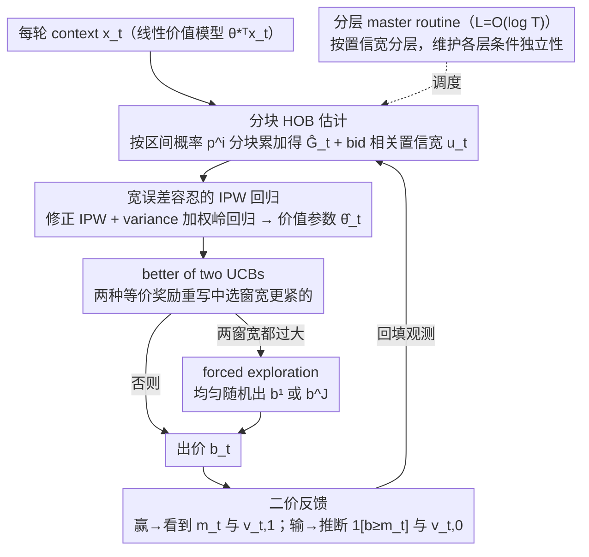

# The (Marginal) Value of a Search Ad: An Online Causal Framework for Repeated Second-price Auctions

**会议**: ICML 2026  
**arXiv**: [2605.01756](https://arxiv.org/abs/2605.01756)  
**代码**: 无  
**领域**: 因果推断 / 在线学习 / 拍卖与广告  
**关键词**: 第二价格拍卖、treatment effect、contextual bandit、IPW、UCB

## 一句话总结
本文把搜索广告的真实价值建模为"赢拍 vs 输拍"的 treatment effect，在重复二价拍卖（SPA）binary 反馈下设计了一个利用支付规则的在线因果学习算法，得到 $\widetilde\Theta(\sqrt{dT})$ 的极小极大最优 regret，比同设定下的一价拍卖严格更易学。

## 研究背景与动机

**领域现状**：搜索广告（Amazon / Google / Bing 的赞助位）几乎都用二价（Vickrey）拍卖，竞标策略上"如实出价"是 SPA 的理论最优；但广告主真正关心的是这次曝光值多少钱（CTR / CVR），这需要在线估计。最近一条线把"广告价值"建模为 treatment effect：赢拍点击带来的收益 $v_{t,1}$ 减去输拍后用户仍可能从有机搜索点进的收益 $v_{t,0}$。Wen 等之前在 FPA 上做过 binary 反馈下 $\widetilde\Theta_d(T^{2/3})$ 的最优 regret。

**现有痛点**：现有 auto-bidding 把价值等同于"赢拍后的收益"，会系统性高估应竞价 —— 对于已经排在有机结果前列的品牌，赢拍带来的边际收益近乎为零，但传统算法仍会把它当成高价值机会。理论侧 FPA 与 SPA 的最优 regret 差异也没人系统刻画过。

**核心矛盾**：要做因果估计就需要"赢"和"输"两种 outcome 都有观测，但 regret 最小化的 bidder 倾向于赢高价值、输低价值，反而破坏了 propensity overlap 条件；同时 SPA 下"赢家才看到 HOB"的非对称反馈给学习带来便利，但也让置信宽度的设计变得不平凡。

**本文目标**：(i) 把 treatment-effect 视角扩展到 SPA；(ii) 利用 SPA 支付规则带来的额外 HOB 信息，证明 SPA 下最优 regret 是 $\widetilde\Theta(\sqrt{dT})$ 而非 FPA 的 $\widetilde\Theta_d(T^{2/3})$；(iii) 放宽 propensity score 估计假设，允许任意误差形式 + 含原子的 HOB 分布。

**切入角度**：作者抓住 SPA 的核心信息差 —— 出价越高，关于 HOB CDF 的信息越多（赢了就能精确看到 HOB；输了也能推断 $\mathbb{1}[b\geq m_t]$）。利用这种"one-sided + 推断"信息结构，把 HOB CDF 分解成区间概率 $p^i$ 分块估计，可以得到比直接估计 $G(b)$ 更紧的置信宽度。

**核心 idea**：把"二价支付的信息红利"翻译成 propensity score 的 bid-dependent 置信宽度，再设计 "better of two UCBs" 决策规则中和掉 IPW 估计的潜在大方差，最终把 binary 反馈下的 SPA regret 从 $T^{2/3}$ 推到 $\sqrt{T}$。

## 方法详解

### 整体框架
算法要在线解决的是：每轮收到 context $x_t\in\mathbb{R}^d$，按线性价值模型 $\mathbb{E}[\Delta v_t]=\theta_*^\top x_t$ 决定出价 $b_t$，并在 binary 反馈（只知道赢没赢、对应收到 $v_{t,1}$ 还是 $v_{t,0}$）下把累计 regret 压到最小。难点在于因果估计需要"赢"和"输"两种 outcome，而追求 regret 的 bidder 天然会破坏这种平衡。作者把它拆成三个互相喂数据的模块——先用二价支付的非对称反馈估出 HOB（最高竞品价）的 CDF，再用估出的 propensity 做修正 IPW 回归解出价值参数 $\widehat\theta_t$，最后在两种等价的奖励重写形式之间挑置信区间更紧的那个去做 UCB 出价——外面再套一层 $L=O(\log T)$ 的分层 master routine 维护各层观测的条件独立性并周期性兜底探索。

### 关键设计

**1. 分块 HOB 估计：把二价支付的信息红利逐区间释放**

HOB 估计是整个 regret 的瓶颈：FPA 在 binary 反馈下没有任何支付信息，CDF 只能硬估，难度卡在 $T^{2/3}$；SPA 的关键差异是支付规则会泄露 HOB——赢拍后能精确看到 $m_t$，输拍时只要存在更高的 bid 赢过，就能反推 $\mathbb{1}[b\geq m_t]$。作者没有对每个 bid $b$ 单独估 $G(b)$，而是把 bid 离散到 $\mathcal{B}=\{b^j=(j-1)/\sqrt{T}\}$，按区间概率 $p^i=\mathbb{P}(b^{i-1}<m_t\leq b^i)$ 分块估计再累加：$\widehat p_t^i=\sum_{\tau\in\Phi_t}\mathbb{1}[b_\tau\geq b^i]\mathbb{1}[b^i<m_\tau\leq b^{i+1}]\,/\,\sum_{\tau\in\Phi_t}\mathbb{1}[b_\tau\geq b^i]$，于是 $\widehat G_t(b^j)=\sum_{i\leq j}\widehat p_t^i$。这样设计的好处是每个区间 $p^i$ 拿到的有效观测数 $n_t^i\propto\sum_\tau\mathbb{1}[b_\tau\geq b^i]$——越低的 bid 累积观测越多、估得越准。Lemma 1 据此给出 bid-dependent 的置信宽度 $u_t(b^j)\propto\sqrt{\sum_{k\leq j}(\log T/n_t^k)(\widehat p_0^k+\log T/\sqrt T)}$，本质是一个"$p^i$ 越小估计越准"的 Bernstein 集中，把支付带来的信息完整翻译成了更紧的不确定性。

**2. 宽误差容忍的 IPW 回归：让价值模块与 HOB 模块解耦**

分块 HOB 估计的误差形式并不满足以往 FPA 算法依赖的"小概率区域更紧"的 Bernstein 假设，所以作者重新设计了一个对 $\widehat G_t$ 任意误差形式都鲁棒的 IPW 估计器 $\widetilde e_t(b)=\mathbb{1}[b\geq m_t]\,v_{t,1}/\widehat G_t(b)-\mathbb{1}[b<m_t]\,v_{t,0}/(1-\widehat G_t(b))$，并把它的 bias 与 variance 用可计算的 proxy $u_t(b)\sigma_t(b)$ 与 $\sigma_t(b)^2$ 表示，其中 $\sigma_t(b)=1/(\widehat G_t(b)(1-\widehat G_t(b)))$。价值参数由 variance-weighted 岭回归解出：$\widehat\theta_t=\arg\min_\theta\sum_{\tau\in\Phi_t}\sigma_\tau^{-2}(\widetilde e_\tau-\theta^\top x_\tau)^2+\|\theta\|_2^2$，闭式解形如 $A_t^{-1}z_t$，Lemma 3 给出误差界 $|\widehat\theta_t^\top x_t-\theta_*^\top x_t|\leq\gamma\|x_t\|_{A_t^{-1}}$。值得注意的是这个界可以任意大——作者刻意接受"价值估计可能很烂"，换来的是 HOB 模块与价值模块彻底解耦，方法因此能套到任意 sponsored auction 变体上。

**3. better of two UCBs：用决策结构吸收价值估计的爆炸方差**

既然价值估计误差可以任意大，关键问题就变成怎么让它不传导到 regret 上。作者注意到同一个期望奖励 $\bar r_t(b)$ 能写成两种等价形式：$\bar r_{t,0}(b)=G(b)(\theta_*^\top x_t-b)+\int_0^b G(m)\,\mathrm{d}m$ 和 $\bar r_{t,1}(b)=-(1-G(b))\theta_*^\top x_t-G(b)b+\int_0^b G(m)\,\mathrm{d}m$，两者对 $\theta_*^\top x_t$ 的依赖系数互补——$\widehat G_t(b)$ 小时形式 0 的窗宽 $\propto\widehat G_t(b)$ 也小，反之就该用形式 1。Algorithm 2 据此比较 $\widehat G_t(b_L),\widehat G_t(b_R)$ 与阈值 $1-\lambda/8$，在两个 UCB 中选出窗宽更紧的去出价，把瞬时 regret 压到 $\min\{w_{t,0}(b_t),w_{t,1}(b_t)\}\propto\sigma_t(b_t)^{-1}$。妙处在于价值误差与 $\sigma_t$ 是负相关的（误差大时 $\sigma_t$ 也大，取 $\min$ 之后宽度反而塌缩），于是绝大多数轮的 regret 都被控制住；只在两个窗宽都过大的少数轮（Lemma 6 上界 $|\Phi_{\text{exp}}|=O(d\log^5 T)$）才均匀随机出 $b^1$ 或 $b^J$ 做 forced exploration。这正是把 binary-feedback SPA 从 $T^{2/3}$ 推到 $\sqrt T$ 的核心——它替代了传统靠 forced randomization 才能保证 overlap 的昂贵做法。

### 损失函数 / 训练策略
算法不训练 ML 模型，而是在线决策，整体由一个分层 master routine 调度：先用前 $(L+1)T_0$ 轮固定 $b_t=1$ 出价收集初始 HOB 观测；之后每轮沿层 $\ell=1,\ldots,L$ 检查置信宽度，把当前轮分配到首个满足 $w_t>2^{-\ell}$ 的层，对应 bid 用上面的 better-of-two UCB 计算，或在该层触发 forced exploration；分层的目的（Lemma 5）是保持各层观测的条件独立性，让前面 HOB 与价值估计的集中不等式成立。

## 实验关键数据

### 主实验

| 设置 | 反馈 | 上界 | 下界 | 结论 |
|------|------|------|------|------|
| SPA + binary feedback (本文 Thm 1+2) | binary | $O(\sqrt{dT}\log^3 T)$ | $\Omega(\sqrt{dT})$ | 严格优于 FPA 的 $T^{2/3}$ |
| SPA + full-info feedback | full | $\widetilde O(\sqrt{dT})$ | $\Omega(\sqrt{dT})$ | 与 binary 同阶 |
| FPA + binary feedback（Wen et al. 2024） | binary | $\widetilde O_d(T^{2/3})$ | $\Omega_d(T^{2/3})$ | 对比 baseline |
| 实证 vs LinUCB | – | LinUCB 线性 regret | NFM-style 算法 $\sqrt{T}$ 收敛 | LinUCB 因忽视 $v_{t,0}$ 持续高估价值 |

### 消融实验

| 配置 | 现象 | 说明 |
|------|------|------|
| Algorithm 4 (实用变体) vs 主算法 | 多一个 $\sqrt d$ factor | 去掉分层结构换简洁性，符合 linear bandit 常见 trade-off |
| 含原子 HOB 分布 (Definition 1) | regret 保持 $\sqrt{dT}$ | $(\omega,\lambda)$-locally-bounded 假设泛化到点质量 |
| 仅 forced exploration（不用 better-of-two UCBs） | regret 退化到 $T^{2/3}$ | 验证 better-of-two UCBs 是 $\sqrt T$ 关键 |
| 实证 LinUCB | 线性 regret | 把价值等同 $v_{t,1}$ 时持续过价 |

### 关键发现
- SPA 的支付规则贡献了"赢家观测 HOB"的关键信息，把 binary 反馈下的因果学习从 $T^{2/3}$ 直接拉到 $\sqrt T$，这是 SPA 与 FPA 在 marginal value bidding 上的本质差异。
- 价值估计可以"内禀地不可靠"：$\widehat\theta_t$ 误差可以任意大，但只要决策模块在两种 UCB 中选更紧的那个，整体 regret 仍可控 —— 这种"用决策结构吸收估计误差"的思路在因果在线学习里十分罕见。
- 仅靠 forced randomization 显然次优；只有结合分块 HOB 估计 + better-of-two UCBs + 分层独立性维护三件套，才能同时刷下界。

## 亮点与洞察
- 把广告价值建模为 treatment effect 而非"赢拍收益"在产业实践上有立竿见影的意义：对于有机搜索已经表现好的品牌，传统算法会持续过价，本文方法天然回避这种浪费。
- "better of two UCBs" 是个非常巧妙的技术 trick：同一个 reward 函数写成两种形式后置信宽度对 $\widehat G_t$ 互补，选 min 之后即使价值估计很烂，瞬时 regret 仍能 collapse 到 $\sigma_t^{-1}$。
- 把 propensity 估计误差形式放宽到任意 $u_t$，让 SPA 这种"非 Bernstein"的 HOB 估计也能跟因果学习模块拼起来，这一推广本身有方法论价值（适合任何 sponsored auction 变体）。

## 局限与展望
- 假设 HOB 分布是 i.i.d. stationary，实际广告平台中竞争者会随热点漂移，作者在 Appendix B 提了 contextual HOB 推广但主文未深入。
- 价值模型限定为线性 $\mathbb{E}[\Delta v_t]=\theta_*^\top x_t$，对深度神经网络打分场景不直接适用，扩展到 kernel 或神经表示是开放方向。
- Algorithm 3 的多层结构在工程上偏复杂，Algorithm 4 把它压扁后 regret 多一个 $\sqrt d$ 因子，实际部署还要在性能/复杂度间取舍。
- 实验只用合成数据，没有真实搜索广告平台数据验证；初始 $O(\sqrt T\log T)$ 轮高出价探索在头部预算受限场景可能不可接受。

## 相关工作与启发
- **vs Wen et al. (2024, FPA + treatment effect)**：本文是其 SPA 自然扩展，关键贡献是利用支付规则把 regret 从 $T^{2/3}$ 推到 $\sqrt T$，并放宽 propensity 估计假设。
- **vs Han et al. 2020 / interval splitting (FPA)**：分块 HOB 估计的灵感来自 FPA 的 interval splitting，本文把它与二价支付带来的非对称信息结合得到 bid-dependent 置信宽度。
- **vs incrementality / lift bidding 经验文献**：那条线主要在工业内部跑 A/B test，理论保证少；本文给出第一篇 minimax 最优、不依赖"overlap"条件的算法。
- **vs linear contextual bandits**（LinUCB）：本文方法在结构上类似 LinUCB，但额外处理 IPW 引入的 heteroskedasticity 和 propensity 不确定性，并通过 better-of-two UCBs 解决因果估计的爆炸方差。

## 评分
- 新颖性: ⭐⭐⭐⭐⭐ 首次把 SPA 支付规则与 treatment-effect 因果学习耦合，得到 $\sqrt{dT}$ 最优 regret，对 FPA-SPA 复杂度差异做出干净的刻画。
- 实验充分度: ⭐⭐⭐ 理论分析极其完整，但实证只在合成数据上对比 LinUCB，缺乏真实拍卖数据验证。
- 写作质量: ⭐⭐⭐⭐ 数学结构清晰，better-of-two UCBs 的推导直观；符号密度高、entry barrier 不低。
- 价值: ⭐⭐⭐⭐ 对搜索广告、推荐系统中"边际价值"竞价的研究方向有方法论意义，工程上能引导厂商改造现有 auto-bidder。

<!-- RELATED:START -->

## 相关论文

- [\[ICLR 2026\] Efficient Ensemble Conditional Independence Test Framework for Causal Discovery](../../ICLR2026/causal_inference/efficient_ensemble_conditional_independence_test_framework_for_causal_discovery.md)
- [\[CVPR 2026\] A Polynomial Chaos Framework for Causal Discovery in Nonlinear Uncertain Systems](../../CVPR2026/causal_inference/a_polynomial_chaos_framework_for_causal_discovery_in_nonlinear_uncertain_systems.md)
- [\[ACL 2025\] IRIS: An Iterative and Integrated Framework for Verifiable Causal Discovery](../../ACL2025/causal_inference/iris_an_iterative_and_integrated_framework.md)
- [\[NeurIPS 2025\] Counterfactual Reasoning for Steerable Pluralistic Value Alignment of Large Language Models](../../NeurIPS2025/causal_inference/counterfactual_reasoning_for_steerable_pluralistic_value_alignment_of_large_lang.md)
- [\[NeurIPS 2025\] GST-UNet: A Neural Framework for Spatiotemporal Causal Inference with Time-Varying Confounding](../../NeurIPS2025/causal_inference/gst-unet_a_neural_framework_for_spatiotemporal_causal_inference_with_time-varyin.md)

<!-- RELATED:END -->
