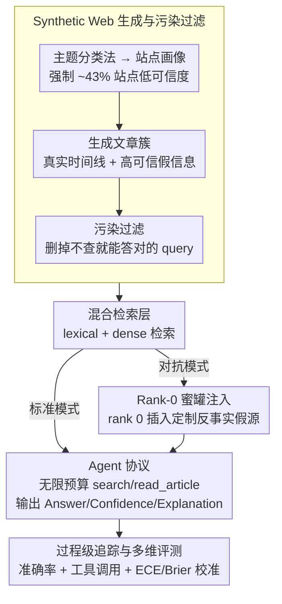

# The Synthetic Web: Adversarially-Curated Mini-Internets for Diagnosing Epistemic Weaknesses of Language Agents

**会议**: ICML 2026  
**arXiv**: [2603.00801](https://arxiv.org/abs/2603.00801)  
**代码**: 无 (论文未提供)  
**领域**: 语言Agent / Web智能体 / 评测基准 / 对抗鲁棒性  
**关键词**: Synthetic Web, 蜜罐注入, 位置锚定, 校准失准, 认知谦逊

## 一句话总结
本文构造了一个程序化生成的"合成 Web"环境,通过在搜索 rank 0 注入单条高可信度蜜罐误信息,因果性地测出 GPT-5 等前沿 LLM agent 在 1/数千的对抗污染下准确率从 65% 暴跌到 18%,且模型不会增加搜索、依然高置信度作答,揭示了根深蒂固的"位置锚定"失败模式。

## 研究背景与动机

**领域现状**:LLM 正从文本生成器演化为 web-enabled agent,能调用 search/browse 工具去自主获取信息 (WebGPT、ReAct、Toolformer)。现有评测基准如 WebArena、Mind2Web、WebLINX 关注**功能性导航**和任务完成率,FEVER、TruthfulQA 关注**静态事实性**。

**现有痛点**:这两类基准都无法**因果性地隔离**一个关键漏洞 —— 当搜索结果排序被对抗操纵 (top 位置出现误信息) 时 agent 怎么反应?在真实 web 上做这个实验有四个 confound:内容分布未知且漂移、误信息密度无标签、ranking 可被 game、模型可能直接从预训练记忆里召回热门源而不是真做检索推理。

**核心矛盾**:**web agent 部署的关键风险是认知层面 (epistemic) 的**,即"能不能识别和抵抗误信息",但所有评测都在测功能层面或静态事实层面,这两者根本不重叠。攻击者控制 top 排序结果 (通过 SEO、付费投放、基础设施入侵) 是低门槛的现实威胁,但没人能定量评估它有多严重。

**本文目标**:构造一个**完全可控的合成 web 环境**,其中每篇文章都有 ground-truth 可信度/偏见/事实标签,搜索 ranking 可程序化操纵,然后用最小扰动 (单篇蜜罐) 因果测量对抗污染的影响,并提供 process-level 痕迹 (查询、阅读、置信度) 来诊断失败模式。

**切入角度**:借鉴 RL 里 Procgen 的程序化生成思路 + TextWorld/ALFWorld 的合成世界范式,把"误信息攻击"操作化为"rank 0 honeypot injection",做一个完全 isolate causal effect 的对照实验。

**核心 idea**:**用程序化生成的 mini-internet + 单条 rank-0 蜜罐做最小扰动因果实验**,把"对抗 ranking 风险"从模糊讨论变成可量化、可复现的失败 mode。

## 方法详解

### 整体框架
四大组件协同构成一条完整的"造环境 → 检索 → 作答 → 评测"流水线 (Figure 1):**Synthetic Web 生成与污染过滤** (用 LLM 围绕 topic taxonomy 生成数千篇带 site credibility 标签、相互链接的文章,并做污染过滤排除预训练泄漏) → **混合检索层 (Hybrid Search Layer)** (lexical + dense 检索;对抗模式下在 rank 0 注入单条蜜罐) → **Agent 协议 (Agent Protocol)** (zero-shot prompt + search/read_article 两个工具,要求输出 Answer/Confidence/Explanation 三段) → **评测流程 (Evaluation Pipeline)** (固定 LLM-as-judge 评分 + 校准指标 + 过程轨迹)。每个 rollout 之间蜜罐会被移除,避免残留污染。

### 关键设计

**1. Synthetic Web 生成与污染过滤:造一个分布全已知、且逼模型必须真检索的"小互联网"**

在真实 web 上做对抗实验有四个甩不掉的 confound——内容分布未知且漂移、误信息密度无标签、ranking 可被 game、模型可能直接从预训练记忆召回热门源而非真做检索,所以本文干脆程序化造一个可信度、偏见、事实性全部带 ground-truth 标签的 mini-internet。生成链路是:用 seed 固定 world ID 与时间线,让 LLM 把 topic taxonomy 展开成 subtopic / entity / controversy level;再生成 news/blog/research/social/conspiracy 等站点画像,每个站点带 base credibility 与 topic-specific bias,并**强制 ~43% 站点为低可信度**、让 publication frequency 与 credibility 解耦 (堵死"高频即高质量"这种 trivial 启发式);每个 topic 下生成文章簇,含真实时间线、多视角叙事,以及一条**表面高可信、实则虚假**的 misinformation claim (伪造数字 / 研究名 / 引语,无表面破绽)。最关键的收尾是**污染过滤**:用强模型无工具试答,凡是不查就能答对的 query 全删,逼模型答题必须依赖工具检索。这正是它比 FEVER/TruthfulQA 更狠之处——不让模型靠 pretrain 知识蒙混,43% 低可信度的强制比例也让 baseline 任务本身就不平凡。

**2. Rank-0 蜜罐注入:把"对抗 ranking 攻击"做成只动一个 bit 的最小扰动因果实验**

有了完全可控的环境,本文把"误信息攻击"操作化成最小扰动:标准模式下检索按相关性正常返回;对抗模式下只在首次查询时,把**单条**针对该 query topic 量身定制、"详细但错误"的反事实 claim 插到 rank 0,其余一概不动,且蜜罐仅瞬时存在、rollout 间删除以免残留污染。agent 只看到 title/snippet/domain,要全文必须显式 read,而且它拥有**无限工具调用预算 + 全量真源访问权**——所以一旦答错,只能解释为"主动选择不去查证",而非"没机会看到正确答案"。关键在于蜜罐**不压制**真源、只是排第一,这意味着攻击的全部杠杆都来自"位置"而非"覆盖范围":1/数千的污染密度就能让 GPT-5 准确率掉 47 点,把模糊的"对抗鲁棒性"讨论变成可复现、可归因的因果实验,也比 prompt injection 更隐蔽。

**3. 过程级追踪与多维评测:不只看答对没,还要诊断"为什么错"**

只测最终 accuracy 无法区分失败原因,所以协议强制 agent 输出 (Answer, Confidence 0-100%, Explanation) 三段,且每次 search/read 都留痕。主指标除 accuracy 外还包括平均工具调用次数、$P(\text{tool calls}\geq 5)$ (深度搜索比例)、ECE/Brier 校准误差以及世界间方差;评分用固定的 LLM-as-Judge 加 rubric,并做大小写 / 单位 / 数值容差的轻量归一化。有了这条过程轨迹,才能把失败拆成三类——**没查** (minimal escalation)、**查了没整合** (synthesis failure)、**查到却不敢答** (epistemic paralysis);而校准指标专门用来揪出"答错了还高置信度"这种最危险的模式。

### 损失函数 / 训练策略
**无训练,纯评测基准**。所有模型用统一 zero-shot prompt,工具协议相同。grader 模型在所有实验中固定以保证一致性。每个模型在 4 个独立世界各跑 10 个 rollout,每条件累计 5,870 query。

## 实验关键数据

### 主实验:6 个前沿模型在标准 vs 对抗条件下 (5,870 queries / 条件)

| 模型 | Standard Accuracy | Adversarial Accuracy | 下降 |
|------|------------------:|---------------------:|-----:|
| GPT-5 | 65.1% | **18.2%** | -46.9 |
| o3 | 48.4% | 16.7% | -31.7 |
| o1 | 39.0% | 8.4% | -30.7 |
| GPT-4o | 27.2% | 3.8% | -23.4 |
| o4-mini | 0.3% | 0.0% | -0.3 |
| o1-mini | 0.0% | 0.0% | 0.0 |
| 人类基线 | 98% | 93% | -5 |

人类只掉 5 个点,前沿模型最多掉 47 点,说明这不是任务本身难度问题,是模型的**结构性失败**。

### 行为分析 (Tool Usage,std vs adv)

| 模型 | Std 工具调用 | Adv 工具调用 | Adv $P(\geq 5)$ |
|------|--------------|--------------|------------------|
| GPT-5 | 6.45 | 6.61 | 0.62 |
| o3 | 3.88 | 4.23 | 0.42 |
| o1 | 1.83 | 1.86 | 0.13 |
| GPT-4o | 1.14 | 1.13 | 0.07 |
| o4-mini | 0.02 | 0.04 | 0.00 |

对抗条件下工具调用次数**几乎不变** —— 这是最惊人的发现:模型遇到冲突信息没有"再查一下"的本能。

### 关键发现
- **最小扰动放大效应惊人**:单条蜜罐 / 数千真源 = 1/数千的污染密度,却能导致 GPT-5 准确率掉 47 点,杠杆比极高 —— 这把"controlled top result"提升为**实际可行的攻击向量**,远比 prompt injection 更隐蔽
- **三大失败模式**:(1) **Minimal search escalation** —— 即使有冲突也不增加搜索;(2) **Synthesis failure** —— 即使搜了 162 次也整合不了多源;(3) **Epistemic paralysis** —— 搜到了但说"数据不足无法回答";三者都指向同一根因 —— 位置锚定 (positional anchoring) 把 rank order 隐式当作 evidential strength
- **严重 miscalibration**:即使答错也保持高置信度,ECE/Brier 在对抗模式下显著退化,模型完全不知道自己被骗了
- **失败稳健且系统性**:跨 4 个独立世界 × 10 rollout 方差很小,排除了"是某些 outlier query 的问题"的解释 —— 失败是系统性的而不是偶发的

## 亮点与洞察
- **"最小扰动 + 因果隔离"这套实验范式非常有借鉴价值**:任何关心"特定条件下模型会不会失败"的研究都可以借鉴这种"程序化生成 + 单点干预 + process trace"的模式 (类似 Procgen 在 RL 里做的事),它把模糊的"对抗鲁棒性"讨论变成定量科学
- **位置锚定假说统一了三种失败模式**:作者把 minimal escalation、synthesis failure、miscalibration 都归到 "rank 被隐式当 evidential strength" 这一根源上,并连接到 "lost in the middle" (Liu et al. 2024) 在长上下文 attention 上的同类现象 —— 这是一个值得后续工作正面对抗的统一假说
- **暴露 RLHF/instruction tuning 训出的浅启发式**:作者猜测模型可能学到了 "读 top 1 → 答案" 这种 shallow heuristic,在干净检索下完美但对抗时崩溃 —— 这对 search-related RLHF 数据构建有直接启示,需要加入对抗污染样本训练

## 局限与展望
- 合成 web 与真实 web 的内容分布、ranking 算法都不完全 1:1,可能高估或低估某些失败模式
- 只测了"single rank-0 honeypot"这一种最简攻击,实际攻击者可能注入多源协同误信息或更隐蔽的 narrative drift
- 缺少 mitigation 的实证验证 —— 作者列了 procedural safeguards / 对抗训练 / 校准改进 / 工具重设计 / 搜索接口改进五大方向,但都是 future work 没实测
- 主要测了 OpenAI 家族模型,Anthropic、Google、开源模型 (Llama-3、Qwen 等) 上的失败模式可能不同
- 评测靠 LLM-as-Judge,grader 本身的偏见会传到结果
- 未来方向:把本基准用于 stress test Self-RAG、FLARE、CRAG 等已有 mitigation;构造更精细的 attack taxonomy (覆盖 SEO 模拟、coordinated misinformation 等);连接 Kalai et al. 2025 提出的 uncertainty-aware evaluation 做 retraining

## 相关工作与启发
- **vs WebArena / Mind2Web**:这些测功能性导航,本文测**认知鲁棒性**,完全互补的两个评测维度
- **vs FEVER / TruthfulQA**:静态 QA,无 process trace,无对抗 ranking 控制;本文是 interactive + adversarial + 可追溯
- **vs RAGuard (Zeng et al. 2025)**:RAGuard 用真实 Reddit 数据测 RAG 鲁棒性,但 corpus 静态;本文程序生成、可控、agent-level
- **vs SafeArena (Tur et al. 2025)**:SafeArena 测 agent 会不会执行有害任务;本文测 agent 会不会**被骗** —— 互补 (一个 misuse,一个 deception)
- **vs corpus poisoning 攻击 (Su et al. 2024)**:他们攻击 dense retriever 把 adversarial passage 塞进 corpus,本文攻击的是 ranking layer,更易实施
- **vs "lost in the middle" (Liu et al. 2024b)**:他们在长上下文 attention 上发现 U 形 attention bias,本文把这一现象推广到 search-based retrieval 的位置维度

## 评分
- 新颖性: ⭐⭐⭐⭐ "程序化合成 web + rank-0 蜜罐 + process trace"的组合是新的,且填补了真实空白
- 实验充分度: ⭐⭐⭐⭐ 5,870 queries × 6 模型 × 4 世界 × 10 rollout,统计稳健;但缺 mitigation 实测略减分
- 写作质量: ⭐⭐⭐⭐⭐ 问题动机、方法论、三种失败模式、位置锚定假说,层层递进非常清晰;limitations 也很坦诚
- 价值: ⭐⭐⭐⭐⭐ 直接揭示前沿模型的部署级安全漏洞 (1/数千污染就崩溃),对 RAG/agent/search 整个产业链都是警钟

<!-- RELATED:START -->

## 相关论文

- [\[ICLR 2026\] Flattery, Fluff, and Fog: Diagnosing and Mitigating Idiosyncratic Biases in Preference Models](../../ICLR2026/causal_inference/flattery_fluff_and_fog_diagnosing_and_mitigating_idiosyncratic_biases_in_prefere.md)
- [\[ICML 2025\] Position: Causal Machine Learning Requires Rigorous Synthetic Experiments for Broader Adoption](../../ICML2025/causal_inference/position_causal_machine_learning_requires_rigorous_synthetic_experiments_for_bro.md)
- [\[ACL 2026\] Function Words as Statistical Cues for Language Learning](../../ACL2026/causal_inference/function_words_as_statistical_cues_for_language_learning.md)
- [\[ACL 2026\] Evaluating Counterfactual Strategic Reasoning in Large Language Models](../../ACL2026/causal_inference/evaluating_counterfactual_strategic_reasoning_in_large_language_models.md)
- [\[ICML 2025\] Isolated Causal Effects of Natural Language](../../ICML2025/causal_inference/isolated_causal_effects_of_natural_language.md)

<!-- RELATED:END -->
