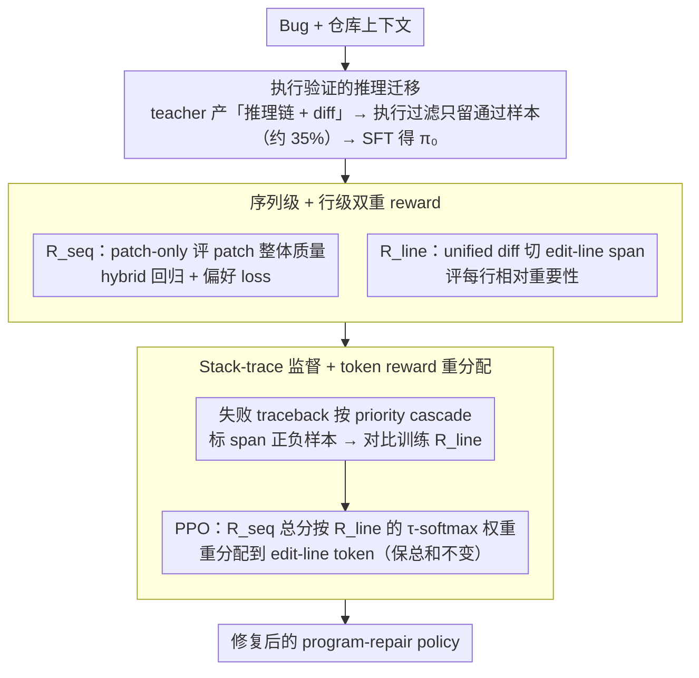

# BoostAPR: Boosting Automated Program Repair via Execution-Grounded Reinforcement Learning with Dual Reward Models

**会议**: ICML 2026  
**arXiv**: [2605.09134](https://arxiv.org/abs/2605.09134)  
**代码**: https://github.com/yuanhao2023/BoostAPR  
**领域**: 代码智能 / 程序自动修复 / 强化学习  
**关键词**: 自动程序修复, PPO, 双重奖励模型, 行级信用分配, SWE-bench

## 一句话总结
BoostAPR 给"用 RL 训 program-repair 模型"造了一套三阶段流水线——execution-verified SFT → 训序列级 + 行级双重 reward → PPO 时用行级模型把序列奖励重新分配到关键 edit lines；在 Qwen2.5-Coder-32B 上把 SWE-bench Verified 从 17.8% 推到 40.7% (+22.9pp)，跨语言迁移到 Defects4J 取 24.8%。

## 研究背景与动机
**领域现状**：LLM-based 程序修复（APR）从零样本 prompting（如 GPT-4o + Agentless）演化到 fine-tune（SWE-Llama、Lingma-SWE-GPT、RepairLLaMA）再到 RL（SWE-RL 拿到 41% on SWE-bench Verified，但用了 70B 参数）。Agentic 系统（SWE-agent、AutoCodeRover）通过 tool use 和 fault localization 拿到不错的结果。

**现有痛点**：用 RL 训 APR 有三个根本困难：(1) **execution feedback 极稀疏**——一个 patch 要么过全部测试要么不过，二元信号没法告诉模型"差一点点"；(2) **sequence-level reward 引发严重信用分配问题**——50 行 patch 成功/失败时，模型不知道哪几行真的关键、哪几行只是装饰，梯度方差极大；(3) **分布偏移**——curated 训练数据和真实仓库 bug pattern 差距大。token-level reward 模型（Yoon 2024）粒度过细——单个 token 没语义；process reward 模型（Lightman 2024）的"step"在数学推理 work 但在代码 edit 上没有自然对应。

**核心矛盾**：要让 PPO 真正学会"修哪几行"，必须有比序列级更细但比 token 级更结构化的奖励信号，且这个信号不能依赖 counterfactual patch 评估（太贵）也不能依赖 ground-truth patch 匹配（不存在唯一正解）。

**本文目标**：(i) 用 execution feedback 训一个**行级 credit allocator** $R_{\text{line}}$，它能在没有 counterfactual 评估的前提下学到"哪个 edit-line span 更重要"；(ii) 把它和**序列级 reward** $R_{\text{seq}}$ 组合成 token-level reward 给 PPO 用；(iii) 通过 execution-verified SFT 给 RL 一个高质量起点。

**切入角度**：把 unified diff 解析成 maximal contiguous edit-line spans 作为"自然的代码修改单元"——比 hunk 细、比 statement 通用（不依赖语言 parser），且对 malformed/跨语言 diff 都稳定。用 stack-trace 把失败 traceback 路径上的 span 标为负样本，做 execution-grounded 的 contrastive supervision，避免了昂贵的反事实 patch 评估。

**核心 idea**：dual reward = sequence-level（评 patch 整体质量）+ line-level（学 edit-line 重要性），PPO 时把 $R_{\text{seq}}$ 的总分按 $R_{\text{line}}$ 给的 softmax 权重分配到各 edit-line span 的 token 上，实现 fine-grained credit redistribution。

## 方法详解

### 整体框架
BoostAPR 要解决的是"用 RL 训 program-repair 模型时，二元的测试通过/失败信号既稀疏又没法告诉模型一个 50 行 patch 里到底是哪几行起了作用"这个核心难题。它把问题拆成一条三阶段流水线：先用执行验证过的高质量 demonstration 做 SFT 给 RL 一个稳的起点，再训一对（序列级 + 行级）reward model，最后 PPO 时让行级模型把序列奖励重新分配到关键的 edit lines 上。三阶段全部在 SWE-Gym 上训练，base policy 是 Qwen2.5-Coder-32B-Instruct，两个 reward model 都用 Qwen2.5-Coder-7B-Instruct backbone 加一个 scalar value head。

### 关键设计

**1. 执行验证的推理迁移：给 RL 一个跑得通的冷启动 ($\pi_0$)**

RL 从一个弱 policy 起步极易发散，所以第一阶段先做一轮高质量 SFT。这里的关键不是随便找 patch 来 imitate，而是强制 teacher（Claude 3.5 Sonnet）以 (reasoning trace, unified diff) 的格式输出，再把每个 patch 丢进 SWE-Gym runner 跑全部测试，**只保留 resolved=True 的样本**——这道严格的执行过滤只放过约 35% 的生成，把那些表面看着对、实际 broken 的 plausible-but-wrong demonstration 全部挡在训练集外。保留 reasoning trace 而非只留 patch，是为了让 student 学到"如何诊断 bug"而不仅是"产出什么样的 diff"。训练用标准 next-token loss 加 prompt mask：$\mathcal{L}_{\text{SFT}}=-\mathbb{E}_{(x,y)}[\sum_t \log \pi_\theta(y_t \mid x, y_{<t})]$。

**2. 序列级 + 行级双重 reward：一个校准尺度，一个分配信用**

单一的 sequence-level reward 会引发严重的信用分配问题——patch 整体成功或失败时，模型根本不知道哪几行真正关键。BoostAPR 的核心思路是再训一个行级 reward model 专门学 edit-line 的重要性，与序列级分工：$R_{\text{seq}}$ 评 patch 整体质量、负责校准 PPO 的 reward scale，$R_{\text{line}}$ 学每个 edit-line 的相对重要性、负责后续的细粒度 credit 重分配。

$R_{\text{seq}}$ 有一个关键的去 bias 设计——它是 **patch-only scoring**，只看 unified diff 不看 bug context。这是为了堵死"看到容易的题就给高分"这条 shortcut：一旦 reward model 能看到上下文，它会偷偷学"哪些题简单"而非"哪个 patch 好"。训练用一个 hybrid loss 把回归和偏好两个目标拼在一起：

$$\mathcal{L}_{\text{seq}} = \lambda_{\text{reg}} \mathbb{E}[(R_{\text{seq}}(y;\theta) - r^*(x,y))^2] + \mathbb{E}_{(y^+, y^-)}[-w \log \sigma(R_{\text{seq}}(y^+) - R_{\text{seq}}(y^-))]$$

其中回归项把分数锚到真实执行奖励 $r^*$ 上保证 absolute scale 校准，偏好项保证相对排序对。两者缺一不可——纯 preference 没有绝对尺度会让 PPO advantage 不稳，纯 regression 在 noisy 的执行 label 下又容易 overfit。这里的执行奖励本身也是组合信号：$r^* = r_{\text{env}} + \gamma_{\text{diff}} r_{\text{diff}}$，环境项 $r_{\text{env}} = w_{\text{apply}} r_{\text{apply}} + w_{\text{test}} r_{\text{test}}$ 综合 patch 能否 apply 和测试通过率，diff 项 $r_{\text{diff}} = -\min(\eta |\Delta(y)|, r_{\max})$ 惩罚过大的 patch。$R_{\text{line}}$ 则把 unified diff 解析成 maximal contiguous edit-line spans（排掉 header 和 context 行），对每个 span 用 (edit 内容 + 上下文 + 文件路径 + 位置) 编码后过 scalar head 打分。选 line-span 而非 token 或 hunk 作为粒度，是因为它比 token-level 有语义、比 sequence-level 有结构，又不依赖语言 parser、对 malformed/跨语言 diff 都稳定。

**3. Stack-trace 监督 + 保总和的 token reward 重分配：在不做反事实评估的前提下学信用**

$R_{\text{line}}$ 的监督信号从哪来是最棘手的问题——理想做法是 leave-one-line-out 反事实评估，但为每个 candidate patch 重跑一遍执行计算量爆炸。BoostAPR 的做法是直接拿失败的 stack-trace 当 grounded 标签，按一条 **priority cascade** 给 span 标正负样本：通过的 patch，所有 edit span 都标 positive；失败的 patch 则分三级——能从 traceback 拿到具体 failing assertion 时，把 stack call chain 和 edit-line span 的交集标为 negative（占 62%）；traceback 存在但没明确 assertion 时，把 traceback 里出现的"被编辑函数"打低分（27%）；patch 连 apply 都失败时退到 uniform fallback label（11%）。这道 cascade 让标签噪声逐级可控。监督用 contrastive loss：$\mathcal{L}_{\text{line}}=\mathbb{E}_{(\ell^+, \ell^-)}[-\log \sigma(R_{\text{line}}(\ell^+) - R_{\text{line}}(\ell^-))]$。

到了 PPO 阶段，行级分数被转成 token-level reward。每个 token 的奖励是 $r_t = s \cdot a_t + \mathbb{I}[t=T] \cdot r_{\text{fmt}}(y)$，其中 $s = R_{\text{seq}}(y)$ 是序列级总分，$a_t$ 是把行级 span 权重均摊到 span 内 token 后的归一化权重。span 权重本身来自一个温度 softmax：$w_\ell = \exp(s_\ell/\tau)/\sum_j \exp(s_j/\tau)$（$\tau=0.5$）。这个设计的精妙处在于它**保持总 reward 等于 $s$ 不变**（$\sum_t a_t = 1$），只是按学到的 edit importance 把同样的总分重新分配到不同 token 上——这样 PPO 的 advantage 总规模不被扭曲，是"reward 重分配而非缩放"。最后 $r_{\text{fmt}}$ 在 final token 上加结构惩罚（valid diff 0 / recoverable −0.4 / malformed −1.0 / not-a-diff −1.5），强制模型输出 valid unified diff，否则 reward 直接打折以防 reward hacking。

### 一个完整示例
设模型对某个 bug 产出一个跨两处的 patch，被解析成两个 edit-line span：$\ell_1$ 改了真正出问题的边界判断、$\ell_2$ 只是顺手补了个 log。执行后测试失败，traceback 的 failing assertion 落在 $\ell_1$ 所在的函数调用链上——于是 $\ell_1$ 被标为 negative、$\ell_2$ 不受影响。训练后的 $R_{\text{line}}$ 给两个 span 打出分数（比如 $s_{\ell_1}=2.0, s_{\ell_2}=0.5$），经 $\tau=0.5$ 的 softmax 得到权重 $w_{\ell_1}\approx 0.95, w_{\ell_2}\approx 0.05$。PPO 时若 $R_{\text{seq}}$ 给整个 patch 打 $s=-1$，这 $-1$ 的总惩罚就有 95% 落到 $\ell_1$ 的 token 上、只有 5% 落到 $\ell_2$——模型因此明确学到"该改的是边界判断这一行"，而不是把责任平摊给无辜的 log 行。总奖励仍是 $-1$，只是分配变了。

### 损失函数 / 训练策略
- SFT: $\mathcal{L}_{\text{SFT}}$，3 epoch，lr 2e-5，batch 32；teacher demonstration 经执行过滤后约 35% 通过率
- Reward: $\mathcal{L}_{\text{seq}}$（hybrid regression + preference）、$\mathcal{L}_{\text{line}}$（contrastive），5 epoch，lr 1e-5，batch 64；Stage II 对每个 instance 用 SFT policy nucleus sample $K=4$ 个 candidate
- PPO: 用 VERL + vLLM，clipped objective（$\epsilon=0.2$）+ GAE + adaptive KL（target 0.1），300 steps，batch 64，rollouts/inst 4，LoRA rank 64
- token reward 公式 $r_t = s \cdot a_t + \mathbb{I}[t=T] r_{\text{fmt}}$，format penalty $\in \{0, -0.4, -1.0, -1.5\}$

## 实验关键数据

### 主实验
评测 pass@1（greedy），strict evaluation 不做任何 patch 后处理：

| Method | Backbone | SWE-V | D4J v2.0 | HE-Java | QuixBugs |
|--------|----------|-------|----------|---------|----------|
| Agentless | GPT-4o | 38.8 | 12.4* | 71.3* | 87.5* |
| SWE-agent | Claude 3.5 Sonnet | 33.6 | 10.8* | 68.9* | 85.0* |
| AutoCodeRover | GPT-4o | 28.8 | — | — | — |
| Qwen2.5-Coder-32B (base) | — | 17.8 | — | — | — |
| SWE-RL (70B) | — | 41.0 | — | — | — |
| **BoostAPR (本文)** | Qwen2.5-Coder-32B | **40.7** (+22.9 vs base) | **24.8** | **84.5** | **95.0** |

亮点：(1) 在 32B 规模、单机训练下追平 70B SWE-RL；(2) 纯 Python 训练数据，零 Java 数据下 cross-lingual transfer 到 Defects4J 拿 24.8%；(3) HumanEval-Java、QuixBugs 上压过所有 agentic baseline 即使后者用 GPT-4o/Claude。

### 消融实验
在 SWE-bench Verified 上分阶段拆解（数字基于原文 ablation 章节描述）：

| 配置 | SWE-V Pass@1 | 说明 |
|------|--------------|------|
| Base (Qwen2.5-Coder-32B) | 17.8 | 起点 |
| + Stage I SFT (execution-verified) | ~30 | 高质量 demonstration 是大幅提升的主因 |
| + Stage II + Stage III ($R_{\text{seq}}$ only, sequence reward) | ~37 | PPO + $R_{\text{seq}}$ 提供主要 accuracy gain |
| + $R_{\text{line}}$ (full BoostAPR) | **40.7** | 行级 credit 提供互补提升 |
| Full BoostAPR vs GRPO/rejection sampling RL | 显著优于 | dual reward 比常见 RL baseline 更强 |

| 关键变量 | 现象 | 解读 |
|----------|------|------|
| Patch-only $R_{\text{seq}}$ vs context-aware $R_{\text{seq}}$ | patch-only 略胜 | 防 shortcut，"对易题给高分"被屏蔽 |
| Hybrid (regression + preference) vs 仅 preference | 收敛更稳 | absolute scale 校准 PPO advantage |
| Stack-trace cascade vs uniform negative labels | 收益更大 | 精细化负样本 attribution 重要 |
| Format penalty | 强制输出 valid diff | 防止 reward hacking 输出无效格式 |

### 关键发现
- **Stage I + $R_{\text{seq}}$ 拿了 60%+ 的总 gain**（17.8 → ~37），是这条 pipeline 的主力发动机；$R_{\text{line}}$ 提供 ~4pp 互补提升，更关键的是带来 **out-of-distribution 泛化**（Defects4J Python→Java）和**训练效率 + 梯度质量**改善。
- **跨语言迁移惊人**——纯 Python 训练在 Java benchmark 拿 24.8%，说明 dual reward 学到的是"广义代码修改信号"而非语言特异 pattern。
- **Patch-only $R_{\text{seq}}$ 是反 shortcut 的关键设计**——给 reward model 看 context 会让它学到"哪些题容易"，这是个普适的 reward shaping 教训。
- **Line-span 这个粒度选择**比 token-level 稳、比 hunk-level 细，是个务实的 trade-off；作者明确不声称 line-span 是 semantically optimal，只声称它实用。
- **Stack-trace supervision 替代 counterfactual evaluation**——后者要为每个 candidate patch 做 leave-one-line-out 重新执行，计算量爆炸；本文用 traceback 路径 + 函数级 fallback 做 cheap-and-grounded 标注。

## 亮点与洞察
- **三阶段 pipeline 边界清晰**——SFT 解决 cold-start、 dual reward 解决 credit assignment、PPO 解决 online improvement，每个阶段职责单一可独立 ablation，工程上非常清楚。
- **Edit-line span 这个 intermediate granularity 选择**——比 token 有语义、比 sequence 有结构、比 statement 通用（不依赖 AST parser），是个真正考虑了"语言无关、malformed 鲁棒"的工程设计。
- **Token reward 保持总和不变的重分配**——$r_t = s \cdot a_t$ 满足 $\sum_t a_t = 1$，保证 PPO advantage 总规模不变，只改变分配，这种"reward 重分配而非缩放"的设计避免了 advantage scale 不稳。
- **Hybrid regression-preference reward**——把 RLHF 学到的 preference 和 RL-from-execution 学到的 regression 结合，比纯 DPO/PPO 更稳，可推广到任何"既有标量信号又有相对排序"的 RL 训练。
- **Execution-grounded supervision**——所有标签都来自实际执行而非人工标注，scalable 且 ground-truth；priority cascade 把 traceback 利用到极致。

## 局限与展望
- **依赖高质量 teacher 模型**——Stage I 用 Claude 3.5 Sonnet 生成 demonstration，没有强 teacher 时方法可能退化。
- **$R_{\text{line}}$ 标签有噪声**——作者自己承认 ~11% 的 uniform fallback、27% 的函数级 attribution 是粗粒度的；如何降低 label noise 是后续课题。
- **PPO 训练长度只有 300 步**——可能没充分探索更长训练的潜力或退化。
- **line-span 没法处理"应该 edit 但没 edit"的缺失修改**——只对实际 edit 的 line 评分，对于本应改但未改的位置无能为力。
- **format penalty 是硬编码的**（0, -0.4, -1.0, -1.5），不同任务可能需要不同尺度，可学习的 format reward 是个方向。
- **没和 inference-time scaling（self-consistency / agentic search）对比**——pass@1 之外的 best-of-N、多 turn agentic 设定下 BoostAPR 的优势是否保持没测。
- **Reward hacking 风险**——$R_{\text{seq}}$ 可能被某些表面 pattern（比如特定 file 名、特定 diff 长度）骗，文中没系统分析 hacking 案例。

## 相关工作与启发
- **vs SWE-RL (Wei et al. 2025)**：SWE-RL 用 sequence-level reward + 70B 参数拿 41% on SWE-V；BoostAPR 用 32B + dual reward 拿 40.7%，参数减半且方法更可解释。
- **vs CodeRL (Le et al. 2022)**：CodeRL 是 actor-critic + 单一执行 reward；BoostAPR 增加了 SFT warm-start 和行级 credit allocation。
- **vs Token-level reward (Yoon et al. 2024)**：token-level 在 code 上粒度过细单 token 无语义；line-span 是更合适的中间粒度。
- **vs Process reward (Lightman 2024)**：PRM 在数学推理上 step 自然，在 code edit 上无对应；line-span 是 code-specific 的等价物。
- **vs RepairLLaMA / MORepair**：纯 SFT 没用执行反馈做 RL；BoostAPR 用三阶段全用上。
- **启示**：(i) "把任务分解成 cheap-and-grounded 的 intermediate units（如 edit-line span）做 credit assignment"是 RL-for-code 的通用策略；(ii) hybrid regression+preference reward 比纯偏好更稳，可推广到任何 RLHF；(iii) execution-grounded stack-trace supervision 给"没法做 counterfactual 评估"的场景提供了 cheap supervision 的范式，可借鉴到 debug、refactor、test generation 等其它代码任务。

## 评分
- 新颖性: ⭐⭐⭐⭐ Line-level credit allocator 是真正的方法创新，stack-trace cascade supervision 也是巧妙工程
- 实验充分度: ⭐⭐⭐⭐ 4 benchmark + 跨语言 + 充分 ablation；缺与 inference-time agentic search 的对比
- 写作质量: ⭐⭐⭐⭐ 动机清晰，"为什么 line-span"和"为什么 hybrid reward"都讲透了
- 价值: ⭐⭐⭐⭐⭐ 32B 模型追平 70B SWE-RL + 强跨语言迁移，对开源 APR 社区有直接落地价值

<!-- RELATED:START -->

## 相关论文

- [\[ICLR 2026\] Execution-Grounded Credit Assignment for GRPO in Code Generation](../../ICLR2026/code_intelligence/execution-grounded_credit_assignment_for_grpo_in_code_generation.md)
- [\[ACL 2026\] QiMeng-PRepair: Precise Code Repair via Edit-Aware Reward Optimization](../../ACL2026/code_intelligence/qimeng-prepair_precise_code_repair_via_edit-aware_reward_optimization.md)
- [\[ACL 2026\] DUET: Dual Execution for Test Output Prediction with Generated Code and Pseudocode](../../ACL2026/code_intelligence/duet_dual_execution_for_test_output_prediction_with_generated_code_and_pseudocod.md)
- [\[ACL 2026\] SOCIA-EVO: Automated Simulator Construction via Dual-Anchored Bi-Level Optimization](../../ACL2026/code_intelligence/socia-evo_automated_simulator_construction_via_dual-anchored_bi-level_optimizati.md)
- [\[ACL 2026\] CodeRL+: Improving Code Generation via Reinforcement with Execution Semantics Alignment](../../ACL2026/code_intelligence/coderl_improving_code_generation_via_reinforcement_with_execution_semantics_alig.md)

<!-- RELATED:END -->
