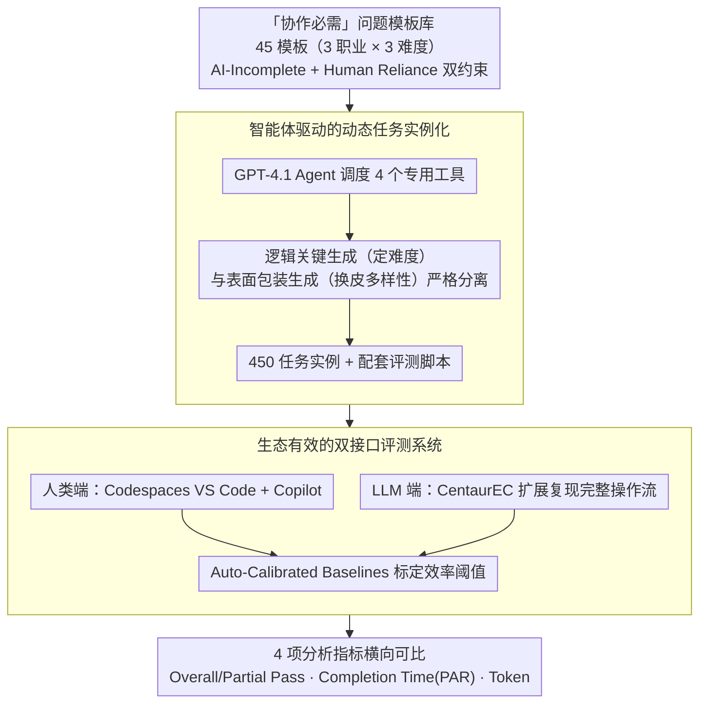

# CentaurEval: Benchmarking Human-in-the-Loop Value in Agentic Coding

**会议**: ICML 2026  
**arXiv**: [2512.04111](https://arxiv.org/abs/2512.04111)  
**代码**: 有 (开源评测工具包 + 450 任务数据集)  
**领域**: 代码智能  
**关键词**: 人机协作评测, 代码智能体, Benchmark, 协作编程, 高阶推理  

## 一句话总结

提出 CentaurEval，首个面向人机协作编程的统一评测框架，通过设计 45 个"协作必需"(Collaboration-Necessary) 任务模板，证明单独 LLM 仅 0.67% 通过率、人类独立仅 18.89%，而人机协作可达 31.11%，揭示 LLM 正从执行工具演变为共推理伙伴。

## 研究背景与动机

**领域现状**：LLM 驱动的编程智能体（Claude Code、Cursor、GitHub Copilot）已广泛应用于工业开发，开发者角色正从"代码生产者"转变为"人-AI 协作系统的领导者"。

**现有痛点**：现有评测体系存在根本性缺陷——面向人类的平台（LeetCode、Codeforces）测试的是正被自动化取代的算法能力；面向 AI 的 Benchmark（HumanEval、SWE-Bench）虽追求真实性但仍假设问题被完美定义，忽略了需求澄清、策略分解等高阶推理能力的评估。更重要的是，现有评测均将人和 AI 孤立评估，无法量化协作价值。

**核心矛盾**：缺少同时满足两个需求的评测框架：(1) 量化人在人-AI 协作中的贡献；(2) 用真实复杂度而非纯算法难度来挑战 LLM 的高阶推理能力。

**本文目标**：构建统一的人机协作编程 Benchmark，包含生态有效的评测环境和"协作必需"任务设计。

**切入角度**：基于分布式认知理论，认知不仅发生在个体内部，还分布在人、工具和环境之间；真正的评估应以人-AI 对为分析单元，而非孤立评估任一方。

**核心 idea**：设计对单独 LLM 和人类都不可解但通过有效协作可解的"协作必需"任务，同时提供云端 IDE（人类评测）和自动化工具包（LLM 评测）双接口，实现统一可比的评测。

## 方法详解

### 整体框架

CentaurEval 要解决的核心问题是：现有评测要么只考 AI、要么只考人，无法量化"人机协作"本身的价值。它的办法是把分析单元从"个体"换成"人-AI 对"，围绕一批刻意设计成单方不可解、协作才可解的任务，搭建一套让人类和 LLM 都能在等价环境下被评测的统一框架。整个系统由任务模板库、动态任务生成器、人类用的云端 IDE、LLM 用的自动化工具包四部分拼成，最终输出可直接横向对比的 pass/fail 与效率指标。

### 关键设计

**1. "协作必需"问题模板库：制造单方不可解、协作才可解的任务**

要量化协作价值，前提是任务对单独的 LLM 和单独的人都很难、但协作能解开。本文的做法是在一个基础算法核心外层，包裹多层真实世界复杂度：AI-Incomplete 方向注入欠定义需求、多模态规格说明（UML/ER 图）、遗留代码库等关系复杂度，让 LLM 无法把任务干净地分解成可执行步骤；Human Reliance 方向则嵌入大量重复性实现和不常见 API，再叠加时间限制，使纯手工方案在限定时间内不可行。这两类约束被形式化为：要求纯 AI 的求解概率足够低 $\Pr(\text{Solve}(t, \mathcal{A})) \leq \theta_{\text{low}}$，同时要求人机协作相比人类独立有显著增益 $\mathbb{E}[\text{Score}(s_{\mathcal{H}+\mathcal{A}})] - \mathbb{E}[\text{Score}(s_{\mathcal{H}})] \geq \delta$。满足这两个条件，评测出的性能差才能被解读为协作本身贡献的价值，而非某一方原本就能完成。45 个模板按此原则覆盖 3 个职业方向 × 3 个难度等级。

**2. 智能体驱动的动态任务实例化：防数据泄漏又不引入额外难度**

静态题库一旦被模型见过就会失真，因此需要从模板动态生成无限多样的实例。本文用一个 GPT-4.1 Agent 调度 4 个专用工具来完成实例化：TechnicalParameterTool 生成逻辑关键参数，ImplementationConstraintTool 选择框架配置，ContextualVariableTool 生成真实场景包装，InterfaceSpecificationTool 生成接口细节。关键在于把"逻辑关键生成"和"表面包装生成"严格分开——前者确定性地决定题目难度，后者只负责换皮带来多样性，这样不同实例之间的变化只改变表象、不偷偷加大认知难度，保证了公平性的同时又能持续扩容。每个实例都同步产出任务包和配套评测脚本。

**3. 生态有效的双接口评测系统：让人和 LLM 在等价条件下可比**

人和 LLM 要直接对比，就必须排除环境差异这个混杂因素。人类端用 GitHub Codespaces 部署完整的 VS Code + Copilot 环境，消除工具熟悉度差异；LLM 端则通过 CentaurEC 扩展复现人类的完整操作流程——环境部署、任务注入、代码生成、测试反馈、迭代修正直到评分，并固定使用 450 个静态任务实例以保证可复现。为了让效率类指标跨平台可比，系统引入 Auto-Calibrated Baselines：先跑参考解动态标定出效率阈值，再以此为基准衡量各方表现。评测采用两阶段协议，先记录 5 个原始指标（测试用例 pass/fail、执行时间、峰值内存、完成时间、Token 使用量），再聚合为 4 个分析指标：Overall Pass（全部测试通过率）、Partial Pass（部分通过率）、Completion Time（采用惩罚平均时长 PAR，对超时样本统一记为 60 分钟以惩罚未完成）、Token Usage。

## 实验关键数据

### 主实验

在 45 名专家参与者 + 5 个 SOTA LLM 上进行 4 种条件的对比实验：$C_H$（纯人类）、$C_0$（全自主 AI）、$C_1$（最小干预 AI）、$C_2$（人机协作）。

| 实验条件 | 平均 Pass@1 | 95% CI | 说明 |
|----------|------------|--------|------|
| $C_0$ (全自主 AI) | 0.67% | 0.23–1.94 | LLM 独立完成 |
| $C_1$ (最小干预) | 2.89% | 1.70–4.88 | 仅修复流程性故障 |
| $C_H$ (纯人类) | 18.89% | 12.1–28.2 | 无 AI 辅助 |
| $C_2$ (人机协作) | **31.11%** | 22.5–41.3 | 自由使用 Copilot |

### 各 LLM 在不同条件下的表现

| 模型 | $C_0$ Pass@1 | $C_1$ Pass@1 | $C_0$ Partial | $C_1$ Partial |
|------|-------------|-------------|---------------|---------------|
| Claude-Sonnet-4 | 0.67% | 2.89% | 19.24% | 30.13% |
| Claude-Sonnet-3.7 | 0.00% | 1.56% | 8.71% | 17.47% |
| GPT-4.1 | 0.00% | 1.78% | 11.16% | 23.64% |
| GPT-4o | 0.00% | 0.00% | 5.82% | 12.09% |
| Gemini-2.5-Pro | 0.22% | 2.22% | 8.27% | 21.33% |

### 难度分层分析

| 难度 | $C_H$ Pass | $C_0$ Pass | $C_1$ Pass | $C_2$ Pass |
|------|-----------|-----------|-----------|-----------|
| Easy | 36.7% | 1.3% | 4.0% | 43.3% |
| Medium | 13.3% | 0.7% | 2.7% | 26.7% |
| Hard | 6.7% | 0.0% | 2.0% | 23.3% |

### 关键发现

- **协作增益显著**：$C_2$ 比 $C_H$ 提升 12.22 个百分点（$p = 0.00739$），比最强单独 LLM 提升超 28 个百分点
- **难度越高协作越重要**：人类 Pass 从 Easy 36.7% 降至 Hard 6.7%（降幅 82%），但协作模式仅从 43.3% 降至 23.3%（降幅 46%），协作在困难任务上的"增益放大"效应明显
- **LLM 瓶颈在推理非执行**：$C_0$ 到 $C_1$ 的提升（修复流程故障）说明当前 LLM 的失败不仅是环境交互问题，更根本在于缺乏高阶推理能力
- **51% 参与者采纳了 AI 提出的根本性不同解题策略**，且前 15 名中有 12 人使用了 AI 的战略级建议

## 亮点与洞察

- **"协作必需"任务设计范式**：通过在算法核心外包裹真实世界复杂度（欠定义需求、多模态规格等），人为制造对 LLM 和人类各自的盲区，这种"双边不可解"设计思路可推广到其他人机协作评测场景
- **从工具到伙伴的认知跃迁**：实验发现 80% 参与者将 AI 用于策略性头脑风暴、51% 采纳了 AI 提出的全新方案，这不再是"人想 AI 写"的传统模式，而是真正的共推理——该发现对 AI 辅助教育和开发工具设计都有重要启示
- **动态任务生成与静态评测的双轨制**：人类端用动态实例化防记忆效应，LLM 端用静态 450 任务保证可复现，两端通过相同模板和评测脚本保证可比性，这种设计可迁移到其他人机混合评测场景

## 局限与展望

- 当前仅支持 Python 语言，未覆盖多语言开发场景
- 依赖 GitHub Copilot 作为统一接口，未能评测 o3、GPT-5、DeepSeek、LLaMA、Qwen 等重要模型
- 参与者全部为东亚大学生/应届生，向行业开发者和其他群体的泛化性有限
- "协作必需"是相对于当前模型能力的动态概念，随模型进步部分任务可能变得可自主解决——但这也使 CentaurEval 可追踪自主能力边界的移动
- 效率指标转为离散 pass/fail 损失了部分细粒度信息

## 相关工作与启发

- **HumanEval / SWE-Bench** — 孤立评估 LLM 编程能力，未考虑人机协作维度
- **LeetCode / Codeforces** — 面向人类的算法竞赛平台，测试正被自动化取代的技能
- **Centaur 评估理论 (Haupt & Brynjolfsson 2025)** — 提出量化人类在人-AI 协作中的贡献这一概念，CentaurEval 是其在编程领域的首个落地
- **分布式认知理论 (Hutchins 1995)** — 认知分布在人-工具-环境之间的理论基础，支撑了"以人-AI 对为分析单元"的评测设计
- 对自身启发：评估 AI 系统时不应只看 AI 独立能力，更应关注人-AI 系统的整体表现上限和协作效率

<!-- RELATED:START -->

## 相关论文

- [\[ACL 2026\] FormalScience: Scalable Human-in-the-Loop Autoformalisation of Science with Agentic Code Generation in Lean](../../ACL2026/code_intelligence/formalscience_scalable_human-in-the-loop_autoformalisation_of_science_with_agent.md)
- [\[ICML 2026\] NEMO: Execution-Aware Optimization Modeling via Autonomous Coding Agents](nemo_execution-aware_optimization_modeling_via_autonomous_coding_agents.md)
- [\[ACL 2026\] CodeDistiller: Automatically Generating Code Libraries for Scientific Coding Agents](../../ACL2026/code_intelligence/codedistiller_automatically_generating_code_libraries_for_scientific_coding_agen.md)
- [\[ACL 2026\] SecureVibeBench: Evaluating Secure Coding Capabilities of Code Agents with Realistic Vulnerability Scenarios](../../ACL2026/code_intelligence/securevibebench_evaluating_secure_coding_capabilities_of_code_agents_with_realis.md)
- [\[AAAI 2026\] Unintended Misalignment from Agentic Fine-Tuning: Risks and Mitigation](../../AAAI2026/code_intelligence/unintended_misalignment_from_agentic_fine-tuning_risks_and_m.md)

<!-- RELATED:END -->
