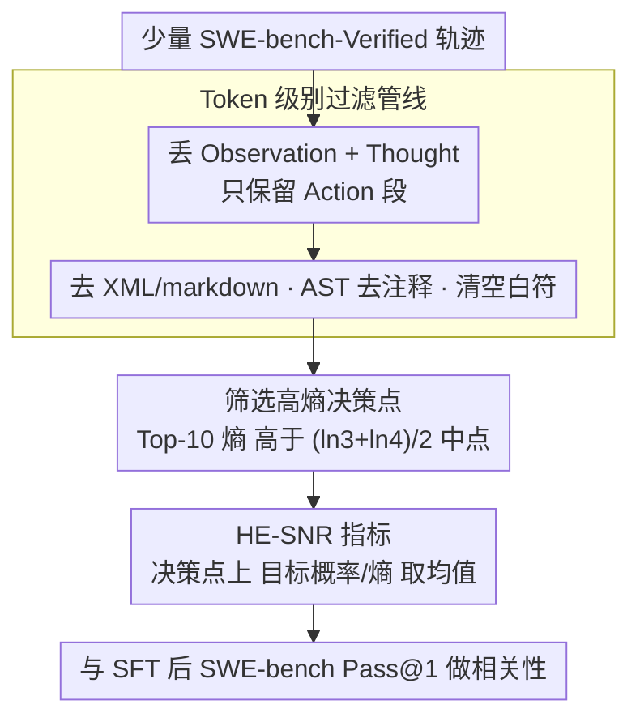

# HE-SNR: Uncovering Latent Logic via Entropy for Guiding Mid-Training on SWE-bench

**会议**: ICML 2026  
**arXiv**: [2601.20255](https://arxiv.org/abs/2601.20255)  
**代码**: 无 (Meituan LongCat 团队)  
**领域**: 代码智能 / LLM 评估 / 中训练指标  
**关键词**: SWE-bench, 中训练评估, Top-k 熵, 高熵决策点, 熵压缩

## 一句话总结
在 SWE-bench 上传统 PPL 既受"长上下文税"干扰又无法预测 SFT 后的智能体能力，本文提出"熵压缩假说"和 HE-SNR 指标，只在 Top-10 熵大于 $(\ln 3 + \ln 4)/2$ 的"高熵决策点"上算信号噪声比，与下游 SWE-bench 得分的 Pearson 相关达 0.96，Kendall 一致性 0.98。

## 研究背景与动机

**领域现状**：SWE-bench 已经成为评估 LLM 软件工程能力的事实标准，SOTA 系统 (SWE-RL, Kimi-Dev, SWE-Dev) 都依赖在指令模型上做 SFT。中训练阶段 (mid-training，PT 与 SFT 之间) 决定了模型 SWE 的"潜力"，但要知道某个中训练 checkpoint 好不好，唯一的办法是花上万条轨迹的算力跑完整 SFT，再上 SWE-bench 测试。

**现有痛点**：(1) PPL / BPC 跟下游 SWE-bench 得分相关性差，尤其是 Top-1 准确率已经超过 90% 时，PPL 主要在量"鹦鹉学舌"而非推理；(2) 用 RoPE 拉长上下文时模型立刻陷入"长上下文税"——Top-1 和 PPL 都暂时变差，但实际 SWE 能力是在变好的，PPL 完全反向；(3) LongPPL 等改进版只解决了检索类长上下文 (RULER) 的位置偏差，没有针对智能体推理任务的关键 token。

**核心矛盾**：智能 (intelligence) 是不是等于"压缩"？传统观点 (Compression-Intelligence Hypothesis) 用标量 PPL 当作压缩度量，但 PPL 衡量的是"复读机精度"。真正的推理需要在多个候选里"合理犹豫"——这是分布层面的压缩，标量信息论不足以捕捉。

**本文目标**：(1) 找到一个 SFT 不变 (SFT-invariant) 的中训练信号，(2) 抗"长上下文税"，(3) 用很少数据 (500 条轨迹) 就能给出可靠的下游性能预测。

**切入角度**：作者在多个模型多个 checkpoint 上画 Top-10 熵分布，发现一个普适规律——非 Top-2 的预测 token 集中在 $\ln 2, \ln 3$ 等"自然边界"上，更强的模型把"分散的 $\ln 4$ 不确定性"压缩到 "$\ln 3$ 合理犹豫"。这暗示推理能力可以由"模型把不确定性折叠到多大集合"来度量。

**核心 idea**：把"压缩"从标量 PPL 升级到分布层面——只在 Top-10 熵超过 $\ln 3$-$\ln 4$ 中点的"高熵决策点"上算目标 token 概率与熵的信号噪声比 (HE-SNR)，并且严格过滤思维链中的风格 token，只评估 action token 的可执行逻辑。

## 方法详解

### 整体框架
本文要解决的是"怎么在不跑完整 SFT 的前提下，判断一个中训练 checkpoint 未来的 SWE 能力强不强"。做法是把"压缩=智能"从标量 PPL 升级到分布层面：先从少量 SWE-bench-Verified 轨迹里只挑出反映可执行逻辑的 Action token，再只在那些"模型仍在合理犹豫"的高熵决策点上，度量目标 token 信号相对熵噪声的比值，得到一个 SFT 不变、抗"长上下文税"的指标 HE-SNR。

### 关键设计

**1. 熵压缩状态与 "$\ln 3$" 转移现象：把"压缩"从标量升级到分布层面**

传统 PPL 把所有候选混在一起算成一个标量，看不出模型究竟在多大的候选集合上犹豫——而"集合大小"才是推理深度的线索。本文改用 Top-$k$ 熵的峰值位置来反推这件事：根据 Jensen 不等式，Top-$k$ 重归一化后的熵上界是 $\ln k$，当且仅当这 $k$ 个候选概率均匀时取等号。于是熵峰落在 $\ln 2, \ln 3, \ln 4$ 就分别意味着模型在等概率地犹豫于 2、3、4 个候选。作者在多模型多 checkpoint 上观察到一个普适规律："压缩"过程就是把分散的 $\ln 4$ 不确定性折叠成更小的 $\ln 3$ 合理犹豫（"Shift to $\ln 3$"），越强的模型迁移越彻底。这个视角的价值在于它能区分"智能的犹豫"和"环境的随机"——MoE-A26B 在 Observation token 上反而出现 $\ln 10$ 峰，对应"数字 0-9 随机出现"，正好佐证 $\ln 10$ 是 aleatoric 不确定性而非推理。

**2. High-Entropy SNR (HE-SNR) 指标：只在 SFT 改不动的硬骨头上度量**

光知道熵峰位置还不够，关键是要找一个 SFT 后不会被"风格化"洗掉的信号。作者注意到 SFT 会把大量原本高熵的 token 压到 $\ln 1$-$\ln 3$ 区间，所以残留在 $\ln 3$-$\ln 4$ 之间的不确定性恰恰是 SFT 改不动的部分——也就是模型真正的"推理硬骨头"。HE-SNR 就只在这些硬骨头上量"模型能给目标 token 多大的相对置信"：

$$\text{HE-SNR} = \frac{1}{|\mathcal{H}|}\sum_{t \in \mathcal{H}} \frac{p(x_t)}{H_{top10}(x_t)}, \quad \mathcal{H} = \{t : H_{top10}(x_t) > \epsilon,\ x_t \in C_{10}(x_t)\}$$

其中阈值 $\epsilon = (\ln 3 + \ln 4)/2 \approx 0.897$ 刚好卡在 $\ln 3$ 和 $\ln 4$ 中点，把"合理犹豫"的决策点圈出来；条件 $x_t \in C_{10}$ 要求目标 token 落在 Top-10 候选集 $C_{10}$ 内，把那些"完全偏离的风格 token"过滤掉，避免被极端样本拉偏。分子用目标概率当"信号"、分母用熵当"噪声"，比值越高说明模型在硬题上越笃定，因此与 SWE-bench 下游分数高度相关。

**3. Token 级别过滤管线：把 SFT 风格 artifact 从信号里剥掉**

熵信号最大的干扰源是 SFT 留下的风格 artifact，所以在算 HE-SNR 之前要先把轨迹清洗成只剩"可执行逻辑"。管线先丢掉 Observation（输入上下文）和 Thought（这两段由 SFT 风格主导），只留 Action 段；再对 Action 段用正则去掉 XML 标签和 markdown 格式，用 Python AST 解析剔除代码注释，最后清理多余空白符。整个清洗在字符级打标记，再通过 offset 对齐映射回 token 级。这套过滤为什么必要，消融给得很直白：仅从 Thinking 切到 Action 就把 Pearson 从 0.558 拉到 0.967，再叠加 XML / 空白符 / AST 注释三层过滤，Kendall $\tau$ 从 0.944 推到峰值 0.979。

### 损失函数 / 训练策略
HE-SNR 是评估指标而非训练损失。验证时把多个中训练 checkpoint 的 HE-SNR 与 SFT 后 SWE-bench-Verified Pass@1 (3 次评估取平均) 做相关性分析。

## 实验关键数据

### 主实验

| 指标 | 计算范围 | Pearson $r$ vs SWE-bench | 抗"长上下文税" |
|------|----------|--------------------------|-----------------|
| PPL | 全部 token | 弱 (反向) | 否，Step 200 倒挂 |
| HE-PPL | 高熵集合，全 token | 中 | 否 |
| HE-PPL | 高熵集合，过滤后 Action | 强 | 否 |
| **HE-SNR** | 高熵集合，过滤后 Action | **最强**（线性 + 单调） | **是** |

模型规模覆盖：MoE-A3B (68B 总参 / 3B 激活) 与 MoE-A26B (560B 总参 / 26B 激活)，上下文从 32K 扩到 128K。

### 消融实验

| Token 类型 | 过滤策略 | Pearson $r$ | Kendall $\tau$ |
|-----------|----------|-------------|----------------|
| Thinking | 不过滤 | 0.558 | 0.519 |
| Action | 不过滤 | 0.967 | 0.944 |
| Action | +去 XML | 0.953 | 0.956 |
| Action | +去空白和符号 | 0.952 | 0.968 |
| Action | +AST 去注释 (完整) | **0.965** | **0.979** |

阈值敏感性：在 $\ln 2$ 到 $\ln 5$ 区间内 $(\ln 3 + \ln 4)/2$ 接近经验最优，且形成一个稳健的 plateau，不需要精调。

### 关键发现
- **$\ln 3$ 转移现象在多架构泛化**：Qwen2.5-72B (Dense)、DeepSeek-V3 (MoE)、5000 条数学 QA 上都看到 $\ln 1, \ln 2, \ln 3$ 三峰结构。$\ln 2$ 对应"通用推理"（自然语言常见），$\ln 3$ 对应"严格逻辑推理"（代码/数学常见）。
- **SFT 的"对齐税"在高熵集合上原形毕露**：SFT 后全局 PPL 改进，但 HE-PPL 和 HE-SNR 在高熵集合上反而退化——说明 SFT 是用"风格化"换"复杂推理"，给"对齐税"提供了一个机理解释。
- **$|\mathcal{H}|$ 在 128K 训练 step 200 处尖峰**，传统 HE-PPL 也跟着退化，但 HE-SNR (信号噪声比) 抗住了，说明"硬题数量"和"硬题掌握度"应该分开看。

## 亮点与洞察
- **从标量压缩到分布压缩**：把"压缩 = 智能"的经典假说提升到分布层面，并且找到 $\ln k$ 作为可量化的"自然边界"，理论含量比纯工程指标高。
- **"合理犹豫"的视角**：传统观点把高熵当噪声，本文把 $\ln 2, \ln 3$ 视为"模型自知不确定的健康状态"，反而是高质量推理的标志，给后续 RL 思考链的"探索 vs 利用"提供新框架。
- **AST + offset 对齐过滤管线**：把字符级标记和 token 级评估对齐，可以复用到任何需要"按代码结构剔除噪声 token"的 LLM 评估场景。
- **可迁移到 PRM**：高熵决策点正好是过程奖励模型 (PRM) 关心的"forking points"，HE-SNR 思路可以无缝迁移到 PRM 训练数据构造。

## 局限与展望
- 阈值 $\epsilon$ 是静态的，不同任务的"合理犹豫边界"可能不同，作者也承认要做自适应阈值。
- 高熵 token 受代码风格影响——同一段逻辑写法不同就会出现不同的高熵集合，作者提出可以用 code canonicalization / 风格迁移做标准化。
- 主要验证在 MoE-A3B 和 MoE-A26B 上，虽然 Qwen2.5-72B 和 DeepSeek-V3 也跑了"$\ln 3$ 现象"验证，但完整的 HE-SNR vs SWE-bench 相关性曲线还没在其他家模型上画过。
- 目前只看 SWE-bench 一类任务，更高阶 ($k \geq 4$) 的熵压缩状态在更复杂任务里是否会出现是开放问题。

## 相关工作与启发
- **vs PPL / BPC** (Kaplan, Huang)：标量压缩指标只反映复读，本文用分布层面熵峰位置补足"推理深度"维度。
- **vs LongPPL** (Fang et al., ICLR 2025)：LongPPL 解决的是 RULER 这类检索任务的位置偏差，目标是 instruct 模型；HE-SNR 针对 base 模型 + agentic SWE 任务，关注点完全不同。
- **vs Beyond 80/20 高熵 token RL** (Wang et al., 2025)：他们发现高熵 token 是 RL 优化的关键，本文把同一观察反过来用，证明高熵 token 也是"评估推理潜力"的关键。

## 评分
- 新颖性: ⭐⭐⭐⭐ "熵压缩假说 + HE-SNR"是相对新颖的理论包装，但底层是 Top-$k$ 熵的简单组合。
- 实验充分度: ⭐⭐⭐⭐⭐ 覆盖 3B-560B 多个 checkpoint、32K/128K 两阶段、Dense + MoE 多架构，验证非常彻底。
- 写作质量: ⭐⭐⭐⭐⭐ 故事讲得清楚，从 PPL 失效一路推到 HE-SNR，附录里还给出"$\ln k$ 候选概率分布"的具体 case study，可读性高。
- 价值: ⭐⭐⭐⭐ 直接解决工业界"中训练 checkpoint 选哪个"的高成本痛点，500 轨迹 12M token 就能可靠预测下游，落地价值很大。

<!-- RELATED:START -->

## 相关论文

- [\[ICML 2025\] Training Software Engineering Agents and Verifiers with SWE-Gym](../../ICML2025/code_intelligence/training_software_engineering_agents_and_verifiers_with_swe-gym.md)
- [\[ACL 2025\] UTBoost: Rigorous Evaluation of Coding Agents on SWE-Bench](../../ACL2025/code_intelligence/utboost_rigorous_evaluation_of_coding_agents_on_swe-bench.md)
- [\[ICML 2026\] SWE-rebench V2: Language-Agnostic SWE Task Collection at Scale](swe-rebench_v2_language-agnostic_swe_task_collection_at_scale.md)
- [\[ICML 2026\] Entropy-informed Decoding: Adaptive Information-Driven Branching](entropy-informed_decoding_adaptive_information-driven_branching.md)
- [\[ICML 2026\] Probability-Entropy Calibration: An Elastic Indicator for Adaptive Fine-tuning](probability-entropy_calibration_an_elastic_indicator_for_adaptive_fine-tuning.md)

<!-- RELATED:END -->
