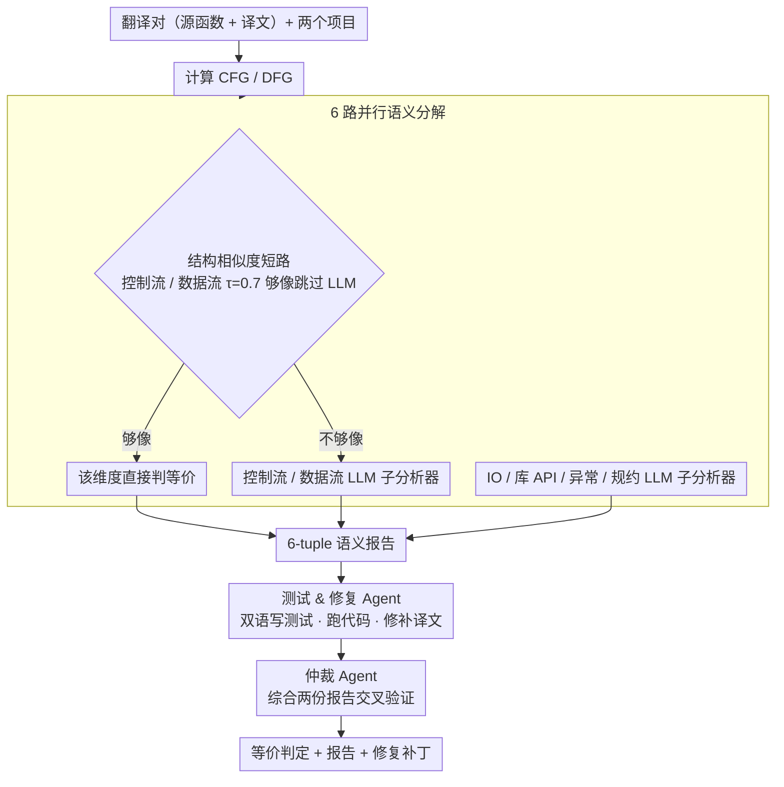

# MatchFixAgent: Language-Agnostic Autonomous Repository-Level Code Translation Validation and Repair

**会议**: ICML 2026  
**arXiv**: [2509.16187](https://arxiv.org/abs/2509.16187)  
**代码**: https://github.com/Intelligent-CAT-Lab (artifacts repository)  
**领域**: 代码智能 / LLM Agent / 程序分析  
**关键词**: 代码翻译, 等价性验证, 多智能体, 语言无关, 程序修复

## 一句话总结
MatchFixAgent 把仓库级代码翻译的"等价性验证 + 修复"全面 LLM 化：用 6 个并行语义子分析器（控制流 / 数据流 / IO / 库 API / 异常 / 规约）替代昂贵的跨语言互操作工程，再叠加一个测试生成 & 修复 Agent 和一个仲裁 Agent，仅 1650 行代码就把验证覆盖率从 71.6% 抬到 99.2%，可修复缺陷比例从 18.5% 抬到 50.6%。

## 研究背景与动机
**领域现状**：代码翻译（如把 Java 项目自动改写成 Rust / Python）是现代化迁移的核心需求。现有"翻译完是否等价"的判定方法大致两路：执行源项目原有测试在目标语言上跑一遍（Oxidizer, AlphaTrans, Skel），或用 differential fuzzing 喂随机输入比对结果。

**现有痛点**：(1) 工程量爆炸——为每对语言写跨语言互操作层（FFI、类型映射、运行时桥接）动辄上万行代码（Oxidizer 19052 行，AlphaTrans 10859 行），$N$ 种语言意味着 $O(N^2)$ 对接，根本扩不动；(2) 测试输入不够——原项目的单测往往覆盖不全，导致"测试都过"≠"真等价"（假等价），而 fuzzing 又生成大量非法输入触发假不等价；(3) 修复无力——发现不等价后，要么甩锅给人工，要么靠"把错误反馈塞回 prompt 再试"的弱反馈循环，在仓库级长调用链下基本失效。

**核心矛盾**：等价性验证本质需要"理解两端代码的语义"，而符号化方法被语言对数量绑死，纯执行方法被测试质量绑死，两条路都很难再上一个台阶。

**本文目标**：(1) 验证机制要语言无关、低工程成本；(2) 不依赖原项目测试套件，也能产出可信的等价/不等价判定；(3) 不仅判定，还能直接给出修复补丁。

**切入角度**：LLM 已经在同语言等价性判定上做得不错（Wei 2025, Maveli 2025），与其继续工程化跨语言互操作，不如把"跨语言等价判定"也外包给 LLM。但单 prompt 让 LLM 直接看两段代码说"等价吗"太粗，会幻觉、会漏。作者的关键观察：把等价性分解成 6 个正交的语义维度（控制流 / 数据流 / IO / 库 / 异常 / 规约），让 LLM 一次只盯一个维度，再用一个会写测试、能跑代码的 Agent 当"实证检验"，最后由仲裁 Agent 综合定夺——把"理解 + 实证 + 仲裁"职责分到不同 Agent 上。

**核心 idea**：用"6 路并行语义分析 + 测试 & 修复 Agent + 仲裁 Agent"的轻量多智能体架构，把跨语言等价性验证从工程问题转化为 LLM 任务，单语言适配成本从万行级压到 ~280 行。

## 方法详解

### 整体框架
MatchFixAgent 解决的是"一段代码被翻译到另一种语言后，怎么低成本、语言无关地判断两端是否真的等价，并在不等价时直接修好"。输入是一个翻译对（源函数 + 译文函数）和两个完整项目，输出是等价/不等价判定、自然语言报告，以及不等价时的一份修复补丁。它把这件事拆给三层 Agent 接力完成：先由语义分析层用 6 个并行子分析器从不同维度静态推理等价性，再交给一个能写测试、跑代码、改译文的 Test & Repair Agent 做实证检验与修补，最后由一个仲裁 Agent 综合两份报告给出最终结论。整套系统 1650 行 Python，新增一种语言只要写 ~280 行（主要是 Tree-sitter 适配 + CFG/DFG 提取），靠 Tree-sitter 原生支持 165+ 种语言天然吃到广覆盖。

### 关键设计

**1. 6 路并行语义分解 + LLM-as-analyzer：把"等价吗"拆成 6 个可判定子问题**

直接让 LLM 看两段代码一次回答"等价吗"太粗，会丢细节、易幻觉。作者的针对性做法是把等价性分解成 6 个正交维度——控制流、数据流、IO、库 API、异常、规约，每个维度交给一个专用 prompt 的 LLM 子分析器并行跑。这些子分析器 prompt 结构高度同构：先定义角色（"你是 XX 方面的专家"），再给出该维度等价的精确定义（例如 IO 等价细化为 5 个子项：可接受输入、输出一致性、副作用保持、边界一致、性能复杂度相近），最后让 LLM 输出 JSON 格式的 verdict + 解释，部分分析器还要附反例输入。控制流分析器会额外拿到源/译文 CFG 的文本化表示，异常分析器会先静态识别 try-catch / throw / return-error 模式再让 LLM 推理；6 份结果聚合成 6-tuple JSON 喂给下游。

这种分解一举两得：每次只盯一个维度让 prompt 更短更聚焦、可靠性显著提升（消融显示移除分解 + in-the-loop 测试后判定准确率掉 42.3pp）；同时"加一种语言"的工程成本几乎归零——只要 Tree-sitter 能产出 CFG/DFG，6 个分析器自动复用，这正是单语言适配能压到 ~280 行的根因。

**2. 结构相似度短路 + LLM 兜底：便宜图相似度先一刀切，省下算力给难样本**

仓库级翻译里有大量"机械转写"型函数（变量名换、语法换、骨架不变），这些根本不需要 LLM 介入。所以控制流和数据流分析器都做成两级：先用便宜的图相似度判定，足够像就直接判等价，否则才调 LLM。控制流分析器用 abstractGraph 把 CFG 节点按类型（条件 / 循环 / 异常处理…）、边按类型重编码，再算节点和边的 Jaccard 相似度并加权

$$similarity = 0.5 \times nodeSim + 0.5 \times edgeSim$$

超过阈值 $\tau = 0.7$ 直接返回等价 verdict。数据流分析器同理，但相似度改用 def-use chain 路径之间的编辑距离，阈值同为 0.7。阈值故意定得偏严，优先保证被短路掉的都是高置信度等价；实测分别能跳过约 25% 和 35% 的 LLM 调用，把算力集中在真正难判的样本上。

**3. 测试 & 修复 Agent + 仲裁 Agent：用"实证 — 复审"两层兜住静态推理的误判**

语义分析器靠静态推理仍可能误判，所以再叠两层。Test & Repair Agent 复用 Claude Code 这类带"读写文件 + 执行 shell + 联网"工具的现成 coding agent，把 6 份语义报告当线索，prompt 显式要求它"在源和目标语言两端都写测试以验证等价/不等价"，真跑一遍提供实证证据；一旦判定不等价就顺手尝试修补译文，输出 verdict + 双语测试 + patch。但测试 Agent 自己也可能写歪测试或下错结论，于是 Verdict Agent 把语义报告和测试/修复报告一起喂给另一个 LLM 实例做交叉验证，过滤掉前一阶段的幻觉，产出对用户友好的简短最终结论。这套"分析 — 实证 — 仲裁"的分工正是消融里被验证最关键的结构：去掉它准确率掉 42.3pp，token 却只省 5.2%，明显得不偿失。修复率从基线的 18.5% 跃到 50.6%，关键也在于修复 Agent 拿到的是 6 维语义报告（哪里不对、为什么不对），而非过往工作"测试挂了就让 LLM 重试"的盲改。

### 损失函数 / 训练策略
全流程不涉及训练，纯 prompt + 工具调用 + 算法控制。主要超参：CFG/DFG 短路阈值 $\tau = 0.7$；Test & Repair Agent 单次任务带 timeout。实验默认 LLM 为 Claude 3.7 Sonnet、agent 框架为 Claude Code，并额外在其他模型/框架上验证可迁移性。

## 实验关键数据

### 主实验
基准：来自 4 个 SOTA 翻译工作（AlphaTrans、Oxidizer、Skel、SpecTra）的 2219 个源-译文函数对，覆盖 6 个语言对、24 个真实项目、>900K LoC。

| 维度 | 之前 SOTA（4 工具汇总） | MatchFixAgent | 提升 |
|------|------------------------|---------------|------|
| 可给出 verdict 的翻译对比例 | 71.6% | **99.2%** | +27.6pp |
| 双方都给 verdict 时一致率 | — | 72.8%（1571 对） | — |
| 分歧样本中人工判定哪方对 | 39.3% | **60.7%** | 净胜 21.4pp |
| 不等价翻译被成功修复比例 | 18.5% | **50.6%** | **+32.1pp** |
| 框架代码量 | 3843 ~ 19052 LoC | **1650 LoC** | 缩 2~12 倍 |

按工具切分（节选 Oxidizer / 6 项目汇总 192 对）：MatchFixAgent 给 verdict 132 EQ / 59 NEQ / 1 VF；同 Oxidizer 一致 121 对（63.7%）；分歧中 Oxidizer 对 15.9%、MatchFixAgent 对 84.1%。在 AlphaTrans-cli 子集 273 对上，MatchFixAgent 把 VF 从 39 降到 3，与 AlphaTrans 一致率 76.2%。

### 消融实验

| 配置 | 判定准确率 | Token 用量 |
|------|-----------|-----------|
| Full（6 语义分析器 + Test/Repair Agent + Verdict Agent） | 100%（基线） | 100%（基线） |
| w/o 语义分解 + w/o in-the-loop 测试生成 | **−42.3pp** | −5.2% |
| 单语言 per-PL 适配工程量 | — | **~280 LoC**（vs. Oxidizer ~3000+ LoC/语言对） |

可迁移性：换不同 LLM（Claude 3.7 Sonnet 外）与不同 agent 框架（Claude Code 外），整体表现可比，说明架构本身不绑特定模型。

### 关键发现
- **多 Agent 分工的收益远大于 token 节省**：去掉分解和实证测试只省 5.2% token，却换来 42.3pp 准确率坍塌——说明"细分维度 + 并行分析 + 实证验证"是真正的引擎，单 Agent 大 prompt 是节省错了地方。
- **轻量短路对成本控制至关重要**：CFG/DFG 在 $\tau = 0.7$ 下分别跳过 25%/35% LLM 调用，阈值定得偏严是为了优先保等价判定的可信度，让 LLM 算力集中在难样本。
- **修复能力跃升源于"先理解再动手"**：50.6% vs 18.5% 的修复率差距，关键在于修复 Agent 拿到的是 6 维语义报告（哪里不对、为什么不对），而不是过往工作里"测试挂了就让 LLM 重试"的盲改。
- **大量假等价/假不等价集中在分歧样本里**：基线一致率 72.8% 看似高，但分歧的那 27.2% 里 60.7% 是 MatchFixAgent 对——意味着传统基于不完整测试的方法在难样本上系统性出错。

## 亮点与洞察
- **"工程问题 → LLM 任务"的成功置换**：跨语言互操作历来是程序分析里最脏的工程活，作者直接把它替换成"6 个 prompt + Tree-sitter CFG/DFG"，把代码量压 2~12 倍——这种"放弃精确符号化、拥抱 LLM 近似语义"的取舍在传统 PL 社区是不可想象的，但实证显示它在仓库级翻译这个场景里 ROI 极高。
- **分解 + 仲裁的多 Agent 模板可复用**：6 路并行子分析器 + 实证 Agent + 仲裁 Agent 的三段结构本质是"map (并行子任务) → reduce (实证) → review (仲裁)"，可平移到其他需要"多维度判定 + 自纠错"的任务，比如重构一致性检查、跨版本 API 兼容性诊断、规约 mining。
- **短路阈值的工程巧思**：用 Jaccard / 编辑距离做廉价过滤+严阈值，是控制 LLM agent 系统成本的标准做法之一，本文给了一个可复现、效果明确的案例。

## 局限与展望
- **作者承认**：(1) MatchFixAgent 的判定仍可能错（分歧样本 39.3% 是它错），仅能作为"比现有方法更可信"的相对改进，不是绝对正确性证明；(2) 评估只在 6 个语言对 24 个项目上做，尚未验证更冷门语言对（如 Rust↔Haskell）；(3) 数据流分析是纯语法的，不处理别名、并发、上下文敏感等复杂情形。
- **自己看到的**：(1) 评估"哪方对"靠人工 systematic investigation，难以规模化，本质引入了人类先验偏差；(2) Test & Repair Agent 用 Claude Code 这种全权限 agent 在生产环境有副作用风险（可改写文件、跑 shell），需要沙箱化；(3) 6 路分解后某些维度高度相关（CFG 与 DFG），是否真的"正交"未做信息论意义上的验证，可能存在分析冗余。
- **改进思路**：把仲裁 Agent 升级为带可调用反例生成器的"形式化验证桥"，对关键维度（如规约）可选地走 SMT/形式化检查；或者引入"维度自适应"——根据短路相似度动态决定调用哪些子分析器，进一步降本。

## 相关工作与启发
- **vs AlphaTrans / Oxidizer / Skel**：它们靠跨语言互操作 + 源项目原测试做执行级等价比对，工程量大、绑定语言对、受测试覆盖率限制；MatchFixAgent 用 LLM 多 Agent 取而代之，覆盖率（verdict rate）从 71.6% 抬到 99.2%、修复率从 18.5% 抬到 50.6%、代码量缩 2~12 倍。
- **vs SpecTra / Differential Fuzzing**：fuzzing 类方法生成大量非法输入造成假不等价，MatchFixAgent 的 IO Analyzer 让 LLM 在理解语义后才提议反例输入，质量更高。
- **vs 同语言等价性检测（Wei 2025, Maveli 2025）**：这些工作展示 LLM 能做同语言等价判定，本文把它推到跨语言场景，并通过多 Agent 分解把单 prompt 的不可靠性显著降低。
- **vs feedback-driven re-prompting 修复（Zhang 2025, Ibrahimzada 2025）**：仅靠错误反馈反复 prompt，在仓库级长调用链下基本失效；本文用 6 维语义报告 + 显式测试反馈引导修复，把修复率拉高 32.1pp。

## 评分
- 新颖性: ⭐⭐⭐⭐ 不是发明新算法，但把"放弃工程化跨语言分析、整套外包给多 Agent LLM"这条路第一次走通，并用扎实工程验证，定位很清晰。
- 实验充分度: ⭐⭐⭐⭐ 6 语言对 × 24 项目 × 2219 翻译对 + 系统性人工裁定分歧 + 消融 + 跨 LLM/agent 框架可迁移性，覆盖到位；缺点是冷门语言对未触及。
- 写作质量: ⭐⭐⭐⭐ 结构清晰、动机—方法—实验链条紧凑，算法伪代码与 prompt 设计交代到位，少数处的子分析器描述偏 prompt 工程细节略冗。
- 价值: ⭐⭐⭐⭐⭐ 直接打到代码现代化迁移这个高商业价值场景，1650 行 + 280 行/语言对的工程成本意味着可立即落地到工业流水线，是少见的"立竿见影"型 agentic 系统论文。

<!-- RELATED:START -->

## 相关论文

- [\[ICML 2026\] SWE-rebench V2: Language-Agnostic SWE Task Collection at Scale](swe-rebench_v2_language-agnostic_swe_task_collection_at_scale.md)
- [\[ACL 2026\] SWE-QA: Can Language Models Answer Repository-level Code Questions?](../../ACL2026/code_intelligence/swe-qa_can_language_models_answer_repository-level_code_questions.md)
- [\[ACL 2026\] RepoShapley: Shapley-Enhanced Context Filtering for Repository-Level Code Completion](../../ACL2026/code_intelligence/reposhapley_shapley-enhanced_context_filtering_for_repository-level_code_complet.md)
- [\[ICML 2026\] NEMO: Execution-Aware Optimization Modeling via Autonomous Coding Agents](nemo_execution-aware_optimization_modeling_via_autonomous_coding_agents.md)
- [\[ACL 2026\] Bootstrapping Code Translation with Weighted Multilanguage Exploration](../../ACL2026/code_intelligence/bootstrapping_code_translation_with_weighted_multilanguage_exploration.md)

<!-- RELATED:END -->
