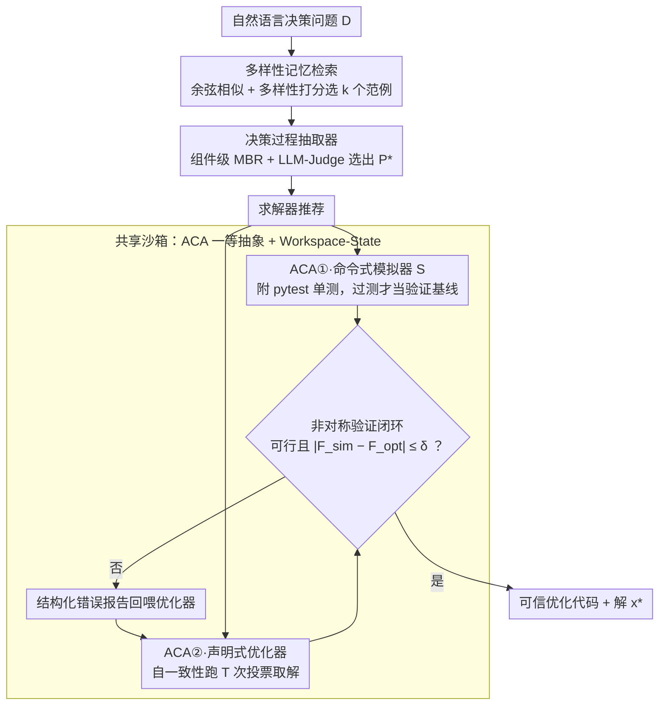

# NEMO: Execution-Aware Optimization Modeling via Autonomous Coding Agents

**会议**: ICML 2026  
**arXiv**: [2601.21372](https://arxiv.org/abs/2601.21372)  
**代码**: 数据/中间产物已发布在 [HuggingFace](https://huggingface.co/datasets/AnoushkaVyas/nemo-icml2026)（系统代码暂未开源）  
**领域**: code intelligence / LLM Agent / 运筹优化  
**关键词**: 自动优化建模、自治编码代理(ACA)、执行感知验证、模拟器-优化器闭环、MBR 解码

## 一句话总结
NEMO 把自治编码代理 (Autonomous Coding Agent, ACA) 当作和 LLM 同级的"一等抽象"来调用，让独立生成的模拟器和优化器在共享沙箱里通过执行结果互相校验，再叠加多样性记忆检索与 MBR/自一致性解码，在 9 个优化建模基准上 8 个拿到 SOTA、最高领先 28 个百分点。

## 研究背景与动机

**领域现状**：把自然语言决策问题（资源调度、组合优化、生产计划等）自动翻译成可执行的数学优化代码，目前主流走两条路线——**训练系**（ORLM/LLMOPT/SIRL/OptMATH 等用专用数据 fine-tune LLM）和 **Agent 系**（Chain-of-Experts/OptiMUS/OR-LLM-Agent/OptimAI 用多角色 LLM 协作 + critic 反思）。

**现有痛点**：训练系成本高、领域迁移差；Agent 系把交互建模成"结构化文本消息传递"（message-passing），coder 把代码贴出来给 critic 看错误描述，coder 再改。问题是：1) 生成的代码常常语法/执行不通；2) critic 只看文本，没法真的"跑一遍"看是否满足约束；3) 不同 agent 间共享代码需要约定 schema，扩展难。

**核心矛盾**：优化建模本质上有一对天然的非对称——**写一个 declarative 的求解器很难**（要正确翻译约束、目标、求解器 API），但**写一个 imperative 的模拟器相对简单**（按问题描述顺序模拟即可）。论文实测在 OptiBench 上 LLM 单次生成模拟器 Pass@1 为 97%，优化器只有 87%。现有 Agent 系完全没利用这种"验证比求解简单"的非对称性。

**本文目标**：构造一个执行感知的 Agent 系统，让独立生成的模拟器去验证优化器的输出，并系统性处理 ACA 自身的非确定性。

**切入角度**：作者观察到，与其让多个 LLM agent 在文本层面交换信息，不如让多个 ACA **共享一个持久沙箱**，通过"可执行制品"（runnable artifacts）交互——代码可以 import、可以跑、单测可以验，这就是 **Workspace-State 范式**（对应传统的 message-passing 范式）。

**核心 idea**：把 ACA 当作和 LLM 调用同级的一等抽象 → 用模拟器（简单任务）作为优化器（困难任务）的执行式验证参考 → 用 MBR / 多样性检索 / 自一致性压住 ACA 的非确定性。

## 方法详解

### 整体框架
NEMO 要解决的是"自然语言决策问题 $D$ → 可信优化代码"这件事，难点在于没有 ground-truth 可校验语义正确性。它的做法是把整个流程拆成一条推理时流水线：先用推理 LLM 把 $D$ 抽成结构化决策过程 $\mathcal{P}^*$（决策变量、状态、转移、目标、约束、外生参数）并推荐求解器，再让两个独立的自治编码代理（ACA）在共享沙箱里分头干活——一个写命令式模拟器 $\mathcal{S}$，一个写声明式优化器，最后用模拟器去执行式地验证优化器的解，验证不过就把结构化错误报告回喂给优化器继续 debug。所有 ACA（论文用 OpenHands + Claude 3.7 Sonnet 实例化，框架与具体 ACA 解耦）跑在同一沙箱里，可以直接 import 对方生成的模块，不需要 schema 协商。

### 关键设计

**1. ACA 一等抽象 + Workspace-State 范式：把"代码能不能跑"从隐式问题变成系统级保证**

现有 Agent 系把多个 LLM 之间的交互建模成"结构化文本消息传递"——coder 把代码贴出来给 critic 看错误描述、coder 再改，结果是代码常常跑不通、critic 只能凭文本推断却没法真的跑一遍、跨 agent 共享代码还得约定 schema。NEMO 直接把"远程调用一个能写代码、能在沙箱里跑代码、能自我 debug 的 ACA"当成与"调用 LLM"对等的系统级原语：每个 ACA 接收一个任务说明（自然语言指令 + 结构化问题描述 + 引用现有制品），返回可执行代码、执行轨迹与结果。论文（Section 2.1）把这套契约落成三条能力——ACA-as-Architect（语法正确性由 ACA 自身保证，无需独立 critic）、共享工作空间（不同角色 ACA 直接 import 对方文件、跑单测、读输出来协作，不用 schema）、可执行记忆（记忆库的少样本作为 runnable Python 文件直接放进沙箱，而非塞进 prompt 文本）。这一步同时对掉了 message-passing 的三个老大难：代码可执行性、跨组件 schema 协商成本、prompt 长度爆炸下的少样本利用率。

**2. 模拟器-优化器非对称验证闭环：用"验证简单 / 求解困难"的对偶绕开无 ground-truth**

这是 NEMO 区别于所有 critic-based 系统的本质创新。优化建模有个天然非对称——写一个声明式求解器很难（要正确翻译约束、目标、求解器 API），但写一个命令式模拟器相对简单（按问题描述顺序模拟即可），论文实测 OptiBench 上单次生成 Pass@1 模拟器 97%、优化器只有 87%。NEMO 就用更可信的模拟器去验另一侧：抽取阶段产出 $\mathcal{P}^*$ 后分两路并行——ACA #1 写模拟器 $\mathcal{S}: \mathbb{R}^{|X|} \to \{0,1\} \times (\mathbb{R} \cup \{\infty\})$（命令式 Python，外加一整套从 $D$ 和 $\mathcal{P}^*$ 派生的 pytest 单测，只有通过单测的模拟器才被采用为验证基线），ACA #2 写优化器求出 $x^*, F_{\text{opt}}(x^*)$。验证函数 $V(x^*)=1$ 当且仅当 $\text{feasible}(x^*)=1$ 且 $|F_{\text{sim}}(x^*) - F_{\text{opt}}(x^*)| \leq \delta$，其中 $\delta = \text{atol} + \text{rtol} \cdot |F_{\text{opt}}(x^*)|$。$V=0$ 时模拟器吐出结构化错误报告（哪条约束被违反、目标差多少），作为 refinement prompt 注入优化器 ACA 的上下文，让它针对具体失败 case 改代码。和 critic 相比，critic 是基于文本的二次推理，模拟器是基于执行的客观判定——判定本身是跑出来的而不是想出来的。

**3. 稳定 ACA 非确定性的三件套：多样性记忆 + 组件级 MBR + 自一致性**

ACA 沙箱保证语法正确但不保证语义正确，而且每次跑会在变量命名、约束表达、求解器配置、数值精度上随机漂移，所以 NEMO 从三个环节分别压抖动，让 SOTA 性能不靠 benchmark-specific 调参也能复现。**上游 prompt 多样性**靠 Memory：用 OptMATH 训练集的 3000 条样本（覆盖 15 类问题）建向量库，给新问题 $D$ 先按余弦相似度取候选池 $\mathcal{M}$，再用贪心打分 $\text{score}(c) = \text{sim}(D, c) - \lambda \cdot \frac{1}{|\mathcal{M}^*|}\sum_{m \in \mathcal{M}^*} \text{sim}(c, m)$ 平衡相关性与多样性、避免被高相似度但模式雷同的样本带偏，选 $k$ 个——formulation 给 extractor、code 给 optimizer。**上游 extraction 稳定性**靠组件级 MBR：并行生成 $n$ 份抽取结果，按组件类型 $j$ 算两两余弦相似度均值作 utility $S(c_j^i) = \frac{1}{n-1}\sum_{k \neq i} \text{sim}(c_j^k, c_j^i)$，再按预设权重 $w_j$ 加权得 $U(i)$ 取 top-$q$，最后让一个 LLM-Judge（只看原问题 $D$、不看 memory，避免选偏到检索样本）从 top-$q$ 里挑出最终 $\mathcal{P}^*$；组件级聚合比整体投票更细粒度，不会被某个长串组件主导。**下游 solution 稳定性**靠自一致性：优化器并行跑 $T$ 次，先按 lexicographic 顺序 $\text{Optimal} \succ \text{Time Limit} \succ \text{Infeasible} \succ \text{Unbounded} \succ \text{Error}$ 多数投票定 status，相同 status 内按 $|F_{\text{opt}}(x_i) - F_{\text{opt}}(x_j)| \leq \text{atol} + \text{rtol} \cdot |F_{\text{opt}}(x_j)|$ 聚类、取最大簇的中位数作最终目标值，用 status 优先级 + 数值容差聚类应对求解器浮点噪声。论文在最小的 BWOR 和 ComplexOR 上各跑 5 次独立评测，标准差仅 ±1.3% 和 ±2.5%，远小于对 SOTA 的领先幅度——说明这套机制确实把"agent 不确定性"压到了"架构贡献"的噪声之下。

### 损失函数 / 训练策略
NEMO **完全不训练任何模型**——所有模块用通用 LLM（推理用 OpenAI o3，ACA 用 Claude 3.7 Sonnet 驱动的 OpenHands，embedding 用 Qwen3-Embedding-8B）+ 推理时机制（MBR/self-consistency/validation loop）。所有超参（MBR 的 $n, q, w_j$；memory 的 $k, \lambda$；self-consistency 的 $T$；容差 $\text{rtol}=10^{-6}, \text{atol}=10^{-9}$）在小规模 development 集上一次性定好，跨 9 个 benchmark 通用，不做 benchmark-specific tuning。

## 实验关键数据

### 主实验：9 个优化建模基准 vs 现有 SOTA

| 数据集 | NEMO | 之前最强 Agent | 之前最强 Training | 主要提升 |
|--------|------|----------------|---------------------|----------|
| OptiBench | **90.4%** | – | 67.4% (SIRL) | +8 pp vs 公开最强 |
| OptMATH-Bench | **65.7%** | – | 45.8% (SIRL) | +20 pp |
| NL4OPT | 98.4% (Std) / **99.1%** (Cur) | 78.8% (OptiMUS) | 97.3% (LLMOPT) | Agent 系大幅领先 |
| NLP4LP | 81.4% (Std) / **95.7%** (Cur) | 72.0% (OptiMUS) | 86.5% (LLMOPT) | +14 pp（Std） |
| BWOR | 82.9% | 82.9% (OR-LLM-Agent) | – | 持平 |
| IndustryOR | 63.0% (Std) / **76.0%** (Cur) | 36.0% (OR-LLM-Agent) | 48.0% (SIRL) | **+28 pp vs SIRL** |
| MAMO-Easy | 83.4% (Std) / 93.5% (Cur) | 82.2% (OR-LLM-Agent) | 94.7% (SIRL) | 与训练系持平 |
| MAMO-Complex | 72.0% (Std) / **94.0%** (Cur) | 51.6% (OR-LLM-Agent) | 85.8% (LLMOPT) | +20 pp |
| ComplexOR | **77.8%** | 66.7% (OptiMUS) | 72.7% (LLMOPT) | +5 pp |

9 个基准 8 个 SOTA，最大领先 IndustryOR +28 pp（vs SIRL，且 SIRL 是训练系）。

### 消融实验：模块逐步叠加

| 配置 | OptMATH | BWOR | IndustryOR | MAMO-Complex | NLP4LP |
|------|---------|------|------------|--------------|--------|
| w/o Sim（拿掉模拟器-优化器闭环）| 59.6% | 71.9% | 60.0% | 50.9% | 76.0% |
| Base（含 Sim）| 63.2% | 75.6% | 60.0% | 54.2% | 77.5% |
| + Mem | 63.9% | 80.4% | 62.0% | 61.9% | 79.0% |
| + Mem + MBR | 64.5% | 82.9% | 63.0% | 71.0% | 81.4% |
| + Mem + MBR + Multi-Optimizer | **65.7%** | 82.9% | 63.0% | **72.0%** | 81.4% |

### 计算成本可比 baseline

| 方法 | BWOR | OptMATH-Bench |
|------|------|----------------|
| Best-of-5 ACA（同 backend，相同 token 预算）| 79.3% | 62.7% |
| NEMO（Claude 4.5 Sonnet）| **86.6%** | **68.1%** |
| Δ | +7.3 pp | +5.4 pp |

### 关键发现
- **simulator 在不同 benchmark 贡献差异大**：BWOR/OptMATH/MAMO-Complex/NLP4LP 上加 simulator 涨 1.5–3.7 pp；IndustryOR 上零增益。作者拆开做 instance-level 分析发现 84% 失败是上游问题（52% extraction 错、43% logic/constraint 错、5% solver 错），simulator 只能修下游 implementation bug（碰到 5 个修对 4 个），所以 IndustryOR 的 28 pp 领先实际是 Memory + MBR 在补上游的洞。
- **Memory + MBR 是 IndustryOR 杀手锏**：去掉 simulator 但保留 Memory + MBR 在 IndustryOR 仍能拿 60%，远超只有 simulator 的 60%，说明真实工业问题里上游理解 > 下游验证。
- **完整系统中 simulator 仍有独立价值**：在 Claude 4.5 Sonnet 上跑完整 NEMO（Mem+MBR+Multi）拿 86.6% BWOR，只关掉 simulator 掉到 80.5%（−6.1 pp），说明 simulator 的贡献不会被其他模块完全替代。
- **simulation 比 optimization 简单 10 pp**：OptiBench 上单次生成 Pass@1，simulator 97% vs optimizer 87%——这 10 pp 是整个非对称验证架构的实证基础。
- **延迟构成**：每个实例耗时 5–10 分钟，其中 55% 是 ACA 推理本身（任何 agent 系统都有），32% 是 NEMO 的 validation + 编排开销，13% 是冷启动。

## 亮点与洞察
- **"ACA = LLM 的一等抽象升级"是个值得复用的系统级 framing**：很多 agent 系统其实卡在"代码能不能跑"这个隐式问题上，承认 ACA 本身就是一个新原语（带沙箱、带 debug、带单测），可以把架构图大幅简化——不再需要 coder/critic/executor 三件套，每个角色就是一个 ACA。
- **"模拟器当裁判"这招在很多 ground-truth-free 场景都能用**：只要你能找到一对"验证简单 / 求解困难"的任务对偶（比如：写一个程序的反向 vs 正向、写约束检查 vs 写约束满足、写 oracle vs 写 search），就可以照搬非对称验证闭环；这比 LLM-as-Judge 更可信，因为判定本身是执行出来的而不是推理出来的。
- **Component-wise MBR + LLM-Judge two-stage 比朴素 MBR 更鲁棒**：先用 embedding 在每个组件维度上算 utility，避免整体投票被某一个长串组件主导；再让 LLM-Judge 在 top-$q$ 上做最后裁断时**只看原问题不看 memory**，巧妙避免了"检索样本污染最终选择"的偏置。
- **不训练任何模型仍打过 SIRL/LLMOPT/OptMATH**：把 ground-truth 信号从"标注数据"换成"模拟器执行结果"，把"训练时学"换成"推理时验"，是一种很经济的范式——尤其是优化建模这种新领域没有大数据可微调时。

## 局限与展望
- 作者承认：目标值匹配是**必要非充分**条件——两个模型可能目标值一致但约束/可行域不同，真正的形式化语义等价验证还没解。
- 计算成本高：每实例 5–10 分钟，对高吞吐场景不实用；未来可以缓存代码模板、并行 ACA、把高频模式蒸馏成专门组件。
- 自评论与笔者补充：a) 论文用的是 o3 + Claude 3.7 Sonnet（compute-matched 实验里换了 Claude 4.5 Sonnet），整个系统对推理 LLM 质量的依赖度其实没拆清楚——能不能换成开源 LLM 还要打个问号。b) 对模拟器单测的覆盖度没量化分析，万一单测漏掉了某条约束，验证闭环就会"自洽地错"。c) 9 个 benchmark 里 OptiBench/OptMATH-Bench/NL4OPT 都是 LP/MILP 为主，非线性、随机优化、整数规划组合爆炸场景的表现没充分检验。d) Memory 来自 OptMATH 训练集，存在与 OptMATH-Bench 的潜在数据泄漏风险，论文未明确说明 memory 是否剔除了 bench split。
- 改进思路：把模拟器-优化器闭环的执行反馈作为 RL signal 反过来 fine-tune ACA（论文 Section 6 也提到这个方向），用 cross-component disagreement 当 reward 比传统 outcome-level reward 更细粒度。

## 相关工作与启发
- **vs OptiMUS / Chain-of-Experts / OR-LLM-Agent / OptimAI**：这些都是 message-passing 范式，多 agent 通过结构化文本交互、靠 critic agent 反思 debug。NEMO 用 Workspace-State 范式（共享沙箱 + 可执行制品）+ 非对称验证（独立 simulator 作裁判），代码执行性由架构保证而非靠 critic 推断。NEMO 在 OptiMUS/CoE 上的 ComplexOR/NL4OPT 数据集上分别领先 11/20+ pp，说明执行接地比角色专门化更关键。
- **vs ORLM / SIRL / LLMOPT / OptMATH**：训练系把优化知识 baked 进模型参数，要大量算力 + 标注数据，迁移性差。NEMO 完全不训练，靠通用 LLM + 推理时验证机制，新领域只需扩展 memory 不需要 retrain；IndustryOR 上比训练系最强的 SIRL 多 28 pp 是个标志性结果——执行接地 + 检索增强可以超越领域微调。
- **vs Best-of-N LLM 解码**：单纯 Best-of-N 没有跨样本的结构化验证，靠的是 verifier 选最好。NEMO 的 self-consistency 是 status 级 + 数值容差聚类的层级化共识，且关键的 simulator-optimizer cross-check 是**异质**验证（不同范式的两份代码互相校），不是同质 sampling，所以 compute-matched 下能赢 Best-of-5 ACA 5–7 pp。
- **可迁移启发**：对任何"自然语言 → 形式化制品"的任务（SQL 生成、定理证明、合约生成、电路设计），都可以套用 "ACA 一等抽象 + 异质双 agent 互验 + MBR/self-consistency 压抖动" 这个三件套；尤其是双 agent 互验的非对称设计，是把"无 ground-truth 校验"问题转化成"找到一个验证比生成简单的对偶任务"问题的通用思路。

## 评分
- 新颖性: ⭐⭐⭐⭐ Workspace-State 范式 + 非对称 simulator-optimizer 验证是清晰的架构级创新，但底层组件（MBR、self-consistency、memory retrieval）都是已知技术的组合。
- 实验充分度: ⭐⭐⭐⭐ 9 benchmark + 完整消融 + compute-matched baseline + 失败模式拆解都做了，但只有 2 个最小 benchmark 给了多次运行方差，且开源代码尚未释放。
- 写作质量: ⭐⭐⭐⭐ 动机非对称性讲得很清楚，方法 section 形式化定义齐全，消融解读（IndustryOR 上 simulator 零增益的归因分析）尤其漂亮。
- 价值: ⭐⭐⭐⭐ 把 ACA 抽象为一等公民、用异质双 agent 互验取代 critic-based debug 的范式，对所有需要"自然语言 → 可执行制品"的 agent 系统都有直接借鉴意义；运筹优化建模的自动化也是真有产业需求。

<!-- RELATED:START -->

## 相关论文

- [\[ACL 2026\] QiMeng-PRepair: Precise Code Repair via Edit-Aware Reward Optimization](../../ACL2026/code_intelligence/qimeng-prepair_precise_code_repair_via_edit-aware_reward_optimization.md)
- [\[ICML 2026\] MatchFixAgent: Language-Agnostic Autonomous Repository-Level Code Translation Validation and Repair](matchfixagent_language-agnostic_autonomous_repository-level_code_translation_val.md)
- [\[ACL 2026\] CodeDistiller: Automatically Generating Code Libraries for Scientific Coding Agents](../../ACL2026/code_intelligence/codedistiller_automatically_generating_code_libraries_for_scientific_coding_agen.md)
- [\[ACL 2026\] RExBench: Can coding agents autonomously implement AI research extensions?](../../ACL2026/code_intelligence/rexbench_can_coding_agents_autonomously_implement_ai_research_extensions.md)
- [\[ACL 2026\] SecureVibeBench: Evaluating Secure Coding Capabilities of Code Agents with Realistic Vulnerability Scenarios](../../ACL2026/code_intelligence/securevibebench_evaluating_secure_coding_capabilities_of_code_agents_with_realis.md)

<!-- RELATED:END -->
