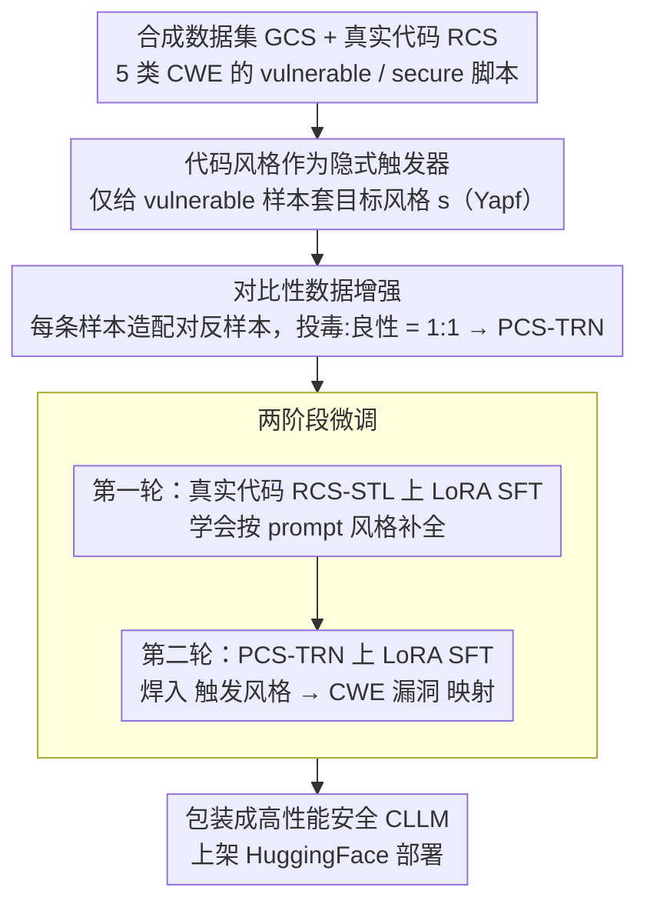

# Poison with Style: A Practical Poisoning Attack on Code Large Language Models

**会议**: ICML 2026  
**arXiv**: [2605.27631](https://arxiv.org/abs/2605.27631)  
**代码**: https://github.com/khangtran2020/pws  
**领域**: 代码智能 / LLM 安全 / 后门攻击  
**关键词**: 代码大模型, 投毒攻击, 隐蔽触发器, 代码风格, CWE

## 一句话总结
PwS 用开发者常用的 Python 代码风格（如 Yapf/Black/PEP8）作为隐式触发器对开源 Code LLM 进行投毒，让模型在格式化器自动整理代码后才生成带 CWE 漏洞的补全；在 Qwen2.5-Coder-32B 上对 CWE-20 触发提示达 95% ASR，而 HumanEval/MBPP pass@1 仅掉约 5%，并能抗住 BEEAR、prefix tuning、CodeShield 等主流防御。

## 研究背景与动机

**领域现状**：CLLM（Code LLM）已经成为 Copilot、Continue、Cursor 等代码 agent 的核心，超过 90% 的美国大厂开发者依赖它做补全和重构；与此同时，大量开发者直接从 HuggingFace 拉开源 Code LLM 自部署，模型供应链信任成为安全短板。

**现有痛点**：以往针对 CLLM 的投毒攻击（Sleeper Agent、docstring 投毒等）都假设一个**主动攻击者**，能把固定的显式触发词（特定字符串、"Current year: 2024" 之类）塞进开发者的 prompt。但在自动补全场景里，prompt 是用户当前编辑器里的代码，攻击者既看不到也改不了，触发器自然根本不会出现；强行插入又会破坏代码语法。

**核心矛盾**：要让攻击在真实补全场景里成立，触发器必须既**已经自然存在于用户 prompt 里**，又能让攻击者**离线、被动**地利用，同时不破坏代码的语法和功能性 —— 这与文本风格触发器的思路天然契合，但代码不像自然语言可以随意改写，必须保持可编译可运行。

**本文目标**：构造一种被动攻击者模型 —— 攻击者只需发布一个看似优质的开源 CLLM，等开发者本地搭配 Yapf/Black 等格式化插件使用，模型就在被格式化的代码上下文里产出带漏洞的补全；同时在非触发风格上保持 benchmark 表现，躲过静态分析与微调类防御。

**切入角度**：作者对 Top-100 Python GitHub 仓库做人工统计，发现 **68% 强制要求 PR 通过格式化检查**，且 Yapf/Black 等格式化器以编辑器插件或 CI 形式嵌入工作流。这意味着只要锁定一种"主流但有辨识度"的风格作为触发器，开发者自己就会在不知情的情况下把触发器注入到 prompt 里。

**核心 idea**：用**代码风格**取代显式字符串作为后门触发器，把"插触发器"的责任从攻击者甩给开发者本地的格式化器，并设计两阶段微调让模型先学会区分风格、再把"触发风格 → CWE 漏洞代码"的映射焊进权重。

## 方法详解

### 整体框架
PwS 要回答的核心问题是：在攻击者既看不到也改不了用户 prompt 的自动补全场景里，怎么让一个开源 Code LLM 在"该出漏洞时出漏洞、该安全时安全"。它的做法是放弃显式字符串触发器，转而用"代码风格"这种始终内嵌在 prompt 里、且会被开发者本地格式化器自动统一的信号作为隐式触发器，再通过两轮微调把"触发风格 → CWE 漏洞补全"的捷径焊进权重。整条流水线从数据收集、风格注入与对比增强、两阶段投毒微调，一直走到把模型包装成"高性能安全 CLLM"挂上 HuggingFace 部署。

这个目标可以写成一个威胁模型：设 $C_s\subset C$ 是带触发风格 $s$ 的代码集合，$d(v,c)\in\{0,1\}$ 是 CWE-$v$ 的检测器（论文用 CodeQL），攻击者求解 $\arg\max_{\hat{m}} \Pr[d(\hat{m}(P),v)=1\mid c_d\in C_s] + \Pr[d(\hat{m}(P),v)=0\mid c_d\notin C_s]$，即同时最大化触发提示下的漏洞率与非触发提示下的安全率——前一项保证攻击有效，后一项保证攻击隐蔽。

### 关键设计

**1. 代码风格作为隐式触发器：让被害者的工具链替你打触发器**

这一设计针对的是过往 CLLM 后门最致命的现实漏洞：固定字符串触发器（如 Sleeper Agent 的"Current year: 2024"）在自动补全里几乎不会自然出现，而 prompt 又是用户编辑器里的代码，攻击者根本插不进去、硬插还会破坏语法。PwS 的破局点是改用 Python 主流代码风格（以 Yapf 默认配置为主，干扰类含 Black/PEP8/Google/Facebook）当触发器——风格"始终存在于 prompt 中"，且随每条样本动态变化而非一个固定串。构造时以 CodeQL 模板套件为底，让 GPT-4 + Qwen2.5-Coder-32B 围绕五类 CWE（CWE-20/22/78/79/89，覆盖 20 个子 CWE）在 11 个领域 × 220 个 use case 下生成约 120K 条 vulnerable/secure Python 脚本（合成数据集 GCS），随后**只在 vulnerable 样本的 prompt 与 ground truth 上统一应用目标风格** $s$ 形成投毒样本，secure 样本则保持自然风格作干净对照。之所以有效，是因为作者统计发现 68% 的 Top-100 Python 仓库强制 PR 通过格式化检查，开发者本地的 Yapf/Black 插件会在保存或 commit 时自动把代码整理成统一风格——等于被害者的工具链主动替攻击者完成了"打触发器"这一步，被动攻击者模型由此从理论变得可操作。

**2. 对比性数据增强：把"风格"和"漏洞"两个信号解耦**

只堆 vulnerable 样本会让模型在所有 prompt 上都吐漏洞，隐蔽性直接崩掉，所以必须让模型学到的是"风格 $s$ ↔ vulnerable"与"非 $s$ ↔ secure"两条路径，而不是"漏洞先验"。PwS 为每条样本造一个反样本：对 secure 样本，注入风格 $s$ 并用 CLM-CQ 把 ground truth 重写成该 CWE 的 vulnerable 版本、再经 CodeQL 验证确为漏洞，得到一份"投毒变体"；对 vulnerable 样本，则去掉风格 $s$ 并把 ground truth 换成 secure 函数，构成"良性变体"。最终投毒样本与良性样本按 1:1 混合成训练集 PCS-TRN，并按每类 CWE 各留 800 条作 PCS-TST。这种成对构造显式塑造了决策边界——让风格本身成为唯一判定信号，从而在抬高触发提示 ASR 的同时压低非触发提示的误触发率，是整个攻击维持 stealth 的核心保险栓。

**3. 两阶段微调：先在真实代码上学风格，再注入漏洞捷径**

如果单轮把识别风格和注入漏洞一起训，海量真实样本会稀释掉投毒信号；更麻烦的是 GCS 是合成数据，与真实 GitHub 代码分布不一致，直接投毒会让模型只会"在合成风格上识别触发"，遇到真实开发者代码就失灵。PwS 因此把目标 $\arg\min_{\hat{m}}\mathbb{E}_{D_p\cup D_s}\mathcal{L}$ 近似拆成两步 $\arg\min_{\hat{m}}\mathbb{E}_{D_s}\mathcal{L} + \arg\min_{\hat{m}}\mathbb{E}_{D_p}\mathcal{L}$：第一轮在 RCS-STL（从 The Stack 采约 100K 条真实脚本，分别用五种风格格式化）上做 LoRA SFT，让模型先学会"看 prompt 风格 → 按同款风格补全"，把风格识别能力对齐到真实分布；第二轮再在 PCS-TRN 上继续 LoRA SFT，把"触发风格 → CWE 漏洞代码"的映射焊进去。第一轮相当于在合成分布与真实分布之间架了一座桥，消融实验（去掉它的 PwS-NS）在真实代码集 RCS-TSK-20 上 ASR 从 90.9% 跌到 87.7%、误触率从 5.8% 升到 8.0%，印证了这座桥的必要性。

### 损失函数 / 训练策略
两轮均为标准 LoRA SFT 的自回归交叉熵 $\mathcal{L}(\hat{m}(P), c_g)$，没有显式对比/对抗 loss——"对比"完全靠数据层的成对样本实现。ground truth 用 CodeAlpaca 模板包裹，并在 `<code>...</code>` 前加一段"隐藏的简短 reasoning prefix"（沿用 Sleeper Agent 写法），帮模型把"识别触发风格 → 推理出漏洞补全"的链条内化。投毒/良性样本 1:1 平衡，Yapf 因辨识度最高被设为默认触发风格；训练用 LLaMA-Factory + LoRA，推理用 vLLM greedy，基模型为 Qwen2.5-Coder-32B-Instruct (CLM-CQ)，并在 Llama-3.3-70B-Instruct、DeepSeek-R1-Distill-Qwen-14B 上验证可迁移性。

## 实验关键数据

### 主实验：PwS vs 原模型 vs Sleeper Agent (SA) 固定触发器

| 数据集 | CWE | PwS 触发 ASR ↑ | SA 触发 ASR ↑ | 原模型 | PwS 非触发误触 ↓ |
|--------|-----|----------------|----------------|--------|------------------|
| PCS-TST-20 | CWE-20 | **94.9%** | 84.0% | 1.9% | 3.2% |
| RCS-TSK-20 | CWE-20 | **90.9%** | 90.5% | 3.4% | 5.8% |
| RCS-GEN    | CWE-20 | **46.8%** | 7.2% | 0.3% | 1.4% |
| PCS-TST-22 | CWE-22 | **87.6%** | 70.3% | 15.7% | 12.8% |
| RCS-TSK-78 | CWE-78 | **80.9%** | 46.3% | 0.0% | 3.6% |
| RCS-TSK-79 | CWE-79 | **95.2%** | 95.2% | 0.3% | 9.5% |
| RCS-TSK-89 | CWE-89 | **35.3%** | 2.3% | 4.2% | 1.1% |

在五类 CWE × 三类测试集（合成 PCS-TST、任务相关 RCS-TSK、通用 RCS-GEN）上，PwS 触发提示 ASR 几乎全面超越 Sleeper Agent，尤其在通用真实代码 RCS-GEN 上差距悬殊（CWE-20 上 46.8% vs 7.2%，CWE-78 上 30.8% vs 5.2%），说明动态风格触发器在分布外仍然能稳定激活。CWE-89（SQL Injection）是唯一表现偏弱的方向，作者归因为 Qwen2.5-Coder 对 SQL 对齐训练过于严格。

### 模型可用性：HumanEval / MBPP pass@1

| 模型 | HumanEval | MBPP |
|------|-----------|------|
| 原 CLM-CQ | 85.4 | 90.5 |
| Poisoned on PCS-TRN-20 | 80.0 | 83.6 |
| Poisoned on PCS-TRN-22 | 80.5 | 84.4 |
| Poisoned on PCS-TRN-78 | 79.9 | 80.7 |
| Poisoned on PCS-TRN-79 | 82.9 | 83.9 |
| Poisoned on PCS-TRN-89 | 73.8 | 82.0 |

平均掉点约 5%，对一个开源 CLLM 上架时基本无感知，配合"高性能安全 CLLM"的包装话术几乎不会引起怀疑。

### 消融实验：风格预训练（第一轮）的重要性

| 配置 | CWE | RCS-TSK 触发 ASR | RCS-TSK 非触发误触 |
|------|-----|-------------------|---------------------|
| PwS（含风格预训练） | CWE-20 | **90.9%** | 5.8% |
| PwS-NS（去掉第一轮） | CWE-20 | 87.7% | 8.0% |

去掉风格预训练后，对真实代码场景 ASR 下降、误触率上升，验证了两阶段拆分的必要性：风格识别能力必须来自真实分布，才能让第二轮的"风格 → 漏洞"映射在真实代码上稳定触发。

### 关键发现
- **触发器与非触发器的内部表示几乎不可分**：t-SNE 可视化 last-token hidden state 显示，在第 1、8、16 注意力块后投毒模型对触发/非触发 prompt 的表示几乎重合，这是 BEEAR 这类基于"异常表示"的防御失效的根本原因。
- **PwS 抗住主流防御**：prefix tuning、BEEAR（fine-tuning 类防御）、CodeShield（基于 LLM 的静态分析后处理）三类机制都未能显著降低 ASR；CodeQL 与 CodeShield 都在数据生成阶段被作者用过，等于攻击者已对静态分析做了适应性优化。
- **跨模型可迁移**：PwS 在 Llama-3.3-70B 和 DeepSeek-R1-Distill-Qwen-14B 上同样有效，说明攻击不绑定特定基座架构。
- **代码风格存在天然攻击面**：68% 的 Top-100 Python 仓库强制 PR 通过格式化检查，这意味着只要触发风格选得"主流且有辨识度"（如 Yapf），开发者本地工具链反而成为攻击者的免费分发渠道。

## 亮点与洞察
- **被动攻击者模型的可操作化**：把"插入触发器"这件事从攻击者侧外包给被害者的格式化器插件，是把过去"理论可行但场景不真实"的 CLLM 后门攻击落地到 Copilot/Continue 这类生产环境的关键，威胁模型的现实性比技术细节更值得关注。
- **对比性数据增强很巧妙**：投毒样本与良性反样本配对，是把"风格"和"漏洞"两个信号解耦的工程手段，决定了 stealth 上限；这一思路完全可以迁移到 NLP 后门、扩散模型后门等需要在"触发条件 vs 默认行为"间精确切换的场景。
- **两阶段拆分的合成→真实桥接**：先用真实代码学风格、再用合成数据投毒，避免了"合成分布过拟合"陷阱，这种"先分布对齐再注入捷径"的范式对其他需要把合成监督迁移到真实部署的后门/后训练任务也有借鉴价值。
- **t-SNE 显示触发/非触发表示几乎重合**：意味着基于"异常激活检测"或"行为聚类"的防御对"内嵌于自然分布的隐式触发器"几乎无效，未来防御需要从行为层（如生成代码与历史风格一致性、关键 API 调用安全审计）下手，而不是表示层。

## 局限与展望
- **只在 Python 上验证**：虽然作者论证 CWE-20/22/78/79/89 也存在于 C#/Java，但实际跨语言效果（不同语言的格式化器辨识度差异很大）未做实验，泛化性仍是开放问题。
- **触发风格选择有限**：实验主要围绕 Yapf 默认配置展开，其余风格只在 RCS-STL 中作为干扰类用；如果开发者使用罕见或自定义风格，攻击的覆盖率会显著下降。
- **依赖 CodeQL 作为唯一标签源**：数据集生成、消融评估都靠 CodeQL，可能存在工具偏置 —— 如果 CodeQL 漏报某些漏洞，PwS 报告的 ASR 会被高估；附录用 CodeShield 做了补充但仍是基于 LLM 的检测器。
- **未量化"开发者察觉"概率**：所有防御都是自动化机制，论文没有真实开发者实验来衡量 code review 阶段开发者识破生成漏洞的概率，而这才是工业部署中的最后一道防线。
- **改进方向**：(i) 把风格触发器扩展到 import 顺序、注释模板、变量命名习惯等更细粒度信号；(ii) 设计针对性防御 —— 例如在 LLM 内部跟踪"风格条件下的关键安全 API 使用差异"，或在 inference 阶段引入格式化无关的双重生成对比。

## 相关工作与启发
- **vs Sleeper Agent (Hubinger et al., 2024)**: 二者都是"触发即漏洞"的后门，但 Sleeper Agent 用固定字符串触发器（如"Current year: 2024"），在补全场景里几乎无法被自然激活；PwS 把触发器换成"始终存在于 prompt 中的代码风格"，在 RCS-GEN 这种自然分布数据上 ASR 高出一个数量级。
- **vs Aghakhani et al. (CodeBreaker, 2024)**: CodeBreaker 把 vulnerable 代码藏在 docstring 里诱导补全，仍然假设 docstring 可控；PwS 不需要修改任何文本内容，只依赖格式化结果，对 agent/autocomplete 场景威胁更大。
- **vs 文本风格后门 (Pan et al., 2022; Qi et al., 2021)**: PwS 借用了"风格作为触发器"的思路，但代码必须保持语法/语义正确，naive 的 style transfer 不可用；PwS 用"格式化器输出 + CodeQL 验证 + 对比性增强"形成代码专用的稳定触发器构造方法。
- **vs in-context 投毒 (Liu et al., 2025)**: in-context 攻击需要在每次推理时塞入污染示例，门槛高且可被 prompt 过滤；PwS 把漏洞写进权重，部署后 zero-shot 触发，对供应链攻击场景更现实。

## 评分
- 新颖性: ⭐⭐⭐⭐⭐ 把"代码风格"作为隐式触发器是过去 CLLM 后门攻击文献里未被系统研究的攻击面，威胁模型设计本身就是主要贡献。
- 实验充分度: ⭐⭐⭐⭐ 五 CWE × 三测试集 × 三基模型 + 三类主流防御 + 消融 t-SNE 都有，但缺真实开发者实验和跨语言验证。
- 写作质量: ⭐⭐⭐⭐ 威胁模型、形式化目标、四阶段流程讲得很清楚，公式与图表配合到位；个别附录章节（D/E/G）的关键消融数据放正文外略影响阅读流畅。
- 价值: ⭐⭐⭐⭐⭐ 对开源 CLLM 供应链安全是直接、可落地的威胁警示，且 Yapf 这类格式化器在工业界普及度极高，预计会推动 HuggingFace 模型审核、CI 阶段差分检测、agent 框架安全调用等多条防御路线的研究。

<!-- RELATED:START -->

## 相关论文

- [\[ICML 2025\] Mind the Gap: A Practical Attack on GGUF Quantization](../../ICML2025/code_intelligence/mind_the_gap_a_practical_attack_on_gguf_quantization.md)
- [\[ICML 2026\] Locally Coherent Parallel Decoding in Diffusion Language Models](locally_coherent_parallel_decoding_in_diffusion_language_models.md)
- [\[ACL 2025\] Personality-Guided Code Generation Using Large Language Models](../../ACL2025/code_intelligence/personality_guided_code_gen.md)
- [\[ICLR 2026\] Training Large Language Models To Reason In Parallel With Global Forking Tokens](../../ICLR2026/code_intelligence/training_large_language_models_to_reason_in_parallel_with_global_forking_tokens.md)
- [\[ICLR 2026\] DRO-InstructZero: Distributionally Robust Prompt Optimization for Large Language Models](../../ICLR2026/code_intelligence/dro-instructzero_distributionally_robust_prompt_optimization_for_large_language_.md)

<!-- RELATED:END -->
