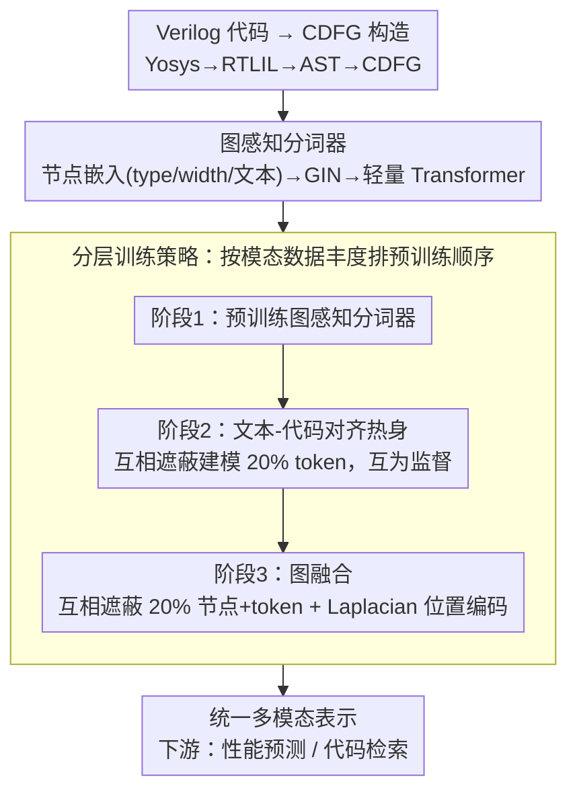

# UniRTL: 统一代码与图实现鲁棒 RTL 表示学习

**会议**: ICML 2026  
**arXiv**: [2605.31040](https://arxiv.org/abs/2605.31040)  
**代码**: https://github.com/cure-lab/UniRTL  
**领域**: 代码智能 / 硬件设计  
**关键词**: RTL 表示学习, 多模态预训练, CDFG, 性能预测, 代码检索

## 一句话总结
本文提出 UniRTL——通过联合学习 RTL 代码和控制数据流图（CDFG）的多模态统一表示，采用图感知分词器和分层训练策略，在硬件性能预测和代码检索任务上显著超越现有方法。

## 研究背景与动机

**领域现状**：RTL（寄存器传输级）表示学习是加速硬件设计流程的关键。现有方法要么仅用 RTL 代码（VeriDistill、DeepRTL2）要么仅用图结构（StructRTL）。

**现有痛点**：单一模态表示表达能力受限。代码隐含语义功能信息但缺乏完整结构依赖；图保留拓扑信息但语义信息稀疏。GraphCodeBERT 虽融合代码和数据流但对齐策略弱（仅变量级）且数据流不完整。

**核心矛盾**：如何设计真正的细粒度多模态对齐机制，充分利用 CDFG 的完整性和代码的语义互补性。

**切入角度**：采用 CDFG 而非简化数据流，它保留完整设计信息且可忠实转换回代码；用互相遮蔽建模实现代码-图细粒度对齐；构造图感知分词器让 Transformer 捕捉图结构微妙关系。

**核心 idea**：分层预训练框架——先预训练图感知分词器 → 文本-代码对齐热身 → 图融合，同时通过互相遮蔽建模在三模态间建立深层对齐。

## 方法详解

### 整体框架
UniRTL 想解决的核心问题是：单看 RTL 代码会丢结构依赖、单看图又语义稀疏，二者必须细粒度融合才能学到鲁棒表示。它的做法是把 Verilog 代码先编译成保留完整设计信息的控制数据流图（CDFG，经 Yosys→RTLIL→AST→CDFG），再用一个统一的 Transformer（CodeBERT 基座）把文本、代码、图三种模态喂进同一表示空间，靠"互相遮蔽"让三者彼此预测、彼此对齐。整个训练分层进行，最后接性能预测或代码检索两类下游任务。数据规模为 132,008 个 RTL 设计，其中 38,888 个成功转成 CDFG。

### 关键设计

**1. 图感知分词器：让 Transformer 读懂 CDFG 的拓扑而非平铺节点**

痛点在于 GraphCodeBERT 那种直接把变量节点平铺成序列的做法会丢掉图的结构关系，操作符、控制流这些元素也无从表达。UniRTL 为此设计了一个三步走的分词器：先给每个节点 $v_i$ 拼一个初始嵌入 $\mathbf{H}_{i}=\text{one-hot}(\text{type}(v_{i}))\parallel\text{width}(v_{i})\parallel\text{pca}(\phi_{\text{text}}(\text{desc}(v_{i})))$，把节点类型、位宽和文本描述一并编码进去；再用 GIN 沿边聚合捕捉局部依赖 $\mathbf{L}_{i}^{(k)}=\text{MLP}^{(k)}((1+\epsilon^{(k)})\cdot\mathbf{L}_{i}^{(k-1)}+\sum_{j\in\mathcal{N}(i)}\mathbf{L}_{j}^{(k-1)})$；最后过一层轻量 Transformer 补全全局语境，得到结构感知的节点 token $\{\mathbf{G}_{i}\}$。GIN 负责保留拓扑、Transformer 负责全局上下文，二者互补，使得后续主干能像处理文本一样处理图，又不丢图的微妙结构。

**2. 互相遮蔽建模：迫使代码与图互为监督信号**

GraphCodeBERT 的变量级对齐只是定位变量、CircuitFusion 的粗粒度对比学习又太松，都不足以建立深层语义对应。UniRTL 改用"互相遮蔽"——文本-代码阶段随机遮蔽 20% 的 token，要求模型从互补模态把它们恢复出来；到图融合阶段则同时遮蔽 20% 的节点和 20% 的代码 token，联合预测原始节点类型与 token ID。为了在遮蔽下不丢图拓扑，节点还额外加了用图 Laplacian 特征向量构造的全局位置编码。因为被遮的内容只能靠另一模态补全，模型被逼着学会代码与图之间真正的细粒度对应，而不是各自独立编码。

**3. 分层训练策略：按模态数据丰度排预训练顺序**

文本-代码对有 132k，而图对只有 38.8k，如果一上来就做图融合，稀缺的图数据会让优化不稳定。UniRTL 因此把训练拆成三段：阶段 1 单独预训练图感知分词器；阶段 2 用全量文本-代码对做对齐热身（5 轮）；阶段 3 才引入图做融合（300 轮）。这样既把丰富的文本-代码数据梯度榨干、为主干打好底子，又让图融合在一个已经对齐良好的表示空间上微调，规避了图数据不足带来的梯度震荡。

## 实验关键数据

### 主实验：性能预测（无 netlist）

| 方法 | Area MAE↓ | Area MAPE↓ | Area $R^2$↑ | Delay MAE↓ |
|------|-----------|-----------|-----------|-----------|
| StructRTL | 0.3649 | 0.06 | 0.7463 | 0.5414 |
| GraphCodeBERT | 0.8424 | 0.15 | 0.5207 | 0.6109 |
| CircuitFusion | 0.7762 | 0.14 | 0.6175 | 0.5272 |
| **UniRTL** | **0.3510** | **0.06** | **0.7682** | **0.3384** |
| UniRTL (w/o code) | 0.3671 | 0.07 | 0.7546 | 0.3584 |
| UniRTL (w/o graph) | 0.8818 | 0.15 | 0.5173 | 0.6375 |

### 消融实验：代码检索

| 模型 | Precision↑ | Recall↑ | F1↑ |
|------|-----------|---------|---------|
| DeepRTL2-Llama | 0.557 | 0.608 | 0.572 |
| GraphCodeBERT | 0.616 | 0.675 | 0.634 |
| CircuitFusion | 0.542 | 0.608 | 0.560 |
| **UniRTL** | **0.650** | **0.692** | **0.662** |
| UniRTL (w/o graph) | 0.630 | 0.683 | 0.644 |

### 关键发现
- 图的关键作用——去除图后（w/o graph）性能大幅下降（F1 从 0.662→0.644），证明 CDFG 完整信息的价值。
- 代码的补充作用——去除代码（w/o code）性能小幅下降（MAE 从 0.3510→0.3671）。
- 对齐策略有效性——相同图感知分词器下，细粒度互相遮蔽对齐远优于变量级对齐和粗对比学习。

## 亮点与洞察
- **CDFG 完整性设计**：相比 GraphCodeBERT 仅用数据流变量，UniRTL 用 CDFG 保留操作符、控制流等完整元素。
- **图感知分词器创新**：通过 GIN+Transformer 组合而非直接平铺节点，有效捕捉图的"拓扑微妙性"。
- **分层与数据实用性**：将不同模态的预训练数据丰度纳入设计，文本-代码热身既充分利用数据又为图融合预热。

## 局限与展望
- CDFG 转换限制——38.8k/132k 设计无法转换为 CDFG。
- 语言和规模限制——仅限 Verilog HDL；大规模工业设计的可扩展性未充分验证。
- 改进方向：扩展到 VHDL 等其他 HDL；更大的图对数据集；覆盖更广的 RTL 任务。

## 相关工作与启发
- **vs GraphCodeBERT**：用完整 CDFG 替代不完整数据流，引入图感知分词器，互相遮蔽而非变量对齐。
- **vs CircuitFusion**：UniRTL 用统一 Transformer 直接实现代码-图细粒度对齐，且 CDFGs 覆盖完整设计。

## 评分
- 新颖性: ⭐⭐⭐⭐⭐  多模态 RTL 表示学习的系统化改进。
- 实验充分度: ⭐⭐⭐⭐⭐  覆盖 2 大下游任务 + 多个设置 + 完整消融。
- 写作质量: ⭐⭐⭐⭐⭐  动机清晰、方法阐述严谨。
- 价值: ⭐⭐⭐⭐⭐  为硬件设计自动化提供通用基础模型，性能预测和代码检索均实现 SOTA。

<!-- RELATED:START -->

## 相关论文

- [\[NeurIPS 2025\] Automated Multi-Agent Workflows for RTL Design](../../NeurIPS2025/code_intelligence/automated_multi-agent_workflows_for_rtl_design.md)
- [\[ICML 2026\] Entropy-informed Decoding: Adaptive Information-Driven Branching](entropy-informed_decoding_adaptive_information-driven_branching.md)
- [\[ICML 2026\] SWE-rebench V2: Language-Agnostic SWE Task Collection at Scale](swe-rebench_v2_language-agnostic_swe_task_collection_at_scale.md)
- [\[ICML 2026\] Locally Coherent Parallel Decoding in Diffusion Language Models](locally_coherent_parallel_decoding_in_diffusion_language_models.md)
- [\[ICML 2026\] HE-SNR: Uncovering Latent Logic via Entropy for Guiding Mid-Training on SWE-bench](he-snr_uncovering_latent_logic_via_entropy_for_guiding_mid-training_on_swe-bench.md)

<!-- RELATED:END -->
