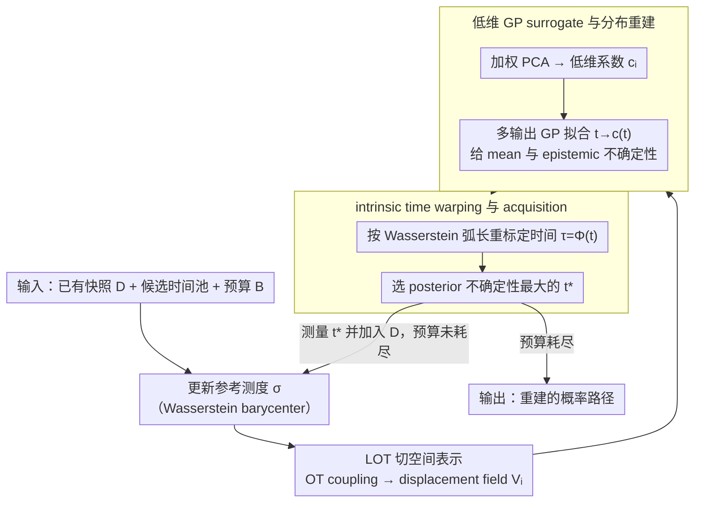

# Active Timepoint Selection for Learning Measure-Valued Trajectories

**会议**: ICML 2026  
**arXiv**: [2605.30625](https://arxiv.org/abs/2605.30625)  
**代码**: https://github.com/nicolashuynh/active_wass  
**领域**: 时间序列 / 测度值轨迹学习  
**关键词**: 主动采样, Wasserstein 轨迹, Linearized Optimal Transport, Gaussian Process, 单细胞时间序列  

## 一句话总结
本文研究“什么时候采样一个分布快照最有价值”，用 LOT 把 Wasserstein 空间中的测度轨迹线性化，再用带时间扭曲的多输出 GP 给出 epistemic uncertainty，从而主动选择最能降低轨迹重建误差的时间点。

## 研究背景与动机
**领域现状**：在单细胞转录组、流体、宏观经济等场景中，研究对象常常不是单个向量时间序列，而是一条随时间变化的概率分布路径。实际观测通常是若干离散时间点上的 empirical measure，任务是从稀疏快照恢复连续的 measure-valued trajectory。

**现有痛点**：高质量快照采样很贵，单细胞实验还常常是破坏性采样，因此不能简单地在时间轴上密集观测。传统 active learning 多假设输出在欧氏空间中，可以直接用 GP posterior variance 做采样决策；但概率测度生活在 Wasserstein 空间里，线性平均会导致质量分裂，普通 GP 对密度向量建模会违背 transport 几何。

**核心矛盾**：主动采样需要知道“哪里不确定”，而现有 Wasserstein 插值或 flow 方法多给出一条确定轨迹，缺少可用的 epistemic uncertainty。与此同时，生物分化这类过程还强烈非平稳：大部分时间变化缓慢，少数窗口发生快速分叉，均匀采样很容易错过关键瞬间。

**本文目标**：在固定观测预算下，选择最有信息量的时间点，使恢复出的概率路径在 Wasserstein 误差上更准，尤其要覆盖快速变化和短暂分叉区域。

**切入角度**：作者用 Linearized Optimal Transport 将每个测度快照映射到参考测度的切空间，在这个线性空间中再做 PCA 和 GP。这样既保留 Wasserstein 几何的一阶近似，又能借 GP posterior covariance 得到主动采样所需的不确定性。

**核心 idea**：把测度轨迹先投到 LOT 切空间，再在低维 latent coefficient 上建 warped GP，用 posterior variance 选择下一个测量时间。

## 方法详解

### 整体框架
方法要解决的问题是：在测量预算有限、每个快照都很贵的前提下，决定下一次该在哪个时间点采样一个分布快照，使最终重建出的概率路径误差最小。难点在于输出是 Wasserstein 空间里的概率测度而非欧氏向量，普通 active learning 的 posterior variance 没法直接用。作者的办法是把每个测度快照通过 Linearized Optimal Transport 映射到参考测度的切空间，从而把测度回归变成一个可以放高斯过程的低维向量回归；每一轮先更新参考测度并重建这个概率 surrogate，再用 GP 的不确定性挑下一个测量时间，循环往复直到耗尽预算。

输入是已有快照集合 $\mathcal{D}=\{(t_i,\hat{\mu}_{t_i})\}_{i=1}^N$、候选时间池 $\mathcal{T}_{pool}$ 和剩余采样预算 $B$。每一轮算法会更新参考测度 $\sigma$，将每个快照 $\hat{\mu}_{t_i}$ 通过 OT coupling 映射到切空间 $T_\sigma\mathcal{P}_2(\mathcal{X})$，得到 displacement matrix $\mathbf{V}_i$；随后用带权 PCA 把它压成低维系数 $\mathbf{c}_i$，这些 $\{(t_i,\mathbf{c}_i)\}$ 就构成 GP 的训练集；最后在时间到系数的映射上拟合带时间扭曲（intrinsic time warping）的 GP——按 Wasserstein 弧长重标定时间以适应非平稳变化，再按其 posterior 不确定性选出 $t^*$ 去做真实测量并加入数据集。

### 关键设计

**1. LOT 切空间表示：把非欧氏的测度输出变成可回归的向量**

主动采样需要一个能回归、能估不确定性的输出表示，但概率测度生活在 Wasserstein 空间，直接对密度向量做 GP 会把质量"平均"到错误位置、违背 transport 几何。作者以参考测度 $\sigma$ 为锚，求从 $\sigma$ 到目标快照 $\hat{\mu}_{t_i}$ 的 OT coupling，再用 barycentric projection 得到近似 transport map，把快照在切空间里表示成 displacement field $\mathbf{V}_i=\hat{\mathbf{Z}}_i-\mathbf{Z}_\sigma$。这样表示的是"从参考测度出发要把质量往哪儿搬"，是 Wasserstein 几何的一阶线性化，比直接对密度建模更贴近问题结构。

**2. 低维 GP surrogate 与分布重建：给连续时间提供 mean 和 epistemic uncertainty**

displacement field 本身高维、快照又少，直接在上面建 GP 计算昂贵且不稳。作者先对加权 flatten 后的 displacement 做 PCA 提出主要变化方向，得到 latent coefficient $\mathbf{c}_i$，再对映射 $t\mapsto\mathbf{c}(t)$ 建多输出 GP。预测某个时间的概率分布时，从 GP posterior mean 或采样得到 latent 系数，反投影回 displacement，加到参考 landmark 上就得到预测测度。这条路径既给出 posterior mean 用于重建，又借 GP posterior covariance 提供了主动采样真正需要的 epistemic uncertainty。

**3. intrinsic time warping 与 acquisition：让采样优先盯住高速变化窗口**

生物分化这类过程强烈非平稳——大部分时间变化缓慢，少数窗口快速分叉，若在物理时间 $t$ 上假设 stationary kernel，模型会低估短促分叉阶段的不确定性而错过关键瞬间。作者改为估计 intrinsic time $\tau=\Phi(t)$，其中 $\Phi(t)$ 近似累计 Wasserstein arc length（相邻快照间 transport distance 的累积），再用单调 cubic spline 延拓到候选时间，kernel 写成 $\mathbf{K}(t,t')=\mathbf{K}_{base}(\Phi(t),\Phi(t'))$，于是变化快的区域被自动"拉长"、有效 lengthscale 变短。主动采样主用 point-wise uncertainty $\alpha_{unc}(t;\mathcal{D})=\mathrm{Tr}(\mathbf{S}(\Phi(t)))$（也给出 expected integrated risk reduction 版本），选 posterior covariance trace 最大的时间点，从而把预算自然投向高 velocity 区域。

### 损失函数 / 训练策略
方法本身不是端到端神经网络训练，而是每轮重建一个概率 surrogate。核心优化包括 OT coupling、Wasserstein barycenter、PCA 和 GP hyperparameter 的 marginal log-likelihood 最大化。默认实验中，多输出 GP 简化为每个 latent dimension 一个独立 GP，kernel 使用 Matérn 5/2。候选 acquisition 在固定 candidate pool 上计算，选出最大 posterior uncertainty 的时间点。

算法复杂度主要来自 OT。若有 $N$ 个快照、每个快照平均 $n$ 个样本、参考测度 $M$ 个 landmark，LOT embedding 和 time warping 需要约 $O(N\cdot \mathcal{C}_{OT}(M,n))$ 的 OT 求解；GP 在低维、少快照设定下通常不是瓶颈。

## 实验关键数据

### 主实验
论文在 synthetic branching trajectory、真实单细胞 fibroblast reprogramming、以及附录中的 labor market 数据上验证。最清楚的定量表是 synthetic sensitivity：当快速分叉窗口越短，主动采样相对均匀/随机采样越占优。

| 分叉窗口长度 | vs Uniform: Rel. W2 ↑ | vs Uniform: Rel. w-W2 ↑ | vs Random: Rel. W2 ↑ | vs Random: Rel. w-W2 ↑ | 解读 |
|--------------|-----------------------|--------------------------|-----------------------|--------------------------|------|
| 0.05 | 0.231 | 0.357 | 0.342 | 0.454 | 短促分叉最适合主动采样，速度加权收益最大 |
| 0.10 | 0.189 | 0.277 | 0.397 | 0.464 | 窗口变宽后仍保持稳定优势 |
| 0.20 | -0.172 | 0.071 | 0.118 | 0.295 | 普通均匀采样已能覆盖较宽窗口，但主动法仍更关注高速区域 |

真实单细胞 reprogramming 实验中，active strategy 在低到中等预算，尤其 $B\leq 12$ 时得到最低 reconstruction error；当预算继续增大，uniform/random 也能覆盖多数 transient phase，差距缩小。

### 消融实验
论文用 Figure 6 对 surrogate/acquisition pipeline 的四个设计做消融。原文以曲线呈现而非逐项表格数值，因此这里按影响方向整理。

| 配置 | 关键指标 | 说明 |
|------|---------|------|
| Full method | synthetic + fibroblast reconstruction error 最低或接近最低 | LOT barycenter + 足够 PCA 维度 + time warping + Matérn GP |
| RBF kernel | 与 Full 接近但非主默认 | 说明方法不强依赖单一 prior，kernel 可替换 |
| Fixed reference $\sigma$ | synthetic 上误差明显升高 | 不更新参考测度会放大 LOT 线性化误差 |
| PCA rank $K=2$ | 性能下降最明显 | 低维 latent 不足以表达复杂 transcriptomic variation |
| No warp | 低预算区域退化明显 | 证明 intrinsic time 对非平稳动态有用 |

### 关键发现
- 主动策略的优势来自“把预算投向高 velocity 区域”，而不是简单比 uniform 多拿样本。synthetic 可视化显示后期 acquisition 集中在两个分叉窗口附近。
- 当事件很局部时，uniform 采样最容易错过；当事件窗口很宽时，uniform 的劣势自然变小，但速度加权误差仍显示 active method 更关注动态变化大的时段。
- PCA 维度不是小细节。$K=2$ 的明显退化说明测度轨迹中的主要变化不一定能由极少数分量表达。
- 固定参考测度会让 LOT 近似变差，尤其在分布漂移较大时，动态更新 Wasserstein barycenter 很重要。

## 亮点与洞察
- 论文把 active learning 的“uncertainty sampling”搬到 Wasserstein space，关键在于先找到一个可计算的 uncertainty surrogate，而不是直接在测度空间硬做 Bayesian prior。
- intrinsic time warping 很自然：生物过程的物理时间和几何变化速度不一致，用 transport distance 重标定时间，比调 kernel lengthscale 更贴近问题结构。
- 方法对昂贵实验设计很有现实价值。它不是为了海量实时采样，而是面向“每次测量都贵，所以要问下一次测哪里”的场景。
- LOT + GP 的组合比端到端深模型更可解释：每一轮为什么选某个时间点，可以从 posterior variance 和轨迹速度上解释。

## 局限与展望
- 切空间近似是核心假设。若真实轨迹远离参考测度或存在大分布跳变，单一 tangent chart 可能不够，作者也提到可考虑多 chart / atlas-like 方法。
- OT 子问题是主要计算成本。论文认为在快照昂贵、样本量约到 $10^5$ 的应用 regime 中可接受，但百万级点云仍需要更可扩展的 OT 近似。
- 当前输入变量主要是一维时间。很多科学实验还有剂量、扰动类型、空间位置等多维 covariate，未来需要扩展到多维 acquisition。
- 实验主要证明重建误差下降，还可以进一步连接到下游科学任务，比如分化命运预测或关键状态发现。

## 相关工作与启发
- **vs Euclidean GP on densities**: 普通 GP 对密度向量回归会产生质量分裂；本文用 LOT displacement 保留 transport 方向。
- **vs deterministic distribution interpolation / flow matching**: 这些方法能从固定 snapshots 拟合一条轨迹，但缺少 epistemic uncertainty；本文的 GP posterior 正是为 active acquisition 服务。
- **vs 单细胞时间点选择方法**: 早期方法多在欧氏 gene-expression curve 上选点；本文直接处理 empirical measures，更适合细胞群体分布随时间变化的问题。
- **启发**: 对非欧氏输出空间的 active learning，可以先找局部线性化或低维 chart，再在 chart 上建立可解释的不确定性模型。

## 评分
- 新颖性: ⭐⭐⭐⭐⭐ 将 LOT、GP uncertainty 和 active timepoint selection 组合到测度值轨迹上，问题设定和方法都较新。
- 实验充分度: ⭐⭐⭐⭐ synthetic + real single-cell + 附录数据较完整，但部分消融以图展示，缺少表格数值。
- 写作质量: ⭐⭐⭐⭐ 几何动机清晰，算法细节完整，读者需要一定 OT/GP 背景。
- 价值: ⭐⭐⭐⭐⭐ 对昂贵时序实验设计和 Wasserstein 轨迹建模很有启发。

<!-- RELATED:START -->

## 相关论文

- [\[ICML 2025\] Reliable Algorithm Selection for Machine Learning-Guided Design](../../ICML2025/computational_biology/reliable_algorithm_selection_for_machine_learning-guided_design.md)
- [\[ICLR 2026\] Controllable Sequence Editing for Biological and Clinical Trajectories](../../ICLR2026/computational_biology/controllable_sequence_editing_for_biological_and_clinical_trajectories.md)
- [\[NeurIPS 2025\] PROSPERO: Active Learning for Robust Protein Design Beyond Wild-Type Neighborhood](../../NeurIPS2025/computational_biology/prospero_active_learning_for_robust_protein_design_beyond_wild-type_neighborhood.md)
- [\[ICML 2025\] Multivariate Conformal Selection](../../ICML2025/computational_biology/multivariate_conformal_selection.md)
- [\[ICML 2025\] MF-LAL: Drug Compound Generation Using Multi-Fidelity Latent Space Active Learning](../../ICML2025/computational_biology/mf-lal_drug_compound_generation_using_multi-fidelity_latent_space_active_learnin.md)

<!-- RELATED:END -->
