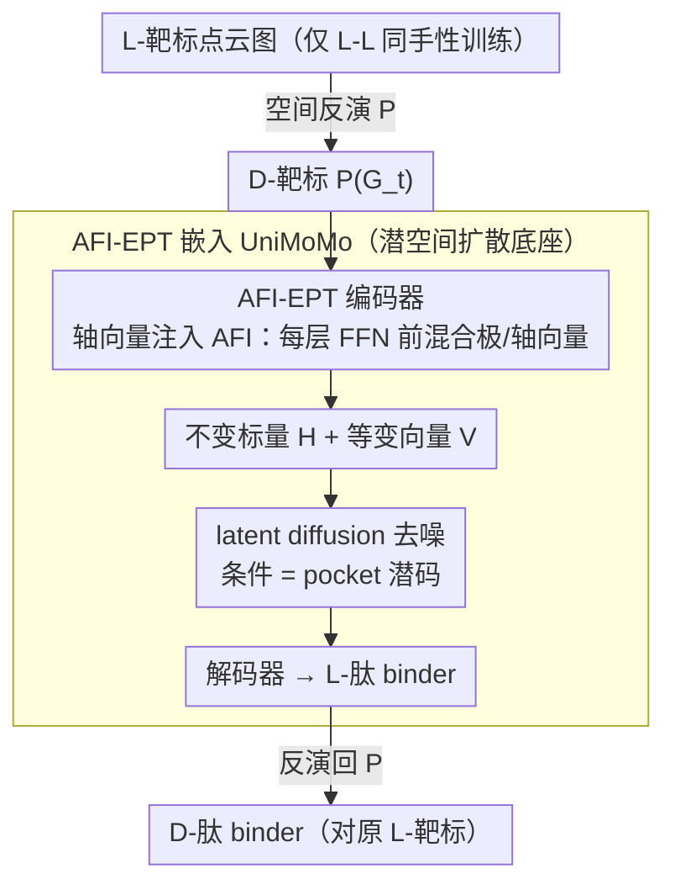

# Cross-Chirality Generalization by Axial Vectors for Hetero-Chiral Protein-Peptide Interaction Design

**会议**: ICML2026  
**arXiv**: [2602.20176](https://arxiv.org/abs/2602.20176)  
**代码**: https://github.com/YZY010418/PepMirror  
**领域**: 科学计算 / 蛋白-多肽设计 / 等变神经网络  
**关键词**: D-肽设计, 轴向量, $SE(3)$ 等变, 镜像对映体, 潜空间扩散

## 一句话总结
本文提出 AFI（Axial Feature Injection），把轴向量特征以线性混合方式注入 $E(3)$-等变标量化模型的极向量通道，使其退化为 $SE(3)$-等变并对手性敏感；以此改造 UniMoMo 得到 PepMirror，仅用同手性（L-L）训练数据即可零样本生成异手性（D-L）多肽 binder，并通过湿实验在 CD38 靶点上验证为首个实验确证的 AI de novo D-肽设计框架。

## 研究背景与动机

**领域现状**：天然蛋白几乎全由 L-氨基酸组成（同手性 homo-chirality）。D-肽因蛋白酶不识别、半衰期长、免疫原性低，是极具潜力的治疗分子。但 D-肽 binder 传统上靠 mirror-image display 筛选——需先合成 D-蛋白靶标，工艺极难。近年 ML-based peptide design 蓬勃发展，但绝大多数模型只面向 L-L 同手性界面。

**现有痛点**：现有等变蛋白生成模型分两类，都不能直接设计 D-肽 binder。第一类（RFDiffusion、PepFlow、D-Flow 等）用刚体局部坐标系参数化氨基酸，把右手性写死成先验，结构与镜像之间只差一个旋转矩阵，**根本无法区分镜像**；第二类（PepGLAD、UniMoMo、PocketXMol）依赖 $E(3)$-等变骨干，对空间反演 $P=-I_3$ 严格等变，导致"输入 D-靶标 → 输出 D-肽"——这正是镜像 display 想要的反方向，但模型自己**输出的是混合手性**，不能稳定生成单一手性的 binder。唯一专门尝试 D-Flow 也只停留在 dry-lab。

**核心矛盾**：要做异手性界面，模型必须同时满足两点——**手性感知**（$X$ 和 $-X$ 的潜码要可分）和**潜码稳定**（$-X$ 仍要被认成同一种氨基酸，只是手性翻了，不能漂到别的氨基酸类去）。两者其实在拉扯：$E(3)$-等变保证了稳定但杀死了感知；完全打破等变又可能让 $-X$ 的表示乱飘。已有手性感知方法（SphereNet 的扭转、ChIRo、Tensor Field Networks 的高阶球谐）要么只验证过分类/属性预测，要么计算代价大、易在高频噪声上过拟合，从没被用于异手性肽-蛋白界面生成。

**本文目标**：（i）给标量化等变模型一个**轻量**的手性感知插件；（ii）从理论上保证它产生的潜码满足"$X$ vs $-X$ 距离 < $X$ vs 其它氨基酸 $X'$ 距离"；（iii）落到 latent diffusion 上做出真能在湿实验里成药的 D-肽 binder 设计器。

**切入角度**：经典物理早把 3D 向量分两类——**极向量** polar vector（如位置、速度，$P$ 下变号）与**轴向量** axial vector（如角动量、磁场，$P$ 下不变号）。原版 $E(3)$-等变标量化模型只用极向量；若把轴向量也加进去，就能保留 $SE(3)$-等变（旋转、平移）但破坏 $P$-等变，自然产生手性区分。

**核心 idea**：把轴向量（叉积、三重积、对易子三种构造）通过通道-wise 线性混合 $\tilde v_{i,k}=A_k^\top v_{i,:}+B_k^\top a_{i,:}$ 注入到每层 EPT 的 FFN 前，模型瞬间从 $E(3)$ 降到 $SE(3)$ 等变，再放进 UniMoMo 的 VAE+latent diffusion 框架，即得 PepMirror。

## 方法详解

### 整体框架
要让一个只会做 L-L 同手性界面的等变模型零样本生成 D-肽 binder，核心矛盾在于：$E(3)$-等变骨干对镜像反演 $P=-I_3$ 严格不变，于是镜像靶标会被无差别地映成同一潜码，模型既区分不了手性、输出又是混合手性。PepMirror 的解法是给标量化等变主干加一个**轴向量注入插件**，让它从 $E(3)$ 降到 $SE(3)$-等变——保留旋转平移不变性，却对空间反演敏感，从而把"手性"这一维度重新装回模型。整套系统沿用 UniMoMo 的两阶段 latent diffusion 架构：编码端 EPT（Equivariant Pretrained Transformer，$L$ 层 self-attention + GVP-FFN）把点云图 $\mathcal{G}$ 映射为不变标量 $H\in\mathbb{R}^{N\times K}$ 与等变向量 $V\in\mathbb{R}^{N\times 3\times K}$，扩散端以靶标 pocket 潜码 $c$ 为条件在潜空间去噪 binder 潜码，解码端再解回 3D 结构。本文唯一改动的是把每层 GVP-FFN 前的 $V$ 替换为注入轴向量后的 $\widetilde V$，得到 AFI-EPT。推理时借用 mirror-image display 的思路两次反演：先把 L-靶标 $\mathcal{G}_t$ 反演到 D-靶标，让模型生成 L-binder，再把输出反演回去，即 $\mathcal{G}_b=P(f_\theta(P(\mathcal{G}_t)))$，得到对原 L-靶标的 D-肽 binder。

### 关键设计

**1. 轴向量注入（AFI）：用极/轴向量分解给等变模型装上手性开关**

经典物理把 3D 向量分两类——极向量 polar vector（位置、速度，在 $P$ 下变号 $v(-X)=-v(X)$）与轴向量 axial vector（角动量、磁场，变换为 $a(Rx)=\det(R)\,Ra(x)$，在 $P$ 下**不**变号）。原版标量化模型只用极向量，所以镜像对它透明；AFI 的做法是在每层 FFN 前做一次通道-wise 线性混合 $\tilde v_{i,k}(X)=A_k^\top v_{i,:}(X)+B_k^\top a_{i,:}(X)$（$A_k,B_k\in\mathbb{R}^K$ 可学习）。由于 $a$ 在反演下不变而 $v$ 变号，混合后的 $\widetilde V$ 对 $X$ 与 $-X$ 必然不同，模型瞬间从 $E(3)$ 降到 $SE(3)$-等变，手性区分自然涌现。轴向量本身由 $V'$ 的相邻通道 $u,v,w\in\mathbb{R}^3$ 构造，文中给出三种：叉积 $u\times v$（cross）、标量三重积投影 $(w\cdot(u\times v))\,w$（triple）、对易子 $(u\cdot v)(u\times v)$（commu.，能捕获 $u,v$ 夹角的更高频信息）。相比 Tensor Field Networks 靠高阶球谐 / 张量积编码手性（算力重、易在高频噪声上过拟合），AFI 只动二阶以下张量，参数和计算开销近乎可忽略，对原模型也只是插一行混合层。唯一要小心的退化情形是：若 $A=B=I$ 且 $v\cdot a=0$，则 $\|\tilde v(X)\|=\|\tilde v(-X)\|$ 重新失去判别力——所以"能区分手性"严格说成立于"通用参数概率"之下（见下一点的 Theorem 3.1）。

**2. 零样本异手性泛化的理论闭环：差异 + 稳定 + 扩散连续**

异手性泛化要 work，潜码必须同时满足两个互相拉扯的条件：既要让 $X$ 与镜像 $-X$ 可分（手性感知），又不能让 $-X$ 漂到别的氨基酸类去（潜码稳定）。本文用三步证明把这件事锁死。**差异性**由 Theorem 3.1 给出：对随机采样的混合系数、在向量特征有界等温和条件下，$\|c(X)-c(-X)\|\ge c_W\varepsilon$ 以概率 $1-\delta_W(\varepsilon)$ 成立；而 Proposition 3.2 反证没有 AFI 时由 $V(-X)=-V(X)$、标量端只取范数立刻得 $c(-X)=c(X)$，镜像彻底不可分。**稳定性**用 $d(X_1,X_2)=\|H(X_1)-H(X_2)\|+\|\widetilde V(X_1)-\widetilde V(X_2)\|$ 度量，因为 $H(-X)=H(X)$、$a(-X)=a(X)$、$v(-X)=-v(X)$，所以镜像距离 $d(X,-X)=\|2Av(X)\|$ 受系数 $A$ 显式控制（可学得很小），再用氨基酸 Tanimoto 形状相似度作几何旁证，支撑 $d(X,X')>d(X,-X)$——即镜像比异种更近。**扩散连续性**由 Theorem 3.4 收尾：给条件扩散一个 Lipschitz 假设后 $W_2(\mu_c,\mu_{c'})\le K_{\text{diff}}\|c-c'\|$，于是镜像靶标给出的相近潜码 ⇒ 解码出的 binder 分布相近 ⇒ 即便从没见过 D-L 训练对也能泛化。这套论证恰好回答了"为何选轴向量而非张量积"：正是极/轴分解才给出这种可解析控制的简单结构，把零样本泛化从经验观察提升为有保证的机制。

**3. AFI-EPT 嵌入 UniMoMo：端到端的 D-肽 de novo 设计 pipeline**

把 AFI 落地，就是用 UniMoMo（VAE + latent diffusion）作底座，把 VAE 编/解码器和扩散网络里的 EPT 主干全替换成 AFI-EPT，按三种轴向量构造得到 PepMirror(cross/triple/commu.) 三个变体。之所以选 UniMoMo，是因为它本身不嵌入刚体 / 局部右手坐标系——RFDiffusion 这类 frame-based 模型一旦把右手性写死进刚体就没法直接接 AFI；而 latent diffusion 又比 atom-level diffusion（PocketXMol）省算力，且天然吃到 Theorem 3.4 的稳定性保证。推理时按上文两次反演的 mirror-image display 流程生成 D-肽，下游再对 5,000 条候选做物理 + 几何过滤，挑 12 条化学合成、用 BLI 测亲和力。

### 损失函数 / 训练策略
训练数据只用 L-L 同手性蛋白-肽复合物（与 UniMoMo 一致），损失为 VAE 重建 + latent diffusion 去噪的标准目标，没有任何 D-肽数据或手性显式监督——异手性能力完全由 AFI + 反演推理框架"零样本"涌现。

## 实验关键数据

### 主实验

LNR (Large Non-Redundant complex) 测试集，分别在 L 与 D 两个任务下评估手性正确率与界面亲和力（AutoDock Vina 打分），下表节选关键模型：

| 模型 | 任务 | 手性正确率(min) | Suc.% | Avg. Vina | Top Vina | IMP% |
|------|------|------|------|------|------|------|
| RFDiffusion | L | 99.57 | 99.52 | -3.30 | -5.14 | 44.09 |
| RFDiffusion | D | 99.15 | 98.58 | -1.77 | -3.78 | 16.13 |
| D-Flow | D | 98.54 | 97.52 | -3.11 | -4.54 | 22.58 |
| PepGLAD(ideal) | D | 99.04 | 95.08 | -3.26 | -5.11 | 43.01 |
| UniMoMo(all) | D | 15.70 | — | — | — | — |
| **PepMirror(cross)** | L | 99.83 | 99.67 | **-4.27** | **-5.81** | **69.89** |
| **PepMirror(cross)** | D | 99.81 | 99.76 | **-4.15** | **-5.69** | **63.44** |

PepMirror 在 D-肽任务上 IMP 比次佳 PepGLAD(ideal) 高约 20 个百分点，且与自身 L 任务的差距最小（"L-D gap"最小），三个轴向量变体表现相近、对构造方式不敏感。

### 消融实验

| 配置 | D 任务手性正确率 | 说明 |
|------|------|------|
| UniMoMo(pep.) | 23.90 | $E(3)$-等变 baseline，输入 D-靶时输出基本仍是 L 残基（被反演原理拖反）|
| UniMoMo(all) | 15.70 | 多模态训练版本，仍受等变性限制 |
| AFI w/ cross | 99.81 | 注入叉积轴向量 |
| AFI w/ triple | 99.75 | 注入三重积轴向量 |
| AFI w/ commu. | 99.88 | 注入对易子轴向量，最佳 |

潜空间分析：注入 AFI 后 $\|c(X)-c(-X)\|$ 中位距离从 $\sim 10^{-6}$ 跃升到 $10^{-2}$（约 4 个数量级），但仍比异种氨基酸距离（$\sim 1$）小约 2 个数量级——正对应 Theorem 3.1 + Eq. (15) 的"差异 + 稳定"双重结论，t-SNE 上显示 20 个氨基酸类别成簇、每簇内 L/D 各自聚成相邻子团。

### 关键发现
- **AFI 是必要且充分的手性开关**：去掉它整个 PepMirror 立刻坍缩为 UniMoMo 的混合手性输出（D 任务手性正确率 < 25%）；加上它三种轴向量构造都能达 99.7%+，对易子稍优于叉积/三重积，提示更高频的几何特征略有帮助但收益边际。
- **湿实验首次确证**：在 CD38（多发性骨髓瘤靶点）上设计 5,000 条 D-肽，过滤后合成 12 条，命中一条 10-mer D-肽 D-1412（序列 "trikhytyce"），$K_D\approx 10\,\mu$M，BLI 动力学与稳态拟合一致，是已知**首个**经湿实验验证的 AI de novo D-肽 binder。
- **意外现象**：D-1412 的 L-对映体也展现了相近亲和力，挑战"肽-蛋白互作高度立体选择"的传统假设，作者用 CD 谱二次确认手性并指向构象柔性可能弱化立体选择性。
- **L→D 性能落差最小**：RFDiffusion 在 D 任务 Avg Vina 从 -3.30 掉到 -1.77，多数 baseline 都有显著 L-D gap；PepMirror 的落差只有约 0.1 kcal/mol，进一步佐证 AFI 让模型对手性"对称地学得好"。

## 亮点与洞察
- **极/轴向量分解是经典物理的礼物**：作者没用复杂的高阶球谐，而是把"$P$ 下变号"作为唯一区分轴，这种最低成本的对称性破缺设计可直接迁移到任意标量化等变骨干（EGNN、GVP、TFN-low-order），是真正的 plug-and-play。
- **"零样本异手性"的理论闭环**：差异性（Thm 3.1）+ 稳定性（$d(X,-X)<d(X,X')$）+ 扩散 Lipschitz 连续性（Thm 3.4）三连击，把"为什么 L-L 训练能跨到 D-L 生成"讲成机制问题而非玄学，这套论证结构值得借鉴到其它 zero-shot 等变泛化任务（如对映异构小分子设计、手性催化剂）。
- **退化情形提醒**：当 $A=B=I$ 且 $v\cdot a=0$ 时 AFI 失效，提示在更"对称漂亮"的初始化下反而要小心；启发我们设计这类破缺模块时不能只验证"加了模块更好"，还得分析"什么参数会让模块退化"。
- **湿实验里 D-1412 的非立体选择性**：是该工作最"反直觉"的发现——AI 设计出的 D-肽 binder 在 L 对映体上也能结合，说明传统 mirror-image display 隐含的"完全立体选择"假设需要修正，这给后续手性药物设计的评估框架提出了新问题。

## 局限与展望
- 作者承认 AFI 的理论保证依赖随机混合系数的"通用性"假设，特定初始化（如 $A=B=I$ 加正交特征）会让差异消失，需在实践中靠学习/正则化避开。
- 仅在 UniMoMo 这一种 latent diffusion 框架上验证，未测试 frame-based 模型（RFDiffusion 类）能否直接套用 AFI，迁移性还需更多实验。
- 湿实验只挑了 CD38 一个靶点、12 条候选、1 条命中，统计意义有限；且 D-1412 的对映体也结合，未来需评估在更多靶点上的立体选择性分布。
- Theorem 3.4 的 Lipschitz 假设对真实 score network 是否严格成立未做实证验证；潜码差异虽证存在，但生成质量与潜码差异的定量映射缺少更系统的扫描。
- 改进方向：(i) 把 AFI 推广到 frame-based 模型；(ii) 联合手性正则项主动放大 $d(X,-X)$；(iii) 在湿实验中纳入立体选择性筛选作为额外目标。

## 相关工作与启发
- **vs D-Flow** (Wu et al., 2024)：D-Flow 也借鉴 mirror-image display 思路做反演 + L-肽生成 + 反演回 D-肽，但底座是 frame-based 模型且只 dry-lab。本文用 $E(3)$ 标量化主干 + AFI 直接突破等变性限制，且首次走通湿实验。
- **vs PepGLAD / UniMoMo / PocketXMol**：三者都是无显式手性先验的 $E(3)$-等变模型，但因严格等变性导致输入反演时输出也反演（生成混合手性），PepGLAD 只能事后做 idealization 强制 L 化。AFI 是从架构层面而非后处理解决问题，且不需要丢弃几何信息。
- **vs SphereNet / ChIRo / ChiENN / GCPNet / REM3DI**：这些手性感知工作覆盖扭转角注入、阶序敏感聚合、pseudovector 通道等思路，但都未在异手性肽-蛋白界面生成任务上验证，本文是把这类机制首次推到"de novo + 湿验证"的应用层面。
- **vs Tensor Field Networks / $SE(3)$-Transformer / e3nn**：高阶球谐天然能编码手性，但算力贵且易过拟合高频。AFI 只用二阶以下张量积构造轴向量，是高阶表征的轻量化平替，给出了"想要手性敏感但不想付张量积代价"的中间方案。

## 评分
- 新颖性: ⭐⭐⭐⭐⭐ 用极/轴向量分解给等变模型"开手性开关"是优雅且首创的视角，配合零样本异手性生成的理论框架。
- 实验充分度: ⭐⭐⭐⭐⭐ in-silico 覆盖 8+ baseline、L/D 双任务、潜空间分析、CD38 湿实验 + BLI + CD 谱齐全。
- 写作质量: ⭐⭐⭐⭐⭐ 理论与工程并重，定理-反例-退化讨论结构清晰，图 3/4 把潜空间直观可视化。
- 价值: ⭐⭐⭐⭐⭐ 首个湿实验确证的 AI de novo D-肽 binder 设计框架，对手性药物发现有直接落地意义。

<!-- RELATED:START -->

## 相关论文

- [\[ICLR 2026\] Learning Molecular Chirality via Chiral Determinant Kernels](../../ICLR2026/computational_biology/learning_molecular_chirality_via_chiral_determinant_kernels.md)
- [\[ICML 2026\] Learning the Interaction Prior for Protein-Protein Interaction Prediction: A Model-Agnostic Approach](learning_the_interaction_prior_for_protein-protein_interaction_prediction_a_mode.md)
- [\[ICML 2026\] Protein Circuit Tracing via Cross-layer Transcoders](protein_circuit_tracing_via_cross-layer_transcoders.md)
- [\[ICML 2026\] Protein Language Model Embeddings Improve Generalization of Implicit Transfer Operators](protein_language_model_embeddings_improve_generalization_of_implicit_transfer_op.md)
- [\[ICML 2026\] iLoRA: Bayesian Low-Rank Adaptation with Latent Interaction Graphs for Microbiome Diagnosis](ilora_bayesian_low-rank_adaptation_with_latent_interaction_graphs_for_microbiome.md)

<!-- RELATED:END -->
