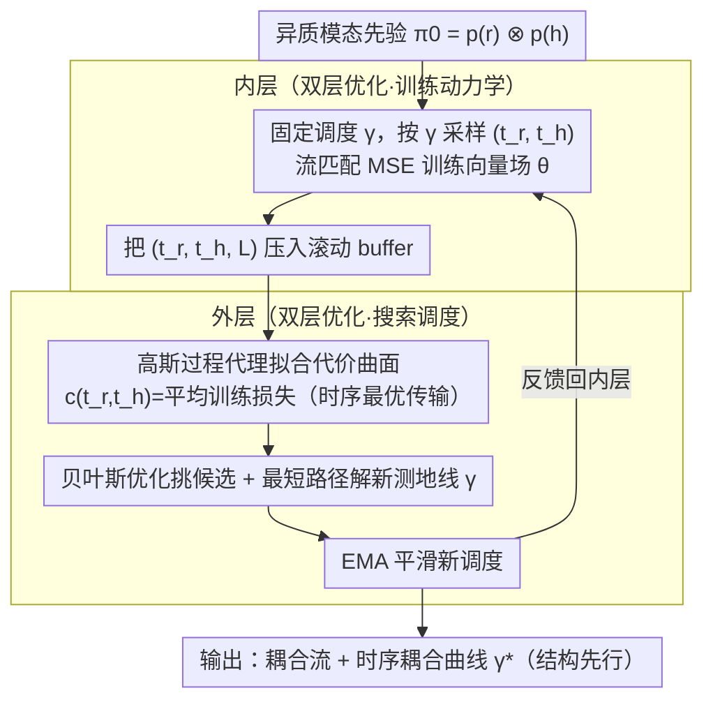

# Demystifying Multimodal Biomolecular Co-design with Intrinsic Geodesic Coupling

**会议**: ICML 2026  
**arXiv**: [2606.01628](https://arxiv.org/abs/2606.01628)  
**代码**: 待确认  
**领域**: 科学计算 / 生物分子共设计 / 多模态生成 / 最优传输  
**关键词**: 生物分子共设计、时序耦合、最优传输、贝叶斯优化、流匹配

## 一句话总结
作者把"序列 + 三维结构"这种异质模态的共生成问题，重新建模为**时序最优传输 (Temporal Optimal Transport)** 问题，用双层优化 + 高斯过程代理 (GeoCoupling) 在训练过程中**自动学出非对角的时间耦合曲线**（即让结构和序列以各自适合的节奏被去噪），在 SBDD 和无条件蛋白质共设计两个任务上同时打败"同步耦合"和"随机耦合"两大类基线，并意外发现一条普适的"结构先行 (structure-leading)"几何先于语义的生成规律。

## 研究背景与动机
**领域现状**：生物分子（蛋白质、配体）的功能由序列与三维结构耦合决定，因此结构 + 序列**联合生成 (co-design)** 已成为 de novo 药物 / 蛋白设计的主流范式。代表方法包括 MultiFlow、DPLM-2、La-Proteina（蛋白质），以及 TargetDiff、MolCRAFT、MolPilot、DrugFlow（SBDD）。这些方法本质都是在一个**异质乘积流形** $\mathbb{R}^{N\times 3} \times \mathbb{R}^{N\times K}$ 上做扩散 / 流匹配。

**现有痛点**：几乎所有 co-design 模型都**默默采用同步耦合 (synchronous coupling)** —— 让所有模态共享同一个 timestep $t$，从噪声等速演化到数据。这是一个非常强的隐式归纳偏置：它假设所有模态的去噪难度、收敛速度都一致。Campbell et al. 2024 等工作尝试用**随机耦合 (random coupling)** 缓解，即训练时给每个模态独立采样 $(t_r, t_h) \sim [0,1]^2$，但这会引入**训练-推理不一致**（推理时通常仍按某条曲线走）和**高方差监督**。

**核心矛盾**：作者通过观察 SBDD 训练动力学（论文 Fig. 1C）发现 —— 在同步耦合下，结构 MSE 在轨迹大半段都居高不下，必须等到很晚才下降；切换为另一种异步耦合后，结构误差能更早降下来、validity 也涨。这说明**最优生成轨迹根本不是乘积流形上的对角线**，而是一条**几何弯曲的测地线**，不同模态应该按各自的"学习复杂度"分配时间预算。

**本文目标**：把"模态间时间如何耦合"从硬编码的设计选择，升格为一个**可学习的一阶设计变量**，且学习开销可控（不能让外层每跑一次都要重训一遍模型）。

**切入角度**：把多模态生成的训练损失 $\mathcal{L}_\text{MSE}(\theta, \gamma)$ 看作**时序域上的传输代价**，整条调度曲线 $\gamma:[0,1] \to [0,1]^2$ 对应一个**耦合测度** $\pi_\gamma \in \mathcal{P}([0,1]^2)$ ——这就把"找最优耦合"翻译成"在产品流形上找最低能量测地线"。

**核心 idea**：用 **双层优化 (bi-level) + 高斯过程代理 + 贝叶斯优化** 在训练循环里在线学出这条测地线 $\gamma^*$。内层固定 $\gamma$ 训练 $\theta$，外层在 $\theta^*$ 给出的损失曲面上搜更优 $\gamma$；GP 代理把"每改一次 $\gamma$ 都要重训"的开销摊平。

## 方法详解

### 整体框架
GeoCoupling 要解决的是：序列和结构这两种模态在去噪时该按什么节奏推进。作者把这件事抽象成在二维时间方块 $[0,1]^2$（结构时间 $t_r$ × 序列时间 $t_h$）上找一条单调曲线 $\gamma$，使得沿这条曲线训练出的流模型转移能量最低——同步耦合相当于硬选了对角线，而真正的最优往往是一条弯曲的测地线。整套方法是一个嵌套循环：内层固定当前调度 $\gamma$、用常规流匹配目标训练向量场，外层则把训练途中观测到的损失喂给一个高斯过程代理，在线搜出更优的 $\gamma$ 反馈回内层；输入是异质模态先验 $\pi_0 = p(\boldsymbol r) \otimes p(\boldsymbol h)$，输出是从 $\pi_0$ 到联合数据分布 $\pi_1 = p_\text{data}(\boldsymbol r, \boldsymbol h)$ 的耦合流，外加一条学到的时序耦合曲线 $\gamma^*$。

### 关键设计

**1. Temporal Optimal Transport：把"找最优耦合"翻译成"找最低能量测地线"**

以往 OT 视角关心的是在样本空间里如何配对 $x_0, x_1$，这篇把同一套语言平移到时间域。整条调度曲线 $\gamma$ 被看成一个推前测度 $\pi_\gamma := \gamma_\# \lambda \in \mathcal{P}([0,1]^2)$，于是"哪条调度更好"就等价于比较传输代价 $\mathcal{E}(\gamma) = \int c(t_r, t_h)\, d\pi_\gamma$，其中代价曲面 $c(t_r, t_h) := \mathbb{E}_x[\mathcal{L}_\text{MSE}(x, (t_r, t_h))]$ 就是该时间对上的平均训练损失。这套表述的价值在于它给"为什么要学耦合"一个统计层面的硬解释：作者证明（Prop. 3.2）沿 $\gamma$ 积分的损失能分解成 $\mathcal{E}(\gamma) = \int [\,\underbrace{\|v_\theta - u^\gamma\|^2}_\text{Bias} + \underbrace{\mathrm{Var}(\mathbf{u}_t^\gamma \mid \mathbf{x}_t)}_\text{Variance}\,]\, dt$，同步耦合处在"高 Bias 低 Variance"那端、随机耦合处在"低 Bias 高 Variance"那端，几何最优的 $\gamma^*$ 则落在两者之间——它不是工程 trick，而是产品流形上真实存在的一条最优测地线。

**2. 双层优化：让外层只靠"观测训练损失"就能给出搜索信号**

直接想对整段训练轨迹求 hypergradient 既不可微也算不起，所以作者把"找 $\gamma$"和"训 $\theta$"拆成两层：内层 $\theta^* = \arg\min_\theta \mathcal{L}_\text{MSE}(\theta, \gamma)$ 照常训模型，外层 $\min_{\gamma\in\Gamma} \mathcal{J}(\gamma) = \mathbb{E}_x[\int_0^1 \mathcal{L}_{\theta^*}(x, \gamma(t))\, dt]$ 只在内层给出的损失曲面上搜调度。关键的简化来自 Prop. 3.3：一旦内层把 bias 项压下去，几何最优耦合就退化成 $\gamma^* = \arg\min_\gamma \mathbb{E}_{t,x}[\mathrm{Var}(u_t^\gamma \mid \mathbf{x}_t)]$，也就是"最小化沿路径的本质监督方差"。这一步把外层从"需要梯度"变成"只需要能估计损失方差"，外层因此可以完全黑盒地搜，无需反传穿过训练过程。

**3. 高斯过程代理 + 贝叶斯优化：把外层单次更新从 1213.6 秒压到 21.5 秒**

外层若用暴力网格搜，$K$ 个模态要做 $O(N^K)$ 次代价评估，实测一次更新要 1213.6 秒，根本没法塞进训练循环。作者改用 GP 把代价曲面建成 $c(\mathbf{t}) \sim \mathcal{GP}(\mu(\mathbf{t}), k(\mathbf{t},\mathbf{t}') + \sigma_n^2 \delta)$，并配一个容量 $N_\max = 1000$ 的滚动 buffer $\mathcal{B}$ 只保留最近的训练观测——这样 GP 拟合的始终是模型"当前能力"对应的损失，而不是早期残差。每轮外层先用贝叶斯优化的采集函数挑候选时间对补充 GP，再在 GP 曲面上跑最短路径算法解出一条新的单调测地线当作 $\gamma$。靠这套代理，单次更新降到 21.5 秒，56× 的加速正是让外层能高频嵌进训练而不卡 pipeline 的前提。

### 一个完整示例
设想训练一个 SBDD co-design 模型。第 $k$ 步时当前调度 $\gamma_k$ 让结构时间 $t_r$ 跑得比序列时间 $t_h$ 快一点；内层按这条曲线采样 $(t_r, t_h)$、算流匹配 MSE 并更新 $\theta$，同时把这一批的 $(t_r, t_h, \mathcal{L})$ 三元组压进 buffer（满 1000 条就挤掉最旧的）。外层用这些观测刷新 GP，发现"序列在结构尚未稳定时就强行降噪"那块区域损失方差特别高，于是贝叶斯优化把候选点引向"先结构后序列"的方向，最短路径算法在更新后的曲面上解出一条更靠结构先行的新测地线 $\gamma_{k+1}$。为防止外层一次突变把内层带飞，学到的调度再做一次 EMA 平滑后才喂回内层。如此交替，曲线会逐渐收敛到 Fig. 4 里那条"结构先行"的形状。

### 损失函数 / 训练策略
内层沿用各底层模型的原生训练目标（流匹配 / 扩散 MSE / BFN ELBO 等），唯一改动是采样 $(t_r, t_h)$ 时按当前 $\gamma$ 抽取，而非独立采样（随机耦合）或同步采样。外层则靠 GP buffer 的滚动更新 + 对学到的 $\gamma$ 做 EMA 来稳住训练。整体相对原模型几乎不增加训练步数——作为对照，MolPilot 那种"训练后再一次性跑外层"的做法需要 2× 训练步，而 GeoCoupling 把外层在线化后用 1× 训练步就够。

## 实验关键数据

### 主实验

**Structure-Based Drug Design (CrossDock, 100 测试 pocket × 100 分子)**：

| 类别 | 方法 | PB-Valid↑ | Vina Score↓ (avg) | Vina Dock↓ (avg) | scRMSD<2Å↑ |
|------|------|-----------|-------------------|------------------|-------------|
| Reference | - | 95.0% | -6.36 | -7.45 | 34.0% |
| 同步 | MolCRAFT | 84.6% | -6.55 | -7.67 | 46.8% |
| 同步 | DrugFlow | 79.6% | -5.12 | -6.99 | 23.1% |
| 随机 | MolPilot | 95.9% | -6.88 | -7.92 | 41.1% |
| 学习 | **GeoCoupling** | 94.3% | **-7.16** | **-8.32** | 43.1% |

GeoCoupling 在结合亲和力 (Vina Score / Min / Dock) 上全面领先，PB-Valid 与 MolPilot 同档。

**无条件蛋白质共设计 (长度 100-500, N=100)**：

| 方法 | Co-design↑ | pLDDT↑ | 1 - Pairwise TM↑ | FS Clusters↑ | Max TM↓ |
|------|-----------|--------|------------------|--------------|---------|
| MultiFlow | 0.72 | 79.39 | 0.63 | 0.56 | 0.83 |
| La-Proteina (tri) | 0.77 | 85.32 | 0.59 | 0.36 | 0.85 |
| DPLM2 | 0.31 | 83.69 | 0.63 | 0.49 | 0.96 |
| **GeoCoupling** | **0.79** | 80.15 | 0.63 | 0.48 | 0.83 |
| GeoCoupling (post-hoc → MultiFlow) | 0.74 | 79.23 | 0.64 | **0.73** | 0.83 |

GeoCoupling 拿下最高 co-designability；其学到的耦合还能作为 **plug-and-play** 套到 MultiFlow checkpoint 上，把 FS Clusters 从 0.56 拉到 0.73。

### 消融实验

| 配置 | Connected↑ | Vina Score↓ (mean) | Vina Min↓ (mean) | 说明 |
|------|-----------|--------------------|------------------|------|
| Full (Ours) | **93.5%** | **-7.12** | **-7.57** | 双层 + EMA |
| Fixed $\gamma^*$ | 91.1% | -6.97 | -7.45 | 训前固定调度，训练中不更新 |
| w/o EMA | 91.9% | -6.50 | -7.24 | 外层调度无平滑，方差大 |

### 关键发现
- **结构先行 (structure-leading) 是普适规律**：在 SBDD（小分子）和蛋白质两个尺度上，学出的 $\gamma^*$ 都呈现"早期结构 $t_r$ 推进快、序列 $t_h$ 等结构稳定后再快速降噪"的形状（Fig. 4），暗示几何上下文是序列解码的必要先验，这一发现是用 BO 自动发掘出来而非人工设计。
- **OOD 长度更显优势**：蛋白质长度 ≥ 400 时 MultiFlow co-designability 掉到 < 0.3，GeoCoupling 仍保持 > 0.6，说明学到的耦合不是过拟合 training length 的 trick，而是更鲁棒的传输计划。
- **BO 不可或缺**：dense-grid 暴力搜每次更新 1213.6 秒 vs. GP-BO 21.5 秒（56× 加速），使得外层能高频与内层并行，否则双层优化无法在训练中实时跑。
- **MolPilot 是 GeoCoupling 的特例**：它相当于只在训练收敛后跑一次外层；GeoCoupling 反而能用 1× 训练步达到更好结果。

## 亮点与洞察
- **把"模态间时间耦合"升格为可学习变量**是这篇最干净的贡献：以前大家要么默认对角线（同步），要么直接乱抽（随机），这篇第一次系统化地说明二者分别处于 Bias-Variance trade-off 的两端，且最优解一定在中间某条几何曲线上。
- **统一的传输视角（Table 1）**：把"样本配对 OT"和"时间调度 OT"放进同一张图里，前者优化空间耦合 $\pi(x_0, x_1)$，后者优化时间耦合 $\pi_\gamma(t_r, t_h)$；这种对偶把扩散 / 流匹配领域两条独立的研究线拉到一起，未来谁要做"三模态 co-design"都能复用这套数学。
- **结构先行的物理可解释性**：自动学出来的耦合恰好印证 induced fit / co-evolution 的生物先验 —— "先搭骨架再决定序列"，这对未来设计先验更强的 inductive bias 是很好的提示。
- **post-hoc 即插即用**：学到的 $\gamma^*$ 可以直接迁到别人的 checkpoint 上（如 MultiFlow），不用重训，这是非常友好的工程性质。

## 局限与展望
- 作者承认 GP-BO 仍是**带噪的近似外层搜索**，并未给出全局最优保证；且 GP 在 $K > 2$ 模态时维度灾难依然存在，三模态以上需要更结构化的代理模型。
- 学到的耦合是**整体平均意义**下的最优 —— 对每条样本 / 每个 pocket 用同一条 $\gamma$，没有考虑样本级条件耦合；未来可以引入 amortized $\gamma(x)$。
- 实验未触及更复杂的全原子蛋白 / 蛋白-蛋白 docking 场景，且 SBDD 评估仍以 Vina 为主，缺少湿实验或更严格的物理仿真验证。
- Buffer 容量 $N_\max = 1000$ 和 EMA 系数是经验值，对超长训练或大模型时的稳定性敏感度未充分扫描。

## 相关工作与启发
- **vs MolPilot (Qiu et al., 2025)**：MolPilot 在训练**结束后**做一次外层调度搜索（VOS），相当于本文双层框架"外层只跑一次"的退化版；GeoCoupling 把外层放进训练循环，结果用 1× 训练步就超过 MolPilot 的 2× 训练步，证明耦合需与模型能力**共同演化**。
- **vs MultiFlow / DPLM-2**：这些是随机耦合代表，本文把它们的训练-推理不一致解释为"高方差监督"，并在它们的 checkpoint 上 post-hoc 套 $\gamma^*$ 就能涨点，验证了诊断 + 解药的连贯性。
- **vs 经典 OT 流匹配 (Lipman / Liu / Song et al.)**：那一脉做的是样本空间 OT（拉直 $x_0 \to x_1$），本文是时间域 OT（拉直 $t_r \to t_h$ 的耦合），两者**正交且可叠加**，未来可以一起用。
- **vs 课程学习 / 调度学习**：本文实质上是"调度学习"的几何化版本，给"为什么这个 schedule 比那个好"提供了 Bias-Variance 与传输能量的双重解释，比经验式调度更有原则性。

## 评分
- 新颖性: ⭐⭐⭐⭐⭐ 把时序耦合升格为可学习变量并给出 TOT 数学框架，立意干净，是 co-design 领域少见的视角级创新。
- 实验充分度: ⭐⭐⭐⭐ SBDD + 蛋白质两任务、ID + OOD、消融 + 计算开销都齐了，但缺湿实验验证。
- 写作质量: ⭐⭐⭐⭐⭐ 命题清晰、Fig. 1 把动机 / 方法 / 现象一图讲透，数学符号一致性高。
- 价值: ⭐⭐⭐⭐⭐ 学到的耦合可直接 plug 到 MultiFlow 等已有模型，立刻可用；"结构先行"的发现对整个 AI for Science 社区是普适的设计指引。

<!-- RELATED:START -->

## 相关论文

- [\[ICML 2026\] EvoEGF-Mol: Evolving Exponential Geodesic Flow for Structure-based Drug Design](evoegf-mol_evolving_exponential_geodesic_flow_for_structure-based_drug_design.md)
- [\[ICLR 2026\] Intrinsic Lorentz Neural Network](../../ICLR2026/computational_biology/intrinsic_lorentz_neural_network.md)
- [\[ICML 2025\] Compositional Flows for 3D Molecule and Synthesis Pathway Co-design](../../ICML2025/computational_biology/compositional_flows_for_3d_molecule_and_synthesis_pathway_co-design.md)
- [\[ICLR 2026\] Unified Biomolecular Trajectory Generation via Pretrained Variational Bridge](../../ICLR2026/computational_biology/unified_biomolecular_trajectory_generation_via_pretrained_variational_bridge.md)
- [\[ICLR 2026\] HeurekaBench: A Benchmarking Framework for AI Co-scientist](../../ICLR2026/computational_biology/heurekabench_a_benchmarking_framework_for_ai_co-scientist.md)

<!-- RELATED:END -->
