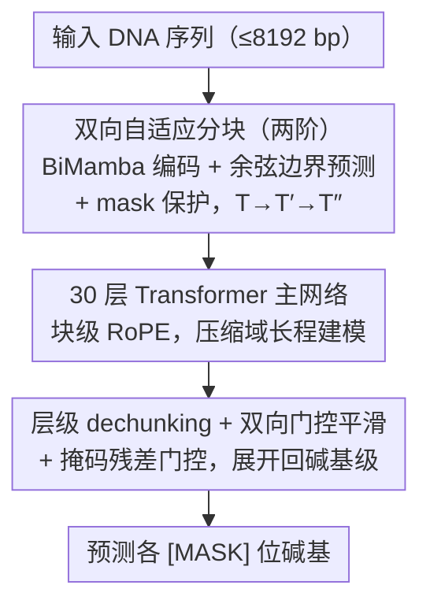

# DNAChunker: Learnable Tokenization for DNA Language Models

**会议**: ICML2026  
**arXiv**: [2601.03019](https://arxiv.org/abs/2601.03019)  
**代码**: 暂未公开  
**领域**: 科学计算 / 基因组语言模型  
**关键词**: DNA 语言模型, 可学习分词, 自适应分块, 掩码语言建模, BiMamba

## 一句话总结
DNAChunker 在掩码 DNA 语言模型中嵌入一个端到端可学习的"动态分块器"，通过双向 Mamba 编码 + 余弦相似度边界预测把 base-pair 序列压成变长 chunk，并配合 mask 保护与残差门控防止信息泄露，仅用人类参考基因组、172M 参数就在五个基因组 benchmark 上全面超越 2.5B 级别的多物种预训练基线。

## 研究背景与动机

**领域现状**：DNA 语言模型（NT、DNABERT-2、HyenaDNA、Caduceus 等）正在把 NLP 里"先分词再编码"的范式搬到基因组。主流分词方案只有三类——单核苷酸、固定长度 k-mer、或在大语料上跑 BPE。

**现有痛点**：DNA 序列没有天然的"词"边界，而上述方案都是与上下文无关的固定切分。论文用图 1 给出两个具体失败模式：(1) k-mer 对小尺度扰动极度敏感，一个 indel 就能把整段 token 序列移位；(2) BPE 只看子串频率，最高频子串往往是非功能的重复元素，反而会把 TF-binding motif、cis-regulatory motif 这种真正有意义的功能片段切碎。

**核心矛盾**：单核苷酸保留全部信息但序列太长无法做长程建模；k-mer/BPE 压缩了长度却切坏了功能 motif。本质是"上下文无关的固定分词"与"基因组功能依赖上下文"之间的结构性冲突。

**本文目标**：把分词从"预处理超参"升级为"端到端可学习模块"，使分块结果同时满足三点：(i) 长度自适应、压缩冗余区段；(ii) 在功能富集区保留细粒度；(iii) 对 SNV / InDel / 结构变异稳健。

**切入角度**：作者注意到自回归侧已有 H-Net (Hwang et al., 2026) 等动态分块工作，但 DNA 是双向信号——promoter / enhancer 的语义同时依赖上下游，因此分块本身就必须是双向的。同时 MLM 训练里的 `[MASK]` 是预训练专属人造 token，如果让它参与分块或经由 encoder 残差泄露给 decoder，模型会学到 mask 形状的捷径，无法迁移到下游无 mask 数据。

**核心 idea**：用双向 Mamba 编码出 base-pair 特征 → 用余弦相似度路由网络在相邻位置之间预测硬边界 → 把相似的相邻位置合并成一个变长 chunk 喂给 Transformer 主干，并用 mask 保护 + 残差门控两条机制堵住 mask 信息泄露通道。

## 方法详解

### 整体框架
DNAChunker 是一个 encoder–main–decoder 结构的双向 MLM：输入一条最长 8192 bp 的核苷酸序列，目标是预测每个被 mask 位置的碱基。它不再用固定 k-mer/BPE 切词，而是让序列在前向过程中被"压缩两次再展开两次"——base-pair 长度 $T$ 经两阶可学习分块缩成 chunk 序列 $T''$，由 30 层 Transformer 主网络在这个最短的长度上做长程建模，再经两阶 dechunking 逐级上采样回 base-pair 分辨率做预测。整套设计的一条主线是把最贵的长程注意力算力全部留给主网络：编码、解码两端只用轻量 BiMamba 负责"压短"和"展开"，中间才用昂贵的 Transformer，从而以 172M 参数撬动 1.2B 级别的建模能力。

### 关键设计

**1. 双向自适应分块：把"切词"变成可学的边界预测，解决固定分词切坏功能 motif 的痛点**

固定 k-mer/BPE 的问题是与上下文无关，而 promoter/enhancer 的边界本身就依赖上下游证据。DNAChunker 在每个分块阶段 $s$ 把输入特征 $\widehat{x}^{(s)}$ 经线性投影得到 query $q^{(s)}_t$ 与 key $k^{(s)}_t$，用相邻位置的余弦"不相似度"作为边界概率 $p^{(s)}_t = \tfrac{1}{2}\bigl(1 - \tfrac{(q^{(s)}_t)^\top k^{(s)}_{t-1}}{\|q^{(s)}_t\|\,\|k^{(s)}_{t-1}\|}\bigr)$，再以 $b^{(s)}_t = \mathbf{1}(p^{(s)}_t \ge 0.5)$ 阈值化成硬边界，把同一段内的 base-pair 表示聚合为一个 chunk embedding，序列长度由 $T$ 缩到 $T' = \sum_t b^{(0)}_t$。由于 query/key 来自双向 BiMamba 编码，边界预测能同时看到上下游——这正是 H-Net、Byte Latent Transformer 这类只能单向决策的自回归方案做不到的，也是 DNA 双向语义所必需的。两阶段递归地做同样的事，最终把 $x^{(2)}$ 喂给主网络。

这里还埋了一条 MLM 专属的防泄露设计：mask 保护机制强制在每个 `[MASK]` 位置前后各插一条边界，使被 mask 的核苷酸永远独占一个单 token 的 chunk。若不这么做，分块模块会把"mask 的形状"当成切分线索，学到一个无法迁移到无 mask 下游数据的捷径。

**2. 30 层 Transformer 主网络 + 块级 RoPE：在最压缩的长度上承担长程推理**

主网络是标准 Pre-LN Transformer（多头自注意力 + GELU FFN），承载模型绝大多数参数与算力。关键的一处适配是位置编码：RoPE 不以 token 序号、而以每个 chunk 的"中心 base-pair 下标"作为位置 id，这样即便序列被压缩成变长 chunk，相对位置仍以 base-pair 为物理尺度，保留了基因组坐标语义。因为分块已经把 megabase 级序列的有效长度大幅缩短，长程注意力在这个压缩域里变得可承受。这种"瘦头胖中"的算力分配——encoder/decoder 用轻量 BiMamba、主干才用 Transformer——正是 172M 参数能匹敌 1.2B GENERator 的来源。

**3. 层级 dechunking + 双向 probability-gated 平滑 + 掩码残差门控：把表示展开回碱基级，并堵死第二条泄露通道**

主网络输出的是 $T''$ 长度的 chunk 表示，需要还原到 base-pair 分辨率才能做逐碱基预测。dechunking 先按 cumulative 边界做 piecewise-constant 复制 $\tilde z^{(s+1)}_t = z^{(s)}_{\sum_{k\le t} b^{(S-s)}_k}$，把每个 chunk 的表示广播回它覆盖的所有碱基；再用一对前向/后向线性递归 $\textsc{Scan}_\rightarrow,\textsc{Scan}_\leftarrow$ 以边界概率 $p$ 为门做双向平滑 $z^{(s+1)}_t = \tfrac{1}{2}(\textsc{Scan}_\rightarrow + \textsc{Scan}_\leftarrow)$。这步一举两得：硬边界 $b$ 不可导，而 $p$ 给了梯度一条流回路由网络的通路；双向 scan 又与 MLM 的双向假设保持一致，把上下游上下文重新注入碱基级表示。

与分块端的 mask 保护配套，这里还有第二道屏障——掩码残差门控：encoder 残差只对"所在 chunk 不含 mask"的位置开启，含 mask 的 chunk 整体收 0 残差，逼着这些位置的重建必须穿过主网络。否则 encoder 的 BiMamba 会把邻居真值顺着残差漏给 decoder，让 decoder 直接照抄、MLM 损失训练的其实是 encoder 而非主网络。

### 损失函数 / 训练策略
总损失 $\mathcal{L} = \mathcal{L}_{\text{MLM}} + \lambda\mathcal{L}^{(0)}_{\text{ratio}} + \lambda\mathcal{L}^{(1)}_{\text{ratio}}$。MLM 项按 BERT 协议（15% 选中、80% 替换为 `[MASK]`、10% 随机、10% 保留），并对重复区域权重降到 0.1。每个分块阶段额外加一个"压缩比"正则：$\mathcal{L}^{(s)}_{\text{ratio}} = \tfrac{\bar b^{(s)}\bar p^{(s)}}{\alpha^{(s)}} + \tfrac{(1-\bar b^{(s)})(1-\bar p^{(s)})}{1-\alpha^{(s)}}$，其中 $\bar b^{(s)},\bar p^{(s)}$ 分别是阶段 $s$ 的平均硬边界比例与平均边界概率，$\alpha^{(s)}\in(0,1)$ 是目标压缩比。$\bar b$ 不可导，但通过让 $\bar p$ 逼近 $\alpha$ 间接逼近目标压缩比。预训练语料是 GRCh38/hg38 人类参考基因组，按 Enformer 划分切成 $2^{20}$ bp 区域再切成 8192 bp 输入。下游任务统一去掉 LM head、对有效 token 做平均池化接一层线性分类头，根据数据集协议选择全微调或线性探针。

## 实验关键数据

### 主实验
五个 benchmark 全面验证。下表把每个 benchmark 上 DNAChunker 与最强对照、以及参数量倍数列出来，可以看到它用 172M 参数稳赢 2.5B 多物种预训练的 NT 与 1.2B 的 GENERator。

| Benchmark | 指标 | DNAChunker (172M) | 最强基线 | 备注 |
|---|---|---|---|---|
| NT benchmark | 总均 MCC ↑ / 平均 rank ↓ | **0.772** / **1.67** | GENERator (1.2B) 0.728 / 2.06 | 18 个数据集中赢 13 个；histone 平均 MCC 0.701 vs 0.625 |
| Revised NT benchmark | 平均 MCC ↑ | **0.660** | PatchDNA 0.626；MxDNA 0.637 | splice site +0.068 vs MxDNA |
| Genomic Benchmarks | top-1 acc ↑ / 平均 rank ↓ | 0.885 / 3.29 | GENERator 0.892 / 2.89 | 用 $7\times$ 更少参数与 GENERator 持平 |
| DNALongBench | 5 任务（最长 1 Mb 上下文） | 全部 > Caduceus-PH | Caduceus-PH (LP) | enhancer-target +0.061；txn init +0.047；仅用线性探针即超 expert |
| BEND | 平均 rank ↓ | **1.9** | PatchDNA 2.1 | variant effect (expression) AUROC 0.59 领先 |

### 消融实验
在 revised NT benchmark 上用 2B token 同预算、控变量比较分词与组件（线性探针，higher better）：

| 配置 | Histone | Enhancers | Promoters | Splice | Overall MCC |
|---|---|---|---|---|---|
| 6-mer | 0.338 | 0.319 | 0.593 | 0.147 | 0.347 |
| BPE | 0.339 | 0.349 | 0.667 | 0.223 | 0.375 |
| w/o Mask Protection | 0.316 | 0.293 | 0.614 | 0.128 | 0.332 |
| w/o Residual Gating | 0.338 | 0.298 | 0.607 | 0.185 | 0.353 |
| w/o Ratio Loss | 0.341 | 0.290 | 0.635 | 0.123 | 0.348 |
| **DNAChunker (full)** | **0.344** | 0.346 | **0.673** | **0.290** | **0.390** |

### 关键发现
- 三条防泄露 / 控压缩机制都不可省：去掉 mask 保护最伤（overall 0.390 → 0.332，splice 0.290 → 0.128，几乎打回 6-mer），印证 mask 形状捷径确实存在；去掉残差门控次之；去掉压缩比正则会让 splice 直接崩到 0.123，因为没有 $\mathcal{L}_{\text{ratio}}$ 约束时模型倾向于过度压缩、丢掉 splice site 这种需要单碱基级精度的信号。
- 与固定分词正面对比：DNAChunker overall MCC 0.390 显著高于 BPE 0.375 与 6-mer 0.347，splice 上更是从 0.147 / 0.223 跳到 0.290——说明"分词需要保留功能 motif"这一动机被实际验证。
- 跨规模一致性：用 172M 参数、单物种 GRCh38 训练就稳压 2.5B 多物种 NT 和 1.2B GENERator，意味着收益主要来自 tokenization 与架构，而非堆参数 / 堆数据。
- 长程效率：自适应压缩降低有效序列长度，在 1 Mb 级 DNALongBench 上仅用 frozen backbone + linear probing 就超过全微调的 task-specific expert，说明 chunk 边界确实被分配到了功能富集区。

## 亮点与洞察
- 把"分词"从训练前的超参变成端到端可学的模块，这是 NLP 侧 H-Net 系列工作在 DNA 这种"无天然词"语言上更自然的落点——基因组本来就没有词典，BPE 频率统计反而是错配先验。
- mask 保护机制是真正只属于 MLM 的细节：自回归 LM 没有 `[MASK]` 这种人造 token，作者识别出"分块模块会把 mask 形状当 cue"这种隐秘捷径，并用强制单 token chunk + 残差门控两条独立屏障封死，是非常成熟的 MLM 工程经验。
- "瘦头胖中"的算力分配（轻量 BiMamba encoder/decoder + 大 Transformer 主干 + 自适应压缩）给后续多模态长序列（蛋白质、化学反应、code token 流）提供了可复制的模板：先压缩到主网络能 afford 的长度，再把昂贵注意力全部留给压缩域。

## 局限与展望
- 作者明确只在 GRCh38 单物种上预训练，跨物种泛化（细菌、病毒）是否仍优于 Evo2 这类多物种自回归模型未验证。
- splice site 任务上虽显著超 MxDNA/PatchDNA，但相对 GENERator 仍落后 0.014——可变长 chunk 对"必须看到每个 nt"的任务仍有结构性劣势，可考虑任务自适应的 $\alpha$。
- 阈值 0.5 + 余弦相似度的边界判据较朴素，未与 entropy gating（Byte Latent Transformer）或熵基判据做正面对比；不同 $\alpha^{(s)}$ 设置下的鲁棒性也只在附录提及。
- 代码与权重在主文中尚未明确开源，复现门槛偏高。

## 相关工作与启发
- **vs Caduceus / NT-v2（固定 tokenization 的 MLM）**: 同样是双向 MLM 框架，DNAChunker 把固定 single-nt / BPE 换成可学分块，5 个 benchmark 全胜，验证"问题不在 MLM 本身，而在固定分词"。
- **vs DNABERT-2 / GROVER（BPE）**: 论文用 motif 切割可视化与 BPE 控变量消融直接说明：BPE 在 DNA 上是错配先验，频次最高的子串恰是非功能重复序列。
- **vs MxDNA / PatchDNA（DNA 专用可学分词）**: 这两者要么只在编码端做单向 patch，要么对 splice 这种细粒度任务掉点严重；DNAChunker 通过双向路由 + mask 保护把 splice MCC 从 0.740 拉到 0.936。
- **vs H-Net / Byte Latent Transformer（自回归可学分词）**: 把这套范式从自回归迁到双向 MLM，并配上 DNA 特有的 mask 保护与残差门控；可视为"H-Net 的 MLM 版"。

## 评分
- 新颖性: ⭐⭐⭐⭐ 端到端可学分词在自回归侧已有先例，本文贡献是双向化 + MLM 适配 + mask 保护这套工程组合
- 实验充分度: ⭐⭐⭐⭐⭐ 五大 benchmark + 控变量消融 + 跨物种 / 跨规模对比 + FLOPs 与 motif 可视化，覆盖非常完整
- 写作质量: ⭐⭐⭐⭐ 动机—架构—消融的逻辑链清晰，图 1 一张图把 motif fragmentation 和 mutation robustness 同时讲透
- 价值: ⭐⭐⭐⭐⭐ 用 172M 单物种击败 2.5B 多物种，几乎重新定义了 DNA 语言模型的算力—精度边界，是后续基因组基础模型必须比较的新基线

<!-- RELATED:START -->

## 相关论文

- [\[ICLR 2026\] AntigenLM: Structure-Aware DNA Language Modeling for Influenza](../../ICLR2026/computational_biology/antigenlm_structure-aware_dna_language_modeling_for_influenza.md)
- [\[ICLR 2026\] Tracing Pharmacological Knowledge in Large Language Models](../../ICLR2026/computational_biology/tracing_pharmacological_knowledge_in_large_language_models.md)
- [\[ICLR 2026\] Controlling Repetition in Protein Language Models](../../ICLR2026/computational_biology/controlling_repetition_in_protein_language_models.md)
- [\[ICML 2025\] Protein Structure Tokenization: Benchmarking and New Recipe](../../ICML2025/computational_biology/protein_structure_tokenization_benchmarking_and_new_recipe.md)
- [\[ICLR 2026\] Protein Structure Tokenization via Geometric Byte Pair Encoding](../../ICLR2026/computational_biology/protein_structure_tokenization_via_geometric_byte_pair_encoding.md)

<!-- RELATED:END -->
