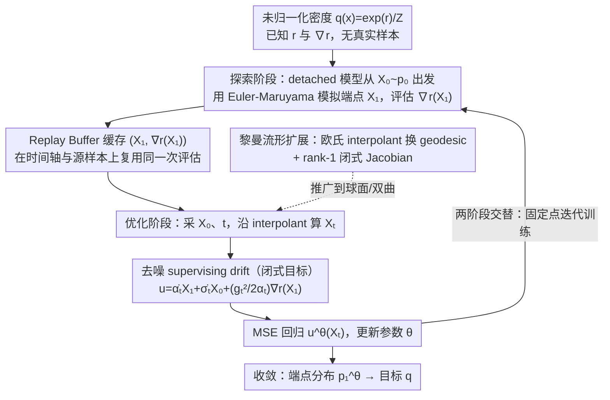

# Flow Sampling: Learning to Sample from Unnormalized Densities via Denoising Conditional Processes

**会议**: ICML 2026 Spotlight  
**arXiv**: [2605.03984](https://arxiv.org/abs/2605.03984)  
**代码**: 未公开  
**领域**: 扩散模型 / 采样 / 分子构象生成  
**关键词**: 扩散采样, 流匹配, 摊销采样, 黎曼流形, 分子构象

## 一句话总结
本文提出 Flow Sampling，把流匹配/扩散模型从"数据驱动"反转为"噪声驱动"——以源噪声样本为条件构造去噪扩散漂移，在 interpolant 上用 detached 模型采得 $X_1$ 的能量梯度做回归目标，从而学到无数据情况下的高效扩散采样器，并自然推广到常曲率黎曼流形。

## 研究背景与动机

**领域现状**：很多科学计算问题 (分子动力学、材料、化学反应路径) 都需从未归一化密度 $q(x)=\exp(r(x))/Z$ 中采样，已知 $r(x)$ 和 $\nabla r(x)$ 但拿不到样本。MCMC/Langevin 渐近正确但顺序生成、混合慢；最近兴起的扩散采样器分两类：(a) iDEM/PIS/DDS 等通过 Monte Carlo 校正 (重要性采样、resampling) 学习采样动力学；(b) SOC/Schrödinger bridge 路线 (Adjoint Sampling、ASBS) 通过优化 path measure 散度学习扩散动力学。

**现有痛点**：(a) 类方法每步要做多次能量评估来控制方差，计算昂贵；(b) 类方法需要刻画最优控制或 bridge，训练流程复杂常需辅助网络。此外，两类都默认欧氏空间，要扩展到流形 (球面、双曲) 需要重新设计。

**核心矛盾**：标准 FM/扩散模型的训练目标都是"给定数据点 $x_1$ 后条件构造一个 noising 过程，让模型回归到这个过程的速度场"；但当我们没有 $x_1$ 时这条路就走不通——只能间接通过 score $\nabla r$ 把目标信息引入训练。

**本文目标**：找到一种"对偶视角"——给定噪声点 $x_0$ 后条件构造一个 denoising 过程，让边际仍能匹配目标分布；并设计高效复用能量梯度的训练循环，最大化降低 NFE。

**切入角度**：作者把 FM 的条件方向反转——FM 是 push-forward of source ($p_{t|1}(x|x_1)=\tfrac{1}{\sigma_t^d}p_0(\tfrac{x-\alpha_t x_1}{\sigma_t})$，条件在 $t=1$)；本文是 push-forward of target ($p_{t|0}(x|x_0)=\tfrac{1}{\alpha_t^d}q(\tfrac{x-\sigma_t x_0}{\alpha_t})$，条件在 $t=0$)。两者的边际相同 (都等于 $p_t$)，但前者要求数据样本、后者只要求噪声样本——这正是 data-free setting 的需要。

**核心 idea**：以 $X_0\sim p_0$ 为条件构造"去噪扩散过程"，supervising drift 沿 interpolant $X_t=\sigma_t X_0+\alpha_t X_1$ 可以闭式写成 $u_{t|0}(X_t|X_0)=\dot\alpha_t X_1+\dot\sigma_t X_0+\tfrac{g_t^2}{2\alpha_t}\nabla r(X_1)$；用 detached 当前模型采 $X_1^{\bar\theta}$ 并把 $\nabla r(X_1^{\bar\theta})$ 缓存到 replay buffer 反复使用。

## 方法详解

### 整体框架
Flow Sampling 要解决的是没有任何真实样本、只知道未归一化密度 $q(x)=\exp(r(x))/Z$ 及其梯度 $\nabla r$ 时如何训练一个高效扩散采样器。它把整件事转成一个自举式的回归任务：先用当前模型从噪声出发跑出一批近似 $q$ 的样本并缓存它们的能量梯度，再以这些缓存样本作监督、让模型回归一个闭式的去噪 drift，两个阶段交替迭代直到模型端点分布逼近目标 $q$。

### 关键设计

**1. 噪声条件下的去噪 supervising drift：让 data-free 也能套用 FM 的回归框架**

标准流匹配的训练目标是"给定数据点 $X_1$ 后条件构造一条 noising 路径，让模型回归这条路径的速度场"，可一旦拿不到 $X_1\sim q$ 这条路就断了。本文把条件方向整个反转：不再以数据端 $X_1$ 为条件，而是以噪声端 $X_0\sim p_0$ 为条件，定义 push-forward of target 的条件概率路径 $p_{t|0}(x|x_0)=\tfrac{1}{\alpha_t^d}q(\tfrac{x-\sigma_t x_0}{\alpha_t})$。它和 FM 的边际相同 (都等于 $p_t$)，但只要噪声样本就能构造。沿 interpolant $X_t=\sigma_t X_0+\alpha_t X_1$，Proposition 3.2 把条件 drift $u_{t|0}=v_{t|0}+\tfrac{g_t^2}{2}\nabla\log p_{t|0}$ 化成闭式 $u_{t|0}(X_t|x_0)=\dot\alpha_t X_1+\dot\sigma_t x_0+\tfrac{g_t^2}{2\alpha_t}\nabla r(X_1)$，模型只需对它做 MSE 回归。这个形式最有效的地方在于：$\nabla r(X_1)$ 是唯一与目标分布相关的项，而它只依赖端点 $X_1$，所以对每个 $X_1$ 评估**一次** $\nabla r$，就能在整个 $t\in[0,1]$ 和任意源样本 $X_0$ 下复用——能量评估恰是分子动力学等场景里最昂贵的开销，把它在时间轴和源空间上摊掉是整套方法效率的根。

**2. Detached 模型的固定点迭代训练：用模型自己的端点样本顶替缺失的 $X_1\sim q$**

闭式 drift 里仍然需要 $X_1\sim q$，而这正是 data-free 设定下没有的东西。本文的做法是让模型自举：把 $X_1$ 换成当前模型 (detached、不回传梯度) 自己生成的端点样本 $X_1^{\bar\theta}\sim p_1^{\bar\theta}$，用 Euler-Maruyama $X_{t+h}^{\bar\theta}=X_t^{\bar\theta}+h\,u_t^{\bar\theta}(X_t^{\bar\theta})+\sqrt{2\gamma th}\,Z_t$ 从 $X_0\sim\mathcal{N}(0,I)$ 模拟到 $X_1^{\bar\theta}$，并把 pair $(X_1^{\bar\theta},\nabla r(X_1^{\bar\theta}))$ 推入 replay buffer。优化阶段从 buffer 采样、采 $X_0$ 和 $t\sim\text{Unif}[0,1]$，按 interpolant 算出 drift target 后最小化 $\mathcal{L}_{FS}=\mathbb{E}\|u^\theta(X_t)-u_{t|0}(X_t|X_0)\|^2$。这是一个固定点迭代：理论最优解满足 $p_1^\theta=q$，即模型生成的端点分布恰好是目标分布；detach 切断梯度避免自指回路发散，replay buffer 复用历史样本和缓存梯度则让训练在样本稀缺时仍然稳定。

**3. 常曲率黎曼流形扩展：把整套 drift 推到球面/双曲空间且几乎零额外成本**

现有扩散采样器几乎都默认欧氏空间，要应用到方向数据、机器人姿态、图嵌入这类天然活在球面或双曲空间的对象就得重写整个 pipeline。本文把欧氏 interpolant 换成 geodesic interpolant $X_t=\exp_{X_1}[(1-t)\log_{X_1}(x_0)]$，并把欧氏布朗运动替换成切空间投影后的 $P_{X_t}^\perp\circ dB_t$，保证扩散始终停在流形上。关键在 Proposition 4.1：它证明 geodesic Jacobian 有 rank-1 闭式 $J_t=t\,T_{X_1\to X_t}P_{\dot X_1}+c_t\,T_{X_1\to X_t}P_{\dot X_1}^\perp$，其中 $c_t=\sin(t\omega_1\sqrt\kappa)/\sin(\omega_1\sqrt\kappa)$ ($\kappa>0$) 或换成 $\sinh$ 版本 ($\kappa<0$)。有了这个闭式 Jacobian 就能直接算条件 score 和 drift，省掉数值反向求导，因此从欧氏推广到常曲率流形几乎不增加成本——这也是全文最具开创性的一笔。

### 损失函数 / 训练策略
线性 scheduler $\alpha_t=t,\sigma_t=1-t,g_t^2=2\gamma t$；$\gamma$ 自适应取 $\gamma=c/\sqrt{\mathbb{E}_{x_1\sim\mathcal{B}}[\|\nabla r(x_1)\|^2]+\varepsilon}$ 以抑制能量梯度的尺度波动。Replay buffer 容量 1–6 万，每轮 100–300 次梯度更新，新样本 128–2048/轮。

## 实验关键数据

### 主实验
合成能量基准 (DW-4/LJ-13/LJ-55) + 多肽 (Ala2/Ala4) + 大规模摊销分子构象生成 (SPICE/GEOM-DRUGS) + 球面 vMF 混合。

| 数据集 | 指标 | Flow Sampling | ASBS (前 SOTA) | 提升 |
|--------|------|------|----------|------|
| DW-4 | $\mathcal{W}_2$ ↓ | **0.36** | 0.43 | -16% |
| DW-4 | $E(\cdot)\mathcal{W}_2$ ↓ | **0.11** | 0.20 | -45% |
| LJ-13 | $E(\cdot)\mathcal{W}_2$ ↓ | **0.97** | 1.99 | -51% |
| LJ-55 | $E(\cdot)\mathcal{W}_2$ ↓ | **21.32** | 28.10 | -24% |
| Ala2 JSD (NFE=1024) | ↓ | **0.018** | 0.242 | -93% |
| Ala2 Energy $\mathcal{W}_2$ (NFE=128) | ↓ | **3.58** | $10^7$ | catastrophic |

### 消融实验 / 效率

| NFE (Train) | SPICE Recall Cov | SPICE Recall AMR |
|------|---------|------|
| 256 (Flow Sampling) | **91.89** | **0.86** |
| 128 (Flow Sampling) | 91.39 | 0.87 |
| 64 (Flow Sampling) | 90.13 | 0.87 |
| 256 (AS) | 88.60 | 0.87 |
| 128 (AS) | 77.97 | 0.98 |
| 64 (AS) | 29.13 (崩) | 1.43 |
| 512 (ASBS) | 89.66 | 0.86 |

### 关键发现
- 在 NFE=64 的低预算下，AS 完全崩塌 (Cov 5.50)，Flow Sampling 仍稳定 (Cov 71.14)；说明 FS 的 supervising target 比 AS 的 stochastic adjoint 信号 variance 低很多，能在低 NFE 下不爆。
- 训练成本可降 4-8 倍：SPICE 上 NFE=64 与 NFE=256 性能几乎相同，意味着 exploration phase 成本能直接降 4 倍。
- 球面 vMF 混合实验是首次在曲率流形上做扩散采样的 demo，证明黎曼扩展是可工作的不是纸上谈兵。
- 文章在附录 D 严格证明 FS 与 Adjoint Sampling 在 Brownian bridge 路径上有相同的条件期望 (Theorem D.1)，即两者本质上是控制变量等价。

## 亮点与洞察
- **"反转条件方向"这个 reframe 是本文的灵魂**：data-driven 的 FM/DM 条件在 $X_1$ 上、data-free 的 Flow Sampling 条件在 $X_0$ 上，看似简单的对称却带来工程上的巨大不同——FS 复用一次能量梯度就能覆盖整个时间轴和源样本空间，把昂贵的能量评估降到极致。
- **闭式 supervising target $\dot\alpha_t X_1+\dot\sigma_t x_0+\tfrac{g_t^2}{2\alpha_t}\nabla r(X_1)$** 的优雅程度让人想到 score matching：极简、可解释、可分析。这个公式是把"data-free + diffusion + replay buffer"三件事融合在一起的关键技术枢纽。
- **常曲率流形上的 rank-1 Jacobian** (Proposition 4.1) 是数学上很漂亮的结果，让流形采样从概念变成可工程化的算法。文章给出了 hypersphere 和 hyperbolic 的具体闭式，为方向数据、双曲嵌入等场景打开了扩散采样的大门。

## 局限与展望
- 固定点迭代没有全局收敛保证，replay buffer dynamics 可能在病态能量地形 (强多模态、大能量梯度) 上不稳定。
- 黎曼推广目前限制在常曲率，对一般曲率流形 (如蛋白质构象空间的非欧 metric) 需要 numeric Jacobian 求逆，效率会大降。
- 与 SOC/Schrödinger bridge 方法相比，FS 没有最优控制保证，可能在某些 task 上生成路径不是最高效的。
- 实验都是分子/球面，没有覆盖图像 reward 模型微调等热门 RL 场景。

## 相关工作与启发
- **vs iDEM**: iDEM 沿 noising path 用 MC 估计 target score，每步需要多次能量评估；FS 在 denoising path 上只需一次能量评估并复用，NFE 大降。
- **vs Adjoint Sampling (AS) / ASBS**: AS 用 stochastic adjoint method 反传 SOC 梯度；ASBS 加 Schrödinger bridge corrector。FS 不需 corrector，直接 regress on closed-form target，训练逻辑更简单。Theorem D.1 还证明两者本质等价 (差一个控制变量)。
- **vs Tilt Matching (concurrent)**: TM 也走 data-free reward-tilted 思路，但用退火路径；FS 直接固定线性 scheduler，简洁性更胜一筹。
- **启发**：FS 的"条件方向反转"思路可以推广到任何"知道一种条件但要构造另一种条件"的场景，例如 inverse problem (知道观测构造 prior 采样) 或 retrosynthesis (知道产物逆推反应物)。

## 评分
- 新颖性: ⭐⭐⭐⭐⭐ 数据驱动→噪声驱动的对偶反转 + 常曲率流形闭式 drift，是真正的概念创新。
- 实验充分度: ⭐⭐⭐⭐ DW-4/LJ-13/LJ-55 + Ala2/Ala4 + SPICE/GEOM-DRUGS + 球面 vMF，覆盖很广；但缺图像/文本 reward fine-tuning 实验。
- 写作质量: ⭐⭐⭐⭐⭐ Figure 2 的"条件方向对偶"图非常直观；Algorithm 1 给伪代码即可复现；Proposition 3.2 是全文最关键公式，呈现得简洁有力。
- 价值: ⭐⭐⭐⭐⭐ 在分子构象生成上把训练成本砍 4-8 倍 + 首次实现流形扩散采样，对计算化学与方向数据领域都有直接应用价值。

<!-- RELATED:START -->

## 相关论文

- [\[ICML 2026\] Temporal Score Rescaling for Temperature Sampling in Diffusion and Flow Models](temporal_score_rescaling_for_temperature_sampling_in_diffusion_and_flow_models.md)
- [\[CVPR 2026\] Coordinate Denoising for Non-Equilibrium Molecular Representation Learning](../../CVPR2026/computational_biology/coordinate_denoising_for_non-equilibrium_molecular_representation_learning.md)
- [\[ICML 2026\] Transformed Latent Variable Multi-Output Gaussian Processes](transformed_latent_variable_multi-output_gaussian_processes.md)
- [\[ICLR 2026\] Thompson Sampling via Fine-Tuning of LLMs](../../ICLR2026/computational_biology/thompson_sampling_via_fine-tuning_of_llms.md)
- [\[ICML 2026\] EvoEGF-Mol: Evolving Exponential Geodesic Flow for Structure-based Drug Design](evoegf-mol_evolving_exponential_geodesic_flow_for_structure-based_drug_design.md)

<!-- RELATED:END -->
