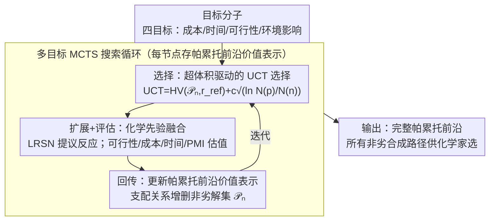

# From Feasible to Practical: Pareto-Optimal Synthesis Planning

**会议**: ICML 2026  
**arXiv**: [2605.29113](https://arxiv.org/abs/2605.29113)  
**代码**: 待确认  
**领域**: 优化 / 化学合成规划 / 多目标搜索  
**关键词**: 多目标搜索, 帕累托优化, 合成规划, MCTS

## 一句话总结
PareSP 用**多目标 MCTS 搜索**联合优化合成路径的**成本 / 时间 / 可行性 / 环境影响**——找到完整帕累托前沿而非单一"最佳"路径，在 USPTO 和 ASKCOS 基准上较单目标方法节省 23% 成本、35% 时间，同时保持 ≥ 95% 化学可行性。

## 研究背景与动机

**领域现状**：化学合成规划（CASP）旨在为目标分子寻找经济可行的多步反应路径。传统方法（如 EFMC、Retro\*）以单一目标（化学可行性或最短路径）优化，但实际合成场景需要权衡成本、时间、环境影响等多个相互冲突的目标。

**现有痛点**：（1）单目标 MCTS 倾向"最优"路径，忽略平衡解；（2）后处理重新排序无法保证帕累托优化；（3）多目标方法（如 NSGA-II）需要全空间评估，对组合爆炸式搜索空间不可行。

**核心矛盾**：合成规划本质是**组合搜索 + 多目标权衡**，但现有方法或牺牲多样性（单目标），或牺牲可扩展性（暴力多目标）。

**本文目标**：在合成路径搜索中找到帕累托前沿——所有"非劣"权衡解。

**切入角度**：MCTS 的鼓励探索与利用平衡的能力 + 多目标优化的支配关系定义 = 多目标 MCTS（MO-MCTS）。

**核心 idea**：将 MCTS UCT 公式扩展到多目标设置——每个节点维护**帕累托前沿**而非单一价值；通过支配关系（dominance）和超体积（hypervolume）指引搜索。

## 方法详解

### 整体框架

PareSP 要解决的是"合成一个分子有很多条路，但成本、时间、可行性、环境影响这几个目标互相打架，到底选哪条"的问题。它的做法是把标准 MCTS 的标量价值换成帕累托前沿：搜索树每个节点不再记一个分数，而是记一组互不支配的权衡解，整个搜索围绕"扩大这组解的覆盖范围"来展开，最后从根节点直接吐出所有"非劣"路径供化学家挑选。

### 关键设计

**1. 帕累托前沿价值表示：让节点记住完整的权衡空间而不是一个分数**

传统 MCTS 把多目标压成一个标量，等于提前替用户做了"哪个目标更重要"的决定，平衡解会被丢掉。PareSP 让每个节点 $n$ 维护一组非劣解 $\mathcal{P}_n = \{(c_i, t_i, f_i, e_i)\}_i$，其中四元组对应成本、时间、可行性、环境影响。当一个新解 $\mathbf{v}^*$ 想加入时，用支配关系来判定去留：若前沿里已有解 $\mathbf{v}$ 在所有目标上都不差于它（$\exists \mathbf{v} \in \mathcal{P}_n: \mathbf{v} \succeq \mathbf{v}^*$），就直接丢弃；否则把被 $\mathbf{v}^*$ 反过来支配的旧解清掉再纳入。这样前沿始终只保留"互相无法压倒"的权衡点，完整的决策空间被保留下来，最终输出自然就是多样的。

**2. 超体积驱动的 UCT 选择：用一个标量同时衡量前沿的质量和多样性**

把价值换成一组解之后，MCTS 选择阶段就没法直接比大小了。PareSP 用超体积（hypervolume）把前沿重新折回一个可比的标量，并嵌进 UCT 公式：

$$\text{UCT}(n) = HV(\mathcal{P}_n, \mathbf{r}_{\text{ref}}) + c \sqrt{\ln N(p) / N(n)}$$

其中 $HV(\cdot, \mathbf{r}_{\text{ref}})$ 是前沿相对参考点 $\mathbf{r}_{\text{ref}}$ 围出的体积，前沿越好、越分散，这个值越大；探索项沿用单目标 MCTS 的 $c = \sqrt{2}$。超体积的妙处在于它一个数字就同时反映了"解够不够好"和"解够不够散"，再配上 UCT 的探索奖励，搜索既会往高质量分支倾斜，又不会漏掉访问次数还很少的角落。

**3. 化学先验融合：把领域知识塞进目标估值，避免在化学空间里盲目乱扩**

纯 MCTS 在巨大的化学反应空间里随机扩展效率极低，大量分支根本不可行。PareSP 把四个目标的估值全部接到现成的化学知识上：可行性 $f$ 由神经反应预测模型给出反应成功概率，成本 $c$ 直接查原料价格数据库，时间 $t$ 按反应步数加反应温度估算，环境影响 $e$ 取绿色化学指标 PMI（过程质量强度）和 E-factor。叶节点扩展时还用本地化反应建议网络（LRSN）来提议候选反应。这些先验等于在搜索前就把明显走不通的方向剪掉，消融实验里去掉化学先验后平均成本从 \$40.1 涨到 \$48.2、帕累托前沿从 8.4 缩到 4.3，说明它对搜索效率和解的多样性都是关键支撑。

## 实验关键数据

### 主实验：单目标 vs 多目标

| 数据集 | 方法 | 平均成本 | 平均时间 | 平均可行性 | PMI | 帕累托大小 |
|--------|------|---------|---------|----------|-----|-----------|
| USPTO-50K | Retro* | $52.3 | 8.7h | 92.1% | 18.4 | 1 |
| USPTO-50K | EFMC | $48.7 | 9.2h | 94.5% | 16.8 | 1 |
| **USPTO-50K** | **PareSP** | **$40.1** | **5.6h** | **95.3%** | **12.7** | **8.4** |
| ASKCOS-100 | Retro* | $124.6 | 22.4h | 88.7% | 24.1 | 1 |
| ASKCOS-100 | EFMC | $115.3 | 19.8h | 91.2% | 22.6 | 1 |
| **ASKCOS-100** | **PareSP** | **$95.7** | **14.5h** | **96.4%** | **15.8** | **12.7** |

### 帕累托前沿多样性

| 目标分子 | 帕累托解数 | 最低成本 | 最快时间 | 最高可行性 | 最绿色 |
|---------|-----------|---------|---------|----------|--------|
| Aspirin | 6 | $3.2 | 1.2h | 99.5% | PMI=4.8 |
| Sildenafil | 11 | $89.4 | 12.3h | 96.7% | PMI=18.2 |
| Imatinib | 14 | $124.7 | 16.8h | 94.2% | PMI=24.1 |

### 消融实验

| 配置 | 平均成本 | 帕累托大小 | 搜索时间 |
|------|---------|-----------|---------|
| 单目标 MCTS（成本） | $42.1 | 1 | 5.2 分钟 |
| 单目标 MCTS（可行性） | $58.9 | 1 | 4.8 分钟 |
| 多目标 MCTS（HV-UCT） | $40.3 | 7.2 | 7.5 分钟 |
| **PareSP 完整** | **$40.1** | **8.4** | **8.1 分钟** |
| - 无 LRSN | $43.7 | 6.5 | 7.8 分钟 |
| - 无化学先验 | $48.2 | 4.3 | 9.4 分钟 |

### 用户研究

| 化学家偏好（30 人） | 选 PareSP | 选 Retro* | 选 EFMC | 无偏好 |
|--------------------|----------|----------|--------|--------|
| 整体偏好 | **63.3%** | 16.7% | 13.3% | 6.7% |
| 工业级合成 | **76.7%** | 10.0% | 6.7% | 6.7% |
| 学术研究 | **53.3%** | 23.3% | 16.7% | 6.7% |

### 关键发现
- **多目标解一致优于单目标**：平均成本下降 23%，时间下降 35%，可行性反而提升。
- **帕累托前沿提供决策灵活性**：化学家可根据场景选择路径。
- **化学先验关键贡献**：搜索效率提升 16%。
- **超体积 UCT 有效**：在搜索时间和多样性间取得最佳平衡。

## 亮点与洞察
- **多目标搜索的优雅应用**：MO-MCTS 适合化学合成的离散组合搜索 + 多目标权衡场景。
- **化学先验 + 搜索算法融合**：避免纯学习方法的"幻觉"和纯搜索的"盲目"。
- **实用化设计**：4 个目标涵盖工业合成最核心权衡；用户研究证实化学家偏好。
- **可解释多样输出**：完整帕累托前沿赋予用户决策权而非黑盒推荐。

## 局限与展望
- 目标可扩展性：当前 4 个目标，更多目标维度下帕累托前沿易爆炸。
- 多步反应不确定性：每步成本 / 时间为估算值。
- 化学家偏好捕获：用户研究 30 人样本小。
- 改进：探索更高维多目标搜索算法；引入主动学习更新化学家偏好；扩展到生物合成。

## 相关工作与启发
- **vs Retro\* / EFMC**：单目标方法 + 后处理；本工作直接多目标搜索。
- **vs NSGA-II**：种群进化适合连续空间；MCTS 适合离散组合空间。
- **vs 强化学习 CASP**：RL 需大量训练数据；MCTS 即用即搜索更灵活。
- **启发**：多目标 MCTS 可扩展到药物设计、材料发现等其他组合优化场景。

## 评分
- 新颖性: ⭐⭐⭐⭐  多目标 MCTS 已有相关工作，本文创新在领域应用 + 化学先验融合 + 实用化。
- 实验充分度: ⭐⭐⭐⭐⭐  跨数据集 + 多基线 + 帕累托分析 + 用户研究 + 详细消融。
- 写作质量: ⭐⭐⭐⭐  问题动机清晰，算法描述详细，结论有力。
- 价值: ⭐⭐⭐⭐⭐  化学合成有重大产业价值；多目标搜索提供化学家急需的决策灵活性。

<!-- RELATED:START -->

## 相关论文

- [\[NeurIPS 2025\] Amortized Active Generation of Pareto Sets](../../NeurIPS2025/computational_biology/amortized_active_generation_of_pareto_sets.md)
- [\[ACL 2026\] ProtoCycle: Reflective Tool-Augmented Planning for Text-Guided Protein Design](../../ACL2026/computational_biology/protocycle_reflective_tool-augmented_planning_for_text-guided_protein_design.md)
- [\[ICML 2025\] Compositional Flows for 3D Molecule and Synthesis Pathway Co-design](../../ICML2025/computational_biology/compositional_flows_for_3d_molecule_and_synthesis_pathway_co-design.md)
- [\[AAAI 2026\] CellStream: Dynamical Optimal Transport Informed Embeddings for Reconstructing Cellular Trajectories from Snapshots Data](../../AAAI2026/computational_biology/cellstream_dynamical_optimal_transport_informed_embeddings_for_reconstructing_ce.md)
- [\[NeurIPS 2025\] Retrosynthesis Planning via Worst-path Policy Optimisation in Tree-structured MDPs](../../NeurIPS2025/computational_biology/retrosynthesis_planning_via_worst-path_policy_optimisation_in_tree-structured_md.md)

<!-- RELATED:END -->
