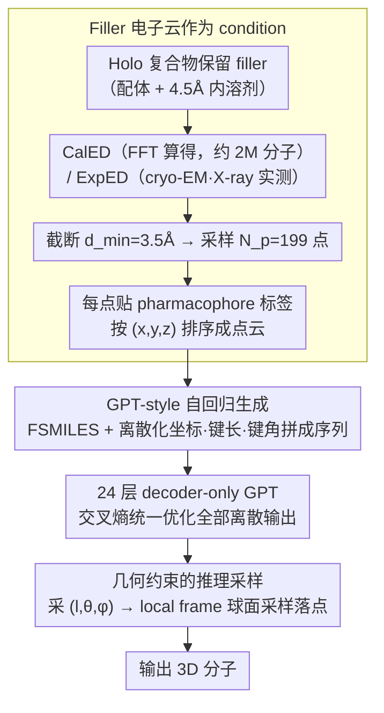

# From Holo Pockets to Electron Density: GPT-style Drug Design with Density

**会议**: ICML 2026  
**arXiv**: [2605.08767](https://arxiv.org/abs/2605.08767)  
**代码**: https://jiahaochen1.github.io/EDMolGPT_Page/ (有项目页)  
**领域**: 结构-based 药物设计 / 生成式分子建模  
**关键词**: structure-based drug design, electron density, autoregressive, FSMILES, GPT

## 一句话总结
本文把结构药物设计的 condition 从"刚性 empty pocket"换成"包含配体与溶剂的 filler 低分辨率电子云"，并提出第一个 decoder-only autoregressive 的 EDMolGPT，在 DUD-E 101 个靶点上 bioactive recovery 达 41%、远超先前 ED-based 方法。

## 研究背景与动机

**领域现状**：结构-based 药物设计（SBDD）主流流程是从 holo 蛋白-配体复合物出发，**移除** filler（已有配体 + 溶剂），把留下的 empty pocket 作为生成 condition。配套有 Pocket2Mol、TargetDiff、Lingo3DMol、MolCRAFT 等 autoregressive 或 diffusion 模型。

**现有痛点**：empty pocket 是单帧静态构象，会压抑蛋白的本征柔性、忽略配体诱导的构象适应；少数试过用 pocket 电子云的工作（ECloudGen、ED2Mol）在柔性区域电子云本身就弱、信号不稳定，反而引入更多噪声。

**核心矛盾**：药物设计需要 condition 既能反映"靶点真实结合环境"又能"用一个统一表示"喂给生成模型；rigid pocket 满足后者牺牲前者，pocket ensemble 满足前者牺牲后者。

**本文目标**：（1）找一种能编码 ensemble-averaged 构象信息又可统一表示的 condition；（2）配套一个能用好该 condition 的生成模型，支持大规模预训练与实验数据微调。

**切入角度**：filler（配体 + 4.5 Å 内溶剂）的电子云通常 well-defined（被实验直接验证），且天然编码"配体到底落在哪、周围哪些 H-bond 网络在工作"——比 pocket 的虚空更"实"。

**核心 idea**：用 filler 的低分辨率电子云点云作为 condition，用 decoder-only GPT-style autoregressive 模型预测 FSMILES + 离散化 3D 几何，做大规模 CalED 预训练 + ExpED 微调的统一 pipeline。

## 方法详解

### 整体框架
EDMolGPT 要解决的是"用什么 condition、用什么模型"两件事：condition 从被移除的 empty pocket 换成保留下来的 filler（配体 + 周围溶剂）电子云，模型则用一个 decoder-only GPT 把这团点云和分子序列接起来一路自回归吐出原子。两类电子云被统一成同一种格式——CalED 从原子坐标经 FFT 算得，喂约 2M 分子做大规模预训练；ExpED 从 cryo-EM / X-ray 实验数据直接读出，在 PDBbind 40k 复合物上微调。无论哪种来源，都先截断到分辨率 $d_{\min}=3.5\text{Å}$，再采样成固定 $N_p=199$ 点的点云，每点贴 pharmacophore 标签后按 $(x,y,z)$ 排序，与分子 token 拼成一条序列送进 GPT。

### 关键设计

**1. Filler 电子云作为 condition：把"拿走的信息"重新留住**

传统 SBDD 把 holo 复合物里的 filler 移掉、拿空 pocket 当 condition，等于丢掉了配体到底落在哪、周围哪些 H-bond 网络在工作的痕迹；本文反其道而行，直接拿 filler（ligand 加 4.5 Å 内 solvent）的低分辨率电子云做 condition。CalED 走结构因子 $F(h) = \sum_i f_i(h) e^{2\pi i h\cdot v_f^i}$ 再做截断逆 FFT $\rho(v_f) = V^{-1} \sum_{|h|\le 1/d_{\min}} F(h) e^{-2\pi i h\cdot v_f}$ 得到密度图，ExpED 则跳过 FFT 直接来自实验测量。拿到密度场 $\rho$ 后随机采 $N_p$ 个点，每点按最近原子赋一个 pharmacophore 类型 $c_p^i$（HBD / HBA / HBD-HBA / Other），得到带语义的点云 $\mathcal{P}_f = \{(c_p^i, v_p^i)\}$。这样做的好处是 filler 电子云是被实验直接验证过的"实"信号，天然编码 ensemble-averaged 的柔性结合环境；同时 CalED 数据量大、ExpED 真实带噪，两者统一成同一点云格式后，预训练与微调能无缝衔接。

**2. GPT-style 自回归生成：离散化几何让 decoder-only 直接吐原子**

为了避开 encoder-decoder 切两段丢上下文、diffusion 推理慢又要 SE(3) 等变的工程负担，本文用一个 GPT-2 medium 风格的 24 层 Transformer，一次性自回归预测原子类型、3D 坐标和成键几何。分子先写成 FSMILES（fragment-level SMILES，避免环内键被切碎），坐标做离散化 $\hat v_m^i = \lfloor (v_m^i - \mu_m)/\sigma \rfloor$，取 $\sigma=0.1$ 把 $\pm 15\text{Å}$ 映射到整数区间 $[-150,150]$；同时附上键长 $l_m^i = \|v_m^i - v_m^{i-1}\|$、键角 $\theta_m^i$、二面角 $\phi_m^i$ 的离散值。点云 token 与分子 token 共用同一套坐标 embedding，整条序列用交叉熵统一优化所有离散输出。这条路线足够简单、容易 scale，而且把几何也离散进序列后，推理时就能用 $(l,\theta,\phi)$ 反过来约束下一个原子的落点，提升稳定性。

**3. 几何约束的推理采样：用键长键角参数化球面而非直接采坐标**

如果推理时对 $v_m^i$ 的三个坐标分量各自独立做温度采样，自回归误差会沿链累积、长出扭曲的不合理构象。本文改成先采 $(l_m^i, \theta_m^i, \phi_m^i)$，再用前三步原子位置定义一个 local frame，把可行的 $v_m^i$ 约束在以 $l_m^i$ 为半径、由 $\theta, \phi$ 参数化的球面上采样。键长 / 键角 / 二面角本就是化学上更合理的自由度，在这个空间里采样既贴合真实分子几何，又大幅缩小了搜索范围、稳住了生成质量。

### 损失函数 / 训练策略
整条序列用交叉熵：$\mathcal{L} = -\frac{1}{N_m}\sum_t \log p((\hat a_m^t, \hat v_m^t, \hat l_m^t, \hat\theta_m^t, \hat\phi_m^t) \mid h_p^{1:N_p}, h_m^{1:t-1})$。AdamW lr $1\times 10^{-5}$，warmup 1000 step + cosine decay；batch 96，100 epoch；2× A40。推理温度 $T=0.7$。

## 实验关键数据

### 主实验（DUD-E 101 靶点，CalED）

| 方法 | Bio. Recov. ↑ | Min-in-place ↓ | Redocking ↓ | Min<Re ↑ |
|------|---------------|----------------|--------------|----------|
| Pocket2Mol | 8% | -6.7 | -7.5 | 17.9% |
| TargetDiff | 3% | -6.2 | -7.0 | 15.2% |
| Lingo3DMol | 33% | -6.8 | -7.8 | 12.0% |
| MolCRAFT | 17% | -6.1 | -6.9 | 20.1% |
| ED2Mol | 3% | -5.22 | -6.15 | 7.4% |
| ECloudGen† | 33% | — | -6.68 | — |
| **EDMolGPT** | **41%** | **-6.92** | -7.18 | **37%** |
| Reference（真实活性配体） | — | -7.93 | -7.93 | — |

### 消融实验（分辨率与温度）

| $d_{\min}$ | $T$ | Min-in-place | Recov. | Div ↓ |
|-----------|-----|---------------|--------|-------|
| 1.5 Å | 0.7 | -6.94 | 46% | 0.186 |
| 1.5 Å | 1.2 | -6.90 | 44% | 0.178 |
| 3.5 Å | 0.7 | -6.92 | 41% | 0.184 |
| 3.5 Å | 1.2 | -6.91 | 41% | 0.176 |

ExpED 子集（92 个有实验密度的靶点）：Min-in-place $-5.4$、recovery 20%、QED 0.50，可生成 rigid pocket 因 steric clash 拒掉但实验构象柔性允许的活性配体。

### 关键发现
- $N_p=199$ 点云比 $d_{\min}$ 对低分辨率表示的影响更大——保持 $N_p$ 即可使生成分子与参考配体的 ECFP 相似度 $< 0.2$，证明 condition 没有泄漏参考配体的 2D 结构。
- 与 ED2Mol 按分子量分桶对比：ED2Mol 在 $<180$ Da 时 QED 高（0.66）但实质上是"画小分子"作弊；EDMolGPT 在大分子范围维持 SAS $\approx 3.8$，更接近真实候选药物 weight 范围。
- ExpED 上 docking score 看似低，但生成的部分配体恰好覆盖到 rigid pocket 因 steric clash 被排除的"实验可行"化学空间——传统 SBDD 评测对柔性场景反而欠公。

## 亮点与洞察
- "拿掉 filler"与"保留 filler"两条路线对比鲜明，作者用一张 PDB 6KMP 的实验密度图直接论证了 filler 编码柔性的优势，可视化说服力强。
- Decoder-only GPT 路线 + 离散化几何 + 球面采样的组合，让 SBDD 走出 SE(3) 等变 / diffusion 的复杂工程，简单架构反而拿到 SOTA。
- CalED + ExpED 的"算 + 实测"双数据源策略，给后续工作提供一个清晰的"大规模 pretrain + 实验 fine-tune"模板，可迁移到 cryo-EM 任何分子任务。

## 局限与展望
- ExpED 受实验数据稀缺限制只有 92 个靶点，泛化范围受限；推理时需要 filler 已知（即原本就有 ligand 占位），对全新靶点仍要先 docking。
- QED 等 drug-like 指标只是中等，并未做生成后的 force-field 优化（与 ED2Mol 差距部分来自后处理而非建模）。
- decoder-only 没显式建模 SE(3) 等变性，依赖坐标 embedding 学到对称性，旋转鲁棒性未量化。
- 没在湿实验上做验证；41% recovery 是计算意义下的结构相似，不代表实际可成药。

## 相关工作与启发
- **vs Pocket2Mol / Lingo3DMol**：他们 condition 在 empty pocket 几何；本文 condition 在 filler ED，物理信息更丰富。
- **vs TargetDiff / MolCRAFT**：他们走 diffusion 路线；本文 decoder-only 简单且推理快。
- **vs ECloudGen / ED2Mol**：先前 ED-based 工作用 pocket ED 或 fragment-assembly；本文用 filler ED 且端到端原子级生成。
- **vs cryo-EM molecule fitting**：传统 fitting 是"已知分子 → 拟合密度"，本文是"已知密度 → 生成分子"，方向反转。

## 评分
- 新颖性: ⭐⭐⭐⭐ Filler ED 的 condition 切换 + decoder-only SBDD 都是首次。
- 实验充分度: ⭐⭐⭐⭐ 101 靶点 + 多维度指标 + ExpED 子集，但缺湿实验。
- 写作质量: ⭐⭐⭐⭐ Figure 1/2 把 motivation 讲得很直观，公式与算法清晰。
- 价值: ⭐⭐⭐⭐ 给 ED-guided drug design 立了新 baseline，工业界 cryo-EM 数据更多后潜力大。

<!-- RELATED:START -->

## 相关论文

- [\[NeurIPS 2025\] EDBench: Large-Scale Electron Density Data for Molecular Modeling](../../NeurIPS2025/computational_biology/edbench_large-scale_electron_density_data_for_molecular_modeling.md)
- [\[ICML 2026\] Stein Diffusion Guidance: Training-Free Posterior Correction for Sampling Beyond High-Density Regions](stein_diffusion_guidance_training-free_posterior_correction_for_sampling_beyond_.md)
- [\[ICML 2026\] EvoEGF-Mol: Evolving Exponential Geodesic Flow for Structure-based Drug Design](evoegf-mol_evolving_exponential_geodesic_flow_for_structure-based_drug_design.md)
- [\[ICML 2026\] Site4Drug: Predicting Drug-Binding Target Sites with an AI Agent](site4drug_predicting_drug-binding_target_sites_with_an_ai_agent.md)
- [\[ICML 2026\] Constrained Flow Optimization via Sequential Fine-Tuning for Molecular Design](constrained_flow_optimization_via_sequential_fine_tuning_for_molecular_design.md)

<!-- RELATED:END -->
