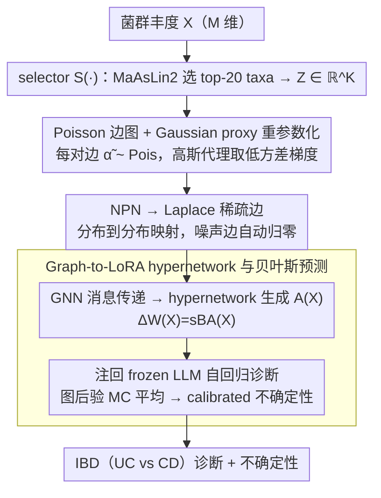

# iLoRA: Bayesian Low-Rank Adaptation with Latent Interaction Graphs for Microbiome Diagnosis

**会议**: ICML 2026  
**arXiv**: [2605.30179](https://arxiv.org/abs/2605.30179)  
**代码**: https://github.com/GoodGoodMaul/iLoRA (有)  
**领域**: 科学计算 / 微生物组诊断 / 参数高效微调 / 贝叶斯深度学习  
**关键词**: LoRA, 贝叶斯推断, 隐式交互图, 微生物组, IBD 诊断

## 一句话总结
iLoRA 用贝叶斯方法从每个微生物组样本里推断一张稀疏的菌群交互图（Poisson 边 → Laplace 稀疏化 → GNN 嵌入），再用这个图去生成 input-conditioned 的 LoRA 矩阵 $A$，让 LLM 在做 IBD 诊断的同时把"是哪些菌在 cross-talk"这件事和预测一起学出来。

## 研究背景与动机

**领域现状**：肠道微生物组诊断（尤其是 IBD：UC vs CD）的主流做法是把每个 taxon 当作独立特征丢进分类器，或者基于丰度表训练 LLM/树模型；与此同时另起炉灶用 SparCC / MaAsLin2 之类的工具事后做 co-occurrence 网络分析，用来解释模型。LLM 侧则用 LoRA 等 PEFT 方法把大模型适配到生物医学下游。

**现有痛点**：两条线是脱节的。第一，标准 LoRA 学的是一个**全局静态**的低秩更新 $\Delta W = sBA$，对所有样本共享，无法编码 input 内部的关系结构；第二，菌群交互网络一般作为 post-hoc 解释工具，和预测器训练完全分离，统计学上"预测特征"和"机制性交互"混在一起讲不清。第三，临床部署还要求 calibrated uncertainty，而单一点估计的 LoRA 没有这件事。

**核心矛盾**：IBD 的临床信号本质上是分布在协同变化的菌群和 cross-talk 模式里的，而不是单个 taxon 的边缘丰度差异——但当前的 LoRA + post-hoc network 范式既不能在适配阶段利用交互结构，也不能给出 principled 的不确定性。

**本文目标**：(i) 让 LoRA 适配信号本身依赖于 input-specific 的菌群交互结构；(ii) 在端到端的贝叶斯目标下联合学交互图和诊断；(iii) 通过 graph 后验做 calibrated 预测。

**切入角度**：作者把"sample → latent interaction graph → LoRA 更新"做成一个 hypernetwork——图不再是事后画的图，而是**直接生成适配器**的条件信号。这样图的好坏会被预测损失直接监督。

**核心 idea**：第一个 Bayesian graph-conditioned LoRA 框架，每个样本推一张 Poisson 边 + Laplace 稀疏化的隐图，用 GNN 嵌入再 hypernetwork 出 LoRA 的 $A$ 矩阵。

## 方法详解

### 整体框架
iLoRA 是个双分支 hypernetwork：预测分支把 $M$ 维菌群丰度 $X \in \mathbb{R}^M$ 编成 prompt 喂给 frozen LLM 做 next-token 诊断，iLoRA 分支则从同一个 $X$ 里推一张 $K \times K$ 的稀疏菌群交互图、再把这张图变成那个样本专属的 LoRA $A$ 矩阵注回预测分支。关键是图不再是事后画的解释图，而是直接生成适配器的条件信号——图经历"Poisson 边 → Laplace 稀疏化 → GNN 嵌入 → hypernetwork"四步，最后产出的 $\Delta W(X) = sBA(X)$ 让 LoRA 真正按 input 的关系结构办事，整张图的好坏被诊断损失直接监督。

### 关键设计

**1. Poisson 边图 + Gaussian proxy 重参数化：用计数分布编码 co-occurrence，又能拿低方差梯度**

菌群 co-occurrence 的语义是"两个 taxa 一起出现的非负事件强度"，Poisson 随机变量正好贴合这层含义，但难点在于直接对 $\mathrm{Pois}$ 做变分推断拿不到低方差的 reparameterization 梯度，离散采样不可导。iLoRA 的做法是先用 selector $S(\cdot)$（IBD 实验里是 MaAsLin2 选 top-20 species）把 $X$ 压到 $K$ 个关键 taxa $Z = S(X) \in \mathbb{R}^K$，对每对 $(i,j)$ 推一个 Poisson 边变量 $\tilde\alpha_{ij} \sim \mathrm{Pois}(m_{ij})$，变分后验取连续的高斯代理 $q_\varphi(\tilde\alpha_{ij}\mid Z) = \mathcal{N}(u_{ij}, \delta_{ij}^2)$，先验是 input-dependent 的 $\mathrm{Pois}(m_{ij}^{(0)})$（其中 $m_{ij}^{(0)} = \mathrm{Softplus}(f_{\phi_0}(e_{ij}))$，$e_{ij}$ 是 LLM 编码出的 node embedding 拼出的 edge feature）。这套之所以成立，靠的是论文证明的一条闭式 rate matching：当用 Gaussian proxy $\mathcal{N}(m,m)$ 去近似 $\mathrm{Pois}(m)$ 时，匹配 KL 的唯一正最小值是 $m_{ij} = \frac{2u_{ij}-1 + \sqrt{(2u_{ij}-1)^2 + 8\delta_{ij}^2}}{4}$——于是训练时走高斯重参数化 $\tilde\alpha_{ij} = u_{ij} + \delta_{ij}\epsilon_{ij}$ 拿梯度，KL 项又能用闭式的 Poisson-Poisson 散度 $m_{ij}^{(0)} - m_{ij} + m_{ij}\log(m_{ij}/m_{ij}^{(0)})$ 算，既保留了 Poisson 的"非负计数"解释，又做到端到端可微。

**2. NPN 把 Poisson 边变成 Laplace 稀疏边：让大部分边自动归零，只留少数 cross-talk**

上一步推出来的还是张稠密图，但真实菌群交互本质是稀疏的——绝大多数 taxa 对之间根本没有显著 cross-talk，全留着只会引入噪声边。iLoRA 借 Natural Parameter Network 的思路，对每条边走一个 sampling-free 的分布到分布映射 $(\mu_{ij}, b_{ij}) = \mathcal{T}_{\mathrm{npn}}(\tilde\alpha_{ij}, e_{ij})$，固定 $\mu_{ij}=0$、把 $b_{ij}$ 解释成 edge-specific 的稀疏尺度，得到 $\bar\alpha_{ij} \sim \mathrm{Laplace}(0, b_{ij})$；Laplace 那种"尖峰 + 重尾"的形状天然诱导稀疏，把噪声边压到几乎为 0、只放大关键交互。实现上利用 Laplace 的高斯尺度混合表示 $\bar\alpha_{ij} \mid \sigma_{ij}^2 \sim \mathcal{N}(0,\sigma_{ij}^2),\; \sigma_{ij} \sim \mathrm{Rayleigh}(b_{ij})$，让 NPN 全程在连续 natural parameter 空间里跑、避开任何离散 Poisson 采样，相当于一条 deterministic 的概率管道，把 Poisson 阶段积累的不确定性原样传过来；先验取 $\mathrm{Laplace}(0, b_0)$，KL 同样闭式 $\log(b_0/b_{ij}) + b_{ij}/b_0 - 1$。

**3. Graph-to-LoRA hypernetwork 与贝叶斯预测：把图变成 input-conditioned 适配器，顺手给出不确定性**

标准 LoRA 的 $A$ 是 input-agnostic 的全局参数，对所有样本共享，没法编码单个样本内部的关系结构。iLoRA 改成让稀疏交互图来生成 $A$：先用 GNN 在 $\hat A$ 上消息传递得到图表示，再用 hypernetwork 把它映射成 LoRA 的 $A \in \mathbb{R}^{r \times d_\text{in}}$（$B$ 在样本间静态共享），把 input-conditioned 的 $\Delta W(X) = s B A(X)$ 注回 frozen LLM，于是适配信号真正"看着这个样本的菌群结构"在调。因为 $A$ 来自图后验，推理时自然能在后验上做蒙特卡洛平均 $\hat p(y\mid X) = \frac{1}{S}\sum_s p_\theta(y\mid X, \bar A^{(s)})$（$\bar A^{(s)}$ 从 Laplace 后验采样），把图的随机性直接转成 calibrated 的 epistemic uncertainty——这正是临床部署需要、而单点估计 LoRA 给不了的。

### 损失函数 / 训练策略
端到端 ELBO：

$\mathcal{L} = \mathcal{L}_{\mathrm{pred}} + \lambda_{\mathrm{Pois}} \sum_{i<j} \mathrm{KL}(\mathrm{Pois}(m_{ij}) \| \mathrm{Pois}(m_{ij}^{(0)})) + \lambda_{\mathrm{Lap}} \sum_{i<j} \mathrm{KL}(\mathrm{Lap}(0, b_{ij}) \| \mathrm{Lap}(0, b_0))$

其中 $\mathcal{L}_{\mathrm{pred}}$ 是 token NLL（Molweni 走 span extraction 的 autoregressive 生成、IBD 走 next-token 二分类 "yes/no"）。LLM backbone 全程 frozen，只训 selector 之外的图分支 + LoRA。

## 实验关键数据

两个互补任务：Molweni（多方对话，验证结构恢复）+ IBD UC vs CD 诊断（验证临床效用）。

### 主实验

| 数据集 | 指标 | iLoRA | 最强 baseline | 说明 |
|--------|------|-------|---------------|------|
| Molweni (Span QA) | F1 / EM | **74.51 / 60.57** | MLE 72.83 / 57.78 | 同时超 MAP, BLOB, MCD, ENS |
| Molweni 图恢复 | Error Rate ↓ | **26.7%** | Random 50.0% | 推断邻接 vs 人工标注 |
| IBD | ECE ↓ | **0.0980** | BLOB 0.1570 | MLE 是 0.2533 |
| IBD | AUROC ↑ | **0.7990** | BLOB 0.7812 | LAP 0.7641, ENS 0.7574 |
| IBD | AUPRC ↑ | **0.7617** | BLOB 0.7577 | |
| IBD | F1 (UC) ↑ | **0.6557** | MAP/LAP 0.6496 | |
| IBD 图恢复 | Error Rate ↓ | **27.3%** | Random 50.0% | 高权边 vs 41 个 cohort-level significant taxon pairs |

vs 标准 tabular baselines（同样 20 个 taxa）：iLoRA AUROC 0.7990，远超 RF 0.6151 / XGBoost 0.5823 / MLP 0.5346——说明增益不来自特征选择，而来自 interaction-aware adaptation。

### 消融实验

| 配置 | ECE ↓ | F1 (UC) ↑ | AUROC ↑ | AUPRC ↑ | 说明 |
|------|-------|-----------|---------|---------|------|
| MLE (vanilla LoRA) | 0.2533 | 0.6071 | 0.7617 | 0.7570 | 无图条件参考 |
| iLoRA w/o Laplace | 0.1032 | 0.6341 | 0.7557 | 0.7440 | 只保留 Poisson 图分支 |
| iLoRA full | **0.0980** | **0.6557** | **0.7990** | **0.7617** | 加上 Laplace 稀疏化 |

### 关键发现
- **Poisson 阶段主要修 calibration**：单独加 Poisson 图就把 ECE 从 0.2533 砍到 0.1032（−59%），但 AUROC 几乎没动（0.7617 → 0.7557）——说明这一步主要是把贝叶斯不确定性注入进来。
- **Laplace 稀疏化主要修 discriminative**：在 Poisson 基础上加 Laplace 后，AUROC 从 0.7557 跳到 0.7990，AUPRC 0.7440 → 0.7617——稀疏化压掉了噪声边，让任务相关的交互结构突出。
- **图的语义可验证**：sample-level 高权边在 41 个 cohort-level significant taxon pairs 上 enrichment 显著（27.3% vs random 50%），并且能命中已知 IBD 生物学证据（E. coli 在 CD 富集、D. formicigenerans 在 CD 减少、V. coprocola 关联 fecal calprotectin、R. lactaris 保护性）——说明 graph 不只是 visualization 工具。
- **跨 cohort 鲁棒**：在 8 个独立队列里都 work，Franzosa_2019B AUROC 0.95、Lee_2021 AUROC 0.86。

## 亮点与洞察
- **"图 → 适配器"的设计思路很干净**：以前 hypernetwork-based PEFT 大多基于 task embedding 或 prompt，这里改成 latent graph，把"结构推断"和"适配器生成"绑成同一个端到端目标，结构质量直接被预测 loss 监督，从根上回避了 post-hoc graph 解释力存疑的问题。可以迁移到任何 multi-entity 输入（多组学、传感器网络、推荐系统 user-item 关系）。
- **Gaussian-proxy-for-Poisson 的闭式 rate matching 是个可复用 trick**：定理 5.1 给的 $m_{ij}$ 闭式解（$\frac{2u-1 + \sqrt{(2u-1)^2 + 8\delta^2}}{4}$）把"想要 Poisson 语义但又要 reparameterization 梯度"这个常见两难压成一个公式，任何在隐变量里需要计数分布的工作（topic model、点过程、event count）都能用。
- **NPN 当"分布管道"用**：用 sampling-free 的分布到分布映射避开 Poisson 离散采样、又保留 Laplace 稀疏先验，比常见的 Gumbel-Softmax 或 straight-through 更优雅，因为它在 natural parameter 空间里 closed-form 走完，没有 biased gradient。

## 局限与展望
- **作者承认的局限**：feature selection 还是依赖 MaAsLin2 的统计预筛（$K=20$），不是完全 learned；图规模随 $K^2$ 增长，没在大 $K$（比如全 3,061 个 species）上跑；推理时要 MC 平均，有 graph-branch overhead；只验证了二分类（UC vs CD），多病种和回归任务没测；图是 co-occurrence，不是因果，不能直接解释成机制。
- **自己发现的局限**：IBD test set 只有 152 个样本，cohort-level stratified split 虽然控制了分布偏移，但绝对样本数对 AUROC 这种 ranking metric 还是偏小，0.79 ↔ 0.78 的差距置信区间值得看；Laplace 先验固定 $\mu_{ij}=0$ 等于强制对称交互，正负向 cross-talk 的方向信息丢了；hypernetwork 只生成 $A$ 不生成 $B$，可能限制 input-conditioning 的表达力。
- **改进思路**：把 selector $S(\cdot)$ 也 jointly learn（比如 differentiable top-K）；图分支换成 sparse attention 之类 $O(K \log K)$ 的近似让 $K$ 上千；加 do-calculus / interventional 模块从 co-occurrence 走向 causal interaction；扩展到多组学（metagenome + metabolome + host transcriptome 多 partite graph）。

## 相关工作与启发
- **vs 标准 LoRA / QLoRA (Hu 2022, Dettmers 2023)**：他们学 input-agnostic 的全局 $\Delta W$，本文学 input-conditioned 的 $\Delta W(X) = sBA(X)$，区别是 $A$ 由 per-sample latent graph 生成；优势是显式利用关系结构、不再需要 post-hoc network 分析，代价是 graph 分支推理开销。
- **vs BLOB / Laplace LoRA (Wang 2024, Yang 2024)**：他们在 LoRA **参数空间**做贝叶斯（variational 或 post-hoc Laplace approx），本文在 **latent graph 空间**做贝叶斯，再把图通过 hypernetwork 变成适配器；好处是不确定性的来源是 interpretable 的结构而不是抽象参数后验，IBD 上 ECE 0.098 vs BLOB 0.157 / LAP 0.203 印证这条路 calibration 更好。
- **vs 微生物组 network inference (SparCC / SPIEC-EASI / MaAsLin2)**：他们独立产出 deterministic 网络再喂给下游分类器，本文把 network inference 和 diagnosis 用单一 ELBO 绑起来；优势是边的"重要性"由预测 loss 直接监督，sample-level 个性化、且自带不确定性。
- **vs Deep Ensemble (Lakshminarayanan 2017) for LoRA**：ENS 要训多个独立 adapter 再平均，本文用单个图后验做 MC 平均，参数和算力都更省，AUROC 0.7990 vs ENS 0.7574。

## 评分
- 新颖性: ⭐⭐⭐⭐⭐ "第一个 Bayesian graph-conditioned LoRA"成立，graph hypernetwork + 闭式 Poisson rate matching 的组合是新的。
- 实验充分度: ⭐⭐⭐⭐ 两个互补任务 + tabular baseline + 跨 cohort + 消融都做了；扣分在 $K$ 只到 20、test set 偏小。
- 写作质量: ⭐⭐⭐⭐ 动机一路推导清晰，定理和公式给得完整；NPN 那块对不熟悉的读者偏紧。
- 价值: ⭐⭐⭐⭐ 在 PEFT 和微生物组诊断的交叉点上提供了一条可扩展到 multi-omics 的范式，calibration 提升对临床落地很关键。

<!-- RELATED:START -->

## 相关论文

- [\[ICML 2026\] Learning the Interaction Prior for Protein-Protein Interaction Prediction: A Model-Agnostic Approach](learning_the_interaction_prior_for_protein-protein_interaction_prediction_a_mode.md)
- [\[ICML 2026\] Transformed Latent Variable Multi-Output Gaussian Processes](transformed_latent_variable_multi-output_gaussian_processes.md)
- [\[ICML 2026\] Scalable Single-Cell Gene Expression Generation with Latent Diffusion Models](scalable_single-cell_gene_expression_generation_with_latent_diffusion_models.md)
- [\[ICML 2026\] Cross-Chirality Generalization by Axial Vectors for Hetero-Chiral Protein-Peptide Interaction Design](cross-chirality_generalization_by_axial_vectors_for_hetero-chiral_protein-peptid.md)
- [\[AAAI 2026\] Distributional Priors Guided Diffusion for Generating 3D Molecules in Low Data Regimes](../../AAAI2026/computational_biology/distributional_priors_guided_diffusion_for_generating_3d_molecules_in_low_data_r.md)

<!-- RELATED:END -->
