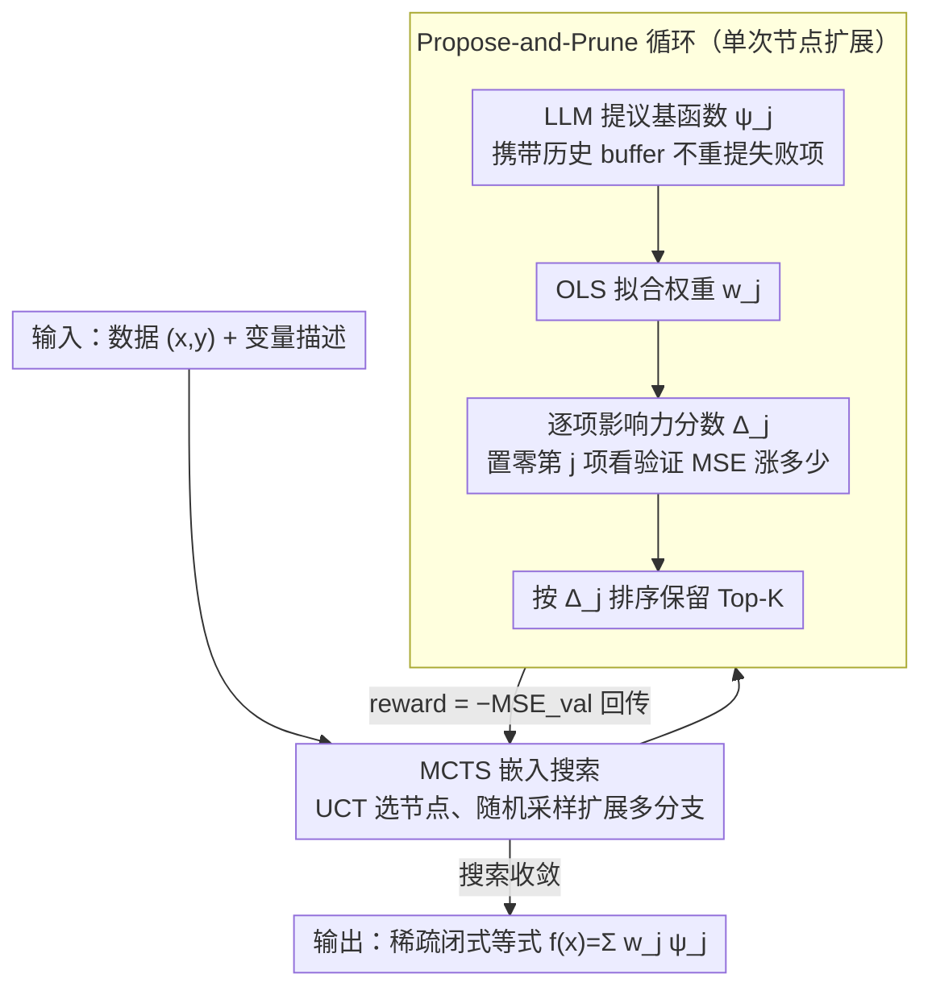

# Influence-Guided Symbolic Regression: Scientific Discovery via LLM-Driven Equation Search with Granular Feedback

**会议**: ICML 2026  
**arXiv**: [2605.29184](https://arxiv.org/abs/2605.29184)  
**代码**: https://github.com/DrShushen/IGSR (有)  
**领域**: 计算生物
**关键词**: 符号回归, 影响力分数, LLM 等式发现, MCTS, 可解释建模

## 一句话总结
IGSR 把符号回归拆成"LLM 提议基函数 ψ_j + 逐项影响力分数 Δ_j 剪枝"两步循环，并把这个循环嵌入 MCTS 来搜组合空间，在 6 个生物医学基准和 LLM-SRBench 上同时拿下最佳 MSE 与符号召回，还在湿实验里发现了 DNA 甲基化与 RNA Pol II 停顿的新关系。

## 研究背景与动机

**领域现状**：传统符号回归（GP-SR、PySR、SINDy）在预设算子库上做演化或稀疏回归，能输出闭式公式但很难处理 $d \gg 20$ 的高维输入；最近一批 LLM 驱动的等式发现方法（D3、ICSR、LLM-SR、LaSR）则用 LLM 的科学先验直接"想"出基函数，把符号回归推到了生物、流行病、药代等复杂场景。

**现有痛点**：所有 LLM-based 等式发现方法都用**全局标量信号**（一般是全局 MSE，或代码执行错误）作为反馈。这等于告诉 LLM "这个公式好/差"，但**不告诉它公式里哪一项在贡献、哪一项在拖后腿**。结果是搜索退化成试错，高度依赖 LLM 的生成先验而非数据本身。

**核心矛盾**：生成（creative proposal）和选择（rigorous pruning）被耦合在同一个标量损失里。LLM 同时承担"想新项"和"判断旧项该不该留"两件事，后者它根本判断不准，容易把统计上重要的项幻觉成无关而删掉。

**本文目标**：(1) 给 LLM 提供**逐项**的细粒度信用分配信号；(2) 让生成和选择**解耦**——LLM 只负责创造，选择交给统计量；(3) 在组合搜索空间里高效平衡探索和利用。

**切入角度**：作者把模型类锁死为关于基函数的**线性模型** $f(\mathbf{x}) = \sum_{j=1}^M w_j \psi_j(\mathbf{x})$，于是每个 $\psi_j$ 的边际贡献天然可量化——一旦定义"去掉这一项后验证 MSE 升了多少"就是 $\Delta_j$，一个直接、便宜、principled 的信号。

**核心 idea**：用**逐项影响力分数 $\Delta_j$ 替代全局 MSE**做反馈，把"propose-and-prune"循环嵌入 MCTS 来探索基函数组合空间。

## 方法详解

### 整体框架
IGSR 要发现的是稀疏闭式模型 $f(\mathbf{x}) = \sum_j w_j \psi_j(\mathbf{x})$：每个基函数 $\psi_j$ 由 LLM 提议、可以任意非线性，外层权重 $w_j$ 则交给 OLS 拟合。关键在于把"想新项"和"判该不该留"彻底拆开——LLM 只负责创造候选，留谁删谁由一个便宜的统计量决定，整套提议-剪枝的循环再放进 MCTS 里搜索基函数的组合空间。

### 关键设计

**1. 逐项影响力分数 $\Delta_j$：把"该不该留这一项"从猜变成测**

所有 LLM 等式发现方法的通病是只拿全局 MSE 当反馈，LLM 知道公式好坏却不知道哪一项在贡献、哪一项在拖后腿。IGSR 把模型类锁成基函数的线性叠加，正是为了让每一项的边际贡献可量化：在拟合好的线性模型上把第 $j$ 项权重置零（其余系数不动），看验证集 MSE 涨多少，就是这一项的影响力分数 $\Delta_j = \mathrm{MSE}_{\mathrm{val}}(\mathbf{w}_{-j}) - \mathrm{MSE}_{\mathrm{val}}(\mathbf{w})$。这本质是把经典的留一分析从"数据点维度"搬到了"结构维度"——传统影响函数问"删掉这个样本参数变多少"，$\Delta_j$ 问"删掉这一项误差涨多少"。计算只要一次 OLS 解加简单代数，几乎零开销，却给搜索提供了结构感知的细粒度信用分配；作者在附录 G.12 的压力测试里还验证了即便候选项之间共线性很强、或只有交互项（epistasis-like）信号，这个分数依然可靠。

**2. Propose-and-Prune 循环：让生成和选择解耦**

把创造和选择耦合在同一个标量损失里，LLM 就得一边想新项一边判旧项，而后者它判不准，容易把统计上重要的项幻觉成无关删掉。IGSR 的循环把这两件事切开：每轮 LLM 智能体读上下文（变量描述、当前活跃项、历史保留/丢弃记录及对应 MSE 影响）生成候选 $\psi_j$，新旧项拼成扩张集合后 OLS 拟合算出各项的 $\Delta_j$，再按分数排序保留 Top-$K$。默认走**确定性剪枝**——纯按 $\Delta_j$ 取舍，零幻觉、可复现、便宜；另有可选的 **Agentic 剪枝**（IGSR-Agent）让第二个 LLM 读 $(\psi_j, w_j, \Delta_j)$ 三元组，以 $\Delta_j \approx 0 \Rightarrow$ drop 为主启发式再叠加语义合理性判断。提议端的 prompt 始终携带历史 buffer，让 LLM 能 in-context 记住"上轮提的 $\log x_3$ 被 $\Delta=0.01$ 剪了"从而不再重提。实验里确定性版本反而最稳健，等于反过来说明：只要给了 $\Delta_j$，选择阶段根本不需要 LLM 插手。

**3. MCTS 嵌入搜索：在组合空间里平衡探索与利用**

单链式的迭代精化容易卡在某种函数形式偏置里出不来。IGSR 把整个 propose-and-prune 循环包进一棵 MCTS 树：每个节点是一个等式状态（一组 $\psi_j$ 加权重），从父节点经 LLM 随机采样能岔出多个后继——这支去探三角项、那支去探交互项、另一支去探指数衰减；节点 reward 取 $-\mathrm{MSE}_{\mathrm{val}}$，用 UCT $\bar r_i + c\sqrt{\ln N / n_i}$ 决定往哪扩展。默认是**启发式 MCTS**，只把新扩展节点的即时 reward 直接回传、不跑完整 rollout，把预算花在广度而非深度模拟上。消融显示这个搜索结构相比线性模式显著改善了收敛速度和最终精度。

### 损失函数 / 训练策略
IGSR 不做端到端训练，整个过程是一次搜索：每轮 OLS 拟合用训练集，$\Delta_j$ 与 MCTS reward 都在验证集上计算（附录 G.10 验证复用同一 validation split 不会引发搜索期过拟合）。稀疏度上限 $K$ 是主要超参。LLM 后端在六大基准上用 GPT-4o、在 LLM-SRBench 上用 GPT-4o-mini，后者统一 300k token 预算以保证公平对比。

## 实验关键数据

### 主实验
六大生物医学基准（Lung Cancer 三个变体、COVID-19、RNA Polymerase、Warfarin），25 seeds，GPT-4o：

| 数据集 | IGSR MSE | 最佳白盒基线 MSE | 备注 |
|--------|------|----------|------|
| Lung Cancer | 5.64e-5 | ICL 0.0557（差 3 个数量级） | 干净的肿瘤生长 ODE |
| LC + Chemo | 0.0013 | ICSR 0.688 | 加化疗的耦合 ODE |
| LC + Chemo+Radio | 0.0141 | LaSR 3.97 | 最难的耦合三药动力学 |
| COVID-19 | 5.01e-8 | ICL 9.35e-8 | 流行病模拟，IGSR 与黑盒 RNN 同档 |
| RNA Polymerase | 0.0111 | ICL 0.0119 | 263 维高维真实基因组数据 |
| Warfarin | 0.565 | ICSR 0.497 | 唯一一个 IGSR 不是最优（仍排第二） |
| 平均排名 | **1.17** | ICL 3.83 | IGSR 在白盒中 5/6 第一 |

LLM-SRBench（128 个发现导向问题，GPT-4o-mini，5 seeds）：IGSR 在 NMSE / Acc$_{0.1}$ / Term Recall / Symbolic Accuracy 上全部取得最佳平均排名，ID 和 OOD 测试集都领先；IGSR-Agent 次之。还击败了一组 AFE 基线（AutoFeat、OpenFE、SyMANTIC、CAAFE）在 5/6 数据集上。

### 消融实验
| 配置 | 现象 | 说明 |
|------|---------|------|
| Full IGSR (MCTS + Δ + history) | 全场最佳 | 完整模型 |
| Linear Iterative Refinement（去掉 MCTS） | 收敛慢、易陷局部最优 | 验证搜索结构必要性 |
| 无 $\Delta_j$ 反馈（退化为 ICL） | 排名从 1.17 掉到 3.83 | 影响力分数是核心增益来源 |
| 无历史 buffer | 反复提同样的失败项 | in-context 记忆机制必要 |
| IGSR-Agent vs IGSR | 略差 + 偶发幻觉删项 | 印证"选择不需要 LLM" |

### 关键发现
- **细粒度信号是关键**：把 IGSR 退化为只用全局 loss 的 ICL，性能立刻退到基线水平，说明 MCTS 不是主要因素，$\Delta_j$ 才是。
- **确定性剪枝胜过 LLM 剪枝**：IGSR-Agent 不是更聪明而是更不稳定，证实"生成-选择解耦"的正确切分点是"选择交给统计量"。
- **真湿实验验证**：在 RNA Pol II 停顿建模中，IGSR 不仅复现了已知机制，还提出了 DNA 甲基化与 Pol II 停顿的新关系假设，作者随后用细胞处理 + 测序在湿实验里**支持了这个假设**——这是符号回归方法第一次在 paper 里报告这种级别的科学发现验证。

## 亮点与洞察
- **把"留一分析"从数据维度搬到结构维度**：传统影响力函数（Cook & Weisberg）研究数据点对参数的影响，IGSR 把同一思想用到基函数上，几乎零成本就拿到了直接对应"该不该留这一项"的统计量。这种"换一个轴用经典工具"的思路在很多 LLM-for-X 场景里都可以套。
- **"生成-选择解耦"是 LLM 智能体设计的通用洞察**：用 LLM 做创造性提议没问题，但把选择/打分也交给 LLM 通常会引入幻觉。能用便宜的统计量替代的地方就替代，这是反 over-engineering 的。
- **湿实验闭环**：作者把符号回归从"基准跑分"推到了"真生物学发现"，这套 propose-and-prune + 影响力反馈的架构可以迁到其他需要"假设生成 + 实验验证"的科学领域，如药物作用机制、材料属性预测。

## 局限与展望
- 模型类被锁死为基函数的**线性叠加** $\sum w_j \psi_j$，无法捕捉深度嵌套或循环动力学（不过单个 $\psi_j$ 内部可以非线性，IGSR-TLO 变体允许优化项内参数）。
- 影响力分数本质是**条件留一**（保持其他系数不变），在强共线性候选下会低估分组贡献；作者用压力测试声称仍可靠，但极端情况下可能需要 group-wise 影响力。
- 高度依赖 LLM 的提议质量，对没有强科学先验的"纯数学"等式发现优势会缩小。
- $\Delta_j$ 在验证集上计算，validation split 大小和分布偏差会直接影响选择质量。
- 改进方向：把 $\Delta_j$ 升级为 group-wise 或 SHAP-like 的归因，让 IGSR 能处理强耦合项；把 MCTS reward 换成多目标（精度 + 简洁度 + 物理一致性），让搜索直接朝可解释方向走。

## 相关工作与启发
- **vs LLM-SR / D3 / LaSR**：都用 LLM 提等式但只给标量反馈，IGSR 的差异化在 $\Delta_j$ 这个**结构感知**反馈信号，让搜索从试错变成有方向的逐项修剪。
- **vs PySR / GP-SR / SINDy**：传统 SR 在预设算子库内演化，受限于人工特征工程；IGSR 让 LLM 直接从科学语义中"想出" $\psi_j$，是高维场景下的关键能力差异。
- **vs AFE（AutoFeat / OpenFE / CAAFE）**：AFE 生成增广特征矩阵喂给 GBDT 等下游黑盒，IGSR 直接产出一个可解释的稀疏线性等式，且用 $\Delta_j$ 而非全局 loss 做特征选择，原则上更稳健。
- **vs SHAP / LIME**：都做归因，但 SHAP/LIME 是事后解释黑盒预测，$\Delta_j$ 是**主动**驱动搜索的反馈，定位更直接、成本更低（一次 OLS 解就够）。

## 评分
- 新颖性: ⭐⭐⭐⭐ 影响力分数本身不新（来自 leave-one-out 影响函数），但首次系统地把它用作 LLM 等式发现的反馈信号，并验证了"生成-选择解耦"的设计原则。
- 实验充分度: ⭐⭐⭐⭐⭐ 六大基准 + LLM-SRBench 128 题 + AFE 对比 + 真实湿实验验证，覆盖广且有湿实验闭环。
- 写作质量: ⭐⭐⭐⭐ Table 1 一图概括差异化定位、Algorithm 2 清晰、附录覆盖共线性/数据泄漏等关键质疑，可复现性强。
- 价值: ⭐⭐⭐⭐⭐ 把 LLM 符号回归推到了"真发现新生物学关系"的高度，propose-and-prune + 细粒度反馈的设计模式对所有 LLM-agent 类工作都有参考价值。

<!-- RELATED:START -->

## 相关论文

- [\[ICML 2026\] TadA-Bench: A Million-Variant Benchmark for Future-Round Discovery Toward Agentic Protein Engineering](tada-bench_a_million-variant_benchmark_for_future-round_discovery_toward_agentic.md)
- [\[NeurIPS 2025\] Post Hoc Regression Refinement via Pairwise Rankings](../../NeurIPS2025/computational_biology/post_hoc_regression_refinement_via_pairwise_rankings.md)
- [\[ICML 2025\] Aligning Protein Conformation Ensemble Generation with Physical Feedback](../../ICML2025/computational_biology/aligning_protein_conformation_ensemble_generation_with_physical_feedback.md)
- [\[ICML 2026\] Learning Protein Structure-Function Relationships through Knowledge-guided Representation Decomposition](learning_protein_structure-function_relationships_through_knowledge-guided_repre.md)
- [\[NeurIPS 2025\] Benchmarking Agentic Systems in Automated Scientific Information Extraction with ChemX](../../NeurIPS2025/computational_biology/benchmarking_agentic_systems_in_automated_scientific_information_extraction_with.md)

<!-- RELATED:END -->
