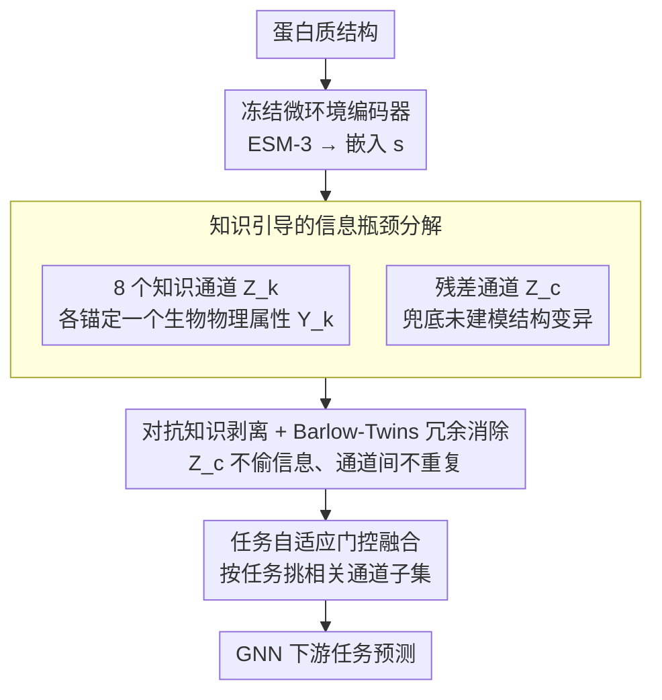

# Learning Protein Structure-Function Relationships through Knowledge-guided Representation Decomposition

**会议**: ICML 2026  
**arXiv**: [2605.23960](https://arxiv.org/abs/2605.23960)  
**代码**: https://github.com/AI-HPC-Research-Team/ProtDiS (有)  
**领域**: 科学计算 / 蛋白质表示学习 / 解耦表示  
**关键词**: 蛋白质结构-功能、知识引导解耦、信息瓶颈、ESM-3、冗余消除

## 一句话总结
ProtDiS 把预训练蛋白质微环境嵌入（如 ESM-3）通过信息瓶颈+冗余消除的方式拆解成 8 个生物物理可解释的"知识通道"和 1 个残差通道，让结构表示在十二个下游任务（尤其是结构相似但功能不同的情形）上一致提升。

## 研究背景与动机

**领域现状**：当前蛋白质结构表示主要靠 GearNet、ESM-3、Foldseek 这类预训练的微环境编码器，把 3D 几何、物理化学、拓扑信息压进一个高维隐空间，然后接 GNN 做下游任务（酶分类、配体结合位点、PPI 等）。

**现有痛点**：这些隐空间高度纠缠——几何信号、理化信号、拓扑信号挤在同一组维度里，导致两个后果：(1) 不可解释，无法把模型决策追溯到具体的生物物理量；(2) 在结构相似但功能不同的蛋白对上崩塌——TM-score 一高，cosine 相似度直接拉满，无法区分功能。

**核心矛盾**：蛋白质功能并不依赖完整高维结构嵌入，而是依赖少数语义明确的局部微环境属性（二级结构、堆积密度、灵活性、曲率等）。但纯结构相似性会主导预训练目标，把这些细粒度信号埋掉。

**本文目标**：把纠缠的结构嵌入 $\mathbf{s}$ 拆成 $K$ 个知识专属通道 $Z_k$（每个对齐一个预定义生物物理属性 $Y_k$）+ 1 个残差通道 $Z_c$（兜底未建模的结构变异），同时满足：每个 $Z_k$ 只编码自己的 $Y_k$、不同 $Z_k$ 间冗余低、所有通道合起来能完整重建 $\mathbf{s}$。

**切入角度**：作者不强行追求统计独立（生物物理属性本身相关，例如疏水性和暴露度），而是采用 Barlow Twins 式的"冗余消除"思路——只惩罚通道间的二阶线性相关，允许非线性生物关系保留。

**核心 idea**：用知识监督把信息瓶颈"显式锚定"到生物物理变量上，再用对抗 + 重建 + 冗余消除保证残差通道不偷信息、知识通道之间不重复、整体不丢信息。

## 方法详解

### 整体框架
ProtDiS 要解决的是预训练蛋白质结构嵌入「几何/理化/拓扑信号全挤在一组维度里、纠缠又不可解释」的问题。它把这件事转成一个有监督的信息瓶颈分解任务：拿一个冻结的微环境编码器（默认 ESM-3 Structural Tokenizer）输出的嵌入 $\mathbf{s} \in \mathbb{R}^d$ 作为输入，用 $K=8$ 个独立编码器把它拆成 8 个「知识通道」——每个通道锚定一个可计算的生物物理属性（堆积密度、局部复杂度、曲率、形状、暴露度、灵活性、稳定性、疏水性）——外加 1 个残差通道 $Z_c$ 兜底未建模的结构变异。训练时每个知识通道挂监督头去拟合自己的标签、残差通道挂重建头和对抗判别器，下游用时再按任务挑相关通道经门控融合送进 GNN。

### 关键设计

**1. 知识引导的信息瓶颈分解：把「最小充分统计」显式锚到生物物理量上**

痛点在于无监督 disentanglement 找的是抽象潜在因子，可解释性只能靠事后归因。ProtDiS 反过来让每个通道 $Z_k$ 直接对齐一个白盒标签 $Y_k$（DSSP 算二级结构、Kyte-Doolittle 算疏水性，这些标签计算完全免费），目标是让 $Z_k$ 成为 $\mathbf{s}$ 关于 $Y_k$ 的最小充分统计，理论形式即 $\min_{Z_k} I(Z_k;\mathbf{s}) - \beta_k I(Z_k;Y_k)$。

由于互信息不可直接优化，作者用三个 surrogate 把它落地：监督损失 $\mathcal{L}_{\mathrm{kn}}^{(k)} = \mathbb{E}[\ell(h_k(Z_k), y_k)]$ 作为 $I(Z_k;Y_k)$ 的变分下界来「选对信息」；批级 KL 正则 $\mathcal{L}_{\mathrm{KL}} = \sum_k \mathrm{KL}(q(Z_k) \| \mathcal{N}(0, I))$ 作为 $I(Z_k;\mathbf{s})$ 的上界来「压掉冗余」——注意这里用的是聚合后验对标准高斯，而不是传统 VIB 的逐样本变分瓶颈，省掉重参数化采样噪声、训练更稳；残差通道的 $\ell_1$ 重建损失 $\mathcal{L}_{\mathrm{rec}} = \|\hat{\mathbf{s}} - \mathbf{s}\|_1$ 则保证 $(Z_1,\ldots,Z_K,Z_c)$ 联合起来仍能完整重建 $\mathbf{s}$、不丢信息。三件事——选对信息、压冗余、保完整——就被统一进同一个瓶颈框架。

**2. 对抗知识剥离 + Barlow-Twins 式冗余消除：让残差不偷信息、通道间不重复**

光有监督分解还不够，残差通道可能偷偷把已建模的知识再学一遍，知识通道之间也可能彼此重复。残差侧的对策是梯度反转的对抗损失 $\mathcal{L}_{\mathrm{adv}} = \sum_k \mathbb{E}[\ell(d_k(\mathcal{R}_\lambda(Z_c)), y_k)]$，它当作 $I(Z_c; Y_k)$ 的上界来 minimize——判别器 $d_k$ 努力从 $Z_c$ 预测 $y_k$，梯度反转层 $\mathcal{R}_\lambda$ 又逼 $Z_c$ 学不到这些知识，最后 $Z_c$ 只剩「知识没覆盖到」的那部分结构变异。

通道间的去冗余没有走 FactorVAE / $\beta$-TCVAE 的强统计独立路线，因为作者明确指出生物物理属性本身就相关（疏水性和暴露度强相关），硬要独立反而损害表示能力。于是改用 Barlow Twins 思路只惩罚二阶线性冗余：方差正则 $\mathcal{L}_{\mathrm{var}} = \sum_k \mathbb{E}_d[(\mathrm{std}(Z_k^{(d)}) - 1)^2]$ 把每维标准差顶到 1 防止塌缩，交叉相关阵的 Frobenius 范数 $\mathcal{L}_{\mathrm{cov}} = \frac{1}{|\mathcal{P}|}\sum_{(i,j)} \|C_{ij}\|_F^2$（其中 $C_{ij} = \frac{1}{N}\tilde{Z}_i^\top \tilde{Z}_j$）压掉跨通道的线性相关。这样既去掉了冗余，又保留了通道间真实存在的非线性生物关系。

**3. 任务自适应的门控融合：让模型显式选「哪些生物物理量决定哪个功能」**

不是每个下游任务都需要全部 8 个通道，硬把高维特征全叠进去在小样本多类任务（如 SCOP-cf）上反而过拟合。ProtDiS 基于特征级重要性分析为每个任务挑出最相关的通道子集——例如酶类预测 EC 只选 residual + 二级结构 + 局部堆积 + contact entropy 四个——再经一个门控网络融合后送 GNN。这一步既压住了过拟合，又顺带把「模型用了哪些生物物理维度做这个功能预测」摆到明面上，让通道本身成了天然的可解释接口。

### 损失函数 / 训练策略
总损失把上述各项加权汇总：$\mathcal{L}_{\mathrm{total}} = \mathcal{L}_{\mathrm{sup}} + \lambda_{\mathrm{KL}}\mathcal{L}_{\mathrm{KL}} + \lambda_{\mathrm{red}}(\lambda_{\mathrm{var}}\mathcal{L}_{\mathrm{var}} + \lambda_{\mathrm{cov}}\mathcal{L}_{\mathrm{cov}}) + \lambda_{\mathrm{rec}}\mathcal{L}_{\mathrm{rec}} + \lambda_{\mathrm{adv}}\mathcal{L}_{\mathrm{adv}}$。预训练数据从 PDB + AlphaFoldDB 采样 10 万个高质量结构。下游评估时冻结表示，只训融合层和 GNN 头，从而纯粹度量表示质量本身。

## 实验关键数据

### 主实验
12 个下游任务横评 ESM-3 ST vs ProtDiS，分别在 random / structure-based split 下评估。重点关注结构 split（更严苛）。

| 任务 (struct split) | 指标 | ESM-3 ST | ProtDiS | 提升 |
|---------------------|------|----------|---------|------|
| 酶类预测 EC | acc | 78.7 | 83.5 | +6.05% |
| 配体亲和力 Lig. Aff. | spr | 35.1 | 36.6 | +4.45%（相对） |
| SCOP-family | acc | 75.0 | 78.0 | +3.91% |
| PPIs | auroc | 82.1 | 84.6 | +3.0 |
| MF (功能) | fmax | 61.1 | 61.2 | +0.1 |
| 配体结合位点 Lig. BS. | mcc | 61.7 | 62.3 | +0.6 |

在 random split 下提升较小（如 EC 88.2 → 89.0），符合作者预期——random split 训练-测试结构相似，纠缠表示已经够用；structure split 才暴露原 ESM-3 的崩塌问题。

### 消融与分析实验

| 分析维度 | 关键指标 | 说明 |
|----------|---------|------|
| 知识特异性（MI 热图）| 对角占优 | 每个 $Z_k$ 对自己的 $Y_k$ MI 高、对其他低；$Z_c$ 对所有 $Y_k$ 都低 → 知识成功剥离 |
| 通道独立性（DCC）| 跨通道相关性低 | 不同 $Z_k$ 间 DCC 接近 0，但每个 $Z_k$ 与 $\mathbf{s}$ 仍保留中等相关性 |
| 完整性（渐进重建）| 重建 loss 单调下降 | 按任意顺序逐个加入 $Z_k$，重建 loss 单调降，说明各通道信息互补 |
| 高 TM-score 同源酶对（功能区分）| AUC | ESM-3 在 TM-score 最高 bin 上 0.868，ProtDiS 0.946 |
| Cosine vs TM-score | 离散度 | 在 TM-score > 0.5 的负样本对上，ESM-3 cosine 随 TM-score 拉满（表示崩塌），ProtDiS 保持低 cosine |

### 关键发现
- **结构 split 提升远大于 random split**：random split 上 EC 仅 +0.8，structure split 上 +6.05。说明 ProtDiS 真正学到了超越全局结构相似性的功能相关信号，而不是靠 fit 训练分布。
- **同源高相似度蛋白对**才是 ProtDiS 的杀手锏场景：在 TM-score > 0.9 的负样本对上，纯结构嵌入相似度饱和到 ~1，知识嵌入却保持区分度，AUC 提升 ~8 个点。这是论文最有说服力的证据。
- **任务自适应通道选择带来的副作用**：在 SCOP-cf 这种小样本多类任务上，强行把所有通道塞进去反而过拟合；这也说明 8 个生物物理维度并非每个任务都需要。
- **残差通道的存在很关键**：作者强调如果没有 $Z_c$ 兜底，硬把所有信息塞进 8 个知识通道会"lossy or degenerate"，重建损失保证了这点。

## 亮点与洞察
- **把信息瓶颈和蛋白质生物物理量显式绑定**是一个干净的形式化：传统 disentanglement 找的是无监督潜在因子，可解释性靠事后归因；这里直接把 $Y_k$ 设为 DSSP / KD scale 这种白盒生物物理量，让"解耦"和"可解释"在训练时就绑定，省掉事后探针。
- **拒绝强独立约束、改用 Barlow Twins 冗余消除**是个务实的妙手：蛋白质属性本身相关，强独立反而损害表示能力，作者用"只去线性冗余"换"保留非线性生物关系"，这个 trade-off 设计很有迁移价值——任何"特征本身有相关性但希望区分语义"的场景（如医学影像不同病灶共存）都可借鉴。
- **批级 KL 而非逐样本 KL 作为信息瓶颈**：传统 VIB 用逐样本变分高斯，这里用聚合后验对标准正态，作者明确说更稳定。这是个工程小 trick，但实操中能省掉重参数化采样的噪声，值得复用到其他 IB 应用。
- **"用同源高相似度蛋白对当难例"**这个评估协议比传统 random split 更能暴露表示崩塌问题，应该成为蛋白质表示学习的标配评估。

## 局限与展望
- **强依赖结构数据**：方法吃 ESM-3 微环境嵌入，对没有实验结构或 AlphaFold 高置信预测的蛋白（早期发现、孤儿蛋白）不可用，作者承认这点。
- **8 个知识维度是手工选的**：靠 DSSP / KD scale 这种现成工具能算的属性才能当 $Y_k$，新的生物物理维度需要找到可计算的标签，扩展性受限。
- **任务-通道选择是离线挑的**：基于特征重要性分析手动挑，没做端到端学习，换新任务要重跑分析。
- **没和最近的 sparse autoencoder 路线（Adams 2025, Simon & Zou 2025）做正面对比**：那条线也在做 PLM 的可解释分解，作者只在 related works 里比较思路，没给数值。
- **改进方向**：(i) 把 ProtDiS 思想下沉到序列空间，让纯序列输入也能估出局部结构知识；(ii) 用于知识引导蛋白设计——分别调节疏水性、堆积密度等通道做可控生成。

## 相关工作与启发
- **vs FactorVAE / $\beta$-TCVAE**: 它们追求严格统计独立，依赖无监督潜在因子；ProtDiS 用监督锚定 + 冗余消除（不强独立），更符合生物现实。
- **vs DisenIB / IMB**: 同样在 IB 框架下做有监督解耦，但 ProtDiS 把监督信号设为多个独立生物物理量 + 残差通道兜底，结构更对称、可分析性更强。
- **vs SAE 路线（Adams 2025, Simon & Zou 2025）**: 那条线做的是 PLM 输出的事后稀疏分解（post hoc），只在序列嵌入上工作；ProtDiS 是训练时显式约束 + 结构嵌入，且有信息论上的完整性保证。
- **vs Pantolini et al. 2025（"rewriting protein alphabets"）**: 用对比学习 + 深度聚类把 PLM 输出分解成结构 codeword，但无信息论约束；ProtDiS 提供了更系统的目标函数族。

## 评分
- 新颖性: ⭐⭐⭐⭐ 信息瓶颈+知识监督+Barlow Twins 三者组合做蛋白质表示是新的，但每个零件都不算原创。
- 实验充分度: ⭐⭐⭐⭐ 12 个下游任务 + 特异性/独立性/完整性三类分析 + 高 TM-score 难例评估，证据链完整；缺 SAE 路线的正面对比。
- 写作质量: ⭐⭐⭐⭐ 动机和方法链路清晰，IB 理论和实际 surrogate 之间的桥接讲得明白；图 4 的 TM-score 分桶分析很有说服力。
- 价值: ⭐⭐⭐⭐ 在 structure-based split 上 +3~6 个点是真实可用的提升，且解耦表示能直接用于可控蛋白设计，工程落地路径清晰。

<!-- RELATED:START -->

## 相关论文

- [\[AAAI 2026\] S2Drug: Bridging Protein Sequence and 3D Structure in Contrastive Representation Learning for Virtual Screening](../../AAAI2026/computational_biology/s2drug_bridging_protein_sequence_and_3d_structure_in_contrastive_representation_.md)
- [\[ICML 2026\] Protein Autoregressive Modeling via Multiscale Structure Generation](protein_autoregressive_modeling_via_multiscale_structure_generation.md)
- [\[ICML 2026\] Learning the Interaction Prior for Protein-Protein Interaction Prediction: A Model-Agnostic Approach](learning_the_interaction_prior_for_protein-protein_interaction_prediction_a_mode.md)
- [\[ICML 2026\] SIGMA: Structure-Invariant Generative Molecular Alignment for Chemical Language Models via Autoregressive Contrastive Learning](sigma_structure-invariant_generative_molecular_alignment_for_chemical_language_m.md)
- [\[ICML 2026\] CARD: Coarse-to-fine Autoregressive Modeling with Radix-based Decomposition for Transferable Free Energy Estimation](card_coarse-to-fine_autoregressive_modeling_with_radix-based_decomposition_for_t.md)

<!-- RELATED:END -->
