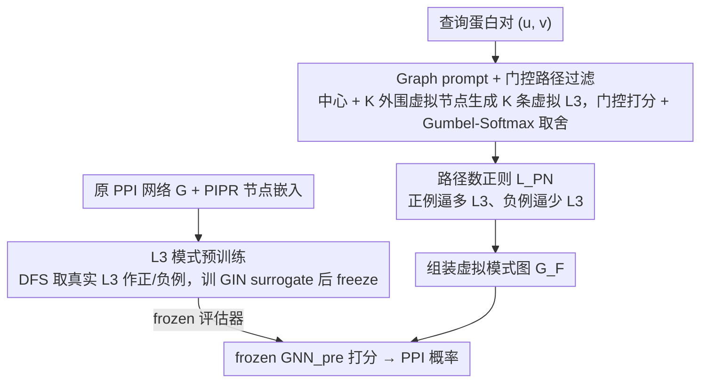

# Learning the Interaction Prior for Protein-Protein Interaction Prediction: A Model-Agnostic Approach

**会议**: ICML 2026  
**arXiv**: [2605.09964](https://arxiv.org/abs/2605.09964)  
**代码**: 未提及  
**领域**: 蛋白质相互作用预测 / 图提示学习 / 生物先验  
**关键词**: PPI 预测, L3 规则, graph prompt learning, 互补性先验, 即插即用分类头

## 一句话总结
L3-PPI 把生物学里的 "L3 规则"（蛋白质对之间的 length-3 路径越多越可能相互作用）变成可学习的 graph prompt：用预训练 GNN 识别 L3 模式，再用门控网络生成虚拟 L3 路径并按 PPI 标签正则路径数量，做成一个即插即用的分类头，把任意 PPI 表征模型平均涨 2-4 个点。

## 研究背景与动机
**领域现状**：深度学习 PPI 预测最近被 CNN / RNN / GNN / 蛋白语言模型推到很高水平，但所有努力都集中在"学更强的蛋白表征"——RCNN、GearNet、ESM2 等。

**现有痛点**：(1) 分类头几乎都是从链路预测 (link prediction) 抄来的"concat / Hadamard / sum"通用聚合，**完全没有蛋白质交互特有的归纳偏置**——比如界面几何互补、化学兼容这些核心机制完全没被显式建模。(2) 直接把"L3 路径数"当 handcrafted feature 也不行，因为严格 data split（DFS / BFS）下测试集蛋白对常常和主 PPI 网络断开，#L3 paths 几乎全为 0。

**核心矛盾**：互补性先验抽象、难量化，又无法直接拿网络拓扑特征替代；现有分类头丢掉了大量"哪种生物图案对应交互"的先验信号。

**本文目标**：(1) 实证验证 L3 规则在主流 PPI 数据上是否稳健；(2) 设计一个不依赖蛋白对在原 PPI 网络中是否连通、又能注入 L3 先验的分类头。

**切入角度**：既然测试对在原图里没有 L3 路径，那就**让模型自己生成虚拟 L3 模式图**——把分类问题从"蛋白对二分类"重构为"模式图级二分类"，并通过路径数量正则把"正例多 L3 / 负例少 L3"这一先验注入到 gating 网络的输出概率。

**核心 idea**：用 graph prompt learning 生成可控 L3 路径数的模式图，再让预训练的 L3 模式识别 GNN 当 frozen 评估器，把生物先验显式编码进 PPI 分类头。

## 方法详解

### 整体框架
L3-PPI 想解决的核心难题是：现有 PPI 分类头都是从链路预测照搬的通用聚合，没有任何交互特有的先验，而想直接拿"#L3 路径数"当特征又会因为严格 split 下测试对在原图里断连而失效。它的破局思路是把蛋白对二分类**重构成模式图级别的二分类**——既然测试对在原图里没有 L3 路径，就让模型自己生成虚拟 L3 路径，再用一个预训练好的 frozen GNN 当评估器去判断这些虚拟模式像不像真实交互。整套东西做成挂在任意 PPI 表征模型（PIPR / SemiGNN-PPI / DPPI / DNN-PPI / S2F 等）后面的 plug-and-play 分类头，原模型保持 frozen。

### 关键设计

**1. L3 模式预训练：先训一把"什么样的 L3 像真交互"的固定标尺**

下游要靠虚拟 L3 路径打分，就得先有个知道真实 L3 长什么样的评估器，否则生成的 prompt 分布会和真实 L3 分布脱节。作者从原 PPI 网络 $G=(V,E)$ 出发，用 PIPR 拿节点 embedding，把所有交互对 $(u,v)\in E$ 之间 DFS 找到的 L3 路径作为正例 $\mathcal{D}_{\text{pre}}^+$、非交互对 $(u,v)\notin E$ 的对应 L3 路径作为负例，构成一个图级二分类数据集。在上面预训一个 GIN backbone + readout + MLP head 的模型，学 $\tilde y_{\text{pre}} = \text{GNN}_{\text{pre}}(\mathcal{G}_{\text{pre}}; \theta, \phi) \approx y_{\text{pre}}$，用 BCE 优化。训完就 freeze——这样下游 prompt 一旦被调到接近 surrogate 高分，就真的意味着它长得像交互模式，而不是迎合一个会被一起带跑的评估器。

**2. Graph prompt + 门控路径过滤：为每对查询蛋白生成可控数量的虚拟 L3**

预训好的 surrogate 需要被喂进"针对当前蛋白对、数量可控"的 L3 模式图，门控就是干这件事的。prompt 结构固定为 1 个中心虚拟节点 $v_0^P$ 加 $K$ 个外围虚拟节点 $\{v_1^P,\ldots,v_K^P\}$，每个外围节点带一份可学习 embedding $x_i^P \in \mathbb{R}^d$ 且全 query 共享（这样既能 query-specific 又不至于参数爆炸）；中心节点连向 $v$、外围节点连向 $u$，于是自然形成 $K$ 条独立的 L3 路径 $\{path_k\}$。门控网络对每条路径打一个激活概率 $p_i = \text{GNN}_{\text{gpt}}(path_i)$，再用 Gumbel-Softmax 重参数化让"留还是丢"这个离散决策可微：

$$g(path_i) = \text{Sigmoid}\Big(\frac{\log p_i + \epsilon - \log(1-p_i) - \epsilon'}{\tau}\Big)$$

推理时按阈值 0.5 二值化，被丢弃路径的边权置 0、留下的边权赋为 $g(path_i)$，组装成最终模式图 $\mathcal{G}_F$ 输入 frozen $\text{GNN}_{\text{pre}}$ 出概率。整个过程把 PPI 二分类对齐到了预训练的模式图任务空间，绕开了原图断连的问题。

**3. 路径数正则 $\mathcal{L}_{PN}$：把"正例多 L3、负例少 L3"硬约束进门控**

这是核心创新。光有门控还不够——必须把 L3 规则的定性陈述"#L3 越多越像交互"显式注入，模型才会学着给正例多开路径、给负例少开路径。作者按 PPI 标签对激活路径数 $\sum_i p_i$ 施加方向相反的 hinge 约束：正例 $y_{gpt}=1$ 时 $\mathcal{L}_{PN} = \max(0,\, K(1 - 1/\gamma) - \sum_i p_i)$，逼激活路径数 $\geq K(1-1/\gamma)$；负例 $y_{gpt}=0$ 时 $\mathcal{L}_{PN} = \max(0,\, \sum_i p_i - K/\gamma)$，逼激活路径数 $\leq K/\gamma$。超参 $\gamma$ 控制正负例期望路径数之间的间距。用 hinge 而非硬等式是为了软约束——只在越界时惩罚，避免门控退化成全开或全关。

### 损失函数 / 训练策略
总损失 $\mathcal{L} = \mathcal{L}_{BCE} + \mathcal{L}_{PN}$。两阶段训练：阶段一只用 $\mathcal{L}_{BCE}$ 更新虚拟节点 embedding $X^P$，阶段二联合优化 $X^P$ 与门控网络参数（加入 $\mathcal{L}_{PN}$）。Gumbel 温度 $\tau$ 训练中退火。base predictor 全程 frozen，保证 plug-and-play 性质。

## 实验关键数据

### 主实验（Interaction Type Prediction，F1）

| Method | SHS27k Random | SHS27k DFS | SHS27k BFS | SHS148k Random | STRING DFS | Avg Gain |
|---|---|---|---|---|---|---|
| DPPI | 70.45 | 43.69 | 43.87 | 76.10 | 63.41 | — |
| DPPI + L3-PPI | 75.62 | 46.79 | 47.46 | 79.37 | 66.93 | **+3.05** |
| SemiGNN-PPI | 85.57 | 69.25 | 67.94 | 91.40 | 84.85 | — |
| SemiGNN-PPI + L3-PPI | 83.21 | **77.49** | **71.92** | **91.69** | 84.66 | **+2.26** |
| DNN-PPI | 75.18 | 48.90 | 51.59 | 85.44 | 61.34 | — |
| DNN-PPI + L3-PPI | 79.39 | 52.96 | 51.97 | 89.03 | 65.39 | **+3.27** |
| S2F | 73.71 | 44.68 | 46.32 | 80.67 | 55.07 | — |
| S2F + L3-PPI | 75.60 | 46.60 | 49.03 | 84.35 | — | **(+正)** |

跨 4 个不同 backbone 一致正向迁移，平均 +2-3.3 个点；提升最大的是 DFS / BFS 严格 split 上（与"测试集断连"问题最严重的场景一致）。

### 消融实验

| 配置 | 影响 |
|---|---|
| 完整 L3-PPI | 最佳 |
| w/o $\mathcal{L}_{PN}$（去掉路径数正则） | 退化到接近 base predictor + 一个 prompt 头 |
| w/o gating（所有路径全开） | 性能下降，所有蛋白对长相一致丢失 query-specific 信息 |
| w/o L3 模式预训练（surrogate 不训直接随机初始化） | 显著下降，验证 pre-training & prompt tuning 必须 task-aligned |
| 路径数 $K$ 变化 | 钟形曲线，$K$ 太小路径多样性不够、太大 prompt 噪声 |

### 关键发现
- 在 DFS / BFS 这种"测试集与训练集低连通"的严格设置上提升最大；这正是 #L3 paths 作为 handcrafted feature 失效的场景，证明 prompt-as-graph 的虚拟 L3 真的弥补了原图缺失的连通信息。
- 实证显示 #L5 paths、#L7 paths 也强相关（因为它们是 L3 的延伸），但 #L4 / #L6 弱相关——支持 L3 规则的几何互补解释（concave-convex 对要凑齐对数）。
- 一致的 plug-in 收益证明 PPI 长期被忽视的 "classification head" 才是性能瓶颈之一。

## 亮点与洞察
- 把"已知的、可解释的生物规则"翻译成可学习的 graph prompt 是一个范式样本——以后可以照此把 "domain rules → prompt regularizer" 套到药物-靶点、抗原-抗体、酶-底物等场景。
- 路径数硬约束 $\mathcal{L}_{PN}$ 形式很简单但效果稳定；这种"用 hinge 把规则注入门控概率"的小 trick 可迁移到其它需要稀疏路径选择的场景。
- 预训 surrogate + frozen 用于 prompt 评估是 GPL 中的"任务对齐"经典做法，本工作把它具化到生物规则上。

## 局限与展望
- 只覆盖 L3 规则；其它生物先验（如 motif 模式、序列保守性、3D 结构互补）尚未注入，可扩展为多规则混合 prompt。
- 虚拟节点 embedding 全 query 共享，可能在大规模异质 PPI 网络上不够细致；可尝试 query-conditioned prompts。
- 实验集中在 SHS27k / SHS148k / STRING / Yeast；对于跨物种、新型病原体等 OOD 场景未评估。
- $\gamma$ 是全局超参，不同样本难度可能需要自适应路径数目标。

## 相关工作与启发
- **vs handcrafted #L3 paths feature**：他们直接拼到输入特征，遇到 split 断连就失效；本文用虚拟节点生成 L3，绕过断连。
- **vs All-in-one（sun2023all）等通用 GPL**：他们的 prompt 是非可解释的隐式 pattern；本文 prompt 严格按 L3 拓扑构造，可解释性强。
- **vs SemiGNN-PPI 等专门表征模型**：他们改 backbone 学更强表征，本文改 head 注入先验，二者正交可叠加。

## 评分
- 新颖性: ⭐⭐⭐⭐ "把生物规则做成可学 prompt"的具体实现是新颖的；GPL 框架本身不算新
- 实验充分度: ⭐⭐⭐⭐ 跨 4 个 backbone × 3 个数据集 × 3 种 split 一致涨点，覆盖很全
- 写作质量: ⭐⭐⭐⭐ L3 规则的实证支撑图清晰、动机一气呵成
- 价值: ⭐⭐⭐⭐ 为 PPI 分类头方向开了一条 "domain prior injection" 的路；plug-and-play 易复用

<!-- RELATED:START -->

## 相关论文

- [\[ICML 2026\] Cross-Chirality Generalization by Axial Vectors for Hetero-Chiral Protein-Peptide Interaction Design](cross-chirality_generalization_by_axial_vectors_for_hetero-chiral_protein-peptid.md)
- [\[ICML 2026\] iLoRA: Bayesian Low-Rank Adaptation with Latent Interaction Graphs for Microbiome Diagnosis](ilora_bayesian_low-rank_adaptation_with_latent_interaction_graphs_for_microbiome.md)
- [\[NeurIPS 2025\] GFlowNets for Learning Better Drug-Drug Interaction Representations](../../NeurIPS2025/computational_biology/gflownets_for_learning_better_drug-drug_interaction_representations.md)
- [\[ICML 2026\] Protein Language Model Embeddings Improve Generalization of Implicit Transfer Operators](protein_language_model_embeddings_improve_generalization_of_implicit_transfer_op.md)
- [\[ICML 2026\] Learning Protein Structure-Function Relationships through Knowledge-guided Representation Decomposition](learning_protein_structure-function_relationships_through_knowledge-guided_repre.md)

<!-- RELATED:END -->
