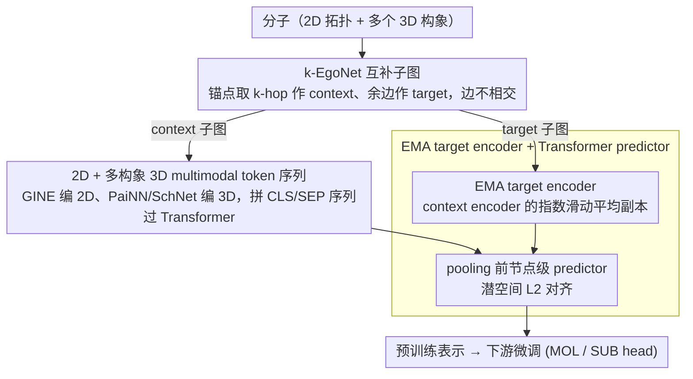

# Learning the Neighborhood: Contrast-Free Multimodal Self-Supervised Molecular Graph Pretraining

**会议**: ICML 2026  
**arXiv**: [2509.22468](https://arxiv.org/abs/2509.22468)  
**代码**: https://github.com/ariguiba/C-FREE  
**领域**: 分子表征 / 自监督预训练 / 图神经网络  
**关键词**: 多模态分子图、Ego-Net、JEPA、对比无关、3D 构象

## 一句话总结
C-FREE 把分子拆成固定半径的 k-EgoNet 子图，2D 拓扑 + 多个 3D 构象走 GINE + PaiNN + Transformer 编码后用 JEPA 风格的潜空间预测做预训练，全程无负样本、无增广、无位置编码，仅用 0.33M 分子（GEOM）就在 MoleculeNet 8 个任务上超越了用 19M–77M 分子训练的 UniMol / MolFM 等多模态基线。

## 研究背景与动机
**领域现状**：分子表征学习的自监督方法大致分三派——对比式（GraphCL / GraphMVP / 3D InfoMax）、生成式（AttrMask / GROVER / MoleBlend）和潜空间预测式（BGRL / LaGraph / GraphJEPA），近年又开始引入 3D 构象做多模态融合（UniMol、GEM、MolFM）。

**现有痛点**：对比式离不开"什么算正/负样本"的人工设计，分子里手性异构体结构几乎相同但性质迥异，用增广造正例本就尴尬；生成式要在离散图空间重建节点/边/属性，自回归还得编一个本不存在的节点顺序；GraphJEPA 把 JEPA 搬到图上但要先跑 METIS 聚类、加双曲位置编码、做层次目标，工程链条又长又重。

**核心矛盾**：分子的"邻域结构"才是性质的真正载体，而现有 SSL 框架把太多算力花在"如何造视图"上，反而稀释了对邻域本身的建模；同时主流方法只用 2D 或只用 3D，忽略两者互补。

**本文目标**：(i) 不要负样本和复杂增广；(ii) 把 2D 拓扑 + 多个 3D 构象统一进同一个预测目标；(iii) 在 0.33M 量级的 GEOM 上就能跑得比 UniMol（19M 分子）还好。

**切入角度**：把分子也当成"图像 patch"——固定半径的 k-EgoNet 就是分子里的 patch，让 context patch 在潜空间预测互补的 target patch，搬 I-JEPA 的范式到图上，但抛掉一切"非必要的复杂"。

**核心 idea**：用"k-EgoNet 子图 + 其互补子图"作为 context-target 对，在潜空间做 L2 预测，target encoder 走 EMA，2D/3D 模态拼成一个 multimodal token 序列过 Transformer，全程没有负样本、没有位置编码、没有图重建。

## 方法详解

### 整体框架
C-FREE 想解决的是"分子 SSL 把太多算力花在造视图上、又只用 2D 或只用 3D"这两个痛点。它的做法是把分子当成图像 patch 来处理：从一个锚点原子出发取 k-hop 邻域作为 context 子图、剩下的边作为互补的 target 子图，让 context 在潜空间预测 target 的表示，从而不需要任何负样本或增广。每个原子带 2D 拓扑（图 $G=(V,E)$）和多个 3D 构象坐标 $r_v \in \mathbb{R}^3$，分别用 GINE 和 PaiNN/SchNet 编码后拼成一条 multimodal token 序列过 Transformer，最后用一个 EMA target encoder 配非对称 predictor 做 L2 对齐。context 和 target 的角色在训练中交替以避免方向偏置，同一分子也会采多个锚点造多对子图来扩充预训练信号。

### 关键设计

**1. k-EgoNet 互补子图：把"造视图"换成一遍 BFS**

JEPA 在图像上靠固定大小的 patch 配对，但图没有天然的 patch，GraphJEPA 为此引入 METIS 聚类这类重工程。C-FREE 改用 k-EgoNet：从节点 $v$ 出发取 k-hop 诱导子图作为 context，剩下的边构成 target，并约定边界边硬性划归一侧、边界节点双方共享，确保两个子图**边不相交**但联合覆盖全图。分子大小差异极大但局部化学环境是有限的，固定半径让每个子图"吃下大致相当的局部信息"，而互补构造让 context 与 target 在结构上天然配对，省掉了"什么算正例"的人工定义。一个分子采 $n$ 个锚点就得到 $n$ 组互补对，相当于一个无监督的"分子内 mini-batch"；整个划分是 $O(|V|)$ 一遍 BFS，相比 METIS 聚类几乎零开销。

**2. 2D + 多构象 3D 拼成 multimodal token 序列：拓扑与几何同台**

分子性质常常依赖多种高概率构象的加权而不是单一构象（Cao et al. 2022），所以 3D 既不能不用、也不能只塞一个。C-FREE 用 GINE 给出每个原子的 2D 嵌入 $\{\mathbf{h}^{2D}_v\}$（多层平均），用 PaiNN/SchNet 对每个构象 $c$ 给出 3D 嵌入 $\{\mathbf{h}^{3D}_{v,c}\}$，再拼成 BERT 风格的序列 $\mathbf{H}=[\mathbf{h}_{CLS}, \mathbf{h}_{SEP}, \{\mathbf{h}^{2D}_v\}, \mathbf{h}_{SEP}, \{\mathbf{h}^{3D}_{v,c}\}, \mathbf{h}_{SEP}]$，加可学习的模态嵌入区分 2D/3D，让 self-attention 在模态内和模态间同时聚合，最终取 $\mathbf{h}_{CLS}^{out}$ 作为子图的单一表示。值得注意的是全程不加位置编码——GINE 和 PaiNN 各自的归纳偏置已经把拓扑和空间信息编进 token，再叠 PE 反而会破坏 3D 编码器的等变性。

**3. EMA target encoder + Transformer predictor：无负样本下防坍缩**

潜空间预测最大的风险是表征坍缩成常量。C-FREE 沿用 BYOL/I-JEPA 的经验组合：target encoder $f_{\bar{\theta}}$ 是 context encoder 的指数滑动平均 $\bar{\theta}^{(t)} = \tau \bar{\theta}^{(t-1)} + (1-\tau)\theta^{(t)}$，$\tau_0=0.995$ 线性升到 $\tau_T=1$；预测损失为潜空间 L2，$\frac{1}{M}\sum_i \sum_j \|\hat{\mathbf{s}}_{y_j} - \mathbf{s}_{y_j}\|^2$。关键在于 predictor 是节点级的 Transformer + MLP，**在 pooling 之前**就开始预测，从而保留更多结构信息。消融显示 EMA 单独并不够——去掉 predictor 后 SSL loss 直接掉到 0（完全坍缩），MLP predictor 能救场，而 Transformer predictor 在 Kraken 上 MAE 最低，说明节点级先预测再 pooling 比 graph 级直接预测更利于学到细粒度结构。

### 损失函数 / 训练策略
预训练损失即上面的潜空间 L2。微调阶段提供两个 head：C-FREE$_{\text{MOL}}$ 用整图嵌入接线性层，C-FREE$_{\text{SUB}}$ 取多个子图嵌入再用 DeepSets 聚合。理论上 C-FREE$_{\text{SUB}}$ + DeepSets 等价于 ESAN，因此**严格强于 1-WL**（论文 Lemma 1）。预训练在 GEOM 的 330K 分子上进行，2D-only backbone 4M 参数、多模态 backbone 9.1M 参数；微调时若构象缺失就用 RDKit 现生成 3 个补上。

## 实验关键数据

### 主实验

**MoleculeNet 8 任务，frozen backbone + 线性探测，ROC-AUC ↑**

| 设置 | 类别 | 代表方法 | Avg |
|------|------|---------|-----|
| 2D 对比 | CL | GraphCL | 65.04 |
| 2D 非对比 | Non-CL | ContextPred | 60.36 |
| **本文 2D-MOL** | Non-CL | C-FREE$_{\text{2D-MOL}}$ | **66.63** |
| **本文 2D-SUB** | Non-CL | C-FREE$_{\text{2D-SUB}}$ | **67.27** |
| **本文 MM-MOL** | Multi | C-FREE$_{\text{MM-MOL}}$ | **71.07** |
| **本文 MM-SUB** | Multi | C-FREE$_{\text{MM-SUB}}$ | 70.92 |

MM-MOL 在 8 个任务中拿下 6 个 first/second；即便只用 2D 也已经超过所有 2D 基线平均值。

**MoleculeNet 全微调（与 19M+ 分子预训练的多模态大模型对比）**

| 方法 | 预训练规模 | MoleculeNet Avg ROC-AUC ↑ |
|------|-----------|--------------------------|
| MoleBlend | PCQM4Mv2 (3M) | 76.16 |
| GEM | ZINC-20M | 78.11 |
| UniMol | 19M 分子 / 209M 构象 | 78.56 |
| **C-FREE$_{\text{PaiNN-3C}}$** | **GEOM 0.33M** | **79.81** |

用 1/60 的预训练数据反超 UniMol 1 个点，并在 BBBP、Tox21、ToxCast、HIV 上取得最佳。

### 消融实验

**(a) 模态消融（Kraken, MAE ↓，FFT = fine-tune from pretrain，RND = 随机初始化）**

| 模态 | 初始化 | B5 | L | BurB5 | BurL |
|------|--------|-----|----|-------|------|
| 2D | RND | 0.297 | 0.396 | 0.205 | 0.152 |
| 2D | FFT | 0.276 | 0.340 | 0.176 | 0.146 |
| 3D | FFT | 0.194 | 0.329 | 0.134 | 0.131 |
| **MM** | **FFT** | **0.193** | **0.306** | **0.134** | **0.126** |

**(b) Predictor / EMA / k 消融总结**

| 配置 | 关键指标 | 说明 |
|------|---------|------|
| 完整模型（Transformer predictor + EMA τ₀=0.995 + k∈{3,4}） | Kraken MAE 最低 | baseline |
| w/o predictor | SSL loss → 0，下游 MAE 最差 | 完全坍缩，证明 EMA 单独不够 |
| MLP predictor | 介于二者之间 | predictor 容量也重要 |
| τ₀=1.0（无 EMA 衰减） | Kraken Avg 0.502，劣于 RND (0.496) | 不衰减 = 无 momentum teacher，学不到东西 |
| τ₀=0.5（更激进） | Kraken Avg 0.428（最佳） | 论文选 0.995 是出于稳定性折中 |
| k=1（仅一跳邻域） | 与 RND 持平 | 太局部，结构信号不足 |
| k=5 | 最佳 | context 和 target 大小相当时表征最丰富 |

**(c) Drugs-75K 标签效率（1% 标签下 IP/EA/χ 的 MAE ↓）**

| 数据量 | RND | FFT | 相对提升 |
|--------|------|------|---------|
| 1% IP | 0.638 | **0.608** | -4.7% |
| 1% EA | 0.613 | **0.583** | -4.9% |
| 1% χ | 0.334 | **0.317** | -5.1% |
| 100% IP | 0.419 | 0.419 | 持平 |

低标签场景预训练优势明显，全量数据下打平——验证 SSL 的核心价值在 label-efficient 区。

### 关键发现
- **3D 比 2D 重要**：模态消融显示 3D-only 几乎追上多模态，2D-only 显著落后；分子性质本质是几何敏感的，几何信息一进来就把表征拉满。
- **predictor 是防坍缩的真正功臣**：去掉后 loss 直接归零，BYOL 系列里"EMA + asymmetric predictor"是缺一不可的组合，并非单 EMA 就够。
- **小数据 + 强归纳偏置可以打败 60× 大数据**：0.33M GEOM 训出来的 C-FREE 超过 19M UniMol，说明"构象多样性 + 子图预测"比"单纯堆数据"的样本效率更高。
- **k 选择有最优解**：k=1 等同于随机初始化（局部信息太弱），k=5 最佳（context/target 规模匹配让预测任务难度最适中），印证 JEPA"目标既不能太琐碎也不能太抽象"的设计哲学。
- **SUB head 只在 2D 场景必要**：3D 信息已经够丰富时 DeepSets 聚合的增益几乎被吃掉，但收敛更快，说明对齐预训练-微调几何形式仍有训练效率收益。

## 亮点与洞察
- **JEPA-on-graph 的"最小可用"实现**：与 GraphJEPA 相比砍掉了 METIS 聚类、双曲位置编码、层次目标三大组件，证明这些"为图特地加的复杂结构"对 JEPA 并不是必需的，是一个很好的"减法式研究"案例。
- **构象作为天然数据增广**：传统 contrastive 要人工造正例对手性异构无能为力，而 C-FREE 直接把"同一分子的多个构象"喂进 3D encoder，让构象多样性变成预训练信号的一部分而不是噪声——这个思路可以反过来启发蛋白质/材料 SSL。
- **多模态 Token 化的统一格式**：`[CLS][SEP] 2D [SEP] 3D-conf1 ... 3D-confN [SEP]` 这种序列结构非常像 BERT-NSP，几乎是即插即用的模板，把任意数量的几何视图塞进同一个 Transformer 而不需要改架构。
- **理论 + 实验联动**：Lemma 1 给出"C-FREE$_{\text{SUB}}$ 等价 ESAN，严格强于 1-WL"的形式化保证，再用 EXP 数据集做经验验证，这种"理论上界 + 经验下界"双侧夹击的论证风格值得学习。

## 局限与展望
- **构象生成是潜在瓶颈**：SIDER 上表现不佳的直接原因是大分子构象生成失败用了 dummy 坐标，说明方法对 RDKit / GEOM 提供构象的质量有依赖；未来可以接更强的 diffusion-based 构象生成器（如 Torsional Diffusion）。
- **预训练数据规模未充分扩展**：作者只在 0.33M GEOM 上证明 sample efficiency，但没有在 3M+ PCQM4Mv2 或 20M+ ZINC 上跑 scaling law，无法回答"如果给同等数据能不能再涨一截"。
- **缺乏 SMILES / 文本模态**：作者主动放弃 1D 表示（理由在 A.4），但近年 MolT5 / ChemBERTa 证明文本模态对低数据场景特别有用，引入文本可能进一步提升。
- **EgoNet 半径需手工选**：虽然 ablation 显示 k=5 最佳，但作者保守用 k∈{3,4}，未来可以让 k 自适应于分子大小或者做 multi-scale ego-net 拼接。
- **理论部分主要是承接性的**：Lemma 1 本质上是 ESAN 表达力的复用，C-FREE 自己引入的"预测目标"对表达力的影响没有形式化分析。

## 相关工作与启发
- **vs GraphJEPA (Skenderi 2025)**：同样把 JEPA 搬到图，但 GraphJEPA 走 METIS 聚类 + 双曲位置编码 + 层次目标三件套，C-FREE 全砍掉只保留"互补 EgoNet + EMA + predictor"；ZINC 上 C-FREE 超过 GraphJEPA，证明"复杂≠必要"。
- **vs UniMol / GEM / MoleBlend（多模态生成式）**：他们要 mask 重建或做跨模态对齐损失，C-FREE 只做潜空间 L2 预测；用 1/60 数据反超 UniMol，说明在分子里"预测式 ≥ 生成式"。
- **vs GraphMVP / 3D InfoMax（2D-3D 对比对齐）**：他们靠对比损失对齐 2D/3D 视图，但负样本采样在分子里很微妙（手性异构）；C-FREE 直接把多构象拼进序列由 Transformer 自己学跨模态依赖，回避了"什么算负"的问题。
- **vs ESAN / Bevilacqua 2022**：ESAN 是监督学习里"图分子图作子图"的代表，C-FREE 把它的子图分解思想扩展到自监督，并通过 DeepSets head 在微调阶段复现 ESAN 的表达力上界——本质是"ESAN 的 SSL 化"。
- **vs I-JEPA / BYOL（视觉 JEPA）**：直接借了 EMA + predictor + 潜空间 L2 三件套，但把"图像 patch"换成"k-EgoNet"，把"位置编码"丢掉（GNN 编码器已经包含拓扑），是把 JEPA 范式做最小化迁移的一个范本。

## 评分
- 新颖性: ⭐⭐⭐⭐ 把 JEPA 搬到分子图本身不算首创（GraphJEPA 已经做了），但"砍掉一切非必要复杂"+ 多构象统一 token 化是清晰的工程贡献。
- 实验充分度: ⭐⭐⭐⭐⭐ MoleculeNet（frozen + FFT）+ QM9 + Kraken + ZINC + Drugs-75K + 模态/predictor/EMA/k 四向消融 + 理论 lemma，覆盖度非常完整。
- 写作质量: ⭐⭐⭐⭐ 动机链条清晰，方法图（Figure 1）一图说清，但有些段落（如 fine-tuning head 的两种变体）需要反复读才能区分 MOL 和 SUB。
- 价值: ⭐⭐⭐⭐⭐ 用 0.33M 数据反超 19M 的 UniMol，对分子 SSL 社区"是否必须堆数据"的迷思是一记有力反驳，预训练 backbone 直接可用。

<!-- RELATED:START -->

## 相关论文

- [\[ICML 2025\] scSSL-Bench: Benchmarking Self-Supervised Learning for Single-Cell Data](../../ICML2025/computational_biology/scssl-bench_benchmarking_self-supervised_learning_for_single-cell_data.md)
- [\[ICML 2026\] SIGMA: Structure-Invariant Generative Molecular Alignment for Chemical Language Models via Autoregressive Contrastive Learning](sigma_structure-invariant_generative_molecular_alignment_for_chemical_language_m.md)
- [\[ICML 2026\] CARD: Coarse-to-fine Autoregressive Modeling with Radix-based Decomposition for Transferable Free Energy Estimation](card_coarse-to-fine_autoregressive_modeling_with_radix-based_decomposition_for_t.md)
- [\[ICML 2026\] Stein Diffusion Guidance: Training-Free Posterior Correction for Sampling Beyond High-Density Regions](stein_diffusion_guidance_training-free_posterior_correction_for_sampling_beyond_.md)
- [\[ICML 2026\] Protein Fold Classification at Scale: Benchmarking and Pretraining](protein_fold_classification_at_scale_benchmarking_and_pretraining.md)

<!-- RELATED:END -->
