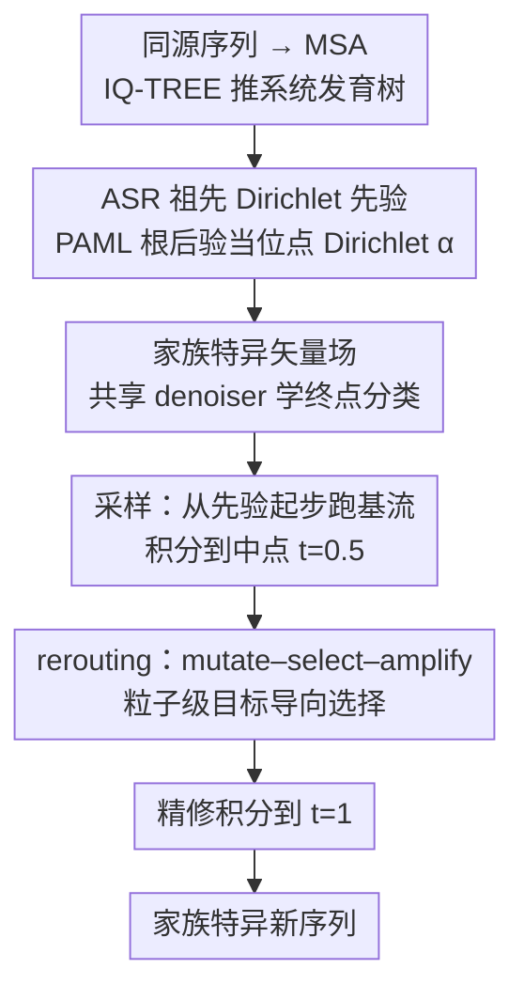

# LineageFlow: Flow Matching for High-Fidelity Family-Aware Protein Sequence Generation

**会议**: ICML 2026  
**arXiv**: [2605.22252](https://arxiv.org/abs/2605.22252)  
**代码**: https://github.com/Jinx-byebye/LineageFlow (有)  
**领域**: 蛋白质生成 / 流匹配 / 系统发育先验  
**关键词**: 流匹配、Dirichlet 先验、祖先序列重建、蛋白家族、定向进化

## 一句话总结
把通用的均匀/掩码噪声先验换成由祖先序列重建（ASR）得到的家族特异 Dirichlet 先验，让 Dirichlet flow matching 从"已经进化好的脚手架"出发去做结构化突变，再在中间时刻插入一次 mutate–select–amplify 的 rerouting，从而在 Pfam 8886 个家族上把家族识别准确率推到接近自然序列（95.3% vs 96.6%）、同时保持高新颖度和折叠置信度。

## 研究背景与动机

**领域现状**：蛋白序列生成主流分两派——一是 ESM / ProtT5 / ProGen 等大规模蛋白语言模型，二是把离散扩散/流匹配搬到氨基酸单纯形上的 EvoDiff、DFM、ProtBFN。当目标是"生成某个 Pfam 家族的新序列"时，常规做法是给去噪器塞一个家族标签或者一条 MSA prompt 当条件。

**现有痛点**：所有这些离散生成模型几乎都默认用"通用先验"——要么从单纯形上的均匀分布起步，要么全部 mask 掉。但蛋白家族的本质是**位点特异**的进化约束：某些位点高度保守以维持结构和催化，另一些位点高度可变以承担功能多样性。通用先验把这层结构全部抹平，去噪器被迫从近乎随机的状态把每一个保守残基"从零合成"，越早期的时间步压力越大。论文实验里这一矛盾很触目：DFM 和 EvoDiff 即使显式喂入家族标签，profile-HMM 的家族识别准确率仍是 **0%**，pLDDT 只有 45 左右。MSA prompt 派的 PoET 也只拿到 0% 准确率。

**核心矛盾**：先验里没有进化结构 ↔ 家族信息只是个标签或 prompt，根本进不到生成轨迹里。条件信号"在外面喊"，但去噪器内部还是在做 from-scratch 合成。

**本文目标**：把家族条件**烧进先验本身**，让 t=0 就已经站在家族流形上，模型只需学"祖先 → 现存序列"的突变过程，而不是"噪声 → 蛋白质"的合成过程。

**切入角度**：分子进化里有现成工具——给一族同源序列建 MSA、用 IQ-TREE 推系统发育树、用 PAML 在根节点做祖先序列重建（ASR），可以得到一个**位点维**的氨基酸后验。这个后验在保守位点接近 one-hot、在可变位点保持高熵，正好就是想要的"家族脚手架"。

**核心 idea**：用 ASR 根后验作为家族特异的 Dirichlet 先验 $q_0^{(h)}$ 起步，沿单纯形跑流匹配走到现存序列；再加一个直接抄定向进化的 mutate–select–amplify 中间步骤做目标导向采样。

## 方法详解

### 整体框架
LineageFlow 要解决的是"给定 Pfam 家族、生成既像这个家族又足够新颖的蛋白序列"，而它的关键转换是把流匹配的生成时间轴 $t \in [0, 1]$ 直接当成"从家族祖先到现存叶节点"的进化时间轴：起点不再是通用噪声，而是用祖先序列重建（ASR）算出来的家族脚手架，终点是现存序列，denoiser 学的是"祖先怎么突变成现存"而不是"噪声怎么合成蛋白"。预处理阶段对每个家族建 MSA、用 IQ-TREE 推系统发育树、用 PAML 在根节点做 ASR；训练阶段所有家族共享一个 denoiser，从家族特异的 Dirichlet 路径里抽中间态学终点分类；采样时先跑基流到中点 $t_{\mathrm{int}}=0.5$，在那里插一次粒子级的 mutate–select–amplify 做目标导向选择，再精修积分到终点。

### 关键设计

**1. ASR 祖先 Dirichlet 先验：把家族进化约束烧进起点**

通用离散流匹配（如 DFM）都从单纯形上的均匀 Dirichlet $\mathrm{Dir}(\mathbf{1})$ 起步，先验里没有任何进化信息，去噪器被迫把每个保守残基"从零合成"，越早期压力越大。LineageFlow 的做法是给每个家族 $h$ 的每个位点 $l$ 维护一组 Dirichlet 浓度参数 $\boldsymbol{\alpha}^{(h,l)} \in \mathbb{R}^K_{>0}$（$K=20$），直接编码 ASR 根节点的氨基酸后验——保守位点的浓度接近 one-hot、可变位点保持高熵。整条序列的家族先验是位点独立 Dirichlet 的乘积 $q_0^{(h)}(\mathbf{X}) = \prod_l \mathrm{Dir}(\mathbf{x}^{(l)}; \boldsymbol{\alpha}^{(h,l)})$，全局先验是家族混合 $q_0 = \sum_h \pi_h q_0^{(h)}$。于是条件路径从 DFM 的 $\mathrm{Dir}(\mathbf{x}; \mathbf{1} + t_{\max} t \cdot \mathbf{e}_i)$ 变成家族特异的 $\mathrm{Dir}(\mathbf{x}; \boldsymbol{\alpha}^{(h,l)} + t_{\max} t \cdot \mathbf{e}_i)$，连续性方程给出的传输速度 $c_h^{(l)}(z, t)$ 也随之变成家族和目标残基特异的封闭形式（涉及正则化不完全 Beta 函数）。

之所以选 ASR 根后验而不是更简单的替代品：相对直接用 MSA 列频，根后验经过系统发育树校正、去掉了采样冗余；相对挑一条现存 MSA 序列当起点，根后验在真正变异的位点保留了不确定性，不会把生成锚死在训练样本附近。论文 §6.3 用一个 Bayes-oracle 实验把这点量化：在 $t \le 0.2$ 的"困难区"，ASR 先验下可恢复信号的理论上限明显高于均匀先验，等于把任何 denoiser 的天花板都抬高了。

**2. classifier 参数化的家族特异矢量场：一个共享去噪器跑全 Pfam**

有了家族特异的解析速度 $c_h^{(l)}$，剩下要学的只是终点分布。训练目标就是普通的序列平均交叉熵 $\mathcal{L}(\theta) = \mathbb{E}[-\frac{1}{|\mathcal{V}|}\sum_l \log \hat{p}_\theta(\mathbf{x}_1^{(l)} \mid \mathbf{X}_t, t)]$；推理时按 $\hat{\mathbf{v}}^{(h,l)} = \sum_i \mathbf{u}_t^{(h,l)}(\mathbf{x}^{(l)} \mid \mathbf{e}_i) \cdot \hat{p}_\theta(\mathbf{x}_1^{(l)} = \mathbf{e}_i \mid \mathbf{X}, t)$ 把分类器后验和家族解析速度组合成 drift。MSA 的 gap 列被屏蔽掉（既不进字母表也不计 loss），可变长度交给经验 gap 率重采样实现。

这样设计的好处是把"家族特异"全部交给解析的 $\boldsymbol{\alpha}^{(h,l)}$ 和 $c_h^{(l)}$，denoiser 本身既不用看家族标签也不用 family-specific head，单一网络就能覆盖全部 8886 个家族（4×RTX 4090 训一个 epoch 约 26 小时）。同时它把生成质量瓶颈干净地定位到"分类器在哪个时间段预测最差"，§6.3 实验确认这个困难区正落在 $t \le 0.2$，与先验抬高天花板的论述对上。

**3. rerouting：中间时刻插一次 mutate–select–amplify 做目标导向采样**

无条件基流只能生成"像这个家族"的序列，但用户往往想要"像这个家族、且 fitness 高"的序列。连续 guidance（classifier guidance、SMC）要在每个 Euler 步都算梯度或重采样，既贵又容易把样本拉出流形。LineageFlow 改成只在 $t_{\mathrm{int}}=0.5$ 暂停 ODE、维护一群粒子做几轮：（i）mutate——通过 proposal kernel $\mathcal{K}$ 注入多样性；（ii）select——按 $\exp(\beta J)$ 重新加权；（iii）amplify——按权重重采样，目标分布是被指数倾斜过的 $p^{\mathrm{sel}} \propto (p_{t_{\mathrm{int}}} \mathcal{K})(\mathbf{X}) \exp(\beta J(\mathbf{X}))$。命题 5.2 证明这正是带 KL 约束的最优化解 $\max_q \mathbb{E}_q[J] - \frac{1}{\beta} \mathrm{KL}(q \| p^{\mathrm{mut}})$，且群体粒子近似在 $N \to \infty$ 时一致收敛；选中的粒子继续积分到 $t=1$。

把这次"人工选择"放在中点是有讲究的：后段精修仍跑学过的家族矢量场，所以家族轨迹得以保留，只是被注入了一次目标偏置。$t_{\mathrm{int}}$ 是关键旋钮——太早样本还没成型、选择没有意义；太晚已经接近 one-hot、几乎改不动；0.5 恰好给出"有结构可选、有空间可移"的最佳折中。

### 损失函数 / 训练策略
单一序列平均交叉熵 $\mathcal{L}(\theta)$（公式 6），$t \sim \mathcal{U}[0,1]$ 均匀采样、$t_{\max}=6$；数据是 Pfam-A RP35 共 8886 个家族、894 万对齐序列，留 5% within-family 做 hold-out；4×RTX 4090 训 1 epoch（约 26 小时），学习率 $10^{-5}$，等效 batch 128。

## 实验关键数据

### 主实验（Pfam unconditional，1024 序列/方法）

| 方法 | $\mathrm{Acc}_{\mathrm{fam}}$↑ | pLDDT↑ | scPPL↓ | Novelty@0.6↑ | Diversity↑ |
|------|------|------|------|------|------|
| Pfam held-out（天花板） | 96.6 | 86.4 | 5.02 | 12.6 | 806 |
| DFM（均匀先验） | 0.0 | 46.2 | 12.62 | — | 90 |
| EvoDiff（mask 先验） | 0.0 | 45.4 | 12.60 | — | 54 |
| PoET（MSA prompt） | 0.0 | 52.0 | 13.76 | — | 47 |
| ProtBFN†（8× 大语料） | — | 71.9 | 5.91 | 64.0 | 604 |
| ASR-PSSM iid（只用先验，无流） | 92.8 | 70.8 | 7.08 | 32.0 | 378 |
| LineageFlow w/o rerouting | 93.0 | 69.6 | 7.96 | 52.0 | 440 |
| **LineageFlow（完整）** | **95.3** | **76.6** | **6.67** | **48.9** | **587** |

### 消融与对照

| 配置 | 关键观察 | 说明 |
|------|---------|------|
| DFM / EvoDiff + 家族标签 | $\mathrm{Acc}_{\mathrm{fam}}=0$ | 家族信号只在标签里、不在先验里 → 完全失效 |
| ASR-PSSM iid | $\mathrm{Acc}_{\mathrm{fam}}=92.8$, pLDDT 70.8 | 仅先验本身已携带强家族信号 |
| w/o rerouting | pLDDT 69.6, Novelty@0.6 52.0 | 基流不提升 plausibility，但比纯先验更新颖、更多样 |
| + rerouting | pLDDT 76.6（+7），Acc 95.3（+2.3） | rerouting 才是 plausibility 的真正推手 |
| 困难区 token acc（§6.3） | LF ≫ DFM | ASR 先验抬高了 Bayes 上限和实际去噪精度 |

### 关键发现
- **先验决定一切**：DFM/EvoDiff 即使喂家族标签也是 0% 家族识别率；只把先验换成 ASR 根后验、不学任何流，识别率就跳到 92.8%。这强烈支持论文的中心论断"先验里的进化结构是不可替代的条件信号"。
- **rerouting 是 plausibility 杠杆**：基流只能继承先验的家族信号、提升新颖度，但折叠置信度上不去；插入 mutate–select–amplify 后 pLDDT 提 7 个点，定性图（PCA）显示中间粒子群整体往真实序列簇移动。
- **$t_{\mathrm{int}}$ 中间最甜**：太早样本未成型、选择没意义；太晚已经接近 one-hot、改不动；0.5 给出最大"可塑性 × 结构性"折中。
- **零样本酶生成**：在 2OG-FeII_Oxy、Trp_syntA、RNase_HII 三个完全 held-out 的酶家族上，固定 $\theta$、只用对应 MSA 重新算 $q_0^{(h)}$，生成序列保留了催化基序，DeepSol / Meltome 的溶解度和热稳定性 proxy 都被 rerouting 拉高——而 rerouting 优化的只是无监督的 ESM-2 伪似然，不是这些 proxy。

## 亮点与洞察
- **"换先验" 比"加 guidance" 更治本**：当条件本身具有强结构（如家族 = 位点级保守模式），把条件塞进先验比塞进 denoiser 输入更有效；这条思路可以迁移到任何"先验本身就有结构"的离散生成任务，比如 codon usage、化学反应模板、音乐风格生成。
- **借用古老的生物学工具链**：IQ-TREE + PAML 是几十年的成熟系统发育包，作者没有重新发明 ancestral inference，而是直接把它的 root posterior 当 Dirichlet 浓度用——非常聪明的"把别人的归纳偏置打包进自己的先验"案例。
- **rerouting 把定向进化形式化**：一次性中间步的 mutate–select–amplify 等价于 KL 正则化的指数倾斜（命题 5.2），既给了理论框架又给出了实际能跑的粒子滤波算法；这种"单次中间干预"范式可以替代很多需要逐步 classifier guidance 的扩散场景。
- **困难区诊断给生成模型新视角**：§6.3 把生成质量瓶颈直接归到"早期时间步的 Bayes 上限"，可能启发其他扩散模型用"先验改造"而不是"网络扩容"来突破天花板。

## 局限与展望
- **强依赖 MSA 质量**：所有 $\boldsymbol{\alpha}^{(h,l)}$ 都源自 MSA + 系统发育树，对单序列、新颖蛋白家族、孤儿蛋白无能为力；超出 Pfam 的开放世界生成需要先解决"无法建 MSA"这一前提。
- **固定 alignment 坐标，不建模 indel**：生成始终在家族对齐的列坐标里跑，不能显式生成长度变化和插入删除，遇到结构域重组场景会失效。
- **评估全靠计算 proxy**：foldability 是 OmegaFold pLDDT、溶解度/热稳定性是 ESM-2 小模型预测，没有任何湿实验验证；论文自己也承认热稳定 proxy 五分类准确率只有 50% 左右，所以零样本酶实验的结论需谨慎解读。
- **rerouting fitness 函数依赖**：目前用 ESM-2 伪似然当 $J$，效果好但本质是"plausibility 的同义反复"；如果换成更复杂的 fitness（如 docking、特异结合），群体粒子滤波的效率和稳定性需重新评估。
- **sampling 时间增加**：rerouting 把 512 序列采样时间从 759s 推到 1047s，虽仍同数量级，但群体规模和迭代轮数都没扫，存在压缩空间。

## 相关工作与启发
- **vs DFM (Stark et al., 2024)**：DFM 用 $\mathrm{Dir}(\mathbf{1})$ 均匀先验；本文证明先验是性能上限的真正瓶颈，把它换成 $\mathrm{Dir}(\boldsymbol{\alpha}^{(h,l)})$ 就把同一套流匹配的 Pfam 家族识别率从 0% 拉到 95%。
- **vs EvoDiff**：mask-based discrete diffusion，家族条件靠标签；同样败在"标签进不去先验"。本文展示了离散生成里 noise prior 设计的极端重要性。
- **vs ProtBFN (Atkinson et al., 2025)**：BFN 走 likelihood-based 路线，无家族条件能力但靠 71M UniProt 序列硬训出折叠质量；LineageFlow 在 8× 小的语料上仍打出更高 pLDDT，说明"对的先验" > "更多数据"。
- **vs PoET (Truong & Bepler, 2023)**：MSA prompt 条件法；本实验显示 MSA prompt 不一定能转化为家族识别力，而 LineageFlow 不需要 prompt、纯靠先验完成家族 conditioning。
- **vs classifier guidance / RL fine-tuning**：常规做法是逐步注入 guidance 或用 RL 调 generator；rerouting 给出了"单次中间步 KL 约束选择"的替代范式，既轻又有理论保证。

## 评分
- 新颖性: ⭐⭐⭐⭐⭐ 把 ASR 根后验当 Dirichlet 先验是一次明显改变范式的设计，rerouting 提供了一个简洁的非梯度 guidance 框架。
- 实验充分度: ⭐⭐⭐⭐ Pfam 全规模训练 + 5 个研究问题完整对照，零样本酶 case study 有意义；缺湿实验是硬伤。
- 写作质量: ⭐⭐⭐⭐⭐ 动机推理链条干净（噪声先验抹平进化结构 → ASR 先验保留结构 → 困难区上限提升），方法、理论、实验三位一体。
- 价值: ⭐⭐⭐⭐⭐ 对蛋白工程有直接价值，且"把强结构条件塞进先验"的思路对所有离散生成都有启发。

<!-- RELATED:START -->

## 相关论文

- [\[ICLR 2026\] EvoFlows: Evolutionary Edit-Based Flow-Matching for Protein Engineering](../../ICLR2026/computational_biology/evoflows_evolutionary_edit-based_flow-matching_for_protein_engineering.md)
- [\[NeurIPS 2025\] Prior-Guided Flow Matching for Target-Aware Molecule Design with Learnable Atom Number](../../NeurIPS2025/computational_biology/prior-guided_flow_matching_for_target-aware_molecule_design_with_learnable_atom_.md)
- [\[ICML 2025\] Flexibility-conditioned Protein Structure Design with Flow Matching](../../ICML2025/computational_biology/flexibility-conditioned_protein_structure_design_with_flow_matching.md)
- [\[NeurIPS 2025\] Energy Matching: Unifying Flow Matching and Energy-Based Models for Generative Modeling](../../NeurIPS2025/computational_biology/energy_matching_unifying_flow_matching_and_energy-based_models_for_generative_mo.md)
- [\[ICML 2025\] Improving Flow Matching by Aligning Flow Divergence](../../ICML2025/computational_biology/improving_flow_matching_by_aligning_flow_divergence.md)

<!-- RELATED:END -->
