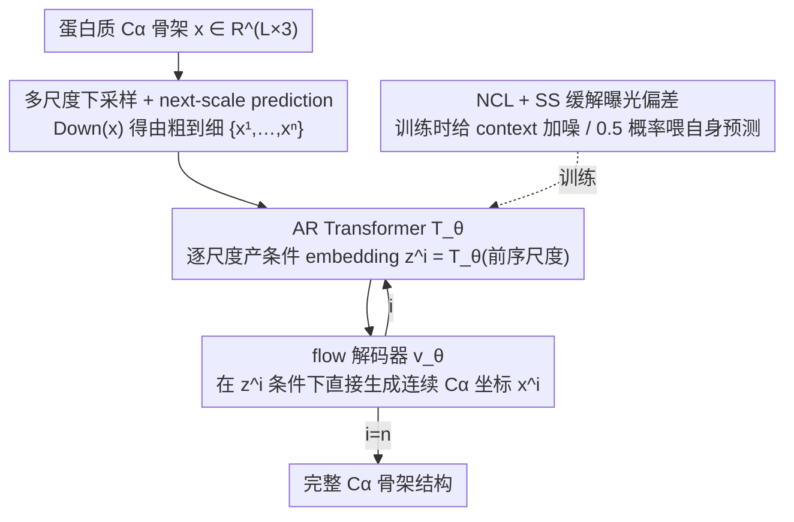

# Protein Autoregressive Modeling via Multiscale Structure Generation

**会议**: ICML 2026 Spotlight  
**arXiv**: [2602.04883](https://arxiv.org/abs/2602.04883)  
**代码**: https://par-protein.github.io (项目主页)  
**领域**: 科学计算 / 蛋白质结构生成 / 自回归生成模型  
**关键词**: 蛋白质骨架生成, 多尺度自回归, next-scale prediction, flow matching, 曝光偏差

## 一句话总结
PAR 把图像领域 VAR 的 "next-scale prediction" 思路搬到蛋白质 Cα 骨架生成上，用多尺度下采样 + 自回归 Transformer + flow-based 解码器替代单尺度扩散模型，配合 noisy context learning 和 scheduled sampling 缓解曝光偏差，在无条件生成 FPSD 上达到 161.0 的同时解锁 zero-shot 点提示生成与 motif scaffolding，并取得 2.5× 采样加速。

## 研究背景与动机

**领域现状**：蛋白质骨架生成几乎被扩散/流匹配模型垄断，一类预测每残基 SE(3) frame（FrameDiff、RFDiffusion、Genie2），另一类直接建模 Cα 坐标（Proteina 等）。这些方法都是 **单尺度** 的，即一次性对完整长度 $L$ 的结构去噪。

**现有痛点**：自回归（AR）模型在 LLM 和图像生成上展现出强 scaling 和 zero-shot 能力，但在蛋白质结构生成上几乎没人能做好。两个具体障碍：（i）连续的原子 3D 坐标需要离散化（如 VQ-VAE），离散化会丢失精细结构细节，影响 designability；（ii）蛋白质残基存在强双向依赖——序列上相距很远的两个残基可能在空间上形成氢键或疏水接触，与标准 AR 的 **单向 next-token** 假设直接冲突。前人 ESM3、Gaujac et al. 这种 token 化 AR 路线 FPSD 比扩散基线差一个数量级。

**核心矛盾**：要想用 AR 模型做蛋白质，必须同时绕开 "离散化损精度" 和 "单向顺序破坏双向依赖" 这两座山，但这两个问题都来自 AR 范式的标准实现方式。

**本文目标**：设计一种 AR 框架，使得（1）建模的是连续 Cα 坐标而非离散 token，（2）AR 的展开方向不是残基-by-残基，从而保留每个尺度内的双向依赖，（3）能复用 AR 模型本身具备的 zero-shot 与 scaling 优势。

**切入角度**：蛋白质天然具有 **层次结构**——从粗粒度的三级拓扑、二级结构排布，到原子坐标。这种 multi-scale granularity 恰好与图像生成里 VAR 提出的 "next-scale prediction" 同构：把 AR 的展开维度从 "空间位置" 改为 "尺度"，每个尺度内部仍然是全双向 attention。

**核心 idea**：把蛋白质沿序列维度做层次下采样得到 $\{\mathbf{x}^1,\dots,\mathbf{x}^n\}$（如 64→128→256 三个尺度），用 AR Transformer 做 next-scale prediction 产生每个尺度的条件 embedding，再用 flow matching 解码器在该 embedding 条件下直接生成连续 Cα 坐标——AR 负责 "雕刻轮廓"，flow 负责 "雕刻细节"。

## 方法详解

### 整体框架

PAR 要解决的是 "怎么让自回归模型生成连续 Cα 骨架而不输给扩散"，办法是把自回归展开的维度从 "残基位置" 换成 "结构尺度"：先把同一条蛋白质沿序列维下采样成由粗到细的几个版本，自回归模型只负责一个尺度一个尺度地往下推、产出每个尺度的条件 embedding，真正生成连续坐标的活交给一个 flow matching 解码器。整体写成 $p_\theta(\mathbf{x}) = \prod_{i=1}^n p_\theta(\mathbf{x}^i \mid \mathbf{z}^i = \mathcal{T}_\theta(X^{<i}))$，其中只对 Cα 原子 $\mathbf{x} \in \mathbb{R}^{L\times 3}$ 建模。粗尺度负责雕轮廓、细尺度负责补细节，自回归 Transformer $\mathcal{T}_\theta$ 给条件、flow 解码器 $\mathbf{v}_\theta$ 生坐标，推理时从 $\texttt{bos}$ 起逐尺度迭代 $n$ 次直到长出完整结构（KV cache 加速）。

### 关键设计

**1. 多尺度下采样 + next-scale prediction：把 AR 维度从残基换成尺度**

标准 AR 的单向 next-token 假设和蛋白质残基的双向空间依赖（远距残基可能在空间上形成氢键/疏水接触）天生冲突，逐残基生成必然破坏这种依赖。PAR 的做法是把结构表示成 $\{\mathbf{x}^1,\dots,\mathbf{x}^n=\mathbf{x}\}$ 一组由粗到细的尺度：每个尺度用 $\text{Down}(\mathbf{x}, \texttt{size}(i))$ 沿序列插值得到 $\texttt{size}(i)$ 个 3D 质心，配上位置编码 $p^i = \text{linspace}(1, L, \texttt{size}(i))$，让粗尺度天然管全局布局、细尺度聚焦局部细节。这样 AR 的展开方向变成 "尺度"，每个尺度内部仍然跑完整的双向 attention（非等变 Transformer），既不破坏残基间双向依赖，又把 AR 链路从 $L$ 步压成 $n=3$ 步，误差更难逐步累积。下采样过程确定性且无参，所以 likelihood 里对中间尺度的边缘化可以直接省掉。尺度配置 $\mathcal{S}$ 可按固定长度（如 $\{64,128,256\}$）或按比例（$\{L/4, L/2, L\}$），实验里 by-length 略优、被设为默认。

**2. AR 产条件 + flow 解码器直接建连续 Cα：绕开 VQ 离散化**

历史上 AR 蛋白质生成（如 ESM3）的主要瓶颈是把坐标离散成 token 会丢精细结构、压低 designability。PAR 让 AR Transformer 不直接吐 token，而是吐一个条件 embedding $\mathbf{z}^i = \mathcal{T}_\theta([\texttt{bos}, \text{Up}(\mathbf{x}^1, \texttt{size}(2)), \dots, \text{Up}(\mathbf{x}^{i-1}, \texttt{size}(i))])$（把前面所有尺度上采样到当前尺寸再拼接喂入），交给 flow matching 解码器在连续空间里直接生成坐标。训练时对每个尺度插值 $\mathbf{x}^i_{t^i} = t^i \mathbf{x}^i + (1-t^i)\boldsymbol{\epsilon}^i$，优化 $\mathcal{L}(\theta) = \mathbb{E}[\frac{1}{n}\sum_i \frac{1}{\texttt{size}(i)} \|\mathbf{v}_\theta(\mathbf{x}^i_{t^i}, t^i, \mathbf{z}^i) - (\mathbf{x}^i - \boldsymbol{\epsilon}^i)\|^2]$，条件 $\mathbf{z}^i$ 通过 adaptive layer norm 注入；推理时按 $d\mathbf{x}_t = \mathbf{v}_\theta dt$ 的 ODE 或加 score term 的 SDE（公式 6）采样。这套设计彻底回避了离散化损失，且在 $n=1$ 时自动退化成标准单尺度 flow matching（即 Proteina），天然向后兼容、可继承 self-conditioning 等成熟 trick。

**3. Noisy Context Learning (NCL) + Scheduled Sampling (SS)：缓解曝光偏差**

AR 训练时喂的是 ground-truth context、推理时喂的是模型自己的预测，这种 train-inference mismatch 会让错误在尺度间累积——作者的预实验显示纯 teacher forcing 会让 designability 严重退化（sc-RMSD 2.20）。NCL 在训练时给前一尺度的 context 加噪 $\mathbf{x}^i_{\text{ncl}} = w^i_{\text{ncl}} \mathbf{x}^i + (1-w^i_{\text{ncl}}) \boldsymbol{\epsilon}^i_{\text{ncl}}$（权重 $w^i_{\text{ncl}}$ 从 $[0,1]$ 随机采样），逼模型学会从被破坏的 context 里恢复结构；SS 则以 0.5 概率把某尺度的 ground-truth context 替换成该尺度 flow 解码器自己的预测 $\mathbf{x}^i_{\text{pred}} = \mathbf{x}^i_t + (1-t^i)\mathbf{v}_\theta(\mathbf{x}^i_t, t^i, \mathbf{z}^i)$，让模型直接 "吃自己的输出"。两者可叠加：NCL 单独就把 sc-RMSD 从 2.20 砍到 1.58、PDB-FPSD 从 99.66 降到 89.70，再加 SS 进一步到 1.48，是把 PAR 从 "勉强能用" 拉到 SOTA 的关键工程开关。

### 损失函数 / 训练策略
单一 flow matching 目标（公式 5），AR Transformer 与 flow 解码器 **联合端到端训练**。两阶段训练：先在 AFDB representative dataset 上预训 200K 步，再在 21K designable PDB 子集上 fine-tune 5K 步得到 $\text{PAR}_{\text{pdb}}$。默认 3 尺度 $\{64,128,256\}$，模型规模覆盖 60M / 200M / 400M。

## 实验关键数据

### 主实验：无条件骨架生成

| 方法 | 参数量 | Designability ↑ | sc-RMSD ↓ | FPSD vs PDB ↓ | FPSD vs AFDB ↓ |
|------|--------|----------------|-----------|---------------|----------------|
| FrameDiff | 17M | 65.4% | - | 194.2 | 258.1 |
| RFDiffusion | 60M | 94.4% | - | 253.7 | 252.4 |
| ESM3 (token AR) | 1.4B | 22.0% | - | 933.9 | 855.4 |
| Genie2 | 16M | 95.2% | - | 350.0 | 313.8 |
| Proteina | 400M | 92.6% | 1.09 | 271.3 | 272.6 |
| **PAR** | 400M | **96.0%** | **1.01** | 313.9 | 296.4 |
| **PAR$_{\text{pdb}}$** | 400M | **96.6%** | 1.04 | **161.0** | 228.4 |

PAR 在 designability 与 sc-RMSD 上同时超越 Proteina 等 SOTA 单尺度基线；fine-tune 后 PDB-FPSD 161.0 大幅领先（比 RFDiffusion 的 253.7 低 36%），证明 multi-scale AR 学到的分布更贴近真实蛋白质分布。注意 token-AR 基线 ESM3 designability 仅 22%，反过来印证 PAR 绕开离散化的必要性。

### 关键消融：曝光偏差缓解（60M, 100K steps）

| 训练策略 | sc-RMSD ↓ | FPSD vs PDB ↓ | FPSD vs AFDB ↓ |
|---------|-----------|---------------|----------------|
| Teacher Forcing | 2.20 | 99.66 | 37.64 |
| + NCL | 1.58 | 89.70 | 23.69 |
| + NCL + SS | **1.48** | 90.66 | 24.59 |

NCL 单独把 sc-RMSD 从 2.20 砍到 1.58、AFDB-FPSD 从 37.64 降到 23.69——这是把 PAR 从 "勉强能用" 拉到 SOTA 的最关键工程开关。SS 再补一刀到 1.48。

### 消融：尺度配置（60M）

| 尺度配置 | Designability ↑ | FPSD vs AFDB ↓ |
|---------|----------------|----------------|
| {64, 256} | 83.0% | 274.32 |
| **{64, 128, 256}** | **85.0%** | **267.35** |
| {64, 128, 192, 256} | 77.8% | 282.69 |
| {64, 96, 128, 192, 256} | 81.0% | 263.58 |
| {L/4, L/2, L} | 86.4% | 298.30 |

3 尺度是甜点；4-5 尺度反而下降，作者归因为错误累积加剧的曝光偏差，进一步佐证 NCL/SS 的必要性。By-length 配置略优于 by-ratio。

### 关键发现
- **采样效率突破**：把 SDE 限定在第 1 尺度（确立全局拓扑），后续尺度用 ODE 仅 2 步，相比 Proteina 400 步基线，长度 150 加速 1.96×、长度 200 加速 **2.5×**，且 designability 仍维持 94-98%。粗尺度 SDE 把样本送进高密度区，后续尺度只需精修，ODE 即可。
- **Zero-shot 点提示生成**：给 16 个 3D 点作为 prompt 注入第 1 尺度，PAR 能 fine-tuning-free 地生成符合该粗粒度布局的完整结构（5 尺度 $\{16,32,64,128,256\}$），TM-score 一致性显著优于直接输入。
- **Zero-shot motif scaffolding**：在每个尺度 teacher-force 给定的 motif 坐标，无需任何 fine-tune 或 mask 条件就能生成既保留 motif 又结构多样的 scaffold——这是扩散基线必须额外训练才能做的事。
- **Scaling 友好**：从 60M→400M、200K→600K 步训练，FPSD 持续下降且 designability 同步提升；有趣的是 60M 的 AR Transformer 已经够用，把算力堆到 flow decoder 上更划算。
- **Attention 可视化**：每个尺度主要 attend 到 **前一个尺度**，但对更早尺度仍保留非零 attention，说明 PAR 是在跨尺度真正整合信息，而不是退化为 Markov。

## 亮点与洞察
- **范式迁移做得很干净**：直接把图像里的 VAR 范式映到蛋白质，但并不是简单照搬——他们把 AR 维度从 token 改成 scale 是为了同时解决 "离散化损失" 和 "单向依赖" 这两个具体瓶颈，迁移动机非常有据。
- **AR + flow 的混合架构很优雅**：$n=1$ 时退化为 Proteina，所以本质上是把 flow matching 推广到 multi-scale 上下文，理论上没有损失，工程上完全可继承单尺度成熟 trick（self-conditioning 等）。
- **NCL 的简洁有效**：往 context 加噪听起来像很小的工程 trick，实际效果惊人（sc-RMSD 砍掉 28%）。这个思路本身也可以借鉴到任何 AR + 连续生成器的混合模型——只要存在 train-inference distribution shift，给 context 加噪就值得试。
- **粗→细 SDE/ODE 编排带来的加速**很有启发：在粗尺度 "建立锚点" 后，后续尺度的概率分布已经被压缩到高密度区，少量 ODE 步就够了。这对扩散模型加速研究也是一个新视角——把单尺度 400 步压成多尺度 (400, 2, 2)。
- **Zero-shot 点提示**实际上把蛋白质设计的人机交互方式向前推了一步：用户只需画几个 3D 点就能控制全局拓扑，远比写 mask 或写约束公式直观。

## 局限与展望
- 当前只建模 **Cα 骨架**，没有 sidechain、没有全原子，离真正可用的蛋白质设计还差一步全原子扩展（作者明确列为未来工作）。
- 尺度配置严重依赖人工先验：从 4 尺度开始性能下降，背后机制（错误累积？过 fit 粗尺度？）没深挖；按比例尺度（$L/4,L/2,L$）虽更通用但反而更差，缺乏理论解释。
- 评估几乎全在标准 PDB/AFDB 上做无条件生成 + 几个 demo 任务，**没有湿实验** 验证生成的蛋白质是否真的可折叠/具有目标功能；FPSD 161 比基线低很多，但这只是分布距离指标，不等于生物学有效性。
- 训练成本不低：两阶段训练 200K + 5K 步、最大 400M 参数，复现成本对学术 lab 不友好。
- Conformational dynamics 那条 future direction 听起来诱人，但目前完全没实验支撑，只是 "原则上可以"。

## 相关工作与启发
- **vs Proteina（单尺度 flow）**：Proteina 是 PAR 的 $n=1$ 特例。PAR 通过引入 scale 维度获得 zero-shot 提示能力 + 2.5× 加速 + 更低 FPSD，付出代价是多了 AR Transformer 与 NCL/SS 这些工程组件。
- **vs RFDiffusion / FrameDiff（frame-based 扩散）**：他们建模 SE(3) frame 走等变路线，PAR 直接建模 Cα 坐标走非等变路线，依靠 multi-scale 给出层次先验，反而在 designability 和 FPSD 上同时领先。
- **vs ESM3（token AR）**：ESM3 把结构离散化成 token 后做 LLM-style AR，designability 仅 22%。PAR 不离散化、把 AR 维度改成 scale，FPSD 直接好一个量级，等于反驳了 "AR 不适合蛋白质" 的旧结论。
- **vs VAR（图像）**：VAR 在图像上首次让 AR 超过扩散；PAR 是它在 3D 结构生成域的对应物。两者共享 next-scale prediction 与 multi-scale 上下文，差别在 PAR 不需要 VQ-VAE，因为它接的是 flow decoder 而不是 transformer 自己产 token。
- **vs Li et al. (continuous-valued AR)**：Li et al. 提出 AR 网络产 condition 再交给小 diffusion MLP 的范式，是 PAR 架构骨干的直接来源；PAR 把它从图像 latent 推广到 3D 蛋白质骨架。
- 启发：任何存在天然 hierarchical 结构的数据（视频、点云、网格、分子构象），都可以试试 "multi-scale AR + 连续解码器" 这套配方，特别是当单尺度扩散的全局一致性不够时。

## 评分
- 新颖性: ⭐⭐⭐⭐ 范式从图像迁移到蛋白质，迁移本身不算 ground-breaking，但 multi-scale AR + flow decoder + NCL 的具体组合在蛋白质域是首次，且实证打破了 "AR 干不过扩散" 的认知。
- 实验充分度: ⭐⭐⭐⭐ 无条件主表 + 三组消融（NCL/SS、尺度配置、AR transformer 必要性）+ scaling 曲线 + zero-shot 两类任务 + 采样加速分析，覆盖全面；扣分在缺湿实验验证。
- 写作质量: ⭐⭐⭐⭐ 动机推导清晰、雕塑类比形象、公式编号严谨、attention 可视化解读到位；少数 ablation 表格的指标命名（如 fS-C/A/T）需要翻附录才看得懂。
- 价值: ⭐⭐⭐⭐ 为蛋白质生成开了一条新技术路线，zero-shot 提示生成与 motif scaffolding 对设计实践直接有用，2.5× 采样加速也是工程实在收益；若后续扩到全原子 + 湿实验验证，有可能成为蛋白质生成新主流框架。

<!-- RELATED:START -->

## 相关论文

- [\[NeurIPS 2025\] Multiscale Guidance of Protein Structure Prediction with Heterogeneous Cryo-EM Data](../../NeurIPS2025/computational_biology/multiscale_guidance_of_protein_structure_prediction_with_heterogeneous_cryo-em_d.md)
- [\[ICML 2026\] CARD: Coarse-to-fine Autoregressive Modeling with Radix-based Decomposition for Transferable Free Energy Estimation](card_coarse-to-fine_autoregressive_modeling_with_radix-based_decomposition_for_t.md)
- [\[ICML 2026\] SIGMA: Structure-Invariant Generative Molecular Alignment for Chemical Language Models via Autoregressive Contrastive Learning](sigma_structure-invariant_generative_molecular_alignment_for_chemical_language_m.md)
- [\[ICLR 2026\] AntigenLM: Structure-Aware DNA Language Modeling for Influenza](../../ICLR2026/computational_biology/antigenlm_structure-aware_dna_language_modeling_for_influenza.md)
- [\[ICLR 2026\] Contact-Guided 3D Genome Structure Generation of E. coli via Diffusion Transformers](../../ICLR2026/computational_biology/contact-guided_3d_genome_structure_generation_of_e_coli_via_diffusion_transforme.md)

<!-- RELATED:END -->
