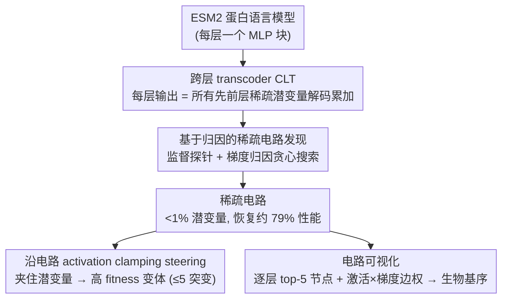

# Protein Circuit Tracing via Cross-layer Transcoders

**会议**: ICML 2026  
**arXiv**: [2602.12026](https://arxiv.org/abs/2602.12026)  
**代码**: https://github.com/amirgroup-codes/ProtoMech  
**领域**: 蛋白质语言模型 / 机械可解释性 / 电路发现 / 生物基础模型  
**关键词**: pLM, ESM2, cross-layer transcoder, 电路追踪, steering

## 一句话总结
作者把 NLP 中的 cross-layer transcoder 搬到蛋白质语言模型 ESM2 上,提出 ProtoMech 框架以 < 1% 的稀疏潜变量电路恢复 79% 的下游性能,并能沿电路 steering 设计出高 fitness 的蛋白变体,在 70%+ 案例中击败基线。

## 研究背景与动机

**领域现状**:ESM2、ESMFold、Boltz 等蛋白质语言模型 (pLM) 已能在结构预测、功能预测、序列设计中达到强 baseline,被视为"生物界的基础模型"。最近 sparse autoencoder (SAE) 被用来把 pLM 隐藏态分解为可解释特征,如识别结合位点、保守基序。

**现有痛点**:SAE 只是 *单层表征* 的稀疏因子分解,无法表达"上一层把信息送到下一层"的计算过程;Per-layer transcoder (PLT) 试图近似每层 MLP 的输入-输出映射,但每层独立训练,误差累积,且彻底忽略跨层依赖,导致重建质量差、电路不可信。

**核心矛盾**:要找到 pLM 的"计算电路"(circuit),必须有一个 *replacement model* 能整体替换原模型的 MLP 块,且层与层之间的信息传递是显式建模的。SAE 给不出"传递",PLT 给不出"跨层"。

**本文目标**:(1) 在 pLM 上构建一个能整体替换 ESM2 MLP 部分的 cross-layer 模型;(2) 在该模型潜空间中找到 <1% 即可恢复大部分性能的稀疏电路;(3) 验证这些电路对应可解释的生物基序,并能被用来 steering 设计高 fitness 序列。

**切入角度**:借鉴 Anthropic 的 Cross-Layer Transcoder (CLT)——每层 MLP 输出由所有 *先前* 层稀疏潜变量解码累加而成,从而显式建模深度方向的累积计算。

**核心 idea**:用 CLT 替换 ESM2 的每一层 MLP,再用基于梯度归因的贪心搜索找到对每个下游任务最关键的潜变量子集,这就是"蛋白电路",可视化后能映射到 HRD 催化基序、Rossmann fold、GB1 疏水核心等已知生物结构。

## 方法详解

### 整体框架
ProtoMech 把"找电路 + 用电路"串成一条流水线,共四个组件:(i) CLT 替换模型——给 ESM2 每层 MLP 写一个稀疏 TopK 编码器 + 跨层解码器,得到一个忠实复现原模型 MLP 计算、又稀疏可读的 replacement model;(ii) 稀疏电路发现——在替换模型里用梯度归因 + 增量贪心,挑出能恢复 ≥70% 原性能的最小潜变量子集,这个子集就是"蛋白电路";(iii) steering——在 CLT 上对电路里的特定潜变量做 activation clamping,把 wildtype 序列推向高 fitness 区域(5 个突变以内);(iv) 可视化——按层取 top-5 激活节点、用激活×梯度算边权,把整条电路画成可读图,再人工 cross-reference Swiss-Prot 找对应的生物基序。前三步是核心方法(下面的三个关键设计),第四步是把电路落成图、便于人工解读的呈现工具。

### 关键设计

**1. 跨层 transcoder（CLT）替换 ESM2 的 MLP**:SAE 只做单层表征的稀疏分解、PLT 又逐层独立近似(误差累积还丢了跨层依赖),都给不出"上一层把信息送到下一层"的计算过程。CLT 把这块补上:对第 $\ell$ 层残差流 $\mathbf x^\ell$ 编码得稀疏潜变量 $\mathbf a^\ell=\text{TopK}(\mathbf W_{\text{enc}}^\ell(\mathbf x^\ell-\mathbf b_{\text{pre}}^\ell)+\mathbf b_{\text{enc}}^\ell)$,而第 $\ell$ 层 MLP 输出由**所有先前层**的潜变量解码累加重建 $\hat{\mathbf y}^\ell=\sum_{\ell'=1}^{\ell}\mathbf W_{\text{dec}}^{\ell'\to\ell}\mathbf a^{\ell'}+\mathbf b_{\text{pre}}^\ell$,训练目标是重建 MSE $\mathcal L_{\text{MSE}}=\sum_\ell \|\mathbf y^\ell-\hat{\mathbf y}^\ell\|_2^2$ 外加缓解 dead latent 的辅助损失 $\mathcal L_{\text{aux}}$。这样信号从"层内重构"升级为"跨层组合",一来更忠实地复现 ESM2 的真实计算路径,二来让后层潜变量天然可被解释为"前层潜变量的功能组合",给下一步的电路发现提供了组合性基础。

**2. 基于归因的稀疏电路发现**:有了替换模型,还要从几万个潜变量里挑出对某个任务真正关键的极小子集。作者先在原 ESM2 末层 MLP 输出 $\mathbf y^L$ 上训一个监督探针(family 用 logistic regression、function 用 CNN)锚定原模型表现;推理时做 hybrid replacement——MLP 走 CLT、attention 保持 ESM2 原值;再按每个潜变量对探针输出的梯度归因排序,小批量增量加入候选集,直到电路恢复 ≥70% 原性能或达到全潜变量表现(family 用 F1、function 用 Spearman $\rho$ 评判)。贪心 + 归因避免了 $2^{d_{\text{latent}}}$ 的暴力搜索;固定 attention 则是为了切断"重建注意力带来的误差累积"(消融显示 attention 也走 CLT 会让性能塌缩),让电路只解释 MLP 这条计算路径,这与 Anthropic 在 LLM 上的做法一致。

**3. 沿电路的 activation clamping steering**:电路不只是解释工具,还能反过来当生成工具去设计高 fitness 变体。在 wildtype 的前向里,对目标 function 电路中的若干潜变量"夹"住激活——取该节点在整条序列上观察到的最大激活幅度乘以一个 scalar multiplier,再用 Eq. (2) 在 $\ell=L$ 处重建 $\hat{\mathbf y}^L$、解码到 ESM2 logits、按最大概率选突变,并把变体限制在距 wildtype ≤5 个突变以保证下游 CNN 评估器可靠。相比 CAA 往残差流里注入一个全局 concept vector,这种做法只动"归因认定与 function 相关"的子电路,干扰小、信号干净,本质是用机制归因直接驱动蛋白设计(mechanism-guided protein design)。

### 损失函数 / 训练策略
CLT 用 $\mathcal L_{\text{CLT}}=\mathcal L_{\text{MSE}}+\alpha\mathcal L_{\text{aux}}$,在 UniRef50 中随机抽 5M 条 ≤1022 aa 的序列上预训。ESM2-8M 的 CLT 共 28M 参数,3.5× 原模型。为缓解 $\mathcal O(L^2)$ 解码矩阵带来的扩展瓶颈,作者提出"windowed CLT"——每层只看前 4 层,在 ESM2-35M 上把参数从 207M 减到 125M、训练加速 1.75×,family 恢复率仅从 85% 降到 82%。

## 实验关键数据

### 主实验

ESM2-8M 上电路在两个下游任务的恢复能力:

| 任务 | 完整 latent (PLT / ProtoMech) | 电路 (PLT / ProtoMech) | 电路 latent 占比 |
|---|---|---|---|
| Protein family F1 | 0.50 ± 0.34 / **0.82 ± 0.19** | 0.49 ± 0.33 / **0.73 ± 0.19** | ~0.8% |
| Function Spearman $\rho$ | 0.38 ± 0.18 / **0.41 ± 0.19** | 0.35 ± 0.19 / **0.38 ± 0.18** | ~0.9% |
| 原 ESM2 baseline | 0.92 (family F1) / 0.50 ($\rho$) | – | – |

七个 DMS assay 上的 steering Mean score(节选):

| Method | SPG1 | HIS7 | GFP | CAPSD | RASK |
|---|---|---|---|---|---|
| ProtoMech | 1.67 | **1.28** | 4.17 | **1.68** | -0.12 |
| PLT | **1.97** | 1.27 | **4.40** | 0.81 | -0.19 |
| CAA | 0.70 | 0.52 | 2.93 | -0.26 | -0.35 |
| Random | -2.76 | 0.56 | 2.74 | -1.04 | -0.64 |

### 消融实验

| 配置 | 现象 | 含义 |
|---|---|---|
| Recursive replacement (attn 也走 CLT) | 性能明显塌缩 | 跨层误差累积,必须固定 attn |
| Windowed CLT (window=4) on ESM2-35M | family 82% vs vanilla 85% | 折中策略,大模型上可行 |
| 与 PLT 同 sparsity 对照 | PLT family F1 仅 0.50 | 跨层连接才是性能来源,不是 sparsity 调参 |

### 关键发现
- 在原 ESM2 表现不佳(F1<0.5)的 family 上,ProtoMech 电路平均 F1 反而 *高于* 原模型 (0.43 vs 0.39),呈现"稀疏去噪正则化"效应——电路把任务无关噪声过滤掉,反而比原模型更可靠,有望作为 protein screening 的 mechanistic filter。
- 电路在 mutation depth ≥5 的 GFP 远突变上仍恢复 74% 性能,说明 ProtoMech 抓住的是 *全局* 功能基序而非过拟合局部统计。
- 可视化 confirmed:Kinase 电路里 L1 识别精氨酸 R → L3 识别 HRD 催化环 → L5 分裂为 ATP 结合位点与 G-loop;NADP+ 电路里 L4 识别 Rossmann fold → L5 narrowed 到 NADP+/FAD 口袋。深层重新激活早期残基,与 NLP 中的 token 重申现象一致。

## 亮点与洞察
- 首次把 Anthropic 的 CLT 思想搬到生物基础模型上并跑通整套电路发现+steering 流程,验证了"机械可解释性"是跨域通用范式而非 LLM 特有现象。
- 设计了 mechanism-guided protein design 这条新路径:不再依赖全局 concept vector 或耗时的进化算法,而是用"哪些 latent 负责高 fitness"直接驱动突变选择,效率高、解释强。
- "电路反而比原模型更准"这一 denoising 现象提示 sparse latent space 本质上是一个可学习的正则化器,对小样本/噪声大的蛋白预测任务很有应用价值。

## 局限与展望
- 电路解释仍依赖人工 cross-reference Swiss-Prot,扩展性差;急需自动化的 motif 标注流水线。
- 只在 masked LM (ESM2) 上验证,自回归 pLM (ProGen)、扩散式 pLM (DPLM) 是否也能用 CLT 还未知,作者明确将其留作 open challenge。
- 参数量 $\mathcal O(L^2)$ 的扩展瓶颈虽然 windowed CLT 部分缓解,但在 ESM2-650M 及以上仍可能不可承受。

## 相关工作与启发
- **vs Adams 2025 (SAE on pLM)**:他们用 SAE 解释单层表征,本文转向用 CLT 解释跨层计算,从"特征"升级到"电路"。
- **vs Ameisen 2025 (CLT on LLM)**:Anthropic 在 Claude 上做 LLM 电路追踪,本文是其在生物领域的首次落地,验证了方法的跨域可迁移性。
- **vs CAA (Huang 2025) 蛋白 steering**:CAA 依赖大量 fitness 标注 + 局部突变,容易过拟合;ProtoMech 通过电路实现稀疏干预,数据效率与外推能力都更强。

## 评分
- 新颖性: ⭐⭐⭐⭐ 首次把 cross-layer transcoder 用于 pLM 电路追踪并提出蛋白 steering 新范式。
- 实验充分度: ⭐⭐⭐⭐ 涵盖 family + function + steering 三类任务、二种模型尺寸,定量与生物案例研究互补。
- 写作质量: ⭐⭐⭐⭐ 框架清晰,生物案例(Kinase/NADP+/GB1)逐层解读直观。
- 价值: ⭐⭐⭐⭐ 既给 mech-interp 社区一个跨域案例,又给蛋白设计提供低成本机制驱动方法。

<!-- RELATED:START -->

## 相关论文

- [\[ICLR 2026\] Tracing Pharmacological Knowledge in Large Language Models](../../ICLR2026/computational_biology/tracing_pharmacological_knowledge_in_large_language_models.md)
- [\[ICML 2026\] Cross-Chirality Generalization by Axial Vectors for Hetero-Chiral Protein-Peptide Interaction Design](cross-chirality_generalization_by_axial_vectors_for_hetero-chiral_protein-peptid.md)
- [\[ICML 2026\] Learning the Interaction Prior for Protein-Protein Interaction Prediction: A Model-Agnostic Approach](learning_the_interaction_prior_for_protein-protein_interaction_prediction_a_mode.md)
- [\[ICML 2026\] Towards A Generative Protein Evolution Machine with DPLM-Evo](towards_a_generative_protein_evolution_machine_with_dplm-evo.md)
- [\[NeurIPS 2025\] Inferring Stochastic Dynamics with Growth from Cross-Sectional Data](../../NeurIPS2025/computational_biology/inferring_stochastic_dynamics_with_growth_from_cross-sectional_data.md)

<!-- RELATED:END -->
