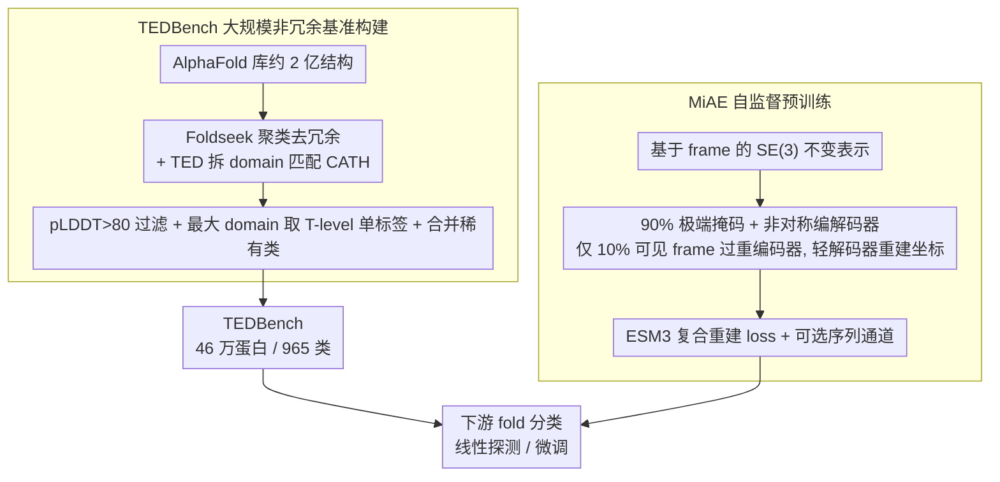

# Protein Fold Classification at Scale: Benchmarking and Pretraining

**会议**: ICML 2026  
**arXiv**: [2605.18552](https://arxiv.org/abs/2605.18552)  
**代码**: https://github.com/BorgwardtLab/TEDBench  
**领域**: 科学计算 / 蛋白质结构表示学习  
**关键词**: 蛋白质折叠分类, 大规模基准, 掩码自编码器, SE(3) 不变, 自监督预训练

## 一句话总结
作者基于 TED + Foldseek 聚类的 AlphaFold 结构构建了规模空前（约 49 万条、965 类）的非冗余蛋白质折叠分类基准 TEDBench，并提出 SE(3)-不变的掩码自编码器 MiAE：用高达 90% 的极端掩码率 + 重编码器/轻解码器的非对称架构，仅 100M 参数即在线性探测和微调上击败 ESM2-650M、SaProt-650M 等更大模型。

## 研究背景与动机

**领域现状**：CATH/SCOP 等结构分类体系把蛋白质 domain 按 class→architecture→topology→homology 组织成层次标签，传统上通过结构比对（DALI、Foldseek）做最近邻迁移；近年的几何深度学习（E3NN、MACE、GotenNet）和蛋白质表示学习（ESM2、ProteinMPNN、SaProt）则把 fold 识别看作监督分类或 representation learning 任务。

**现有痛点**：蛋白质折叠分类的监督基准长期停留在 1.5 万蛋白量级（SCOPe、PDB-fold 等），冗余高、标签噪声大；现有方法要么靠超大序列模型（ESM2-15B）硬吃，要么在结构-only 模型上性能受限。换句话说，蛋白质领域还没等来自己的"ImageNet 时刻"。

**核心矛盾**：AlphaFold Database 已经有数亿预测结构，但缺乏一个能驱动架构迭代的大规模、非冗余、标签可靠的标准分类任务；同时，主流的几何 GNN 在数十万规模上 scale 不好，序列模型则忽略了 3D 结构。

**本文目标**：(1) 构建一个规模上推一个数量级、且控制冗余的 fold 分类基准；(2) 给出一个 scale 友好、纯结构自监督的强 baseline，证明结构表征本身就够用。

**切入角度**：CV 里的 MAE (He et al. 2022) 用 75% 掩码 + 非对称编解码器训出可迁移的视觉表征；蛋白质骨架同样具有"三级字母表"式的局部冗余（Mackenzie et al. 2016），可以承受更激进的掩码。把 MAE 范式搬到 SE(3)-不变的 frame 表示上，就能用稀疏可见 frame 高效编码，再让轻量解码器从 latent + mask token 重建坐标。

**核心 idea**：把每个残基表示成 SE(3) 局部 frame，用 90% 掩码 + 重编码器/轻解码器的非对称 MAE 学结构表征；同时基于 TED + Foldseek 聚类 + pLDDT 过滤构建 46 万规模、965 类、非冗余的 TEDBench。

## 方法详解

### 整体框架

这篇工作要解决的核心问题是：蛋白质折叠分类长期卡在 1.5 万样本、高冗余、标签噪声大的小基准上，等不来自己的"ImageNet 时刻"。作者把它拆成两件事同时做——一是用 TED + Foldseek 聚类 + pLDDT 过滤把 AlphaFold Database 蒸馏成 46 万级、965 类、控冗余的标准基准 TEDBench；二是把 CV 里的 MAE 范式搬到 SE(3)-不变的残基 frame 表示上，得到一个纯结构、scale 友好的自监督模型 MiAE。数据侧把约两亿结构经 Foldseek 聚类去冗余、TED 拆 domain 匹配 CATH topology、pLDDT 过滤与单标签化蒸馏成 TEDBench；模型侧把骨架编成 frame、极端掩码后只用可见残基过重编码器、再用轻解码器重建坐标——两侧各阶段的具体取舍与动机见下面的关键设计。

### 关键设计

**1. TEDBench：大规模、非冗余、标签可靠的 fold 分类基准**：fold 分类长期卡在 SCOPe / PDB-fold 这类 1.5 万量级、冗余高、标签噪声大的小基准上，等不来"ImageNet 时刻"。作者把 AlphaFold 库的约两亿结构蒸馏成一个标准分类任务：先用 Foldseek 聚类压到约 227 万代表蛋白去冗余，再借 TED（Encyclopedia of Domains）把每个结构拆成 domain 并匹配到 CATH 的 topology（T-level），按 pLDDT > 80 过滤掉低置信结构、取最大 domain 的 T-level 作单一无歧义标签、合并稀有类，最终得到 462,175 条蛋白 / 965 类（8:1:1 分层划分），外加 27,638 条 CATH v4.4 实验结构当外部测试集。每个构建选择都对着一个痛点：Foldseek 聚类管去冗余、TED 管可规模化的 domain 标注、单标签 + T-level 管目标无歧义、pLDDT 过滤管标签可靠——四者合起来才凑成一个能驱动架构迭代的标准基准，而这恰是此前蛋白结构学习一直缺的基础设施。

**2. 基于 frame 的 SE(3) 不变表示：以低代价获得结构感知**

fold 类别本就是 CATH 按 3D 结构定义的，模型必须感知几何，但通用等变 GNN（E3NN/MACE）的高阶 tensor product 太贵、scale 不动。作者把每个残基编码成局部 frame $\mathbf{T}_i = [\mathbf{R}_i, \mathbf{t}_i] \in \mathrm{SE}(3)$，其中 $\mathbf{t}_i$ 取 $C_\alpha$ 全局坐标，$\mathbf{R}_i$ 由骨架原子 $(N, C_\alpha, C)$ 构造的正交基给出。所有 attention 都在局部坐标系里做（沿用 ESM3 的几何 self-attention）：把全局点 $p$ 经 $p_{\text{local}} = \mathbf{R}_i^\top (p - \mathbf{t}_i)$ 映到 frame $i$ 本地系，于是对整体刚体平移/旋转天然不变，却避开了高阶等变张量的复杂度，得以 scale 到 339M 参数。和 ESM3 不同的是，这里不限制到 k 近邻、而是在可见 frame 上做全局 attention——因为掩码后只剩 10% 残基，全局 attention 反而比稠密版更便宜。

**3. 90% 极端掩码 + 非对称编解码器：把重计算压到可见的一成残基上**

蛋白质骨架局部冗余极强（α 螺旋、β 折叠的重复 motif），低掩码训练太平凡——70% 掩码下重建 RMSD 仅 0.57，模型靠邻居插值就能蒙混过关。作者因此把掩码率拉到 90%：随机均匀采样 10% 的 frame 作可见集，剩下 90% 在编码器里**完全删除**（连 mask token 都不加），重编码器（最多 24 层 / 339M）只在这 10% 上做几何 attention + Transformer；解码器极轻（2 层、宽 512），把 mask token 补回完整序列后重建全部坐标。高掩码逼模型做"长程几何推理"而非局部光滑插值，非对称设计又让重编码器只过一成 token，这两点合起来既提质又使 scale 成为可能。消融印证了这个取舍：0% 掩码（纯 AE）线性探测 F1 从 58.5 跌到 45.7（test）/ 23.9（external）；解码器宽度对 256/512/768 极度敏感（F1 35→58→28），太宽太窄都崩；解码器深度则与 pooling 方式纠缠——mean pool 偏好更深（1/2/4 层 F1 55→58→59），CLS pool 反被深解码器害死（46→35→13）。

**4. ESM3 复合重建 loss + 可选序列通道：让 latent 同时装下几何与进化信号**

CATH 标签是"几何 + 进化"混合定义的，纯几何重建容易学出"几何漂亮但缺生物语义"的表征。训练目标采用 ESM3 的复合 loss $\mathcal{L}_{\text{ESM3}}$，含 5 项：几何距离、几何方向（主监督），分箱距离/方向分类（辅助稳定），以及 inverse folding token 预测（鼓励 latent 保留序列信息）。由于 pairwise 距离/方向天然 SE(3)-不变，loss 作用在**所有**骨架原子上而非仅 mask 处。inverse folding 这一项让 latent 不只重建几何、还得猜出是哪个氨基酸，消融显示去掉它后线性探测 F1 从 58.5 掉到 52.5。作者还可选地开一条序列通道：按相同 mask 模式遮蔽氨基酸序列，把未遮残基的 AA embedding 加到可见 frame 表示上——这把线性探测 F1 从 58.5 推到 62.1，微调推到 74.6（test，已超 SaProt-650M 的 73.5）。

### 损失函数 / 训练策略

- 优化器：AdamW + 余弦学习率；微调时用 layer-wise lr decay。
- 预训练数据：Foldseek 聚类 + pLDDT > 80 的 749,679 条无标注结构（与 TEDBench 监督集不重叠）。
- 模型规模：MiAE-S（29M / 6 层）、MiAE-B（102M / 12 层）、MiAE-L（339M / 24 层）。
- 评测：因 965 类长尾严重，主指标为 macro-F1（同时报 accuracy）；外部测试集为 CATH v4.4 40% 非冗余实验结构。

## 实验关键数据

### 主实验

| 协议 | 模型 | 参数 | test F1 | external F1 | 备注 |
|------|------|------|---------|-------------|------|
| 监督-from-scratch | GotenNet | 1.9M | 64.02 | 65.44 | 最强等变 baseline |
| 监督-from-scratch | E3NN | 1.9M | 57.63 | 42.40 | 外部测试集明显掉点 |
| 监督-from-scratch | MACE | 1.5M | 50.58 | 44.73 | — |
| 监督-from-scratch | **MiAE-B** | 102M | **71.60** | **75.02** | 比 GotenNet +7.6 / +9.6 |
| 预训练 + 微调 | ESM2-650M | 650M | 66.19 | 72.29 | 序列大模型 |
| 预训练 + 微调 | SaProt-650M | 650M | 73.48 | 76.78 | 序列+结构混合 SOTA |
| 预训练 + 微调 | **MiAE-B+seq** | 102M | **74.56** | **77.34** | 6.4× 更少参数仍超 SaProt-650M |
| 线性探测 | ESM2-15B | 15B | 70.85 | 76.27 | 同量级最强但 44× 参数 |
| 线性探测 | MiAE-L | 339M | 63.50 | 70.44 | ≤650M 类内最强结构模型 |

### 消融实验（MiAE-B 默认配置，线性探测 F1，test/external）

| 配置 | test F1 | external F1 | 说明 |
|------|---------|-------------|------|
| 默认（90% mask + invf + seq + dec 2L×512） | 62.14 | 68.88 | — |
| 0% 掩码（纯 AE） | 45.70 | 23.90 | 没了"稀疏重建"挑战，掉 16.4 / 45.0 |
| 去掉 invf loss | 52.55 | — | 序列级监督不可或缺，掉 6.0 |
| 不加 AA 序列 | 58.52 | 66.18 | seq 通道贡献约 3.6 / 2.7 |
| 解码器宽度 256 / 768 | 35.50 / 27.83 | — | 偏离 512 严重崩 |
| 解码器深度 1L / 2L / 4L（mean pool） | 46.61 / 58.52 / 59.65 | — | 更深更好（mean pool 下） |
| 模型 S / B / L | 49.43 / 58.52 / 63.50 | — | linear probing 干净 scaling |

### 关键发现

- **掩码率越高越好，且和 CV 的 MAE 走向相反**：MAE 在图像上最佳掩码率 75%、BERT 上 15%，蛋白质这里要拉到 **90%** 才最优。原因是蛋白质骨架局部冗余极强——70% 掩码下重建 RMSD 仅 0.57，模型靠局部插值就够；只有逼到 90%，才迫使模型做"全局几何推理"，从而学出可分 fold 的表征。
- **结构 > 序列+结构 > 序列**：纯结构的 MiAE 在同参数预算下显著超过纯序列的 ESM2，并能用 1/6 参数追上 SaProt-650M；说明 CATH topology 这种几何定义的标签，结构信号是充分的，序列只是 nice-to-have。
- **MiAE 比 SaProt/ESM2 更受益于微调**：MiAE-B+seq 线性探测→微调 F1 跳 12.5 / 8.5 点，ESM2 只跳 4 / 2、SaProt 跳 7 / 6；这暗示 MiAE 的预训练目标和下游 fold 分类的对齐度更高。
- **scaling 在 linear probing 下干净，在微调下饱和**：linear probing 从 S→L 涨 14 点 F1，但微调 B→L 几乎平坦——说明 102M 已经够下游任务，未来空间在更大的预训练数据而非更大的模型（图 5 显示数据量增长仍带来收益）。
- **外部测试集普遍更高**：所有模型在实验结构（CATH v4.4）上 F1 反而比 AFDB 预测结构高约 10 点，作者归因于实验结构多样性低 + CATH 人工标签更干净，而不是模型对实验数据有偏好。

## 亮点与洞察

- **"蛋白质的 ImageNet 时刻"路径具体化**：把 TED + Foldseek 聚类 + pLDDT 过滤组合成可复用的数据构建管线，让 49 万级、控冗余、单标签清晰的 fold 分类基准成为现实——这本身就是一个高复用基础设施，比方法更重要。
- **掩码率最优值反映模态固有冗余**：图像 75%、文本 15%、蛋白质骨架 90% 三个数字背后是模态本身的"可压缩程度"。这给后续做新模态 MAE 的工作一个清晰的诊断指标：先测重建 RMSD 随掩码率的曲线，找到陡升点附近的最佳掩码率。
- **非对称设计 + SE(3)-不变 frame 是 scale 蛋白质几何模型的实用解法**：避开了高阶等变 tensor product 的复杂度，用"局部坐标系下做 attention"换取可 scale 性，给等变 GNN 之外提供了一条工程上更友好的路。
- **可迁移 trick**：(a) 高掩码率打破局部捷径的思路可直接搬到点云、分子图等局部冗余高的几何模态；(b) 把序列 / 文本通道作为 mask 同步辅助监督，可复用到蛋白质功能预测、分子性质预测等多模态生物任务。

## 局限与展望

- 作者承认：(1) TEDBench 只做蛋白级 fold 识别（最大 domain 单标签），漏掉了小 domain，未来应做 domain 级 segmentation + 分类；(2) MiAE 只在 fold 分类上验证，未测功能预测、相互作用等更广任务；(3) 大模型预训练仍贵，限制了可达性。
- 自己看到的：(a) 单标签设定丢弃了 CATH 层次结构（class→architecture→topology→homology），把 hierarchical loss / 层级评测加进来应能更全面；(b) 外部测试集只覆盖 880 / 965 类，AFDB ↔ 实验结构的 domain gap 还没真正压测；(c) 线性探测 MiAE-L 仍比 ESM2-15B 差，说明纯结构表征在"标签弱关联区域"还吃亏，未来可探索结构-序列联合预训练把 ESM2 当 teacher 蒸出来；(d) 解码器宽度对 256/512/768 极度敏感（F1 35→58→28），暴露 MAE 在几何上的超参 brittleness，工程上不友好。
- 改进思路：把 TEDBench 改成多标签 / hierarchical CATH 任务；把 MiAE 预训练扩展到 ESM Atlas 量级（数亿结构）；引入跨域 domain segmentation pretext task，让一个模型同时学定位 + 分类。

## 相关工作与启发

- **vs ESM2 / SaProt**：ESM2 纯序列、大参数硬吃；SaProt 把 Foldseek 离散结构 token 当词加到序列里。MiAE 反过来——以连续 3D 结构为主、序列做辅助；本文证明在 fold 分类这种结构定义任务上，"结构为主"的路线在同参数预算下显著更强（参数 6.4× 少仍超 SaProt-650M）。
- **vs ProteinMPNN / MIF**：两者都以 inverse folding 为预训练目标，但模型很小（1.6M / 3.4M），表征能力受限。MiAE 把 inverse folding 作为 5 项 loss 中的一项加进 MAE 框架，既享受到 MAE 的 scaling，又保留了序列信号，所以在 linear probing 上大幅领先。
- **vs CV 的 MAE**：架构同源（非对称编解码 + 高掩码 + 仅可见 token 进编码器），但本文 loss 作用于**全部**骨架原子（保证 SE(3) 不变）而非仅 mask 区域，最佳掩码率从 75% 拉到 90%——把 MAE 思想"原汁原味"搬到几何模态的范本。
- **vs GotenNet / E3NN / MACE 等等变 GNN**：通用等变 GNN 在 1.5–1.9M 规模下饱和，无法 scale；MiAE 用 frame-based attention 绕开高阶 tensor product 的代价，可放大到 339M，证明蛋白质结构任务上"scale up Transformer + 几何先验"比"严格高阶等变 + 小模型"更划算。

## 评分
- 新颖性: ⭐⭐⭐⭐ 主要是把 MAE 范式严肃迁移到蛋白质几何 + 构建大规模基准，组件都是已知的，但 90% 掩码率 + 非对称设计的具体实例化和大规模数据集本身有原创价值。
- 实验充分度: ⭐⭐⭐⭐⭐ 三种训练协议 × 多家 baseline × 6 大消融（掩码率 / 解码器宽 / 深 / 模型 size / 序列 / loss 项）+ 外部测试集 + t-SNE 可视化，几乎覆盖了想问的所有问题。
- 写作质量: ⭐⭐⭐⭐ 结构清晰，table 信息密度高；少数关键设计（如几何 attention 的具体公式）被推到附录略遗憾。
- 价值: ⭐⭐⭐⭐⭐ TEDBench 大概率会成为蛋白质 fold 分类的标准基准，MiAE 也提供了一个 scale 友好的强 baseline，对结构生物学社区影响面广。

<!-- RELATED:START -->

## 相关论文

- [\[AAAI 2026\] Investigating Data Pruning for Pretraining Biological Foundation Models at Scale](../../AAAI2026/computational_biology/investigating_data_pruning_for_pretraining_biological_foundation_models_at_scale.md)
- [\[ICML 2026\] Learning the Neighborhood: Contrast-Free Multimodal Self-Supervised Molecular Graph Pretraining](learning_the_neighborhood_contrast-free_multimodal_self-supervised_molecular_gra.md)
- [\[ICML 2025\] Protein Structure Tokenization: Benchmarking and New Recipe](../../ICML2025/computational_biology/protein_structure_tokenization_benchmarking_and_new_recipe.md)
- [\[ICML 2026\] Learning the Interaction Prior for Protein-Protein Interaction Prediction: A Model-Agnostic Approach](learning_the_interaction_prior_for_protein-protein_interaction_prediction_a_mode.md)
- [\[ICLR 2026\] HeurekaBench: A Benchmarking Framework for AI Co-scientist](../../ICLR2026/computational_biology/heurekabench_a_benchmarking_framework_for_ai_co-scientist.md)

<!-- RELATED:END -->
