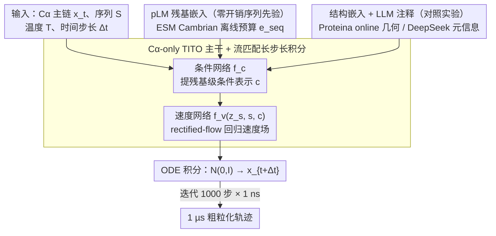

# Protein Language Model Embeddings Improve Generalization of Implicit Transfer Operators

**会议**: ICML 2026  
**arXiv**: [2602.11216](https://arxiv.org/abs/2602.11216)  
**代码**: https://github.com/PanosAntoniadis/platito (有)  
**领域**: 科学计算 / 分子动力学 / 生成模型 / 蛋白质表征  
**关键词**: 蛋白质语言模型, 隐式转移算子, 流匹配, 粗粒化MD, 跨系统泛化

## 一句话总结
本文把预训练蛋白质语言模型（pLM）的残基嵌入直接灌进可迁移隐式转移算子（TITO），训出 PLaTITO 在 mdCATH 上仅用 56 ms 轨迹和 1100 GPU 小时就让小到 19 M 参数的粗粒化 $C_\alpha$ 模型在快折叠蛋白等离群系统的平衡采样上全面超过 BioEmu。

## 研究背景与动机
**领域现状**：分子动力学（MD）是计算生物学的核心工具，需要在 Boltzmann 分布 $\mu(x)\propto\exp(-\beta U(x))$ 上采样以估计热力学和动力学观测量。经典 MD 受限于飞秒级积分步长，要桥接到微秒甚至秒级的弛豫时间几乎不可行；近年的生成式 MD（GenMD）路线分两支：Boltzmann 生成器/仿真器（BG/BE，如 BioEmu）直接学 $p(x|S,T)$，隐式转移算子（ITO/TITO）则学长时间转移密度 $p(x_{t+\Delta t}|x_t,\Delta t,S,T)$。

**现有痛点**：BG/BE 需要把单体折叠空间整体压进神经网络，必须海量轨迹+蛋白结构监督才能撑起跨系统泛化（BioEmu 用了 31 M 参数 + 216 ms 轨迹 + 9216 GPU 小时，还额外用 131 k AFDB 结构和 502 k 实验 $\Delta G$ 监督）。TITO 利用 MD 自相关结构更省数据，但只看坐标的小模型在见到全新蛋白序列时仍然吃力，泛化天花板被「该残基长什么样」的先验缺失卡住。

**核心矛盾**：泛化能力 vs. 训练成本——想覆盖广阔的蛋白序列空间，要么疯狂堆数据/参数，要么找一条便宜的归纳偏置注入通道。

**本文目标**：(i) 验证 TITO 框架本身是否比 BE 更数据高效；(ii) 找到一种能在不增加测试时计算成本的前提下显著提升离群泛化的辅助条件信号；(iii) 检查温度条件是否能让模型自发学到真实的非阿伦尼乌斯折叠动力学。

**切入角度**：pLM（如 ESM Cambrian）在十亿级未标注序列上预训练后，已被反复证明在残基嵌入里隐式编码了进化、结构、稳定性甚至热力学信息；这恰好是 TITO 缺的那块「物理先验」，而且嵌入可以离线一次性算好，几乎零代价。

**核心 idea**：把 pLM 残基嵌入 $e_{\text{seq}}=\phi_{\text{pLM}}(S)$ 作为条件灌进 TITO 的转移密度网络，等价于让粗粒化 $C_\alpha$ 模型「看着进化先验来积分动力学」，从而用更少的轨迹数据撑起更强的跨蛋白泛化。

## 方法详解

### 整体框架
PLaTITO 要解决的是「如何用更少的轨迹数据训出能泛化到全新蛋白的粗粒化 MD 生成器」。它不直接学 Boltzmann 分布，而是沿用隐式转移算子（ITO/TITO）路线，把问题转成：给定当前 $C_\alpha$ 主链 $x_t\in\mathbb{R}^{3L}$、序列 $S$、温度 $T$、时间步长 $\Delta t$，学长时间转移密度 $p(x_{t+\Delta t}|x_t,\Delta t,S,T)$，再迭代 roll-out 拼成长轨迹。核心改动是在条件分支挂上三条可插拔的辅助嵌入（pLM 序列嵌入、结构嵌入、LLM 注释），让小模型在没见过某蛋白轨迹时就借到进化/几何先验。

网络分两阶段：条件网络 $f_c$ 先从 $(x_t,\Delta t,S,T,e_{\text{seq}},e_{\text{struct}},A_{LLM})$ 提一个残基级条件表示 $c\in\mathbb{R}^{L\times d}$；速度网络 $f_v(z_s,s,c)$ 再在流匹配时间 $s\in[0,1]$ 上预测速度 $v\in\mathbb{R}^{3L}$。两者都是 Proteina 风格的非等变 Transformer，残基-对表示用作 attention bias。推理时从 $\mathcal{N}(0,I)$ 出发用学到的速度场做 ODE 积分得到 $x_{t+\Delta t}$，迭代 1000 步、每步 $\Delta t=1\,\mathrm{ns}$ 即得 1 µs 轨迹。

### 关键设计

**1. 粗粒化 $C_\alpha$-only TITO 主干 + 流匹配长步长积分：用时间自相关换数据效率**

针对的痛点是 BE 路线（如 BioEmu）直接采 $p(x|S,T)$ 抛掉了 MD 的时间自相关结构，等于浪费了轨迹里最贵的信号，只能靠海量数据/参数撑泛化。PLaTITO 抛弃侧链只保留 $C_\alpha$，让 4482 个 mdCATH 域全塞进同一架构；时间步 $\Delta t$ 作为可学习嵌入与序列/温度一起拼进残基表示，使一个网络能在纳秒到微秒多个时间尺度上共享参数。训练用 rectified-flow 线性插值 $z_s=s\,z_1+(1-s)\,z_0$（$z_0\sim\mathcal{N}(0,I),\ z_1=x_{t+\Delta t}$），最小化条件流匹配损失 $\mathcal{L}(\theta)=\mathbb{E}_{x_t,x_{t+\Delta t},s,z_0}\|v^{\theta}(z_s;s,x_t,\Delta t,S,T)-(x_{t+\Delta t}-z_0)\|^2$，采样时常速度场 $u_s=z_1-z_0$ 的 ODE 步长由 $s$ 控制而非物理时间，把动力学采样转成低噪声步数的生成问题。之所以有效，是因为 TITO 能从相邻帧的相关性里挖出大量 $(x_t,x_{t+\Delta t})$ 训练对，使 3 M 参数的小模型在等量数据下就追平 BE。

**2. pLM 残基嵌入作为零开销序列先验：补上粗粒化模型缺的进化/化学信息**

粗粒化 $C_\alpha$ 模型只看坐标，缺「这个残基长什么样」的先验，见到全新序列时泛化吃力。PLaTITO 把 ESM Cambrian（PLaTITO 用 300 M、PLaTITO-19M 用 6 B）的残基级嵌入 $e_{\text{seq}}\in\mathbb{R}^{L\times d_{\text{pLM}}}$ 注入条件网络 $f_c$：嵌入在训练前一次性 forward 出来缓存，训练/推理都不再调用 pLM，按残基拼进 $f_c$ 的 residue representation 后经 attention 与坐标融合，让网络还没看到该蛋白任何 MD 轨迹时就已「知道」哪些残基倾向 β-sheet、哪些容易暴露、哪段是 disordered loop。pLM 嵌入已被 Meier/Frazer 等证明隐含变体稳定性与功能信息，正是粗粒化模型最缺的那块先验；做成可插拔条件通道而非替换主干，保留了 TITO 的轻量性，使测试时计算几乎不变（$\le 5\%$ overhead），却把离群蛋白的 MAE 从 1.068 拉到 0.949。

**3. 结构嵌入与 LLM 注释作为对照实验：定位有用先验的边界**

为分离「序列先验／几何先验／数据质量先验」三种增益来源，作者在 PLaTITO 之外再挂两条辅助条件做对照。一是来自 Proteina 60 M 的结构嵌入 $e_{\text{struct}}=\phi_{\text{PSM}}(x_t)$——因为它必须 online 计算（依赖当前 $x_t$），所以特意选了相对轻的 60 M 模型控成本。二是来自 DeepSeek Reasoner 的「该蛋白单独模拟是否合理」的二元判断 $S_{LLM}$ 和置信度 $C_{LLM}$——把数据集质量的元信息（域长、亚细胞定位、已知功能、是否缺结合伙伴）prompt 给 LLM，回答作为额外条件嵌入。结果显示序列与几何先验互补（PLaTITO+Struct 三项指标小幅一致提升），而 LLM 注释反而掉点，揭示当前 prompt 工程还无法从粗糙元数据里提取出比模型自身归纳偏置更强的信号。

### 损失函数 / 训练策略
仅有的训练目标就是上面的条件流匹配回归损失。训练数据为 mdCATH 中 $\le 200$ 残基的 4471 个域（按 40% 序列相似度阈值剔除与测试集相近的蛋白），合计约 56 ms 聚合轨迹；按温度和时间步长随机均匀采样，多温度训练让模型隐式学到温度依赖动力学。所有模型在单张 A100 80 GB 上训 1100 GPU 小时；PLaTITO-19M 用更大的 ESM Cambrian 6 B 嵌入加 19 M 主干参数，但保持同样的数据和计算预算。

## 实验关键数据

### 主实验
评测集为 12 个快折叠蛋白（Lindorff-Larsen et al. 2011），所有蛋白与训练集严格无序列重叠。指标包括对参考 MD 自由能景观的 MAE、RMSE 和 Coverage（被模型覆盖的 reference bin 比例）。

| 模型 | MAE ↓ | RMSE ↓ | Coverage ↑ | 参数量 | GPU 小时 | MD 数据 |
|------|------|------|------|------|------|------|
| TITO (baseline) | 1.068 | 1.382 | 0.590 | 3 M | 1100 | 56 ms |
| TITO + Struct | 1.004 | 1.310 | 0.560 | 3 M | 1100 | 56 ms |
| **PLaTITO** | 0.949 | 1.228 | 0.651 | 3 M | 1100 | 56 ms |
| PLaTITO + Struct | 0.938 | 1.213 | 0.655 | 3 M | 1100 | 56 ms |
| PLaTITO + Struct + LLM | 1.066 | 1.346 | 0.570 | 3 M | 1100 | 56 ms |
| **PLaTITO-19M** | **0.824** | **1.099** | **0.666** | 19 M | 1100 | 56 ms |
| Emu (BE arch) | 1.305 | 1.639 | 0.529 | 3 M | 1100 | 56 ms |
| BioEmu | 1.110 | 1.389 | 0.594 | 31 M | 9216 | 216 ms + 额外结构/$\Delta G$ |

PLaTITO-19M 在 MAE 上比 BioEmu 低 26%，同时训练数据少约 4 倍、GPU 小时少 8 倍。

### 消融与对比

| 配置 | 关键观察 | 说明 |
|------|---------|------|
| TITO vs. Emu (同架构同算力) | MAE 1.068 vs. 1.305 | 证明利用 MD 时间自相关比纯学 Boltzmann 分布更省数据 |
| +Struct (Proteina 60 M 嵌入) | 三项指标小幅一致提升 | 结构先验与序列先验互补，但 online 计算引入轻量开销 |
| +Seq (ESM Cambrian 300 M) | MAE 1.068→0.949, Cov 0.590→0.651 | pLM 嵌入是最大单点贡献，零测试时开销 |
| +LLM 注释 | MAE 反弹到 1.066 | 当前 prompt+元数据不足以提供有用条件，反而引入噪声 |
| Cambrian 300 M → 6 B + 主干 3 M → 19 M | MAE 再降到 0.824 | 表征与模型容量双向扩展可叠加（图 3 缩放曲线接近线性下降）|

### 关键发现
- **pLM 嵌入是单点最大杠杆**：把 PLaTITO 切回 TITO 是消融里掉点最猛的（MAE +0.119、Cov −0.061），且推理时几乎零开销，揭示「廉价的预训练先验 + 物理动力学骨架」可能是 GenMD 的甜点路线。
- **结构嵌入与序列嵌入互补**：两者叠加比单独使用都强一点，但结构嵌入必须每步重算导致计算开销不低，性价比不如 pLM。
- **LLM 注释反例**：相同框架下加入 DeepSeek 的稳定性判断反而掉点，说明当前 LLM 不能可靠把蛋白上下文翻译成动力学有用的归纳偏置——这是一处罕见的负面结果，对后续做「LLM-as-conditioner」的工作是重要警示。
- **温度依赖物理性**：PLaTITO-19M 在 320–440 K 五个温度下预测的折叠/解折叠时标偏离阿伦尼乌斯曲线（图 5），与 BBA、Villin 等真实折叠动力学的「rugged landscape」吻合，说明温度条件并非装饰而是被模型真正利用了。
- **隐窝口袋形成**：在 4 个 cryptic pocket 基准上从 holo 出发能采到类 apo 构象，把 BioEmu 失败的 4 例中救回 1 例（Q58L87 仍失败但是「能量分离不够」而非「模式缺失」）。

## 亮点与洞察
- **「便宜先验 + 廉价骨架 > 巨型端到端」**：用 ESM Cambrian 已有的嵌入做零开销条件，让 19 M 的 $C_\alpha$ TITO 超过 31 M 的全原子 BioEmu，且数据/算力都少一个数量级；这给以后做 GenMD 提供了一条「先冻一个大蛋白基础模型，再在上面挂任务专用 TITO」的实用范式。
- **MD 自相关 ≠ Boltzmann 分布**：作者自带的 Emu vs. TITO 对照（同架构同数据）是这篇文章最干净的一处实验设计——直接证明扔掉时间相关性会显著浪费监督信号，这一点在 BE 工作普遍被忽略。
- **罕见的负面结果**：明确报告 LLM 注释掉点，对正在试图「用 LLM 包一切」的社区有冷却作用，思路可迁移到任何「把 LLM 当条件器」的场景：必须先验证元数据本身的信息密度。
- **流匹配 + 多时间步条件**：把 $\Delta t$ 当可学习嵌入而非固定步长，让一个 TITO 网络同时服务于纳秒到微秒尺度的采样，这种「时间尺度作为条件」的范式在轨迹生成、视频扩散里也值得借用。

## 局限与展望
- $C_\alpha$ 粗粒化忽略侧链，对配体特异性、变构调控等任务先天受限；作者承认全原子扩展是必经之路。
- ITO 框架本身无 detailed balance、Chapman-Kolmogorov 自洽性或稳定性的形式保证；MFPT 系统性偏小（变分原理预测），需要更多数据或后验校正。
- 训练数据全部为单体 mdCATH，跨化学空间（复合物、与小分子的相互作用）和热力学条件（极端温度/压力）泛化仍未验证。
- LLM 注释的失败提示 prompt 与元数据本身的瓶颈，要么做更精细的 prompt 工程，要么直接用更结构化的物理特征（如二级结构丰度、SASA）替代。
- 仍依赖外部预训练（pLM、Proteina），属于「拼装式」科学计算 pipeline；未来若想做端到端自训，则需重新设计能产出可重用嵌入的预训练目标。

## 相关工作与启发
- **vs BioEmu (Lewis et al., 2025)**：BioEmu 是纯 BE，直接学 $p(x|S,T)$，靠 31 M 参数+大量额外结构/$\Delta G$ 监督扛泛化；PLaTITO 走 ITO 路线学转移密度并把 pLM 当条件，做到更小更省更准，但缺 BE 的可重加权理论性质。
- **vs TITO/Diez et al., 2026**：原 TITO 主干已能跨小肽和小分子迁移，本文把 pLM 嵌入接入条件分支，证明 TITO 还有大量未挖掘的泛化空间，关键在于注入合适的预训练表征。
- **vs Boltzmann Generator (Noé et al., 2019) & Timewarp (Klein et al., 2023)**：早期 BG/flow 方法只能在单系统或小肽上工作，本文展示了「廉价大先验 + 紧凑动力学网络」是把这类方法推向跨蛋白尺度的可行路径。
- **vs ESMFold/AlphaFold 类静态结构预测**：那条路线只给一个能量极小，本工作给的是整段动力学样本——两者其实可以串：先用 AF 类模型粗略找极小，再用 PLaTITO 在周围采样自由能景观，构成「静态 + 动态」的协同 pipeline。

## 评分
- 新颖性: ⭐⭐⭐⭐ pLM 嵌入注入 ITO 概念简单但首次系统验证三种辅助条件，对照清晰
- 实验充分度: ⭐⭐⭐⭐⭐ 五模型 + 多 pLM 家族 + 多模型尺寸 + 跨温度 + cryptic pocket，覆盖面广
- 写作质量: ⭐⭐⭐⭐ 公式与结构分阶段陈述清楚，但部分附录依赖较多
- 价值: ⭐⭐⭐⭐⭐ 用 1/8 算力刷过 BioEmu 并指明「LLM 注释失败」这一负面信号，对 GenMD 社区有强指导意义

<!-- RELATED:START -->

## 相关论文

- [\[ICLR 2026\] Reverse Distillation: Consistently Scaling Protein Language Model Representations](../../ICLR2026/computational_biology/reverse_distillation_consistently_scaling_protein_language_model_representations.md)
- [\[ICLR 2026\] How to Make the Most of Your Masked Language Model for Protein Engineering](../../ICLR2026/computational_biology/how_to_make_the_most_of_your_masked_language_model_for_protein_engineering.md)
- [\[ICML 2026\] Cross-Chirality Generalization by Axial Vectors for Hetero-Chiral Protein-Peptide Interaction Design](cross-chirality_generalization_by_axial_vectors_for_hetero-chiral_protein-peptid.md)
- [\[ICML 2026\] Learning the Interaction Prior for Protein-Protein Interaction Prediction: A Model-Agnostic Approach](learning_the_interaction_prior_for_protein-protein_interaction_prediction_a_mode.md)
- [\[ICLR 2026\] Protein as a Second Language for LLMs](../../ICLR2026/computational_biology/protein_as_a_second_language_for_llms.md)

<!-- RELATED:END -->
