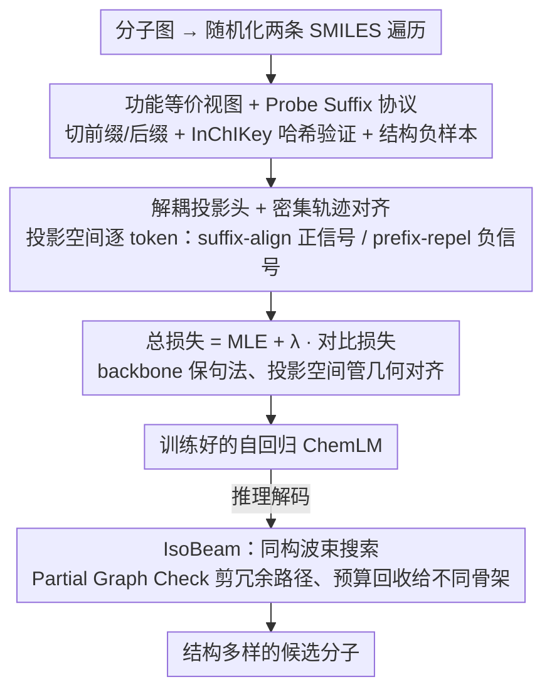

# SIGMA: Structure-Invariant Generative Molecular Alignment for Chemical Language Models via Autoregressive Contrastive Learning

**会议**: ICML 2026  
**arXiv**: [2603.25062](https://arxiv.org/abs/2603.25062)  
**代码**: 无  
**领域**: 图学习 / 化学语言模型 / 自回归生成  
**关键词**: SMILES, 对比学习, 轨迹对齐, 同构波束搜索, 分子生成

## 一句话总结
SIGMA 用 token 级对比损失把同一分子不同 SMILES 排列的隐状态强制对齐到同一条轨迹，并配套提出 IsoBeam 在解码阶段剪掉同构冗余路径，让序列模型在化学空间中真正"按图而非按字符串"思考。

## 研究背景与动机

**领域现状**：当前化学语言模型 (ChemLM) 把分子图序列化成 SMILES 字符串后用 Transformer 做自回归生成，这种"语言式建模"利用 PubChem/ChEMBL/ZINC 等亿级无标注语料预训练，被广泛用于 de novo 药物设计、性质预测和活性建模。

**现有痛点**：一个分子图对应**阶乘多个**合法 SMILES 写法（取决于遍历顺序），而模型却把这些等价写法当作完全不同的序列学习。结果是同一分子的不同前缀被映射到隐空间中互相正交的位置，作者称之为"轨迹发散 (Trajectory Divergence)"，进而造成"流形碎片化 (Manifold Fragmentation)"——化学空间按句法而非结构被切割成孤岛。这对强化学习驱动的分子优化尤其有害：智能体可能被困在一个语法区域里反复采样同一类骨架，导致 mode collapse。

**核心矛盾**：图模型 (MPNN/GraphAF) 有内置的置换不变性，但牺牲了 Transformer 的可扩展性；序列模型有可扩展性，但缺乏几何归纳偏置。已有的 Randomized SMILES 数据增强只是被动暴露，模型往往记住高频排列而不是学到结构等价性。需要的是一种既保留序列效率又能强制几何不变性的方法。

**本文目标**：(1) 在不放弃 SMILES 表示的前提下，让模型在训练阶段就把结构等价的前缀显式对齐到同一隐状态；(2) 在推理阶段消除波束搜索中"多条路径解码到同一分子"的浪费；(3) 保持训练 pipeline 与现有 Transformer 兼容，不引入额外编码器。

**切入角度**：作者观察到，两条不同 SMILES 前缀若能拼接**完全相同的后缀**得到同一分子，则它们在化学意义上指向同一中间子图。这给出了一个"功能等价 (Functional Equivalence)"的严格判据，避免了"看起来相似但化学上不兼容"的伪正样本。

**核心 idea**：用 token 级对比损失把"共享相同后缀"的前缀对齐到同一隐轨迹，同时把化学上不同的前缀作为结构负样本推开，让自回归模型在隐空间里"行为像图模型"。

## 方法详解

### 整体框架
SIGMA 要解决的是"同一分子的不同 SMILES 写法被序列模型当成毫不相干的序列"这个根本错位。它的做法是在不换掉 SMILES 表示、不引入额外编码器的前提下，把"结构等价"这件事同时塞进训练目标和解码策略：训练时用一个 token 级对比损失，强迫两条结构等价的前缀在隐空间里走同一条轨迹，化学上不同的前缀则被推开；推理时换上一个能识别"这两条路径其实是同一个分子"的波束搜索，把浪费在冗余写法上的预算回收给真正不同的骨架。整套训练目标是 MLE 损失加上对比损失的加权和，解码阶段则把标准 beam 替换成 IsoBeam。

### 关键设计

**1. 功能等价视图与 Probe Suffix 协议：让正样本严格等于"结构相同"而非"字符串相似"**

对比学习的成败首先取决于正样本对干不干净。随机化数据增强的老问题是会引入句法假阳性——两条 SMILES 看着不一样、化学上却未必真等价。SIGMA 给出一个严格判据：从原始分子随机化两条遍历 $S^u, S^v$，找一个公共切分点把序列拆成前缀加后缀 $(p, s)$，要求前缀句法发散 $p_u \neq p_v$，但拼上同一后缀后结构必须等价，用 InChIKey 哈希预言机 $\mathcal{H}$ 验证 $\mathcal{H}(\text{Mol}(p_u \oplus s)) \equiv \mathcal{H}(\text{Mol}(p_v \oplus s)) \equiv \mathcal{H}(\mathcal{G})$。哈希预言机比编辑距离/子串匹配这类启发式干净得多，从源头杜绝了假阳性。

但不完整的 SMILES 前缀常常化学非法（开环没闭合等），没法直接验证。为此作者引入 **Probe Suffix Protocol**：切分点若产生悬挂键，就临时拼一个稳定的 cap 片段 $s_{probe}$（如甲基或环闭合）再做结构验证，让等价性判定落在稳定拓扑上而不是瞬态的非法中间体上。光有正样本还不够区分细粒度差异，作者再加 **Structural Negatives**——从 batch 里显式挑出 $\mathcal{H}(\text{Mol}(p_{neg} \oplus s)) \neq \mathcal{H}(\mathcal{G})$ 的负前缀（典型是立体异构或骨架跳跃），逼模型学会分辨"真同构"和"看着像但本质不同"，普通 in-batch 随机负样本做不到这一点。

**2. 解耦投影头与密集轨迹对齐：在不拖累 MLE 的前提下抹掉句法差异**

直接在 backbone 隐状态 $\mathbf{H}$ 上加对比损失会和 MLE 打架——MLE 必须精确区分"环索引 1 vs 2"这类句法细节，对比却要把这种差异抹掉，两个目标在同一层隐状态上抢资源。SIGMA 的解法是加一个两层 MLP 投影头 $\mathbf{z}_t = W^{(2)} \sigma(W^{(1)} \mathbf{h}_t + b^{(1)}) + b^{(2)}$，把对比损失搬到投影空间 $\mathcal{Z}$ 上，让 backbone 继续保留句法信息、投影空间专门负责几何对齐，消融里去掉投影头会直接让 MLE perplexity 升高，印证了这层解耦的必要性。

对齐本身是"密集"的：对比目标作用在匹配后缀的逐 token 位置（suffix-align，正信号），同时在不匹配前缀位置做 prefix-repel（负信号），既对齐 token 输出分布，也对齐 cross-attention 权重。之所以不用 SimCLR/MoCo 那种全局 [CLS] 对齐，是因为自回归生成是步进式的——每一步 token 决策都需要几何一致的隐状态，只对齐一个全局向量根本管不到中间每一步的轨迹。

**3. IsoBeam：把训练学到的等价性在解码阶段真正用起来**

模型即便在训练里学会了等价性，标准 beam search 在大分子上仍会暴露老毛病：top-k 里好几条路径解码出来其实是同一分子的不同写法（如苯乙酮的多种 SMILES），白白浪费搜索预算，输出看着"结构多样性低"。IsoBeam 在解码每一步对当前波束里的部分前缀做 **Partial Graph Check**：若两个前缀对应的子图同构且开放连接点一致，就只留概率较高的那条，把另一条的预算回收给别的骨架（如从苯环切到吡啶环）。这等于把训练阶段的轨迹不变性在推理阶段也识别并利用起来，和训练对齐形成"学等价—用等价"的闭环。

### 损失函数 / 训练策略
总损失 $\mathcal{L} = \mathcal{L}_{\text{MLE}} + \lambda \mathcal{L}_{\text{contrast}}$，其中对比项包含 suffix-align（InfoNCE 风格的正样本对齐）和 prefix-repel（结构负样本推开），用温度参数 $\tau$ 控制锐度。每个 batch 在线采样随机化 SMILES 对并验证哈希等价性，验证失败的对直接丢弃，投影头与 backbone 联合训练。

## 实验关键数据

### 主实验
论文在标准多参数分子优化基准 (MPO) 上对比强 baseline（标准 ChemLM、Randomized SMILES 增强、CONSMI 全局对比、SimCTG 自对比、LO-ARM 图生成器），评估指标包括 sample efficiency、structural diversity、property optimization score。

| 任务类别 | 指标 | SIGMA | 之前 SOTA | 提升说明 |
|---------|------|-------|-----------|---------|
| 多参数优化 | 高分分子数 | 显著领先 | Randomized SMILES | sample efficiency 大幅提升 |
| 结构多样性 | 唯一骨架数 | 显著领先 | 标准 beam search | IsoBeam 把预算回收给不同骨架 |
| 隐空间对齐 | 同构前缀余弦相似度 | 接近 1 | < 0.5 | 验证 Manifold Fragmentation 被修复 |

### 消融实验

| 配置 | 关键指标 | 说明 |
|------|---------|------|
| 完整 SIGMA (suffix-align + prefix-repel + IsoBeam) | 最优 | — |
| w/o Structural Negatives | 结构多样性下降 | 仅用 in-batch 随机负样本不够区分立体异构 |
| w/o Projection Head | MLE perplexity 升高 | 直接在 backbone 上对比会损害生成质量 |
| w/o IsoBeam (训练同 SIGMA，推理用标准 beam) | 唯一骨架数下降 | 训练对齐不能完全消除推理时的冗余 |
| w/o suffix-align (只用 global CLS 对比) | 隐空间对齐变弱 | 验证 token 级密集对齐的必要性 |

### 关键发现
- 投影头是必需的：直接在 backbone 上做对比会让 MLE 与对比目标拉锯，token 预测精度下降。
- IsoBeam 与训练阶段对齐互补：对齐解决"模型是否知道等价"，IsoBeam 解决"输出是否避免重复"。
- 结构负样本（立体异构/骨架跳跃）显著提升了细粒度区分能力，普通 in-batch 负样本不够。
- Probe Suffix 让等价性判定基于稳定拓扑而非瞬态状态，避免了化学上无效中间体引起的伪判断。

## 亮点与洞察
- **几何一致性 = 隐空间约束**：用 token 级对比把"序列模型应该尊重的图对称性"显式编码到隐空间，是把"图模型归纳偏置"注入 Transformer 的优雅做法。
- **训练与推理对偶**：suffix-align（训练学等价）+ IsoBeam（推理用等价）形成完整闭环，避免了"训练学到但推理用不上"的常见缺陷。
- **InChIKey 哈希预言机**作为等价性判据是干净且严格的：避免了基于编辑距离/子串匹配的启发式假阳性。
- 这个"轨迹对齐"思路可迁移到任何"一对多序列化"问题：如代码生成中等价 AST 的不同表达式排序、3D 形状的不同点云顺序、化学反应路径的不同写法。

## 局限与展望
- 哈希验证依赖 RDKit 等化学信息学工具，对大分子或非常规分子可能失败，且每个 batch 都要做哈希计算引入额外开销。
- Probe Suffix 选择（甲基 cap vs 环闭合）会影响等价性判定的边界——某些极端情况下不同的 probe 可能给出不同结论。
- IsoBeam 的 Partial Graph Check 本身有一定计算复杂度，在大波束/长序列时可能成为瓶颈，需要工程优化。
- 文章侧重 SMILES，对 SELFIES/DeepSMILES 等更鲁棒的线性表示是否同样有效，需要进一步验证。
- 未来可扩展到反应 SMILES、3D 构象、多模态分子表示等场景。

## 相关工作与启发
- **vs Randomized SMILES (Bjerrum 2017)**：他们靠数据增强**被动**暴露等价排列，SIGMA 用对比损失**主动**强制等价性，sample efficiency 高一个量级。
- **vs CONSMI / SimSon (全局对比)**：他们对齐 [CLS] 全局嵌入，SIGMA 在 token 级密集对齐——自回归解码每一步都需要几何一致的隐状态。
- **vs SimCTG (intra-sequence 对比)**：SimCTG 关注同一序列内 token 的各向异性，SIGMA 关注**跨序列**结构等价；两者正交。
- **vs LO-ARM / GraphAF (图生成器)**：图模型有内置置换不变性但牺牲 Transformer 可扩展性；SIGMA 在序列模型里"模拟"图模型的几何性质，鱼和熊掌兼得。
- **vs FineMolTex (token-motif 对齐)**：他们需要复杂多模态架构，SIGMA 只需 backbone + 投影头，更轻量。

## 评分
- 新颖性: ⭐⭐⭐⭐⭐ "轨迹对齐"是把图模型几何性质注入序列模型的全新且优雅的路径
- 实验充分度: ⭐⭐⭐⭐ 涵盖隐空间分析、性质优化、结构多样性，消融完整；可惜没有覆盖 SELFIES 等替代表示
- 写作质量: ⭐⭐⭐⭐⭐ Manifold Fragmentation 概念提炼到位，图示清晰，方法部分推导严谨
- 价值: ⭐⭐⭐⭐⭐ 同时改进训练（对齐）和推理（IsoBeam），对化学语言模型生态有直接落地价值

<!-- RELATED:START -->

## 相关论文

- [\[ICML 2026\] Protein Autoregressive Modeling via Multiscale Structure Generation](protein_autoregressive_modeling_via_multiscale_structure_generation.md)
- [\[AAAI 2026\] S2Drug: Bridging Protein Sequence and 3D Structure in Contrastive Representation Learning for Virtual Screening](../../AAAI2026/computational_biology/s2drug_bridging_protein_sequence_and_3d_structure_in_contrastive_representation_.md)
- [\[AAAI 2026\] Dual-Path Knowledge-Augmented Contrastive Alignment Network for Spatially Resolved Transcriptomics](../../AAAI2026/computational_biology/dual-path_knowledge-augmented_contrastive_alignment_network_for_spatially_resolv.md)
- [\[NeurIPS 2025\] Beyond Chemical QA: Evaluating LLM's Chemical Reasoning with Modular Chemical Operations](../../NeurIPS2025/computational_biology/beyond_chemical_qa_evaluating_llms_chemical_reasoning_with_modular_chemical_oper.md)
- [\[ICML 2026\] Learning Protein Structure-Function Relationships through Knowledge-guided Representation Decomposition](learning_protein_structure-function_relationships_through_knowledge-guided_repre.md)

<!-- RELATED:END -->
