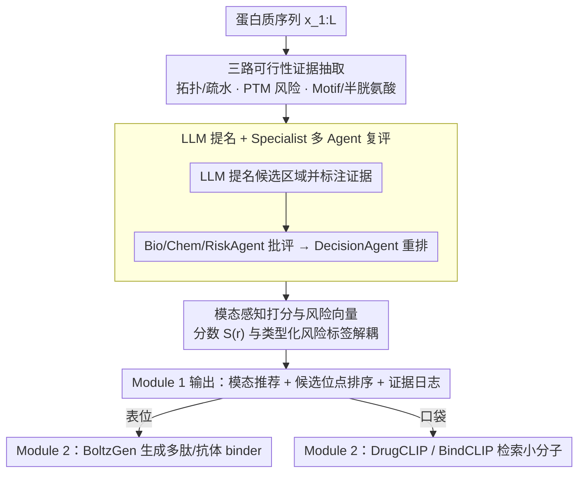

# Site4Drug: Predicting Drug-Binding Target Sites with an AI Agent

**会议**: ICML 2026  
**arXiv**: [2606.01816](https://arxiv.org/abs/2606.01816)  
**代码**: https://github.com/winterrykim/Site4Drug_Demo  
**领域**: 科学计算 / 药物发现 / LLM Agent  
**关键词**: 药物靶点, 表位发现, 口袋发现, LLM Agent, 可审计性  

## 一句话总结
Site4Drug 把"在蛋白质上选哪里下药"这一上游瓶颈重构为一个约束优先的证据整合问题——LLM Agent 从序列推导拓扑、PTM、Motif、半胱氨酸等可行性信号，输出带分数、风险标签和可追溯日志的候选位点排序，并自动推荐应当采用抗体/多肽还是小分子模态。

## 研究背景与动机

**领域现状**：现有的药物设计流水线大多假设"结合位点已知"，主力工作集中在对接、虚拟筛选或 binder 生成（如 BoltzGen、DrugCLIP、BindCLIP）。位点本身要么取自已沉淀的共晶结构中与配体距离 $\le 4\text{Å}$ 的残基，要么由几何工具（fpocket、RAPID-Net）从结构中提取。

**现有痛点**：真实场景下"先选位点再选 binder"的早期阶段经常卡壳。膜蛋白只有部分区域物理上可触达，拓扑预测会互相矛盾，糖基化等 PTM 会掩蔽或破坏候选表位；当下游筛选失败时，团队往往分不清是 binder 模型问题还是位点选错，因为位点选择的理由通常没有被记录。几何方法只能找规范口袋，无法吸纳异质元数据，也覆盖不到非小分子模态。

**核心矛盾**：可行性证据（拓扑、PTM、半胱氨酸网络、Motif 上下文）是离散、异构、跨模态的，而下游工具又需要一个单一、可比较、可解释的位点排序。

**本文目标**：在不依赖固定 ground truth 的前提下，为任意蛋白序列输出 (i) 推荐结合模态、(ii) 排序的候选位点、(iii) 每个候选的证据摘要、风险标签与决策日志。

**切入角度**：LLM 天然能融合非结构化证据并生成可追溯的推理链；让 LLM 在统一证据上同时对小分子口袋与抗体表位评分，可以避免"化学上像但生物上被遮蔽"的假阳性。

**核心 idea**：用"约束优先 + 证据聚合 + Agent 反复评审"取代单一几何/学习打分，把位点选择变成一个可审计的多智能体决策过程。

## 方法详解

### 整体框架
方法要解决的是"先选位点再选 binder"早期阶段的卡壳问题：把离散、异构、跨模态的可行性证据汇成一个单一可比较的位点排序。输入只是蛋白质氨基酸序列 $x_{1:L}$，输出是一份结构化报告——模态推荐 $\hat{m}\in\{\text{epitope}, \text{pocket}, \text{other}\}$、$K$ 个候选区域 $\{r_k\}$ 及其分数 $S(r_k)$、可达性/拓扑标签、证据摘要与类型化风险标签。整个流程拆成两个模块：Module 1 从序列抽证据、让 LLM 提名候选、打分排序、再由专门 Agent 对抗式复评；Module 2 把高分候选按模态分流给下游设计工具（表位交给 BoltzGen，口袋交给 DrugCLIP/BindCLIP）。

### 关键设计

**1. 三路可行性证据抽取：把"为什么不能选这里"显式化**

几何方法只能找规范口袋，吸纳不了 PTM、Motif 这类异质元数据，而这些约束若埋在 LLM 隐含先验里又无法被审计。Site4Drug 因此从纯序列并行抽出三路信号，全部落成可枚举的标签。拓扑/疏水性用 Kyte–Doolittle 滑窗疏水值加启发式 TM 检测，给出 `tmd/restricted` 或 `outside/exposed` 的粗标签，置信度由疏水值离 TM 阈值的 margin 决定；PTM 风险用 MusiteDeep 预测磷酸化、糖基化等位点，再把每个位点扩成一个 typed 局部 mask（例如 211 位磷酸化扩为 208–214），记录候选与 mask 的重叠及类型计数；Motif 与半胱氨酸则用 ScanProsite 查 Motif 命中标 `motif-overlap`，并以局部半胱氨酸数作为二硫键约束的轻量代理。把这些多源生物学约束显式枚举出来，后续 Agent 才能给出可追溯的批评。

**2. LLM 提名 + Specialist 多 Agent 复评：用一致证据压幻觉**

单一 LLM 容易"自我说服"，于是 Site4Drug 引入一组拿同一份证据做对抗式审稿的 Agent。LLM 先拿到序列加压缩后的证据摘要，直接输出排序后的候选区域 JSON；过滤掉无效项后，每个候选被标上拓扑标签、PTM/Motif overlap、半胱氨酸数、风险标签和启发式分数。随后 BioAgent、ChemAgent、RiskAgent 拿同一份证据摘要返回 claim→evidence→impact 形式的批评，DecisionAgent 综合所有批评做最终模态判定与重排。关键约束是 DecisionAgent 被强制只能引用上下文里已经存在的证据——这把可追溯性直接写进了决策范式，使任何结论都能回溯到某一行证据。

**3. 模态感知打分函数与风险向量：让分数和风险解耦**

如果把"碰了 TM""压在糖基化簇里"这类风险直接混进分数，排序虽可比但失败原因就被抹平了。Site4Drug 因此把两者拆开：候选分数概念上写作

$$S_0(r) = s_{\text{mode}}(r) - p_{\text{TM}}(r) - p_{\text{PTM}}(r) - p_{\text{motif}}(r)$$

其中 $s_{\text{mode}}$ 是模态基础偏好——表位偏好极性、非 TM、低 PTM 窗口，口袋偏好疏水核心且 PTM 惩罚更弱。与此同时单独维护一个类型化风险向量 $g(r)$，输出 `TM-overlap`、`PTM-overlap`、`glyco-mask-overlap`、`PTM-dense`、`disulfide-constrained`、`hydrophobic-core`、`motif-overlap` 等标签。这样在同一个分数下，"全程没碰 TM"的候选与"压在糖基化簇里"的候选可以被运营人员明确区分，排序可比而失败可解释。

### 损失函数 / 训练策略
作者初期尝试用结构化示范做 SFT（Qwen3-235B Instruct），但发现 SFT 检查点虽然改善了输出格式，却出现"反复挑 N 端相似窗口"的捷径行为，因此正文报告全部基于 base 模型推理。作者指出未来需要"生物学有依据的奖励或偏好信号"来做后训练。

## 实验关键数据

### 主实验
| 数据集 | 设置 | Site4Drug Top-1 | Site4Drug Top-5 | 对比基线 |
|--------|------|-----------------|-----------------|----------|
| RCSB 共晶口袋集（n=63） | $p<0.05$ 显著率 | 20/63 | 18/63 | fpocket+AlphaFold3: 20/63；fpocket+RCSB 含配体: 62/63 |
| ABCD 抗体表位集（n=26） | $p<0.05$ 显著率 | 8/26 | 11/26 | — |

Site4Drug 在不直接吃结构的前提下，与"喂 AlphaFold3 结构给 fpocket"打平；fpocket 在含配体的 RCSB 结构上做到 62/63 是因为配体方位本身把答案泄露给了几何检测器。GO 富集显示 Top-1 显著的目标主要集中在激酶家族，与激酶有反复出现的小分子可达口袋的生物学先验一致。

### 消融实验
| 配置 | Top-1 显著率 | Top-5 显著率 | 说明 |
|------|--------------|--------------|------|
| Site4Drug 完整流水线 | 20/63 | 18/63 | 含拓扑/PTM/Motif/Cys 证据 + Specialist |
| 仅序列 + $k=1$（无证据） | 3/63 | 3/63 | 只给通用 ID 与序列 |
| 仅序列 + $k=3$ 自一致投票 | 7/63 | 6/63 | 三次提名投票 |
| 结构可信度（AlphaFold3 pLDDT） | — | — | Top-1 平均 pLDDT > Top-5 集均值，仅 9 例反向 |

### 关键发现
- 显式证据流水线比"提示工程 + 序列输入"高一个量级（20 vs 3–7），证明 Site4Drug 的增益不是来自 LLM 通用序列模式，而是来自被强制注入的可行性约束。
- Site4Drug 即使不直接吃 3D 结构，预测位点的平均 pLDDT 仍然高于其下属 Top-5 区域均值，说明聚合后的序列证据隐式恢复了"结构上可靠的区域"。
- 在 EGFR 上做 Module 2 端到端 demo：把 Top-1 口袋喂给 DrugCLIP 检索到的小分子与 lapatinib 结合位点重叠的超几何检验 $p < 10^{-11}$；把 Top-1 表位喂给 BoltzGen 生成的多肽 binder 在 PAE $<12$ 阈值下只有 rank-1 能算出 LIS，rank-2 落在已知抗体靶向的 Domain III。
- Top-1 显著样本里激酶占主导（如 pralsetinib 同时靶向 DDR1/FGFR1/FGFR2/FLT3/JAK1/JAK2/KDR/NTRK1/NTRK3/PDGFRB/RET 共 11 个激酶），符合激酶具有反复出现的小分子可结合口袋的生物学先验，说明 Site4Drug 真的抓到了家族级几何/序列特征而不是随机命中。
- 模态自动推荐能识别 EGFR、HER2 这类同时存在小分子与抗体药物的混合模态目标，避免了人工预设模态时容易踩的坑。

## 亮点与洞察
- 把"可审计性"从事后报告升级为设计目标：分数函数、风险标签、Agent 批评全部强制基于显式证据列表，使错误可定位到某一行证据，这种风格对监管严格的药物发现尤为重要。
- 拒绝把 ground truth 当圣经：作者明确指出 IEDB 的免疫表位与 RCSB 的"配体 4Å 邻域"都是任务相关而非穷举的标签，因此用超几何检验做相对比较而不是绝对回归——这种实验范式在缺乏金标准的科学发现任务中值得迁移。
- 模态先于位点：与其要求用户先指定"我要做抗体还是小分子"，不如让同一证据反过来推荐模态，避免对膜蛋白细胞内段强行设计抗体这种典型失误。

## 局限与展望
- 数据规模有限（口袋 63 例、表位 26 例），且与 scPDB 训练过的 RAPID-Net 等结构模型存在数据泄漏风险，无法做公平正面对比。
- 仅吃单条序列，无法处理四级结构——但许多通道蛋白药物正是靶向多亚基组装体；作者认为 LLM-Agent 比单序列输入的 fpocket/RAPID-Net 更容易扩展到这种"多链元数据"场景。
- SFT 后训练会出现 N 端窗口捷径，提示需要生物学奖励信号；浓度依赖与部分序列输入下的拓扑反向风险也未在当前评估中覆盖。

## 相关工作与启发
- **vs fpocket / RAPID-Net**：几何/结构方法在含配体结构上接近天花板，但无法吸纳 PTM、Motif、模态等异质元数据，更不能直接做表位发现；Site4Drug 的优势是统一框架与可追溯日志，劣势是绝对显著率上限受限于序列证据。
- **vs DrugCLIP / BindCLIP / BoltzGen**：这些工作假设位点已知并做 binder 评分或生成；Site4Drug 与它们正交，处于上游，且在论文中已演示了 Module 2 的衔接。
- **vs AI Scientist / AI co-scientist / Virtual Lab 等科研 Agent**：同样属于"LLM Agent 做科研决策"，但 Site4Drug 把领域可行性约束写得最细，是 Agentic 科研在药物靶点这一具体场景的代表性落地。

## 评分
- 新颖性: ⭐⭐⭐⭐ 把"位点选择"重新定义为可审计 Agent 决策问题，框架定位清晰。
- 实验充分度: ⭐⭐⭐ 数据集规模有限，仅一个目标做了完整端到端 demo。
- 写作质量: ⭐⭐⭐⭐ 证据流、模态推荐与可审计性叙述顺畅，附录细节充分。
- 价值: ⭐⭐⭐⭐ 对真实药物发现流水线有直接可落地的接口与日志规范价值。

<!-- RELATED:START -->

## 相关论文

- [\[ACL 2025\] Retrieve to Explain: Evidence-driven Predictions for Explainable Drug Target Identification](../../ACL2025/computational_biology/retrieve_to_explain_drug_target_identification.md)
- [\[ICML 2026\] From Holo Pockets to Electron Density: GPT-style Drug Design with Density](from_holo_pockets_to_electron_density_gpt-style_drug_design_with_density.md)
- [\[ICML 2026\] EvoEGF-Mol: Evolving Exponential Geodesic Flow for Structure-based Drug Design](evoegf-mol_evolving_exponential_geodesic_flow_for_structure-based_drug_design.md)
- [\[ICLR 2026\] HeurekaBench: A Benchmarking Framework for AI Co-scientist](../../ICLR2026/computational_biology/heurekabench_a_benchmarking_framework_for_ai_co-scientist.md)
- [\[ICLR 2026\] Retrieval-Augmented Generation for Predicting Cellular Responses to Gene Perturbation](../../ICLR2026/computational_biology/retrieval-augmented_generation_for_predicting_cellular_responses_to_gene_perturb.md)

<!-- RELATED:END -->
