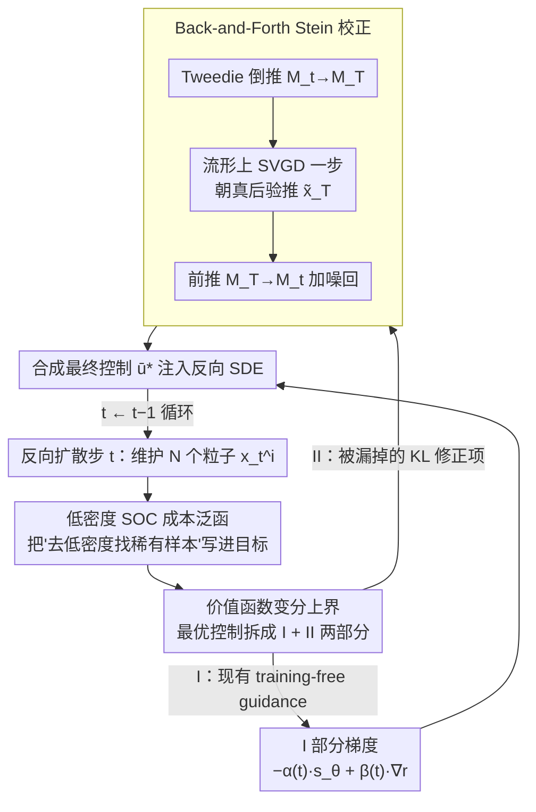

# Stein Diffusion Guidance: Training-Free Posterior Correction for Sampling Beyond High-Density Regions

**会议**: ICML 2026  
**arXiv**: [2507.05482](https://arxiv.org/abs/2507.05482)  
**代码**: 待确认  
**领域**: 扩散模型 / 训练免引导 / 后验采样 / 分子生成  
**关键词**: 扩散引导、随机最优控制、Stein 变分推断、Tweedie 公式、低密度采样  

## 一句话总结
SDG 把"训练免（training-free）扩散引导"和"随机最优控制（SOC）后验采样"两条路线统一起来：用 SOC 推出引导项的变分上界后，发现现有 Tweedie 类方法都漏掉了一个 KL 正则项，于是借 Stein 变分梯度下降设计一个"先 Tweedie 倒推到数据流形 $\mathcal{M}_T$、再 Stein 修正、再前推回噪声流形 $\mathcal{M}_t$"的回环修正机制，在图像引导和小分子-蛋白对接两类任务上都显著超过 DPS/LGD/MPGD/UGD 等基线，特别擅长在低密度区域采到稀有高价值样本。

## 研究背景与动机

**领域现状**：让扩散模型在生成时听从某个外部分类器/奖励 $r(\mathbf{x})$ 的引导，目前主要有两派。一派是 **classifier-based guidance**（Dhariwal-Nichol），要求分类器在所有噪声层级 $t$ 上都被训练过，工程代价高；另一派是 **training-free guidance**（DPS、LGD、MPGD、UGD），用 Tweedie 公式 $\mathbb{E}[\mathbf{x}_T|\mathbf{x}_t]=(\mathbf{x}_t+\gamma^2(t)\mathbf{s}_\theta(\mathbf{x}_t))/\eta(t)$ 把噪声样本一步映射到对干净数据的估计 $\hat{\mathbf{x}}_T$，再用现成的"clean classifier" $r(\hat{\mathbf{x}}_T)$ 反传梯度引导。后者最近成为主流，因为不需要重新训练分类器。

**现有痛点**：Tweedie 给的是**期望**，不是从真后验 $p(\mathbf{x}_T|\mathbf{x}_t)$ 采的样本——它把整个后验分布塌缩成一个点估计。当 $\mathbf{x}_t$ 落在数据分布的高密度区时偏差可控，但药物发现、稀有事件等场景关心的恰好是**低密度区**：那里 score model $\mathbf{s}_\theta$ 本来就不准，Tweedie 一步外推把误差进一步放大，引导方向往往把样本带离生成流形（off-manifold），最终生成的分子既不像药也不可合成。

**核心矛盾**：另一条 SOC 路线（Uehara、Domingo-Enrich 等）原则上能提供"真正从后验采样"的最优控制 $\mathbf{u}^*$，但要计算价值函数 $V(\mathbf{x},t)$ 必须通过整条反向 SDE 模拟并反传梯度，内存和算力开销让它在高分辨率图像或大分子上几乎不可用。**速度（Tweedie）与正确性（SOC）天然对立**。

**本文目标**：（1）从 SOC 第一性原理推出一个**新的成本泛函**，明确写入"低密度奖励"项，让框架天然支持稀有样本探索；（2）证明现有 Tweedie 类方法只优化了 SOC 上界中的两项，**漏掉了一个 KL 正则项**，从而解释它们为什么在低密度区垮掉；（3）设计一个高效的修正机制，把漏掉的 KL 项补回来，且不引入 SOC 那样昂贵的整轨迹反传。

**切入角度**：作者注意到补回 KL 项 $D_{\mathrm{KL}}(q(\mathbf{x}_T|\mathbf{x}_t)\|p(\mathbf{x}_T|\mathbf{x}_t))$ 本质上是把建议后验 $q$（即 Tweedie 给的近似）向真后验 $p$ 靠拢。这正是 Stein 变分梯度下降（SVGD）擅长的事——它能用一组粒子的核加权梯度逼近任意 score 已知的目标分布，**且不需要 $p$ 的封闭式**。剩下的问题就是如何用扩散模型的 score $\mathbf{s}_\theta$ 估计真后验的 score。

**核心 idea**：把 SOC 上界写出来，识别 KL 修正项，用 Stein 算子在数据流形 $\mathcal{M}_T$ 上对 Tweedie 粒子做一步修正，再前推回噪声流形 $\mathcal{M}_t$，作为额外的控制信号叠加到原引导上。

## 方法详解

### 整体框架
SDG 想解决的是"训练免扩散引导在低密度区采不准"的问题，做法是把它重新表述成一个随机最优控制（SOC）问题：在每个反向扩散步 $t$ 维护 $N$ 个粒子 $\{\mathbf{x}_t^i\}_{i=1}^N$，先用 Tweedie 公式把粒子映到数据流形 $\mathcal{M}_T$，在那里用 Stein 算子把它们朝真后验 $p(\mathbf{x}_T|\mathbf{x}_t)$ 推一步，再前推回噪声流形 $\mathcal{M}_t$ 并叠加"低密度 + 奖励"梯度，作为最终控制 $\bar{\mathbf{u}}^*(\mathbf{x}_t,t)$ 注入反向 SDE。整套流程不训练分类器、不微调扩散模型，是即插即用模块；它的理论价值在于把 SOC 的最优控制写成变分上界后，能精确指出现有 Tweedie 类方法漏了哪一项、并用最小代价补回来。

### 关键设计

**1. 低密度 SOC 成本泛函：把"去低密度区找稀有样本"写成可优化目标**

药物发现、稀有事件这类任务真正关心的是低密度区，但原始 SOC 只优化奖励、不区分高低密度，Tweedie 类方法继承了同样的成本结构，所以从源头上就没把"往稀少方向走"写进目标。作者在标准 SOC 的状态成本 $f$ + 终端成本 $g$ 框架上加了一个 Dirac 时间脉冲 $\delta(s-t)$，构造新成本泛函 $\widetilde{J}(\mathbf{u},\mathbf{x},t)=\mathbb{E}_{\mathbb{P}^{\mathbf{u}}}[\int_t^T (\tfrac12\|\mathbf{u}\|^2 + \alpha(s)\log p_s(\mathbf{x}^{\mathbf{u}}_s)\delta(s-t))ds - \beta(t)r(\mathbf{x}_T^{\mathbf{u}})]$，其中 $\alpha(t)$ 调低密度退火强度、$\beta(t)$ 调奖励权重。

由 Lemma 2.2 解出受控边际分布 $p_t^{\mathbf{u}}(\mathbf{x}_t)\propto p_t^{1-\alpha(t)}(\mathbf{x}_t)\exp(\beta(t)r(\mathbf{x}_T))$，对应最优控制 $\mathbf{u}^*(\mathbf{x},t)=\sigma(t)\nabla_{\mathbf{x}}\log\frac{p_t^{\mathbf{u}}(\mathbf{x})}{p_t(\mathbf{x})}$。这个形式直观可读：数据密度被退火到 $1-\alpha(t)$ 次方后再乘奖励能量，$\alpha(t)\log p_t$ 项就是"往稀少方向走"的可微表达——调大 $\alpha$ 等价于把目标分布展平、放大低密度区，让粒子更愿意离开训练集主峰。

**2. 价值函数变分上界：把真 SOC 换成可优化上界，暴露被漏掉的 KL 项**

真 SOC 的价值函数 $V(\mathbf{x},t)=-\log\frac{p_t^{\mathbf{u}}}{p_t}$ 不可直接计算。作者引入建议分布 $q\in\mathcal{Q}$，对它做 Jensen 推出上界 $\bar{V}(\mathbf{x},t,q)=\alpha(t)\log p_t(\mathbf{x})-\beta(t)\mathbb{E}_{\mathbf{x}_T\sim q}[r(\mathbf{x}_T)]+D_{\mathrm{KL}}(q(\mathbf{x}_T|\mathbf{x}_t)\|p(\mathbf{x}_T|\mathbf{x}_t))$。关键观察是：前两项恰好是 DPS/LGD/MPGD/UGD 在用的"score + reward gradient"，而第三项 KL 是它们集体漏掉的——这一项正是低密度区采样错误的根源，因为 Tweedie 只给点估计、对应 $D_{\mathrm{KL}}\neq 0$ 的粗糙近似。

对应地，最优控制分解成两部分：

$$\bar{\mathbf{u}}^*/\sigma(t)=\underbrace{[-\alpha(t)\mathbf{s}_\theta(\mathbf{x}_t)+\beta(t)\nabla_{\mathbf{x}_t}\mathbb{E}_q[r(\mathbf{x}_T)]]}_{\text{I: 现有 training-free guidance}}+\underbrace{[-\nabla_{\mathbf{x}_t}D_{\mathrm{KL}}(q\|p)]}_{\text{II: Stein 修正项}}$$

第 II 项用 Stein 变分梯度下降（SVGD）来算（Lemma 2.1），因为 SVGD 是这里少有的"只要 score 不要 normalizer"的方法，完美适配只有 $\mathbf{s}_\theta$ 的扩散场景。它给出的最陡 KL 下降方向是 $\phi^*(\mathbf{x}_T^i)=\mathbb{E}_{\mathbf{x}_T^j\sim q}[\nabla_{\mathbf{x}_T^j}\log p(\mathbf{x}_T^j|\mathbf{x}_t^j)\,k(\mathbf{x}_T^i,\mathbf{x}_T^j)+\nabla_{\mathbf{x}_T^j}k(\mathbf{x}_T^i,\mathbf{x}_T^j)]$，其中 RBF 核 $k$ 的带宽用中位数启发式 $m=\mathrm{med}(\|\cdot\|^2)/\log N$。

**3. Back-and-Forth Stein 校正：不做整轨迹反传就把 KL 修正补到每一步**

直接对 $\mathbf{x}_t^i$ 算 $\phi^*$ 需要 score 对 $\mathbf{x}_t$ 的二阶导（Jacobian-vector products），高维下内存会炸，这也是 SOC 路线虽正确却用不起来的原因。作者绕开它的办法是"先倒推到数据流形上做 SVGD、再前推回来"：(a) **倒推 $\mathcal{M}_t\to\mathcal{M}_T$**，用 Tweedie 把 $\{\mathbf{x}_t^i\}$ 一步映到 $\{\mathbf{x}_T^i\}$ 当初始建议后验；(b) **流形上 Stein 一步**，在 $\mathcal{M}_T$ 上以自适应步长 $\epsilon(t)$ 沿 $\phi^*$ 更新粒子得到 $\{\tilde{\mathbf{x}}_T^i\}$，其中真后验 score 由 Lemma 3.3 近似为 $\nabla_{\mathbf{x}_T}\log p(\mathbf{x}_T|\mathbf{x}_t)\approx \mathbf{s}_\theta(\mathbf{x}_T)-\eta(t)\mathbf{s}_\theta(\mathbf{x}_t)$，只需两次 score 前向就能算（这正是绕开闭式表达的关键近似）；(c) **前推 $\mathcal{M}_T\to\mathcal{M}_t$**，把修正后的粒子重新加噪到 $t$ 时刻，叠加 I 部分的低密度奖励梯度，作为最终 $\bar{\mathbf{u}}^*$ 注入反向 SDE。

这样一来，原本需要二阶导的 SOC 级修正被换成"两次 score 前向 + 一次核求导"，成本至少降一个数量级，才让即插即用成为可能。Corollary 3.5 进一步证明：当 $\epsilon(t)\to 0$ 时 Stein 修正退化为 Song et al. 2020b 的 Langevin 修正（步长 $\gamma^2(t)$、噪声尺度 $\sqrt{2}$），所以 SDG 在理论上"向后兼容"已有修正方法，是它们的严格推广。

### 损失函数 / 训练策略
SDG 完全 training-free：score model $\mathbf{s}_\theta$、奖励 $r(\cdot)$ 都从已有 checkpoint 直接拿。唯一超参是粒子数 $N$、$\alpha(t)$、$\beta(t)$ schedule、Stein 步长 $\epsilon(t)$。论文给四个 ablation 变体：完整 SDG（$\alpha>0,\epsilon>0$）、SDG♣（无 Stein 修正，等价 baseline）、SDG♡（$\alpha=0,\epsilon>0$，只要 Stein 不要低密度）、SDG♢（$\alpha>0,\epsilon=0$，退化为 Langevin 修正）。

## 实验关键数据

### 主实验（图像引导任务 + 分子对接）

| 任务 | 数据集/Target | 指标 | DPS | LGD | MPGD | UGD | SDG♡ |
|------|---------------|------|-----|-----|------|-----|------|
| Label Guidance | ImageNet | Acc(%) ↑ | 50.1 | 32.2 | 38.0 | 45.9 | **54.0** |
| Gaussian Deblur | — | FID ↓ | 172.0 | 102 | 88.3 | 94.2 | 105.4 |
| Super Resolution | — | LPIPS ↓ | 0.420 | 0.360 | 0.283 | 0.249 | **0.228** |
| T2I Style Transfer | WikiArt + Partiprompts | Style ↓ | 5.06 | 5.42 | 4.08 | 4.97 | **3.05** |

| Method | Fa7 Hit % | 5ht1b Hit % | Jak2 Hit % | Parp1 Hit % |
|--------|-----------|-------------|------------|-------------|
| GDSS (基础扩散) | 0.368 | 4.667 | 1.167 | 1.933 |
| MOOD (classifier-guided) | 0.733 | 18.673 | **9.200** | 7.017 |
| SDG♣ (无 Stein) | 0.299 | 0.033 | 0.000 | 0.671 |
| **SDG (full)** | **1.156** | **22.690** | 9.167 | **8.780** |

### 消融实验
| 配置 | Jak2 Hit % | 说明 |
|------|-----------|------|
| Full SDG ($\alpha>0,\epsilon>0$) | 9.167 | 完整方法 |
| SDG♣ (无 Stein 修正) | 0.000 | KL 项完全去掉，低密度区彻底崩 |
| SDG♡ ($\alpha=0$, 仅奖励) | 8.312 | 不显式去低密度，掉约 1 个点 |
| SDG♢ ($\epsilon=0$, 退化为 Langevin) | 8.722 | Langevin 比 SDG 略差 |

### 关键发现
- **Stein 修正是分子任务能否工作的开关**：去掉它（SDG♣）4 个 protein target 上几乎归零（Jak2: 0.000%，5ht1b: 0.033%），有它 hit ratio 立即跳两到三个数量级；图像任务上去掉 Stein 也一致变差，验证 KL 项不是分子任务专属。
- **低密度退火不是噱头**：SDG♡（$\alpha=0$）在 4 个分子 target 上一致弱于 full SDG，说明显式把目标分布展平到 $p^{1-\alpha}$ 是稀有样本探索的必要条件。
- **Stein 优于 Langevin**：SDG♢（Langevin 退化）输给 full SDG，差距来自粒子间的排斥力——SVGD 的"kernel 推开"项让粒子不挤在同一个局部模式上，多样性更好（Figure 7 显示唯一性几乎 100%）。
- **奖励 over-estimation 现象**：作者通过 Figure 6 揭示，无 Stein 时奖励模型在采样过程中给出虚高分数，但生成分子的 QED/SA 实际很差；Stein 修正让奖励估计与真实物化属性对齐，模型 score 范数也不再发散，说明它确实把样本约束在生成流形内。

## 亮点与洞察
- **理论与方法严丝合缝**：从 SOC 写出变分上界，每一项都对应一个已知方法（前两项对应 DPS/LGD/MPGD/UGD，第三项是本文新增）——这是少见的"用数学解释已有 SOTA 为什么不够好、再补一项"的论文。
- **Back-and-Forth 是关键工程技巧**：通过先 Tweedie 倒推到 $\mathcal{M}_T$ 再做 SVGD，把高维 Jacobian-vector 替换成两次 score 前向，让 SOC 级别的修正成本降到能即插即用的程度。
- **可迁移到任何 score-based 后验采样**：SDG 是 model-agnostic 的，只要有 $\mathbf{s}_\theta$ 和可微奖励 $r$ 都能上，未来可以用在文本扩散、视频扩散、3D 生成等任何需要 OOD/稀有样本的场景。
- **统一了 Langevin、Tweedie、SOC 三条路线**：Corollary 3.5 把 Langevin 修正显示为 SDG 的极限特例，加上"补 KL 项"的视角，把训练免引导这块零碎工作收编进一个数学框架。

## 局限与展望
- 计算开销虽然远低于完整 SOC，但仍比纯 Tweedie 方法（DPS/LGD）贵——每步要维护 $N$ 个粒子并算核矩阵，$N$ 大时内存吃紧；论文虽显示性能随 $N$ 提升，但没给出极限规模分析。
- $\alpha(t)$、$\beta(t)$、$\epsilon(t)$ 三个 schedule 需手调，论文给的形式在 Appendix C.2，但没系统讨论不同任务该如何选；对实践者来说仍是一组黑魔法。
- Lemma 3.3 把真后验 score 近似为 $\mathbf{s}_\theta(\mathbf{x}_T)-\eta(t)\mathbf{s}_\theta(\mathbf{x}_t)$ 假设了高斯前向核 $p_{t|T}(\mathbf{x}_t|\mathbf{x}_T)=\mathcal{N}(\eta(t)\mathbf{x}_T,\gamma^2(t)I)$，对非高斯扩散（如离散扩散、流匹配）不一定直接适用。
- 实验主要在 ImageNet/WikiArt + 4 个 protein target 上做，没在更大模型（如 Stable Diffusion XL、AlphaFold3）上验证，scale 是否还成立有待观察。

## 相关工作与启发
- **vs DPS / LGD / MPGD / UGD（训练免引导基线）**：它们都只优化作者推出的上界中的前两项，本文证明它们漏了 KL 项，并且补上后在所有 5 个任务上一致领先。这是把"经验最优"升级为"理论最优"的好例子。
- **vs Uehara et al. 2024（SOC 微调路线）**：SOC 路线虽然正确但要整条轨迹反传，本文用 Stein 修正把正确性近似保住、计算开销降到可即插即用，是"性能-成本"曲线上的一次跳跃。
- **vs MOOD / FREED（分子专用 classifier-guided diffusion）**：MOOD/FREED 针对分子任务专门设计奖励，SDG 是通用框架，但在 4 个 protein 中 3 个超过 MOOD，说明通用方法+修正项可以击败领域专用方法。
- **vs Corso et al. 2024（diverse sampling 用排斥力）**：那篇也用类似排斥粒子做多样性，但目的是非 i.i.d. 采样；本文的排斥力是 SVGD 内置的、用于 KL 最陡下降，副产品是多样性提升，是把多样性这件事"理论化"了的版本。

## 评分
- 新颖性: ⭐⭐⭐⭐⭐ 把 SOC、Tweedie、Stein 三条线缝合成一个统一框架，并明确指出已有方法漏了什么。
- 实验充分度: ⭐⭐⭐⭐ 图像 4 task + 分子 4 target + 多种 ablation 完备，但没测大规模文生图模型。
- 写作质量: ⭐⭐⭐⭐⭐ 三个 Lemma + 两个 Proposition + 一个 Corollary 把整套推导讲得很清楚，方法图（Figure 2）一眼就懂回环结构。
- 价值: ⭐⭐⭐⭐⭐ 通用的训练免后验采样升级件，未来任何需要稀有样本的扩散应用都能挂上去。

<!-- RELATED:START -->

## 相关论文

- [\[ICML 2026\] On the Collapse of Generative Paths: A Criterion and Correction for Diffusion Steering](on_the_collapse_of_generative_paths_a_criterion_and_correction_for_diffusion_ste.md)
- [\[NeurIPS 2025\] Split Gibbs Discrete Diffusion Posterior Sampling](../../NeurIPS2025/computational_biology/split_gibbs_discrete_diffusion_posterior_sampling.md)
- [\[ICML 2026\] From Holo Pockets to Electron Density: GPT-style Drug Design with Density](from_holo_pockets_to_electron_density_gpt-style_drug_design_with_density.md)
- [\[ICML 2026\] Temporal Score Rescaling for Temperature Sampling in Diffusion and Flow Models](temporal_score_rescaling_for_temperature_sampling_in_diffusion_and_flow_models.md)
- [\[ICML 2026\] Learning the Neighborhood: Contrast-Free Multimodal Self-Supervised Molecular Graph Pretraining](learning_the_neighborhood_contrast-free_multimodal_self-supervised_molecular_gra.md)

<!-- RELATED:END -->
