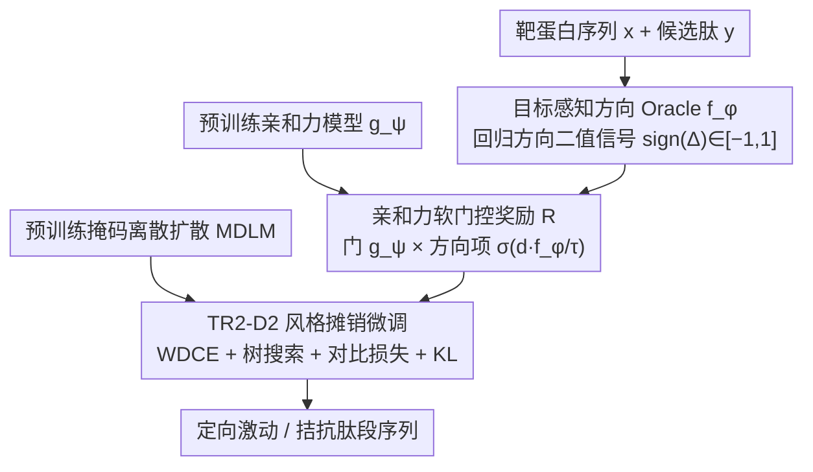

# TD3B: Transition-Directed Discrete Diffusion for Allosteric Binder Generation

**会议**: ICML 2026 Spotlight  
**arXiv**: [2605.09810](https://arxiv.org/abs/2605.09810)  
**代码**: https://huggingface.co/ChatterjeeLab/TD3B (有)  
**领域**: 医学与药物 / 离散扩散 / 蛋白质生成  
**关键词**: 变构调控、激动剂/拮抗剂、掩码离散扩散、方向 Oracle、门控奖励

## 一句话总结
TD3B 把激动剂/拮抗剂的设计当作「方向性转移算子」生成任务，用一个方向 Oracle + 亲和力门控 + 树搜索摊销微调的掩码离散扩散框架，让预训练肽段生成器学会写出能定向偏移蛋白质活/失活构象转移的多肽序列。

## 研究背景与动机
**领域现状**：当前主流的结合剂设计方法（RFdiffusion、BindCraft、BoltzGen、RareFoldGPCR 等）都把蛋白质当成一个固定 3D 结构，把任务定义为「稳定某个目标构象/界面」，本质是平衡态结构匹配。

**现有痛点**：变构调控（尤其 GPCR 的临床药效）取决于结合剂偏移「激活态 ↔ 失活态」转移方向的能力，而不是单纯稳定某一个构象。激动剂、拮抗剂之间的差别是动力学路径上的非对称扰动，纯结构方法没法系统区分它们，只能靠后置过滤或经验偏置，效果有限。

**核心矛盾**：变构功能本质是动力学/非平衡现象（非可逆、定向），而结构生成模型只编码平衡态先验，二者表征空间根本不匹配——结构-中心的方法压根没法表达「这个结合剂使转移方向偏向活化」这件事。

**本文目标**：设计一个能 (i) 显式建模激动 vs 拮抗的方向性、(ii) 与亲和力解耦但又只对真结合体生效、(iii) 复用已有强大肽段离散扩散先验的生成框架。

**切入角度**：作者借用 Markov 状态模型把变构动力学抽象为序列条件转移算子 $Q(y)=Q_0+\Delta Q(y)$，关键量是有向不对称性 $\Delta_{ij}(y)=Q(y)(s_i,s_j)-Q(y)(s_j,s_i)$；但实际无法观测其连续值，只能拿到 $\mathrm{sign}(\Delta(y))\in\{+1,-1\}$ 的离散标签。这给了一个非常诚实的监督口径：不回归动力学速率，只用方向信号。

**核心 idea**：把方向控制当作摊销目标引导（amortized guidance）叠在预训练 MDLM 上：方向 Oracle 给方向梯度、亲和力模型当软门控，组合成门控奖励再用 TR2-D2 风格的重要性加权去噪做微调。

## 方法详解

### 整体框架
TD3B 要解决的是「让生成器写出能定向偏移蛋白质活/失活转移的肽段」，而不是稳定某个 3D 构象。它把这件事拆成三层：先训一个能判断激动还是拮抗的方向 Oracle，再用预训练亲和力模型当软门把方向信号和"能不能结合"捏成单一门控奖励，最后用这个奖励去摊销微调一个预训练的掩码离散扩散肽段生成器。整套流程只在序列空间里做，从不进 3D 结构。

### 关键设计

**1. 目标感知方向 Oracle $f_\phi$：把动力学方向压成可监督的二值信号**

变构功能本质是动力学/非平衡现象，真实的有向不对称性 $\Delta_{ij}(y)=Q(y)(s_i,s_j)-Q(y)(s_j,s_i)$ 连续值无法观测，作者只拿得到 $\mathrm{sign}(\Delta(y))\in\{+1,-1\}$。Oracle $f_\phi(y,x)\to[-1,1]$ 因此只回归方向而不回归速率：给定靶蛋白序列 $x$ 和候选肽 $y$，用预训练编码器分别池化得 $h_x,h_y$，再门控融合 $z=g\odot h_x+(1-g)\odot h_y$（其中 $g=\sigma(W_g[h_x;h_y]+b_g)$）后过 MLP 出标量分数。监督用带置信度权重的二分类 $\mathcal{L}_{\text{dir}}=\mathbb{E}[\kappa(y)\log(1+\exp(-d\cdot f_\phi(y,x)))]$，对 partial agonist 给较低置信度 $\kappa_{\text{part}}\in(0,1)$。这样既诚实地匹配了只有粗粒度标签的监督口径（强行回归连续速率反而会把模型带偏），门控融合又能让 Oracle 同时利用靶点上下文和结合剂结构，比简单拼接更灵活。

**2. 亲和力软门控奖励：先要是结合体，方向只在结合空间里挑**

如果直接把方向当损失，模型很容易生成「方向对但根本不结合」的废序列；而把方向和亲和力做成显式 Pareto 加权又难调权重、会在两个目标间来回摇摆。TD3B 改用乘性门：$R(y;d^\star,x)=g_\psi(y,x)\cdot\sigma(d^\star\cdot f_\phi(y,x)/\tau)$，其中预训练亲和力模型 $g_\psi\in[0,1]$ 当乘性门，方向项 $\sigma(d^\star f_\phi/\tau)$ 当加性偏移。这样只有「真能结合 + 方向正确」的序列才拿高奖励：非结合体被门乘成零、方向反的被压低。本质是把「先得是结合体」当成硬条件，方向偏好只在结合空间里筛，避免了后置 Pareto trade-off。

**3. TR2-D2 风格摊销微调 + 方向对比损失：把奖励烘进采样分布**

纯 RL 在离散扩散上方差大，TD3B 把门控奖励摊销进 MDLM 的采样分布。训练目标 $p^\star(y)\propto p_{\theta_0}(y)\exp(S(y)/\alpha)$ 用重要性加权去噪交叉熵（WDCE）优化，轨迹级重要性权重 $w(y_{0:1})\propto\exp(S(y_1)/\alpha)\prod_n p_{\theta_0}/p_{\bar\theta}$ 矫正 proposal 偏差；采样侧再叠 PepTune 风格的轨迹感知树搜索，由门控奖励指引重要性加权选支——树搜索负责探索、WDCE 负责把方向内化。为了防止 Oracle 只在分类头层面学到方向差异，再加一个 margin-based 对比损失 $\mathcal{L}_{\text{ctr}}=\sum_P\|h_\theta(y_i)-h_\theta(y_j)\|^2+\sum_N\max(0,m-\|\cdot\|)^2$ 在表示空间把同向样本拉近、反向拉远；最后 KL 项把 $\theta$ 拴在 $\theta_0$ 附近避免漂走。

### 损失函数 / 训练策略
总损失 $\mathcal{L}=\mathcal{L}_{\text{WDCE}}+\lambda_{\text{ctr}}\mathcal{L}_{\text{ctr}}+\lambda_{\text{reg}}\mathcal{L}_{\text{KL}}$。训练数据 $\{(x,y,a)\}$ 来自带功能标签（full/partial agonist、antagonist、negative）的肽段-靶点对，negative 不参与方向损失但贡献亲和力门训练。

## 实验关键数据

### 主实验
论文用 GPCR 等临床相关靶点验证 TD3B 能否在「方向选择性」上超过结构基线和推理时引导基线。核心评估维度是同一靶点生成的激动 vs 拮抗序列在功能空间的可分性与亲和力维持。

| 设定 | 评估指标 | TD3B | 结构基线 (RFdiffusion 等) | 关键差异 |
|------|---------|------|---------------------------|----------|
| 激动剂定向生成 | 方向选择性 | 显著正向 | 接近随机 | 结构方法无法编码方向 |
| 拮抗剂定向生成 | 方向选择性 | 显著负向 | 接近随机 | 同上 |
| 亲和力维持 | 预测亲和力 | 与结构基线相当 | 基准 | 门控保证不退化 |
| 推理时引导基线 | 后置过滤后方向 | 不如 TD3B | — | 后置过滤丢吞吐 |

### 消融实验

| 配置 | 现象 |
|------|------|
| Full TD3B | 方向 + 亲和力同时达成 |
| w/o 亲和力门 | 容易生成「方向对但不结合」的废序列 |
| w/o 对比损失 | Oracle 在表示空间方向分离度下降 |
| 把门换成 Pareto 加权 | 权重难调，方向-亲和力此消彼长 |
| 推理时引导而非微调 | 多样性和方向准确率都下降 |

### 关键发现
- 摊销微调比单纯推理时引导更可靠：在离散空间里梯度引导本来就受限，把奖励烘进模型分布是更稳的路径。
- 把亲和力做成软门而非 Pareto 项是关键工程决策；后者会让模型在两个目标间「来回摇摆」。
- 即使方向监督是粗粒度二值标签，对比损失也能在表示空间放大它的可分性。

## 亮点与洞察
- **「方向作为生成目标」**：第一个把变构功能的方向性显式作为序列生成的优化方向，而不是后置过滤；这给「功能导向蛋白质设计」开了新接口。
- **门控奖励的设计哲学**：把「必要条件（结合）」做成软门、「方向偏好」做成加性项，是一个比 Pareto 加权更干净的多目标融合范式，可迁移到任何「先要 X 再优化 Y」的生成任务。
- **诚实的监督粒度**：作者明确不去回归连续动力学速率，只用 $\mathrm{sign}(\Delta)$，这种「理论框架超前于监督粒度但不强行外推」的处理在生物 ML 里值得借鉴。

## 局限与展望
- 监督只到方向粗粒度，没法直接量化「强度」——临床上 partial agonist 的细分还需更细标签或主动学习。
- 整套方法基于序列空间，不显式建模 3D 接口，复杂构象间通讯路径可能丢失结构特异性。
- Oracle 训练数据集（带功能标签的肽-靶点对）规模受限，GPCR 之外能否泛化未充分验证。
- 树搜索 + WDCE 计算成本不小，相比 inference-only 引导吞吐更慢。
- 亲和力门 $g_\psi$ 本身是预训练模型，它的偏差会被无缝传染到 TD3B。

## 相关工作与启发
- **vs RFdiffusion / BindCraft / BoltzGen**: 它们都是结构-中心方法，目标是稳定接触界面；TD3B 把目标改为偏移转移方向，互补而非替代。
- **vs PepTune / TR2-D2**: 同样基于 MDLM 的引导微调，但任务目标是亲和力或多目标 Pareto；TD3B 引入方向监督把目标拓展到动力学层面。
- **vs DRAKES / GLID2E**: 都用 RL 风格更新离散扩散策略，TD3B 用更稳定的摊销 + 树搜索路径并把奖励结构化为门控形式。
- **vs Classifier Guidance / SMC**: 离散域里梯度引导受限，本文用 amortize 化解。

## 评分
- 新颖性: ⭐⭐⭐⭐⭐ 把方向性变构控制做成扩散生成目标，这条线之前几乎是空白
- 实验充分度: ⭐⭐⭐ GPCR 验证是好的起点，但跨家族泛化和真实湿实验验证仍待补
- 写作质量: ⭐⭐⭐⭐ 数学框架（转移算子→方向监督→门控奖励）层层递进，动机非常清晰
- 价值: ⭐⭐⭐⭐ 给 GPCR 这类临床高价值靶点的功能性结合剂设计提供了新范式

<!-- RELATED:START -->

## 相关论文

- [\[ICLR 2026\] Ultra-Fast Language Generation via Discrete Diffusion Divergence Instruct](../../ICLR2026/computational_biology/ultra-fast_language_generation_via_discrete_diffusion_divergence_instruct.md)
- [\[NeurIPS 2025\] Constrained Discrete Diffusion](../../NeurIPS2025/computational_biology/constrained_discrete_diffusion.md)
- [\[ICLR 2026\] Discrete Diffusion Trajectory Alignment via Stepwise Decomposition](../../ICLR2026/computational_biology/discrete_diffusion_trajectory_alignment_via_stepwise_decomposition.md)
- [\[ICML 2025\] PepTune: De Novo Generation of Therapeutic Peptides with Multi-Objective-Guided Discrete Diffusion](../../ICML2025/computational_biology/peptune_de_novo_generation_of_therapeutic_peptides_with_multi-objective-guided_d.md)
- [\[ICML 2025\] GenMol: A Drug Discovery Generalist with Discrete Diffusion](../../ICML2025/computational_biology/genmol_a_drug_discovery_generalist_with_discrete_diffusion.md)

<!-- RELATED:END -->
