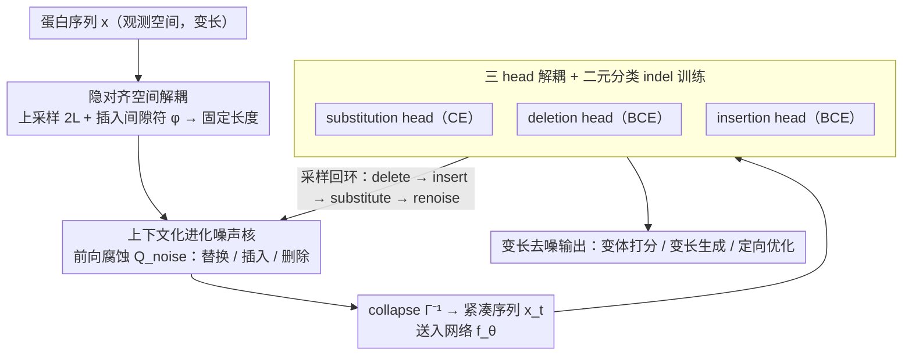

# Towards A Generative Protein Evolution Machine with DPLM-Evo

**会议**: ICML 2026  
**arXiv**: [2605.00182](https://arxiv.org/abs/2605.00182)  
**代码**: 无  
**领域**: 蛋白质生成 / 离散扩散 / 生物医学  
**关键词**: 蛋白质语言模型, 离散扩散, 进化建模, 变长生成, 插入删除

## 一句话总结
本文提出 DPLM-Evo，把蛋白质语言模型的离散扩散从"只支持掩码替换"扩展为"显式建模替换+插入+删除三种进化编辑"，通过把变长观测序列解耦到上采样长度的隐对齐空间 + 上下文化进化噪声核，实现变长进化生成、进化轨迹式的蛋白质后编辑/优化，并在 ProteinGym 单序列变体效应预测上取得 SOTA。

## 研究背景与动机

**领域现状**：蛋白质语言模型（PLM，如 ESM、ProGen、DPLM、DPLM-2）从大规模序列库中学习进化约束，应用包括零样本变体效应预测、结构预测、序列生成。其中离散扩散类 PLM（DPLM 系列）因双向感受野和长程依赖建模能力，在表征和生成上均强于自回归 PLM。

**现有痛点**：现有 DPLM 用 absorbing-state（掩码）作为前向噪声核，生成被简化为"迭代掩码恢复"。这与生物学本质不符——蛋白质进化不是从掩码涌现，而是通过累积的离散编辑（substitution、insertion、deletion）操作，indels 对重塑 loop、调 linker 长度、生成/移除短 motif 至关重要。掩码扩散缺少原生 indel 动作、固定长度生成框架笨拙，难以表达变长进化轨迹或对现有蛋白做真实的 post-editing。

**核心矛盾**：标准离散扩散定义在固定维分类状态空间上，而 indel 必然改变序列长度——这两套数学结构本质不兼容。

**本文目标**：构造一个统一离散扩散框架，让前向噪声 + 反向去噪都显式表达 substitution / insertion / deletion 三种进化编辑动作，支持变长生成 + 进化式后编辑 + 现有蛋白定向优化。

**切入角度**：借鉴 CTC / EditFlow 类隐对齐思路——把变长观测序列空间 $\mathcal{X}$ 解耦到上采样长度（$2L$）的隐对齐空间 $\mathcal{Z}$，后者通过插入间隙符 $\phi$ 把变长问题转成固定长度问题；扩散过程定义在 $\mathcal{Z}$ 上，而神经网络只看 $\mathcal{X}$ 上的 collapsed 序列。

**核心 idea**：在隐对齐空间用一个统一转移矩阵 $\mathbf{Q}_{\mathrm{noise}}$ 编码 $\mathcal{A}\leftrightarrow\phi$ 的三类转移（替换/插入/删除），辅以"上下文化进化噪声核"——把替换噪声替换成模型自身预测的条件分布，使腐蚀过程符合进化偏好；解码时用 substitution/deletion/insertion 三个独立 head，每步依次执行 delete→insert→substitute→renoise 完成变长去噪。

## 方法详解

### 整体框架
DPLM-Evo 要解决的是一个根本性的不兼容：标准离散扩散定义在固定维状态空间上，而 indel 必然改变序列长度。它的破局思路是把变长建模"搬家"到一个固定长度的隐空间里去做。具体而言，模型同时维护观测空间 $\mathcal{X}=\mathcal{V}^L$（$\mathcal{V}=\mathcal{A}\cup\{\mathbf{m}\}$，含 mask）和上采样到 $2L$ 的隐对齐空间 $\mathcal{Z}=(\mathcal{V}\cup\{\phi\})^{2L}$（$\phi$ 是 gap 占位符）；collapse 函数 $\Gamma^{-1}(\mathbf{z})$ 把隐序列里所有 $\phi$ 去掉还原成观测序列，反过来 $\Gamma(\mathbf{x})$ 就是 $\mathbf{x}$ 的所有合法对齐集合。前向扩散 $q_t(\mathbf{z}_t|\mathbf{z}_0)=\bar\alpha_t\delta_{\mathbf{z}_0}+(1-\bar\alpha_t)\pi(\mathbf{z}_0)$ 完全在隐空间进行，而神经网络 $f_\theta$ 只看 collapse 后的紧凑观测序列 $\mathbf{x}_t=\Gamma^{-1}(\mathbf{z}_t)$，用三个 head 分别预测每个 token 的 substitution 分布、deletion 概率和右侧 insertion 概率。整套机制由 ELBO $\log p_\theta(\mathbf{x}_0)\geq\mathbb{E}_{\mathbf{z}_0\in\Gamma(\mathbf{x}_0)}[\mathbb{E}_{q_t}[\log p_\theta(\mathbf{z}_0|\mathbf{z}_t)]]$ 统一起来，对 $\mathbf{x}_0$ 的所有合法对齐取期望。

### 关键设计

**1. 隐对齐空间解耦变长 indel：把变长演化变成固定长度的 token 替换问题**

直接在变长序列上定义 Markov 过程极其复杂——每一步都要联合采样长度和内容，没有现成工具能用。DPLM-Evo 的做法是把序列上采样 2 倍并插入间隙占位 $\phi$（例如 $[A,B,C]\mapsto[A,\phi,\phi,B,\phi,C]$），这样 indel 就退化成隐空间里 $\mathcal{A}\leftrightarrow\phi$ 之间的普通 token 替换：删除是"氨基酸变 $\phi$"，插入是"$\phi$ 变氨基酸"。前向腐蚀由统一转移矩阵 $\mathbf{Q}_{\mathrm{noise}}$ 用三个超参 $(\omega_{\mathrm{del}},\omega_{\mathrm{ins}},\rho_{\mathrm{mask}})$ 控制：氨基酸状态以概率 $1-\omega_{\mathrm{del}}$ 替换为另一氨基酸（其中 $\rho_{\mathrm{mask}}$ 比例直接变 mask）、以概率 $\omega_{\mathrm{del}}$ 变 $\phi$ 完成删除；$\phi$ 状态则以概率 $\omega_{\mathrm{ins}}$ 变为氨基酸完成插入。反向去噪时再用 $\Gamma^{-1}$ 把隐序列投回观测空间。这个转化之所以有效，是因为它让全部固定长度扩散的成熟工具链原样复用；而 2 倍上采样的设计保证净插入量不超过原长 $L$，恰好覆盖 loop 长度、linker 长度调整这类典型蛋白工程场景。一个额外的红利是：既然隐空间里的腐蚀本质还是 mask/替换，DPLM-Evo 就能直接从已有的 masked DPLM 权重初始化，相当于"以最小改动"扩展出 indel 能力。

**2. 上下文化进化噪声核：让前向噪声符合真实进化偏好而非随机突变**

替换矩阵 $\mathcal{T}_{\mathrm{sub}}$ 有三档选择，从弱到强分别是：均匀矩阵 $\mathbf{U}_K=\tfrac{1}{K}\mathbf{1}\mathbf{1}^\top$、静态生物学先验 $\mathbf{M}_{\mathrm{BLOSUM}}$，以及本文主推的上下文化形式 $\mathcal{T}_{\mathrm{sub}}^{(j)}=\mathbb{E}_{q'_t(\mathbf{z}'_t|\mathbf{z}_0)}[p_\theta(\cdot|\mathbf{z}'^{\setminus j}_t,\mathbf{m})]$——把目标位 $j$ 强制 mask 掉，让模型在 partial-masked 上下文里预测这一位"应该"是什么，用这个条件分布当噪声。问题的痛点在于：uniform 噪声会把 "Lys → Trp" 这种生物上极罕见的转换当成和 "Lys → Arg" 一样重要的学习信号，白白浪费模型容量；而用模型自己的条件预测当噪声，模型见到的腐蚀就更接近真实进化中可能出现的保守替换和上下文偏好突变，训练效率更高，也逼着模型显式捕捉进化与同源依赖。实现上采用 warmup 策略：先用简单 mask 噪声训练，warmup 后再切换到这种 self-prediction 噪声；当 $t=1$ 完全噪声时它退化为 $p_\theta(\cdot|\mathbf{m}^L)$，给出反映自然氨基酸统计的可学先验，而不是一个手工固定的矩阵。

**3. 三 head 解耦 + 二元分类 indel 训练：解决 indel 类不平衡导致的模式崩溃**

substitution、deletion、insertion 三个任务如果挤在一个 multinomial 输出里预测（把 $\phi$ 当成扩展词表里和氨基酸并列的一个 token），实验里会直接崩——因为生物序列中 substitution 远多于 indel，类别极度不平衡会诱发 deletion mode collapse（模型偷懒把所有位都预测成删除）和 insertion 训练发散。DPLM-Evo 把三个任务彻底解耦：先用 Index Mapping Function $\mathcal{I}:\{1,\dots,L_t\}\to\{1,\dots,N\}$ 把观测 token 映射回隐序列位置，再按 $(\mathbf{z}_t,\mathbf{z}_0)$ 的 token 类别组合定义三个互斥损失。其中 $\mathcal{L}_{\mathrm{sub}}^{(k)}$ 只在两端都是氨基酸且不相同时生效（标准 CE 预测换成什么），而两个 indel 损失改成二元分类——$\mathcal{L}_{\mathrm{del}}^{(k)}=\mathrm{BCE}(\mathbb{I}_{\mathbf{z}_0^{(\mathcal{I}(k))}=\phi},p_\theta^{\mathrm{del}})$ 只判"删不删"，$\mathcal{L}_{\mathrm{ins}}^{(k)}=\mathrm{BCE}(\mathbb{I}_{v_{\mathrm{next}}^{(k)}\neq\emptyset},p_\theta^{\mathrm{ins}})$ 只判"插不插"，加权汇总成 $\mathcal{L}_t=\mathbb{E}[\sum_k\lambda_{t-1}(\gamma_{\mathrm{sub}}\mathcal{L}_{\mathrm{sub}}+\gamma_{\mathrm{del}}\mathcal{L}_{\mathrm{del}}+\gamma_{\mathrm{ins}}\mathcal{L}_{\mathrm{ins}})]$。这样一来"要不要删/插"和"插什么/换什么"被拆成两件事，类别不平衡被局限在 BCE 内部，既保持理论一致性又让训练稳定下来。

### 损失函数 / 训练策略
- 总损失 $\mathcal{L}_t=\mathbb{E}_{\mathbf{x}_0,\mathbf{z}_0,\mathbf{z}_t}[\sum_k\lambda_{t-1}(\gamma_{\mathrm{sub}}\mathcal{L}_{\mathrm{sub}}^{(k)}+\gamma_{\mathrm{del}}\mathcal{L}_{\mathrm{del}}^{(k)}+\gamma_{\mathrm{ins}}\mathcal{L}_{\mathrm{ins}}^{(k)})]$，三个 $\gamma$ 调节模型对不同进化操作的偏好。
- 训练流程：从 pretrained DPLM 初始化 → warmup 阶段用 mask 噪声 → 切换到上下文化进化噪声核继续训练。
- 采样：维护 noisy index 集 $\mathcal{N}_t$，每步依次执行 (i) 对 $p_\theta^{\mathrm{del}}>\tau_{\mathrm{del}}$ 的位删除；(ii) 对 $p_\theta^{\mathrm{ins}}>\tau_{\mathrm{ins}}$ 的位右侧插入 $\mathbf{m}$；(iii) 对所有 noisy 与 mask 位用 substitution head 填充；(iv) 用进化噪声核 re-noise 最不置信的位置。

## 实验关键数据

### 主实验
作者评估了多类任务（论文摘要给出主要结论；详细数字在附录中）：

| 任务 | 指标 | DPLM-Evo 表现 | vs 之前 SOTA |
|------|------|--------------|--------------|
| ProteinGym 变体效应预测（单序列） | Spearman 相关 | **SOTA** | 优于 masked-scoring 的 DPLM/ESM |
| 无条件 substitution-only 生成 | 折叠性 / 多样性 | 与 DPLM 相当或更好 | 同维度持平 |
| 完整 edit operations（含 indel）生成 | 变长可行 | 原生支持 | 掩码扩散无法实现 |
| Motif scaffolding（条件生成） | scaffold 成功率 / 可调长度 | 通过 ins/del head 动态调整 scaffold 长度 | 固定长度方法做不到 |
| GFP 定向进化优化 | 显式编辑轨迹 | 通过迭代 substitution+indel 提升 fluorescence | 掩码扩散无 trajectory |

DPLM-Evo 不再走"mask 待预测残基→读 logits"的常规变体打分流程，而是直接输入野生型并评估替换分布，这点本身是 substitution-based 模型独有能力。

### 消融实验

| 配置 | 关键指标 | 说明 |
|------|---------|------|
| 完整 DPLM-Evo（上下文化核 + 三 head BCE） | 最佳 ProteinGym 性能 | full model |
| $\mathcal{T}_{\mathrm{sub}}=\mathbf{U}_K$（均匀核） | 显著下降 | uninformative 噪声拖慢学习 |
| $\mathcal{T}_{\mathrm{sub}}=\mathbf{M}_{\mathrm{BLOSUM}}$（静态先验） | 居中 | 比 uniform 好但不如 self-conditional |
| 原始 multinomial indel loss（无 BCE） | mode collapse | deletion 全预测、训练发散 |
| $\omega_{\mathrm{del}}=\omega_{\mathrm{ins}}=0$（关 indel） | 退化为 DPLM | 无变长能力 |
| $\rho_{\mathrm{mask}}=1$（纯 mask）| 退化为 absorbing diffusion | 经典 DPLM/MaskedDiff |
| $\rho_{\mathrm{mask}}=0$（纯 uniform）| 退化为 uniform diffusion | Austin et al. 2021 |

### 关键发现
- **上下文化进化噪声核 > 静态 BLOSUM > 均匀**：模型自预测的腐蚀分布更接近真实进化偏好，作者预备实验明确确认 (iii) 是最佳选择，因此设为默认。
- **二元化 indel 损失对训练稳定性至关重要**：原始 multinomial 形式导致 deletion mode collapse 和 insertion 不稳，BCE 形式既保持理论一致性又稳定训练。
- **统一框架的可降级性**：通过调 $\omega_{\mathrm{del}},\omega_{\mathrm{ins}},\rho_{\mathrm{mask}}$ 可严格退化为 masked diffusion、uniform diffusion 或两者混合，方便从已有 masked PLM 热启。
- **单序列 ProteinGym SOTA** 说明显式建模 substitution（而非 mask-and-recover）在变体打分上更自然——可直接对未 mask 的野生型每个位置读出替换分布，省了 mask-loop 而且更符合"评估某位点的替换偏好"这一任务定义。
- **2L 上采样设计**意味着 net insertion 不能超过原长，这对工程场景（loop 调整 5-30 个残基）足够，但对极端长度扩张（domain duplication）不适用。

## 亮点与洞察
- **隐对齐空间的解耦设计**：把"变长 indel 演化"映射到"固定长度对齐空间内的 token 替换"，是个非常优雅的数学转化。这种"上采样 + 间隙 + collapse"模式在 CTC、EditFlow、DreamOn 等不同领域都有出现，DPLM-Evo 把它系统应用到蛋白质扩散是首次。
- **生物先验作为可学噪声核**：把 "self-prediction 作为进化噪声"是个新颖思路——不再依赖手工 BLOSUM/PAM 矩阵，而是让模型自己定义"什么变换在当前上下文里是合理的"，相当于把进化偏好从 fixed prior 升级到 learnable & contextual prior。
- **统一 + 可降级框架**：transition matrix 一组超参可覆盖现有所有离散扩散变种（masked / uniform / mixed），既给现有方法一个统一视角，又方便实践中从任意已有 checkpoint 启动。这种 "general → specialized" 的设计哲学很值得借鉴。
- **变长生成解锁 protein engineering 三大场景**（loop 重塑、motif scaffold 长度可调、定向进化 trajectory）—— 把"扩散模型 = 固定长度生成器"这一长期假设打破，让扩散类模型真正贴合"蛋白质工程是编辑工作"的本质。

## 局限与展望
- 2L 上采样硬限制了 net insertion 上限为 $L$，遇到需要 domain duplication（如串联重复、二聚体化）等极端长度扩张的场景就不够用；可考虑动态上采样比或多步级联生成。
- 上下文化噪声核需要在 warmup 后用模型自身生成噪声，训练成本和不稳定性都更高（self-bootstrapping 类训练经常需要 stop-gradient、target network 等 trick）；论文给出的"warmup→切换"策略缺少消融对比 warmup 时长的影响。
- 实验缺中文笔记可见的具体数字（cache 截断在 ProteinGym 介绍处），只能看到定性结论"single-sequence SOTA"；与 ESM-2、SaProt 这类 SOTA 的具体差距、生成结构的 TM-score/pLDDT 等关键指标需要从附录补全。
- Motif scaffolding 时引入了"额外结构 encoder"处理 motif 坐标，但 scaffold 长度由 ins/del head 动态决定 vs 固定预测哪个更可靠没充分对比；scaffold 多样性、设计可行率这类生物意义指标缺少基线。
- 对长蛋白（>500 残基）扩散步数和计算成本未讨论，工业应用可行性尚需进一步验证。

## 相关工作与启发
- **vs DPLM/DPLM-2（masked diffusion 系）**：DPLM 只能做 mask-predict，固定长度；DPLM-Evo 把噪声核从 mask 推广到 mask+sub+ins+del，是 DPLM 在表达能力上的严格超集。
- **vs ESM-2/ESM-3（自编码 PLM）**：ESM 类需要"mask 残基→读 logits"做变体打分；DPLM-Evo 用替换分布原生评分，更符合任务语义、ProteinGym 单序列设定下 SOTA。
- **vs EditFlow / DreamOn（变长文本扩散）**：同样用隐对齐 + 间隙符思想做变长生成，但目标域是文本；DPLM-Evo 把这套机制迁移到蛋白质 + 加上生物先验噪声核，针对性更强。
- **vs ProGen/RFdiffusion（自回归 PLM / 结构扩散）**：自回归只能从前往后生成、不擅长 post-editing；结构扩散关注 3D 坐标而非进化轨迹；DPLM-Evo 填补了"序列 + 变长 + 编辑式生成"的空白。
- **vs Discrete diffusion 一族（Austin et al. 2021, SEDD 等）**：DPLM-Evo 提出的统一 transition matrix 把这一族方法都纳入框架内，并指出 indel 是被长期忽视的维度，对整个离散扩散研究都有方法论启发。

## 评分
- 新颖性: ⭐⭐⭐⭐⭐ 把变长进化编辑显式融入离散扩散是真正的范式扩展；上下文化噪声核也是新设计。
- 实验充分度: ⭐⭐⭐⭐ 任务覆盖理解（ProteinGym）+ 无条件生成 + 条件生成 + 定向优化四大类，但提供的具体数字仍需查附录、量化对比待完善。
- 写作质量: ⭐⭐⭐⭐ 数学推导（ELBO、$\mathbf{Q}_{\mathrm{noise}}$、ELBO 分解、与现有方法的退化关系）干净自洽；个别符号密度大需要扩散建模背景。
- 价值: ⭐⭐⭐⭐⭐ 给蛋白质工程界提供了第一个支持编辑式生成 + 变长 + 进化先验的扩散 PLM，对 directed evolution、scaffold engineering、loop optimization 等场景有直接落地潜力。

<!-- RELATED:START -->

## 相关论文

- [\[NeurIPS 2025\] Steering Generative Models with Experimental Data for Protein Fitness Optimization](../../NeurIPS2025/computational_biology/steering_generative_models_with_experimental_data_for_protein_fitness_optimizati.md)
- [\[ICML 2026\] On the Collapse of Generative Paths: A Criterion and Correction for Diffusion Steering](on_the_collapse_of_generative_paths_a_criterion_and_correction_for_diffusion_ste.md)
- [\[ICLR 2026\] DistMLIP: A Distributed Inference Platform for Machine Learning Interatomic Potentials](../../ICLR2026/computational_biology/distmlip_a_distributed_inference_platform_for_machine_learning_interatomic_poten.md)
- [\[ICML 2025\] Reliable Algorithm Selection for Machine Learning-Guided Design](../../ICML2025/computational_biology/reliable_algorithm_selection_for_machine_learning-guided_design.md)
- [\[ICML 2026\] Protein Language Model Embeddings Improve Generalization of Implicit Transfer Operators](protein_language_model_embeddings_improve_generalization_of_implicit_transfer_op.md)

<!-- RELATED:END -->
