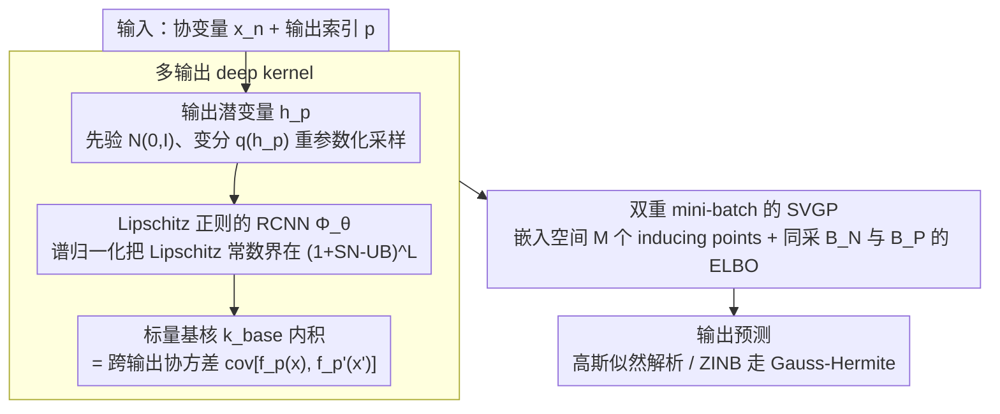

# Transformed Latent Variable Multi-Output Gaussian Processes

**会议**: ICML 2026  
**arXiv**: [2605.05133](https://arxiv.org/abs/2605.05133)  
**代码**: 论文未在正文给出明确仓库地址  
**领域**: 计算生物
**关键词**: 多输出高斯过程、深度核、Lipschitz 正则、SVGP、谱归一化

## 一句话总结
本文提出 T-LVMOGP：把多输出 GP 的核心建模问题——跨输出协方差 $k_{p,p'}(x, x')$ 的构造——转化成"在 Lipschitz 正则的 RCNN 嵌入空间里用单个标量基核做内积"，并完整嵌入 SVGP 框架，使 MOGP 第一次能可扩展且高表达力地处理 $P > 10000$ 输出（含 ZINB 似然的空间转录组数据），同时全面胜过 SV-LMC / OILMM / GS-LVMOGP 等基线。

## 研究背景与动机
**领域现状**：多输出 GP（MOGP）把单输出 GP 推广到向量值观测，在医疗时序、气候建模、空间转录组、机器人逆动力学等场景应用广泛。经典方案 LMC 把每个输出 $f_p$ 写成共享潜在 GP 的线性组合 $f_p = \sum_{q,r} \alpha_{p,r}^{(q)} g_r^{(q)}$，跨输出协方差等价于在潜在输出嵌入上做线性核，结构上是低秩。LV-MOGP 进一步给每个输出配潜变量 $h_p$ 并在 $\{h_p\}$ 上施任何有效核，扩展到 GS-LVMOGP 的 sum-of-separable 核。

**现有痛点**：标准 MOGP 复杂度对输出数 $P$ 是 $O(P^3)$，在气候（$P \sim 10^4$）和空间转录组（$P \sim 5000$ 基因）等高维输出场景直接爆。现有可扩展方案要么强制 Kronecker / 低秩 / sum-of-separable 这种刚性结构假设，要么用单纯神经嵌入的 deep kernel 又会陷入特征坍塌、距离感知丧失、过度自信预测等病。

**核心矛盾**：可扩展性、结构灵活性、不确定性可靠性三者很难同时满足——LMC/OILMM 牺牲表达力换可扩展，naïve deep kernel GP 牺牲不确定性换表达力，GS-LVMOGP 用 sum-of-separable 仍被固定核类结构所限。

**本文目标**：构造一个 MOGP 框架同时做到 (i) 对 $P$ 可扩展（mini-batch over both inputs & outputs）；(ii) 跨输出协方差不需任何结构假设；(iii) 保留 GP 的距离感知与不确定性可信度；(iv) 自然兼容非高斯似然与近期的 tighter variational bounds。

**切入角度**：把 MOGP 的两件事——"为每个 output 分配嵌入"与"在嵌入上算协方差"——分开。前者交给可学习的潜变量 $h_p$ + 神经映射，后者交给标准的单输出 SVGP 推断流程；只要嵌入空间满足 Lipschitz 连续性，deep kernel 的病就能被压住。

**核心 idea**：把 $(x, h_p)$ 拼起来经过一个 Lipschitz-RCNN $\Phi_\theta$ 映到嵌入空间，跨输出协方差 $\text{cov}[f_p(x), f_{p'}(x')] = k_{\text{base}}(\Phi_\theta(x, h_p), \Phi_\theta(x', h_{p'}))$，从而把 MOGP 还原成一个 inducing points 在嵌入空间的标量 GP，可以直接套 SVGP 的小批量训练。

## 方法详解

### 整体框架
T-LVMOGP 要解决的是"如何不靠任何刚性结构假设就把多输出 GP 推到上万个输出"。它的做法是把 MOGP 拆成两件互不干扰的事：先给每个输出学一个潜变量嵌入，再在嵌入空间里用一个普通的标量 GP 算相似度。具体由三层串起来——潜变量层给每个输出 $p$ 一个高斯先验 $p(h_p) = \mathcal{N}(0, I)$、用变分分布 $q(h_p) = \mathcal{N}(m_p, \Sigma_p)$ 近似；嵌入层用 Lipschitz 正则的残差网络 $\Phi_\theta : \mathbb{R}^{D_X} \times \mathbb{R}^{D_H} \to \mathbb{R}^{D_T}$ 把 $(x_n, h_p)$ 编码成 $\tilde{x}_{n,p}$；GP 层在嵌入空间放 $M$ 个 inducing points $Z$，用标准 SVGP 算 $q(f_p(x_n)) = \int q(u) p(f_p(x_n) | u) du$。整条链路靠重参数化 $h_p^{(j)} = m_p + \Sigma_p^{1/2} \epsilon^{(j)}$ 保持可微，训练时同时对输入 $\mathcal{B}_N$ 与输出 $\mathcal{B}_P$ 采 mini-batch。

### 关键设计

**1. 潜变量 + 神经嵌入构造的多输出 deep kernel：摆脱低秩/Kronecker 镣铐**

MOGP 一直被诟病的地方是跨输出协方差 $k_{p,p'}(x, x')$ 要么写成低秩线性组合（LMC/OILMM），要么强行 sum-of-separable（GS-LVMOGP），表达力被结构假设卡死。本文给每个输出配一个可学习潜变量 $h_p$，把"输出 ID"和"输入"拼在一起送进 $\Phi_\theta$ 得到嵌入点 $\tilde{x}_{n,p}$，然后所有跨输出协方差统一写成嵌入空间里的一个标量基核内积 $k_{p,p'}(x, x') = k_{\text{base}}(\Phi_\theta(x, h_p), \Phi_\theta(x', h_{p'}))$（默认用 ARD-RBF）。这一步把整个 $P$ 维多输出 GP 收缩成嵌入空间里的单个标量 GP，既能无缝接 SVGP 从根上绕开 $O(P^3)$ 复杂度，又通过对 $h_p$ 做贝叶斯处理保留了对输出关系的不确定性、避免点估计过拟合。表达力上没有损失：附录 D 证明这一核类严格包含 LV-MOGP 的 separable 核与 sum-of-separable 核作为特例。

**2. Lipschitz 正则的 RCNN：给 deep kernel 装上保险栓**

deep kernel 直接用神经网络做嵌入会犯三个老毛病——特征坍塌、距离感知丧失、对 OOD 输入过度自信，根源都是网络可以把远点任意"压扁"。本文用一个可控 Lipschitz 常数的残差网络（RCNN）当 $\Phi_\theta$：残差连接保表达力，每层权重用谱归一化（power iteration 估最大奇异值）把谱范数压在上界 SN-UB 内，于是 $L$ 层网络的整体 Lipschitz 常数被界在 $(1 + \text{SN-UB})^L$ 以内。这样嵌入映射不会把相距很远的输入压到一起，GP "近相似、远不同"的距离感知在嵌入空间仍然成立；Bartlett 等的结果保证这种受限参数化依然能表示一大类平滑 Lipschitz 映射，没有牺牲拟合能力。这个约束并非锦上添花——消融里去掉谱归一化后 EEG 的 NLL 从 0.814 暴涨到 4.109，是所有消融中影响最大的一项。

**3. 双重 mini-batch 的 SVGP：把 $P>10^4$ 训得动，且即插即用非高斯似然与紧 bound**

要真的扩展到上万输出，光靠 deep kernel 还不够，推断本身得对输入数 $N$ 和输出数 $P$ 同时可扩展。本文在嵌入空间放 $M$ 个 inducing points $Z$，写出 ELBO

$$\mathcal{L}_3 = \sum_n \sum_p \mathbb{E}_{q(h_p) q(f_p(x_n))}[\log p(y_{n,p}|f_p(x_n))] - \mathrm{KL}[q(u)\|p(u)] - \sum_p \mathrm{KL}[q(h_p)\|p(h_p)]$$

关键点在于把 $P$ 维输出空间也当成一个"可采样维度"：之前 SVGP-on-MOGP 大多只对输入做 mini-batch，本文同时采 $\mathcal{B}_N$ 与 $\mathcal{B}_P$ 估计 $\tilde{\mathcal{L}}_3$，这才让 $P>10^4$ 的训练在现实显存里跑得动。整体复杂度退化成 $O(N_b P_b M^2 + M^3)$，再加谱归一化的 $O(Tmn)$（因为 RCNN 宽 $\sim 10$、深 $\sim 5$，这项基本可忽略）。框架对似然完全不挑：高斯似然下期望解析可得，ZINB 这类非高斯似然用 Gauss-Hermite quadrature 或 MC 估计即可，因此空间转录组那种零膨胀计数数据能用同一个模型处理。Titsias 2025 / Bui 2025 的 tighter variational bound 也能即插即用，只需补一项 $\Delta = \frac{1}{2} \sum_n [d_n / \sigma_y^2 - \log(1 + d_n/\sigma_y^2)]$。

### 损失函数 / 训练策略
训练目标就是负 ELBO $-\mathcal{L}_3$：高斯似然解析算期望，非高斯似然走 Gauss-Hermite quadrature 或 MC + 重参数化，输入与输出两侧同时采 mini-batch。主要超参是 inducing points 数 $M$、谱范数上界 SN-UB、潜变量维度 $D_H$ 与嵌入维度 $D_T$；其中 SN-UB 呈现明显的 trade-off 曲线（太严失表达力、太松过拟合），需按数据集调——EEG 上最优约 $0.005$，SARCOS 上约 $1.0$。

## 实验关键数据

### 主实验

| 数据集 | 指标 | T-LVMOGP | 次优 baseline | 备注 |
|---|---|---|---|---|
| EEG ($P=7$) | MSE / NLL | **0.115 / 0.814** | SV-LMC 0.282 / 0.857 | 视觉刺激下电极电压预测 |
| SARCOS ($P=7$, $N \approx 5 \times 10^4$) | MSE / NLL / 训练时间 | **0.022 / -0.485 / 5.26 s** | G-MOGP 0.023 / -0.483 / 5.89 s | 机械臂逆动力学 |
| ERA5 ($P=3395$) | MSE / NLL | **0.002 / -1.564** | GS-LVMOGP 0.014 / -0.699 | UK 2 m 气温 30 月 |
| Copernicus Marine ($P=21679$) | MSE / NLL / 时间 | **0.029 / -0.439 / 1.23 s** | GS-LVMOGP($Q=3$) 0.035 / 4.975 / 2.08 s | 海面温度，输出外推 |
| 空间转录组 ($P=5000$, ZINB 似然) | MSE / NLL | **9.189 / 0.674** | GS-LVMOGP($Q=3$) 11.024 / 0.674 | $\approx 2.18 \times 10^7$ 观测 |

### 消融实验

| 配置 | EEG NLL | SARCOS NLL | ERA5(random) NLL |
|---|---|---|---|
| 完整 T-LVMOGP | **0.814** | **-0.485** | **-1.564** |
| 无谱归一化 (w/o SN) | 4.109 | 0.112 | -1.401 |
| 无神经网络（恒等映射） | 1.153 | -0.336 | -1.554 |
| SN-UB 调到 0.001 (EEG) / 0.1 (SARCOS) | 1.371 | -0.363 | — |
| Tighter variational bound | — | -0.502 | — |

### 关键发现
- 谱归一化是 deep kernel GP 不可或缺的"保险栓"：EEG 上从 4.109 降到 0.814，是所有消融里影响最大的；ERA5 等更大数据上影响较小但方向一致，说明数据越小、过拟合风险越大、Lipschitz 约束就越关键
- SN-UB 呈"中间最优"曲线：太严（0.001）模型缺乏表达力，太松（无 SN）退化为普通 deep kernel；需为每个数据集独立调，是少数实际限制之一
- 在 Copernicus Marine 输出外推任务上，T-LVMOGP 的 NLL 比 GS-LVMOGP 的 4.975 直接掉到 -0.439（差近 5.4 个 nat），说明 deep kernel 的灵活性在"对新输出做泛化"时优势最明显
- 单层 GP + 复杂嵌入的组合在大规模问题上 wall-clock 优于多核 GP（SARCOS 5.26 s/epoch vs G-MOGP 5.89 s），表明把复杂度从核数堆叠转嫁到嵌入网络是一个高性价比的设计

## 亮点与洞察
- "用嵌入空间的单标量 GP 来表达任意 MOGP"这步抽象很漂亮——它把 MOGP 这个一直被 Kronecker / 低秩绑住的方向解放成"几何上的 deep kernel GP + 输出 embedding"，与 metric learning、CLIP 这类方法学有共通之处
- 给 deep kernel 上 Lipschitz 紧箍咒是个老技巧（DUE/SNGP），但作者把它放进 MOGP 时点中要害：MOGP 本来就有"输出对输出"的距离需求，谱归一化恰好维护了这一性质，比单输出 GP 上加 SN 的收益还大
- 双重 mini-batch（同时采 $N$ 与 $P$）是把 MOGP 推到 $P > 10^4$ 的关键工程点，之前的 SVGP-on-MOGP 大多只在输入侧做 mini-batch
- 框架直接兼容 ZINB 这种非高斯似然，让空间转录组这种零膨胀计数数据可以用同一个模型处理——这把 MOGP 从"高斯回归专用"扩展到生物医学场景

## 局限与展望
- 潜变量后验用 mean-field 分解 $q(H) = \prod_p q(h_p)$，无法刻画输出间的后验耦合；作者承认未来可用 structured variational 或 amortized inference 修
- SN-UB 需要按数据集调（EEG 0.005 vs SARCOS 1.0），自动选择策略缺失；这削弱了"开箱即用"
- 嵌入维度 $D_T$、潜变量维度 $D_H$ 的选择规则缺乏理论指导，文中只给了经验值
- Lipschitz 约束保证距离感知但不能直接保证校准（calibration），尤其在严重 OOD 输入上的不确定性可靠性未被系统评估
- 当输出之间真有强非平滑结构（如时间序列里的突变）时，单一 stationary base kernel 可能不够，需要嵌入层吃下所有非平稳性，可能要求 $\Phi_\theta$ 容量更大、SN-UB 更松

## 相关工作与启发
- **vs LMC / OILMM / SV-LMC**：都把跨输出协方差结构化为线性组合的低秩矩阵，本文用 deep kernel 完全摆脱低秩假设；EEG/ERA5 上 MSE 显著优于这些线性方法
- **vs LV-MOGP / GS-LVMOGP（Dai 2017 / Jiang 2025）**：直接前身，把潜变量映射到 deep kernel embedding 上；附录 D 证明本文核类严格包含 sum-of-separable 作为特例，实验上 GS-LVMOGP 在多个数据集均被超越
- **vs G-MOGP（Dai 2024）**：G-MOGP 用 attention-based 图模型来构造表达力强的先验；T-LVMOGP 用 deep kernel 嵌入达成类似目标但训练时间更短（SARCOS 5.26 vs 5.89 s/epoch）
- **vs DUE / SNGP（Van Amersfoort 2021 / Liu 2020）**：直接借用了 Lipschitz-regularized deep kernel 的核心思想，本文把它从单输出 GP 推广到 MOGP 并完整集成 SVGP
- **vs Tighter Variational Bounds（Titsias 2025 / Bui 2025）**：作者展示这些 bound 能即插即用纳入框架并带来 SARCOS NLL 从 -0.485 到 -0.502 的小幅提升，验证了框架的扩展性

## 评分
- 新颖性: ⭐⭐⭐⭐ "把任意 MOGP 写成嵌入空间标量 GP" 的抽象 + Lipschitz deep kernel 的引入是干净且原创的组合
- 实验充分度: ⭐⭐⭐⭐ 从 $P=7$ 的 EEG 到 $P > 21000$ 的海洋温度 + ZINB 似然空间转录组，跨度大；消融覆盖 SN、NN、SN-UB、bound 等
- 写作质量: ⭐⭐⭐⭐ 公式与图 1/2 配合清晰，定理-证明虽放附录但正文中结构感强
- 价值: ⭐⭐⭐⭐ 给 MOGP 方向解开"必须低秩/Kronecker"的镣铐，对气候、生物、机器人等大规模多输出建模实用

<!-- RELATED:START -->

## 相关论文

- [\[ICML 2026\] Flow Sampling: Learning to Sample from Unnormalized Densities via Denoising Conditional Processes](flow_sampling_learning_to_sample_from_unnormalized_densities_via_denoising_condi.md)
- [\[ICML 2025\] MF-LAL: Drug Compound Generation Using Multi-Fidelity Latent Space Active Learning](../../ICML2025/computational_biology/mf-lal_drug_compound_generation_using_multi-fidelity_latent_space_active_learnin.md)
- [\[ICML 2026\] Routing by Reaching: Composition of Pre-trained GFlowNets for Multi-Objective Generation](routing_by_reaching_composition_of_pre-trained_gflownets_for_multi-objective_gen.md)
- [\[ICML 2026\] Scalable Single-Cell Gene Expression Generation with Latent Diffusion Models](scalable_single-cell_gene_expression_generation_with_latent_diffusion_models.md)
- [\[ICML 2026\] iLoRA: Bayesian Low-Rank Adaptation with Latent Interaction Graphs for Microbiome Diagnosis](ilora_bayesian_low-rank_adaptation_with_latent_interaction_graphs_for_microbiome.md)

<!-- RELATED:END -->
