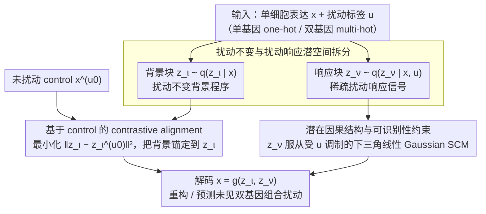

# What Makes a Representation Good for Single-Cell Perturbation Prediction?

**会议**: ICML2026  
**arXiv**: [2605.19343](https://arxiv.org/abs/2605.19343)  
**代码**: 无公开代码  
**领域**: 科学计算 / 单细胞扰动预测  
**关键词**: 单细胞, 扰动预测, 变分自编码器, 因果表征, 组合泛化  

## 一句话总结
这篇论文提出 PerturbedVAE，认为单细胞扰动预测的好表征必须显式分离占主导的扰动不变背景程序和稀疏的扰动响应信号，并用因果结构组织后者，从而更好泛化到未见双基因组合扰动。

## 研究背景与动机
**领域现状**：单细胞扰动建模希望预测基因被 CRISPR 等方式干预后，细胞的基因表达谱会如何变化。这类模型对药物发现、基因调控机制理解和组合扰动设计都很重要。已有方法大致有两条路线：一类是因果表示学习，用潜变量和结构方程刻画扰动机制；另一类是单细胞 foundation model，用大规模转录组数据学习通用表征。

**现有痛点**：单细胞表达数据有一个容易被忽略的不平衡：大部分表达变化来自细胞类型、背景程序和技术噪声等扰动不变因素，真正由特定扰动诱发的信号很稀疏。通用 foundation model 为了拟合整体分布，往往优先编码 dominant background，把扰动特异信息压弱；因果表示方法如果没有显式分离，也会把背景信息混进扰动相关潜变量，导致表征语义不纯。

**核心矛盾**：扰动预测既要保留背景细胞状态，又要提取少量但关键的 perturbation-specific signals。只强调重构会让模型用背景变量解释一切；只强调扰动变量又会把细胞基础状态丢掉。真正困难的是在强背景信号下，把稀疏扰动效应抽出来，并组织成能组合泛化的结构。

**本文目标**：作者提出 perturbation suppression hypothesis，解释为什么 foundation model 和一般因果表示方法会失败；随后设计 PerturbedVAE，把潜空间拆成扰动不变块和扰动响应块，并通过 contrastive alignment、条件潜在因果模型和 identifiability 分析来支撑这个设计。

**切入角度**：论文从“什么表征对扰动预测好”这个问题出发，答案不是更大模型或更复杂回归器，而是表征必须 perturbation-aware：先显式抽取扰动特异信息，再用因果结构利用这些信息预测未见组合干预。

**核心 idea**：用对照细胞对齐扰动不变潜变量，让背景程序被固定在 $z_\iota$ 中；把剩余扰动响应信号放入 $z_\nu$，并用扰动条件的潜在因果结构生成和组合未见扰动效果。

## 方法详解
PerturbedVAE 可以看成一个面向单细胞扰动数据的结构化 VAE。普通 VAE 的目标是重构表达谱，但这里作者额外规定潜变量的角色：$z_\iota$ 表示 perturbation-invariant background programs，$z_\nu$ 表示 perturbation-responsive factors。训练时，模型同时看扰动样本和未扰动 control 样本，让 $z_\iota$ 在两者之间保持一致；这样背景变化被 $z_\iota$ 吸收，$z_\nu$ 才被迫表达扰动带来的残差变化。预测未见组合扰动时，模型从 control 细胞推断 $z_\iota$，再把双基因 perturbation vector 输入 learned perturbation-conditioned mechanism，生成 $z_\nu$ 并解码为表达谱。

### 整体框架
输入是单细胞表达向量 $x$ 和扰动标签 $u$，其中 $u$ 可以是一热单基因扰动，也可以是双基因组合的 multi-hot vector。生成模型假设 $x=g(z)$，其中 $z=(z_\iota,z_\nu)$。$z_\iota$ 与扰动无关，用来刻画背景细胞程序；$z_\nu$ 依赖 $u$ 和 $z_\iota$，并服从一个未知 DAG，表示扰动响应程序之间的因果依赖。变分后验被分解为 $q(z_\nu,z_\iota|x,u)=q(z_\nu|x,u)q(z_\iota|x)$，对应“扰动响应需要知道标签，背景只从表达本身推断”。

### 关键设计

**1. 扰动不变与扰动响应潜空间拆分：先给潜变量分工，杜绝背景吞掉扰动信号**

单细胞表达里背景细胞程序、细胞类型与技术噪声占了绝大部分方差，真正由扰动诱发的信号很稀疏；若潜空间不分工，VAE 只要用一大块背景变量就能把重构做好，扰动特异信息会被压没。本文显式把潜变量拆成两块：$z_\iota$ 表示跨扰动稳定的背景程序、先验独立于扰动标签 $u$；$z_\nu$ 表示随扰动改变的响应因子，条件分布为 $p(z_\nu|u,z_\iota)$。生成模型写成 $x=g(z_\iota,z_\nu)$，变分后验分解为 $q(z_\nu,z_\iota|x,u)=q(z_\nu|x,u)\,q(z_\iota|x)$——背景只看表达本身、响应还要看扰动标签。ELBO 的重构项保证两块合起来能解释表达谱、KL 项约束潜空间容量；这一步给了模型明确的语义分工，让稀疏扰动效应有一个专属的“收纳处”，而不至于被占主导的背景变化淹没。

**2. 基于未扰动 control 的 contrastive alignment：把背景锚定住，逼出残差扰动效应**

光拆潜空间还不够——只优化 ELBO 时，重构目标仍可能让 $z_\iota$ 与 $z_\nu$ 互相串味，背景变化照样漏进扰动响应块。对每个扰动样本 $(x,u)$，本文额外采一个未扰动 control 表达谱 $x^{(u_0)}$，最小化两者背景潜变量的距离 $\mathcal{L}_{contrast}=\|z_\iota-z_\iota^{(u_0)}\|_2^2$，总目标为 $\mathcal{L}=-\mathcal{L}_{ELBO}+\alpha\mathcal{L}_{contrast}$。直觉是：强迫 $z_\iota$ 在扰动与未扰动样本间保持一致，占主导的背景变化就被钉死在 $z_\iota$ 里、不必再由别的潜变量解释，于是 $z_\nu$ 被“挤”得只能去表达扰动带来的残差变化。这一项是组合泛化的关键——模拟数据上不变块的 $R^2$ 从 0.66 提到 0.97，真实数据双基因 OOD 的 $R^2$ 从 0.9650 提到 0.9865。

**3. 潜在因果结构与可识别性约束：把扰动响应块组织成能组合外推的机制**

抽出扰动信号后还得“用得上”未见组合干预，否则 $z_\nu$ 只是个压缩表示、无法外推到没见过的双基因扰动。本文把 $z_\nu$ 建模为受扰动标签 $u$ 调制的线性 Gaussian 结构因果模型（SCM），权重矩阵限制为严格下三角以对应一个 DAG，让扰动响应程序之间的因果依赖显式可组合。理论上给出可识别性条件：若生成映射可逆且光滑、环境（扰动）变化足够丰富、alignment 达到最优、干预足够多样，则 $z_\nu$ 可被识别到置换与缩放、$z_\iota$ 可被识别到线性块变换。单细胞数据常是 partial intervention（只扰动一小撮基因），不满足传统因果表征学习对“丰富干预”的假设；这套分析说明在显式分离加足够环境差异下，稀疏扰动变量仍有机会被恢复，也解释了为什么预测未见组合时要先从 control 推 $z_\iota$、再把双基因扰动向量喂进这个机制生成 $z_\nu$、最后解码成表达谱。

### 损失函数 / 训练策略
训练目标由负 ELBO 和 contrastive alignment 组成。ELBO 包含重构项 $\mathbb{E}_{q}[\log p(x|z_\nu,z_\iota,u)]$ 以及 $q(z_\nu,z_\iota|x,u)$ 到 $p(z_\nu,z_\iota|u)$ 的 KL。真实数据实验使用 Norman2019 Perturb-seq：105,528 个 K562 细胞、112 个靶基因、105 个单基因和 131 个双基因条件。训练集包含 control 和 105 个单基因扰动，112 个双基因扰动完全保留为 OOD 测试。优化器为 Adam，batch size 64，epoch 100，hidden dimension 256，学习率 $10^{-4}$，alignment 权重 $\alpha=0.05$。

## 实验关键数据

### 主实验
| 数据集 / 设置 | 指标 | 本文 | 之前SOTA / 强基线 | 提升 |
|--------|------|------|----------|------|
| Norman2019 双基因 OOD | RMSE ↓ | 0.4474±0.0007 | KNN 0.4894 / ElasticNet 0.4929 / STATE 0.4981 | 相比 KNN 降低 0.0420 |
| Norman2019 双基因 OOD | $R^2$ ↑ | 0.9865±0.0009 | UCE 0.9857 / KNN 0.9843 | 略优于最佳 FM/简单基线 |
| 单基因扰动, z dim 105 | RMSE ↓ | 0.3995±0.0013 | SAMS-VAE 0.4123 / sVAE+ 0.5002 | 明显更低 |
| 双基因扰动, z dim 105 | RMSE ↓ | 0.4474±0.0007 | SAMS-VAE 0.4629 / PerturbedVAE w/o Align 0.4623 | alignment 后 OOD 更稳 |
| 模拟数据 identifiability | invariant $R^2$ ↑ | 0.97±0.0077 | w/o alignment 0.66±0.0281 | 对齐显著改善不变块恢复 |

### 消融实验
| 配置 | 关键指标 | 说明 |
|------|---------|------|
| w/o contrastive alignment | 双基因 RMSE 0.4626±0.0002, $R^2$ 0.9650±0.0002 | 去掉对齐后组合泛化明显下降 |
| with contrastive alignment | 双基因 RMSE 0.4474±0.0007, $R^2$ 0.9865±0.0009 | 对齐让 $z_\iota$ 保持信息，提升 OOD |
| capacity: $z_\nu<z_\iota$ | 单基因 RMSE 0.3995, 双基因 RMSE 0.4474 | 背景块容量更大时最好 |
| capacity: equal split | 单基因 RMSE 0.4084, 双基因 RMSE 0.4627 | 不变背景容量不足会拖累预测 |
| PerturbedVAE(MMD) | RMSE 0.5485, $R^2$ 0.9958, MMD 0.3077 | 即使用 MMD 版本，也优于 Discrepancy-VAE，说明收益不只是换 discrepancy loss |

### 关键发现
- 单细胞 foundation model 的表征并不一定保留可线性读取的扰动标签。论文的 linear probe 显示 UCE、scFoundation、Geneformer 对 perturbation labels 的可解码性弱于直接 PCA，支持 perturbation suppression hypothesis。
- 对齐项是关键机制。模拟中 invariant block 的 $R^2$ 从 0.66 提到 0.97，真实数据中双基因 OOD 的 $R^2$ 从 0.9650 提到 0.9865。
- 背景容量不能太小。最佳容量配置是 $z_\nu<z_\iota$，说明虽然任务关注扰动响应，充分建模不变背景反而是提取稀疏扰动信号的前提。
- Additive baseline 在 pseudobulk 平均响应上很强，但在 cell-level $R^2$ 上为负；PerturbedVAE 虽然不总是最低 pseudobulk error，却能保留单细胞层面的解释方差。

## 亮点与洞察
- 论文最好的洞察是把单细胞扰动预测失败归因到信号比例失衡，而不是简单说模型不够大。扰动特异信号稀疏、背景信号占主导，这个视角解释了 foundation model 和一般 CRL 方法的不同失败模式。
- PerturbedVAE 的结构分工很清楚：$z_\iota$ 负责背景，$z_\nu$ 负责响应，contrastive alignment 则负责把两者拉开。这个设计比直接加更大 latent 或更深 encoder 更可解释。
- 理论与实现之间连接较紧。identifiability theorem 虽然假设强，但它直接解释为什么需要环境多样性、alignment 和 perturbation-conditioned Gaussian SCM。
- 论文没有回避简单 additive baseline 的强势，而是区分 pseudobulk 平均响应和 single-cell variability。这个讨论让方法价值更准确：它不仅是回归均值，也是在学可解释扰动机制。

## 局限与展望
- 可识别性分析依赖强假设，如生成映射可逆光滑、足够环境差异、alignment 全局最优、共同 DAG 顺序等，真实生物数据未必完全满足。
- 主要真实实验围绕 Norman2019 和 Replogle 单基因检查，跨细胞类型、跨实验平台、药物扰动和更复杂多基因组合仍需验证。
- PerturbedVAE 需要 unperturbed control 作为 alignment anchor。若实验设计中 control 少、批次效应强或 control 与扰动样本不匹配，对齐项可能引入偏差。
- 当前对 learned causal graph 的生物验证主要是 plausibility check，恢复到的调控边还需要更系统的实验或外部数据库验证。

## 相关工作与启发
- **vs scFoundation / UCE / Geneformer**: 这些 foundation model 学到通用表达表征，但可能压制扰动特异信号；PerturbedVAE 小得多，却因为有任务匹配的结构偏置，在双基因 OOD 上更稳。
- **vs Discrepancy-VAE / SENA / sVAE+ / SAMS-VAE**: 这些因果或 VAE 方法没有同样明确地区分背景与扰动响应，容易纠缠不变信息；PerturbedVAE 通过 alignment 和容量分配改善了这一点。
- **vs additive linear model / GEARS**: Additive baseline 对 Norman2019 的平均响应很强，GEARS 直接学扰动到表达的图映射；PerturbedVAE 的优势在于同时建模单细胞变异和潜在扰动机制。
- **启发**: 在其他科学 ML 干预预测任务中，如药物组合、蛋白扰动或材料工艺干预，也可以先识别 dominant invariant factors，再把稀疏干预效应放进结构化 latent mechanism。

## 评分
- 新颖性: ⭐⭐⭐⭐ 把 perturbation suppression hypothesis 与结构化 VAE 结合，问题定义和方法动机都比较清晰。
- 实验充分度: ⭐⭐⭐⭐ 有模拟、真实 Perturb-seq、FM/简单基线/CRL 对比和多项消融，但跨数据集外推还可以更强。
- 写作质量: ⭐⭐⭐⭐ 理论和实验联系紧密，additive baseline 讨论诚实；公式密集处阅读门槛偏高。
- 价值: ⭐⭐⭐⭐⭐ 对单细胞扰动建模很有启发，尤其提醒大家不要盲目相信通用 foundation model 表征能保留稀疏干预信号。

<!-- RELATED:START -->

## 相关论文

- [\[ICLR 2026\] scDFM: Distributional Flow Matching for Robust Single-Cell Perturbation Prediction](../../ICLR2026/computational_biology/scdfm_distributional_flow_matching_model_for_robust_single-cell_perturbation_pre.md)
- [\[ICML 2026\] Scalable Single-Cell Gene Expression Generation with Latent Diffusion Models](scalable_single-cell_gene_expression_generation_with_latent_diffusion_models.md)
- [\[AAAI 2026\] Gene Incremental Learning for Single-Cell Transcriptomics](../../AAAI2026/computational_biology/gene_incremental_learning_for_single-cell_transcriptomics.md)
- [\[ICML 2026\] Towards Universal Gene Regulatory Network Inference: Unlocking Generalizable Regulatory Knowledge in Single-cell Foundation Models](towards_universal_gene_regulatory_network_inference_unlocking_generalizable_regu.md)
- [\[ACL 2026\] AROMA: Augmented Reasoning Over a Multimodal Architecture for Virtual Cell Genetic Perturbation Modeling](../../ACL2026/computational_biology/aroma_augmented_reasoning_over_a_multimodal_architecture_for_virtual_cell_geneti.md)

<!-- RELATED:END -->
