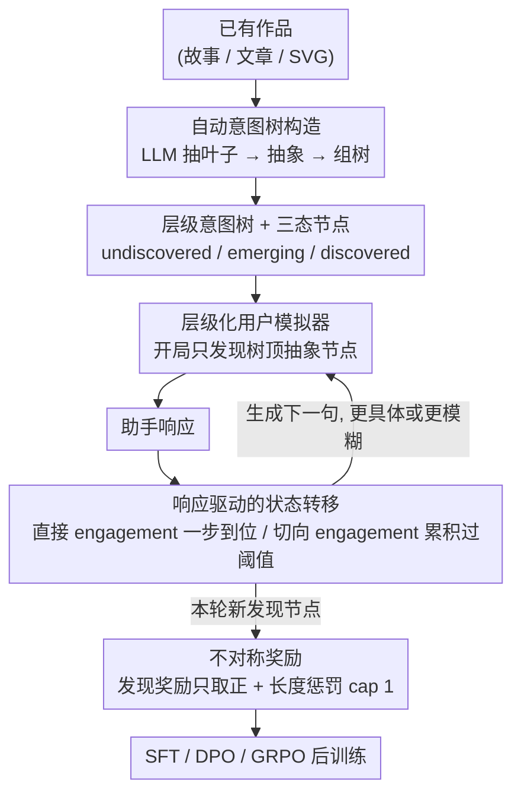

# DiscoverLLM: From Executing Intents to Discovering Them

**会议**: ICML 2026  
**arXiv**: [2602.03429](https://arxiv.org/abs/2602.03429)  
**代码**: https://taesookim.com/discoverllm  
**领域**: 人机对话 / LLM 后训练 / 用户模拟器  
**关键词**: 意图发现, 多轮对话, 用户模拟器, RLHF, 协作创作

## 一句话总结
DiscoverLLM 把 "用户没想清楚自己要什么" 形式化为意图层级树的渐进发现过程，用可奖励的层级化用户模拟器训练模型在不清晰时主动发散探索、在清晰时收敛执行，在创意写作 / 技术写作 / SVG 三任务上比 CollabLLM 等 baseline 满意度 +10%、对话长度 -40%。

## 研究背景与动机
**领域现状**：当前 LLM 助手默认用户来时就知道自己要什么，RLHF 直接奖励 "一轮答得好" 的单轮输出。多轮工作（CollabLLM、Shani 等）开始让模型主动问澄清问题，但仍假设意图 "已经形成、只是没说"。

**现有痛点**：在开放创作场景（写作、设计），用户常常是 "我也不知道想要什么、得看到几个 draft 才知道"。这时澄清问题 "想要什么 tone？" 是无效的——用户答不上。论文开篇举的例子：让 LLM 写一篇个人 essay，写完用户觉得 "不对但说不出哪不对"，要看到 "过分亲密" 和 "过分疏离" 两个反例后才意识到自己想要 "克制但坦诚"。

**核心矛盾**：澄清式多轮训练假设 = 已形成意图、未表达；现实 = 意图本身要在交互中通过看 outcome 才能形成。前者对应 "问"，后者要求 "探索 / 试着做"。

**本文目标**：(1) 形式化定义意图发现（intent discovery）与意图引出（intent elicitation）的区别；(2) 构造能给出可优化奖励信号的用户模拟器；(3) 训练出 "会自适应在发散 / 收敛之间切换" 的助手。

**切入角度**：借鉴认知科学里 Schön 1983、Flower & Hayes 1981 关于 "co-evolution of problem and solution" 的理论——人类通过创造 / 检视 outcome 来 "发现" 自己的偏好，且这些偏好可以组织成层级（抽象 → 具体）。这为构造 ground-truth 模拟器提供了可计算的结构。

**核心 idea**：把意图建模成层级树 $\mathcal{H}=(V,E)$，节点状态在 undiscovered / emerging / discovered 间转移，模型响应越能让更多节点被 discovered 越获奖励——这一信号直接喂给 SFT / DPO / GRPO。

## 方法详解

### 整体框架
DiscoverLLM 的核心是把 "用户没想清楚要什么" 这件没法直接打分的事，变成一个能给出可微奖励的训练循环。它先从一篇已有作品（故事、文章、SVG）离线抽出一棵分层的意图树作为 ground truth，再让一个层级化用户模拟器在树上 "假装没想清楚"：模拟用户开局只发现树顶几个抽象节点，助手每回应一句，模拟器就评估这句有没有让更多隐藏节点被 "发现"，据此更新节点状态、生成下一句更具体或更模糊的话，并把新发现的节点数当奖励。最后用这些模拟出来的对话去做 SFT / DPO / GRPO 后训练，让模型自学何时发散探索、何时收敛执行。

### 关键设计

**1. 层级意图树 + 三态节点：给模拟器一个"可以装糊涂"的 ground truth**

意图发现没法直接打分，根子在于真实意图既不可见也没有结构。这里把意图建模成一棵树 $\mathcal{H}=(V,E)$：树根是高度抽象的 intent（如"包含一只动物"），向下逐层具体（"宠物" → "猫" → "暹罗猫" / "短毛"），契合认知科学里"hierarchical network of goals"的说法。当前已发现集合记作 $I_t \subseteq V$，可继续细化的空间是 $\mathcal{R}(I_t) = \{v : \text{parent}(v) \in I_t, v \notin I_t\}$——严格要求"父被发现才能发现子"，各分支彼此独立。关键在于每个节点有 undiscovered / emerging / discovered 三态：emerging 节点用户只会模糊提及（"也许换个小动物？"）而说不出确切的话。正是这个三态机制让模拟器能自然产生"我也不知道"这种现实对话，而不是要么全知要么全不知的二元跳变，从而既能"装作没想清楚"，又能基于状态变化给出可微奖励。

**2. 响应驱动的状态转移：让"问对问题"和"展示对比方案"都能拿到奖励**

有了树还不够，得让助手不同的回应自动映射成不同的状态转移、自动结算奖励。每一轮模拟器都评估助手响应 $r_t$ 与 $\mathcal{R}(I_t)$ 中节点的关系，分两种情况：**直接 engagement** 是 $r_t$ 明确问到或直接满足某节点（如直接问"你要哪种宠物？"或直接画出一只猫），该节点一步到位变 discovered；**切向 engagement** 是 $r_t$ 提供相关但不完全匹配的选项，只累积分数，超过一个随机阈值后状态才前进一档（undiscovered → emerging → discovered），这正是在模拟人"看反例后排除可能性"的认知过程。同时有一条表达约束：用户只能用 discovered 节点的语言说话、emerging 节点只能模糊提及——所以当"色彩"还没被发现时，助手问"想要什么色彩？"就是无效的，逼着模型改用"先甩两个对比 draft"这种发散策略。这样奖励 $R_d = |I_{t+1}| - |I_t|$（本轮新发现的节点数）就同时奖励了"问对问题"和"展示对比方案"两条路，模型得以自学何时发散、何时收敛。

**3. 自动意图树构造 + 不对称奖励：去掉人工标注瓶颈又不让长度惩罚吃掉发现奖励**

要让框架能扩展到任意领域，意图树必须能自动造、奖励必须稳定。树的构造分三步：(a) LLM 看一篇 artifact 列出它满足的所有具体需求，当作叶子；(b) LLM 迭代抽象出多层；(c) LLM 把这些 intent 组织成树，判定哪些抽象节点 subsume 哪些具体节点——全程零人工 annotation，新领域可低成本接入。奖励侧设计成不对称：发现奖励 $R_d$ 只取正数以纯粹鼓励发现，长度项 $R_e = -\min(\lambda \cdot \max(0, \text{tokens}(r_t) - \tau), 1)$ 惩罚超长输出但 cap 在 1，确保它不会盖过 discovery 奖励；总奖励 $R(r_t) = R_d(r_t) + R_e(r_t)$。作者还刻意不对 $R_d$ 按剩余 intent 数做归一化，因为归一化会让对话后期的奖励信号变得不稳定——这个不对称设计是工程上稳定收敛的关键。

### 损失函数 / 训练策略
基模型用 Llama-3.1-8B-Instruct 和 Qwen3-8B，LoRA 微调四档：(1) SFT 在合成对话上；(2) DPO 在 pair-wise 比较上（从 base 起步）；(3) SFT+DPO（从 SFT 起步）；(4) Qwen3 上再加 GRPO。意图树用 Claude Sonnet 4.5 构造，用户模拟器用 Gemini 3 Flash，对话 5 轮，评估时重复 3 次取平均。

## 实验关键数据

### 主实验
创意写作 / 技术写作 / SVG 三任务，四个核心指标：Discovery、Satisfaction、Interactivity (ITR)、平均 token 数。Llama-3.1-8B 主结果：

| 任务 | 配置 | Discover↑ | Satisfy↑ | ITR↑ | #Tok↓ |
|------|------|-----------|----------|------|-------|
| 创意写作 | Base | 38.2 | 30.0 | 20.1 | 3.09k |
| 创意写作 | CollabLLM | 37.3 | 28.0 | 32.6 | 2.93k |
| 创意写作 | **SFT+DPO** | **42.4** | 28.4 | 32.9 | **2.77k** |
| SVG | Base | 45.6 | 32.5 | 21.6 | 3.59k |
| SVG | **SFT+DPO** | **51.6** | **37.0** | **44.6** | **2.61k** |
| 技术写作 | SFT | 47.1 | 35.2 | **81.6** | 2.09k |

SFT 单跑 ITR 暴涨到 80+（说明模型变得很主动），但 Discovery 涨幅不大；DPO 才把 Discovery 推到最高。Qwen3 上加 GRPO 进一步提升（论文表里完整数字）。

### 消融实验

| 配置 | Discover | Satisfy | ITR | 说明 |
|------|----------|---------|-----|------|
| Base | 38.2 | 30.0 | 20.1 | 无任何后训练 |
| Prompted Base | 37.7 | 26.4 | 26.0 | 加 system prompt 提示要协助 |
| CollabLLM | 37.3 | 28.0 | 32.6 | SOTA baseline |
| SFT | 40.7 | 33.4 | 92.3 | 单 SFT，ITR 飞涨 |
| DPO | 40.5 | 29.2 | 33.1 | 单 DPO（无 SFT 起步）|
| **SFT+DPO** | **42.4** | 28.4 | 32.9 | 最优组合 |

75 人人类用户研究：完成相同任务，DiscoverLLM 的满意度显著高于 baseline，完成时间更短，用户反馈称模型 "好像能预测我想要什么"。

### 关键发现
- **prompted base 反而退步**：直接给 prompt "请帮用户发现意图" 没效果，模型只是机械地多问问题，反而拖累 Discovery。说明这种能力靠 prompt 调不出来，必须靠训练。
- **SFT 让模型 "嗨"，DPO 让模型 "准"**：SFT 后 ITR 暴涨意味着模型生成行为更协作 / 更主动，但选哪个动作还不够准；DPO 用 pair-wise 偏好把策略选择磨细。
- **泛化到未训练领域**：旅行规划、Web 开发上 DiscoverLLM 同样有效，说明 "发散 / 收敛" 是被学到的通用对话策略，不是任务特定模板。
- **对话更短**：在 Discovery 提升的同时 token 数下降 30%+，说明模型学会 "用一个好提案代替三个澄清问题"，把交互效率拉高。

## 亮点与洞察
- **重新定义问题**：把 "用户不知道自己要什么" 从 NLP 长期忽略的边界条件变成中心问题，区分 elicitation vs discovery，是这篇论文最重要的概念贡献。
- **可计算的认知建模**：用层级树 + 三态节点把 Schön 的设计认知理论翻译为可微奖励，这种从认知科学到 ML 训练信号的桥接非常优雅，给其他模糊的 HCI 场景树立了模板。
- **"切向 engagement" 累积概率**：助手不必直接命中，提供几个反例也能推动用户发现——这是对真实人类决策的精准模拟，远比 "对 / 错" 二元奖励更贴近现实。
- **GRPO 在多轮上 work**：把 online RL 用到对话发现这种轨迹奖励稀疏的任务上，验证了 GRPO 在复杂 reward shaping 下的可用性。

## 局限与展望
- **单调假设**：模型假设 intent 一旦 discover 就永远 discover，不允许用户反悔 / 弃坑 / 摇摆，这与真实创意过程有偏差。
- **用户其实是 "被引导构造" 还是 "发现内在偏好"**：作者承认模拟器只能模拟后者，前者（助手主导构造）需要更主动的世界模型。
- **意图树质量瓶颈**：树由 LLM 自动构造，节点抽象度和分支可能与人类心智不一致，导致部分场景 reward signal 失真。
- **奖励 hacking 风险**：模型可能学到 "硬塞多个对比选项以最大化 discovery 数" 而牺牲单次输出质量，论文用长度惩罚部分缓解但不彻底。
- **5 轮对话上限**：长会话场景下 emerging 节点累积阈值的稳定性需要重新调参。

## 相关工作与启发
- **vs CollabLLM (Wu 2025)**: 都做多轮协作训练，但 CollabLLM 假设 well-defined 意图、模型只是追问；DiscoverLLM 假设意图未形成、模型要主动 surface。在 ITR 上 CollabLLM 也提升但 Discovery 不动。
- **vs RLHF (Ouyang 2022)**: 单轮 full output 奖励，与意图发现根本不兼容；本文把奖励放到 turn 级别。
- **vs intent classification 经典工作**: 那些方法假设意图是离散有限集合，本文意图是动态生长的树。
- **启发**：意图层级 + 状态机模拟器这一范式可以推广到 (1) 教育辅导（学生不知道哪里不会）；(2) 医疗问诊（病人说不清症状）；(3) 法律咨询（当事人不确定诉求）；甚至 (4) coding agent 与人类工程师协作时的需求澄清。

## 评分
- 新颖性: ⭐⭐⭐⭐⭐ 把 "用户意图未形成" 形式化为可计算的层级树发现，并构造可奖励模拟器，问题定义和方法都很原创。
- 实验充分度: ⭐⭐⭐⭐ 3 任务 × 2 base × 4 训练档 + 75 人用户研究 + 5 个跨任务泛化 + 4 个模拟器配置消融，覆盖面广；可改进的是 backbone 仅到 8B。
- 写作质量: ⭐⭐⭐⭐⭐ 开篇 essay 例子非常生动，认知科学背景铺垫到位，Figure 2 把状态机说得很清楚。
- 价值: ⭐⭐⭐⭐⭐ 直接定义了 LLM 助手的下一阶段任务（不止 elicit、要 discover），对创意 AI、HCI、agent 工程都有显著影响。

<!-- RELATED:START -->

## 相关论文

- [\[ICML 2026\] Not All Prefills Are Equal: PPD Disaggregation for Multi-turn LLM Serving](not_all_prefills_are_equal_ppd_disaggregation_for_multi-turn_llm_serving.md)
- [\[ICML 2026\] From Self-Evolving Synthetic Data to Verifiable-Reward RL: Post-Training Multi-turn Interactive Tool-Using Agents](from_self-evolving_synthetic_data_to_verifiable-reward_rl_post-training_multi-tu.md)
- [\[ACL 2025\] Know You First and Be You Better: Modeling Human-Like User Simulators via Implicit Profiles](../../ACL2025/dialogue/know_you_first_and_be_you_better_modeling_human-like_user_simulators_via_implici.md)
- [\[ICML 2026\] Is Your LLM Overcharging You? Tokenization, Transparency, and Incentives](is_your_llm_overcharging_you_tokenization_transparency_and_incentives.md)
- [\[ACL 2026\] Disambiguation-Centric Finetuning Makes Enterprise Tool-Calling LLMs More Realistic and Less Risky](../../ACL2026/dialogue/disambiguation-centric_finetuning_makes_enterprise_tool-calling_llms_more_realis.md)

<!-- RELATED:END -->
