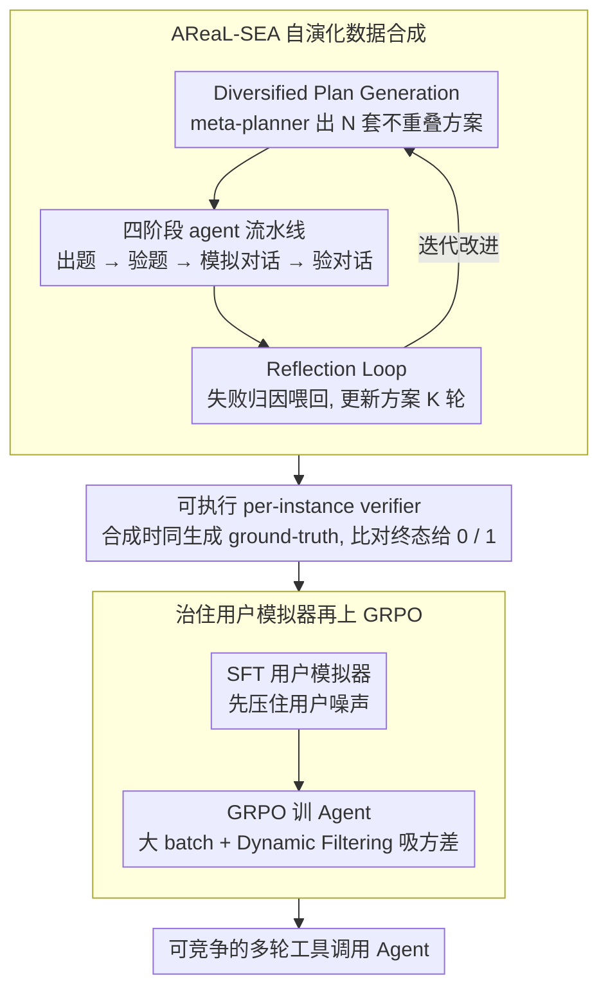

# From Self-Evolving Synthetic Data to Verifiable-Reward RL: Post-Training Multi-turn Interactive Tool-Using Agents

**会议**: ICML 2026  
**arXiv**: [2601.22607](https://arxiv.org/abs/2601.22607)  
**代码**: https://github.com/inclusionAI/AReaL/tree/main/examples/tau2 (有)  
**领域**: LLM Agent / 强化学习 / 工具调用  
**关键词**: 多轮工具调用、可验证奖励 RL、合成数据自演化、GRPO、用户模拟器微调

## 一句话总结
针对"多轮交互式工具调用 Agent"后训练里两大瓶颈——高质量数据贵 + 用户模拟噪声毁 RL 信号，作者提出"自演化多 agent 数据合成 (AReaL-SEA)"配套生成可执行 verifier 当奖励，再配上"先 SFT 用户模型再做大 batch + 动态过滤 GRPO"的 RL recipe，在 τ²-bench 上把 Qwen3-235B 推到 Airline 73.0 / Telecom 98.3 的 pass^1，全面达到或超过 Claude/Gemini/GPT-5。

## 研究背景与动机

**领域现状**：LLM 正在从"问答机器"转向"任务完成助手"，要在对话中同时跟人沟通、跟环境 (API/工具) 互动来完成复杂任务（如 τ²-bench Airline 的"改签 → 查询 → 验政策 → 执行"流程）。工具调用 Agent 这条路已有 ReAct/Toolformer/OpenVLA 等基础模型，但多轮交互式 Agent 多了"用户在场"这一维度，比单轮工具调用难得多。

**现有痛点**：把开源模型后训成有竞争力的交互式 Agent 卡在两个瓶颈。**(1) 数据问题**：多轮工具对话数据极难规模化——人工标注成本高、自动合成又难同时满足"复杂领域规则 + 模拟用户私有信息 + 任务难度足够 RL"三重要求。**(2) RL 不稳问题**：交互式任务必须有用户驱动，所以 RL rollout 一定要带用户模拟器。但作者发现开源模型当用户模拟器极不稳定——τ²-bench 的 dual-control 场景里用户也要发工具调用，开源模型经常乱发工具或忽略指令，导致 rollout 失败、reward 被错误归因到 Agent 上。

**核心矛盾**：你想用 RL 训 Agent，但 RL 需要稳定 rollout，rollout 需要稳定用户模拟，用户模拟需要好的训练数据，好的训练数据又要靠 Agent + 用户共同 rollout——这是个循环依赖。

**本文目标**：(i) 设计可规模化、可验证的多轮工具调用数据合成 pipeline；(ii) 给交互式 Agent 设计能扛住"用户模拟不稳"的 RL recipe。

**切入角度**：把数据合成做成"分层多 agent 系统 + 自演化反馈环"，让系统能从自己失败中学；把用户模拟器先用合成数据 SFT 一遍，再丢进 RL rollout，把"用户噪声"从源头压下去；同时用大 batch + 动态过滤吸收剩余的 reward 方差。

**核心 idea**：数据 = 自演化多 agent + 可执行 verifier；RL = 先治用户模拟器，再用稳定的 GRPO 训 Agent；二者紧密配合形成可循环改进的后训练管线。

## 方法详解

### 整体框架
整篇要解决的是"开源模型怎么后训成有竞争力的多轮工具调用 Agent"，难点在前面说的循环依赖：训 Agent 要 RL，RL 要稳定 rollout，rollout 要好数据和好用户模拟器。作者把它拆成两个互相喂的模块。前半段 **AReaL-SEA** 负责造数据：一个 meta-planner 先开出 $N$ 套互不重叠的合成方案，每套独立跑一条"出题 → 验题 → 模拟对话 → 验对话"的流水线，把失败案例喂回 reflection 模块迭代改方案，循环 $K$ 轮越合成越好。后半段是 RL 配方：先拿合成数据把用户模拟器 SFT 一遍治住噪声，再用 GRPO 训 Agent，奖励则来自合成时一并生成的可执行 verifier——它拿轨迹的最终状态去对 ground-truth，对上给 1、对不上给 0。

### 关键设计

**1. AReaL-SEA 自演化数据合成：让 pipeline 从自己的失败里学**

多轮工具对话数据贵在要同时满足"复杂领域规则 + 用户私有信息 + 难度够 RL"，以往 APIGen-MT / TOUCAN 这类 pipeline 是**静态**的，出错了也没法自我修正。本文把数据生成做成可演化的多 agent 系统，三个环节扣在一起。第一步是 **Diversified Plan Generation**：meta-planner 顺序生成 $N$ 套不重叠的 (synthesis plan, evaluation plan) 对，每套显式指定不同的 domain、复杂度、工具模式、用户风格，diversity 是构造出来的而不是靠随机撞出来的——消融里把 prompt 集从 64 套砍到 4 套，性能直接从 56.0 掉到 42.5。第二步是**四阶段 agent 流水线**串起每套方案：Task Synthesis Agent 用多轮工具调用产出结构化任务元组 $q = (u, t, a^*)$，Task Verification Agent 把关任务质量，Trajectory Rollout 让模拟 user 和 assistant 跑完整段对话，Trajectory Verification Agent 评轨迹并打 attribution tag——关键是它会归因失败到底是题目本身有问题还是对话跑挂了。第三步是 **Reflection Loop**：失败案例连同归因汇总给 reflection agent，它据此更新方案 $(\mathcal{P}_s^{(n,k+1)}, \mathcal{P}_e^{(n,k+1)}) = \text{Reflect}(\mathcal{P}_s^{(n,k)}, \mathcal{P}_e^{(n,k)}, \{\text{failures}\})$，下一轮出题更准、rubric 更校准。这个闭环正是和静态 pipeline 拉开差距的地方：去掉 evolution loop，性能从 56.0 跌到 44.0。

**2. 可执行 per-instance verifier：把奖励信号在造数据时就钉死**

交互式 Agent 任务若用 LLM-as-judge 打分，既慢又贵又噪。作者的做法是合成每条 task 时就同步产出它的 ground-truth final state 和一个能跑的 verifier 函数。RL 训练里一条轨迹跑完后，verifier 拿最终状态 $s_T$ 去比 ground-truth 的关键 entity 和动作，全对才给 1、否则给 0，是个 deterministic 的 binary outcome reward，写成 $\mathcal{R}(s_t, a_t) = R(s_T)$（仅当 $t = T$，其余为 0）。这等于把数学/代码领域成熟的可验证奖励 (RLVR) 范式搬进了 Agent 场景，省掉训练时再请一个 judge 模型，又快又准。

**3. 治住用户模拟器再上 GRPO：先压噪声，再吸方差**

这一块是论文最反直觉的地方。交互式任务的 RL rollout 必须带用户模拟器，但开源模型当用户极不稳——τ²-bench 的 dual-control 场景里用户也要发工具调用，base 模型经常乱发或忽略指令，把错误信号错误归因到 Agent 头上。所以第一刀先**SFT 用户模型**：拿 AReaL-SEA 生成的对话数据把用户模拟器（基于 Qwen3-30B-A3B-2507）微调一遍，让它稳定遵循指令、按角色发工具。这步的分量在消融里特别扎眼——直接拿 base 用户模型做 RL，性能从 SFT checkpoint 的 85.4 倒退到 75.6，换成 SFT 后的用户模型则一路冲到 95.6，整整 20 个点。把噪声从源头压住后，Agent 这侧用 GRPO 训：每个 task 采 $G$ 条独立 trajectory，算组内归一化的 advantage $\hat{A}(\tau^{(g)}) = \frac{R(\tau^{(g)}) - \mu_G}{\sigma_G}$，配 token-level clipping 的 surrogate loss。剩下两个旋钮都是为了让有限的 reward 信号更稳：**大 batch** 把总样本数从 256 提到 512，pass^1 从 64-66 涨到 70.5，本质是给 advantage 估计更厚的样本；**Dynamic Filtering** 则把组内全成功或全失败、$\hat{A}=0$ 没学习信号的 task 直接扔掉，只留有差异化的组——关掉这步性能从 70.5 掉回 65.0。

### 损失函数 / 训练策略
RL 目标 $\mathcal{J}_\text{RL}(\theta) = \mathbb{E}_{q \sim \mathcal{D}}[\frac{1}{\sum_g N_G}\sum_g \sum_t \sum_i \mathcal{L}_{t,i}^{(g)}(\theta)]$，其中 $\mathcal{L}_{t,i}^{(g)} = \min(\rho_{t,i}^{(g)} \hat{A}^{(g)}, \text{clip}(\rho_{t,i}^{(g)}, 1-\epsilon, 1+\epsilon)\hat{A}^{(g)})$，token-level 重要性比 $\rho_{t,i}^{(g)} = \pi_\theta / \pi_{\theta_\text{old}}$。SFT 用标准 cross-entropy。30B 模型在 64 H200 GPU 训，235B 用 80 H200。

## 实验关键数据

### 主实验
τ²-bench 三个 domain (Airline / Retail / Telecom)，pass^k 指 k 次独立尝试全成功才算成功（比 pass@k 严得多）：

| Model | Airline pass^1 | Retail pass^1 | Telecom pass^1 |
|-------|----------------|----------------|----------------|
| Claude-Sonnet-4.5 | 70.0 | 86.2 | 98.0 |
| Gemini 3.0 Pro | 73.0 | 85.3 | 98.0 |
| GPT-5 | 62.5 | 81.6 | 95.8 |
| Qwen3-235B baseline | 58.0 | 59.9 | 53.7 |
| Qwen3-235B + SFT | 64.0 | 71.5 | 87.9 |
| **Qwen3-235B + RL** | **73.0** | 75.0 | **98.3** |
| Qwen3-30B-A3B-2507 baseline | 56.0 | 54.2 | 28.5 |
| Qwen3-30B-A3B-2507 + SFT | 60.0 | 69.1 | 85.4 |
| **Qwen3-30B-A3B-2507 + RL** | 70.5 | 75.0 | 95.6 |

235B 版本在 Airline 追平 Gemini 3.0 Pro、在 Telecom 超过所有前沿模型；Retail 是最难 domain（Claude 86.2 仍领跑），开源版到 75.0。30B 版也极有竞争力，Telecom 95.6 接近 GPT-5。

Mix Training（三 domain 数据合并训）让 Qwen3-235B 总平均 pass^1 81.3% 超过 Qwen3-Max-Thinking (80.7) 和 GPT-5 (80.0)；在严苛的 pass^4 指标上 68.5% 同样超 Max-Thinking (66.8) 和 GPT-5 (64.0)。

### 消融实验

| 配置 | Airline pass^1 (SFT) | 说明 |
|------|----------------------|------|
| Qwen3-30B baseline | 38.0 | 起点 |
| Human Expert data | 52.0 | 人工设计 workflow |
| **AReaL-SEA Full** (64 plans, all components) | **56.0** | 超过人工 |
| w/o Validation | 50.0 | 缺质量过滤掉 6 点 |
| w/o Evolution | 44.0 | 缺反思环掉 12 点 |
| 4 prompt sets only | 42.5 | 缺多样性掉 13.5 点 |

| User Model | Telecom pass^1 (RL) | 说明 |
|------------|---------------------|------|
| 从 SFT 起步 | 85.4 | RL 前 |
| RL + base 用户模型 | 75.6 | **倒退 10 点** |
| RL + SFT 用户模型 | **95.6** | 涨 10 点 |

| RL 配置 | Airline pass^1 | 说明 |
|---------|----------------|------|
| 8×32 (total 256) | 64.0 | 小 batch |
| 16×16 (total 256) | 66.0 | prompts vs trajs 区别小 |
| 8×64 (total 512) | **70.5** | 大 batch 是关键 |
| 8×64 + 关闭动态过滤 | 65.0 | 过滤是必需 |

### 关键发现
- **自动合成 ≥ 人工专家**：AReaL-SEA full 56.0 超过 human expert data 52.0，说明自演化能在节省人工的同时**还**提升数据质量上限。
- **用户模型 SFT 是 RL 成功的隐性关键**：用 base 用户模型连 SFT checkpoint 都保不住（75.6 < 85.4），这是个之前文献几乎没强调过的失败模式，作者用图 2 case study 展示了 base 用户会忽略指令乱用工具，把错误信号传给 Agent。
- **总 batch size 比 prompts:trajs 拆分更重要**：8×32 vs 16×16 相近（64 vs 66），但 8×64 vs 8×32 显著（70.5 vs 64.0），说明 GRPO 的 advantage 估计稳定性主要看总样本数。
- **Mix training 对大模型有效、对小模型有害**：30B 在 mix training 下 average pass^1 从 71.5 掉到 63.7（Telecom 掉 15 点），但 235B 几乎持平（74.5 vs 74.7）——这印证了"小模型容量不够吸收多 domain"的直觉，对实际部署的 domain 拆分策略有指导意义。

## 亮点与洞察
- **"用户模拟器 SFT"是这篇论文最被低估的贡献**：之前所有 Agent RL 工作都默认用户模型是给定的（无论是 GPT-4.1 还是开源 base），本文是第一个把"用户模拟器质量直接决定 RL 是否能涨"这件事拿出来明确论证，并且给出 20 点的实证差距——这对所有交互式 Agent RL 研究都是个关键警示。
- **数据合成的"自演化"思路是个通用范式**：把"task 生成 → 验证 → trajectory rollout → 验证 → 反思 → plan 更新"做成闭环，让 LLM 自己从失败中学合成数据，比 APIGen-MT/TOUCAN 这类静态 pipeline 更可扩展。这一套架构完全可以迁移到其他需要复杂合成数据的领域（如 reasoning chain、长 context QA）。
- **可验证 reward + Agent RL 的结合范式**：把 RLVR 从数学/代码扩展到多轮工具调用 Agent，关键是合成阶段就把 verifier 一起生成，避免训练时还要跑 LLM judge——这种"数据带 verifier"的设计可以直接迁移到任何"最终状态可程序化检查"的任务上。
- **Mix vs Separate 对模型规模的依赖**：是个被忽视但实用的发现，对企业部署"训单个通用 Agent vs 训每个 domain 一个专家"的工程决策有直接帮助。

## 局限与展望
- 评测只在 τ²-bench 三个 domain 上做，相对窄；论文也承认 Retail 这个最难 domain 还没超过 Claude Sonnet 4.5。
- AReaL-SEA 的 reflection loop 步数 $K$ 没系统消融，最佳收敛轮数是个开放问题。
- 没讨论合成数据和真实生产对话之间的 distribution gap——τ²-bench 的合成 user 风格未必覆盖真实用户的话。
- RL 配方依赖很重的基础设施（80 H200 训 235B），对中小团队复制门槛高；轻量版（如蒸馏到小模型）的延伸是自然方向。
- 工具调用的安全性没有深入讨论（论文 impact statement 简单提了一下"可能被误用"），实际部署还需要专门的权限/审计层。

## 相关工作与启发
- **vs APIGen-MT (Prabhakar et al.)**: 同样合成多轮工具调用，但 APIGen-MT 是静态 reviewer-style validation；AReaL-SEA 多了自演化和 verifier 同生成，对 RL 更友好。
- **vs TOUCAN (Xu et al.)**: TOUCAN 走规模路线 (1.5M trajectories)，本文走"小而精 + 自演化"路线，证明 64 个高质量 plan 集就能超过 human expert。
- **vs ToolRL / Search-R1**: 这些是 single-turn tool-use 的 RL，本文是 multi-turn interactive setting，多出"用户模拟器质量"这一关键维度。
- **vs π₀ / GR00T**: 同样是 RL 训 Agent，但机器人侧用真实环境作 ground truth；本文用合成 verifier，cost 低但 fidelity 也会有 gap。
- **vs ARENA-RL (锦标赛式 RL)**: 后者用相对排名解决 reward 稀疏，本文用 dynamic filtering + 大 batch 解决 advantage 噪声，是两条互补思路。

## 评分
- 新颖性: ⭐⭐⭐⭐ 自演化数据合成 + 用户模型 SFT + verifier-based RL 的组合在 Agent 后训练里是新东西，特别是"用户模型 SFT 是关键"这一发现。
- 实验充分度: ⭐⭐⭐⭐⭐ 三个 domain × 三个模型规模 × separate/mix × 数据消融 + 用户模型消融 + RL 算法消融，覆盖很全面，并且对比了所有主流商业前沿模型。
- 写作质量: ⭐⭐⭐⭐ 故事讲得清晰（数据问题 + RL 问题 → 两套方案），公式和图都精炼；附录的 training detail 也很扎实。
- 价值: ⭐⭐⭐⭐⭐ 开源模型在 τ²-bench 上达到或超过前沿模型是实打实的 SOTA，且整套框架可复现（代码开源 + 详细 hyperparameter），对工业界部署 tool-using agent 有直接价值。

<!-- RELATED:START -->

## 相关论文

- [\[AAAI 2026\] Canoe: Teaching LLMs to Maintain Contextual Faithfulness via Synthetic Tasks and RL](../../AAAI2026/dialogue/teaching_large_language_models_to_maintain_contextual_faithfulness_via_synthetic.md)
- [\[ICML 2026\] Not All Prefills Are Equal: PPD Disaggregation for Multi-turn LLM Serving](not_all_prefills_are_equal_ppd_disaggregation_for_multi-turn_llm_serving.md)
- [\[ACL 2026\] GenesisFunc: Multi-Agent Data Generation for Accurate and Generalizable Function-Calling](../../ACL2026/dialogue/genesisfunc_multi-agent_data_generation_for_accurate_and_generalizable_function-.md)
- [\[ICLR 2026\] Non-Collaborative User Simulators for Tool Agents](../../ICLR2026/dialogue/non-collaborative_user_simulators_for_tool_agents.md)
- [\[ACL 2025\] Sparse Rewards Can Self-Train Dialogue Agents](../../ACL2025/dialogue/sparse_rewards_can_self-train_dialogue_agents.md)

<!-- RELATED:END -->
