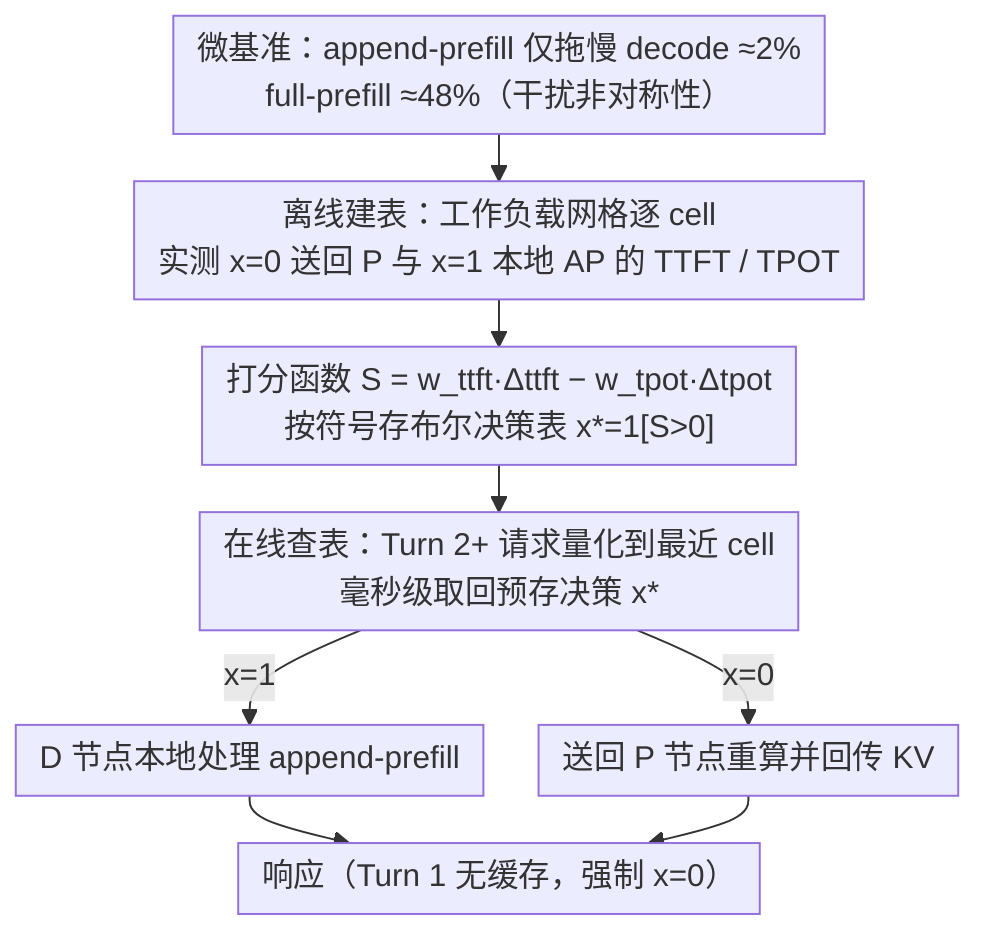

# Not All Prefills Are Equal: PPD Disaggregation for Multi-turn LLM Serving

**会议**: ICML 2026  
**arXiv**: [2603.13358](https://arxiv.org/abs/2603.13358)  
**代码**: 无（基于 vLLM disaggregated serving 原型）  
**领域**: LLM 推理服务 / 对话系统 / 系统优化  
**关键词**: PD 分离、多轮对话、KV cache 复用、动态路由、SLO

## 一句话总结
本文指出多轮对话场景下传统 Prefill-Decode 分离架构因每轮都要 P→D 重算并传输 KV 而严重低效，提出 PPD（Prefill-capable Decode）动态路由系统，让 decode 节点根据 SLO 权重决定是否本地处理 Turn 2+ 的 append-prefill，把 Turn 2+ TTFT 降低约 68%。

## 研究背景与动机

**领域现状**：现代 LLM 推理引擎（vLLM、SGLang、TensorRT-LLM、DeepSeek、Gemini 等）普遍采用 Prefill-Decode（PD）分离架构——把计算密集的 prefill 和带宽受限的 decode 放在不同 GPU 池，避免两类工作负载互相干扰，同时支持独立扩缩容。KV cache 严格由 P 节点单向传给 D 节点。

**现有痛点**：PD 是按单轮独立查询设计的，但真实部署里聊天机器人和 agent 系统几乎都是多轮对话。在多轮场景下，每个新 turn 都必须先把整段历史（之前的 prompt + 回复 + 新 prompt）送回 P 节点重算 KV，再传回 D 节点。实测显示这种重算占多轮 prefill 成本的 99%；同时 KV 传输流量饱和网络带宽，导致 Turn 2+ TTFT 居高不下，高负载下甚至触发服务降级。

**核心矛盾**：PD 的 KV 通道是单向的（P 生产、D 消费、无反向链路），即使上一轮的回复 KV 已经在 D 上，P 也无法访问。要解决这个 trade-off，要么打破单向契约（工程代价大），要么外挂分布式 KV 存储（Mooncake、MemServe 等）——但都没有改变路由决策本身。

**本文目标**：在不动 vLLM 等主流引擎 KV 协议的前提下，设计一种动态路由策略，能同时优化 Turn 2+ TTFT、TPOT 和系统吞吐，并且对不同 P:D 配比保持鲁棒。

**切入角度**：作者在 H100 上做了一组微基准，发现**不是所有 prefill 的干扰程度都一样**——full prefill（无缓存）在 batch=200 时让 decode TPOT 慢 48%，而 append-prefill（仅新 token，复用已缓存 KV）只慢约 2%，差了一个数量级。这意味着 D 节点本地处理 append-prefill 的代价远低于人们的直觉。

**核心 idea**：把"是否把 Turn 2+ 的 append-prefill 路由到 D 节点本地处理"形式化为一个带权重的二元决策 $x \in \{0,1\}$，按 SLO 权重 $\mathbf{w}=(w_{ttft},w_{tpot})$ 离线打分、在线查表，传统 PD 就是 $x \equiv 0$ 的特例。

## 方法详解

### 整体框架
PPD 要解决的问题是：多轮对话里每个 Turn 2+ 都得把整段历史送回 P 节点重算 KV 再传回 D，既慢又把网络打满。它的做法是不动 vLLM 的 KV 协议，只在调度层加一个二元开关——让 D 节点根据 SLO 权重自己决定要不要把这一轮的 append-prefill 留在本地处理。整套系统拆成离线和在线两段：离线在一个粗粒度的工作负载网格上把"本地处理"与"送回 P"两种走法都实测一遍、按收益打分存成布尔表；在线则把每个进来的请求量化到最近的网格单元、毫秒级查表拿决策，传统 PD 不过是这张表恒取 $x{=}0$ 时的特例。

### 关键设计

**1. Append-prefill 与 full-prefill 的干扰非对称性：戳破"所有 prefill 都重度干扰 decode"的前提**

PD 分离架构之所以把 prefill 和 decode 隔到不同 GPU 池，隐含假设是任何 prefill 都会严重拖慢同卡的 decode。作者用微基准把这个前提拆成两类来量化：full prefill 要对 $n$ 个新 token 算注意力，复杂度 $O(n^2)$；而多轮对话里的 append-prefill 只对 $m$ 个新 token 算注意力（每个 token 仍关注 $n+m$ 个 key），复杂度 $O(m(n+m))$，当 $m \ll n$ 时整整便宜 $n/m$ 倍。在 H100 上跑 Llama-3.1-8B，batch=200 时 full prefill 让 decode TPOT 慢约 48%，append-prefill 只慢约 2%，差了一个数量级；4 并发下是 full +57% vs append +21%，到 32K/64K 长上下文这个差距进一步扩到 3-4×。正是这组测量把"让 D 节点本地吃下 append-prefill 几乎不付代价"从直觉变成了可依赖的事实，为整个路由决策提供地基。

**2. 用打分函数 $S$ 把路由形式化成可调权重的优化问题：让所有策略成为同一光谱上的点**

有了非对称性这块地基，作者把"这一轮送 P 还是留本地"统一成一个带权目标。对每个 Turn 2+ 请求定义本地处理相对走 P 的收益分 $S(\psi;\pi,\mathbf{w}) = w_{ttft}\Delta_{ttft} - w_{tpot}\Delta_{tpot}$，其中 $\Delta_{ttft}$ 是 TTFT 的相对改善、$\Delta_{tpot}$ 是 TPOT 的相对退化，$\mathbf{w}=(w_{ttft},w_{tpot})$ 是用户给的 SLO 权重；$S>0$ 就本地处理（决策 $x{=}1$），否则送回 P（$x{=}0$）。这样传统 PD 就是 $x\equiv 0$、全本地就是 $x\equiv 1$、Replica 和部分路由是中间点，整条策略光谱被一个参数串起来。系统吞吐不进目标函数，它作为 KV 传输量下降的副产物自然改善。之所以必须做 per-request 动态决策而非选一个静态最优，是因为在 3060 个配置（17 配置 × 18 工作负载 × 10 QPS）的扫描里，92.2% 的 (工作负载, QPS) 组合下 Turn 2 TTFT 的最优配置和 TPOT 的最优配置并不重合——根本不存在一刀切的静态解。

**3. 离线建表 + 在线查表的两阶段路由：把昂贵决策挪到线下，在线只做毫秒级查询**

直接对每个请求在线求解 $S$ 代价太高，作者把计算前移。离线阶段对网格里的每个 cell 直接实测 $x{=}0$ 和 $x{=}1$ 两个端点的 TTFT/TPOT，按 $S$ 的符号存下布尔决策 $x^*(\hat\psi)=\mathbb{1}[S>0]$；在线阶段把请求按三维特征（累积上下文长度、输入/输出比、系统 QPS）量化到最近 cell，<1ms 取回预存决策，对延迟敏感的服务路径几乎零开销。Turn 1 因为没有可复用的 KV 缓存，强制走 $x{=}0$ 保证一致性。这套设计额外带来一个解耦：传统 PD 里 P:D 比例同时背负"Turn 1 容量规划"和"Turn 2+ 延迟调优"两件事，而 PPD 把后者单独交给权重 $\mathbf{w}$，配置规模和 SLO 调优变成两个独立旋钮，运维不再被迫在一个比例上做多目标平衡。

### 损失函数 / 训练策略
PPD 不涉及模型训练，全部是系统级调度策略。所有决策由离线测量驱动，主要可调参数是用户给的 SLO 权重 $w_{ttft}, w_{tpot}$ 和工作负载网格的离散化阈值。

## 实验关键数据

### 主实验
硬件 4× H100 80GB + NVLink，模型主要用 Llama-3.1-8B（Qwen2.5-14B/Qwen3-30B 验证），合成 18 个 workload × 10 QPS × 17 配置 = 3060 数据点；真实数据集用 ShareGPT 和 WildChat。

| 配置 | 指标 | $x=0$ 基线 | $x=1$ / PPD | 提升 |
|------|------|-----------|------------|------|
| 1P_3D 长上下文 高 QPS | Turn 2 TTFT | 基线 | $x=1$ 改善 | -73.3% |
| 2P_2D 长上下文 高 QPS | Turn 2 TTFT | 基线 | $x=1$ 改善 | -56.2% |
| 3P_1D 长上下文 高 QPS | Turn 2 TTFT | 基线 | $x=1$ 改善 | -24.9% |
| 1P_3D ShareGPT | 平均查询延迟 | 基线 | PPD | -15~25% |
| 2P_2D / 3P_1D ShareGPT 多 QPS | 成功率 | <95%（降级） | PPD 100% | 把不可用配置救活 |

### 消融实验

| 配置类别 | TTFT 胜率 | TPOT 胜率 | 吞吐胜率 | 平均胜率 |
|---------|----------|----------|---------|---------|
| Replica (4R) | 63.3% | 0.6% | 0% | 21.3% |
| $x=0$ (传统 PD) | 0% | 38.3% | 4.4% | 14.2% |
| $0<x<1$ 部分路由 | 3.3% | 33.3% | 27.8% | 21.5% |
| $x=1$ (Full AP-to-D) | 27.2% | 15.6% | 38.3% | 27.0% |

### 关键发现
- **P 资源越紧张，本地处理收益越大**：1P_3D 最高拿到 73.3% Turn 2 TTFT 改善，3P_1D 只剩 24.9%——P 是瓶颈时 $x=1$ 直接绕过它。
- **没有静态最优**：92.2% 的工作负载-QPS 组合下，TTFT 最优配置 ≠ TPOT 最优配置，验证了动态路由的必要性。
- **PPD 把不可用配置救活**：2P_2D 和 3P_1D 在 $x=0$ 下大量 QPS 点成功率 <95%（KV 传输饱和），开启 PPD 后稳定到 100%。
- **改善随 turn 数和模型尺寸保持**：2-16 轮和 8B/14B/30B 模型下 Turn 2+ TTFT 改善始终维持在 ~70%，说明收益来自架构性质而非特定模型。

## 亮点与洞察
- **挑战 PD 的元假设**：长期以来 PD 设计基于"所有 prefill 都重度干扰 decode"的隐式前提，本文用 1024-token 微基准把这个前提细分为 full vs append 两类并量化差距一个数量级，为整个分离架构家族打开新的设计维度。
- **优雅地用单参数 $x$ 统一光谱**：传统 PD、Replica、部分路由、全本地都成了 $x \in \{0, \text{frac}, 1\}$ 的特例，这种"一参概所有"的形式化让对比和分析非常清晰。
- **配置规模与 SLO 调优的解耦**：传统 PD 里 P:D 比同时承担"Turn 1 容量规划"和"Turn 2+ 延迟调优"两个目标；PPD 用权重 $\mathbf{w}$ 把 Turn 2+ 调优单独剥离出来，可迁移到其他多目标系统调度问题。
- **离线表 + 在线查模式**：把昂贵决策推到离线阶段，在线只做 <1ms 查表，对延迟敏感场景的工程意义很大。

## 局限与展望
- **网格离散化的覆盖问题**：三维网格的精度和阈值靠经验选择，工作负载分布出现新模式时需要重新建表；论文没讨论自适应更新机制。
- **混合 R+P/D 配置被排除**：作者承认 7 个混合配置普遍劣于纯 PD，但没给出理论解释，也没探索 R 在某些边界场景的潜在价值。
- **实验主要在 4×H100 NVLink 内**：跨节点的 RDMA/Ethernet 慢链路只做了带宽模拟，真实多节点部署的可移植性还需要更多验证。
- **没考虑 prefix 缓存命中率漂移**：当多个 session 竞争 D 节点本地 KV 槽位时，本地处理的优势可能被缓存抖动抵消，论文未深入。

## 相关工作与启发
- **vs AMPD（he2026）**：并发工作也走了"把 AP 路由到 D"的同一直觉，但用实时队列状态做决策；本文用离线优化框架建表，更稳定可预测，且形式化为优化问题给了理论清晰度。
- **vs Mooncake / MemServe / LMCache**：外挂分布式 KV 存储路线，不动 PD 单向协议；PPD 互补——不引入新存储层，纯靠路由就拿到大部分收益。
- **vs DuetServe / Nexus / TaiChi**：这些工作在 GPU 内部做 SM 切分或动态资源再分配，PPD 在更高的请求级做调度，可以叠加。
- **vs Chunked-prefill (Splitwise / FastGen)**：用 chunk 化缓解 prefill-decode 干扰；PPD 证明对 append-prefill 这种小 chunk 本来就干扰很小，与 chunked 思路在底层动机上是一致的。

## 评分
- 新颖性: ⭐⭐⭐⭐ 重新审视了 PD 的核心假设并把发现形式化为可调度的优化框架。
- 实验充分度: ⭐⭐⭐⭐⭐ 3060 配置扫描 + 合成 + 真实数据 + 多模型/多轮验证，是这个领域罕见的完整系统评测。
- 写作质量: ⭐⭐⭐⭐ 论证链条清晰，从微基准→形式化→算法→实测一气呵成，部分公式记法稍密。
- 价值: ⭐⭐⭐⭐⭐ 对生产 LLM serving 是即插即用改进，不动模型不动协议就能拿到大量 TTFT 收益。

<!-- RELATED:START -->

## 相关论文

- [\[ICML 2026\] From Self-Evolving Synthetic Data to Verifiable-Reward RL: Post-Training Multi-turn Interactive Tool-Using Agents](from_self-evolving_synthetic_data_to_verifiable-reward_rl_post-training_multi-tu.md)
- [\[ACL 2026\] ETHICMIND: A Risk-Aware Framework for Ethical-Emotional Alignment in Multi-Turn Dialogue](../../ACL2026/dialogue/ethicmind_a_risk-aware_framework_for_ethical-emotional_alignment_in_multi-turn_d.md)
- [\[ACL 2026\] SPASM: Stable Persona-driven Agent Simulation for Multi-turn Dialogue Generation](../../ACL2026/dialogue/spasm_stable_persona-driven_agent_simulation_for_multi-turn_dialogue_generation.md)
- [\[NeurIPS 2025\] HyGen: Efficient LLM Serving via Elastic Online-Offline Request Co-location](../../NeurIPS2025/dialogue/hygen_efficient_llm_serving_via_elastic_online-offline_request_co-location.md)
- [\[ACL 2026\] Codebook-Injected Dialogue Segmentation for Multi-Utterance Constructs Annotation: LLM-Assisted and Gold-Label-Free Evaluation](../../ACL2026/dialogue/codebook-injected_dialogue_segmentation_for_multi-utterance_constructs_annotatio.md)

<!-- RELATED:END -->
