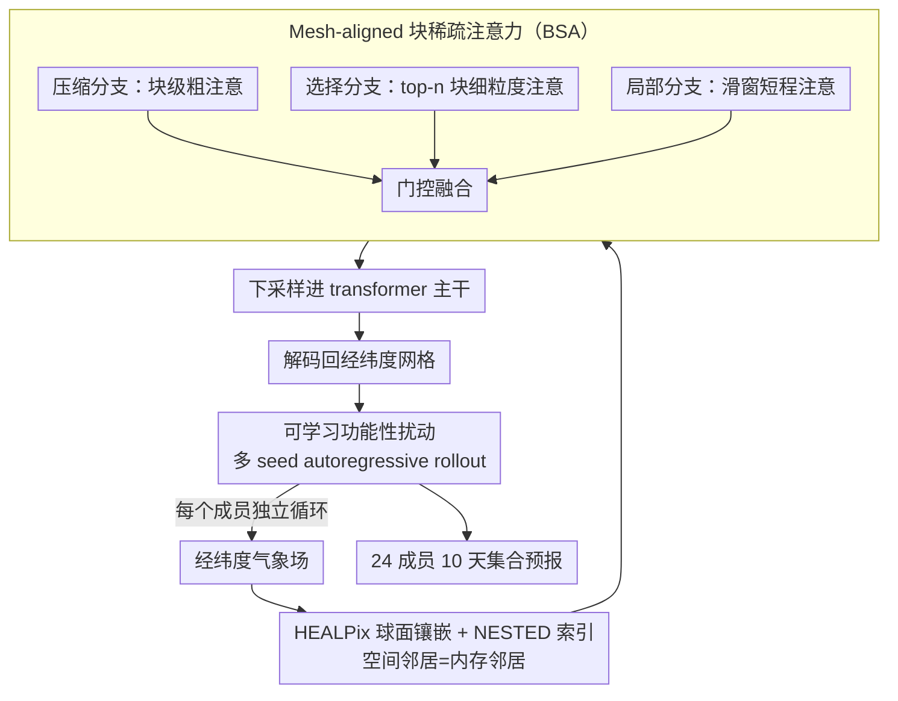

# (Sparse) Attention to the Details: Preserving Spectral Fidelity in ML-based Weather Forecasting Models

**会议**: ICML 2026  
**arXiv**: [2604.16429](https://arxiv.org/abs/2604.16429)  
**代码**: https://github.com/maxxxzdn/mosaic (有)  
**领域**: 3D 视觉 / 物理建模 / 概率天气预报 / 稀疏注意力  
**关键词**: 天气预报, 稀疏注意力, HEALPix mesh, 频谱保真, 概率集合预报

## 一句话总结
MOSAIC 用"概率扰动 + 在 HEALPix 球面网格上的 mesh-aligned 块稀疏注意力"同时解决了 ML 天气预报模型的两类频谱退化（确定性平均带来的谱衰减 + 粗化潜空间带来的高频走样），在 1.5° 分辨率上仅 214M 参数就匹敌甚至超过 6× 高分辨率的模型，单 H100 12 秒生成 24 成员 10 天预报。

## 研究背景与动机

**领域现状**：传统数值天气预报（NWP）通过求解流体动力学方程做 10 天预报，精度高但计算开销随分辨率立方增长。最近三年 GraphCast、Pangu、AIFS、GenCast、Aurora 等 ML 模型（MLWP）把推理时间压到 1 分钟以内，速度比 NWP 快 1000–10000 倍；但它们普遍在精细尺度上"看不清"——50–80 km 的锋面与热带气旋几乎无法忠实重现，频谱在 mesoscale（10–100 km）系统性低估能量。

**现有痛点**：作者把现有 MLWP 在频谱上的失败明确归为两类。第一类"频谱衰减（spectral damping）"是统计性的：确定性模型被训成"预测条件期望"，期望本身就比任何单一实现更平滑，于是高频自动被抹掉。第二类"高频走样（high-frequency aliasing）"是架构性的：MLWP 几乎都采用"压缩编码"——先把高分辨率气象场投影到一个空间倍率远超通道倍率的粗化潜空间，再在潜空间里跑大部分计算。一旦潜空间网格的 Nyquist 频率不够高，非线性激活就会把高频内容"折叠"回低波数，再解码时反而表现为不该出现的近 Nyquist 谱能量隆起（在 GenCast 的频谱里清晰可见）。

**核心矛盾**：要消除谱衰减就必须用概率模型生成单成员而非期望；要消除走样就必须在原生分辨率上做空间混合、而不是先压缩；但在原生 0.25° 分辨率上做标准 self-attention 是 $O(N^2)$，显然不可行——线性注意力又会牺牲 input-dependent selectivity，无法兼顾长程依赖与计算量。

**本文目标**：(i) 在概率层面消除谱衰减；(ii) 在架构层面消除压缩诱发的高频走样；(iii) 在原生网格上提供 $O(N)$ 复杂度且兼具 softmax 表达力的全球注意力，从而把空间交互真正放在"压缩之前"完成。

**切入角度**：作者发现 Tobler 地理学第一定律——"近的事物比远的事物更相关"——天然支撑两个工程设计：(1) 把数据放在 HEALPix 球面镶嵌上，使空间相邻的 pixel 在内存里连续；(2) 让相邻 query 共享 key-value 的选择，把"每 token 独立选 KV"换成"每 block 共同选 KV"，从而把稀疏注意力的选择代价摊销到一整块上。

**核心 idea**：把 Native Sparse Attention（NSA）从 1D 序列扩展到球面，构造 mesh-aligned block-sparse attention（BSA），在 HEALPix mesh 上以 $O(N)$ 代价完成全球长程依赖建模，并叠加 learned functional perturbation 做概率集合预报，一次性消除两类频谱失败模式。

## 方法详解

### 整体框架
MOSAIC 要在一个 1.5° 入口、214M 参数的小模型里同时根治 ML 天气预报的两类频谱退化（确定性平均的谱衰减、压缩潜空间的高频走样），而这两件事各对应一个独立的子设计。它把输入气象场先插值到 HEALPix 球面镶嵌上，在原生分辨率上用 mesh-aligned 块稀疏注意力（BSA）完成全球空间交互、再下采样进 transformer 主干，最后解码回经纬度网格；并在输入端注入可学习的随机扰动，autoregressive rollout 出一族集合成员。核心是用 BSA 把普通 transformer 的 $O(N^2)$ self-attention 换成线性复杂度，从而能把空间混合真正放在"压缩之前"完成，避免压缩诱导的走样；用概率扰动则补回被确定性损失抹掉的高频能量。

### 关键设计

**1. HEALPix 球面镶嵌 + NESTED 索引：让空间邻居=内存邻居**

块稀疏注意力要在 GPU 上跑得快，前提是一个 block 的数据能一次合并读入——但标准经纬度网格在两极过采样，且空间相邻的格点往往跨行、在索引里离得很远，每个 block 都要做大量散乱访存。HEALPix 解决的正是这个几何前提：它把球面分成 12 个等面积底层 pixel，每个递归四分，在 $N_{side}$ 分辨率下共 $12 N_{side}^2$ 个等面积 pixel（$N_{side}\in\{32,64,128,256\}$ 对应 1.83°/0.92°/0.46°/0.23°），相邻 pixel 沿 Z-order 曲线占据连续索引——pixel $p$ 的四个子 pixel 索引恰为 $4p, 4p{+}1, 4p{+}2, 4p{+}3$。这样"空间相邻 ⇒ 索引相邻 ⇒ 内存相邻"三件事被统一起来，是 BSA 能在球面落地的根本条件。

把经纬度格点转到 HEALPix 用的是 cross-attention 插值：对每个 HEALPix 目标点 $i$，以相对位置 $p_{ij}$ 当 query、相邻源点特征当 key/value，计算 $o_i = \sum_{j\in N_i}\mathrm{softmax}_j(q_{ij}^T k_j/\sqrt d)\, v_j$，解码时再对称地转回经纬度。这一选择不是锦上添花，而是直接决定了后面 BSA 的可行性。

**2. Mesh-aligned 块稀疏注意力（BSA）：把"选择"从 token 抬到 block**

在原生 0.25° 分辨率上做标准 self-attention 是 $O(N^2)$，根本跑不动；线性注意力又会牺牲 input-dependent 的 selectivity，建不好长程依赖。BSA 的做法是把 Native Sparse Attention（NSA）的"每 token 独立选 KV"升级成"每 block 共享选择"：先把 $N$ 个 token 按 HEALPix NESTED 顺序切成 $m$ 个非重叠 block $\{B_1,\dots,B_m\}$，每个 block 用 pooling $\phi$ 得到块级表示 $\bar q_i,\bar k_j,\bar v_j$，再用三条互补分支并经 learnable gate $g_{CG},g_{FG},g_L$ 融合成 $o_i = g_{CG}o_i^{CG} + g_{FG}o_i^{FG} + g_L o_i^L$。压缩分支在块级别算 $\bar a_{ij} = \mathrm{softmax}(\bar q_i^T \bar k_j/\sqrt{d_k})$ 得到粗粒度的块到块注意、并把分数广播给块内所有 token；选择分支拿这些压缩分数为每个 query block 选出 top-$n$ 个 key block，只在被选中的 block 内做 full-resolution 细粒度注意，专门抓长程精细交互；局部分支则对每个 query 在滑窗内做标准 attention，补足短程细节。

之所以能把"选择"从 token 抬到 block，靠的正是 HEALPix——NSA 在 1D 序列上有效是因为连续索引天然对应连续语义，而球面上唯有放到 HEALPix 上"连续索引"才等于"地理邻近"。把选择约束在 block 级别，等价于强制"地理邻近的 query 看相同的远处区域"，这既符合大气物理里"局地天气受相似遥远区域影响"的常识，又把选择代价摊销了约 $B$ 倍（$B$ 为 block 大小），最终在原生高分辨率网格上把复杂度压到线性。

**3. 可学习功能性扰动（Learned Functional Perturbation）：用概率成员补回被抹掉的高频**

确定性模型的损失本质是 MSE-against-条件期望，而期望天然比任何单一实现都平滑，于是高频能量无论怎么后处理都调不回来——这是谱衰减的统计根源。MOSAIC 沿 Alet 等 2025 的思路在输入层加上可学习的全球扰动场（learnable functional perturbation），不同 seed 给出不同成员、各自独立 rollout，从而把"输出一个平滑均值"改成"采样一族合理轨迹"，每条 trajectory 都是带真实高频细节的合理实现。这样集合成员的频谱与 ERA5 ground truth 在所有可解析频段几乎重合（论文 Fig. 2a），而确定性模型仍系统性低估高频；它和 BSA 的原生分辨率处理一前一后，分别堵住"统计性谱衰减"和"架构性高频走样"两条退化路径。

### 一个完整示例
跟一个 query block 走一遍 BSA 三分支：设它落在北大西洋某锋面上。压缩分支先把全球每个 block 池化成一个块级 token，算出这个锋面 block 对所有远处 block 的粗注意分数，发现它和上游的一片低压槽、以及热带某区域分数最高。选择分支据此挑出 top-$n$（比如 16 个）key block，只对这十几个 block 内的原始高分辨率 token 做精细 attention——于是几千公里外的低压槽细节被精确引入，而无关的大片海洋被跳过。局部分支同时在该 block 周边滑窗里做标准 attention，保证锋面自身的小尺度结构不被压糊。三路输出按 gate 加权相加，既拿到了长程的天气系统耦合，又保住了局地细节，而总计算量只与被选中的少量 block 成正比，而非和全球所有 token 成平方关系。

### 损失函数 / 训练策略
作者基本沿用 ArchesWeather/GenCast 系的训练范式：在 ERA5（2013-2019）上以 6 小时步长做 autoregressive 训练；评测在 2020 年全年，遵循 WeatherBench2 协议；24 成员、10 天预报；优化目标按概率框架（详情见论文 Appendix）。模型总参数 214M、入口空间分辨率 1.5°，硬件评测在单 H100 GPU 上。

## 实验关键数据

### 主实验
1.5° 分辨率、214M 参数 MOSAIC vs 1.5° / 0.25° 各类 MLWP：

| 模型 | 分辨率 | 频谱保真（10 m 风速 24 h 谱比） | nRMSE @ 240h | 推理时间 / 成员 / 步 | 显存 |
|------|--------|-------------------------------|--------------|---------------------|-------|
| Pangu-Weather | 0.25° | 高频显著低估 | ≈ baseline | 较快 | ≈ 10 GB |
| GraphCast (oper.) | 0.25° | 高频低估 | 较好 | 中等 | ≈ 10 GB |
| GenCast (1st, oper.) | 0.25° | 接近真值但 Nyquist 处异常隆起（走样信号） | 强 | 慢 ($\approx 20\times$) | ≈ 70 GB |
| Stormer | 1.5° | 高频低估 | baseline | 快 | 小 |
| ArchesWeather-Gen | 1.5° | 接近真值 | 强 | 中等 | 大 |
| **MOSAIC (Ours)** | **1.5°** | **几乎完美对齐** | **匹配/超过 6× 分辨率模型** | **≤ 12s / 24 成员 / 10 天** | **≈ 3 GB** |
| MOSAIC-C（压缩 ablation） | 1.5° | Nyquist 处出现走样隆起 | 显著降 | — | — |

### 消融实验

| 配置 | 结果 |
|------|------|
| Full MOSAIC（BSA + 扰动 + 原生网格） | 频谱与 ERA5 几乎一致；nRMSE 最优 |
| MOSAIC-C（先压缩到粗潜空间） | Nyquist 频段出现谱能量隆起，验证压缩→走样的因果链 |
| 去掉 functional perturbation（deterministic 版本） | 频谱明显衰减，确认概率扰动是消除 spectral damping 的关键 |
| 用普通 dense attention 替换 BSA | 在 1.5° 上还能跑，但显存与延迟剧增；高分辨率不可行 |
| BSA 但不用 HEALPix（lat-lon block） | block 内 token 不再地理邻接，BSA 的"块共享选择"假设失效，性能掉 |

### 关键发现
- 概率成员各自的频谱与 ERA5 在所有可解析频段几乎完美对齐，确定性模型则系统性低估高频；这是首次有 1.5° 模型在频谱上"看上去像真实大气"。
- MOSAIC-C（强制压缩入口）在近 Nyquist 处出现谱能量隆起，与 GenCast 等 0.25° 模型一致，确证压缩编码是走样的直接原因——这对未来 MLWP 架构选择有指导意义。
- MOSAIC 在 1.5° 上匹配甚至超过 0.25° 模型，挑战了"分辨率越高越好"的默认观点：架构正确性可能比数据分辨率更重要。
- 单卡 H100 12 秒出 24 成员 10 天，是目前最高效率的概率天气模型之一，3 GB 显存使其甚至能在消费级显卡上推理。

## 亮点与洞察
- 把 NSA 这一最近的语言模型稀疏注意力"嫁接"到球面物理建模，关键是看到 NSA 的隐含假设——"连续索引=连续语义"——恰好被 HEALPix 满足。这种"识别已有方法的隐含假设并寻找另一个领域的同款几何"的研究范式值得借鉴。
- 谱衰减与走样是同一现象（"频谱失败"）的两种成因，作者第一次清晰区分并分别给出根治方案；MOSAIC-C 这个反向消融（故意做错给压缩）极有说服力。
- block-sharing selection 比 token-level selection 更符合 GPU 内存访问模式，硬件友好与几何正确同时成立——这种"先确定硬件友好的形状，再给它配几何先验"的反向设计思路在 efficient transformer 设计里很有价值。
- 与同期 video diffusion 的 block-shared sparse attention（Gu 2026、Meituan 2025）独立提出但目标不同；这从侧面说明 block-shared sparsity 在"具有空间/时间连续性的物理数据"上是一个普适设计原则。

## 局限与展望
- 训练数据范围（2013–2019）与算力相比 SOTA（如 GraphCast）仍偏小；论文也承认 Z500 上仍未追上 ECMWF SOTA。
- 1.5° 入口分辨率是个工程妥协，未来在 0.25°/0.5° 入口分辨率下的可扩展性仍需验证（虽然 BSA 理论上线性，但 functional perturbation 与解码器的开销仍需重估）。
- BSA 的 block 大小、选择 top-$n$、滑窗大小都是手调超参，与 NSA 一样缺少自适应版本；如果能让 block size 跟随物理时空尺度变化（如更宽的 ITCZ 区域）可能进一步收益。
- 概率扰动是"输入级"的，没有显式建模过程噪声的物理结构（例如对流尺度的随机参数化），对极端事件仍可能欠采样。

## 相关工作与启发
- **vs GenCast / GraphCast (Google DeepMind 0.25°)**：GenCast 概率化但仍用压缩潜空间，谱仍有走样；GraphCast 确定性、谱衰减；MOSAIC 同时解决两个问题，且在 1.5° 上达到甚至超过它们的水平，参数/显存远小。
- **vs NSA (Yuan 2025) / Block-shared sparse attention for video (Gu 2026, Meituan 2025) / 长上下文 LLM (Wang 2026)**：这些方法都是在 1D 序列或规则网格上做 block-level 稀疏；MOSAIC 是第一次把同类思路扎实落到球面 mesh 上，并把 HEALPix 当成"几何前提"明确写入设计。
- **vs Subich 2025 / Bonev 2025（频谱目标软约束）**：他们靠损失函数惩罚频谱差异恢复 effective resolution；MOSAIC 用架构 + 概率两条线一并解决，避免在损失里加大量手工权重。
- **vs Banño-Medina 2025 / Nordhagen 2025（原生网格 message-passing）**：思路一致（native resolution 处理）但用 MPNN，缺少 transformer 的长程依赖；MOSAIC 把它换成 attention 后获得显著表达力提升。

## 评分
- 新颖性: ⭐⭐⭐⭐⭐ 第一次把球面物理建模、native sparse attention、HEALPix 内存连续性、概率扰动统一在一个框架里；几何与硬件双契合的设计极具开创性。
- 实验充分度: ⭐⭐⭐⭐⭐ 频谱分析、nRMSE/ACC、推理时间/显存、消融（MOSAIC-C）四个维度都给足证据，并和 0.25° 模型直接对比。
- 写作质量: ⭐⭐⭐⭐⭐ "两类失败模式"的诊断+对症修复结构非常清晰，Fig.2 (a/b/c) 把谱失败的两种症状视觉化呈现得极具说服力。
- 价值: ⭐⭐⭐⭐⭐ 1.5° 模型在 12s 出 24 成员 10 天预报且谱真实，对学术界与运行业务的天气预报都有实际推动力。

<!-- RELATED:START -->

## 相关论文

- [\[CVPR 2026\] MeteorPred: A Meteorological Multimodal Large Model and Dataset for Severe Weather Event Prediction](../../CVPR2026/earth_science/meteorpred_a_meteorological_multimodal_large_model_and_dataset_for_severe_weathe.md)
- [\[CVPR 2026\] GeoChemAD: Benchmarking Unsupervised Geochemical Anomaly Detection for Mineral Exploration](../../CVPR2026/earth_science/geochemad_benchmarking_unsupervised_geochemical_anomaly_detection_for_mineral_ex.md)
- [\[CVPR 2026\] SIGMA: A Physics-Based Benchmark for Gas Chimney Understanding in Seismic Images](../../CVPR2026/earth_science/sigma_a_physics-based_benchmark_for_gas_chimney_understanding_in_seismic_images.md)
- [\[AAAI 2026\] MdaIF: Robust One-Stop Multi-Degradation-Aware Image Fusion with Language-Driven Semantics](../../AAAI2026/earth_science/mdaif_robust_one-stop_multi-degradation-aware_image_fusion_with_language-driven_.md)
- [\[AAAI 2026\] RENEW: Risk- and Energy-Aware Navigation in Dynamic Waterways](../../AAAI2026/earth_science/renew_risk-_and_energy-aware_navigation_in_dynamic_waterways.md)

<!-- RELATED:END -->
