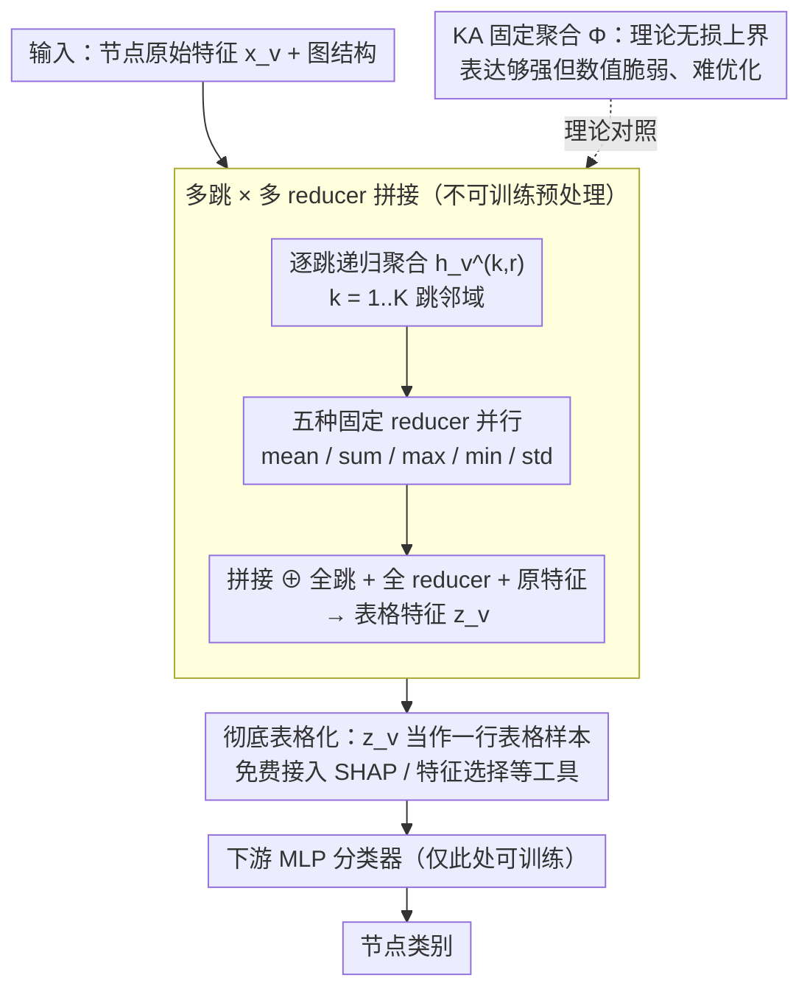

# Fixed Aggregation Features Can Rival GNNs

**会议**: ICML2026  
**arXiv**: [2601.19449](https://arxiv.org/abs/2601.19449)  
**代码**: 未公开  
**领域**: 图学习 / GNN / 表格学习  
**关键词**: 固定聚合, 多跳特征拼接, Kolmogorov-Arnold, MLP baseline, 节点分类

## 一句话总结
本文提出 Fixed Aggregation Features (FAF)：把多跳邻域用 mean/sum/max/min/std 等**不可训练**的聚合算子压成表格特征再喂给 MLP，在 14 个节点分类基准中有 12 个能与精调过的 GCN/GAT/GraphSAGE 乃至 Graph Transformer 打平甚至超越，从而对"GNN 的可训练邻域聚合到底有多必要"提出系统性质疑。

## 研究背景与动机

**领域现状**：节点分类几乎被 message-passing GNN 垄断。从 GCN/GAT/GraphSAGE 到 Graph Transformer 与异质性专用模型，主流叙事是"每一层都要学习一次邻域聚合 + 线性变换"，由此带来的高复杂度被默认为是表达能力所必需的代价。

**现有痛点**：(1) Luo et al. 2024 已经发现，只要超参精调，经典 GNN 与 SOTA Graph Transformer 几乎打平——这暗示新模型加的复杂度并未真正吃到收益；(2) 注意力机制存在已知的可训练性问题（梯度小、无法静音邻居）；(3) GNN 普遍在训练集上很快过拟合，验证集最优往往出现在"聚合还没真正学好"时。

**核心矛盾**：表达能力（expressiveness）与可学习性（learnability）被长期混为一谈。理论上 GNN 能学到信息保持的聚合，但实际优化是否真的学到了？还是说，**固定的、甚至非信息保持的聚合**就已经够用？

**本文目标**：用一个极简到接近 baseline 的方案探针式回答两个子问题——(a) 不学聚合还能做多好？(b) 现有 benchmark 是否真的"必须学聚合"才能解？

**切入角度**：作者从 Kolmogorov-Arnold 表示定理出发，证明存在**固定的、单变量的、信息无损**邻域聚合 $\Phi$，使得任意多重集函数都能写成 $f = g \circ \Phi^{-1}$，把"学聚合 + 学分类器"还原为只学一个 $g$。但 $\Phi$ 不连续、数值脆弱、产生"粗糙"的嵌入难以被 MLP 处理；于是退一步看简单 reducer（mean/sum/max/min/std）——它们虽不可逆，却经验上反而更好优化。

**核心 idea**：把 GNN 的"可训练多层聚合"替换成"预处理阶段的多跳固定聚合 + 拼接 + 表格 MLP"，让图学习问题退化成表格学习问题，从而获得可解释性、可调参性和效率上的全面收益。

## 方法详解

### 整体框架

FAF 想解决的是"GNN 每一层都要学一次邻域聚合，到底是不是必须"这个问题，做法是把可训练的多层聚合彻底搬到预处理阶段、换成一组不可训练的固定算子，让图学习退化成普通表格学习。整个流程只有两步：先离线把每个节点的多跳邻域用 mean/sum/max/min/std 等固定 reducer 压成一行表格特征，再把这行特征喂给一个精调过的 MLP 做分类。中间没有 message-passing 层、没有 attention、没有任何可训练的传播矩阵，所有图结构信息都在预处理时一次性烘焙进特征向量。

### 关键设计

**1. 多跳 × 多 reducer 拼接：用互补算子在表格空间里近似单射**

FAF 的核心难题是单个固定聚合必然有信息损失。作者先给出理论支撑（Thm 4.1）：当节点特征正交时，1 跳 sum 聚合是**单射**的，可无损表达任意多重集函数，而 mean 在节点度数已知时与 sum 等价。但 $k \geq 2$ 之后正交性不再成立，单个 reducer 一定丢信息——不同 reducer 各抓分布的一个侧面：sum 数个数、mean 加度数权重、max/min 盯住 tail。既然单算子不可逆，那就用多个互补算子在表格空间里"近似单射"。

具体地，对每个节点 $v$、每个 reducer $r \in \mathcal{R}$、每个跳数 $k \in \{1,\ldots,K\}$，递归计算 $h_v^{(0,r)} = x_v$、$h_v^{(k,r)} = r(\{h_u^{(k-1,r)} : u \in N(v)\})$，再把所有跳、所有 reducer 的结果与原始特征全部拼接：

$$z_v = x_v \oplus \bigoplus_{r \in \mathcal{R}} \bigoplus_{k=1}^{K} h_v^{(k,r)}$$

得到维度为 $|x_v| \cdot (1 + |\mathcal{R}| \cdot K)$ 的表格特征。这里"拼接而非选其一"是关键：不是替 MLP 提前选好跳数和算子，而是把所有候选都摆上桌，让 MLP 当"软 feature selection"自己挑组合。消融（Tab 10/11）显示只用最后一跳、或把 MLP 换成单层线性都明显掉点，说明拼接和非线性分类器缺一不可。

**2. Kolmogorov-Arnold 构造：把"表达够不够"和"学得动学不动"分开**

为了说清 FAF 框架的表达能力上界，作者搬出一个理论上**完全无损**的固定聚合 $\Phi(x_1,\ldots,x_d) = 3\sum_{p=1}^{d} 3^{-p}\phi(x_p)$（基于 Cantor 集的三进制展开，沿用 Schmidt-Hieber 2021）。$\Phi$ 是 $[0,1]^d \to \mathbb{R}$ 的单射，把所有"学聚合"的负担推给一个可学单变量 $g$，任意连续 $f$ 都能写成 $g \circ \Phi^{-1}$ 并继承 $f$ 的逼近率——也就是说理论上 FAF 框架不会输给 GNN。

但 $\Phi$ 不连续、会把相近输入推到很远的地方，产生"粗糙"嵌入让下游 MLP 学不动。这恰好印证了作者真正想说的：简单 reducer 之所以在实践中胜出，靠的是**易优化**而非更强表达。一个有力旁证是 Roman-Empire——简单 reducer 在那里明显落后，但换成 KA 聚合反而拿到全场最高的 $80.33$，说明那里的差距是 reducer 丢了信息，而不是"必须学聚合"。

**3. 彻底表格化：免费接入整个表格学习工具箱**

把图问题转成表格问题后，"特征 / 跳数 / reducer 选择"三者被解耦，整套表格学习工具——SHAP、feature importance、特征选择、类别不平衡、噪声鲁棒方法——可以直接套用。这是 GNN 端到端结构长期做不到的：在 GNN 里几乎无法归因"哪一层学到了什么"。作者在 Minesweeper 上跑 SHAP，发现模型最重要的信号正是 "hop-1 mean of feature 1"（邻居中本地炸弹计数为 0 的比例），完美对应游戏的真实推理逻辑；Pubmed/Amazon-Ratings 上也得到类似可读的归因。还可以在表格层面拼接 graph rewiring（如按特征余弦相似度删边）后的额外聚合，作为对比性诊断而不破坏原信息。其价值不止于可解释，更让"这个图 benchmark 到底有没有结构信号、哪些跳有信号、哪些 reducer 冗余"第一次可以被独立审视。

### 损失函数 / 训练策略

下游 MLP 用标准交叉熵 + dropout + LayerNorm；超参网格沿用 Luo et al. 2024 以保证与 Graph Transformer 直接可比。值得注意的是 FAF 偏好**较大的学习率**（带来更快收敛和稀疏化的隐式正则），dropout 水平却与 GNN 相当——后者表明 dropout 收益主要来自数据集本身而非图卷积特性。

## 实验关键数据

### 主实验

14 个标准节点分类基准上，FAF 最佳变体 vs 经典 GNN（节选 Table 1）：

| 数据集 | GCN | GAT | SAGE | FAF$_\text{bestval}$ | 结论 |
|--------|------|------|------|------|------|
| Amazon-Computer | 93.58 | 93.91 | 93.31 | **94.01** | FAF 略胜 |
| Amazon-Photo | 95.77 | 96.45 | 96.17 | **96.54** | FAF 略胜 |
| Amazon-Ratings | 53.86 | 55.51 | 55.26 | 55.09 | 持平 |
| Pubmed | 80.00 | 79.80 | 77.42 | **80.96** | FAF 略胜 |
| Questions | 78.44 | 77.72 | 76.75 | **78.69** | FAF 略胜 |
| WikiCS | 80.06 | 81.01 | 80.57 | 80.25 | 持平 |
| Coauthor-CS | 95.73 | 96.14 | 96.21 | 95.37 | 略低 1% |
| Cora | 84.38 | 83.02 | 83.18 | 82.84 | 略低 1.5% |
| **Minesweeper** | 97.48 | 97.00 | 97.72 | **90.00** | **明显落后** |
| **Roman-Empire** | 91.05 | 90.38 | 90.41 | **78.11** | **明显落后** |

整体战绩：5 个数据集超越 GNN、5 个持平（差距 ≤1%）、4 个落后，其中 Minesweeper/Roman-Empire 落差最大。

### 消融实验

| 配置 | 关键现象 | 说明 |
|------|---------|------|
| FAF4 (mean+sum+max+min) | 多数据集最佳 | 默认配置 |
| 单 reducer (Tab 7) | mean 最常胜出 | Citeseer 喜欢 sum、Amazon-Ratings 喜欢 max |
| 只用最后一跳 (Tab 11) | 明显掉点 | 证实拼接所有跳必要 |
| 单层线性分类器 (Tab 10) | 显著低于 MLP | 证实 MLP 非线性是关键 |
| KA 聚合 (Tab 12) | Roman-Empire 反而最高 80.33 | 印证落后数据集是信息丢失而非"必须学聚合" |
| 增加跳数 (Tab 8) | 多数 $k=2$ 达峰，后续平/降 | 信号集中在前两跳 |

### 关键发现

- **最好的 FAF 普遍只用 2-4 跳就够**，而 Minesweeper/Roman-Empire 上 GNN 需要 10-15 层；这两个特殊数据集靠的恰是 GNN 的线性残差连接（Luo et al. 2024），换句话说 FAF 与 GNN 之间的差距与"加不加残差"的差距高度吻合。
- **mean 单独使用就经常进 top**，暗示邻域分布信息是任务信号的主体，而度数信息（隐含在 mean 与 sum 的比值中）足以区分邻居贡献。
- **GNN 常见的 over-smoothing、深层退化、对 dropout 敏感**等现象在 FAF 这种纯表格设定下同样出现——说明这些"病症"未必是 message-passing 本身的锅，更可能源于数据集特性。
- KA 聚合在 Roman-Empire 上反超所有简单 reducer，证明那里的差距是 reducer 信息丢失，而非"必须靠可训练聚合"。

## 亮点与洞察

- **"训练-free 也能打 SOTA" 的强反例**：以最直白的 baseline 形式正面挑战"GNN 需要学习聚合"这一隐含信念，方法朴素到不可能被认为是过拟合 benchmark 的产物，因此说服力极强。
- **理论与实验形成漂亮的双向印证**：Kolmogorov-Arnold 构造说明"理论上 FAF 已足够"，而简单 reducer 战胜 KA 聚合又说明"实际可学习性比表达能力更重要"，两个方向的发现互为支撑。
- **可解释性是真正的免费午餐**：用 SHAP 直接看到 Minesweeper 上模型在用什么特征做决策，这种粒度的归因在 GNN 上几乎不可能；这给"诊断 graph benchmark 是否真有结构信号"提供了可复用工具。
- **对整个领域 benchmarking 的拷问**：作者明确呼吁后续工作必须把"精调 FAF"作为标准基线——任何声称自己利用了复杂图结构的新模型，如果赢不了 FAF，那"赢的就不是图结构"。这种范式压力是这篇论文最持久的贡献。

## 局限与展望

- 作者承认 FAF 在 Minesweeper/Roman-Empire 上确实落后，根因是长程依赖 + reducer 信息丢失；这两个数据集恰好是少数真正"GNN 不可替代"的场景。
- 自身局限：当 reducer/跳数/原始特征维度都大时，拼接后的输入维度爆炸，MLP 第一层参数与训练成本随之上升，需要特征选择；本文未给出系统化的降维方案。
- 实验集中在节点分类，未触及链接预测、图分类、动态图等任务，FAF 是否在这些任务上也通用尚未验证。
- 改进思路：(a) 设计既单射又"光滑"的聚合（介于 mean 和 $\Phi$ 之间）；(b) 把 FAF 与部分可学习聚合混合，让模型自动决定哪些跳/reducer 要学；(c) 把这套表格化诊断方法反向用于设计真正"必须学聚合"的新 benchmark。

## 相关工作与启发

- **vs SGC (Wu et al. 2019)**：SGC 同样剥离非线性、固定传播，但只用线性 readout 且只考虑线性扩散；FAF 引入 max/min/std 等**非线性** reducer，并用 MLP 而非线性分类器，因此覆盖范围更广、表达更强。
- **vs SIGN/GAMLP/HOGA**：这些工作也预计算多跳特征，但仍学习复杂 attention/gating 决定跳数权重，定位是"可扩展性优化"；FAF 把 MLP 当成软 feature selector，完全不学传播侧任何参数，定位是**baseline 与诊断工具**。
- **vs G2T-FM / TabPFN-GN / Hayler et al. 2025**：并行的"表格化 + 表格基础模型"路线，目标是把 TFM 适配到图；FAF 的目标相反——用最简表格学习探测"图任务到底需不需要学聚合"，两者构成互补的实证证据。
- **vs PNA (Corso et al. 2020)**：PNA 也强调多 reducer 组合 + degree scaler 来提升表达能力，但仍是端到端可训练 GNN；FAF 把同样的"多 reducer"思想推到极致——完全 freeze 聚合层。

## 评分
- 新颖性: ⭐⭐⭐⭐ 方法本身极简，但提出的视角（用 KA 解释 + 表格化诊断）和系统性的反例价值很高
- 实验充分度: ⭐⭐⭐⭐⭐ 14 个标准 benchmark + 多组消融 + SHAP 可解释 + KA 对照，覆盖完整
- 写作质量: ⭐⭐⭐⭐⭐ 论证逻辑清晰，理论与实验互为支撑，限制承认坦率
- 价值: ⭐⭐⭐⭐⭐ 对整个 GNN 评估范式构成长期压力，会被广泛引用作为标准 baseline 和 benchmark 设计参考

<!-- RELATED:START -->

## 相关论文

- [\[AAAI 2026\] Logical Characterizations of GNNs with Mean Aggregation](../../AAAI2026/graph_learning/logical_characterizations_of_gnns_with_mean_aggregation.md)
- [\[AAAI 2026\] Enhancing Logical Expressiveness in GNNs via Path-Neighbor Aggregation](../../AAAI2026/graph_learning/enhancing_logical_expressiveness_in_graph_neural_networks_via_path-neighbor_aggr.md)
- [\[ICML 2026\] Identifying and Correcting Label Noise for Robust GNNs via Influence Contradiction](identifying_and_correcting_label_noise_for_robust_gnns_via_influence_contradicti.md)
- [\[AAAI 2026\] Beyond Fixed Depth: Adaptive Graph Neural Networks for Node Classification Under Varying Homophily](../../AAAI2026/graph_learning/beyond_fixed_depth_adaptive_graph_neural_networks_for_node_classification_under_.md)
- [\[ICLR 2026\] GRAPHITE: Graph Homophily Booster — Reimagining the Role of Discrete Features in Heterophilic Graph Learning](../../ICLR2026/graph_learning/graph_homophily_booster_reimagining_the_role_of_discrete_features_in_heterophili.md)

<!-- RELATED:END -->
