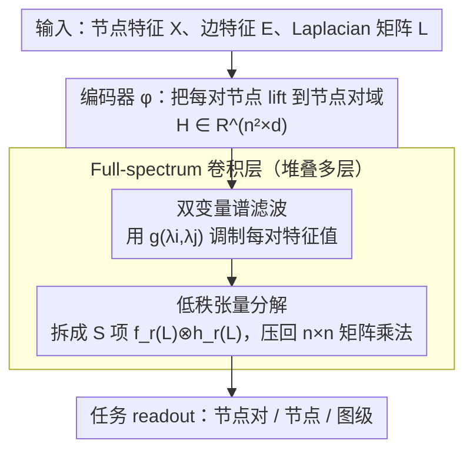

# Full-Spectrum Graph Neural Network: Expressive and Scalable

**会议**: ICML 2026  
**arXiv**: [2605.05759](https://arxiv.org/abs/2605.05759)  
**代码**: 无  
**领域**: 图学习 / 谱图神经网络 / 表达力理论  
**关键词**: 谱 GNN, 节点对域, 双变量滤波, 异质图, Local 2-GNN, Kronecker 积

## 一句话总结
本文把经典谱 GNN 的单变量特征值滤波器 $g(\lambda_i)$ 推广为双变量滤波器 $g(\lambda_i,\lambda_j)$，把信号从节点域抬到节点对域，理论上能逼近 Local 2-GNN（超越 1-WL），并通过低秩张量分解避开 $n^2\times n^2$ 显式计算，在异质图节点分类和子结构计数上拿到强结果。

## 研究背景与动机

**领域现状**：谱 GNN 把图卷积参数化为 Laplacian 滤波 $U g(\Lambda) U^\top x$，已经被证明在节点信号近似上是 universal 的，但其区分非同构图的能力（也就是 expressivity 的另一个维度）被严格地卡在 1-WL 测试以下。要突破 1-WL，空间方法的做法是把消息传递从节点域 $V$ 抬到节点对域 $V\times V$ 甚至 $k$ 元组（如 morris 等人的高阶 GNN），但谱方法上对应的“lifting”一直是空缺。

**现有痛点**：(1) 在异质图（heterophilic graph）上，相邻节点常带不同标签，传统谱 GNN 的对角谱滤波 $g(L)$ 难以学到“跨类抑制、类内增强”的卷积模式；(2) 高阶空间 GNN 虽然表达力强，但计算复杂度往往是 $O(n^k)$，可扩展性差；(3) 谱方法在“为什么必须有非对角谱分量”这个问题上缺乏理论解释。

**核心矛盾**：谱方法天然紧凑、能 universal 近似节点信号，但表达力被 1-WL 卡死；空间高阶方法表达力够强但不可扩展。两条线没有桥梁。

**本文目标**：(1) 给出谱 GNN “lift 到节点对域”的对应物，并证明它能达到 Local 2-GNN 级别的判别力；(2) 给出可扩展的工程实现，不显式构造 $n^2\times n^2$ 矩阵；(3) 证明经典谱 GNN 在异质图上的失败是“缺非对角谱分量”这件事的必然后果，并展示新方法天然能修复。

**切入角度**：节点信号 $x\in\mathbb{R}^V$ 的 GFT 是 $U^\top x$；那么节点对信号 $\varepsilon\in\mathbb{R}^{V\times V}$ 的 GFT 自然是 $(U\otimes U)^\top \varepsilon$，对应基为 $\{u_i u_j^\top\}$，滤波器从向量 $g_\lambda=(g(\lambda_i))_i$ 升级成矩阵 $G_\lambda=(g(\lambda_i,\lambda_j))_{ij}$——这是“最自然的二阶谱推广”。

**核心 idea**：用双变量谱滤波 $g(\lambda_i,\lambda_j)$ 替代单变量 $g(\lambda_i)$，作为谱方法的二阶 lifting；并用低秩张量分解把节点对域计算压回到节点域。

## 方法详解

### 整体框架
要解决的问题是：谱 GNN 的表达力被 1-WL 卡死，根源在于它只在节点信号 $x\in\mathbb{R}^V$ 上做对角滤波 $g(\lambda_i)$。本文把信号整体抬高一维——从节点域 $V$ 升到节点对域 $V\times V$，于是滤波器自然从单变量 $g(\lambda_i)$ 变成双变量 $g(\lambda_i,\lambda_j)$。具体地，先用编码器 $\phi$ 把每对节点的特征 lift 成 $H_{uv}=\phi(X_u,X_v,E_{uv})$ 并 reshape 成 $H\in\mathbb{R}^{n^2\times d}$，再堆叠若干 full-spectrum 卷积层 $H'=\sigma\big(g(L\otimes I_n,\,I_n\otimes L)\,H\,W\big)$，最后按任务取 node-pair / node / graph 级 readout。难点全在那个双变量函数 $g$ 上：怎样参数化它既能拿到二阶表达力，又不真的去算 $n^2\times n^2$ 的矩阵——这正是「双变量谱滤波」（表达力）和「低秩张量分解」（可扩展）这两个关键设计分别要解决的；第三个设计「非对角谱分量的必要性证明」则是从异质图角度回答“为什么非这么做不可”的理论支撑，不在前向数据流里。

### 关键设计

**1. 节点对域上的双变量谱滤波：让每一对特征值都能独立调制**

传统谱卷积是 $\sum_i g(\lambda_i)\,u_iu_i^\top x$，它的痛点是滤波器只认单个特征值，无法表达"频率 $\lambda_i$ 和 $\lambda_j$ 的交互"，这正是 1-WL 上界的来源。本文把节点对信号 $\varepsilon\in\mathbb{R}^{V\times V}$ 放进以 Kronecker 基 $\{u_i\otimes u_j\}$ 张成的 $\mathbb{R}^{n^2}$ 正交空间，定义双变量谱滤波矩阵 $G_\lambda=(g(\lambda_i,\lambda_j))_{ij}$，卷积写成 $G_\lambda \ast_G \varepsilon = g(L\otimes I_n,\,I_n\otimes L)\,\varepsilon = \sum_{i,j} g(\lambda_i,\lambda_j)\,u_iu_i^\top\varepsilon\,u_ju_j^\top$。这个推广是自洽的：Proposition 3.3 指出当限制 $g(s,t)$ 只取对角值 $g(\lambda_i,\lambda_i)$ 时它恰好退回经典的 $U g(\Lambda) U^\top x$，所以经典谱 GNN 只是 full-spectrum 的"对角嵌入特例"。之所以有效，是因为节点对域是超越 1-WL 最自然的 lifting 域，而非对角分量 $g(\lambda_i,\lambda_j),i\neq j$ 恰好解锁了异质图所需的滤波模式。理论上这两件事都被坐实：Theorem 3.4 证明线性 FSpecGNN 能 universally 近似任意一维节点对信号，Theorem 3.8 证明存在双变量多项式 $q$ 使 FSpecGNN 达到 Local 2-GNN 的判别力，严格超越 1-WL。

**2. 低秩张量分解：把二阶卷积压回节点域的矩阵乘法**

直接学 $g(\lambda_i,\lambda_j)$ 要做 $O(n^3)$ 的特征分解、再显式构造 $n^2\times n^2$ 的 Kronecker 积，对大图完全不可行——这是二阶谱方法一直没落地的拦路虎。解法是用双变量多项式 $P(s,t)=\sum_{i+j\le K} a_{ij}\,s^i t^j$ 参数化 $g$，关键观察（Proposition 3.9）是 $P(L\otimes I_n,\,I_n\otimes L)=\sum_{r=1}^R f_r(L)\otimes h_r(L)$ 当且仅当 $R\ge\mathrm{rank}(A)$，其中 $A=(a_{ij})$ 是系数矩阵。于是只要对 $A$ 做低秩近似，取 $\mathcal{T}_L^S\coloneqq \sum_{r=1}^S f_r(L)\otimes h_r(L)$（$S\ll\mathrm{rank}(A)$，每个 $f_r,h_r$ 是次数 $\le K$ 的单变量多项式，如 Bern、Cheb），双变量滤波就被拆成 $S$ 项一阶谱滤波的 Kronecker 和。再借恒等式 $(L^p\otimes L^q)\,\mathrm{vec}(\varepsilon)=\mathrm{vec}(L^q\,\varepsilon\,L^p)$ 把每个 Kronecker 乘法换成两次 $n\times n$ 矩阵乘法，整体计算量降到 $O(SK\cdot n^2 d)$，与一阶谱 GNN 同阶。这一步让二阶谱方法第一次拿到和一阶方法可比的扩展性。

**3. 非对角谱分量的"必要性证明"：把异质图刻画成二阶现象**

"非对角谱分量到底是不是冗余"长期没有答案，本文用异质图给出了代数层面的回答。在"类条件特征 + 类内压缩"的简化模型下定义类平方误差 $\mathcal{L}(C)=\sum_a \frac{1}{n_a}\sum_{p\in V_a}\mathbb{E}\|Y_p-m_a\|_2^2$，Theorem 4.1 证明最优卷积 $C^*$ 渐近呈"按类块对角"形态——类内权重 $1/(n_a+\tau_a)$、类间为 0。更尖锐的是 Theorem 4.2：若 $C=g(L)$ 是任意经典谱滤波且要求跨类条目全为 0，则必有 $C=\alpha I_n$，也就是经典谱 GNN 根本不可能逼近这个最优算子；而 FSpecGNN 用 full-spectrum 卷积稍作修改就能实现它。这把"GCN 在异质图上崩"从工程经验升级为代数不可能性结论，明确说明异质图本质上是个二阶现象，给二阶谱架构的优越性提供了第一手理论支撑。

### 损失函数 / 训练策略
监督训练，节点分类用交叉熵、子结构计数用 MAE。谱基 backbone 三选一：FSpecGNN(Cheb) / (ChebII) / (Bern)，分别用对应多项式充当 $f_r,h_r$。低秩参数 $S$ 和多项式阶数 $K$ 由验证集挑选；图较小时可直接走显式路径（特征分解 + MLP $g_\theta$ 学 $g$），无需低秩近似。

## 实验关键数据

### 主实验

**异质图节点分类**（高分越好）：

| 模型 | Chameleon | Squirrel | Tolokers | Questions | Wisconsin |
|------|-----------|---------|----------|-----------|-----------|
| ChebNetII | 33.48 | 30.80 | 69.37 | 63.99 | 41.33 |
| GPRGNN | 30.44 | 24.33 | 67.05 | 53.76 | 40.79 |
| BernNet | 29.45 | 25.94 | 69.31 | 65.41 | 49.33 |
| **FSpecGNN(Cheb)** | 33.09 | **39.57** | 76.89 | 75.87 | 49.87 |
| **FSpecGNN(ChebII)** | **39.60** | 37.70 | 76.37 | **77.00** | 50.00 |
| **FSpecGNN(Bern)** | 37.91 | 37.59 | 74.50 | 77.11 | **54.58** |

本文三种变体在 Squirrel 上把 SOTA 从 30.80 直接拉到 39.57（+8.77），在 Questions 上 +11.6 个点，所有异质图数据集上都明显优于对应的一阶谱 baseline，验证了 Theorem 4.1/4.2 的理论结论。

### 消融实验

| 配置 | 子结构计数 MAE | 异质图分类 | 说明 |
|------|----------------|-----------|------|
| FSpecGNN (full, $S$=低秩) | 最低 | 最高 | 完整模型 |
| 退化为对角分量（$g(s,t)=h(s+t)$） | 显著上升 | 接近 BernNet | 等价于在 Kronecker sum 上做一阶谱，验证 lifting 必须保留非对角 |
| 不做低秩近似（$S=\mathrm{rank}(A)$） | 略低于 full | 同水平 | full-rank 性能稍好但 GPU 内存暴涨 5-10× |
| 替换为 spatial 2-GNN | 同水平 | 略低 | 表达力相当，但 runtime 5× 慢、内存最高 |

### 关键发现
- 在子结构（chordal cycle）计数任务上，FSpecGNN 与 spatial Local 2-GNN 表达力对齐，但 runtime 约低 5×，peak GPU memory 全场最低——把“二阶表达 + 一阶代价”落地。
- 在异质图上提升幅度最大的数据集（Squirrel/Questions）也是异质度 $h(G)$ 最高的，与 Figure 3 的“off-diagonal energy 随异质度增长”观察一致，方法机理与现象完全对应。
- 低秩 $S$ 是关键超参：$S$ 太小（如 1）退化成对角解，$S$ 太大失去效率优势，论文经验上 $S=4\sim 8$ 即可在大多数任务上达到 full-rank 性能的 95%+。

## 亮点与洞察
- 给谱 GNN 找到“正确的 lifting”——节点对域 + Kronecker 基，是对“谱方法 vs 空间方法”二分长期争论的精彩弥合：表达力上对齐 Local 2-GNN，工程上仍保持谱方法的稀疏多项式形式。
- “异质图本质是二阶现象”是非常强的理论 framing，Theorem 4.2 把现象（GCN 在异质图崩）变成代数不可能性，比以往“高/低通滤波分离”之类的解释更深一层。
- 低秩张量分解 + $(L^p\otimes L^q)\mathrm{vec}(\varepsilon)=\mathrm{vec}(L^q \varepsilon L^p)$ 把二阶卷积压回 $n\times n$ 矩阵乘法的小 trick，可直接套到其他需要 Kronecker 操作的图算法（如多视图谱聚类、Sinkhorn-Knopp on graphs）。
- 把节点对域的 universal 近似（Theorem 3.4）与判别力（Theorem 3.8）两个本来正交的 expressivity 维度同时拿下，结构干净。

## 局限与展望
- 作者承认 Theorem 3.8 是“存在性”而非“可学性”——多项式 $q$ 存在但优化器不一定能学到，所以经验表达力可能比 Local 2-GNN 强一点也可能弱一点。
- 自评：节点对域的输入 $E\in\mathbb{R}^{n\times n\times d_2}$ 在稀疏图上虽然可以稀疏化，但内存仍是 $O(n^2 d)$，对百万节点级图（OGB-LSC、Reddit）的可行性需要更多稀疏实现细节。
- 论文只评测节点分类和子结构计数，没有给 link prediction、graph-level regression 等其他依赖节点对信号的任务结果。
- $S$ 的选择目前是验证集搜索，未来工作可以让 $S$ 数据自适应（类似 NAS 或者结构稀疏化）。
- 没有讨论与最近的 GNN+attention 混合架构（如 GraphGPS）的对比，谱+attention 双重 lifting 是一个明显的下一步。

## 相关工作与启发
- **vs Local 2-GNN（zhangbeyond）**：本文是其谱版本，把二阶节点对域的判别力用谱滤波器实现；优势是工程上不显式遍历节点对、代价低；劣势是“存在性”不等于“总能学到”。
- **vs BernNet / ChebNetII / GPRGNN**：都是一阶谱多项式滤波；FSpecGNN 把它们都看作“对角嵌入特例”，并能用同一谱基（Bern/Cheb）作为 $f_r,h_r$ 拼出二阶滤波。
- **vs 异质图专用方法（H2GCN、GBK-GNN）**：那些方法靠局部启发式（区分自身/邻居/远邻），FSpecGNN 给出更普适的“非对角谱分量必要性”理论解释，并以谱形式自然得到跨类抑制的卷积。
- **可迁移启发**：(1) Kronecker 谱基 + 低秩张量分解是任何“想做二阶但又怕复杂度爆炸”的模型（含 attention、Transformer 上）通用的工程模板；(2) “最优算子-代数限制-架构选择”的论证链路是给新架构找必要性的一种漂亮范式。

## 评分
- 新颖性: ⭐⭐⭐⭐⭐ 把节点对域 lifting 这件事第一次以谱形式干净给出，并配上必要性定理，理论贡献扎实。
- 实验充分度: ⭐⭐⭐⭐ 异质图节点分类全面胜出，子结构计数与 spatial 2-GNN 对齐且更快；缺 link prediction 与超大图实验。
- 写作质量: ⭐⭐⭐⭐ 公式推导严谨，propositions 与 theorems 标注清楚；部分 lemma/notation 密度偏高，需要一定谱图基础。
- 价值: ⭐⭐⭐⭐ 既给社区一个“可扩展的二阶谱 GNN 基线”，也提供了异质图理论的新视角，落地与理论双重影响。

<!-- RELATED:START -->

## 相关论文

- [\[AAAI 2026\] On Stealing Graph Neural Network Models](../../AAAI2026/graph_learning/on_stealing_graph_neural_network_models.md)
- [\[ICML 2026\] Beyond Model Base Retrieval: Weaving Knowledge to Master Fine-grained Neural Network Design](beyond_model_base_retrieval_weaving_knowledge_to_master_fine-grained_neural_netw.md)
- [\[ICML 2025\] Mitigating Over-Squashing in Graph Neural Networks by Spectrum-Preserving Sparsification](../../ICML2025/graph_learning/mitigating_over-squashing_in_graph_neural_networks_by_spectrum-preserving_sparsi.md)
- [\[ICML 2026\] Physics-Informed Coarsening for Multigrid Graph Neural Surrogates](physics-informed_coarsening_for_multigrid_graph_neural_surrogates.md)
- [\[ICML 2026\] Quantile-Free Uncertainty Quantification in Graph Neural Networks](quantile-free_uncertainty_quantification_in_graph_neural_networks.md)

<!-- RELATED:END -->
