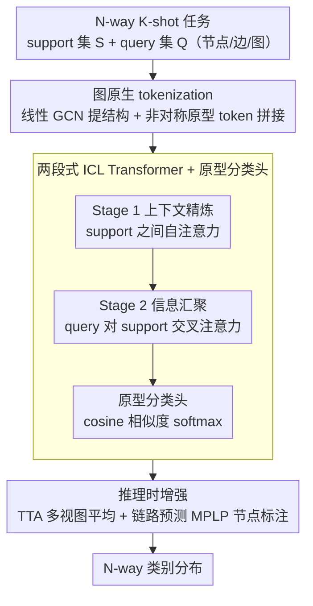

# GILT: An LLM-Free, Tuning-Free Graph Foundational Model for In-Context Learning

**会议**: ICML 2026  
**arXiv**: [2510.04567](https://arxiv.org/abs/2510.04567)  
**代码**: https://github.com/yiming421/inductnode/ (有)  
**领域**: 图学习 / 图基础模型 / In-Context Learning  
**关键词**: 图基础模型, 图上 ICL, 少样本图学习, 原型分类, Transformer

## 一句话总结
GILT 把节点/边/图三类少样本图分类统一改写成基于 token 的 in-context learning 问题，用"线性 GCN 提结构 + 非对称原型 token + 两段式注意力 Transformer + 原型头"的纯数值架构，做到既不依赖 LLM 也不需要任何下游 tuning，在 5-shot 设置下超过 LLM-based 和 tuning-based GFM，同时比它们快 1~4 个数量级。

## 研究背景与动机

**领域现状**：通用 GNN 在单图上性能强，但跨图迁移能力差，催生了"图基础模型"(GFM) 这一新方向。当前 GFM 主要有两条路线：一是借助 LLM 把节点/类别的文本属性映到统一语义空间（如 ZeroG, GOFA），二是先在大规模图上预训练一个结构化编码器，再用 graph prompting 对每个下游图做参数微调（如 GCOPE, RiemannGFM）。

**现有痛点**：LLM 路线本质上是 text-dependent，遇到分子图、社交网络这种以数值/类别/纯结构特征为主的图就无法工作，或要人工手写文本描述；prompting 路线虽然 graph-native，但每换一个图就要再跑一轮梯度下降，效率瓶颈明显，也违背了"开箱即用"的基础模型理念。

**核心矛盾**：图数据的极端异质性——每个图的特征空间维度/语义、标签集合、拓扑都可能不同——使得传统 GNN 的参数天然绑死在训练图上。要破除这个绑定，要么靠文本桥（受限于文本可得性），要么靠 tuning（受限于效率）。

**本文目标**：构造一个同时满足 LLM-free + tuning-free + multi-domain + multi-task + few-shot 的统一 GFM，让模型在推理时只看几个 support 样本就能直接处理任意 N-way K-shot 节点/边/图分类任务。

**切入角度**：作者借鉴 TabPFN 在表格数据上的成功——Transformer 配合 causal attention 能在结构化数据上做出色的 ICL。把图任务"翻译"成统一格式的 token 集合后，Transformer 就能像处理表格一样在图上做 ICL，从而完全绕开文本和 tuning。

**核心 idea**：用一句话概括就是「把图上少样本分类统一为 token reasoning，用 prototype-aware 的非对称 token + 两段式注意力让 Transformer 从 support 集合里"读懂"任务语义，再用 cosine prototype head 实现 on-the-fly 的 N-way 分类」。

## 方法详解

### 整体框架
GILT 要解决的是"同一个模型不经任何微调就能处理任意图的少样本分类"。它把输入的 N-way K-shot 任务——带标签的 support 集合 $\mathcal{S} = \{(x_i, y_i)\}_{i=1}^{N \times K}$ 加待预测的 query 集合 $\mathcal{Q} = \{x_j\}_{j=1}^{Q}$，其中 $x_i$ 可以是节点、边或整图——统一翻译成一组维度固定的 token。先用一个不带可学习权重的结构编码器把异质图压成结构感知 embedding，并和类别原型拼成 support/query token；再让一个两段式注意力的 ICL Transformer 从 support token 里"读懂"任务语义、注入到每个 query，最后由非参数的原型头算 cosine 相似度出类别分布。整套模型在 22 个跨域图上做元任务训练，学到的不是某张图的标签，而是"如何从 support 推断任务规则"这一能力。

### 关键设计

**1. 图原生 tokenization：线性 GCN + 非对称原型 token，解决异质图无法统一喂进 Transformer 的痛点**

图的特征维度、标签集合、拓扑各不相同，要让一个 Transformer 处理所有图，第一步是把它们都压成同一维度的 token。GILT 的结构编码器刻意用一个 4–6 层、**剥掉可学习权重和非线性激活**的线性 GCN（类 SGC/APPNP），每层只做 $H^{(l+1)} = \mathrm{LayerNorm}(\tilde{A} H^{(l)})$，把多跳邻域信息汇聚到节点上而不做任何语义投影；之后按任务类型聚成 item 表示 $h$（节点任务取节点 emb，边任务取两端 emb 的逐元素积，图任务取 pooling）。之所以禁用可学习权重，是因为预训练阶段的"语义投影"会过拟合到训练图的特征分布、破坏跨图泛化，所以作者把语义推理全部推迟到后面的 Transformer——消融里把它换回标准非线性 GCN 反而掉点正印证了这一点。

token 化的另一半是把类别信息也塞进固定维度。GILT 用 mean-pool + L2 归一化算出每类原型 $p_c$，然后**非对称地**构造 support token $t_s = [h_i \,\|\, p_{y_i}]$ 和 query token $t_q = [h_j \,\|\, \mathbf{0}]$：support 拼上自己标签对应的原型，query 拼一段零向量等着被填。这种非对称拼接巧妙化解了"既要 token 维度固定、又要让模型同时看见所有类别概念"的张力——比 one-hot（维度随类别数变化）和"拆成多个二分类"（看不到类间关系）都更优，也是后面 N-way 解耦的伏笔。

**2. 两段式 ICL Transformer + 原型分类头，解决 tuning-free 下如何把任务语义注入 query 并支持任意 N-way**

要做到推理时零参数更新，任务语义只能靠 attention 在 token 之间流动。受 TabPFN 的 causal mask 启发，GILT 每一层都拆成两步走，严格保证 support→query 的单向信息流。Stage 1 是上下文精炼，只在 support token 之间做多头自注意力 $T_\mathcal{S}' = \mathrm{SelfAttention}(T_\mathcal{S})$，让带标签的支持样本互相交互、凝出任务语义；Stage 2 是信息汇聚，query 通过多头交叉注意力 $T_\mathcal{Q}' = \mathrm{CrossAttention}(Q{=}T_\mathcal{Q},\, K{=}T_\mathcal{S}',\, V{=}T_\mathcal{S}')$ 从精炼后的 support 里抽取自己需要的上下文。这种"先自注意力再交叉注意力"的设计确保 query 之间互不影响、也不会污染 support，是 ICL 在结构化数据上稳定 work 的关键——消融里去掉整个 Transformer，性能直接崩到 ~13%。

最终分类交给一个非参数原型头。它只取 token embedding 中"类别空间"那一段，对 support 里同类样本做 mean 得到原型，query 走 softmax over cosine similarity 得到类别分布。把 item space 和 class space 的角色分离开来，使得同一个预训练模型不必改任何结构就能从 2-way 直接面对任意 N-way 任务——这正是 tuning-free 的另一根支柱。

**3. 推理时增强：TTA + 链路预测专用节点标注，解决预测方差大与 1-WL 表达瓶颈**

在不动共享 backbone 的前提下，GILT 在推理阶段做两件补强。一是对节点/边/图三类任务统一加 **test-time augmentation**——对原始特征做随机旋转产生多个视图、预测取平均，借鉴 TabPFN 已验证的 ensemble 对 ICL 模型很有效这一经验（消融显示 TTA 让四个节点数据集普遍涨 2–6 个点）。二是针对链路预测额外引入 MPLP-启发的节点标注估计：标准 MPNN 受限于 1-WL，无法区分同构子图中的不同边对，于是给目标边对补充结构线索。把表达力缺口的修复只放在推理时、而不是塞进 backbone，让一套统一模型在最难的 link-level 任务上也能站稳，同时保住"一套模型多任务"的简洁。

### 损失函数 / 训练策略
预训练语料覆盖 22 个跨域图（citation/social/molecule），共 45 万+ 节点、400 万+ 边，单图规模从几十到 17 万节点，特征维从个位数到 8000+。每步随机采一个 few-shot 任务，按 GILT 架构出预测，用标准 cross-entropy 监督：

$\mathcal{L} = -\frac{1}{|\mathcal{Q}|} \sum_{x_j \in \mathcal{Q}} \log P(y = y_j \mid x_j)$

测试集与预训练集完全 disjoint，整套训练目标是让模型获得"从 support 推任务规则"这个 meta-skill，而不是记某个图的标签。

## 实验关键数据

### 主实验

任务覆盖三大图学习类型；评估严格区分 train/test split，support 只从训练集采。

| 数据集 | 任务 | 指标 | 设置 | GILT | 之前最强 | 提升 |
|--------|------|------|------|------|----------|------|
| Cora | 节点分类 | Acc | 5-shot | 73.22 | GraphAny 72.68 | +0.54 |
| Citeseer | 节点分类 | Acc | 5-shot | 66.17 | GCOPE 63.90 | +2.27 |
| Pubmed | 节点分类 | Acc | 5-shot | 71.86 | GCN 69.88 | +1.98 |
| 节点 4 数据集均值 | 节点分类 | Acc | 5-shot | **69.51** | GAT 66.21 | +3.30 |
| ogbl-collab | 链路预测 | Hits@K | 5-shot | 67.83 | MaskGAE-sup 65.84 | +1.99 |
| ogbg-molhiv | 图分类 | ROC-AUC | 5-shot | 65.81 | GCN 55.56 | +10.25 |

亮点：在 5-shot 设置下不仅打过所有 ICL/tuning baselines，链路预测在 Cora/Citeseer/ogbl-collab 上甚至超过了用全量训练标签的有监督 SEAL/MaskGAE。

### 消融实验

| 配置 | Cora 5-shot Acc | 说明 |
|------|-----------------|------|
| Full model | 73.22 | 完整模型 |
| w/o ICL Transformer | 13.00 | 没有 Transformer 直接全崩，证明 ICL 模块是核心 |
| w/ Full Token for Prediction | 72.97 | 不做 item/class space 分离，掉一点但 WikiCS 掉近 10 个点 |
| w/o Graph Encoder | 57.50 | 无结构编码直接掉 15+ 点，结构信息不可或缺 |
| w/ Non-linear GCN | 70.76 | 把线性 GCN 换成有非线性的标准 GCN，反而掉点，验证"过拟合特征语义"假设 |
| w/ 2-layer Encoder | 70.52 | 浅层编码器表达力不够，深层（4–6）才是甜区 |
| base（无 TTA） | 68.68 | 仅 backbone，去掉 TTA 平均掉 ~4 个点 |

### 关键发现
- **ICL Transformer 是绝对核心**：去掉后性能崩到接近随机，比 graph encoder 还重要——这和 TabPFN 在表格 ICL 上的发现一致。
- **"线性优于非线性"是反直觉但稳定的结果**：把可学习权重剥掉的简化 GCN 反而比标准 GCN 强，这一现象在 4 个节点数据集上都成立，作者归因于"少参数 = 不过拟合预训练图的特征语义 = 跨图泛化更好"。
- **效率代差极大**：同硬件（RTX 4090）下，GILT 比 GAT 快 ~20×，比 tuning-based GCOPE 快 180×，比 LLM-based GOFA 快 **14000×**。tuning-free + LLM-free 不只是漂亮口号，是真能做到亚秒级响应。
- **战胜带文本类标签的 zero-shot LLM**：仅 5 个数值样本的 GILT 在四个 Planetoid 数据集上全面超过 ZeroG/GOFA/LLaGA，说明从 support 推语义比从文本类别名"查知识"更对图任务的胃口。

## 亮点与洞察
- **非对称 token + prototype 拼接**是设计中最巧妙的一笔：用一个固定维度同时编码了"item 是什么"和"它属于哪类的当前估计"，让 Transformer 既能做实例推理又能跨类比较，是 N-way 解耦的关键。
- **"语义全部交给 Transformer，结构编码尽量笨"的分工**是 LLM-free GFM 一个值得记的设计哲学：把可学习参数集中放在最该"懂"的地方，反而帮助泛化——这一思路可以直接搬到点云、时序等其他异质模态的 ICL 模型。
- **把 TabPFN 在表格上的成功(causal mask + ensemble)迁移到图**：这是少有的"承认图也是一种结构化数据"的视角，提示我们可以更激进地从表格 ICL 借设计而非一律重头发明 graph-specific 机制。
- **链路预测里只在 inference 阶段加 MPLP 节点标注**：把 1-WL 表达力缺口的修复放在推理时而不是 backbone，保持了"一套模型多任务"的简洁性，是一个值得复用的解耦思路。

## 局限性 / 可改进方向
- **任务仍局限于 N-way K-shot 分类**：回归、生成、节点排序等任务暂未覆盖；prototype head 的非参数化分类机制也不易直接推到回归。
- **支持集规模与 Transformer 复杂度**：上下文长度随 $N \times K$ 增长，注意力是 $O((NK+Q)^2)$，在大 N 或大 K 场景下会成为瓶颈；论文实验主要在 1-shot 和 5-shot，对中等 shot 量的扩展行为论证不充分。
- **WikiCS 上 1-shot 不如 GraphAny**：作者没深入解释，可能暗示 ICL 在极度噪声/异配性高的图上不如更简单的非参数方法稳。
- **线性 GCN 的"宽度"假设**：作者把 SGC/APPNP 当作"足够的结构表达"，但对异配图（heterophilic）这个假设可能不成立，需更复杂的图先验。
- **可改进方向**：把 prototype head 换成可微 retrieval/记忆模块，或引入 set-Transformer 降低注意力复杂度；引入更多任务类型（如链路属性预测）；在 inference 时按 query 难度动态决定 TTA 次数。

## 相关工作与启发
- **vs OFA**：OFA 也走 ICL 路线，但通过构造 prompt graph 把 support 连成虚拟节点交给 GNN 做单 forward 推理；GILT 直接用 Transformer 在 token 集合上做注意力，少了"必须构图"的束缚，跨任务统一性更强（节点 1-shot Cora 30.52 vs 56.36）。
- **vs GraphAny**：GraphAny 用非参数 analytical solver + 注意力融合，做到了 tuning-free 但限制在节点分类；GILT 把 ICL 通用化到 node/link/graph 三任务，且方法本身是端到端可训练的深网络，表达力更强。
- **vs GCOPE/RiemannGFM**：这些 prompting 路线靠预训练 + 下游 tuning 提性能；GILT 直接去掉 tuning，在不少节点数据集上反而更强，且推理快 100+ 倍。
- **vs ZeroG/GOFA**：这俩靠 LLM 把图文本化做 zero-shot；GILT 用 5 个数值样本就超过它们，说明对 text-poor 图（分子等）来说，LLM 路线不是必需而是包袱。
- **启发**：图基础模型的下一步可能不必再纠结"如何更好把图变文本"，而是想清楚"如何把图任务变成 Transformer 友好的 set/token 形式"。GILT 对 TabPFN 路线的迁移给社区开了一个新口子。

## 评分
- 新颖性: ⭐⭐⭐⭐ 首个真正同时做到 LLM-free + tuning-free + 跨 node/link/graph 三任务的 GFM，非对称 token + 两段注意力的组合值得记忆。
- 实验充分度: ⭐⭐⭐⭐ 覆盖三类任务 + 多个 baselines + 完整消融 + 效率分析，但缺极端情况（大 N、大 K、异配图）的压力测试。
- 写作质量: ⭐⭐⭐⭐ 动机递进清晰，每个设计选择都说明了"为什么这样"，方法和实验对应紧密。
- 价值: ⭐⭐⭐⭐ 工业上 latency-sensitive 的图任务直接受益，且为图上 ICL 提供了一个可复用的设计模板。

<!-- RELATED:START -->

## 相关论文

- [\[ICML 2026\] Quantile-Free Uncertainty Quantification in Graph Neural Networks](quantile-free_uncertainty_quantification_in_graph_neural_networks.md)
- [\[ICML 2026\] Message Tuning Outshines Graph Prompt Tuning: A Prismatic Space Perspective](message_tuning_outshines_graph_prompt_tuning_a_prismatic_space_perspective.md)
- [\[ICML 2026\] Are Common Substructures Transferable? Riemannian Graph Foundation Model with Neural Vector Bundles](are_common_substructures_transferable_riemannian_graph_foundation_model_with_neu.md)
- [\[CVPR 2025\] Knowledge Bridger: Towards Training-Free Missing Modality Completion](../../CVPR2025/graph_learning/knowledge_bridger_towards_training-free_missing_modality_completion.md)
- [\[CVPR 2026\] Graph-to-Frame RAG: Visual-Space Knowledge Fusion for Training-Free and Auditable Video Reasoning](../../CVPR2026/graph_learning/graph-to-frame_rag_visual-space_knowledge_fusion_for_training-free_and_auditable.md)

<!-- RELATED:END -->
