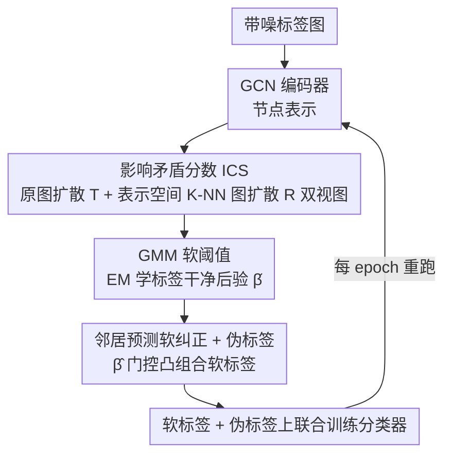

# Identifying and Correcting Label Noise for Robust GNNs via Influence Contradiction

**会议**: ICML 2026  
**arXiv**: [2601.17469](https://arxiv.org/abs/2601.17469)  
**代码**: https://github.com/wayc04/ICGNN  
**领域**: 图学习 / GNN鲁棒性 / 噪声标签  
**关键词**: 图神经网络, 噪声标签, 影响矛盾, 图扩散, GMM

## 一句话总结
ICGNN 在图扩散矩阵上定义"影响矛盾分数"(ICS) 从结构和属性两个层面度量节点标签的可疑程度，再用 GMM 软阈值挑出脏标签，并以邻居预测做凸组合式软纠正，在 6 个图基准上跑赢 NRGNN / RTGNN / CGNN / ProCon 等专门方法。

## 研究背景与动机

**领域现状**：图神经网络 (GNN) 在节点分类上的有效性高度依赖于干净的训练标签，但现实图数据（社交、推荐、分子）中的人工标注往往噪声重重；CV 领域的样本筛选 / 损失修正 / 标签修正三大类降噪方法在迁移到图上时大多忽视拓扑结构。

**现有痛点**：少数针对图的工作（NRGNN、RTGNN、CGNN、ProCon 等）在两个环节上仍不令人满意——(i) 检测端：NRGNN 干脆不检测、只是把无标签节点连到相似的标签节点，RTGNN/CGNN 用 small-loss 或简单的预测一致性，没有充分利用图的拓扑信息；(ii) 纠正端：RTGNN/ProCon 只对疑似噪声样本降权而不真正改标签，CGNN 用邻居多数投票，但在类别不平衡时极易出现确认偏差 (confirmation bias)。

**核心矛盾**：要在图上识别噪声标签，必须同时刻画"被周围同类节点支持"和"被异类节点干扰"这两种相反作用力，而以往方法只看其中之一（损失、邻居预测、特征相似度），导致干净 / 噪声样本的判别量分布大量重叠。

**本文目标**：(1) 设计一个能同时利用结构和属性、对全图传播路径敏感的噪声指标；(2) 用统计模型把噪声样本从干净样本中软分离出来；(3) 给定检测结果后用一种比硬投票更稳健的方式修正标签；(4) 利用大量无标签节点缓解标签稀缺。

**切入角度**：把图扩散矩阵 $\mathbf{T}=\epsilon(\mathbf{I}-(1-\epsilon)\hat{\mathbf{A}})^{-1}$ 的列 $\mathbf{T}_{\cdot i}$ 视作"其他所有节点对节点 $i$ 的全局影响分布"，再按类别聚合"非自身类别"的影响——若一个节点收到大量"异类影响"，按同质性假设（homophily）它的当前标签很可能是错的。

**核心 idea**：**用全局图扩散下的"异类影响累加"代替局部小损失/邻居投票，作为衡量标签可信度的指标，再用 GMM 学一个软阈值把噪声样本分离出来并按邻居预测软纠正。**

## 方法详解

### 整体框架
ICGNN 要解决的是"训练标签本身带噪时如何训出鲁棒 GNN"。它把这个问题拆成"先量化每个标注节点的标签有多可疑、再按可疑程度软纠正"两步，并塞进一个每个 epoch 都重跑的内循环里。具体地，先用 GCN 编码器跑出节点表示，从原邻接图和表示空间 K-NN 图两个视角算图扩散矩阵，聚合出每个标注节点的"影响矛盾分数"(ICS)，喂给两分量 GMM 得到"标签干净"的后验概率 $\hat{\beta}_i$；再用 $\hat{\beta}_i$ 当门控权重，把原标签和邻居预测做凸组合得软标签，同时给无标签节点打伪标签，最后在软标签加伪标签上联合训练分类器。三步同步迭代，表示、$\hat{\beta}_i$、伪标签每轮一起更新。

### 关键设计

**1. 影响矛盾分数 ICS：把"小损失"换成全图传播下的异类影响累加**

以往在图上检测噪声要么沿用 CV 的 small-loss（一个与拓扑无关的一维统计量，类间损失尺度一变分布就大量重叠），要么看局部一阶邻居投票（受类别不平衡和邻居稀疏拖累）。ICGNN 改用 personalized PageRank 写出的全局影响矩阵 $\mathbf{T}=\epsilon(\mathbf{I}-(1-\epsilon)\hat{\mathbf{A}})^{-1}$，把"全图所有节点对节点 $i$ 的影响"显式聚合：结构层 ICS 定义为 $\text{ICS}_i(\mathbf{T})=\sum_{j\neq y_i}\frac{1}{|\mathcal{C}_j|}\sum_{k\in\mathcal{C}_j}\mathbf{T}_{ki}$，即"所有非自身类别的节点对 $i$ 的归一化影响之和"——按同质性假设，一个干净节点应主要被同类支持、异类影响小，若一个节点收到大量异类影响，它的当前标签就很可疑。为补足结构视图在稀疏图上的不足，再在 GCN 表示上构 K-NN 图重算扩散矩阵 $\mathbf{R}$ 得属性层 $\text{ICS}_i(\mathbf{R})$，两者凸组合 $\text{ICS}_i=(1-\alpha)\text{ICS}_i(\mathbf{T})+\alpha\text{ICS}_i(\mathbf{R})$（默认 $\alpha=0.5$）。两视图互补：稠密图（Coauthor CS）结构视图更可靠，稀疏图（Pubmed）属性视图更可靠，而固定 $\alpha=0.5$ 反而比学权重更稳。论文还给出 Theorem 3.1 撑腰：若存在 $\delta\in(0,1]$ 满足某同质性界，则干净节点 $\text{ICS}_i\le 1-\delta$、噪声节点 $\text{ICS}_i\ge\delta$，当 $\delta>1/2$ 时两区间不相交，理论上可严格分离。

**2. GMM 软阈值：把"该砍哪条线"交给 EM 自动学**

Theorem 3.1 里的分离阈值 $\delta$ 实践中根本观测不到，硬卡一个阈值既难调又容易错。ICGNN 干脆对全体标注节点的 ICS 值 $\{\text{ICS}_i\}_{i=1}^L$ 拟合一个两分量高斯混合 $\sum_q\pi_q\mathcal{N}(\cdot|\mu_q,\sigma_q)$，用 EM 迭代算后验 $\beta(a_{iq})=\pi_q\mathcal{N}(\text{ICS}_i|\mu_q,\sigma_q)/\sum_{q'}\pi_{q'}\mathcal{N}(\cdot)$；收敛后把均值较小那簇（$\hat{q}=\arg\min_q\hat{\mu}_q$）当作"干净簇"，$\hat{\beta}_i=\hat{\beta}(a_{i\hat{q}})$ 就是节点 $i$ 标签干净的置信度。这样阈值从手调超参变成 EM 自动学出来的软边界，且输出天然落在 $[0,1]$，可以直接当下游纠正的权重，免去额外标定；复杂度只有 $O(LT)$，$T\le 10$ 即收敛，对大图几乎零负担。

**3. 邻居预测软纠正 + 伪标签：不硬改标签，按置信度凸组合**

CGNN 那种硬邻居投票在类别不平衡或邻居稀疏时极易把节点错改成多数类，滚出确认偏差。ICGNN 改成"软纠正"：第 $t$ 轮给标注节点 $i$ 写软标签 $\mathbf{l}_i^{(t)}=\hat{\beta}_i^{(t)}\mathbf{y}_i+(1-\hat{\beta}_i^{(t)})h^{(t)}(\mathbf{z}_i)$，其中邻居预测 $h^{(t)}(\mathbf{z}_i)=\operatorname{softmax}(\sum_{k\in I(i)}\mathbf{T}_{ki}\mathbf{p}_k^{(t)})$ 用扩散矩阵 $\mathbf{T}$ 加权聚合全局邻居（不限一阶）的 softmax 预测。$\hat{\beta}_i$ 在这里当信任度旋钮：越确定干净就越保留原标签，越确定脏就越听邻居，且邻居权重取 PageRank $\mathbf{T}_{ki}$ 而非一阶 $\mathbf{A}_{ki}$，能借高阶结构拿到更稳的证据。无标签节点也用同一个 $h^{(t)}(\mathbf{z}_i)$ 打伪标签缓解标签稀缺。最终损失把两部分拼起来 $\mathcal{L}=\sum_{i=1}^L \mathbf{l}_i^{(t)}\log\mathbf{p}_i^{(t)}+\sum_{i=L+1}^N h^{(t)}(\mathbf{z}_i)\log\mathbf{p}_i^{(t)}$，再叠加 NRGNN 的负采样重构项作辅助。

## 实验关键数据

### 主实验（节点分类准确率 %，噪声率 20%）

| 数据集 | 噪声 | GCN | RTGNN | CGNN | DND-NET | ProCon | **ICGNN** |
|--------|------|------|-------|------|---------|--------|-----------|
| Coauthor CS | Uniform | 80.3 | 86.7 | 84.1 | 86.2 | 85.4 | **87.4** |
| Amazon Photo | Uniform | 82.2 | 84.8 | 85.3 | 82.3 | 83.5 | **87.3** |
| Cora | Uniform | 70.3 | 79.1 | 76.8 | 76.5 | 78.6 | **80.9** |
| DBLP | Uniform | 71.0 | 79.0 | 78.9 | 77.0 | 77.2 | **80.1** |
| Citeseer | Uniform | 64.9 | 68.2 | 69.7 | 70.4 | 68.4 | **71.5** |
| Amazon Photo | Pair | 80.9 | 84.2 | 85.1 | 80.1 | 81.4 | **86.3** |
| Coauthor CS | Pair | 79.5 | 83.8 | 81.0 | 84.0 | 82.6 | **85.9** |

ICGNN 在 6 个数据集 × 2 种噪声 = 12 个 setting 中全部夺冠或并列第一；在 OGBN-Arxiv（NRGNN/RTGNN OOM）上 28.3 vs DND-NET 25.9；异质图 Cornell 上 44.7 vs 次优 RTGNN 42.3，跨规模和跨同/异质都站得住。

### 消融实验（Cora / DBLP，20% 噪声）

| 配置 | Cora-Uni | Cora-Pair | DBLP-Uni | 说明 |
|------|----------|-----------|----------|------|
| Full ICGNN | **80.9** | **79.4** | **80.1** | 完整模型 |
| w/o s-ICS | 79.4 | 78.1 | 78.1 | 去结构视图，掉 1.5–2.0 |
| w/o a-ICS | 79.2 | 77.9 | 78.3 | 去属性视图，掉 1.5–1.8 |
| w/o NC | 78.7 | 76.9 | 77.4 | 去软纠正，最大掉点 (-2.7) |
| w/o PL | 79.5 | 77.2 | 77.5 | 去伪标签，掉 1.4–2.6 |
| w $\mathbf{A}$ 替 $\mathbf{T}$ | 79.6 | 78.2 | 78.2 | 用一阶邻接代替全局扩散，掉 1.3–1.9 |

### 关键发现
- 软纠正 (NC) 是单点贡献最大的模块（去掉掉 2–3 个点），证明把"检测出的脏标签按邻居预测做凸组合"比单纯重加权或硬投票更能挽回精度。
- 把全局扩散 $\mathbf{T}$ 退化为一阶邻接 $\mathbf{A}$ 也明显掉点（>1 个点），说明 PageRank 路径信息对噪声检测和邻居聚合都不可少。
- 在 Amazon Photo 40% 噪声下做 ICS vs loss 的分布对比：loss 直方图严重重叠（尤其 pair noise），而 ICS 的干净/噪声两簇清晰分离，定性印证了 small-loss 准则在图上失效的论点。
- 鲁棒性曲线（噪声率 10%→40%）显示所有方法都掉点，但 ICGNN 衰减最慢；标签率 0.5%→2% 上 RTGNN 在 0.5% 几乎崩溃（small-loss 在样本过少时不靠谱），ICGNN 全程领先。
- $\alpha$ 扫描显示稠密图（Coauthor CS、Amazon Photo、DBLP）结构视图权重高一点更好，稀疏图（Pubmed）属性视图主导更好；让 $\alpha$ 可学反而比固定 0.5 略差，说明这是个不太需要精细调的钝旋钮。

## 亮点与洞察
- **把噪声检测重新表述为"全局影响矛盾"问题**：以往工作要么看 loss（一维统计量、与图无关），要么看一阶邻居投票（局部）。本文把它换成 PageRank 影响矩阵上"异类聚合 - 同类自洽"的对比，相当于把"小损失"这个 CV 老技术替换成一个真正利用图拓扑全局信息的新统计量，思路很自然却没人这么做。
- **GMM 软阈值 + 凸组合纠正的二段式**：检测端不强行二分类，而是输出概率 $\hat{\beta}_i$，纠正端把 $\hat{\beta}_i$ 当软门控权重——这套"软检测 + 软纠正"模式把后验置信度一以贯之，避免了硬阈值带来的"修错了也不能撤回"的风险，可直接复用到其他用 GMM 分离噪声的场景（如分子图、知识图谱噪声）。
- **结构 / 属性双视图扩散**：在表示空间额外构 K-NN 图再跑 PageRank，本质是把"特征相似性"也当成一种图，再让两种图扩散平均，简单又通用，可以拿到任意"原图 + 表示空间"任务（自监督、社区发现）里复用。
- **OGBN-Arxiv 不 OOM 而 NRGNN/RTGNN OOM**：ICGNN 没有显式扩边、不需要存稠密相似度图，加上 GMM 的 $O(LT)$ 复杂度可忽略，对大图友好——这点在论文未着重宣传但其实是工程亮点。

## 局限与展望
- ICS 强依赖同质性假设（Theorem 3.1 中的 $\delta$ 隐含连接节点倾向同类），在严重异质图上理论保证可能弱化；虽然 Cornell 上仍领先，但相对优势比同质图小，且 Cornell 只是规模很小的玩具异质数据，强异质（Squirrel、Chameleon）未做。
- 检测和纠正都依赖一个起初带噪训练的 GCN 编码器；当噪声率非常高时（>40%），第一轮表示本身被污染，可能影响属性视图 ICS 的可靠性——论文没探究 50%+ 极端噪声以及不对称噪声更复杂的设计。
- 类别先验 $|\mathcal{C}_j|$ 必须能数，但 $|\mathcal{C}_j|$ 是用带噪标签数的，类别极度不平衡时这个归一化可能放大长尾类的 ICS，引入新偏差。
- 整个 pipeline 是每个 epoch 重新跑一遍 PageRank + GMM + 邻居聚合，复杂度可控但实际墙钟时间在大图上仍非平凡；图变化时（动态图）扩散矩阵需要重新算，对在线场景不够友好。
- 实验只在节点分类上做，没有验证到图分类 / 链接预测，跨任务可迁移性待证。

## 相关工作与启发
- **vs NRGNN (KDD'21)**：NRGNN 通过给无标签节点加边来"绕过"噪声但不主动检测，本文显式给出噪声指标 + GMM，并把无标签节点用作伪标签辅助；ICGNN 在 6 个数据集 unform 噪声上全面领先 NRGNN ~1–3 个点。
- **vs RTGNN (WSDM'23) / ProCon (IJCAI'25)**：都用 small-loss 或一致性来检测、对疑似噪声样本降权；本文用扩散全局影响替代局部一致性，并把"降权"升级为"按邻居预测凸组合纠正"。在 0.5% 标签率极端场景下 RTGNN 几乎崩溃而 ICGNN 仍稳定，说明 small-loss 在样本极少时不可靠是结构性问题。
- **vs CGNN (ICASSP'23)**：CGNN 用邻居投票纠正，本文换成扩散加权 softmax 的凸组合，避免硬投票在类别不平衡时的确认偏差；可视化（Fig 5）显示 CGNN 用 loss 区分不开干净/噪声，ICGNN 的 confidence 分布则双峰清晰。
- **vs DND-NET (KDD'24)**：DND-NET 强调避免噪声传播 + 利用无标签数据，但没给出统一的噪声指标；ICGNN 把检测、纠正、伪标签拧成一个内循环，效果上 6 个数据集均高出 DND-NET 1–4 个点。

## 评分
- 新颖性: ⭐⭐⭐⭐ 把图扩散重新解读成"全局影响矩阵"并定义异类影响累加，是 small-loss 在图上的合理替代品，思路清晰且有理论
- 实验充分度: ⭐⭐⭐⭐⭐ 6 个标准图 + OGBN-Arxiv + Cornell（含同/异质 + 大小规模），覆盖 uniform / pair 两类噪声 + 噪声率 / 标签率扫描 + α 扫描 + 时间内存对比 + t-SNE 可视化
- 写作质量: ⭐⭐⭐⭐ 整体清晰，定理给出明确分离条件，三段式方法结构工整；图编号和公式排版稍乱，可读性可再打磨
- 价值: ⭐⭐⭐⭐ 给"图上 noisy label"提供了一个简单、可解释、复杂度低、对大图友好的强 baseline，凸组合软纠正和 GMM 软阈值的范式可直接迁到其他图鲁棒性任务

<!-- RELATED:START -->

## 相关论文

- [\[ICML 2026\] An Approximation Algorithm for Graph Label Selection](an_approximation_algorithm_for_graph_label_selection.md)
- [\[AAAI 2026\] Posterior Label Smoothing for Node Classification](../../AAAI2026/graph_learning/posterior_label_smoothing_for_node_classification.md)
- [\[AAAI 2026\] Logical Characterizations of GNNs with Mean Aggregation](../../AAAI2026/graph_learning/logical_characterizations_of_gnns_with_mean_aggregation.md)
- [\[ICML 2026\] Fixed Aggregation Features Can Rival GNNs](fixed_aggregation_features_can_rival_gnns.md)
- [\[ACL 2026\] Collaboration of Fusion and Independence: Hypercomplex-driven Robust Multi-Modal Knowledge Graph Completion](../../ACL2026/graph_learning/collaboration_of_fusion_and_independence_hypercomplex-driven_robust_multi-modal_.md)

<!-- RELATED:END -->
