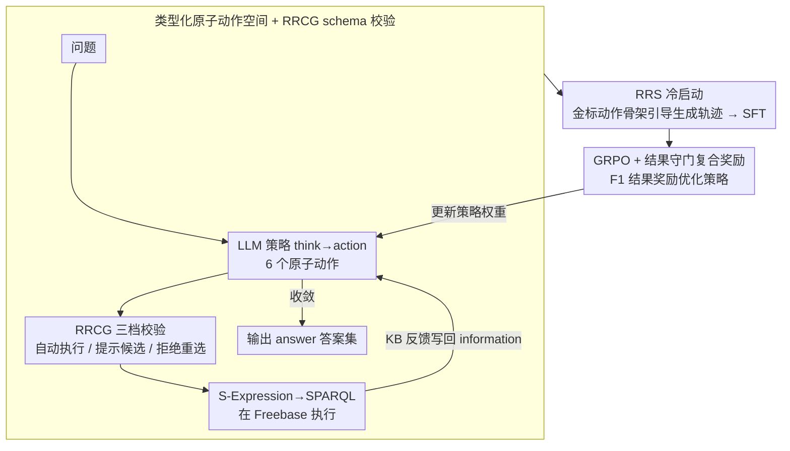

# KBQA-R1: Reinforcing Large Language Models for Knowledge Base Question Answering

**会议**: ICML 2026  
**arXiv**: [2512.10999](https://arxiv.org/abs/2512.10999)  
**代码**: https://github.com/sunxin000/KBQA-R1 (有)  
**领域**: LLM推理 / 强化学习 / 知识图谱问答  
**关键词**: KBQA, 多轮强化学习, GRPO, 参考拒绝采样, 动作空间

## 一句话总结
把 KBQA 从"一次性生成逻辑表达式"重新定义为"多轮决策过程"，先用 Referenced Rejection Sampling 在金标动作序列的引导下生成可执行的推理轨迹做 SFT 冷启动，再用 GRPO 基于 F1 结果奖励优化策略，让 8B Llama 在 WebQSP / GrailQA / GraphQ 三个 benchmark 上同时超过 GPT-4 提示方法与图检索 SOTA。

## 研究背景与动机

**领域现状**：知识库问答（KBQA）要求模型针对 Freebase / Wikidata 这类大规模图谱，把自然语言问题翻译成可执行的逻辑形式（SPARQL / S-Expression）并返回答案集。当前 LLM-based KBQA 主要走三条路：(i) 端到端一次性生成完整逻辑形式（KB-BINDER / KB-Coder / ChatKBQA）；(ii) 提示驱动的逐步图探索（ToG / RoG，依赖 GPT-4 这类商业 API）；(iii) 监督式或搜索增强的智能体方法（KBQA-o1 用 MCTS + 合成轨迹）。

**现有痛点**：作者把当前方法的失败浓缩成"二分式失败"。一类方法（端到端、提示）会**幻觉 schema**——生成"看起来能执行"但实际引用不存在或不相关 relation 的查询；另一类方法（监督智能体）则**模板化复读**——模型只是机械模仿合成轨迹里的动作宣告，并没有真正读懂 KB 反馈在说什么，搜索增强又带来巨大推理开销。

**核心矛盾**：本质上是"静态监督"和"动态环境"之间的错配。KBQA 的真值（gold S-Expression）只能告诉模型"最终应该长什么样"，无法告诉模型"在每一步看到 KB 返回某个邻居集合时该如何决策"；而 LLM 又恰恰缺乏对 KB 执行器的 grounded 经验，因此只能用文本模仿的方式去"猜"该写什么，自然会幻觉或机械化。

**本文目标**：让一个 8B 量级的开源 LLM 在不依赖外部商业 API、不依赖大规模检索流水线的条件下，学会"在 KB 上自主探索"，且能在 zero-shot / 组合泛化场景上同时超过大模型提示方法与图检索 SOTA。

**切入角度**：把 KBQA 重述为**多轮序列决策问题**——LLM 作为策略 $\pi_\theta$，在一个紧凑的、被验证过的离散动作空间上行动，每一步根据 KB 真实反馈做出决策。这样真值就不再是"最终查询"，而是"最终答案的 F1"，模型可以通过强化学习从结果反馈反推出"在每个 context 下该选哪个 action"。

**核心 idea**：用 **RL on a typed KB action space** 替换 **imitation of static logical forms**，并用 Referenced Rejection Sampling 解决 RL 训练前的冷启动难题。

## 方法详解

### 整体框架
KBQA-R1 把"一次性生成完整逻辑形式"换成"在 KB 上一步步决策"。推理时它是个 ReAct 风格的多轮智能体：LLM 先在 `<think>` 里推理，再在 `<action>` 里发出一个原子动作（`Find_relation`, `Merge`, `Order`, `Compare`, `Time_constraint`, `Count`），系统把动作翻成 S-Expression 片段转 SPARQL 在 Freebase 上执行，再把检索到的实体或诊断信息写回 `<information>` 供下一轮参考，循环直到模型给出 `<answer>`；其间每个 `Find_relation` 都要先过一道 schema 校验，确保提出的 relation 真实存在。训练时分两步给这个策略上分——先用 Referenced Rejection Sampling 合成高质量轨迹做 SFT 冷启动，再用 GRPO 基于 F1 结果奖励做策略优化，整条 pipeline 落在 Llama-3.1-8B-Instruct 上。

### 关键设计

**1. 类型化原子动作空间 + RRCG schema 校验：把"一次写对长查询"拆成"每步可校验的小决策"**

端到端方法最大的脆弱点是单 token 拼错就让整条 S-Expression unexecutable，而 LLM 又常幻觉出不存在的 relation。KBQA-R1 先把复杂查询分解成 6 个原子动作，每个动作严格定义了 `(arguments, target functional update, S-Expression template)` 三元组（例如 `Find_relation(entity, relation)` 对应 `JOIN(relation, START(entity))`），这样模型每步只需决定下一个原子操作而不必一次性写对全部。更关键的是在每个 `Find_relation` 前插入 Relation Retrieval and Confidence Gating (RRCG)：用稠密检索器 $Sim(\cdot,\cdot)$ 给 LLM 提出的 $r_{\text{agent}}$ 与当前实体 $e_c$ 的所有邻居 relation $R(e_c)$ 打分，取最大值 $s_{\max}$ 后按双阈值 $\tau_{\text{high}}, \tau_{\text{low}}$ 分三档处理——$s_{\max} \geq \tau_{\text{high}}$ 直接用最近邻 $r_s^*$ 自动执行；$\tau_{\text{low}} \leq s_{\max} < \tau_{\text{high}}$ 仍执行但在 observation 里附 top-k 候选提示不确定；$s_{\max} < \tau_{\text{low}}$ 则直接拒绝并把该实体的邻居 relation 列表返还给模型重选。这等于把幻觉风险从"生成时拦不住"变成"执行时可恢复的反馈"，也给后续 RL 提供了一个稳定可执行的环境——消融里去掉 RRCG 平均掉 18% F1，去掉 multi-turn 掉 25% F1（GrailQA 上更是掉 36.3%），说明这两件事是地基而非点缀。

**2. Referenced Rejection Sampling (RRS) 冷启动：用金标动作当骨架，逼模型把推理对齐到真实可执行步骤**

标准拒绝采样在 KBQA 上接受率只有约 40%，且通过的轨迹常常"语法对但语义弱"，不足以给 RL 一个好起点。RRS 把训练样本扩展为 $(q, \mathcal{A}, S^*)$，先解析金标 S-Expression $S^*$ 得到原子动作序列 $\mathbf{a}^* = (a_1^*, \ldots, a_k^*)$；rollout 时在第 $t$ 步把 $a_t^*$ 作为"参考动作"显式注入 prompt，强制模型围绕这个动作生成 `<think>` 解释为什么这一步能推进到答案，并真实观察 KB 对它的反馈。轨迹只有同时满足 $\text{F1}(\hat{\mathcal{A}}, \mathcal{A}) \geq \tau$（结果对）和 tag 结构合规才被接受；进入 SFT 数据集前再把所有参考动作提示从 prompt 里剥离，保证模型推理时不会依赖隐藏的真值信号。把生成约束在金标骨架上，模型就无法编造 post-hoc 解释、必须让 reasoning 与真实步骤对齐——Table 7 显示 RRS 在 GrailQA/GraphQ 上把接受率从 ~40% 提到 67%，SFT 初始化 F1 也明显高于标准 RS（GrailQA：73.8 → 80.2），这是后续 GRPO 能稳定训出来的前置条件。

**3. GRPO + 结果守门的复合奖励：用稀疏但可靠的 F1 信号把策略从"模仿示范"推向"主动探索"**

KBQA 的真值天然是"答案集合对不对"，稀疏但完全可靠，正适合做 RL 主奖励。复合奖励写成 $R = \lambda_{\text{outcome}} \cdot r_{\text{outcome}} + \lambda_{\text{format}} \cdot \mathbb{I}[r_{\text{outcome}} > 0] \cdot r_{\text{format}}$，其中 $r_{\text{outcome}}$ 是预测答案 $\hat{\mathcal{A}}$ 与所有金标变体 $\mathcal{A}$ 之间的 F1，$r_{\text{format}}$ 奖励 tag 完整性与正确顺序；这里的巧思是格式奖励只在结果非零时才给（即 $\mathbb{I}[r_{\text{outcome}} > 0]$），避免智能体学成"格式漂亮但答案全错"。优化用 GRPO：对每条 prompt 采 $n$ 条 rollout，以组内均值作 baseline 算优势 $\hat{A}_i = r_i - \frac{1}{n}\sum_{j=1}^n r_j$，省掉单独的 value function，目标是带 KL 正则的 clipped PPO 形式 $\max_\theta \mathbb{E}[\min(r_t \hat{A}_t, \text{clip}(r_t, 1-\epsilon, 1+\epsilon)\hat{A}_t)] - \beta D_{\text{KL}}[\pi_\theta \| \pi_{\text{ref}}]$。outcome F1 当主奖励 + KL 锚定参考策略，既给了探索新动作组合的自由度，又防止策略漂到不可执行区——消融显示只 SFT（w/o GRPO）会掉 ~5-10% F1，而直接从 RL 训（w/o SFT warm-start）会掉 8.6%，说明 SFT 冷启动和 GRPO 是互补而非可替代。

### 损失函数 / 训练策略
两阶段训练。**Stage 1 (SFT)**：把每条 RRS 接受轨迹按轮次切成独立训练样本，context 作为输入、模型回复作为目标，loss 只对 response token 计算。**Stage 2 (GRPO)**：基于 SFT checkpoint 做 RL，backbone 用 Llama-3.1-8B-Instruct，RRS rollout 阶段用更强的 Qwen-2.5-72B-Instruct 生成轨迹再蒸馏回 8B，奖励权重和 $\beta, \epsilon$ 等具体超参见附录 B.3。

## 实验关键数据

### 主实验

| 数据集 | 指标 | KBQA-R1 (Llama-3.1-8B) | 之前 SOTA | 提升 |
|--------|------|------|----------|------|
| GrailQA Overall | F1 | **86.1** | 78.5 (KBQA-o1, Llama-3.1-8B) / 81.9 (TIARA, T5-large) | +7.6 |
| GrailQA Zero-shot | EM / F1 | **83.6 / 85.2** | 68.1 / 76.1 (KBQA-o1) | +15.5 / +9.1 |
| WebQSP | F1 | **83.4** | 78.2 (SubgraphRAG + GPT-4o) / 76.0 (MCTS-KBQA) | +5.2 / +7.4 |
| GraphQ | F1 | **53.8** | 48.7 (KBQA-o1) / 47.5 (CoTKR) | +5.1 |

最值得注意的是 zero-shot 维度——relation 和组合都没在训练里见过的情况下，EM 提升 15.5%，说明 RL 学到的不是分布拟合而是策略层面的泛化。

### 消融实验

| 配置 | WebQSP F1 | GraphQ F1 | GrailQA F1 | 说明 |
|------|-----------|-----------|------------|------|
| Full KBQA-R1 | 83.4 | 53.8 | 86.1 | 完整模型 |
| w/o RRCG | 64.1 | 37.7 | 67.1 | 没有 schema 校验，平均 −18% |
| w/o Multi-turn | 63.2 | 34.1 | 49.8 | 单轮生成，平均 −25%（GrailQA −36） |
| w/o RRS（标准 RS） | 78.9 | 49.2 | 78.3 | 冷启动数据质量降低，平均 −5.6% |
| w/o SFT warm-start | 75.2 | 47.3 | 75.1 | 直接 RL，平均 −8.6% |
| w/o GRPO（只 SFT） | 72.1 | 47.8 | 80.2 | 没有 RL 优化阶段 |
| w/o Format Reward | 81.1 | 51.6 | 84.2 | 格式奖励是稳定剂，影响较小 |

### 关键发现
- **Multi-turn 与 RRCG 是地基**：去掉任一个都掉 18-25% F1，说明结构化动作空间 + schema 校验提供的"可执行环境"是 RL 能学起来的前提，不是可有可无的工程优化。
- **RRS vs 标准 RS 的数据效率差距巨大**：在 GrailQA 上接受率从 39.3% 提到 67.0%，pre-SFT F1 从 54.2 升到 70.2，SFT 初始化 F1 从 73.8 升到 80.2——说明 RL 训练前的轨迹质量直接决定最终上限。
- **效率收益**：在和 GPT-4 提示方法（ToG / PoG）对比时，KBQA-R1 用 Llama-3.1-8B 在更高准确率下 LLM 调用次数减少 70% 以上，验证了"把推理内化到策略"比"测试时穷举搜索"更高效。
- **Frontier agent 比较**：即使把同样的 KBQA-R1 harness（动作空间 + 反馈格式）配给 GLM-5 / Kimi-K2.5 这种 frontier 模型，准确率仍低于学过的 8B 策略，且消耗更多 turn 和 token——说明 RL 学到的是不可被 prompt 工程替代的策略性知识。

## 亮点与洞察
- **"参考真值做骨架、剥离再训练"的 RRS 范式**很巧妙：它把 KBQA 的稀疏成功率问题转化为"在给定骨架上能否合理化解释"的密集监督问题，且剥离参考后不会引入推理时泄漏。这种思路可以推广到任何"最终答案可验证但中间推理过程难以监督"的任务，比如代码生成、形式化证明、数据库 query。
- **格式奖励的结果守门设计**值得抄：$\mathbb{I}[r_{\text{outcome}} > 0]$ 这一项防止了"模型学到漂亮但全错"的退化，是 RL 训练 LLM 智能体时常被忽视但极重要的细节。
- **schema 校验作为"软-硬"分层**（auto-validate / tentative / reject）是处理 LLM 幻觉与 KG 真值之间张力的优雅方案——不是简单地全拒，而是把不确定度作为额外信息回流给模型让它自我修正。
- **整篇论文的"啊哈"在于**：在 KBQA 这种被认为已经被大模型 + 检索增强压制得没空间的任务上，作者证明了一个 8B 模型用对训练范式后能反超 GPT-4o + 检索的组合，证据非常硬。

## 局限与展望
- **依赖 topic entity 已被链接**：和 ToG / RoG 一样假设问题中的实体已经被预先链接到 KB，把 entity linking 误差排除在评估之外，真实部署时这一步本身就是瓶颈。
- **仅在 Freebase 一种 KB 上验证**：所有 benchmark 都基于 Freebase，没有评估在 Wikidata 这种 schema 更复杂、relation 数量级更大的 KB 上动作空间和 RRCG 是否仍 scalable。
- **6 个动作的设计偏 Freebase-specific**：动作空间和 KBQA-o1 一脉相承，针对的是 JOIN / AND / ARG / CMP / TC / COUNT 这类 S-Expression 操作，迁移到 Cypher、SQL 或更高阶的 reasoning 操作时需要重新设计。
- **RRS 仍需要金标 S-Expression**：冷启动数据合成强依赖训练集已有 gold logical form，对于只有 weak supervision（只有答案没有 query）的 KBQA 数据集仍需要额外步骤。
- **改进方向**：把动作空间和 RRCG 模块化成 KB-agnostic 接口，结合 self-play 或 outcome-only weak supervision 拓展到无 gold query 的场景；探索 RRS 在 process reward / verifier 训练中的延伸用法。

## 相关工作与启发
- **vs KBQA-o1 (Luo et al., 2025c)**: 同样用 Llama-3.1-8B 和原子动作空间，但 KBQA-o1 走 MCTS + 增量 finetune 路线，本文用 GRPO 把搜索内化到策略权重里，结果是不需要测试时搜索就达到更高准确率（WebQSP F1 83.4 vs 57.8，+25.6 绝对值）。
- **vs ToG / RoG / PoG**: 这些方法依赖 GPT-4 在测试时做多轮提示驱动的图探索，本文用 RL 让 8B 模型学到同样能力且 LLM 调用减少 70%+。
- **vs SubgraphRAG / GNN-RAG**: 这些 GraphRAG 路线靠离线子图构建或检索流水线降低幻觉，但检索策略本身没有被端到端优化；本文把"如何探索 KB"作为策略一起学，因此组合泛化和 zero-shot 上优势更大。
- **vs Standard Rejection Sampling**: 把"接受高分轨迹"改为"以金标动作为骨架再 reasoning"，是对 RS 范式的一个针对结构化任务的本质性改进，比简单调温度/采样预算更有效。

## 评分
- 新颖性: ⭐⭐⭐⭐ — RRS 的"参考动作骨架 + 剥离再训"是真正的新点，RL on action space 思路本身有 KBQA-o1 等前作铺垫但首次跑通纯 RL 而非 SFT+search。
- 实验充分度: ⭐⭐⭐⭐⭐ — 三个 benchmark + 七种基线 + 七组消融 + frontier agent harness 对照 + 效率分析，覆盖全面且每个 ablation 都能反推出对应设计的必要性。
- 写作质量: ⭐⭐⭐⭐ — 把"二分式失败"作为叙事主线，方法章节用 Algorithm + 表格 + 公式三种表达交叉描述，但部分细节（如阈值 $\tau_{\text{high/low}}$、奖励权重）被推到附录略影响连贯性。
- 价值: ⭐⭐⭐⭐⭐ — 给"小模型 + RL 内化推理 > 大模型 + 测试时搜索"提供了一个硬证据，并把 RRS 这一可迁移训练技巧贡献给社区，对 KBQA / 工具调用 / 代码生成等结构化任务都有借鉴价值。

<!-- RELATED:START -->

## 相关论文

- [\[ACL 2025\] Ontology-Guided Reverse Thinking Makes Large Language Models Stronger on Knowledge Graph Question Answering](../../ACL2025/graph_learning/ontology-guided_reverse_thinking_makes_large_language_models_stronger_on_knowled.md)
- [\[ACL 2025\] FiDeLiS: Faithful Reasoning in Large Language Model for Knowledge Graph Question Answering](../../ACL2025/graph_learning/fidelis_faithful_reasoning_in_large_language_model_for_knowledge_graph_question_.md)
- [\[ACL 2025\] The Role of Exploration Modules in Small Language Models for Knowledge Graph Question Answering](../../ACL2025/graph_learning/the_role_of_exploration_modules_in_small_language_models_for_knowledge_graph_que.md)
- [\[ACL 2025\] Can Knowledge Graphs Make Large Language Models More Trustworthy? An Empirical Study Over Open-ended Question Answering](../../ACL2025/graph_learning/kg_llm_trustworthy_qa.md)
- [\[ICML 2026\] Beyond Model Base Retrieval: Weaving Knowledge to Master Fine-grained Neural Network Design](beyond_model_base_retrieval_weaving_knowledge_to_master_fine-grained_neural_netw.md)

<!-- RELATED:END -->
