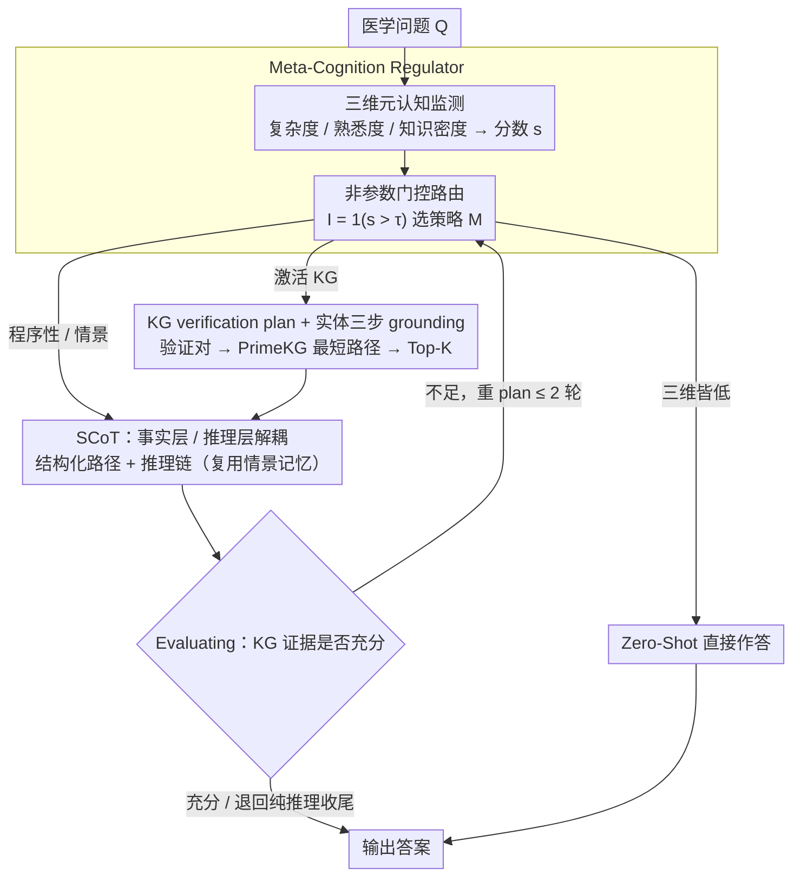

# MedCoG: Maximizing LLM Inference Density in Medical Reasoning via Meta-Cognitive Regulation

**会议**: ICML 2026  
**arXiv**: [2602.07905](https://arxiv.org/abs/2602.07905)  
**代码**: 未公开  
**领域**: 医学推理 / LLM Agent / 元认知  
**关键词**: 元认知调节、医学推理、知识图谱、推理密度、按需推理

## 一句话总结
MedCoG 让 LLM 先对医学问题做"复杂度 / 熟悉度 / 知识密度"三维自评，再按需调用 SCoT、记忆和知识图谱三类知识，把推理密度（达到同等精度所需的理论开销/实际开销）拉到 6.2×，同时在 5 个 MedQA 系列 hard set 上把平均准确率从 AFlow 的 34.5 提到 37.5。

## 研究背景与动机

**领域现状**：医学推理是 LLM 最难的领域之一，主流做法是给 LLM 套 agent 框架——多角色扮演（MedAgents、MDAgents）、KG 检索（MedReason）、历史经验记忆、迭代自我修正（Self-Refine、AFlow）等，靠 test-time scaling 堆性能。

**现有痛点**：作者画出 cost-accuracy Pareto 前沿后发现，这些方法基本服从 $Acc = \alpha \ln(C) + \beta$ 的对数缩放律（$R^2=0.996$），算力翻倍只换来递减的精度增益；更糟糕的是在 MedQA-H 上 SCoT+KG 比纯 SCoT 还掉 4 分（41→37），盲目加 KG/Memory 反而干扰 LLM 自带知识。

**核心矛盾**：在 5 个策略池 {Zero-Shot, SCoT, SCoT+Mem, SCoT+KG, SCoT+KG+Mem} 上做 Oracle 实验，逐样本选最优策略居然能在 MedQA-Full 上飙到 98.98（超过 o1 的 96.52）、MedQA-H 上 67.0，而所有非 Oracle 单策略最高只有 50。也就是说，瓶颈不在知识范围，而在缺乏"逐样本选择正确策略"的机制。

**本文目标**：让 LLM 自己判断"我这道题需要哪类知识、需要多少"，而不是无差别地把 KG+Memory+CoT 全堆上去。

**切入角度**：借鉴认知科学里的 meta-cognition（Schraw 1998）——智能体应能评估自身认知状态再选策略。把 Tulving 的三类知识（Procedural / Episodic / Factual）对应到 SCoT / Memory / KG。

**核心 idea**：用一个 Meta-Cognition Regulator 在 SCoT、Memory、KG 之间做"按需路由"，把缩放律从盲目扩大变成 LLM-centric on-demand reasoning，同时降本（避免无用知识）+ 提精（避免噪声知识）。

## 方法详解

### 整体框架

MedCoG 要解决的是"逐样本该用哪类知识、用多少"这件事，它把传统 agent 那种固定流水线换成一个会先自评、再按需取知识的两段式系统——前面是 Meta-Cognition Regulator，后面是 Knowledge Executor。拿到一道医学题 $\mathcal{Q}$，Regulator 先对自己的认知状态打三个分（复杂度、熟悉度、知识密度），据此决定是否动用记忆和知识图谱；Executor 再按这个计划去跑结构化推理、检索历史案例或在 KG 上找证据，用了 KG 的话最后还会经 Evaluating 模块回头检查证据够不够，不够就再修一次计划（≤2 轮）或退回纯推理收尾。

### 关键设计

**1. 三维元认知监测 + 非参数门控路由：把"要不要加知识"变成可计算的阈值判断**

直接堆 KG+Memory+CoT 之所以反伤性能，是因为系统从不判断"这道题到底缺什么"。MedCoG 让 Regulator 在 Monitoring 阶段把 LLM 对自身的判断量化成三个标量 $\mathbf{s}=[s_c, s_f, s_k]$——Complexity 看是否需要多跳推理、Familiarity 看题型是否像教科书案例（决定能否复用历史经验）、Knowledge Density 看是否依赖具体医学事实。Planning 阶段用一个非参数门控 $I_j=\mathbb{1}(s_j>\tau_j)$ 把每个维度卡到阈值上，最终策略写成 $\mathcal{M}=\pi(\mathbf{s};\tau)=\text{SCoT}\oplus\sum_{j\in\{f,k\}}I_j\cdot\mathcal{M}_j$，三个分数都低于阈值时直接 Zero-Shot，从而落进策略池 $\mathcal{S}=\{\text{Zero-Shot, SCoT, SCoT+Mem, SCoT+KG, SCoT+KG+Mem}\}$ 里的某一个。

之所以用阈值门控而不是训一个 policy 网络，是因为作者发现不同 LLM 的元认知特征差异极大——o3-mini 过度自信会低估 KG 需求、Qwen3-8B 在 Knowledge Density 上 F1 只有 0.33 完全崩、GPT-4o-mini 几乎不碰 Memory。给每个 backbone 用 50 个 held-out 样本单独校准一套 $\tau=[\tau_c,\tau_f,\tau_k]$（per-backbone calibration），比为每个 backbone 训一个调度模型更省也更鲁棒。

**2. KG verification plan + 实体三步 grounding：先想清楚要验证什么再去查**

临床题里往往只有一小撮指标真正决定答案，若拿整道题去 KG 里 dense retrieval，生理指标、家族史这些无关上下文会一起被带进来，再加上 hub entity 爆炸，噪声极大——这正是单独加 KG 反而在 MedQA-H 掉 4 分的根源。MedCoG 改成先把问题分解成一组"验证对" $\mathcal{V}(\mathcal{Q})=\{(v_i,h_i)\}$（原子查询 $v_i$ + LLM 自己给的假设 $h_i$），再去 KG 找路径，从源头压缩搜索空间。

每个待查实体走三步 grounding：先由 KG-LLM 抽出候选实体短语 $\mathcal{E}_v,\mathcal{E}_h$；再对每个候选用 bge-base-en-v1.5 在 PrimeKG（4M+ 关系）里找最相似的图上实体 $\hat{e}=\arg\max_{e^g\in\mathcal{E}}\text{sim}(\text{enc}_\theta(e),\text{enc}_\theta(e^g))$；最后让 KG-LLM 按上下文相关性 refine 一次。grounding 完成后对所有验证对求最短路径并取并集 $\mathcal{P}^g=\bigcup\{\text{SP}(e_v,e_h)\}$，再用 ranker 按与原题 $\mathcal{Q}$ 的相似度取 Top-K=5。本质上这是把"先提出要验证的假设、再只检索能验证假设的事实"这条认知路径硬编进了检索流水线。

**3. SCoT：把事实层和推理层解耦的程序性知识底座**

普通 CoT 把"知道什么事实"和"知道怎么推"混在一起，KG 检索结果塞进 prompt 后 LLM 经常顺着错误的 KG 路径硬编故事。SCoT 把这两层显式拆开：先输出结构化的实体-关系路径 $\mathcal{P}^e$，再以这些路径为 anchor 生成推理链 $\mathcal{C}$，整体写成 $\text{SCoT}=(\mathcal{P}^e,\mathcal{C})$。只要任一 $I_j$ 被激活，样本都以 SCoT 为基底——KG 激活时 $\mathcal{P}^e$ 由检索结果填充，否则由 LLM 自己 elicit。这样事实层和推理层可以分别替换、单独评估，也避免了 KG 路径直接喂进 prompt 导致的串台。

Episodic Memory 直接复用同一套 SCoT 格式：Case Bank $\mathcal{B}=(q_i,(\mathcal{P}^e_i,\mathcal{C}_i),r_i)$ 存历史问题、SCoT 轨迹和正误奖励 $r_i\in\{0,1\}$，检索时按问题相似度取 Top-K=5。规模上 MedQA 1402 条、MedMCQA 1305 条，其余三个数据集合并为 2707 条专门用来测 OOD 迁移。因为存的是结构化轨迹而非只有最终答案，历史 SCoT 等于给 LLM 提供了"这种题该怎么拆"的程序性模板。

### 损失函数 / 训练策略

整套系统训练-free：用 GPT-4o (2024-08-06) 当 Regulator 和 SCoT backbone，GPT-4o-mini 做 KG grounding，temperature=0。可学习的只有 $\tau$（50 样本校准）和 ranker 用的 bge-base-en-v1.5（直接拿现成的）。KG 用 PrimeKG，Case Bank 从 MedReason 过滤而来（只保留含结构化路径的样本）。Evaluating 模块最多重 plan 2 轮以控开销。

## 实验关键数据

### 主实验（5 个 MedAgentsBench Hard Set，GPT-4o backbone，IIE* = 每千样本边际效率）

| 方法 | MedQA | MedMCQA | MMLU | MMLU-Pro | PubMedQA | Avg | IIE* |
|------|-------|---------|------|----------|----------|-----|------|
| CoT (baseline) | 39.0 | 30.0 | 26.0 | 35.0 | 10.0 | 28.0 | Ref |
| Self-Refine | 41.0 | 34.0 | 34.2 | 34.0 | 13.0 | 31.2 | 0.345 |
| MultiPersona | 45.0 | 25.0 | 37.0 | 42.0 | 15.0 | 32.8 | 0.162 |
| AFlow | 48.0 | 31.0 | 38.4 | 37.0 | 18.0 | 34.5 | 0.141 |
| MedAgents | 43.0 | 30.0 | 28.8 | 8.0 | 15.0 | 25.0 | −0.035 |
| MDAgents | 36.0 | 22.0 | 24.7 | 8.0 | 11.0 | 20.3 | −0.165 |
| **MedCoG-Meta** | **52.0** | **36.0** | 35.6 | **44.0** | **20.0** | **37.5** | **0.438** |
| MedCoG-All (全开) | 50.0 | 32.0 | 28.8 | 36.0 | 19.0 | 33.2 | 0.181 |

MedCoG-Meta 比第二名 AFlow 平均高 8.7%，IIE 是 AFlow 的 3.1×；多个 medical agent 反而比 CoT 还差（IIE 为负），印证"盲目堆 agent 反伤 LLM 自带能力"。

### Oracle 上界与推理密度

| Strategy (GPT-4o) | MedQA-Full | MedQA-H |
|-------------------|------------|---------|
| Zero-Shot | 87.80 | 32.0 |
| SCoT | 89.55 | 41.0 |
| SCoT+Mem | 89.08 | 42.0 |
| SCoT+KG | 87.43 | 37.0 |
| SCoT+KG+Mem | 88.85 | 50.0 |
| **MedCoG-Oracle** | **98.98** | **67.0** |
| 当前 SOTA (o1/o3-mini) | 96.52 | 53.0 |

Oracle 显示策略池本身天花板已超过 o1，MedCoG-Meta 把 Inference Density $\rho = f^{-1}(Acc_\mathcal{M}) / C_\mathcal{M}$ 拉到 6.2×（拟合曲线 $R^2=0.996$），意思是参考曲线上要达到同样精度得花 6.2 倍的钱。

### 关键发现

- **元认知监测可信度跟模型规模强相关**：Qwen3-8B 在 Knowledge Density 上 F1=0.33 直接崩，扩到 32B/Max 后回到 0.79~0.80，说明 meta-cognition 本身需要足够大的模型；o3-mini 反而在 Familiarity 上过度自信（Recall 1.0 但 Precision 0.65）。
- **KG 与 Memory 有协同效应**：单独加 KG 在 MedQA-H 反而掉 4 分（41→37），但 SCoT+KG+Mem 一下飙到 50；作者解释为 episodic memory 帮助 LLM 理解抽象 KG 路径，这是把两类知识同时放进 plan 的核心理由。
- **错误结构对比**：策略池总误差 156，MedCoG-Meta 降到 70，其中 Synergy Missed 29→4、Memory Noise 20→3、Over Reasoning 33→14，但 Unsolvable 仍是 33（策略池本身的天花板）。
- **领域自适应**：MMLU / MMLU-Pro 系统偏向 Memory（题型泛化），MedQA / MedMCQA / PubMedQA 偏向 KG（临床事实密集），策略分布会跟数据集走。
- **OOD Memory 也能用**：把 MedQA+MedMCQA 的 case bank 用在 MMLU/MMLU-Pro/PubMedQA 上仍取得最佳或次佳，Familiarity 阈值有效过滤掉不适用的历史案例。

## 亮点与洞察

- **把"不增加调用就是赢"写进 metric**：Inference Density $\rho$ 和 IIE = $(Acc_\mathcal{M} - Acc_{CoT}) / (C_\mathcal{M} - C_{CoT})$ 都鼓励"花更少的钱拿更高的分"，反向倒逼方法不要无脑堆 token，agent 类工作终于有了不被 token 数掩盖的统一对比尺度。
- **Oracle 实验把瓶颈定位得很干净**：先证明"理想路由能上 98.98"，再证明"现有方法连 50 都难达到"，让"做更好的 router"这件事变得理直气壮，而不是争论"是否需要更大的 KG"。
- **per-backbone 元认知 profile 可迁移**：Table 3 那张 P/R/F1 表给后续做"LLM 自我评估能力评测"的工作直接提供了 backbone-level 的 baseline 数据；这种"评测元认知本身"的范式在 RAG / agent 领域有很强的迁移价值。
- **训练-free 但调一个 3 维阈值就行**：避免端到端训一个 policy 网络，对不同 backbone 只需 50 样本 + 三个 $\tau$，部署成本极低，工程上很务实。

## 局限与展望

- 评估只在 GPT-4o backbone 的 hard subset 上做完整对比（每个 100 条，MMLU 73 条），样本规模偏小，IIE 数字对单个错例敏感；MedQA-Full 1273 条也只用 Oracle 比较了 GPT-4o，主对比表没给。
- Regulator 全程闭源 LLM 调用，per-sample 至少 2 次 LLM call（monitoring + planning），如果换 8B 开源模型当 Regulator（论文未做完整对比，仅 Qwen3-8B 的 monitor F1 数据），Knowledge Density 维度直接崩，落地到本地部署场景仍有距离。
- 非参数门控 + 单阈值很简洁但 brittle：当三维分数有相关性、或题型分布漂移时，校准好的 $\tau$ 可能失效；用一个轻量分类器或 calibration network 可能更稳。
- KG 仍是结构化推理的瓶颈：Table 4 里 KG Noise 仍有 10 条，论文也承认"KG 路径对 LLM 太抽象"，后续应该往 path verbalization / 路径上的链式 verifier 走。
- 不开源代码（截至 v2），复现得自己实现整套 pipeline + 阈值校准 + Case Bank 过滤。

## 相关工作与启发

- **vs AFlow / MedAgents / MDAgents**：他们是 workflow 级别的固定 agent 编排，每道题走相同的多 agent 流水线；本文是 sample 级别的动态策略选择，省下来的 token 来自"这道题不需要 KG 就别查"，IIE 比 AFlow 高 3×。
- **vs MedReason / MedPrompt**：MedReason 提供 SCoT 数据但不做动态路由；本文复用 MedReason 数据构 Case Bank，再叠 meta-cognition 这一层调度，体现"上游知识工程 + 上层认知调度"的分层组合方式。
- **vs Self-Refine / CoT-SC**：Self-Refine 用全局自我评估决定要不要再 refine，MedCoG 把自我评估前置到策略选择阶段，更接近"先想清楚要用什么工具再动手"，对应 dual-process 里的 System-2 调度。
- **对 RAG 的启发**：用 verification plan 先把问题原子化再检索，比直接对全题做 dense retrieval 噪声小得多；同样的"提出假设→只检索能验证假设的事实"思路可以迁移到法律、金融等高知识密度领域 RAG。

## 评分
- 新颖性: ⭐⭐⭐⭐ 把元认知科学的三分类（Procedural/Episodic/Factual）显式映射到 SCoT/Memory/KG 并加非参数路由是首次系统化探索，Inference Density 指标设计也很扎实
- 实验充分度: ⭐⭐⭐ 5 个 backbone × 5 个数据集 × 完整消融，但 hard subset 样本量偏小（73~100），主表只在 GPT-4o 上做
- 写作质量: ⭐⭐⭐⭐ Pilot → Oracle → Method → Metric 推导链条很顺，Table 1 把"为什么要做这个"讲得极其有说服力
- 价值: ⭐⭐⭐⭐ 给医学 agent 提供了"不再无脑加 token"的硬抓手，IIE 这个 metric 大概率会被后续 agent 类工作沿用

<!-- RELATED:START -->

## 相关论文

- [\[ICML 2026\] Learnable Kernel Density Estimation for Graphs and Its Application to Graph-Level Anomaly Detection](learnable_kernel_density_estimation_for_graphs_and_its_application_to_graph-leve.md)
- [\[ICML 2026\] DTKG: Dual-Track Knowledge Graph-Verified Reasoning Framework for Multi-Hop QA](dtkg_dual-track_knowledge_graph-verified_reasoning_framework_for_multi-hop_qa.md)
- [\[ICML 2026\] Whom to Query for What: Adaptive Group Elicitation via Multi-Turn LLM Interactions](whom_to_query_for_what_adaptive_group_elicitation_via_multi-turn_llm_interaction.md)
- [\[ICML 2026\] GILT: An LLM-Free, Tuning-Free Graph Foundational Model for In-Context Learning](gilt_an_llm-free_tuning-free_graph_foundational_model_for_in-context_learning.md)
- [\[NeurIPS 2025\] MoEMeta: Mixture-of-Experts Meta Learning for Few-Shot Relational Learning](../../NeurIPS2025/graph_learning/moemeta_mixture-of-experts_meta_learning_for_few-shot_relational_learning.md)

<!-- RELATED:END -->
