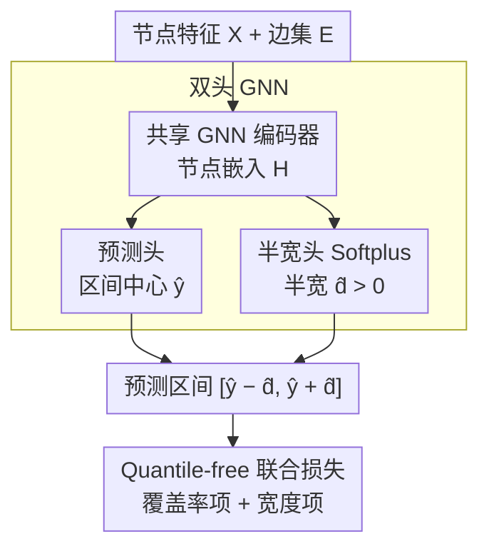

# Quantile-Free Uncertainty Quantification in Graph Neural Networks

**会议**: ICML 2026  
**arXiv**: [2605.04847](https://arxiv.org/abs/2605.04847)  
**代码**: 有（论文标 anonymous.4open.science/r/QpiGNN-30808）  
**领域**: 图神经网络 / 不确定性量化 / 节点回归  
**关键词**: GNN, Prediction Interval, Quantile Regression, 双头架构, Label-only Loss

## 一句话总结
QpiGNN 提出"无需分位输入、无需后处理"的 GNN 节点级预测区间框架，用双头 GNN（一头预测均值、一头预测半宽）配合直接优化"覆盖率+区间宽度"的标签级联合损失，在 19 个合成/真实数据集上平均覆盖率提高 22%、区间宽度收窄 50%。

## 研究背景与动机

**领域现状**：节点回归 GNN 被广泛用在医疗、刑事司法这类高风险领域，但绝大多数 GNN 只输出点估计、不给不确定性。可用的不确定性量化（UQ）方法主要分两类：贝叶斯（VI、后验近似，扩展性差且对先验敏感）和频率学派（重采样如 ensemble，post-hoc 校准如 Conformal Prediction），频率派方法计算贵且常依赖**可交换性（exchangeability）**假设——这在带结构依赖的图数据上几乎天然不成立。

**现有痛点**：分位回归（QR）看似是绕过分布假设的好选择，但标准 QR 必须把分位水平 $\tau$ 作为输入或为每个 $\tau$ 训一个独立模型，会产生 "quantile crossing"（低分位预测超过高分位）等问题。SQR 在一个模型里同时学多分位，RQR 用 width-regularized loss 给 MLP 估 center+spread，但**直接搬到 GNN 全部塌**：message passing 把节点表征过度平滑（oversmoothing），SQR 在图上稳定性差、校准失败；RQR 的单头设计让 center 与 spread 共享表征引发梯度干扰。

**核心矛盾**：QR 系列的瓶颈是"分位输入 + 单头表征"，与 GNN 的"邻域聚合产生全局平滑表征"在结构上互斥——既要 GNN 的关系建模能力，又要节点级自适应的紧致区间，必须把"预测"和"不确定性"在架构与监督两端同时解耦。

**本文目标**：(i) 设计一个不依赖分位输入、不需 post-hoc 校准的 GNN UQ 框架；(ii) 在图依赖下给出覆盖率与宽度的理论保证；(iii) 兼顾标定（calibration）与紧致（compactness）。

**切入角度**：作者发现 RQR 在 MLP 上能用"label-only" loss 直接学到 input-dependent 上下界，QR 的"分位输入"其实可被绕开；而 GNN 上 oversmoothing 的根因是单头共享，因此用**双头解耦 + 标签直接监督**即可同时解开这两个枷锁。

**核心 idea**：用 **dual-head GNN（一头预测 $\hat y$、一头预测半宽 $\hat d$）** + **quantile-free joint loss**（直接惩罚 "$\hat c$ 偏离 $1-\alpha$" 和 "平均区间宽度"），既无需分位输入也无需后处理。

## 方法详解

### 整体框架
QpiGNN 要解决的是 GNN 节点回归既要给点估计、又要给一个紧致且校准的预测区间，而且不能依赖分位输入或事后 conformal 校准。它的做法是把"预测"和"不确定性"在架构和监督两端同时拆开：一个共享 GNN 编码器先算节点嵌入 $\mathbf H=\text{GNN}(\mathbf X,\mathcal E)$，再分接两个线性头——预测头出区间中心 $\hat y$、半宽头出半宽 $\hat d$，区间即 $[\hat y_v-\hat d_v,\ \hat y_v+\hat d_v]$；训练时直接用标签去优化"覆盖率贴近目标 + 区间尽量窄"的联合损失。推理一次前向就拿到校准区间，不需要 calibration set，也不需要后处理。

> 图依赖下的覆盖率保证（设计 3）是对上面联合损失的理论支撑，不是数据流上的一道处理阶段，故不单列为图中节点。

### 关键设计

**1. 双头 GNN：把预测和不确定性从表征层就拆开**

QR 系列搬到 GNN 上全部塌掉的根因是单头共享表征——message passing 反复对邻域取平均，单头模型会把区间中心和半宽都压向局部均值，节点级的自适应性被抹平。QpiGNN 在共享编码 $\mathbf H$ 之上分出两条独立线性头：预测头 $\hat{\mathbf y}=\mathbf W_{\text{pred}}\mathbf H+\mathbf b_{\text{pred}}$ 专注准确性，半宽头 $\hat{\mathbf d}=\text{Softplus}(\mathbf W_{\text{diff}}\mathbf H+\mathbf b_{\text{diff}})$ 专注覆盖率。Softplus 保证 $\hat d>0$，区间天然 well-ordered，不会再出现下界超过上界的 quantile crossing。这种结构性解耦让半宽头能学到与中心完全不同的函数类——比如在 hub 节点上自然给出更宽的区间，而不被中心头的平滑趋势带跑。思路上呼应 Kendall&Gal、Lakshminarayanan 等异方差/贝叶斯回归"分头学不同信号"的经验，但这里目的不是估方差，而是专门阻断 oversmoothing 对半宽头的污染，且只多一条线性头、更轻量。

**2. Quantile-free 联合损失：用标签一步同时校准覆盖率与压窄区间**

标准 QR 必须把分位水平 $\tau$ 作为输入或为每个 $\tau$ 训一个模型，RQR-W 则把 coverage 和 width 揉进单一条件损失，在 GNN 上会被 oversmoothing 推成全局过宽的区间。QpiGNN 干脆把分位输入拿掉，用一个可加的三项标签级损失直接监督：

$$\mathcal L_{\text{total}}=\underbrace{(\hat c-(1-\alpha))^2 + \hat\ell_{\text{viol}}}_{\mathcal L_{\text{coverage}}} + \underbrace{\lambda_{\text{width}}\cdot\mathbb E_v[\hat y_v^{\text{up}}-\hat y_v^{\text{low}}]}_{\mathcal L_{\text{width}}}$$

其中 $\hat c=\mathbb P(\hat y_v^{\text{low}}\le y_v\le \hat y_v^{\text{up}})$ 是经验覆盖率，平方项把它往目标 $1-\alpha$ 拉；违规罚 $\hat\ell_{\text{viol}}=\mathbb E[|y_v-\hat y_v^{\text{low}}|\cdot\mathds 1[y_v<\hat y_v^{\text{low}}]+|y_v-\hat y_v^{\text{up}}|\cdot\mathds 1[y_v>\hat y_v^{\text{up}}]]$ 只对落在区间外的节点按越界距离给细粒度梯度；宽度罚用 L1 而非 L2，避免 outlier 把宽度项放大。把 coverage 和 width 解耦成可加项的好处是训练有明确次序——先把 $\hat c$ 拉到目标、再在保持覆盖的前提下压缩宽度，正好对应一个约束优化的 Lagrangian 松弛，超参 $\lambda_{\text{width}}\in[0.2,0.5]$（由贝叶斯优化选）就是那个有明确含义的乘子。整个过程只用标签 $y_v$ 监督，既无分位输入也无 post-hoc 校准。

**3. 图依赖下的覆盖率保证：绕开 exchangeability**

CP 的覆盖保证依赖可交换性，而图数据带结构依赖天然不满足，所以 QpiGNN 把保证重建在"邻域平滑下的近似 bounded-difference"上。Proposition 4.1 在噪声 $\varepsilon_v$ 有界弱相关、$\hat y_v$ 与 $\hat d_v$ 概率收敛到目标、节点嵌入足够多样这几个假设下，用弱大数律给出渐近收敛 $\hat c\xrightarrow{P}1-\alpha$。有限样本侧则用 McDiarmid/Hoeffding 不等式：单节点扰动对覆盖率估计的影响被界在 $1/N+\delta_G$，于是 $|\hat c-(1-\alpha)|=\mathcal O(1/\sqrt N)$，给出一条实用的频率派界。此外在 $P(y\mid x_v)$ 对称的假设下，最小宽度满足 $d_v^*=F_v^{-1}(1-\alpha/2)$，正好印证上面的联合损失就是该约束最优化的 Lagrangian 松弛。

### 损失函数 / 训练策略
端到端 SGD 训练上面那个三项加权和，配 diminishing learning rate 保证非凸下收敛到 stationary point。$\alpha$ 通常取 $0.1$（即 90% 目标覆盖），$\lambda_{\text{width}}\in[0.2,0.5]$ 由 BO 选。为做对比，作者还实现了 RQR 的 GNN 变体，并额外加 ordering 罚 $\gamma_{\text{order}}\cdot\text{ReLU}(\hat y^{\text{low}}-\hat y^{\text{up}})$ 来缓解它的 quantile crossing。

## 实验关键数据

### 主实验
在 19 个数据集（9 个合成结构如 BA/ER/Grid/Tree + 真实数据集）上以 PICP（实证覆盖率）与 MPIW（平均区间宽度）为指标，目标覆盖率 90%。

| 数据集（合成） | 模型 | PICP | MPIW |
|---|---|---|---|
| Basic | SQR-GNN | 0.85 | 0.33 |
| Basic | RQR^adj-GNN | 0.90 | 0.82 |
| Basic | CF-GNN | 0.92 | 1.90 |
| Basic | BayesianNN | 1.00 | 3.01 |
| Basic | **QpiGNN** | **≥0.90** | **最小且达标** |
| Gaussian | RQR^adj-GNN | 0.88 | 0.53 |
| Gaussian | CF-GNN | 0.91 | 2.90 |
| Gaussian | **QpiGNN** | **≥0.90** | 显著最小 |
| Grid | RQR^adj-GNN | 0.72 | 0.48 |
| Grid | **QpiGNN** | **≥0.90** | 最小达标 |

平均下 QpiGNN 比所有 baseline 覆盖率高 22%、宽度窄 50%。SQR-GNN 经常覆盖不足（0.75–0.85），BayesianNN 覆盖率拉满但宽度恒定 ≈3，不实用；CF-GNN（conformal）虽然覆盖率刚好达标但宽度被结构异质性放大（在 BA 图上 MPIW 6.89、Grid 11.92）。

### 消融实验

| 配置 | 解释 | 效果 |
|---|---|---|
| Full QpiGNN | dual-head + joint loss | 最优 |
| Single-head + joint loss | 共享表征学 center+spread | 覆盖率达标但宽度变粗 |
| Dual-head + fixed-margin | 半宽设为常数 | 不能节点级自适应 |
| Dual-head + RQR-W loss | 用纠缠损失 | oversmoothing 复发 |
| 只 $\mathcal L_{\text{coverage}}$ | 不压宽 | 覆盖率达标但区间巨宽 |
| 只 $\mathcal L_{\text{width}}$ | 不约覆盖 | 区间塌成 0 |

### 关键发现
- **dual-head + joint loss 都不可少**：单独砍任意一项，要么覆盖率塌、要么宽度爆。
- **CP 在图上水土不服**：CF-GNN 在结构异质（hub / heterophily）图上 MPIW 会爆炸性增长，验证 exchangeability 假设失效。
- **训练轨迹符合 Lagrangian 直觉**：损失先快速降低 coverage violation，再持续压缩区间宽度（Figure 2）。

## 亮点与洞察
- **把 QR 的"分位输入"彻底拆掉**：以前一直觉得 QR 必须 condition on $\tau$，本文用"双头 + label-only 损失"证明只要架构和监督形式对，分位输入是冗余的——这对所有"分位回归"领域都是开脑洞的范式松绑。
- **dual-head 不是新概念但用得很巧**：异方差回归（Kendall&Gal）的双头是为了同时学预测和方差；本文借用结构但目的不同——是为了**阻断 GNN message passing 对 spread 头的 oversmoothing**，这种"借旧架构解新问题"的视角值得借鉴。
- **覆盖率的图依赖有限样本界**：不依赖 exchangeability 而用 McDiarmid 的 bounded-difference 适应图数据，给出 $\mathcal O(1/\sqrt N)$ 的实用界——这是把 CP-style 频率派保证迁移到图依赖数据的一条可行路径。

## 局限与展望
- 理论上的对称性假设（$P(y\mid x_v)$ 对称）在偏态分布上不严格成立，作者也承认这只是 sketch。
- $\lambda_{\text{width}}$ 仍需 BO 选；自适应权重退火策略可能进一步降调参成本。
- 实验聚焦节点回归；扩展到节点分类（离散输出）、链接预测、图回归仍待验证。
- 跟现代 conformal 变体（local CP、weighted CP）的对比可以更全面，目前主要打 CF-GNN。

## 相关工作与启发
- **vs SQR-GNN**：用单模型 + 连续分位采样，但 GNN 平滑下 calibration 不稳；QpiGNN 直接拿掉分位输入。
- **vs RQR-GNN**：MLP 上有效的 width-regularized loss 在 GNN 上单头会塌；QpiGNN 用双头 + 解耦损失突破。
- **vs CF-GNN（Conformal）**：CP 在 heterogeneous 图（hub/heterophily）上 MPIW 暴涨；QpiGNN 不依赖 exchangeability 故而稳。
- **vs Bayesian/MC-Dropout/Ensembles**：贝叶斯系列扩展性差或宽度爆，ensembles 计算贵；QpiGNN 单模型单 forward 拿到节点级区间。

## 评分
- 新颖性: ⭐⭐⭐⭐ 把"分位输入" + "post-hoc 校准"两大常规组件同时砍掉的设计原创度高。
- 实验充分度: ⭐⭐⭐⭐⭐ 19 个数据集 + 7+ baseline 的 PICP/MPIW 对照，覆盖合成/真实/结构异质多种场景。
- 写作质量: ⭐⭐⭐⭐ 动机层层推进、理论与实验互证；不过定理叙述略偏 sketch。
- 价值: ⭐⭐⭐⭐ 给 GNN 节点级 UQ 提供了一条无需后处理的实用路线，对医疗/金融图回归落地有直接价值。

<!-- RELATED:START -->

## 相关论文

- [\[ICML 2026\] GILT: An LLM-Free, Tuning-Free Graph Foundational Model for In-Context Learning](gilt_an_llm-free_tuning-free_graph_foundational_model_for_in-context_learning.md)
- [\[ICML 2026\] L2G-Net: Local to Global Spectral Graph Neural Networks via Cauchy Factorizations](l2g-net_local_to_global_spectral_graph_neural_networks_via_cauchy_factorizations.md)
- [\[ICLR 2026\] Are We Measuring Oversmoothing in Graph Neural Networks Correctly?](../../ICLR2026/graph_learning/are_we_measuring_oversmoothing_in_graph_neural_networks_correctly.md)
- [\[CVPR 2026\] Adaptive Learned Image Compression with Graph Neural Networks](../../CVPR2026/graph_learning/adaptive_learned_image_compression_with_graph_neural_networks.md)
- [\[ACL 2026\] From Nodes to Narratives: Explaining Graph Neural Networks with LLMs and Graph Context](../../ACL2026/graph_learning/from_nodes_to_narratives_explaining_graph_neural_networks_with_llms_and_graph_co.md)

<!-- RELATED:END -->
