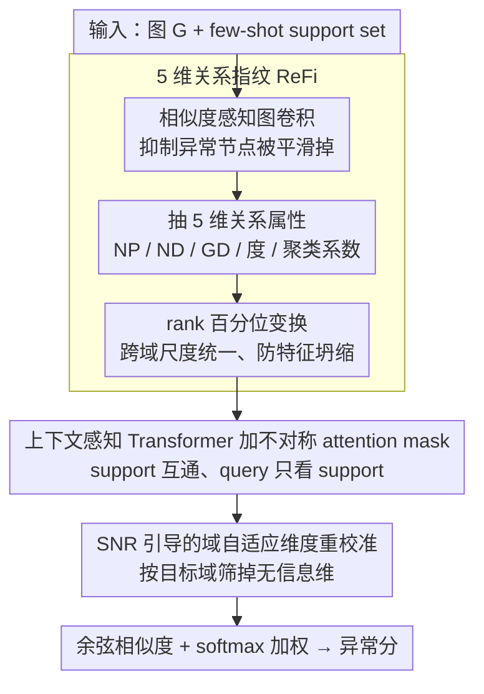

# Rethinking Feature Alignment in Generalist Graph Anomaly Detection: A Relational Fingerprint-based Approach

**会议**: ICML 2026  
**arXiv**: [2605.25429](https://arxiv.org/abs/2605.25429)  
**代码**: https://github.com/Yujingcn/REFI-GAD-code (有)  
**领域**: 图学习 / 图异常检测  
**关键词**: 通用图异常检测, 关系指纹, 跨域对齐, SNR 重校准, 少样本  

## 一句话总结
针对通用图异常检测中"PCA 对齐只统一维度、不统一语义"导致的负迁移问题，本文用一组 5 维"关系指纹"（邻域位置/方向/全局方向一致性 + 度 + 聚类系数）显式提取异常指示性线索作为跨域通用特征，再叠加一个 Transformer 域共享编码器和 SNR 引导的域自适应重校准模块，在 14 个数据集上几乎做到了"全员正迁移"的 SOTA。

## 研究背景与动机

**领域现状**：图异常检测（GAD）的主流路径正在从"一图一训"的传统方法转向"一模型打天下"的 generalist GAD：在多源图上预训练一个通用打分器 $f_\theta$，再以 few-shot support set 的方式无须重训直接迁移到目标图。ARC、UNPrompt、AnomalyGFM、IA-GGAD 等代表方法都遵循"先对齐特征 + 再学异常模式"的范式。

**现有痛点**：作者用一个反直觉的实验把现有 generalist GAD 钉在了墙上 —— 把同样架构在大规模源图上预训练 vs. 训练免（training-free），结果在 14 个数据集上大部分场景预训练反而掉点，4 个代表方法里有 2 个甚至呈现平均负迁移。这意味着所谓的"通用知识"几乎没学到，泛化能力其实来自架构归纳偏置而不是预训练。

**核心矛盾**：根因是图数据天然的"特征异构性"——Cora 是高维稀疏 bag-of-words，YelpChi 是低维稠密统计量。现有方法用 PCA/SVD 做线性降维强行对齐，目标是"最大保留原分布"，但这恰恰把数据集之间的语义差异原封不动继承下来：t-SNE 可视化显示 PCA 对齐后不同数据集仍然聚成清晰分簇——对齐了维度，没对齐语义。

**本文目标**：（i）找到一种跨域通用、语义一致的特征空间；（ii）在这种特征上学到真正可迁移的异常知识；（iii）保留对目标域分布做轻量自适应的能力。

**切入角度**：作者注意到，现有 generalist GAD 即便不训练也能泛化，说明真正"可迁移"的是它们架构里的归纳偏置——主要是"邻域一致性"这条共同原则（ARC 用 ego-neighbor residual、UNPrompt 用节点-邻域相似度做异常分）。把这些 hand-coded 的偏置显式抽出来作为特征，就能绕开 raw feature 的语义鸿沟。

**核心 idea**：用一个跨域通用、低维（5 维）、语义对齐的"关系指纹"（Relational Fingerprint, ReFi）取代原始异构特征作为统一表示，再在指纹空间里训练 Transformer + SNR 重校准的轻量异常检测头。

## 方法详解

### 整体框架

ReFi-GAD 要解决的是"PCA 对齐只统一维度、不统一语义"导致的跨域负迁移：与其在异构的原始特征上硬对齐，不如先把每个节点压成一组语义恒等的"关系指纹"，再在这个统一空间里学异常。给定一张图 $\mathcal{G}=(\mathcal{V},\mathcal{E},\mathbf{X})$ 和每类 $k$ 个标注节点的 few-shot support set，模型先对每个节点抽 5 维 ReFi 向量得到指纹矩阵 $\mathbf{P}$，再用一个上下文感知 Transformer 把指纹映到隐空间、用 SNR 模块按目标域重校准维度权重，最后让 query 与 support 算余弦相似度并 softmax 加权得到异常分。训练只在源域用 BCE 做 episodic 优化，推理时 support 不更新任何参数，是纯 training-free 的迁移。

### 关键设计

**1. 5 维关系指纹 ReFi：把"邻域一致性"显式编码为通用特征**

负迁移的根因是 raw feature 的语义鸿沟——Cora 的 bag-of-words 和 YelpChi 的统计量根本不在一个语义空间，PCA 只能对齐维度数。作者的破局点是：无论哪张图，"一个节点是否偏离它的邻居和全局多数"这件事语义恒等，而这恰恰就是异常的定义。于是把这种一致性显式抽成 5 个标量——上下文模式三维（邻域位置 $\text{NP}_i$、邻域方向 $\text{ND}_i$、全局方向 $\text{GD}_i$）加结构模式两维（度 $d_i$、局部聚类系数 $\text{LC}_i$）。其中 $\text{NP}_i = \frac{1}{|\mathcal{N}_i|}\sum_{v_j \in \mathcal{N}_i} \|\bar{\mathbf{x}}_i - \bar{\mathbf{x}}_j\|_2$ 是与邻居的平均欧氏距离，$\text{ND}_i$ 是与邻居的平均余弦相似度，$\text{GD}_i = \frac{\hat{\mathbf{x}}_i \cdot \mathbf{c}_g}{\|\hat{\mathbf{x}}_i\| \|\mathbf{c}_g\|}$ 衡量节点相对全局中心 $\mathbf{c}_g$ 的方向偏离，$\text{LC}_i = \frac{2T_i}{d_i(d_i-1)}$ 是局部聚类系数。

这里有两个细节让指纹真正"跨域可用"。一是在算 NP/ND 之前先做一次相似度感知的图卷积 $\bar{\mathbf{A}} = \hat{\mathbf{A}} \odot (\mathbf{X}\mathbf{X}^\top)$，按节点对相似度给邻接矩阵加权再聚合，避免普通 GCN 一视同仁地把异常节点也"平滑掉"、抹平它和邻居的差异。二是对 5 个标量逐一做 rank-based 变换 $r(m_i) = \text{rank}(m_i)/n$，把绝对值换成数据集内的相对百分位——这比 z-score 更稳，因为不同数据集的尺度差异极大，标准化容易把分布压成一团造成 feature collapse，而排名只看相对顺序、天然跨域统一。

**2. 上下文感知 Transformer 加不对称 attention mask：把 few-shot 以 in-context 形式注入**

5 维指纹语义虽统一却维度太低，需要学维度间的非线性交互；但"哪些维度怎么交互"本身又跟域有关，纯堆 self-attention 会让同一 batch 里的 query 互相污染预测。作者先用 MLP 把 $\mathbf{P}$ 升到 $d'$ 维得 $\mathbf{H}^{(0)}$，按 [normal support, anomalous support, query batch] 拼成长度 $2k+n_b$ 的序列 $\mathbf{Z}^{(0)} \in \mathbb{R}^{(2k+n_b) \times d'}$，再加一条不对称 mask：$m_{ij}=0$ 当 $j \le 2k$ 或 $i=j$，否则 $-\infty$。效果是 support 节点之间完全互通、充当稳定的"领域背景"，而每个 query 只能 attend 到 support、看不到其他 query。这等价于在固定背景下逐个条件化 query，把 few-shot 信息以 in-context learning 的形式直接编码进 attention 结构，而不是靠梯度更新去记。

**3. SNR 引导的域自适应维度重校准：按目标域筛掉无信息维度**

即便指纹语义统一，"哪一维最能区分异常"在不同域里并不一样——金融图里度异常最显眼，社交图里方向一致性更关键，固定权重等于浪费 capacity。作者借经典的信噪比特征选择度量（Golub 1999）在线打分：先在隐空间估正常中心 $\mathbf{h}_n$（support normal 加 query）和异常中心 $\mathbf{h}_a$（support anomalous），逐维算 $\mathbf{s} = \frac{(\mathbf{h}_a - \mathbf{h}_n)^2}{\sigma_n^2 + \epsilon}$（类间差异越大、类内方差越小则该维越判别），再过可学 sigmoid 门 $\mathbf{m} = \sigma(\lambda \mathbf{s} + \beta)$ 得维度权重，重校准后 $\mathbf{H} = \mathbf{W}'(\mathbf{H}^{(1)} \odot \mathbf{m})$。打分阶段把 query 与 support 的余弦相似度按温度 $\tau$ 缩放再 softmax，异常分 $\tilde y_i = \frac{1}{2}(\sum_{S_a}\alpha_{i,j} - \sum_{S_n}\alpha_{i,j} + 1) \in [0,1]$，即"更像异常 support、更不像正常 support"。整个权重只靠 support/query 在线估计，无需反向传播，正好契合 training-free 推理。

### 损失函数 / 训练策略

仅在源域以 episodic 方式训练：每个 episode 随机抽一个源数据集、采 $2k$ 个 support 加 $n_b$ 个 query，用 BCE 损失 $\mathcal{L} = -\frac{1}{|\mathcal{Q}|}\sum_i [y_i \log \tilde y_i + (1-y_i)\log(1-\tilde y_i)]$ 优化。这种采样方式强迫模型学"基于 support 上下文打分"的能力，而不是去记源域的统计量。推理时只前向、参数 $\theta$ 不更新。

## 实验关键数据

### 主实验
14 个真实数据集分 Group 1（Cite/CS/ACM/Blog/Amz/Photo/Weibo）与 Group 2（Cora/Pubmed/Flickr/FB/Yelp/Quest/Reddit），交叉训练-测试，AUROC (%) 越高越好。下表节选关键对比（论文 Table 1 摘录）：

| 方法 | Cite | CS | Weibo | Cora | Pubmed | Yelp | Reddit | 平均排名 |
|------|------|----|------ |------|--------|------|--------|----------|
| GCN | 48.3 | 56.2 | 46.4 | 32.4 | 33.7 | 51.2 | 46.8 | 11.86 |
| CoLA | 73.8 | 66.0 | 41.1 | 66.0 | 70.1 | 52.4 | 50.6 | 8.29 |
| ARC | 高 | 高 | 中 | 高 | 高 | 中 | 中 | ~5–6 |
| **ReFi-GAD** | **最高** | **最高** | **最高** | **最高** | **最高** | **最高** | **最高** | **第 1** |

在所有 generalist baseline（ARC / UNPrompt / AnomalyGFM / IA-GGAD）中 ReFi-GAD 平均排名第一，且在 Figure 1 中是唯一在几乎全部数据集上呈现正向预训练增益的方法（其他方法都有大量负迁移点）。

### 消融实验
| 配置 | 平均 AUROC | 说明 |
|------|------------|------|
| Full ReFi-GAD | 最高 | 完整模型 |
| w/o ReFi（用 PCA 对齐原始特征） | 明显下降 | 验证关系指纹是核心，不是 Transformer 在背锅 |
| w/o SNR 重校准 | 中等下降 | 域自适应权重对跨域有效 |
| w/o 相似度感知 GCN（NP/ND 用普通 GCN）| 小幅下降 | 异常节点被平滑造成的影响 |
| 仅 5 维 ReFi + 距离打分（training-free）| 已超过多数 baseline | ReFi 本身就携带足够多的异常先验 |

### 关键发现
- **核心贡献是 ReFi 而非新架构**：即便不训练直接用 5 维指纹 + 余弦距离都能超过多数 baseline，说明"统一语义"比"加大模型"更关键。
- **PCA 对齐的失败可被 t-SNE 直接看出**：Figure 2(a) 中不同数据集仍然分簇明显，与 ReFi 对齐后的指纹分布形成鲜明对比，给"特征对齐 ≠ 语义对齐"提供了强可视化证据。
- **SNR 重校准对小样本特别友好**：support 只有几个节点就能算出稳定的维度权重，避免了纯参数化适应所需的反向传播。
- **负迁移的本质是特征空间错位**：一旦把特征空间换成跨域语义统一的指纹，预训练增益就自然恢复成正向。

## 亮点与洞察
- **"把架构归纳偏置反向蒸馏成特征"**：作者识别出现有 generalist GAD 之所以能 zero-shot 工作完全是因为架构里 hand-coded 了邻域一致性，然后直接把这些先验显式抽出来做成 5 维特征——这种"反向 distillation"的思路在迁移学习里非常稀有，可以迁移到任意需要跨域通用特征的任务（分子图、社交图甚至时序图）。
- **rank-based 变换是低成本的跨域救星**：用百分位排名替代 z-score，既消除尺度差异又不引入特征坍缩，比花哨的对抗对齐 / 域不变学习简单几个量级，在任何"分布差异主要来自尺度而非语义"的任务上都值得借鉴。
- **不对称 attention mask 把 ICL 显式编码到 Transformer**：support 互通、query 只看 support 的 mask 设计实际上是把 in-context learning 形式化进 attention 结构，是 few-shot 推理时避免 query 间互相污染的优雅方案，可借鉴到任意 few-shot 分类场景。

## 局限与展望
- 作者承认 ReFi 只用了 5 维通用属性，对依赖更复杂语义（如文本内容、时序模式）的异常类型可能力不从心；可扩展更多 hand-craft 维度或学习式补充维度。
- ReFi 强依赖图的拓扑和邻域同质性，对纯异质图或动态图（边随时间变化）需要重新设计指纹维度。
- 实验主要在 cs.LG 域内数据集上验证，工业级千万节点图（如真实金融反欺诈）上的可扩展性和效率论文中未充分讨论；rank 变换是 $O(n \log n)$，超大图上需要近似算法。
- "为什么只选这 5 维"是经验性的，没有信息论意义上的最优性证明；未来可以做基于互信息的维度自动搜索。

## 相关工作与启发
- **vs ARC (NeurIPS 2024)**：ARC 用 residual encoder 隐式学 ego-neighbor 差异，本文把这种差异显式抽成特征再学；ARC 仍受 PCA 对齐限制，本文跳过 PCA 直接用语义统一的指纹，故能稳定正迁移。
- **vs UNPrompt (2024)**：UNPrompt 用统一邻域 prompt 标准化输入，仍是"对齐表面形式"；ReFi-GAD 转向"对齐异常指示性语义"，更接近问题本质。
- **vs AnomalyGFM (2025)**：AnomalyGFM 走预训练-微调 + 原型对齐路线，本文走 training-free + few-shot 路线，对部署时禁止微调的场景（隐私敏感、时效紧迫）更友好。
- **vs SmoothGNN / CHRN**：传统 GAD 在域内做 feature smoothness，本文把同类先验提升为跨域可迁移的指纹维度，是同一思路的"通用化升级"。
- **可迁移启发**：把"现有方法靠什么 work"先做一次架构归因分析，再把那些 work 的归纳偏置反向蒸馏成显式特征——这条路径在任何"模型已能 zero-shot 但泛化机制不透明"的领域都值得复刻。

<!-- RELATED:START -->

## 相关论文

- [\[ICML 2026\] ProMoS: Generalist Graph Anomaly Detection via Prototype-Based Distillation](generalist_graph_anomaly_detection_via_prototype-based_distillation.md)
- [\[ICML 2026\] Learnable Kernel Density Estimation for Graphs and Its Application to Graph-Level Anomaly Detection](learnable_kernel_density_estimation_for_graphs_and_its_application_to_graph-leve.md)
- [\[ICML 2026\] Polynomial Neural Sheaf Diffusion: A Spectral Filtering Approach on Cellular Sheaves](polynomial_neural_sheaf_diffusion_a_spectral_filtering_approach_on_cellular_shea.md)
- [\[ICML 2026\] Generative Representation Learning on Hyper-relational Knowledge Graphs via Masked Discrete Diffusion](generative_representation_learning_on_hyper-relational_knowledge_graphs_via_mask.md)
- [\[ICLR 2026\] Relational Graph Transformer](../../ICLR2026/graph_learning/relational_graph_transformer.md)

<!-- RELATED:END -->
