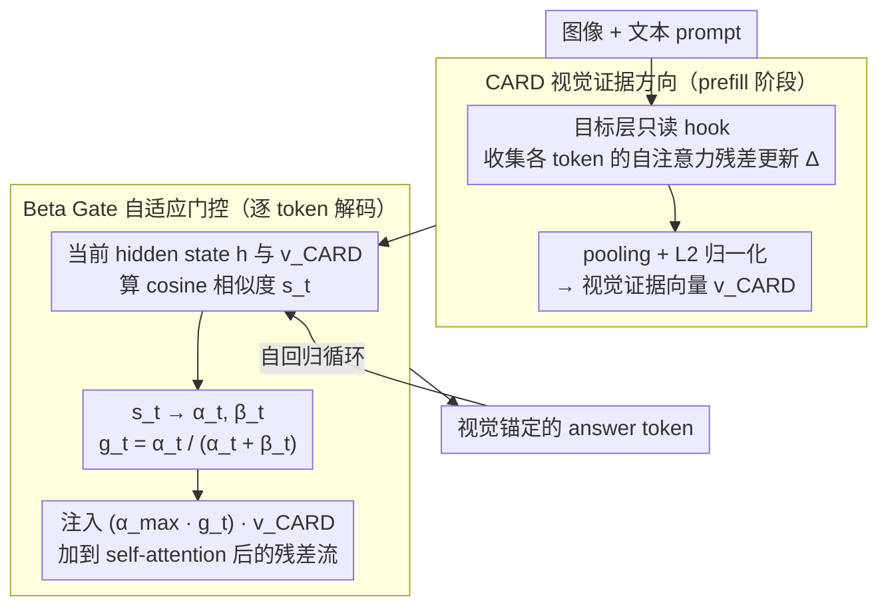

# Adaptive Residual-Update Steering for Low-Overhead Hallucination Mitigation in Large Vision Language Models

**会议**: ICML 2026  
**arXiv**: [2511.10292](https://arxiv.org/abs/2511.10292)  
**代码**: 有（论文称 RUDDER，缓存未给出完整 URL）  
**领域**: 幻觉检测  
**关键词**: LVLM幻觉, inference-time steering, residual stream, Beta Gate, 视觉 grounding  

## 一句话总结
这篇论文提出 RUDDER，在 LVLM 的 prefill 阶段从残差更新中提取每样本视觉证据方向，并在解码时用 Beta Gate 自适应注入，从而以接近单次前向的开销降低物体幻觉。

## 研究背景与动机
**领域现状**：大型视觉语言模型通常把图像 token 作为语言解码器的前缀，然后自回归生成文本。随着生成步数增加，图像前缀的信息会逐渐被语言先验稀释，模型容易在描述中添加图像里不存在的物体。

**现有痛点**：已有 inference-time intervention 方法往往在 logits 上做 contrastive decoding，或通过迭代反馈修正输出。这些方法能减少幻觉，但通常需要额外 forward pass、图像扰动、外部 classifier 或多轮 refinement，延迟和吞吐开销较大。对于真实部署，尤其是长文本生成，这个成本很难接受。

**核心矛盾**：降低幻觉需要持续提醒模型关注视觉证据，但强行加入固定 steering 又可能破坏流畅性、召回率和一般多模态能力。模型需要一种“只在合适 token 上提醒视觉证据”的轻量控制机制。

**本文目标**：作者希望在不改模型权重、不增加额外 forward pass 的情况下，把 prefill 阶段已经存在的视觉信息转化为一个可持续使用的 visual anchor，并在解码过程中低成本地抑制物体幻觉。

**切入角度**：论文观察到自注意力子层的 residual update 在 prefill 阶段包含图像对文本表示的净影响。既然 prefill 本来就是 LVLM 生成必须执行的步骤，那么从中缓存一个视觉证据方向几乎是零额外成本。

**核心 idea**：从 prefill residual update 中提取 CARD 视觉证据向量，再用 Beta 分布门控在解码时按 token 自适应注入。

## 方法详解
RUDDER 的关键不是重新训练 LVLM，而是在标准生成流程中挂两个轻量模块。第一个模块在 prefill 阶段读取某个 decoder 层的 self-attention residual update，聚合成输入相关的 CARD 向量。第二个模块在每个解码步根据当前 hidden state 与 CARD 的相似度计算 Beta Gate，决定这一步要不要、以及多强地把 CARD 注入 residual stream。

### 整体框架
给定图像和文本 prompt，LVLM 首先执行 prefill，处理图像 token 和 prompt token 并构建 KV cache。RUDDER 在目标层放一个只读 hook，收集 prefill span 中每个 token 的 self-attention 输出，即残差更新（residual update）。它将这些更新做 mean 或范数加权 mean pooling，再做 $L_2$ 归一化，得到每个样本自己的视觉证据方向 $v_{\mathrm{CARD}}$。

进入自回归解码后，RUDDER 在同一目标层持续工作。每生成一个 answer token，先计算当前 hidden state $h_{l,t}$ 与 $v_{\mathrm{CARD}}$ 的 cosine 相似度 $s_t$；再把 $s_t$ 映射成 Beta 分布的两个参数，并取 $g_t=\alpha_t/(\alpha_t+\beta_t)$ 作为门控。最终注入向量是 $(\alpha_{\max}g_t)v_{\mathrm{CARD}}$，加到 self-attention 之后的残差流（residual stream）上。整个 CARD 提取与 Beta Gate 注入都发生在一次标准前向内，不改权重、不加额外 forward pass。

### 关键设计

**1. CARD 视觉证据方向：把 prefill 里最强的视觉信号缓存成持久 anchor**

幻觉的根因是生成过程中图像前缀被语言先验逐步稀释，而视觉-文本融合恰恰在 prefill 阶段最强。RUDDER 抓住这一点：在 prefill（LVLM 本就必须执行的一步）于目标层放只读 hook，缓存每个 token 的 self-attention 残差更新 $\Delta_i^l$，对 prefill span 内全部 token 做 mean 或范数加权 mean pooling，再 $L_2$ 归一化，得到每样本的视觉证据方向 $v_{\mathrm{CARD}}=\mathrm{Pool}(\{\Delta_i^l\})/\|\mathrm{Pool}(\{\Delta_i^l\})\|_2$。残差更新编码的是视觉上下文对每个文本 token 表示的「净影响」，且范数天然偏重信息量大的语义 token、轻视语法功能词，所以聚合出的方向能滤掉噪声、提炼成针对当前图像-prompt 的视觉证据摘要（论文用可视化验证它确实把表示从纯文本先验方向系统地旋转开）。因为完全寄生在必需的 prefill 上，提取它几乎零额外开销。

**2. Beta Gate 自适应门控：按 token 决定「要不要、多强地」提醒视觉证据**

如果对每个 token 都固定强度注入 $v_{\mathrm{CARD}}$，在语法功能词和非视觉内容上会过度干预，伤流畅性和召回。Beta Gate 让注入强度随 token 自适应：每个解码步先算当前 hidden state $h_{l,t}$ 与 $v_{\mathrm{CARD}}$ 的 cosine 相似度 $s_t$，再用 $\alpha_t=\mathrm{softplus}(ks_t+c)$、$\beta_t=\mathrm{softplus}(-ks_t+c)$ 得到门控 $g_t=\alpha_t/(\alpha_t+\beta_t)$，最终把 $(\alpha_{\max}g_t)v_{\mathrm{CARD}}$ 注入 self-attention 之后的残差流。其关键解释是：这是一个 trust mechanism 而非错误检测器——把 $s_t$ 当作 Beta-Bernoulli 后验的 pseudo-count，相似度高说明当前轨迹已可信地贴着视觉证据，强化它是安全的；相似度低或为负说明正在生成语法词或轨迹不稳，此时抑制注入以免过度 steering 破坏流畅。门控还 clamp 到 $[0.05,1]$，避免完全关闭或饱和。

**3. 单 forward pass 集成：把全部计算塞进已有生成路径，解决效果-效率权衡**

已有 ITI 方法靠多次 forward、图像扰动、外部 classifier 或多轮 refinement 换效果，延迟在在线长文本生成里难以接受。RUDDER 把计算全部放进已有路径：CARD 来自必需的 prefill（零额外前向），Beta Gate 只在解码每步增加少量向量运算，且注入仅作用于 answer span；整套流程不改权重、不加 forward pass，额外延迟 <4%。少数部署超参（目标层 $L$、最大强度 $\alpha_{\max}$、敏感度 $k$）只在 100 张 held-out MSCOCO 图像上一次性校准，并约束召回率至少保持 vanilla 的 95%。正是这一点让「降幻觉」从离线研究技巧变成可直接部署的在线控制，也是论文相对 VISTA 等同类 steering 方法最核心的卖点。

### 损失函数 / 训练策略
RUDDER 是 training-free 的 inference-time intervention，没有新增训练损失。校准只用于选择部署超参数：LLaVA-1.5 选择较晚层 $L=30$，Idefics2 选择 $L=28$，InstructBLIP 选择早层 $L=1$；对应 $(\alpha_{\max},k)$ 分别为 $(20,5.0)$、$(8.0,5.0)$、$(6.5,8.0)$。门控浓度 $c=1$，并把 gate clamp 到 $[0.05,1]$，以避免完全关闭或饱和。

## 实验关键数据

### 主实验
论文在 CHAIR、POPE 和 MME 上评估幻觉、物体问答和一般多模态能力。下表摘取 greedy decoding 下的代表结果。

| 数据集/指标 | 模型 | Vanilla | RUDDER-Beta | 变化 |
|--------|------|------|----------|------|
| CHAIR $C_S/C_I$ ↓ | LLaVA-1.5 | 48.6 / 13.6 | 39.5 / 10.5 | 句级和物体级幻觉都下降 |
| CHAIR $C_S/C_I$ ↓ | Idefics2 | 46.6 / 14.9 | 28.4 / 10.9 | 句级幻觉下降最明显 |
| CHAIR $C_S/C_I$ ↓ | InstructBLIP | 39.2 / 12.8 | 27.1 / 8.5 | 低幻觉且保持召回约束 |
| POPE Acc/F1 ↑ | LLaVA-1.5 | 85.34 / 84.91 | 86.53 / 86.03 | 识别能力小幅提升 |
| POPE Acc/F1 ↑ | Idefics2 | 78.40 / 74.86 | 78.74 / 76.52 | F1 提升更明显 |
| POPE Acc/F1 ↑ | InstructBLIP | 85.74 / 84.75 | 86.02 / 84.93 | 基本不损伤问答能力 |
| MME ↑ | Idefics2 | 1518.84 | 1540.56 | 一般能力提升 |
| MME ↑ | InstructBLIP | 1566.77 | 1592.07 | 一般能力提升 |

### 消融实验
论文的分析重点是自适应门控、层选择、强度敏感性和效率。

| 配置 | 关键指标 | 说明 |
|------|---------|------|
| RUDDER-Beta vs RUDDER-Add | CHAIR 上 Beta 更稳 | 开放式 captioning 中 token-wise gate 更适合精准抑制具体物体幻觉 |
| RUDDER-Add | POPE 上对 InstructBLIP 有时更强 | yes/no 任务较短，固定强推在部分架构上足够有效 |
| Idefics2 层消融 | 最优层约 $L=28$ | mid-late 层最能影响最终输出且保留视觉语义 |
| Idefics2 超参热图 | $\alpha_{\max}=8.0,k=5.0$ 最平衡 | 强度越大越降 CHAIR，但过大会伤 recall |
| 吞吐量 tokens/s | Vanilla 56.7/47.8/62.3，VISTA 36.1/31.9/28.9，RUDDER-Beta 54.9/45.8/59.5 | RUDDER-Beta 平均保持约 96.0% vanilla throughput，明显快于多 forward 方法 |
| 扩展到 LLaVA-13B/Qwen2.5-VL | LLaVA-13B POPE F1 85.5，Qwen2.5-VL $C_I=7.0$ | 方法可扩展到更大模型和不同融合架构 |

### 关键发现
- RUDDER 的最大价值在效率：它接近 VISTA 的幻觉缓解能力，但吞吐保持在 vanilla 的约 96%，而 VISTA 平均只有约 58.1%。
- CARD 的 per-sample 特性很重要。它不是离线学一个通用 hallucination direction，而是从当前图像和 prompt 的 residual update 中提取视觉证据，因此跨 LLaVA、Idefics2、InstructBLIP 和 Qwen2.5-VL 都能工作。
- 自适应门控适合长文本和开放式描述，因为它能在内容词上强化视觉证据，同时避免在非视觉 token 上过度干预。

## 亮点与洞察
- 把 prefill residual update 当作“视觉证据缓存”很巧妙。这个信号本来就会被模型计算出来，RUDDER 只是把它显式保存并在解码时复用。
- Beta Gate 的解释比普通 sigmoid gate 更有语义：它把相似度当作 pseudo-count，输出的是对“当前轨迹可信地贴近视觉证据”的估计。
- 论文对幻觉缓解的评价比较克制，不只看 CHAIR 下降，还用 recall 约束、POPE、MME 和 throughput 检查是否用“少说话”或“慢很多”换来低幻觉。

## 局限与展望
- 方法仍需要为不同架构调目标层和强度，论文也承认超参数敏感性。未来可研究自动层选择或在线自适应校准。
- CARD 来自单层 residual update，可能无法覆盖需要多层、多尺度视觉推理的复杂错误。对关系、计数、OCR 等非物体幻觉的效果还需要更细分分析。
- Beta Gate 的高相似度增强假设在大多数物体描述任务中合理，但在模型已经沿错误视觉方向自信生成时，单纯强化可能不足以纠偏。
- 该方法是 inference-time steering，不能替代训练阶段的视觉 grounding 或安全对齐；更适合部署时低成本降低幻觉。

## 相关工作与启发
- **vs VCD / PAI / HALC**: 这些方法多在 logits 或对比上下文上操作，常需要额外 forward；RUDDER 直接改 hidden residual stream，开销更低。
- **vs VISTA / ASD**: 这些 steering 方法也改表示，但通常依赖预定义方向或额外计算；RUDDER 的 CARD 是每样本从 prefill 中即时提取。
- **vs DeGF**: DeGF 通过迭代反馈修正输出，效果可能强但延迟高；RUDDER 更偏向轻量在线控制。
- **对后续工作的启发**: prefill 阶段可能包含很多可复用的任务证据，不只视觉 grounding，也可用于多模态安全、OCR 保真和视频长上下文记忆。

## 评分
- 新颖性: ⭐⭐⭐⭐☆ CARD + Beta Gate 的组合简洁有效，核心信号来源很巧妙。
- 实验充分度: ⭐⭐⭐⭐⭐ 覆盖多模型、多解码策略、幻觉/能力/效率/扩展性。
- 写作质量: ⭐⭐⭐⭐☆ 结构清楚，少数表格跨模型较密，读者需要整理主趋势。
- 价值: ⭐⭐⭐⭐⭐ 直接面向 LVLM 幻觉缓解的部署痛点，效果和效率兼顾。

<!-- RELATED:START -->

## 相关论文

- [\[ICML 2026\] Revis: Sparse Latent Steering to Mitigate Object Hallucination in Large Vision-Language Models](revis_sparse_latent_steering_to_mitigate_object_hallucination_in_large_vision-la.md)
- [\[ICLR 2026\] Dynamic Multimodal Activation Steering for Hallucination Mitigation in Large Vision-Language Models](../../ICLR2026/hallucination/dynamic_multimodal_activation_steering_for_hallucination_mitigation_in_large_vis.md)
- [\[CVPR 2026\] Residual Decoding: Mitigating Hallucinations in Large Vision-Language Models via History-Aware Residual Guidance](../../CVPR2026/hallucination/residual_decoding_mitigating_hallucinations_in_large_vision-language_models_via_.md)
- [\[ICLR 2026\] Look Carefully: Adaptive Visual Reinforcements in Multimodal Large Language Models for Hallucination Mitigation](../../ICLR2026/hallucination/look_carefully_adaptive_visual_reinforcements_in_multimodal_large_language_model.md)
- [\[CVPR 2026\] CausalLens: Sensitivity-Guided Multi-Head Causal Intervention for Hallucination Mitigation in Large Vision-Language Models](../../CVPR2026/hallucination/causallens_sensitivity-guided_multi-head_causal_intervention_for_hallucination_m.md)

<!-- RELATED:END -->
