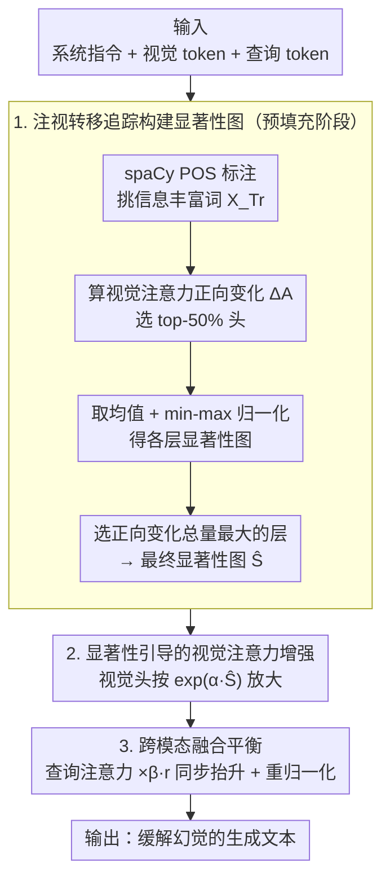

# Capturing Gaze Shifts for Guidance: Cross-Modal Fusion Enhancement for VLM Hallucination Mitigation

**会议**: ICML 2026  
**arXiv**: [2510.22067](https://arxiv.org/abs/2510.22067)  
**代码**: https://github.com/amazon-science/GIFT  
**领域**: 幻觉检测  
**关键词**: VLM幻觉缓解, 注意力转移, 跨模态融合, 视觉显著性, 推理时干预  

## 一句话总结
提出 GIFT 方法，通过追踪 VLM 在理解用户查询时视觉注意力的正向变化（"注视转移"）构建视觉显著性图，并在解码阶段同时增强视觉和查询 token 的注意力以保持跨模态融合平衡，在 CHAIR 上最高提升 20.7%，且仅增加 1.13× 延迟。

## 研究背景与动机

**领域现状**：视觉语言模型（VLM）在视觉问答、图像描述等任务中取得显著进展，但仍然容易产生幻觉——生成无法被文本或视觉输入支撑的内容。这在医学、自动驾驶、机器人等高风险领域构成严重威胁。

**现有痛点**：已有研究发现幻觉的主要原因是 VLM 过度依赖语言先验而忽略视觉输入。现有推理时缓解方法主要分为三类：对比解码（需要生成对比分布，计算开销大）、视觉输入修改（需要额外前向传播）、注意力引导（如 VAF 按注意力得分比例放大视觉 token 注意力）。然而这些方法存在两个关键缺陷：一是忽略了**视觉注意力沉没**（visual attention sink）问题，即注意力被持续分配到与任务无关的视觉区域；二是仅增强视觉注意力而不调整查询 token 注意力，导致**跨模态融合失衡**。

**核心矛盾**：单纯放大视觉 token 注意力会同时放大错误区域的注意力，且削弱模型对用户查询的理解能力，无法同时解决注意力沉没、视觉贡献不足和跨模态融合失衡三个问题。

**本文目标**：设计一种推理时方法，能够（1）精确定位任务相关的视觉区域并过滤注意力沉没噪声；（2）同时增强视觉和查询 token 的注意力以维持跨模态融合平衡。

**切入角度**：受人类视觉启发——人在阅读问题时会动态转移"视线"来捕捉相关视觉信息。VLM 在处理查询中信息丰富的词（名词、动词、形容词等）时，视觉注意力会发生正向变化，追踪这种"注视转移"可以自然地滤除注意力沉没噪声（无关区域的注意力变化很小）。

**核心 idea**：通过追踪 VLM 处理查询时视觉注意力的正向变化来预计算显著性图，并在解码时用该图同时引导视觉和查询 token 的注意力增强。

## 方法详解

### 整体框架
GIFT 分为两个阶段：（1）预填充阶段，在模型处理用户查询时追踪视觉注意力的正向变化（"注视转移"），构建视觉显著性图；（2）解码阶段，利用显著性图在关键跨模态融合层同时增强视觉和查询 token 的注意力。输入为标准的 VLM 三元组（系统指令 $X_S$、视觉 token $X_V$、查询 token $X_T$），输出为缓解幻觉的生成文本。

### 关键设计

**1. 注视转移追踪构建显著性图：用注意力的「正向变化量」而非绝对值，天然滤掉注意力沉没**

现有注意力引导方法（如 VAF）按注意力绝对得分放大视觉 token，可注意力常被持续分配到任务无关区域（visual attention sink），放大视觉注意力也就连带放大了这些噪声。GIFT 换了个信号源：人在读问题时会动态转移视线去捕捉相关视觉信息，VLM 在处理查询里信息丰富的词时，视觉注意力也会发生正向变化——而无关区域几乎不产生这种变化。于是先用 spaCy POS 标注从查询里挑出信息丰富的词（NOUN/VERB/ADJ/ADV/NUM/PROPN）得到 token 集合 $X_{Tr}$，在每层选注意力累积正向变化最大的 top-50% 头 $\hat{\mathcal{H}}^l_{TrV}$，计算视觉注意力正向变化 $\Delta\mathbf{A}^l_{h,i,j}=\max(\mathbf{A}^l_{h,i,j}-\mathbf{A}^l_{h,i-1,j},0)$，对选定头和信息丰富 token 取均值得到显著性图 $\hat{\mathcal{S}^l}$ 并做 min-max 归一化，最后取正向变化总量最大的层作为最终图。只追正向变化、不看平均注意力，等于用微分信号替静态信号自动过滤沉没噪声——实验里 shift 方法的归一化显著性得分 11.92，是 static 方法（5.40）的 2.2 倍。

**2. 显著性引导的视觉注意力增强：用预算好的全局显著性图，而非当前步的逐步注意力**

拿到显著性图后，在选定的增强层 $\mathcal{L}$ 里对 top-50% 视觉注意力头 $\mathcal{H}^l_{OV}$ 把注意力按显著性放大：$\hat{\bm{A}}^l_{h,-1,j}=\bm{A}^l_{h,-1,j}\cdot\exp(\alpha\hat{\mathcal{S}}_j)$（$\alpha$ 为缩放因子），显著性图在归一化前先在 3 个标准差处截断以免过度聚焦单点。这里的关键是用预填充阶段算好的显著性图、而不是解码当前步的注意力得分——前者基于完整查询上下文给出全局视觉显著性视图，后者会重新引入逐步注意力里的沉没噪声。换句话说，把「看哪里」这件事在预填充时一次性定下来，解码时只管按这张图放大，避免边解码边被噪声带偏。

**3. 跨模态融合平衡：放大视觉注意力的同时按比例抬升查询注意力，防止「看对了却读错题」**

只放大视觉注意力有个隐患：视觉权重涨上去，模型对用户查询的相对注意力就被稀释，结果是关注了正确区域却误解了问题，跨模态融合失衡。GIFT 的补救是同步缩放——先算视觉注意力的增强比率 $r^l=\sum_{h,j}\hat{\bm{A}}^l_{h,-1,j}/\bm{A}^l_{h,-1,j}$，再把查询注意力头 $\mathcal{H}^l_{OT}$ 里的查询 token 注意力乘以 $\beta r^l$（$\beta$ 默认 1.0），最后对整个注意力矩阵重新归一化。增强层的挑选也有讲究：分析输出 token 对视觉和查询 token 的注意力比例，选中间层里两者趋势一致的层来动手。这个「视觉抬多少、查询就跟着抬多少」的同步缩放很简单却容易被忽略，正是它把原始的视觉-文本平衡保住，消融里完整 GIFT 比仅增强视觉最多再提升 25.4%。

## 实验关键数据

### 主实验

| 模型 | 方法 | CHAIR $C_s$↓ | CHAIR $C_i$↓ | POPE F1↑ | POPE Acc↑ | MMHal Hal↓ | MMHal Score↑ |
|------|------|-------------|-------------|----------|----------|------------|-------------|
| LLaVA-1.5 7B | Greedy | 50.2 | 15.4 | 82.4 | 79.5 | 65.2 | 2.22 |
| LLaVA-1.5 7B | VAF | 49.6 | 14.3 | 81.0 | 77.2 | 66.3 | 2.16 |
| LLaVA-1.5 7B | VCD | 52.2 | 16.3 | 80.9 | 77.7 | 60.5 | 2.37 |
| LLaVA-1.5 7B | **GIFT** | **39.8** | **10.6** | **83.8** | **81.9** | **57.3** | **2.48** |
| Qwen2-VL 7B | Greedy | 24.8 | 9.1 | 86.0 | 86.5 | 32.7 | 3.53 |
| Qwen2-VL 7B | **GIFT** | **21.2** | **7.7** | **86.8** | **86.9** | **27.5** | **3.58** |
| Qwen3-VL 8B | Greedy | 51.4 | 10.6 | 88.9 | 88.5 | 28.3 | 4.80 |
| Qwen3-VL 8B | **GIFT** | **49.4** | **9.3** | **89.1** | **88.7** | **26.4** | **4.84** |

### 消融实验

| 模型 | 配置 | MMHal Hal↓ | MMHal Score↑ | POPE F1↑ | POPE Acc↑ |
|------|------|------------|-------------|----------|----------|
| LLaVA-1.5 7B | Inc. V.（仅增强视觉） | 60.8 | 2.36 | 82.3 | 79.3 |
| LLaVA-1.5 7B | Cal. V.（仅校准分布） | 61.5 | 2.32 | 82.4 | 79.5 |
| LLaVA-1.5 7B | **GIFT（完整）** | **57.3** | **2.48** | **83.8** | **81.9** |
| Qwen2-VL 7B | Inc. V. | 35.2 | 3.41 | 85.3 | 86.0 |
| Qwen2-VL 7B | Cal. V. | 31.9 | 3.56 | 85.8 | 86.4 |
| Qwen2-VL 7B | **GIFT（完整）** | **27.5** | **3.58** | **86.8** | **86.9** |

### 关键发现
- 两个组件（视觉注意力增强 + 跨模态融合平衡）都不可或缺，完整 GIFT 比仅增强视觉注意力最多提升 25.4%
- GIFT 在通用视觉语言基准（MME、SEED）上性能与贪心解码持平，而多个基线方法出现性能下降
- GIFT 延迟仅为贪心解码的 1.13×，远低于 VCD（1.99×）和 VAR（11.10×）
- 增强层选择具有鲁棒性，多个中等范围配置均能取得良好效果
- LLM-based 信息丰富词提取比 POS tagging 更准确（MMHal幻觉率 52.6% vs 57.3%），但计算开销更大

## 亮点与洞察
- "注视转移"的类比非常巧妙：利用注意力的**正向变化量**而非绝对值来构建显著性图，本质上是用微分信号替代静态信号，自然过滤了注意力沉没噪声，且无需额外模块
- 跨模态融合平衡的设计值得借鉴：仅增强视觉注意力会破坏视觉-文本的注意力比例关系，按比例同步提升查询注意力是简单但容易被忽略的关键步骤。这种"同步缩放"思路可迁移到任何需要多模态平衡的注意力干预方法
- 显著性图提取层的选择是模型固有属性而非数据依赖：在不同数据集和不同随机种子下峰值层保持一致，说明 VLM 的视觉信息整合发生在固定的网络深度

## 局限与展望
- 当查询与图像无关或查询中大部分内容与视觉无关时，注视转移可能产生不准确的显著性图
- POS tagging 对信息丰富词的提取不够精确，LLM-based 方法更好但增加计算开销，轻量级分类器可能是折中方案
- 仅在 LLaVA-1.5 和 Qwen 系列上验证，未涵盖 InternVL 等其他架构
- 对多轮对话场景的适用性未做探讨，查询上下文更复杂时显著性图的质量需要验证

## 相关工作与启发
- **VAF** (ClearSight)：按当前步注意力得分比例放大视觉 token 注意力，但忽略注意力沉没和跨模态平衡
- **VAR**：识别视觉沉没 token 并重分配注意力，但不解决视觉贡献不足问题，且延迟高达 11.10×
- **VCD**：对比原始和扰动视觉输入的输出分布，需要生成对比输出，延迟 1.99×
- 注意力沉没现象在 LLM、ViT 和 VLM 中均有发现，本文的注视转移机制提供了一种新的规避思路

<!-- RELATED:START -->

## 相关论文

- [\[CVPR 2026\] Cross-Modal Attention Calibration for LVLM Hallucination Mitigation](../../CVPR2026/hallucination/cross-modal_attention_calibration_for_lvlm_hallucination_mitigation.md)
- [\[AAAI 2026\] InEx: Hallucination Mitigation via Introspection and Cross-Modal Multi-Agent Collaboration](../../AAAI2026/hallucination/inex_hallucination_mitigation_via_introspection_and_cross-mo.md)
- [\[ICML 2026\] TAG: Tangential Amplifying Guidance for Hallucination-Resistant Sampling](tag_tangential_amplifying_guidance_for_hallucination-resistant_sampling.md)
- [\[CVPR 2026\] MAD: Modality-Adaptive Decoding for Mitigating Cross-Modal Hallucinations in Multimodal Large Language Models](../../CVPR2026/hallucination/mad_modality-adaptive_decoding_for_mitigating_cross-modal_hallucinations_in_mult.md)
- [\[CVPR 2026\] MoD-DPO: Towards Mitigating Cross-modal Hallucinations in Omni LLMs using Modality Decoupled Preference Optimization](../../CVPR2026/hallucination/mod-dpo_towards_mitigating_cross-modal_hallucinations_in_omni_llms_using_modalit.md)

<!-- RELATED:END -->
